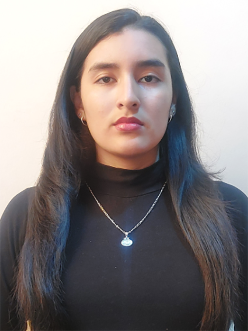
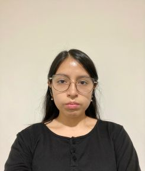
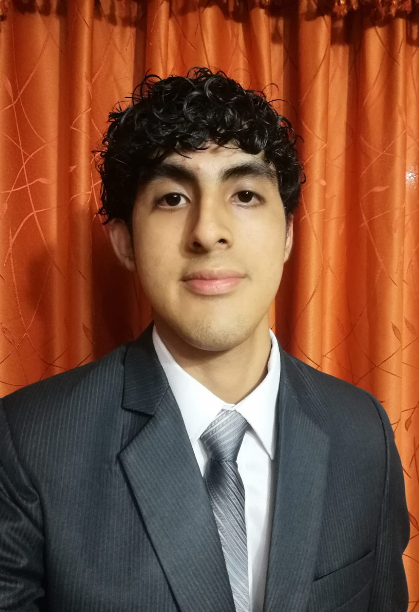
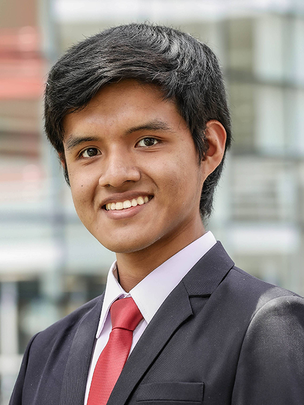

# CAPÍTULO I: INTRODUCCIÓN

## 1.1. Startup Profile

### 1.1.1. Descripción del Startup

### 1.1.2. Perfiles de integrantes del equipo

| Integrantes | Descripción |
| :--- | :--- |
|  | **Nombres y Apellidos:** Olenka Priscilla Del Aguila Del Aguila  **Código:** U202411669  **Carrera:** Ingeniería de Software  Soy una persona detallista y responsable, enfocada en la excelencia técnica y el cumplimiento de objetivos. Cuento con conocimientos en C++, Java, R y diseño de interfaces con Figma para crear prototipos funcionales. Me motiva el aprendizaje constante y el aporte de soluciones estéticas y funcionales, asegurando siempre un trabajo en equipo organizado, coherente y de alto impacto.|
|  | **Nombres y Apellidos:**  Angela Milagros Espinoza Cruz  **Código:** U202415495  **Carrera:** Ingeniería de Software  Soy una persona curiosa, creativa y resiliente, cualidades que me impulsan a aportar innovación en cada uno de mis trabajos. Cuento con conocimientos en Python, Figma y C++, además de experiencia en el diseño y desarrollo de páginas web. Me motiva el aprendizaje constante, la exploración de nuevas herramientas y la creación de soluciones innovadoras aplicadas a problemas existentes. Asimismo, considero que la proactividad y la comunicación asertiva son fundamentales para llevar a cabo los proyectos de manera efectiva.| 
|  | **Nombres y Apellidos:** Joel Fernando Mora Rivera  **Código:** U20241B227  **Carrera:** Ingeniería de Software  Soy una persona responsable, organizada y comprometida, con una actitud competitiva positiva que me impulsa a superar retos con constancia. Cuento con formación en C++, Python, Java y gestión de bases de datos relacionales y no relacionales, enfocándome en la innovación y optimización de procesos tecnológicos. Me apasiona el aprendizaje continuo y resolver desafíos técnicos que pongan a prueba mis habilidades. Además, priorizo el trabajo en equipo y la comunicación efectiva como motores fundamentales para alcanzar el éxito en cualquier proyecto. |
|  | **Nombres y Apellidos:** Rose Almendra Vergaray Calderon  **Código:** U20241D159  **Carrera:** Ingeniería de Software  Soy una persona responsable, creativa y detallista, cualidades que me impulsan a dar lo mejor de mí en cada proyecto. Cuento con conocimientos en Python, HTML, Java y un nivel intermedio en C++, además de experiencia en el diseño y programación de páginas web y en el manejo de bases de datos relacionales y no relacionales. Me motiva el aprendizaje constante, la exploración de nuevas herramientas y el desarrollo de soluciones innovadoras. Además, considero que el trabajo en equipo y la comunicación son esenciales para alcanzar metas y crecer tanto en lo personal como en lo profesional. |
|  |**Nombres y Apellidos:** Angel Martin Villarreal Bazan  **Código:** U202417857  **Carrera:** Ingeniería de Software Soy una persona proactiva y dedicada, enfocada en la mejora continua y el cumplimiento de objetivos. Cuento con sólidos conocimientos en C++ y Java, además de una fuerte base en lógica de programación para resolver problemas complejos. Me motiva el aprendizaje constante de nuevas tecnologías y el desafío de proyectos innovadores. Gracias a mi capacidad de organización y liderazgo, logro optimizar procesos y fomentar un entorno de trabajo colaborativo y eficiente.|

## 1.2. Solution Profile

### 1.2.1. Antecedentes y problemática

### 1.2.2. Lean UX Process

#### 1.2.2.1. Lean UX Problem Statements

#### 1.2.2.2. Lean UX Assumptions

#### 1.2.2.3. Lean UX Hypothesis Statements

#### 1.2.2.4. Lean UX Canvas

## 1.3. Segmentos Objetivo
