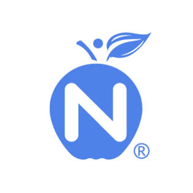
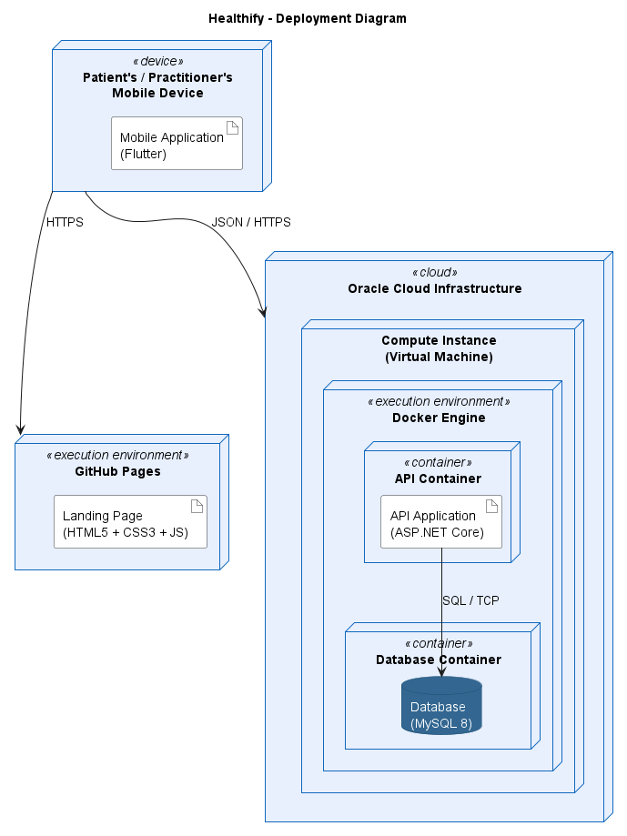

# CAPÍTULO II: REQUIREMENTS DEVELOPMENT AND SOFTWARE SOLUTION DESIGN

## 2.1. Competidores

El mercado de plataformas digitales de nutrición presenta una oferta consolidada tanto a nivel global como regional, con actores que abordan el seguimiento nutricional desde distintos ángulos, ya sea el expediente clínico, la gestión integral de la práctica profesional o el ajuste automático de metas para el consumidor final. Sin embargo, ninguno de los productos existentes combina el registro fotográfico del consumo con el contraste entre lo declarado por el paciente y su respuesta corporal dentro de un vínculo clínico supervisado, que es precisamente el espacio que Healthify busca ocupar. Tras un proceso de investigación del landscape competitivo, se identificaron tres competidores cuyas propuestas de valor se solapan parcial o totalmente con la de Healthify.

Nutrimind es un software de nutrición clínica en línea con fuerte penetración en Latinoamérica, incluido el Perú. Su propuesta central es el expediente clínico completo, la evaluación antropométrica y el diseño de planes alimentarios, complementado con una aplicación que permite al paciente registrar actividad física y adjuntar fotografías de sus comidas. Es la herramienta que el profesional entrevistado declara utilizar actualmente en su práctica, lo que confirma su adopción real dentro del segmento objetivo de Healthify.

Nutrium es una plataforma de gestión de la práctica nutricional con presencia internacional, dirigida a dietistas y nutricionistas. Integra la evaluación del paciente, la planificación de menús, la agenda de citas y la mensajería directa dentro de una aplicación móvil de seguimiento, ofreciendo así una solución integral para la administración diaria de la consulta profesional.

MacroFactor es una aplicación de seguimiento nutricional dirigida al consumidor final, sin intervención de un profesional de la salud. Su diferencial es un algoritmo adaptativo que estima el gasto energético total a partir de la relación entre la ingesta registrada y la tendencia de peso del usuario, ajustando las metas calóricas de forma semanal. Constituye un competidor indirecto relevante porque valida técnicamente el mismo mecanismo de contraste entre lo declarado y la respuesta corporal que Healthify incorpora, aunque prescindiendo por completo del profesional que en Healthify conserva la decisión clínica.

### 2.1.1. Análisis competitivo

<table>
<tr>
<th colspan="6" style="text-align:center;">Competitive Analysis Landscape</th>
</tr>
<tr>
<td colspan="2"><strong>¿Por qué llevar a cabo este análisis?</strong></td>
<td colspan="4">¿Qué resuelven actualmente las plataformas digitales de nutrición para el vínculo entre el nutricionista y su paciente, y en qué aspecto específico del periodo entre consultas puede Healthify diferenciarse de manera sostenible?</td>
</tr>
<tr>
<td colspan="2"> Nombre y Logo</td>
<td align="center"> <strong>Healthify</strong> <em></em></td>
<td align="center"> <strong>Nutrimind</strong> <em></em></td>
<td align="center"> <strong>Nutrium</strong> <em></em></td>
<td align="center"> <strong>MacroFactor</strong> <em></em></td>
</tr>
<tr>
<td rowspan="2">Perfil</td>
<td>Overview</td>
<td>Aplicación móvil que conecta al paciente en tratamiento nutricional con su nutricionista, enfocada en capturar de forma fiel el consumo diario durante el periodo que transcurre entre consultas.</td>
<td>Software de nutrición clínica en línea con amplia adopción entre profesionales de Latinoamérica, orientado a gestionar el expediente clínico, la antropometría y el diseño de planes alimentarios.</td>
<td>Plataforma de gestión de la práctica nutricional con presencia internacional, que integra evaluación, planificación de menús, agenda de citas y comunicación con el paciente en un solo lugar.</td>
<td>Aplicación de seguimiento nutricional dirigida al consumidor final, que ajusta de forma automática las metas calóricas mediante un algoritmo basado en la tendencia de peso del usuario.</td>
</tr>
<tr>
<td>Ventaja competitiva <em>¿Qué valor ofrece a los clientes?</em></td>
<td>Registra el consumo mediante fotografía con estimación asistida, protocoliza el autopesaje mostrando solo la tendencia y genera un índice de consistencia que el profesional interpreta sin juzgar al paciente.</td>
<td>Ofrece un expediente clínico completo y un cálculo dietético maduro, respaldados por una base de alimentos regionalizada y una adopción muy extendida entre profesionales latinoamericanos.</td>
<td>Integra la gestión completa de la práctica profesional en una sola plataforma, complementada con una aplicación móvil que facilita el diario de alimentos y la comunicación directa con el paciente.</td>
<td>Ajusta las metas energéticas con precisión mediante un algoritmo que aprende del comportamiento real del usuario, en lugar de aplicar fórmulas estáticas de cálculo calórico.</td>
</tr>
<tr>
<td rowspan="2">Perfil de Marketing</td>
<td>Mercado objetivo</td>
<td>Nutricionistas de clínica o centro de salud con carteras reducidas de pacientes, y pacientes adultos que siguen un tratamiento nutricional activo bajo seguimiento profesional vigente.</td>
<td>Nutriólogos, dietistas y estudiantes de nutrición que ejercen consulta clínica, deportiva o educativa en distintos países de Latinoamérica y España.</td>
<td>Nutricionistas y dietistas que gestionan una práctica presencial o en línea, distribuidos en un amplio número de países a nivel internacional.</td>
<td>Personas que siguen un proceso estructurado de pérdida de grasa o ganancia muscular, con perfil analítico y disposición a registrar su alimentación de forma constante.</td>
</tr>
<tr>
<td>Estrategias de marketing</td>
<td>Marketing de contenido en redes sociales dirigido de forma diferenciada a ambos segmentos, reforzado con alianzas con nutricionistas en ejercicio que actúan como puerta de entrada de sus pacientes.</td>
<td>Adopción institucional en universidades, clínicas y centros de nutrición, sostenida por la recomendación entre pares dentro de la comunidad profesional.</td>
<td>Presencia en directorios y plataformas de comparación de software profesional, con periodo de prueba gratuito como principal mecanismo de captación de nuevos usuarios.</td>
<td>Autoridad editorial construida sobre su vínculo con divulgadores de nutrición y entrenamiento basados en evidencia, reforzada con recomendación orgánica en comunidades especializadas.</td>
</tr>
<tr>
<td rowspan="3">Perfil de Producto</td>
<td>Productos &amp; Servicios</td>
<td>Aplicación móvil con dos experiencias según el rol, que incluye vinculación por código QR, evaluación y prescripción para el profesional, y registro por foto, autopesaje y expediente unificado para el paciente.</td>
<td>Expediente clínico, antropometría, cálculo de requerimientos, diseño de planes por equivalentes, base de alimentos y aplicación de seguimiento para el paciente.</td>
<td>Evaluación nutricional, planificación de menús con recetario, agenda de citas, mensajería segura y aplicación móvil de seguimiento para el paciente.</td>
<td>Registro de ingesta con base de datos verificada y lector de código de barras, cálculo adaptativo del gasto energético y analítica detallada de adherencia.</td>
</tr>
<tr>
<td>Precios &amp; Costos</td>
<td>No aplica en el alcance actual del proyecto, dado que el equipo decidió que la definición de un modelo de precios queda fuera de esta etapa de trabajo.</td>
<td>Modelo de pago único por licencia, sin suscripción recurrente, con funciones adicionales disponibles mediante suscripción opcional.</td>
<td>Modelo de suscripción mensual o anual dirigido al profesional, con periodo de prueba gratuito previo a la contratación del servicio.</td>
<td>Suscripción de once dólares con noventa y nueve centavos al mes o setenta y un dólares con noventa y nueve centavos al año, sin plan gratuito permanente.</td>
</tr>
<tr>
<td>Canales de distribución <em>(Web y/o Móvil)</em></td>
<td>Aplicación móvil nativa como canal principal para ambos roles, dado que las funcionalidades diferenciales dependen de la cámara y del funcionamiento sin conexión.</td>
<td>Plataforma en línea accesible desde navegador, complementada con una aplicación móvil de seguimiento para el paciente.</td>
<td>Plataforma web para el profesional y aplicación móvil para el paciente, disponible en las principales tiendas de aplicaciones.</td>
<td>Aplicación móvil disponible en las tiendas de iOS y Android como canal exclusivo de distribución.</td>
</tr>
<tr>
<td rowspan="5">Análisis SWOT</td>
<td colspan="5">Realice esto para su startup y sus competidores. Sus fortalezas deberían apoyar sus oportunidades y contribuir a lo que ustedes definen como su posible ventaja competitiva.</td>
</tr>
<tr>
<td>Fortalezas</td>
<td>La captura entre consultas es el núcleo del producto y no un módulo accesorio. El registro por fotografía reduce el costo de reportar frente al relato verbal actual, y el funcionamiento sin conexión permite registrar en el momento del consumo.</td>
<td>Base instalada muy amplia entre profesionales latinoamericanos y familiaridad consolidada con la herramienta, confirmada por el propio profesional entrevistado. Profundidad del cálculo dietético y de la evaluación antropométrica.</td>
<td>Integración completa de la gestión profesional en una sola plataforma, con alcance internacional y una aplicación móvil que reduce la dispersión de la comunicación con el paciente.</td>
<td>Precisión superior en el ajuste de metas energéticas gracias al aprendizaje sobre datos reales del usuario, con una interfaz depurada y libre de elementos de gamificación.</td>
</tr>
<tr>
<td>Debilidades</td>
<td>Marca sin reconocimiento previo y sin base instalada frente a competidores consolidados. La estimación por fotografía es aproximada y no clínica, y la adopción depende de que el profesional invite primero al paciente.</td>
<td>El periodo entre consultas sigue dependiendo del relato del paciente, sin un mecanismo que contraste lo declarado con la respuesta corporal observable.</td>
<td>Comparte con Nutrimind la dependencia del relato del paciente entre consultas, y su enfoque integral la aleja del problema específico de la calidad del dato de ingesta.</td>
<td>Ausencia total del profesional en el circuito y sin registro mediante fotografía, lo que traslada al usuario toda la carga de la búsqueda manual de alimentos.</td>
</tr>
<tr>
<td>Oportunidades</td>
<td>El seguimiento actual se apoya en canales no diseñados para ese fin, y la disposición del paciente a registrar mediante fotografía valida el mecanismo central de la propuesta.</td>
<td>Ampliar su aplicación de seguimiento hacia mecanismos de contraste entre lo declarado y la respuesta corporal, aprovechando su base instalada de profesionales.</td>
<td>Expandirse hacia mercados latinoamericanos donde su presencia es menor que la de Nutrimind, profundizando la adherencia mediante su aplicación para el paciente.</td>
<td>Incorporar una figura profesional dentro del circuito y adoptar el registro por fotografía para reducir la fricción del registro manual actual.</td>
</tr>
<tr>
<td>Amenazas</td>
<td>Nutrimind y Nutrium podrían incorporar un índice de consistencia sobre las fotografías que ya reciben, y la adopción depende de un profesional conforme con su herramienta actual.</td>
<td>Aparición de soluciones enfocadas específicamente en el periodo entre consultas que desplacen su aplicación de seguimiento hacia un rol secundario.</td>
<td>Competencia directa de Nutrimind en el mercado latinoamericano, donde este último cuenta con una adopción superior entre profesionales.</td>
<td>Regulaciones más estrictas sobre recomendaciones de salud sin intervención profesional, y entrada de plataformas que combinen precisión algorítmica con supervisión clínica.</td>
</tr>
</table>

### 2.1.2. Estrategias y tácticas frente a competidores

El análisis competitivo revela que los actores establecidos poseen ventajas claras en base instalada de profesionales, profundidad del expediente clínico y familiaridad con su herramienta. Sin embargo, ninguno ha resuelto la fidelidad del dato capturado durante el periodo que transcurre entre una consulta y la siguiente, que constituye el espacio diferencial que Healthify busca ocupar.

**Frente a Nutrimind: convivir antes que desplazar**

Nutrimind es la herramienta que el profesional entrevistado utiliza actualmente y respecto de la cual no manifiesta insatisfacción. Desplazarla exigiría igualar años de desarrollo de expediente clínico y cálculo dietético, esfuerzo que no resulta viable ni necesario en esta etapa. El posicionamiento apunta a que Healthify se integre como la pieza que resuelve el periodo que Nutrimind no cubre. Como táctica concreta, la comunicación dirigida al profesional se construirá alrededor de una pregunta que su herramienta actual no puede responder, referida a qué comió realmente el paciente durante las semanas previas a la consulta. El contenido en redes sociales ilustrará escenarios donde un paciente no progresa sin causa aparente, mostrando de qué manera un índice de consistencia ofrece una señal previa a esa situación. Paralelamente, el proceso de vinculación mediante código QR se diseñará para integrarse al flujo de trabajo existente sin exigir la migración de información histórica.

**Frente a Nutrium: competir en profundidad y no en amplitud**

Igualar la amplitud de Nutrium en gestión de agenda, planificación y comunicación no resulta estratégicamente necesario. La apuesta es profundizar de manera deliberada en un solo problema y resolverlo con un nivel de calidad que una plataforma de propósito general difícilmente alcanza. En términos tácticos, se comunicará de forma explícita el conjunto de decisiones de diseño que sostienen la calidad del dato, tales como la exhibición permanente de la confianza y la procedencia de cada estimación, la separación entre la ausencia de registro y el incumplimiento del plan, y la existencia de un mecanismo mediante el cual el paciente reporta un consumo fuera del plan sin recibir penalización visual alguna.

**Frente a MacroFactor: reubicar el algoritmo dentro del vínculo clínico**

MacroFactor demuestra que el contraste entre ingesta declarada y tendencia de peso es técnicamente viable, pero lo aplica prescindiendo por completo del profesional. Healthify no compite por el mismo usuario, dado que su segmento se define por la existencia de un tratamiento supervisado vigente. La estrategia consiste en apropiarse del mecanismo sin apropiarse de su filosofía, comunicando con claridad la distinción entre automatizar lo mecánico y automatizar el juicio clínico. El sistema propone metas mediante un cálculo determinista y auditable, mientras que el profesional acepta o sobrescribe con una razón que queda registrada, en línea con la afirmación del propio nutricionista entrevistado de que cada plan debe ser individualizado.

**Estrategia transversal en redes sociales**

Dado que el modelo de adopción de Healthify es asimétrico, ya que el paciente solo ingresa cuando el profesional lo invita, la estrategia en redes sociales opera en dos frentes diferenciados. El frente dirigido al segmento profesional se orienta a comunidades de nutricionistas, con contenido centrado en la calidad del dato de ingesta y en la interpretación de la brecha entre lo declarado y la respuesta corporal, priorizando la construcción de autoridad técnica antes que la promoción de funcionalidades. El frente dirigido al segmento de pacientes se orienta a plataformas de consumo masivo, contrastando la práctica actual de enviar fotografías y redactar explicaciones por mensajería con la posibilidad de registrar mediante un solo toque, con el propósito de generar demanda hacia el profesional. Como táctica de refuerzo se contempla el establecimiento de alianzas con nutricionistas en ejercicio y con centros de salud, quienes actúan simultáneamente como usuarios del segmento profesional y como canal de acceso a sus propias carteras de pacientes.

## 2.2. Entrevistas

### 2.2.1. Diseño de entrevistas

### 2.2.2. Registro de entrevistas

### 2.2.3. Análisis de entrevistas

## 2.3. Needfinding

Con el propósito de comprender de manera integral las necesidades, comportamientos y motivaciones de los usuarios de Healthify, se llevó a cabo un proceso de investigación cualitativa mediante entrevistas dirigidas a representantes de cada uno de los segmentos objetivo. Estas interacciones permitieron explorar la manera en que la información del tratamiento nutricional circula actualmente entre el profesional y su paciente, las dificultades asociadas al registro del consumo durante el periodo entre consultas y las limitaciones de los canales que ambas partes emplean hoy para sostener ese seguimiento. El proceso permitió reconocer tanto necesidades explícitas como implícitas, estableciendo una base sustentada en evidencia para el diseño de una solución centrada en el usuario.

### 2.3.1. User Personas

Esta sección presenta las fichas de User Persona elaboradas en UXPressia, una por cada segmento objetivo identificado. Los arquetipos se construyen a partir de las características observadas en el análisis de entrevistas y se articulan con los hallazgos del análisis competitivo. En particular, ambos arquetipos reflejan la limitación estructural detectada en las plataformas existentes, consistente en que el periodo entre consultas depende de lo que el paciente recuerda y decide reportar. El primer arquetipo representa al nutricionista de clínica o centro de salud que conduce el tratamiento, mientras que el segundo representa a la persona en tratamiento nutricional activo. 

#### Segmento 1: Nutricionista

#### Segmento 2: Paciente en tratamiento nutricional activo

### 2.3.2. User Task Matrix

Esta sección presenta el User Task Matrix correspondiente a los dos segmentos objetivo de Healthify, representados respectivamente por Willyan Guerrero, en su condición de nutricionista de centro de salud, y por Evelyn del Águila, en su condición de paciente en tratamiento nutricional activo. La matriz concentra las tareas que ambos arquetipos realizan actualmente para cumplir sus objetivos, con independencia de la existencia de la solución propuesta. Para cada tarea se consigna la frecuencia con que se ejecuta y la importancia que reviste para el usuario correspondiente.

#### Segmento 1: Nutricionista

<table>
<tr>
<th rowspan="2">Task</th>
<th colspan="2">Willyan Guerrero</th>
<th colspan="2">Entrevistado 2</th>
<th colspan="2">Entrevistado 3</th>
</tr>
<tr>
<th>Frequency</th><th>Importance</th><th>Frequency</th><th>Importance</th><th>Frequency</th><th>Importance</th>
</tr>
<tr>
<td>Evaluar nutricionalmente al paciente mediante entrevista y mediciones</td>
<td>Siempre</td><td>Alta</td><td>Pendiente</td><td>Pendiente</td><td>Pendiente</td><td>Pendiente</td>
</tr>
<tr>
<td>Establecer el diagnóstico nutricional</td>
<td>Siempre</td><td>Alta</td><td>Pendiente</td><td>Pendiente</td><td>Pendiente</td><td>Pendiente</td>
</tr>
<tr>
<td>Diseñar el plan de alimentación individualizado</td>
<td>Siempre</td><td>Alta</td><td>Pendiente</td><td>Pendiente</td><td>Pendiente</td><td>Pendiente</td>
</tr>
<tr>
<td>Realizar el monitoreo del paciente entre consultas</td>
<td>Siempre</td><td>Alta</td><td>Pendiente</td><td>Pendiente</td><td>Pendiente</td><td>Pendiente</td>
</tr>
<tr>
<td>Reconstruir los hábitos de consumo del periodo transcurrido</td>
<td>Siempre</td><td>Alta</td><td>Pendiente</td><td>Pendiente</td><td>Pendiente</td><td>Pendiente</td>
</tr>
<tr>
<td>Ajustar el plan alimentario sin cita presencial</td>
<td>Normalmente</td><td>Alta</td><td>Pendiente</td><td>Pendiente</td><td>Pendiente</td><td>Pendiente</td>
</tr>
<tr>
<td>Solicitar u otorgar equivalencias o reemplazos de alimentos</td>
<td>Normalmente</td><td>Alta</td><td>Pendiente</td><td>Pendiente</td><td>Pendiente</td><td>Pendiente</td>
</tr>
<tr>
<td>Verificar el grado de cumplimiento del plan alimentario</td>
<td>Normalmente</td><td>Alta</td><td>Pendiente</td><td>Pendiente</td><td>Pendiente</td><td>Pendiente</td>
</tr>
<tr>
<td>Programar la siguiente consulta de seguimiento</td>
<td>Siempre</td><td>Alta</td><td>Pendiente</td><td>Pendiente</td><td>Pendiente</td><td>Pendiente</td>
</tr>
<tr>
<td>Derivar al paciente a otra especialidad ante ausencia de progreso</td>
<td>A veces</td><td>Media</td><td>Pendiente</td><td>Pendiente</td><td>Pendiente</td><td>Pendiente</td>
</tr>
<tr>
<td>Compartir o revisar los resultados de análisis bioquímicos</td>
<td>A veces</td><td>Alta</td><td>Pendiente</td><td>Pendiente</td><td>Pendiente</td><td>Pendiente</td>
</tr>
<tr>
<td>Controlar el peso corporal del paciente de forma periódica</td>
<td>A veces</td><td>Media</td><td>Pendiente</td><td>Pendiente</td><td>Pendiente</td><td>Pendiente</td>
</tr>
</table>

#### Segmento 2: Paciente en tratamiento nutricional activo

<table>
<tr>
<th rowspan="2">Task</th>
<th colspan="2">Evelyn del Águila</th>
<th colspan="2">Entrevistado 2</th>
<th colspan="2">Entrevistado 3</th>
</tr>
<tr>
<th>Frequency</th><th>Importance</th><th>Frequency</th><th>Importance</th><th>Frequency</th><th>Importance</th>
</tr>
<tr>
<td>Registrar y comunicar lo consumido en cada comida</td>
<td>Siempre</td><td>Alta</td><td>Pendiente</td><td>Pendiente</td><td>Pendiente</td><td>Pendiente</td>
</tr>
<tr>
<td>Consultar el plan alimentario prescrito antes de preparar los alimentos</td>
<td>Siempre</td><td>Alta</td><td>Pendiente</td><td>Pendiente</td><td>Pendiente</td><td>Pendiente</td>
</tr>
<tr>
<td>Verificar el grado de cumplimiento del plan alimentario</td>
<td>Siempre</td><td>Alta</td><td>Pendiente</td><td>Pendiente</td><td>Pendiente</td><td>Pendiente</td>
</tr>
<tr>
<td>Reportar el consumo de alimentos ajenos al plan</td>
<td>A veces</td><td>Alta</td><td>Pendiente</td><td>Pendiente</td><td>Pendiente</td><td>Pendiente</td>
</tr>
<tr>
<td>Controlar el peso corporal de forma periódica</td>
<td>Normalmente</td><td>Media</td><td>Pendiente</td><td>Pendiente</td><td>Pendiente</td><td>Pendiente</td>
</tr>
<tr>
<td>Solicitar equivalencias o reemplazos de alimentos</td>
<td>A veces</td><td>Media</td><td>Pendiente</td><td>Pendiente</td><td>Pendiente</td><td>Pendiente</td>
</tr>
<tr>
<td>Compartir los resultados de análisis bioquímicos</td>
<td>A veces</td><td>Alta</td><td>Pendiente</td><td>Pendiente</td><td>Pendiente</td><td>Pendiente</td>
</tr>
<tr>
<td>Reconstruir los hábitos de consumo del periodo transcurrido en la consulta de seguimiento</td>
<td>A veces</td><td>Media</td><td>Pendiente</td><td>Pendiente</td><td>Pendiente</td><td>Pendiente</td>
</tr>
<tr>
<td>Programar la siguiente consulta de seguimiento</td>
<td>A veces</td><td>Media</td><td>Pendiente</td><td>Pendiente</td><td>Pendiente</td><td>Pendiente</td>
</tr>
</table>

### Análisis de User Task Matrix

El análisis de la matriz permite identificar patrones diferenciados en el comportamiento de ambos segmentos y extraer conclusiones directamente aplicables al diseño de la solución.

En el segmento profesional, las tareas críticas se concentran en las cuatro fases del proceso de atención nutricional, con particular intensidad en el monitoreo entre consultas y en la reconstrucción de los hábitos de consumo del periodo transcurrido. Esta última tarea reviste especial interés analítico, ya que el profesional la ejecuta siempre y le atribuye importancia alta, pero la realiza mediante una entrevista retrospectiva que depende por completo de lo que el paciente recuerda y decide contar. La matriz expone así, en términos de tareas observables, la limitación estructural que el análisis competitivo identificó en las plataformas existentes.

En el segmento de pacientes, las tareas de mayor frecuencia e importancia se concentran en el registro y la comunicación de lo consumido, en la consulta del plan prescrito y en la verificación del cumplimiento. La entrevista evidencia que estas tres tareas se ejecutan de forma diaria y que la paciente les asigna una relevancia alta, dado que constituyen la evidencia sobre la cual su nutricionista evalúa la intervención. Resulta especialmente significativo que el reporte de consumos ajenos al plan, aun cuando presenta una frecuencia menor, mantenga una importancia alta, lo que revela que la paciente no busca ocultar dichos episodios sino disponer de un medio ágil para comunicarlos.

Al comparar ambos segmentos, se identifican similitudes relevantes. En ambos casos existe una alta importancia asignada a la verificación del cumplimiento del plan y al intercambio de información derivada de análisis bioquímicos, aunque cada arquetipo la aborde con una granularidad distinta, ya que el profesional la valora sobre la escala del tratamiento mientras que la paciente la evalúa día a día. Asimismo, el otorgamiento y la solicitud de equivalencias constituye una tarea genuinamente compartida que hoy se resuelve mediante intercambios de mensajería sin registro estructurado. Sin embargo, ambos segmentos difieren en su enfoque predominante, ya que el profesional concentra su comportamiento en tareas de interpretación y decisión clínica, mientras que la paciente concentra el suyo en tareas de captura y comunicación del dato. Esta separación no constituye una limitación del análisis sino un principio de diseño explícito del proyecto, según el cual el paciente registra la realidad y el nutricionista la interpreta.

A partir de ello se derivan insights clave para el diseño de Healthify. En primer lugar, la reconstrucción retrospectiva de hábitos que hoy realiza el profesional debe ser sustituida por información capturada en el momento del consumo, dado que constituye la tarea de mayor importancia con menor confiabilidad actual. En segundo lugar, la tarea de registrar debe resultar menos costosa que la de omitir, dado que su frecuencia diaria la convierte en el principal punto de fricción del segmento de pacientes. En tercer lugar, las tareas compartidas entre ambos segmentos, como el otorgamiento de equivalencias y el intercambio de resultados bioquímicos, requieren un espacio común de registro que hoy no existe, dado que ambos arquetipos las resuelven mediante canales de comunicación que no fueron concebidos para conservar información clínica.

En conjunto, estos hallazgos orientan el desarrollo de Healthify hacia una solución que capture el consumo en tiempo real desde el segmento de pacientes y que traduzca esa captura en información interpretable para el segmento profesional, sustituyendo así la dependencia actual del relato y la memoria por evidencia verificable a lo largo de todo el periodo de tratamiento.

### 2.3.3. User Journey Mapping

Esta sección presenta los User Journey Maps elaborados en UXPressia, uno por cada User Persona identificado. Los diagramas corresponden a la versión As Is, es decir, ilustran el recorrido que cada segmento experimenta actualmente en la situación previa a la existencia de Healthify. El recorrido representado abarca el ciclo completo del tratamiento nutricional, desde el momento en que se establece el vínculo entre el profesional y su paciente hasta la consulta de seguimiento en la que se evalúa el progreso alcanzado. La intención de estos mapas es exponer los puntos de fricción que se producen específicamente durante el periodo que transcurre entre una consulta y la siguiente, que constituye el foco del problema abordado por el proyecto.

#### Segmento 1: Nutricionista

#### Segmento 2: Paciente en tratamiento nutricional activo

### 2.3.4. Empathy Mapping

Esta sección presenta los Empathy Maps elaborados en UXPressia para cada uno de los User Personas identificados. El proceso de elaboración se inició con la preparación de la sesión colaborativa, en la cual el equipo situó al User Persona correspondiente en el centro del artefacto y distribuyó en cada cuadrante las observaciones derivadas del análisis de entrevistas. El trabajo se orientó a responder las preguntas guía relativas a con quién se está empatizando, qué necesita hacer el usuario, qué está diciendo, qué está viendo, qué está haciendo, qué está escuchando y cómo se siente y qué piensa. Finalmente se identificaron los dolores y las ganancias a partir de las preguntas referidas a qué le preocupa, qué puede contribuir a resolver sus problemas y qué puede convencerlo de que la propuesta constituye la alternativa correcta.

#### Segmento 1: Nutricionista

#### Segmento 2: Paciente en tratamiento nutricional activo

### 2.3.5. Big Picture EventStorming

### 2.3.6. Ubiquitous Language

## 2.4. Requirements Specification

### 2.4.1. User Stories

En esta sección se presentan las User Stories, Technical Stories y Spike Stories identificadas para Healthify a partir de las necesidades de los segmentos objetivo y de los requisitos funcionales y técnicos de la solución. Las User Stories describen las capacidades que permiten al Paciente y al Nutricionista realizar el seguimiento del tratamiento nutricional, así como las funcionalidades transversales de acceso a la plataforma y aquellas dirigidas al Visitante mediante el Landing Page.

Adicionalmente, se consideran Technical Stories para representar capacidades técnicas necesarias para soportar las funcionalidades del producto que no corresponden a una interacción directa con los usuarios finales. Finalmente, se incluyen Spike Stories destinadas a reducir la incertidumbre asociada con componentes cuya viabilidad, integración o reglas requieren investigación previa a su implementación.

Los criterios de aceptación se expresan mediante escenarios Given–When–Then y describen comportamientos verificables del sistema sin establecer detalles específicos de presentación de la interfaz.

| Epic ID | Title | Description |
|---|---|---|
| **EP01** | Gestión de la Relación de Cuidado | Agrupa las capacidades necesarias para establecer, mantener y finalizar el vínculo entre un Paciente y un Nutricionista, incluyendo invitaciones, consentimiento y control del acceso a la información. |
| **EP02** | Gestión de Ingesta Alimentaria | Agrupa las funcionalidades relacionadas con el registro de alimentos consumidos mediante fotografía, estimación de porciones, registro manual y declaración de consumos fuera del plan. |
| **EP03** | Seguimiento de Respuesta Corporal | Comprende el registro de autopesajes y el seguimiento de la evolución corporal del Paciente durante el tratamiento nutricional. |
| **EP04** | Monitoreo y Seguimiento del Plan Nutricional | Agrupa las capacidades destinadas a evaluar cómo el paciente sigue el plan nutricional, calcular el cumplimiento diario, identificar señales de consistencia y apoyar la revisión profesional. |
| **EP05** | Expediente y Continuidad del Cuidado | Comprende la consulta consolidada de la información del tratamiento y el registro de acciones que permiten mantener la continuidad de la atención. |
| **EP06** | Evaluación y Diagnóstico Nutricional | Agrupa el registro de evaluaciones, mediciones clínicas y diagnósticos nutricionales realizados por el Nutricionista. |
| **EP07** | Prescripción y Gestión del Plan Nutricional | Comprende el cálculo de metas, la publicación del plan nutricional y el control de sus ajustes y versiones durante el tratamiento. |
| **EP08** | Identidad y Acceso | Agrupa las capacidades relacionadas con creación de cuentas, autenticación, autorización y administración de sesiones. |
| **EP09** | Offline y Sincronización | Comprende la continuidad del registro cuando no existe conectividad y la posterior sincronización segura de los datos. |
| **EP10** | Landing Page | Agrupa las funcionalidades públicas destinadas a presentar Healthify, informar sobre sus capacidades y facilitar el acceso y contacto con la solución. |
| **EP_TS** | RESTful API — Technical Stories | Agrupa las Technical Stories necesarias para implementar los servicios RESTful que soportan las funcionalidades de Healthify y permiten la comunicación entre las aplicaciones cliente y el backend. |
| **EP_SS** | Spike Stories | Agrupa las investigaciones, análisis y pruebas de viabilidad técnica necesarias para reducir incertidumbre antes de implementar funcionalidades o integraciones de Healthify. |

### EP01 — Gestión de la Relación de Cuidado

 ***US01 — Vinculación mediante invitación QR***
<table>
  <tr>
    <th colspan="2">Story ID</th>
    <th colspan="2">User</th>
    <th colspan="2">Priority</th>
    <th colspan="2">Epic</th>
  </tr>
  <tr>
    <td colspan="2">US01</td>
    <td colspan="2">Paciente</td>
    <td colspan="2">Alta</td>
    <td colspan="2">EP01</td>
  </tr>
  <tr>
    <th colspan="2">Title</th>
    <td colspan="6">Vinculación mediante invitación QR</td>
  </tr>
  <tr>
    <th colspan="8">Description</th>
  </tr>
  <tr>
    <td colspan="8">Como paciente, deseo utilizar la invitación generada por mi nutricionista para vincularme con él en Healthify, para que mi tratamiento pueda ser gestionado y monitoreado de manera autorizada.</td>
  </tr>
  <tr>
    <th colspan="8">Acceptance Criteria</th>
  </tr>
  <tr>
    <td colspan="8"><strong>Escenario 1: Vinculación exitosa</strong> Dado que el paciente posee una invitación válida y vigente emitida por un nutricionista Cuando el paciente utiliza la invitación Entonces el sistema establece el vínculo entre ambas cuentas.  <strong>Escenario 2: Invitación vencida</strong> Dado que el paciente posee una invitación que ha superado su periodo de vigencia Cuando el paciente intenta utilizarla Entonces el sistema rechaza la vinculación e identifica la invitación como vencida.  <strong>Escenario 3: Invitación previamente utilizada</strong> Dado que el paciente dispone de una invitación que ya ha sido utilizada Cuando el paciente intenta utilizar nuevamente la invitación Entonces el sistema rechaza la operación y conserva el vínculo previamente establecido.</td>
  </tr>
</table>

 ***US02 — Otorgamiento de consentimiento para compartir información***
<table>
  <tr>
    <th colspan="2">Story ID</th>
    <th colspan="2">User</th>
    <th colspan="2">Priority</th>
    <th colspan="2">Epic</th>
  </tr>
  <tr>
    <td colspan="2">US02</td>
    <td colspan="2">Paciente</td>
    <td colspan="2">Alta</td>
    <td colspan="2">EP01</td>
  </tr>
  <tr>
    <th colspan="2">Title</th>
    <td colspan="6">Otorgamiento de consentimiento para compartir información</td>
  </tr>
  <tr>
    <th colspan="8">Description</th>
  </tr>
  <tr>
    <td colspan="8">Como paciente, deseo otorgar mi consentimiento para compartir con mi nutricionista la información necesaria de mi tratamiento, para mantener el control sobre el acceso profesional a mis datos.</td>
  </tr>
  <tr>
    <th colspan="8">Acceptance Criteria</th>
  </tr>
  <tr>
    <td colspan="8"><strong>Escenario 1: Consentimiento otorgado</strong> Dado que el paciente tiene un vínculo de cuidado pendiente de autorización Cuando el paciente otorga su consentimiento Entonces el sistema registra el consentimiento vigente asociado al vínculo.  <strong>Escenario 2: Acceso con consentimiento vigente</strong> Dado que el paciente mantiene un vínculo de cuidado activo y ha otorgado su consentimiento Cuando el nutricionista solicita acceder a la información autorizada del paciente Entonces el sistema permite el acceso según los permisos correspondientes.  <strong>Escenario 3: Ausencia de consentimiento</strong> Dado que el paciente mantiene un vínculo de cuidado sin consentimiento vigente Cuando el nutricionista solicita acceder a información protegida del paciente Entonces el sistema rechaza el acceso.</td>
  </tr>
</table>

 ***US03 — Revocación del consentimiento***
<table>
  <tr>
    <th colspan="2">Story ID</th>
    <th colspan="2">User</th>
    <th colspan="2">Priority</th>
    <th colspan="2">Epic</th>
  </tr>
  <tr>
    <td colspan="2">US03</td>
    <td colspan="2">Paciente</td>
    <td colspan="2">Media</td>
    <td colspan="2">EP01</td>
  </tr>
  <tr>
    <th colspan="2">Title</th>
    <td colspan="6">Revocación del consentimiento</td>
  </tr>
  <tr>
    <th colspan="8">Description</th>
  </tr>
  <tr>
    <td colspan="8">Como paciente, deseo revocar el consentimiento otorgado para el acceso a mi información, para conservar el control sobre los datos compartidos durante mi tratamiento.</td>
  </tr>
  <tr>
    <th colspan="8">Acceptance Criteria</th>
  </tr>
  <tr>
    <td colspan="8"><strong>Escenario 1: Revocación exitosa</strong> Dado que el paciente mantiene un consentimiento vigente Cuando el paciente revoca el consentimiento Entonces el sistema registra el consentimiento como no vigente.  <strong>Escenario 2: Acceso posterior a la revocación</strong> Dado que el paciente ha revocado previamente el consentimiento asociado al vínculo Cuando el nutricionista solicita acceder a nueva información protegida del paciente Entonces el sistema rechaza el acceso autorizado por dicho consentimiento.</td>
  </tr>
</table>

 ***US04 — Generación de invitación QR para un nuevo paciente***
<table>
  <tr>
    <th colspan="2">Story ID</th>
    <th colspan="2">User</th>
    <th colspan="2">Priority</th>
    <th colspan="2">Epic</th>
  </tr>
  <tr>
    <td colspan="2">US04</td>
    <td colspan="2">Nutricionista</td>
    <td colspan="2">Alta</td>
    <td colspan="2">EP01</td>
  </tr>
  <tr>
    <th colspan="2">Title</th>
    <td colspan="6">Generación de invitación QR para un nuevo paciente</td>
  </tr>
  <tr>
    <th colspan="8">Description</th>
  </tr>
  <tr>
    <td colspan="8">Como nutricionista, deseo generar una invitación para un paciente, para iniciar de forma controlada el proceso de vinculación en Healthify.</td>
  </tr>
  <tr>
    <th colspan="8">Acceptance Criteria</th>
  </tr>
  <tr>
    <td colspan="8"><strong>Escenario 1: Invitación generada</strong> Dado que el nutricionista se encuentra autorizado Cuando el nutricionista solicita una nueva invitación Entonces el sistema genera una invitación única asociada al nutricionista y con vigencia limitada.  <strong>Escenario 2: Invitación utilizada</strong> Dado que el nutricionista ha generado una invitación que fue canjeada correctamente Cuando el nutricionista consulta el estado de la invitación Entonces el sistema informa que la invitación ya fue utilizada.  <strong>Escenario 3: Reutilización</strong> Dado que el nutricionista dispone de una invitación que ya fue utilizada Cuando el nutricionista intenta utilizar nuevamente esa invitación para vincular a otro paciente Entonces el sistema rechaza el nuevo canje de la invitación.</td>
  </tr>
</table>

 ***US05 — Consulta de pacientes con vínculo activo***
<table>
  <tr>
    <th colspan="2">Story ID</th>
    <th colspan="2">User</th>
    <th colspan="2">Priority</th>
    <th colspan="2">Epic</th>
  </tr>
  <tr>
    <td colspan="2">US05</td>
    <td colspan="2">Nutricionista</td>
    <td colspan="2">Alta</td>
    <td colspan="2">EP01</td>
  </tr>
  <tr>
    <th colspan="2">Title</th>
    <td colspan="6">Consulta de pacientes con vínculo activo</td>
  </tr>
  <tr>
    <th colspan="8">Description</th>
  </tr>
  <tr>
    <td colspan="8">Como nutricionista, deseo consultar los pacientes con los que mantengo un vínculo de cuidado activo, para acceder al seguimiento de los tratamientos que tengo a cargo.</td>
  </tr>
  <tr>
    <th colspan="8">Acceptance Criteria</th>
  </tr>
  <tr>
    <td colspan="8"><strong>Escenario 1: Existen pacientes vinculados</strong> Dado que el nutricionista mantiene vínculos activos Cuando el nutricionista consulta sus pacientes Entonces el sistema devuelve únicamente los pacientes asociados mediante vínculos vigentes.  <strong>Escenario 2: No existen vínculos activos</strong> Dado que el nutricionista no mantiene vínculos activos Cuando el nutricionista consulta sus pacientes Entonces el sistema devuelve un resultado vacío.  <strong>Escenario 3: Paciente sin vínculo vigente</strong> Dado que el nutricionista tiene un vínculo que ha sido finalizado o revocado Cuando el nutricionista consulta sus pacientes activos Entonces el sistema no considera a dicho paciente parte de la cartera activa.</td>
  </tr>
</table>

 ***US06 — Alta del paciente al finalizar el tratamiento***
<table>
  <tr>
    <th colspan="2">Story ID</th>
    <th colspan="2">User</th>
    <th colspan="2">Priority</th>
    <th colspan="2">Epic</th>
  </tr>
  <tr>
    <td colspan="2">US06</td>
    <td colspan="2">Nutricionista</td>
    <td colspan="2">Media</td>
    <td colspan="2">EP01</td>
  </tr>
  <tr>
    <th colspan="2">Title</th>
    <td colspan="6">Alta del paciente al finalizar el tratamiento</td>
  </tr>
  <tr>
    <th colspan="8">Description</th>
  </tr>
  <tr>
    <td colspan="8">Como nutricionista, deseo registrar el alta de un paciente cuando su tratamiento concluye, para cerrar formalmente el vínculo de cuidado manteniendo la trazabilidad histórica.</td>
  </tr>
  <tr>
    <th colspan="8">Acceptance Criteria</th>
  </tr>
  <tr>
    <td colspan="8"><strong>Escenario 1: Alta registrada</strong> Dado que el nutricionista mantiene un vínculo de cuidado activo Cuando el nutricionista registra el alta del paciente Entonces el sistema finaliza el vínculo por cierre clínico y conserva su historial.  <strong>Escenario 2: Acceso posterior al alta</strong> Dado que el nutricionista ha registrado previamente el alta del paciente Cuando el nutricionista consulta el estado del vínculo después de registrar el alta Entonces el sistema no considera activo el vínculo finalizado por alta.</td>
  </tr>
</table>

 ***US07 — Revocación del vínculo de cuidado***
<table>
  <tr>
    <th colspan="2">Story ID</th>
    <th colspan="2">User</th>
    <th colspan="2">Priority</th>
    <th colspan="2">Epic</th>
  </tr>
  <tr>
    <td colspan="2">US07</td>
    <td colspan="2">Nutricionista</td>
    <td colspan="2">Media</td>
    <td colspan="2">EP01</td>
  </tr>
  <tr>
    <th colspan="2">Title</th>
    <td colspan="6">Revocación del vínculo de cuidado</td>
  </tr>
  <tr>
    <th colspan="8">Description</th>
  </tr>
  <tr>
    <td colspan="8">Como nutricionista, deseo revocar un vínculo de cuidado cuando la relación de seguimiento deba finalizar sin registrar un alta clínica, para impedir nuevos accesos mediante dicho vínculo.</td>
  </tr>
  <tr>
    <th colspan="8">Acceptance Criteria</th>
  </tr>
  <tr>
    <td colspan="8"><strong>Escenario 1: Revocación de vínculo activo</strong> Dado que el nutricionista mantiene un vínculo de cuidado activo Cuando el nutricionista solicita revocar el vínculo de cuidado Entonces el sistema registra el vínculo como revocado.  <strong>Escenario 2: Acceso mediante vínculo revocado</strong> Dado que el nutricionista tiene un vínculo que se encuentra revocado Cuando el nutricionista solicita acceder a información protegida mediante el vínculo revocado Entonces el sistema rechaza el acceso.</td>
  </tr>
</table>
 

### EP02 — Gestión de Ingesta Alimentaria

 ***US08 — Registro de comida por fotografía***
<table>
  <tr>
    <th colspan="2">Story ID</th>
    <th colspan="2">User</th>
    <th colspan="2">Priority</th>
    <th colspan="2">Epic</th>
  </tr>
  <tr>
    <td colspan="2">US08</td>
    <td colspan="2">Paciente</td>
    <td colspan="2">Alta</td>
    <td colspan="2">EP02</td>
  </tr>
  <tr>
    <th colspan="2">Title</th>
    <td colspan="6">Registro de comida por fotografía</td>
  </tr>
  <tr>
    <th colspan="8">Description</th>
  </tr>
  <tr>
    <td colspan="8">Como paciente, deseo registrar una comida mediante una fotografía, para reducir el esfuerzo requerido para documentar mi alimentación cotidiana.</td>
  </tr>
  <tr>
    <th colspan="8">Acceptance Criteria</th>
  </tr>
  <tr>
    <td colspan="8"><strong>Escenario 1: Fotografía procesable</strong> Dado que el paciente proporciona una fotografía válida de una comida Cuando el paciente solicita procesar la fotografía de la comida Entonces el sistema genera una propuesta de alimentos y porciones estimadas para su confirmación.  <strong>Escenario 2: Estimación con procedencia</strong> Dado que el paciente tiene una estimación generada a partir de una fotografía Cuando el paciente revisa la propuesta generada a partir de la fotografía Entonces el sistema conserva la procedencia y nivel de confianza asociados a la estimación.  <strong>Escenario 3: Fotografía no procesable</strong> Dado que el paciente proporciona una fotografía cuya información no permite obtener una estimación utilizable Cuando el paciente solicita procesar una fotografía que no permite obtener una estimación válida Entonces el sistema informa que no se obtuvo una estimación válida y permite continuar mediante registro manual.</td>
  </tr>
</table>

 ***US09 — Confirmación o ajuste de estimación de porción***
<table>
  <tr>
    <th colspan="2">Story ID</th>
    <th colspan="2">User</th>
    <th colspan="2">Priority</th>
    <th colspan="2">Epic</th>
  </tr>
  <tr>
    <td colspan="2">US09</td>
    <td colspan="2">Paciente</td>
    <td colspan="2">Alta</td>
    <td colspan="2">EP02</td>
  </tr>
  <tr>
    <th colspan="2">Title</th>
    <td colspan="6">Confirmación o ajuste de estimación de porción</td>
  </tr>
  <tr>
    <th colspan="8">Description</th>
  </tr>
  <tr>
    <td colspan="8">Como paciente, deseo confirmar o ajustar la porción estimada de una comida registrada mediante fotografía, para que el registro represente mejor la cantidad que consumí.</td>
  </tr>
  <tr>
    <th colspan="8">Acceptance Criteria</th>
  </tr>
  <tr>
    <td colspan="8"><strong>Escenario 1: Confirmación sin cambios</strong> Dado que el paciente tiene una estimación pendiente de confirmación Cuando el paciente confirma los alimentos y porciones estimados Entonces el sistema registra la ingesta conservando la procedencia de la estimación.  <strong>Escenario 2: Ajuste de la porción</strong> Dado que el paciente considera que la porción estimada no representa lo consumido Cuando el paciente proporciona y confirma la cantidad corregida de la porción Entonces el sistema registra la cantidad corregida y conserva la información de la estimación original como procedencia.  <strong>Escenario 3: Estimación no confirmada</strong> Dado que el paciente tiene una propuesta de ingesta sin confirmar Cuando el paciente finaliza el proceso sin confirmar la propuesta Entonces el sistema no considera la propuesta como una ingesta confirmada.</td>
  </tr>
</table>

 ***US10 — Registro manual de comida mediante catálogo***
<table>
  <tr>
    <th colspan="2">Story ID</th>
    <th colspan="2">User</th>
    <th colspan="2">Priority</th>
    <th colspan="2">Epic</th>
  </tr>
  <tr>
    <td colspan="2">US10</td>
    <td colspan="2">Paciente</td>
    <td colspan="2">Alta</td>
    <td colspan="2">EP02</td>
  </tr>
  <tr>
    <th colspan="2">Title</th>
    <td colspan="6">Registro manual de comida mediante catálogo</td>
  </tr>
  <tr>
    <th colspan="8">Description</th>
  </tr>
  <tr>
    <td colspan="8">Como paciente, deseo buscar un alimento en el catálogo y registrar manualmente la cantidad consumida, para documentar una comida cuando el registro por fotografía no sea adecuado o no esté disponible.</td>
  </tr>
  <tr>
    <th colspan="8">Acceptance Criteria</th>
  </tr>
  <tr>
    <td colspan="8"><strong>Escenario 1: Búsqueda con coincidencias</strong> Dado que el paciente proporciona un término de búsqueda válido Cuando el paciente realiza la búsqueda en el catálogo Entonces el sistema devuelve los alimentos que coinciden con el criterio de búsqueda.  <strong>Escenario 2: Registro manual</strong> Dado que el paciente selecciona un alimento y proporciona una cantidad válida Cuando el paciente confirma el alimento y la cantidad consumida Entonces el sistema almacena la ingesta con procedencia manual.  <strong>Escenario 3: Alimento no encontrado</strong> Dado que el paciente realiza una búsqueda cuyo criterio no coincide con alimentos disponibles Cuando el paciente completa una búsqueda sin coincidencias Entonces el sistema informa que no existen coincidencias.  <strong>Escenario 4: Datos disponibles sin conectividad</strong> Dado que el paciente no dispone de conexión y existen datos del catálogo almacenados localmente Cuando el paciente realiza una búsqueda Entonces el sistema utiliza la información local disponible.</td>
  </tr>
</table>

 ***US11 — Registro de consumo fuera del plan***
<table>
  <tr>
    <th colspan="2">Story ID</th>
    <th colspan="2">User</th>
    <th colspan="2">Priority</th>
    <th colspan="2">Epic</th>
  </tr>
  <tr>
    <td colspan="2">US11</td>
    <td colspan="2">Paciente</td>
    <td colspan="2">Alta</td>
    <td colspan="2">EP02</td>
  </tr>
  <tr>
    <th colspan="2">Title</th>
    <td colspan="6">Registro de consumo fuera del plan</td>
  </tr>
  <tr>
    <th colspan="8">Description</th>
  </tr>
  <tr>
    <td colspan="8">Como paciente, deseo registrar que consumí algo fuera de mi plan sin tener que proporcionar información detallada, para mantener un registro más completo de mi alimentación.</td>
  </tr>
  <tr>
    <th colspan="8">Acceptance Criteria</th>
  </tr>
  <tr>
    <td colspan="8"><strong>Escenario 1: Registro del consumo</strong> Dado que el paciente desea declarar un consumo fuera del plan Cuando el paciente registra el consumo fuera del plan Entonces el sistema conserva la declaración con su fecha y hora sin exigir el detalle del alimento consumido.  <strong>Escenario 2: Tratamiento no punitivo</strong> Dado que el paciente tiene un consumo fuera del plan registrado Cuando el paciente consulta posteriormente el consumo registrado fuera del plan Entonces el sistema conserva el dato sin asignarle una valoración punitiva.</td>
  </tr>
</table>
 

### EP03 — Seguimiento de Respuesta Corporal

 ***US12 — Registro de autopesaje***
<table>
  <tr>
    <th colspan="2">Story ID</th>
    <th colspan="2">User</th>
    <th colspan="2">Priority</th>
    <th colspan="2">Epic</th>
  </tr>
  <tr>
    <td colspan="2">US12</td>
    <td colspan="2">Paciente</td>
    <td colspan="2">Alta</td>
    <td colspan="2">EP03</td>
  </tr>
  <tr>
    <th colspan="2">Title</th>
    <td colspan="6">Registro de autopesaje</td>
  </tr>
  <tr>
    <th colspan="8">Description</th>
  </tr>
  <tr>
    <td colspan="8">Como paciente, deseo registrar mi peso siguiendo el protocolo establecido por mi nutricionista, para aportar información comparable sobre mi evolución corporal.</td>
  </tr>
  <tr>
    <th colspan="8">Acceptance Criteria</th>
  </tr>
  <tr>
    <td colspan="8"><strong>Escenario 1: Autopesaje compatible con el protocolo</strong> Dado que el paciente proporciona un valor válido y cumple las condiciones requeridas por el protocolo de pesaje Cuando el paciente registra el autopesaje Entonces el sistema almacena el registro y lo considera elegible para la tendencia de peso.  <strong>Escenario 2: Autopesaje fuera del protocolo</strong> Dado que el paciente registra un peso que no cumple las condiciones del protocolo Cuando el paciente registra el peso Entonces el sistema conserva el registro pero lo excluye del cálculo de la tendencia.  <strong>Escenario 3: Valor inválido</strong> Dado que el paciente proporciona un valor de peso fuera del rango válido establecido Cuando el paciente intenta registrar el valor de peso Entonces el sistema rechaza el valor.</td>
  </tr>
</table>

 ***US13 — Visualización de tendencia de peso***
<table>
  <tr>
    <th colspan="2">Story ID</th>
    <th colspan="2">User</th>
    <th colspan="2">Priority</th>
    <th colspan="2">Epic</th>
  </tr>
  <tr>
    <td colspan="2">US13</td>
    <td colspan="2">Paciente</td>
    <td colspan="2">Alta</td>
    <td colspan="2">EP03</td>
  </tr>
  <tr>
    <th colspan="2">Title</th>
    <td colspan="6">Visualización de tendencia de peso</td>
  </tr>
  <tr>
    <th colspan="8">Description</th>
  </tr>
  <tr>
    <td colspan="8">Como paciente, deseo consultar la tendencia de mi peso a lo largo del tratamiento, para comprender mi evolución sin depender de la interpretación de un único registro diario.</td>
  </tr>
  <tr>
    <th colspan="8">Acceptance Criteria</th>
  </tr>
  <tr>
    <td colspan="8"><strong>Escenario 1: Datos suficientes</strong> Dado que el paciente tiene autopesajes elegibles dentro del periodo consultado Cuando el paciente consulta la tendencia de su peso Entonces el sistema proporciona una tendencia calculada a partir de los registros válidos.  <strong>Escenario 2: Datos insuficientes</strong> Dado que el paciente no tiene suficientes autopesajes elegibles Cuando el paciente consulta la tendencia de su peso Entonces el sistema informa que aún no existe información suficiente para establecer una tendencia.</td>
  </tr>
</table>
 

### EP04 — Monitoreo y Seguimiento del Plan Nutricional

 ***US14 — Consulta del cumplimiento nutricional diario***
<table>
  <tr>
    <th colspan="2">Story ID</th>
    <th colspan="2">User</th>
    <th colspan="2">Priority</th>
    <th colspan="2">Epic</th>
  </tr>
  <tr>
    <td colspan="2">US14</td>
    <td colspan="2">Paciente</td>
    <td colspan="2">Alta</td>
    <td colspan="2">EP04</td>
  </tr>
  <tr>
    <th colspan="2">Title</th>
    <td colspan="6">Consulta del cumplimiento nutricional diario</td>
  </tr>
  <tr>
    <th colspan="8">Description</th>
  </tr>
  <tr>
    <td colspan="8">Como paciente, deseo conocer mi nivel de cumplimiento diario respecto de las metas vigentes de ese día, para comprender cómo estoy siguiendo mi plan nutricional.</td>
  </tr>
  <tr>
    <th colspan="8">Acceptance Criteria</th>
  </tr>
  <tr>
    <td colspan="8"><strong>Escenario 1: Día con información registrada</strong> Dado que el paciente cuenta con metas vigentes y registros de alimentación para un día determinado Cuando el paciente consulta el cumplimiento correspondiente a ese día Entonces el sistema calcula el cumplimiento utilizando las metas que estaban vigentes en esa fecha.  <strong>Escenario 2: Cambio posterior del plan</strong> Dado que el paciente consulta un día cuyas metas fueron modificadas posteriormente por el nutricionista Cuando el paciente consulta el cumplimiento correspondiente a ese día Entonces el sistema conserva el resultado basado en la versión de metas que correspondía a ese día.  <strong>Escenario 3: Día sin información suficiente</strong> Dado que el paciente no cuenta con información suficiente para evaluar el día Cuando el paciente consulta el cumplimiento Entonces el sistema informa que no puede determinarlo sin clasificar la ausencia de registro como incumplimiento.</td>
  </tr>
</table>

 ***US15 — Visualización de señal de consistencia***
<table>
  <tr>
    <th colspan="2">Story ID</th>
    <th colspan="2">User</th>
    <th colspan="2">Priority</th>
    <th colspan="2">Epic</th>
  </tr>
  <tr>
    <td colspan="2">US15</td>
    <td colspan="2">Paciente</td>
    <td colspan="2">Alta</td>
    <td colspan="2">EP04</td>
  </tr>
  <tr>
    <th colspan="2">Title</th>
    <td colspan="6">Visualización de señal de consistencia</td>
  </tr>
  <tr>
    <th colspan="8">Description</th>
  </tr>
  <tr>
    <td colspan="8">Como paciente, deseo recibir una señal cuando mis registros muestran un patrón que requiere revisión, para poder verificar primero si la información registrada representa correctamente lo ocurrido.</td>
  </tr>
  <tr>
    <th colspan="8">Acceptance Criteria</th>
  </tr>
  <tr>
    <td colspan="8"><strong>Escenario 1: Condición de consistencia detectada</strong> Dado que el paciente tiene información registrada que cumple la regla de consistencia vigente Cuando el paciente consulta el seguimiento del periodo evaluado Entonces el sistema genera una señal dirigida inicialmente al paciente.  <strong>Escenario 2: Ausencia de información suficiente</strong> Dado que el paciente no tiene registros suficientes para evaluar la consistencia Cuando el paciente consulta un periodo con registros insuficientes Entonces el sistema no clasifica la ausencia de registros como una desviación.  <strong>Escenario 3: Señal sin modificación automática</strong> Dado que el paciente tiene una señal de consistencia activa Cuando el paciente consulta una señal de consistencia activa Entonces el sistema no modifica automáticamente el plan nutricional del paciente.  <strong>Escenario 4: Escalamiento profesional</strong> Dado que el paciente tiene una señal que cumple el criterio vigente de escalamiento Cuando el paciente consulta una señal que cumple el criterio de escalamiento Entonces el sistema genera una situación de revisión para el nutricionista.</td>
  </tr>
</table>

 ***US16 — Consulta del monitoreo del paciente***
<table>
  <tr>
    <th colspan="2">Story ID</th>
    <th colspan="2">User</th>
    <th colspan="2">Priority</th>
    <th colspan="2">Epic</th>
  </tr>
  <tr>
    <td colspan="2">US16</td>
    <td colspan="2">Nutricionista</td>
    <td colspan="2">Alta</td>
    <td colspan="2">EP04</td>
  </tr>
  <tr>
    <th colspan="2">Title</th>
    <td colspan="6">Consulta del monitoreo del paciente</td>
  </tr>
  <tr>
    <th colspan="8">Description</th>
  </tr>
  <tr>
    <td colspan="8">Como nutricionista, deseo consultar la información de seguimiento de un paciente entre consultas, para interpretar su evolución y disponer de datos confiables durante la toma de decisiones clínicas.</td>
  </tr>
  <tr>
    <th colspan="8">Acceptance Criteria</th>
  </tr>
  <tr>
    <td colspan="8"><strong>Escenario 1: Información disponible</strong> Dado que el nutricionista atiende a un paciente con vínculo activo que ha generado información de seguimiento Cuando el nutricionista consulta el monitoreo del paciente Entonces el sistema proporciona la tendencia de peso, cumplimiento, registros de alimentación y demás datos autorizados disponibles.  <strong>Escenario 2: Procedencia de registros estimados</strong> Dado que el nutricionista consulta una ingesta que proviene de una estimación Cuando el nutricionista consulta una ingesta estimada dentro del monitoreo Entonces el sistema conserva su procedencia y nivel de confianza.  <strong>Escenario 3: Ausencia de información</strong> Dado que el nutricionista consulta un periodo sin suficientes registros Cuando el nutricionista consulta el seguimiento del periodo Entonces el sistema distingue la ausencia de datos de una desviación del tratamiento.</td>
  </tr>
</table>

 ***US17 — Revisión y resolución de señales de seguimiento***
<table>
  <tr>
    <th colspan="2">Story ID</th>
    <th colspan="2">User</th>
    <th colspan="2">Priority</th>
    <th colspan="2">Epic</th>
  </tr>
  <tr>
    <td colspan="2">US17</td>
    <td colspan="2">Nutricionista</td>
    <td colspan="2">Alta</td>
    <td colspan="2">EP04</td>
  </tr>
  <tr>
    <th colspan="2">Title</th>
    <td colspan="6">Revisión y resolución de señales de seguimiento</td>
  </tr>
  <tr>
    <th colspan="8">Description</th>
  </tr>
  <tr>
    <td colspan="8">Como nutricionista, deseo revisar las situaciones de seguimiento que requieren mi atención y registrar la decisión clínica correspondiente, para mantener el control profesional sobre los ajustes del tratamiento.</td>
  </tr>
  <tr>
    <th colspan="8">Acceptance Criteria</th>
  </tr>
  <tr>
    <td colspan="8"><strong>Escenario 1: Situación disponible para revisión</strong> Dado que el nutricionista tiene una condición de seguimiento que cumple la regla vigente de escalamiento Cuando el nutricionista consulta los elementos pendientes de revisión Entonces el sistema incluye la situación correspondiente.  <strong>Escenario 2: Resolución sin cambio del plan</strong> Dado que el nutricionista revisa una situación y determina que no requiere modificación del tratamiento Cuando el nutricionista registra su decisión Entonces el sistema conserva la resolución sin alterar el plan vigente.  <strong>Escenario 3: Resolución con ajuste</strong> Dado que el nutricionista determina que corresponde ajustar el tratamiento Cuando el nutricionista inicia el ajuste del plan Entonces el sistema procesa el cambio mediante una nueva versión del plan con su motivo correspondiente.  <strong>Escenario 4: Ausencia de modificación automática</strong> Dado que el nutricionista tiene una señal de seguimiento generada por el sistema Cuando el nutricionista consulta una señal de seguimiento escalada para revisión Entonces el sistema mantiene el plan sin cambios hasta que exista una decisión profesional.</td>
  </tr>
</table>
 

### EP05 — Expediente y Continuidad del Cuidado

 ***US18 — Acceso al expediente personal unificado***
<table>
  <tr>
    <th colspan="2">Story ID</th>
    <th colspan="2">User</th>
    <th colspan="2">Priority</th>
    <th colspan="2">Epic</th>
  </tr>
  <tr>
    <td colspan="2">US18</td>
    <td colspan="2">Paciente</td>
    <td colspan="2">Media</td>
    <td colspan="2">EP05</td>
  </tr>
  <tr>
    <th colspan="2">Title</th>
    <td colspan="6">Acceso al expediente personal unificado</td>
  </tr>
  <tr>
    <th colspan="8">Description</th>
  </tr>
  <tr>
    <td colspan="8">Como paciente, deseo consultar en un mismo expediente la información de mi tratamiento que me corresponde conocer, para mantener una referencia continua de las indicaciones y evolución registradas.</td>
  </tr>
  <tr>
    <th colspan="8">Acceptance Criteria</th>
  </tr>
  <tr>
    <td colspan="8"><strong>Escenario 1: Expediente disponible</strong> Dado que el paciente mantiene información registrada durante su tratamiento Cuando el paciente solicita consultar su expediente personal Entonces el sistema proporciona la información autorizada correspondiente a su tratamiento.  <strong>Escenario 2: Información consolidada</strong> Dado que el paciente tiene metas, mediciones, pautas, restricciones o derivaciones registradas Cuando el paciente consulta su expediente Entonces el sistema consolida la información disponible sin modificar sus registros originales.  <strong>Escenario 3: Protección de información clínica restringida</strong> Dado que el paciente consulta un expediente que contiene información reservada al ámbito profesional Cuando el paciente solicita consultar su expediente personal Entonces el sistema excluye la información que no corresponde a sus permisos.</td>
  </tr>
</table>

 ***US19 — Registro de derivación a otro especialista***
<table>
  <tr>
    <th colspan="2">Story ID</th>
    <th colspan="2">User</th>
    <th colspan="2">Priority</th>
    <th colspan="2">Epic</th>
  </tr>
  <tr>
    <td colspan="2">US19</td>
    <td colspan="2">Nutricionista</td>
    <td colspan="2">Baja</td>
    <td colspan="2">EP05</td>
  </tr>
  <tr>
    <th colspan="2">Title</th>
    <td colspan="6">Registro de derivación a otro especialista</td>
  </tr>
  <tr>
    <th colspan="8">Description</th>
  </tr>
  <tr>
    <td colspan="8">Como nutricionista, deseo registrar la derivación de un paciente a otro especialista cuando el caso lo requiera, para mantener documentada la continuidad de su atención.</td>
  </tr>
  <tr>
    <th colspan="8">Acceptance Criteria</th>
  </tr>
  <tr>
    <td colspan="8"><strong>Escenario 1: Derivación válida</strong> Dado que el nutricionista atiende a un paciente con tratamiento activo Cuando el nutricionista registra una derivación con el motivo correspondiente Entonces el sistema conserva la derivación asociada al expediente del paciente.  <strong>Escenario 2: Consulta histórica</strong> Dado que el nutricionista ha registrado una derivación Cuando el nutricionista consulta posteriormente el expediente autorizado del paciente Entonces el sistema conserva la derivación como parte del historial.</td>
  </tr>
</table>

 ***US20 — Acceso al expediente unificado del paciente***
<table>
  <tr>
    <th colspan="2">Story ID</th>
    <th colspan="2">User</th>
    <th colspan="2">Priority</th>
    <th colspan="2">Epic</th>
  </tr>
  <tr>
    <td colspan="2">US20</td>
    <td colspan="2">Nutricionista</td>
    <td colspan="2">Alta</td>
    <td colspan="2">EP05</td>
  </tr>
  <tr>
    <th colspan="2">Title</th>
    <td colspan="6">Acceso al expediente unificado del paciente</td>
  </tr>
  <tr>
    <th colspan="8">Description</th>
  </tr>
  <tr>
    <td colspan="8">Como nutricionista, deseo consultar de manera consolidada la información clínica y de seguimiento del paciente que tengo autorizado a atender, para disponer de una visión continua de su tratamiento.</td>
  </tr>
  <tr>
    <th colspan="8">Acceptance Criteria</th>
  </tr>
  <tr>
    <td colspan="8"><strong>Escenario 1: Acceso autorizado</strong> Dado que el nutricionista mantiene un vínculo activo con el paciente y existe consentimiento vigente Cuando el nutricionista solicita consultar el expediente del paciente Entonces el sistema proporciona la información clínica y de seguimiento autorizada.  <strong>Escenario 2: Información histórica</strong> Dado que el nutricionista atiende a un paciente con información clínica y de seguimiento registrada Cuando el nutricionista consulta el expediente unificado del paciente Entonces el sistema conserva y proporciona la trazabilidad de la información correspondiente.  <strong>Escenario 3: Acceso no autorizado</strong> Dado que el nutricionista no cuenta con un vínculo activo o consentimiento vigente Cuando el nutricionista solicita consultar el expediente del paciente Entonces el sistema rechaza el acceso.</td>
  </tr>
</table>
 

### EP06 — Evaluación y Diagnóstico Nutricional

 ***US21 — Registro y finalización de la evaluación nutricional***
<table>
  <tr>
    <th colspan="2">Story ID</th>
    <th colspan="2">User</th>
    <th colspan="2">Priority</th>
    <th colspan="2">Epic</th>
  </tr>
  <tr>
    <td colspan="2">US21</td>
    <td colspan="2">Nutricionista</td>
    <td colspan="2">Alta</td>
    <td colspan="2">EP06</td>
  </tr>
  <tr>
    <th colspan="2">Title</th>
    <td colspan="6">Registro y finalización de la evaluación nutricional</td>
  </tr>
  <tr>
    <th colspan="8">Description</th>
  </tr>
  <tr>
    <td colspan="8">Como nutricionista, deseo registrar y completar la evaluación nutricional del paciente, incluyendo la información clínica y mediciones necesarias, para disponer de una base documentada antes de establecer el diagnóstico y tratamiento.</td>
  </tr>
  <tr>
    <th colspan="8">Acceptance Criteria</th>
  </tr>
  <tr>
    <td colspan="8"><strong>Escenario 1: Creación de evaluación</strong> Dado que el nutricionista mantiene un vínculo de cuidado activo y autorizado con el paciente Cuando el nutricionista inicia una nueva evaluación nutricional Entonces el sistema registra una nueva evaluación asociada al paciente.  <strong>Escenario 2: Incorporación de mediciones</strong> Dado que el nutricionista tiene una evaluación abierta Cuando el nutricionista registra una medición clínica válida Entonces el sistema incorpora la medición clínica a la evaluación nutricional.  <strong>Escenario 3: Cierre de evaluación</strong> Dado que el nutricionista ha completado la información requerida de una evaluación Cuando el nutricionista finaliza la evaluación nutricional Entonces el sistema registra la evaluación como cerrada.  <strong>Escenario 4: Modificación posterior al cierre</strong> Dado que el nutricionista tiene una evaluación cerrada Cuando el nutricionista intenta modificar una evaluación cerrada Entonces el sistema conserva la evaluación cerrada sin alteraciones y requiere un nuevo registro para una corrección posterior.</td>
  </tr>
</table>

 ***US22 — Emisión del diagnóstico nutricional***
<table>
  <tr>
    <th colspan="2">Story ID</th>
    <th colspan="2">User</th>
    <th colspan="2">Priority</th>
    <th colspan="2">Epic</th>
  </tr>
  <tr>
    <td colspan="2">US22</td>
    <td colspan="2">Nutricionista</td>
    <td colspan="2">Alta</td>
    <td colspan="2">EP06</td>
  </tr>
  <tr>
    <th colspan="2">Title</th>
    <td colspan="6">Emisión del diagnóstico nutricional</td>
  </tr>
  <tr>
    <th colspan="8">Description</th>
  </tr>
  <tr>
    <td colspan="8">Como nutricionista, deseo registrar el diagnóstico nutricional junto con su fundamento clínico, para documentar la interpretación profesional que sustentará el tratamiento del paciente.</td>
  </tr>
  <tr>
    <th colspan="8">Acceptance Criteria</th>
  </tr>
  <tr>
    <td colspan="8"><strong>Escenario 1: Diagnóstico con fundamento</strong> Dado que el nutricionista dispone de una evaluación del paciente Cuando el nutricionista registra un diagnóstico con su justificación Entonces el sistema conserva ambos elementos asociados al tratamiento.  <strong>Escenario 2: Diagnóstico sin fundamento requerido</strong> Dado que el nutricionista registra un diagnóstico que requiere justificación clínica Cuando el nutricionista intenta registrar el diagnóstico sin proporcionar la justificación clínica requerida Entonces el sistema rechaza el registro.  <strong>Escenario 3: Conservación histórica</strong> Dado que el nutricionista tiene un diagnóstico previamente registrado Cuando el nutricionista registra una nueva evaluación o un nuevo diagnóstico Entonces el sistema conserva los antecedentes anteriores.</td>
  </tr>
</table>
 

### EP07 — Prescripción y Gestión del Plan Nutricional

 ***US23 — Visualización de metas nutricionales vigentes***
<table>
  <tr>
    <th colspan="2">Story ID</th>
    <th colspan="2">User</th>
    <th colspan="2">Priority</th>
    <th colspan="2">Epic</th>
  </tr>
  <tr>
    <td colspan="2">US23</td>
    <td colspan="2">Paciente</td>
    <td colspan="2">Alta</td>
    <td colspan="2">EP07</td>
  </tr>
  <tr>
    <th colspan="2">Title</th>
    <td colspan="6">Visualización de metas nutricionales vigentes</td>
  </tr>
  <tr>
    <th colspan="8">Description</th>
  </tr>
  <tr>
    <td colspan="8">Como paciente, deseo consultar las metas nutricionales vigentes establecidas por mi nutricionista, para conocer las referencias que debo seguir durante el tratamiento.</td>
  </tr>
  <tr>
    <th colspan="8">Acceptance Criteria</th>
  </tr>
  <tr>
    <td colspan="8"><strong>Escenario 1: Existen metas vigentes</strong> Dado que el paciente posee un plan nutricional activo Cuando el paciente consulta sus metas Entonces el sistema proporciona las metas correspondientes a la versión vigente del plan.  <strong>Escenario 2: No existe plan activo</strong> Dado que el paciente no posee un plan nutricional activo Cuando el paciente solicita sus metas Entonces el sistema informa que no existen metas vigentes.  <strong>Escenario 3: Protección de las metas prescritas</strong> Dado que el paciente tiene metas prescritas por el nutricionista Cuando el paciente consulta la información Entonces el sistema no permite que el paciente modifique los valores prescritos.</td>
  </tr>
</table>

 ***US24 — Confirmación de recepción de nuevas metas nutricionales***
<table>
  <tr>
    <th colspan="2">Story ID</th>
    <th colspan="2">User</th>
    <th colspan="2">Priority</th>
    <th colspan="2">Epic</th>
  </tr>
  <tr>
    <td colspan="2">US24</td>
    <td colspan="2">Paciente</td>
    <td colspan="2">Alta</td>
    <td colspan="2">EP07</td>
  </tr>
  <tr>
    <th colspan="2">Title</th>
    <td colspan="6">Confirmación de recepción de nuevas metas nutricionales</td>
  </tr>
  <tr>
    <th colspan="8">Description</th>
  </tr>
  <tr>
    <td colspan="8">Como paciente, deseo confirmar que he recibido las nuevas metas establecidas por mi nutricionista, para dejar constancia de que conozco la actualización de mi tratamiento.</td>
  </tr>
  <tr>
    <th colspan="8">Acceptance Criteria</th>
  </tr>
  <tr>
    <td colspan="8"><strong>Escenario 1: Confirmación de una nueva versión</strong> Dado que el paciente tiene una versión vigente de metas pendiente de confirmación Cuando el paciente confirma la recepción de la versión actualizada de sus metas nutricionales Entonces el sistema registra el acuse asociado a dicha versión.  <strong>Escenario 2: El acuse no modifica el tratamiento</strong> Dado que el paciente confirma la recepción de las metas Cuando el paciente confirma la recepción de las metas actualizadas Entonces el sistema mantiene las metas y el plan nutricional sin modificaciones.</td>
  </tr>
</table>

 ***US25 — Obtención de propuesta de metas nutricionales calculadas***
<table>
  <tr>
    <th colspan="2">Story ID</th>
    <th colspan="2">User</th>
    <th colspan="2">Priority</th>
    <th colspan="2">Epic</th>
  </tr>
  <tr>
    <td colspan="2">US25</td>
    <td colspan="2">Nutricionista</td>
    <td colspan="2">Alta</td>
    <td colspan="2">EP07</td>
  </tr>
  <tr>
    <th colspan="2">Title</th>
    <td colspan="6">Obtención de propuesta de metas nutricionales calculadas</td>
  </tr>
  <tr>
    <th colspan="8">Description</th>
  </tr>
  <tr>
    <td colspan="8">Como nutricionista, deseo obtener una propuesta de metas nutricionales a partir de los parámetros clínicos que selecciono, para utilizar el cálculo como apoyo antes de establecer las metas definitivas del paciente.</td>
  </tr>
  <tr>
    <th colspan="8">Acceptance Criteria</th>
  </tr>
  <tr>
    <td colspan="8"><strong>Escenario 1: Cálculo con parámetros completos</strong> Dado que el nutricionista proporciona la ecuación, peso de referencia, factor de actividad y demás parámetros requeridos Cuando el nutricionista solicita el cálculo Entonces el sistema genera una propuesta y conserva la base utilizada para obtenerla.  <strong>Escenario 2: Parámetros insuficientes</strong> Dado que el nutricionista no ha proporcionado un parámetro obligatorio para el cálculo Cuando el nutricionista solicita la propuesta Entonces el sistema no genera las metas e identifica la información faltante.  <strong>Escenario 3: Modificación profesional del resultado</strong> Dado que el nutricionista decide utilizar valores distintos a los calculados Cuando el nutricionista registra valores distintos a los calculados Entonces el sistema requiere y conserva la razón del cambio.</td>
  </tr>
</table>

 ***US26 — Prescripción y publicación del plan nutricional***
<table>
  <tr>
    <th colspan="2">Story ID</th>
    <th colspan="2">User</th>
    <th colspan="2">Priority</th>
    <th colspan="2">Epic</th>
  </tr>
  <tr>
    <td colspan="2">US26</td>
    <td colspan="2">Nutricionista</td>
    <td colspan="2">Alta</td>
    <td colspan="2">EP07</td>
  </tr>
  <tr>
    <th colspan="2">Title</th>
    <td colspan="6">Prescripción y publicación del plan nutricional</td>
  </tr>
  <tr>
    <th colspan="8">Description</th>
  </tr>
  <tr>
    <td colspan="8">Como nutricionista, deseo prescribir y publicar el plan nutricional del paciente, para establecer formalmente las metas, pautas y restricciones que regirán su tratamiento.</td>
  </tr>
  <tr>
    <th colspan="8">Acceptance Criteria</th>
  </tr>
  <tr>
    <td colspan="8"><strong>Escenario 1: Publicación válida</strong> Dado que el nutricionista atiende a un paciente que cuenta con diagnóstico y base de cálculo requeridos Cuando el nutricionista publica el plan nutricional Entonces el sistema registra una versión activa con sus metas, pautas y restricciones.  <strong>Escenario 2: Ausencia de diagnóstico</strong> Dado que el nutricionista atiende a un paciente que no cuenta con el diagnóstico requerido Cuando el nutricionista intenta publicar el plan nutricional Entonces el sistema rechaza la publicación.  <strong>Escenario 3: Ausencia de base de cálculo</strong> Dado que el nutricionista no ha registrado la base de cálculo necesaria para sustentar las metas Cuando el nutricionista intenta publicar el plan nutricional Entonces el sistema rechaza la publicación.  <strong>Escenario 4: Única versión activa</strong> Dado que el nutricionista tiene una versión activa del plan Cuando el nutricionista publica una nueva versión válida del plan Entonces el sistema mantiene una sola versión como vigente y conserva las versiones anteriores en el historial.</td>
  </tr>
</table>

 ***US27 — Ajuste del plan nutricional entre consultas***
<table>
  <tr>
    <th colspan="2">Story ID</th>
    <th colspan="2">User</th>
    <th colspan="2">Priority</th>
    <th colspan="2">Epic</th>
  </tr>
  <tr>
    <td colspan="2">US27</td>
    <td colspan="2">Nutricionista</td>
    <td colspan="2">Alta</td>
    <td colspan="2">EP07</td>
  </tr>
  <tr>
    <th colspan="2">Title</th>
    <td colspan="6">Ajuste del plan nutricional entre consultas</td>
  </tr>
  <tr>
    <th colspan="8">Description</th>
  </tr>
  <tr>
    <td colspan="8">Como nutricionista, deseo ajustar el plan nutricional durante el periodo entre consultas, para responder a la evolución del paciente sin perder la trazabilidad del tratamiento.</td>
  </tr>
  <tr>
    <th colspan="8">Acceptance Criteria</th>
  </tr>
  <tr>
    <td colspan="8"><strong>Escenario 1: Ajuste con motivo</strong> Dado que el nutricionista tiene un plan activo Cuando el nutricionista registra cambios y proporciona la razón correspondiente Entonces el sistema genera una nueva versión del plan.  <strong>Escenario 2: Ajuste sin motivo</strong> Dado que el nutricionista tiene un plan activo Cuando el nutricionista intenta modificar el plan nutricional sin proporcionar la razón requerida Entonces el sistema rechaza el cambio.  <strong>Escenario 3: Conservación histórica</strong> Dado que el nutricionista ha publicado una nueva versión del plan Cuando el nutricionista consulta el historial después de publicar una nueva versión Entonces el sistema conserva las versiones anteriores sin reescribir los datos históricos calculados con ellas.</td>
  </tr>
</table>
 

### EP08 — Identidad y Acceso

 ***US28 — Creación de cuenta***
<table>
  <tr>
    <th colspan="2">Story ID</th>
    <th colspan="2">User</th>
    <th colspan="2">Priority</th>
    <th colspan="2">Epic</th>
  </tr>
  <tr>
    <td colspan="2">US28</td>
    <td colspan="2">Paciente / Nutricionista</td>
    <td colspan="2">Alta</td>
    <td colspan="2">EP08</td>
  </tr>
  <tr>
    <th colspan="2">Title</th>
    <td colspan="6">Creación de cuenta</td>
  </tr>
  <tr>
    <th colspan="8">Description</th>
  </tr>
  <tr>
    <td colspan="8">Como paciente o nutricionista, deseo crear una cuenta en Healthify con el rol que me corresponde, para acceder a las funcionalidades disponibles para mi perfil.</td>
  </tr>
  <tr>
    <th colspan="8">Acceptance Criteria</th>
  </tr>
  <tr>
    <td colspan="8"><strong>Escenario 1: Registro válido</strong> Dado que el paciente o el nutricionista proporciona los datos obligatorios válidos y un correo no registrado Cuando el paciente o el nutricionista solicita crear la cuenta Entonces el sistema crea la cuenta asociada al rol seleccionado.  <strong>Escenario 2: Correo previamente registrado</strong> Dado que el paciente o el nutricionista proporciona un correo que ya pertenece a una cuenta existente Cuando el paciente o el nutricionista intenta registrar nuevamente una cuenta con el mismo correo Entonces el sistema rechaza la creación de una cuenta duplicada.  <strong>Escenario 3: Información obligatoria inválida</strong> Dado que el paciente o el nutricionista proporciona datos incompletos o inválidos Cuando el paciente o el nutricionista intenta registrar la cuenta con datos incompletos o inválidos Entonces el sistema rechaza la solicitud e identifica la información que debe corregirse.</td>
  </tr>
</table>

 ***US29 — Inicio de sesión***
<table>
  <tr>
    <th colspan="2">Story ID</th>
    <th colspan="2">User</th>
    <th colspan="2">Priority</th>
    <th colspan="2">Epic</th>
  </tr>
  <tr>
    <td colspan="2">US29</td>
    <td colspan="2">Paciente / Nutricionista</td>
    <td colspan="2">Alta</td>
    <td colspan="2">EP08</td>
  </tr>
  <tr>
    <th colspan="2">Title</th>
    <td colspan="6">Inicio de sesión</td>
  </tr>
  <tr>
    <th colspan="8">Description</th>
  </tr>
  <tr>
    <td colspan="8">Como paciente o nutricionista, deseo iniciar sesión en Healthify, para acceder a las funcionalidades correspondientes a mi rol.</td>
  </tr>
  <tr>
    <th colspan="8">Acceptance Criteria</th>
  </tr>
  <tr>
    <td colspan="8"><strong>Escenario 1: Credenciales válidas</strong> Dado que el paciente o el nutricionista posee una cuenta activa con credenciales válidas Cuando el paciente o el nutricionista proporciona las credenciales correctas Entonces el sistema autentica la cuenta y habilita las operaciones correspondientes al rol asociado.  <strong>Escenario 2: Credenciales inválidas</strong> Dado que el paciente o el nutricionista proporciona credenciales no válidas Cuando el paciente o el nutricionista solicita la autenticación con credenciales no válidas Entonces el sistema rechaza el inicio de sesión sin crear una sesión autorizada.  <strong>Escenario 3: Operación no permitida por rol</strong> Dado que el paciente o el nutricionista tiene una cuenta autenticada Cuando el paciente o el nutricionista intenta realizar una operación no permitida para su rol Entonces el sistema rechaza la operación.</td>
  </tr>
</table>

 ***US30 — Cierre de sesión***
<table>
  <tr>
    <th colspan="2">Story ID</th>
    <th colspan="2">User</th>
    <th colspan="2">Priority</th>
    <th colspan="2">Epic</th>
  </tr>
  <tr>
    <td colspan="2">US30</td>
    <td colspan="2">Paciente / Nutricionista</td>
    <td colspan="2">Media</td>
    <td colspan="2">EP08</td>
  </tr>
  <tr>
    <th colspan="2">Title</th>
    <td colspan="6">Cierre de sesión</td>
  </tr>
  <tr>
    <th colspan="8">Description</th>
  </tr>
  <tr>
    <td colspan="8">Como paciente o nutricionista, deseo cerrar mi sesión en Healthify, para finalizar de manera segura mi acceso a la plataforma.</td>
  </tr>
  <tr>
    <th colspan="8">Acceptance Criteria</th>
  </tr>
  <tr>
    <td colspan="8"><strong>Escenario 1: Cierre de sesión exitoso</strong> Dado que el paciente o el nutricionista mantiene una sesión autenticada Cuando el paciente o el nutricionista solicita cerrar sesión Entonces el sistema finaliza el acceso asociado a la sesión.  <strong>Escenario 2: Acceso posterior</strong> Dado que el paciente o el nutricionista ha finalizado previamente su sesión Cuando el paciente o el nutricionista intenta acceder a una operación que requiere autenticación Entonces el sistema exige una nueva autenticación.</td>
  </tr>
</table>
 

### EP09 — Offline y Sincronización

 ***US31 — Registro y sincronización sin conexión***
<table>
  <tr>
    <th colspan="2">Story ID</th>
    <th colspan="2">User</th>
    <th colspan="2">Priority</th>
    <th colspan="2">Epic</th>
  </tr>
  <tr>
    <td colspan="2">US31</td>
    <td colspan="2">Paciente</td>
    <td colspan="2">Alta</td>
    <td colspan="2">EP09</td>
  </tr>
  <tr>
    <th colspan="2">Title</th>
    <td colspan="6">Registro y sincronización sin conexión</td>
  </tr>
  <tr>
    <th colspan="8">Description</th>
  </tr>
  <tr>
    <td colspan="8">Como paciente, deseo registrar mi alimentación y autopesaje aunque no tenga conexión a Internet y sincronizar la información cuando la conexión se restablezca, para mantener la continuidad de mi seguimiento.</td>
  </tr>
  <tr>
    <th colspan="8">Acceptance Criteria</th>
  </tr>
  <tr>
    <td colspan="8"><strong>Escenario 1: Registro sin conexión</strong> Dado que el paciente utiliza Healthify sin conexión a Internet Cuando el paciente registra una ingesta o autopesaje válido Entonces el sistema conserva el registro localmente como pendiente de sincronización.  <strong>Escenario 2: Recuperación de conectividad</strong> Dado que el paciente tiene registros pendientes de sincronización Cuando el paciente vuelve a disponer de conexión a Internet Entonces el sistema inicia la sincronización de los registros pendientes.  <strong>Escenario 3: Sincronización exitosa</strong> Dado que el paciente tiene un registro pendiente aceptado por el servicio remoto Cuando el paciente consulta el estado del registro después de la sincronización Entonces el sistema lo considera sincronizado.  <strong>Escenario 4: Reintento sin duplicación</strong> Dado que el paciente tiene una sincronización pendiente debido a una interrupción previa Cuando el paciente reintenta la sincronización del mismo registro Entonces el sistema evita crear una segunda copia del mismo registro.</td>
  </tr>
</table>
 

### EP10 — Landing Page

 ***US32 — Visualización de la propuesta de valor de Healthify***
<table>
  <tr>
    <th colspan="2">Story ID</th>
    <th colspan="2">User</th>
    <th colspan="2">Priority</th>
    <th colspan="2">Epic</th>
  </tr>
  <tr>
    <td colspan="2">US32</td>
    <td colspan="2">Visitante</td>
    <td colspan="2">Alta</td>
    <td colspan="2">EP10</td>
  </tr>
  <tr>
    <th colspan="2">Title</th>
    <td colspan="6">Visualización de la propuesta de valor de Healthify</td>
  </tr>
  <tr>
    <th colspan="8">Description</th>
  </tr>
  <tr>
    <td colspan="8">Como visitante, deseo conocer la propuesta de valor de Healthify, para comprender qué problema aborda la solución y cómo contribuye al seguimiento del tratamiento nutricional.</td>
  </tr>
  <tr>
    <th colspan="8">Acceptance Criteria</th>
  </tr>
  <tr>
    <td colspan="8"><strong>Escenario 1: Información principal disponible</strong> Dado que el visitante accede al Landing Page Cuando el visitante consulta la información principal de Healthify Entonces el sistema proporciona contenido que describe el problema abordado y la propuesta de valor de Healthify.  <strong>Escenario 2: Segmentos objetivo identificados</strong> Dado que el visitante consulta la propuesta de Healthify Cuando el visitante revisa la información del producto Entonces el sistema proporciona contenido que identifica el valor ofrecido tanto a pacientes como a nutricionistas.</td>
  </tr>
</table>

 ***US33 — Consulta de las principales funcionalidades de Healthify***
<table>
  <tr>
    <th colspan="2">Story ID</th>
    <th colspan="2">User</th>
    <th colspan="2">Priority</th>
    <th colspan="2">Epic</th>
  </tr>
  <tr>
    <td colspan="2">US33</td>
    <td colspan="2">Visitante</td>
    <td colspan="2">Alta</td>
    <td colspan="2">EP10</td>
  </tr>
  <tr>
    <th colspan="2">Title</th>
    <td colspan="6">Consulta de las principales funcionalidades de Healthify</td>
  </tr>
  <tr>
    <th colspan="8">Description</th>
  </tr>
  <tr>
    <td colspan="8">Como visitante, deseo conocer las principales funcionalidades de Healthify, para evaluar si la solución responde a mis necesidades de seguimiento nutricional.</td>
  </tr>
  <tr>
    <th colspan="8">Acceptance Criteria</th>
  </tr>
  <tr>
    <td colspan="8"><strong>Escenario 1: Funcionalidades disponibles</strong> Dado que el visitante consulta la información del producto Cuando el visitante solicita conocer sus principales capacidades Entonces el sistema proporciona una descripción de las funcionalidades más relevantes de Healthify.  <strong>Escenario 2: Funcionalidades de ambos segmentos</strong> Dado que el visitante consulta información de Healthify dirigida a pacientes y nutricionistas Cuando el visitante consulta las capacidades de la solución Entonces el sistema proporciona información que permite distinguir el valor ofrecido a cada segmento.</td>
  </tr>
</table>

 ***US34 — Conocimiento de la startup, misión y visión***
<table>
  <tr>
    <th colspan="2">Story ID</th>
    <th colspan="2">User</th>
    <th colspan="2">Priority</th>
    <th colspan="2">Epic</th>
  </tr>
  <tr>
    <td colspan="2">US34</td>
    <td colspan="2">Visitante</td>
    <td colspan="2">Media</td>
    <td colspan="2">EP10</td>
  </tr>
  <tr>
    <th colspan="2">Title</th>
    <td colspan="6">Conocimiento de la startup, misión y visión</td>
  </tr>
  <tr>
    <th colspan="8">Description</th>
  </tr>
  <tr>
    <td colspan="8">Como visitante, deseo conocer la startup responsable de Healthify, junto con su misión y visión, para comprender el propósito que orienta el desarrollo de la solución.</td>
  </tr>
  <tr>
    <th colspan="8">Acceptance Criteria</th>
  </tr>
  <tr>
    <td colspan="8"><strong>Escenario 1: Información de la startup</strong> Dado que el visitante solicita información sobre la organización responsable de Healthify Cuando el visitante consulta el contenido correspondiente Entonces el sistema proporciona una descripción de la startup responsable de Healthify.  <strong>Escenario 2: Misión y visión</strong> Dado que el visitante consulta la información institucional Cuando el visitante accede al contenido de propósito de la startup Entonces el sistema proporciona la misión y visión vigentes.</td>
  </tr>
</table>

 ***US35 — Cambio de idioma del Landing Page***
<table>
  <tr>
    <th colspan="2">Story ID</th>
    <th colspan="2">User</th>
    <th colspan="2">Priority</th>
    <th colspan="2">Epic</th>
  </tr>
  <tr>
    <td colspan="2">US35</td>
    <td colspan="2">Visitante</td>
    <td colspan="2">Media</td>
    <td colspan="2">EP10</td>
  </tr>
  <tr>
    <th colspan="2">Title</th>
    <td colspan="6">Cambio de idioma del Landing Page</td>
  </tr>
  <tr>
    <th colspan="8">Description</th>
  </tr>
  <tr>
    <td colspan="8">Como visitante, deseo consultar el Landing Page en español o inglés, para comprender la información de Healthify en el idioma que prefiera.</td>
  </tr>
  <tr>
    <th colspan="8">Acceptance Criteria</th>
  </tr>
  <tr>
    <td colspan="8"><strong>Escenario 1: Contenido en español</strong> Dado que el visitante selecciona español como idioma Cuando el visitante solicita contenido del Landing Page Entonces el sistema proporciona el contenido disponible en español.  <strong>Escenario 2: Contenido en inglés</strong> Dado que el visitante selecciona inglés como idioma Cuando el visitante solicita contenido del Landing Page Entonces el sistema proporciona el contenido disponible en inglés.  <strong>Escenario 3: Persistencia durante la navegación</strong> Dado que el visitante ha seleccionado un idioma Cuando el visitante consulta distintas secciones durante la misma sesión de navegación Entonces el sistema conserva el idioma seleccionado.</td>
  </tr>
</table>

 ***US36 — Acceso a la descarga de Healthify desde el Landing Page***
<table>
  <tr>
    <th colspan="2">Story ID</th>
    <th colspan="2">User</th>
    <th colspan="2">Priority</th>
    <th colspan="2">Epic</th>
  </tr>
  <tr>
    <td colspan="2">US36</td>
    <td colspan="2">Visitante</td>
    <td colspan="2">Alta</td>
    <td colspan="2">EP10</td>
  </tr>
  <tr>
    <th colspan="2">Title</th>
    <td colspan="6">Acceso a la descarga de Healthify desde el Landing Page</td>
  </tr>
  <tr>
    <th colspan="8">Description</th>
  </tr>
  <tr>
    <td colspan="8">Como visitante, deseo acceder desde el Landing Page al medio de distribución de Healthify, para obtener la aplicación móvil cuando decida utilizar la solución.</td>
  </tr>
  <tr>
    <th colspan="8">Acceptance Criteria</th>
  </tr>
  <tr>
    <td colspan="8"><strong>Escenario 1: Acceso al medio de distribución</strong> Dado que el visitante consulta el Landing Page Cuando el visitante selecciona la opción para obtener Healthify Entonces el sistema lo dirige al medio de distribución disponible de la aplicación móvil.  <strong>Escenario 2: Aplicación no disponible para distribución</strong> Dado que el visitante desea obtener la aplicación móvil Healthify Cuando el visitante selecciona la opción correspondiente y no existe una versión disponible para distribución Entonces el sistema informa que la aplicación aún no se encuentra disponible para su descarga.</td>
  </tr>
</table>

 ***US37 — Envío de consulta mediante formulario de contacto***
<table>
  <tr>
    <th colspan="2">Story ID</th>
    <th colspan="2">User</th>
    <th colspan="2">Priority</th>
    <th colspan="2">Epic</th>
  </tr>
  <tr>
    <td colspan="2">US37</td>
    <td colspan="2">Visitante</td>
    <td colspan="2">Media</td>
    <td colspan="2">EP10</td>
  </tr>
  <tr>
    <th colspan="2">Title</th>
    <td colspan="6">Envío de consulta mediante formulario de contacto</td>
  </tr>
  <tr>
    <th colspan="8">Description</th>
  </tr>
  <tr>
    <td colspan="8">Como visitante, deseo enviar una consulta al equipo responsable de Healthify, para solicitar información adicional sobre la solución.</td>
  </tr>
  <tr>
    <th colspan="8">Acceptance Criteria</th>
  </tr>
  <tr>
    <td colspan="8"><strong>Escenario 1: Consulta válida</strong> Dado que el visitante proporciona los datos requeridos y un mensaje válido Cuando el visitante envía el formulario de contacto con la consulta Entonces el sistema registra o remite la solicitud y confirma su recepción.  <strong>Escenario 2: Información obligatoria incompleta</strong> Dado que el visitante no ha completado al menos un dato obligatorio del formulario de contacto Cuando el visitante intenta enviar el formulario de contacto Entonces el sistema rechaza el envío e identifica la información faltante.  <strong>Escenario 3: Correo inválido</strong> Dado que el visitante ha proporcionado un correo que no cumple un formato válido Cuando el visitante intenta enviar el formulario de contacto Entonces el sistema rechaza el envío hasta que se proporcione un correo válido.</td>
  </tr>
</table>

 ***US38 — Consulta de términos y políticas de Healthify***
<table>
  <tr>
    <th colspan="2">Story ID</th>
    <th colspan="2">User</th>
    <th colspan="2">Priority</th>
    <th colspan="2">Epic</th>
  </tr>
  <tr>
    <td colspan="2">US38</td>
    <td colspan="2">Visitante</td>
    <td colspan="2">Alta</td>
    <td colspan="2">EP10</td>
  </tr>
  <tr>
    <th colspan="2">Title</th>
    <td colspan="6">Consulta de términos y políticas de Healthify</td>
  </tr>
  <tr>
    <th colspan="8">Description</th>
  </tr>
  <tr>
    <td colspan="8">Como visitante, deseo consultar los términos y políticas aplicables a Healthify, para conocer las condiciones relacionadas con el uso de la solución y el tratamiento de la información antes de registrarme.</td>
  </tr>
  <tr>
    <th colspan="8">Acceptance Criteria</th>
  </tr>
  <tr>
    <td colspan="8"><strong>Escenario 1: Documentos vigentes disponibles</strong> Dado que el visitante solicita consultar los términos o políticas Cuando el visitante accede a la información legal Entonces el sistema proporciona la versión vigente de los documentos disponibles.  <strong>Escenario 2: Correspondencia con el idioma activo</strong> Dado que el visitante ha seleccionado un idioma para el que existe una versión del documento Cuando el visitante solicita consultar el documento Entonces el sistema proporciona el documento correspondiente a dicho idioma.</td>
  </tr>
</table>
 

### EP_TS — RESTful API — Technical Stories

 ***TS01 — Servicios de registro, autenticación y autorización***
<table>
  <tr>
    <th colspan="2">Story ID</th>
    <th colspan="2">User</th>
    <th colspan="2">Priority</th>
    <th colspan="2">Epic</th>
  </tr>
  <tr>
    <td colspan="2">TS01</td>
    <td colspan="2">Developer</td>
    <td colspan="2">Alta</td>
    <td colspan="2">EP_TS</td>
  </tr>
  <tr>
    <th colspan="2">Title</th>
    <td colspan="6">Servicios de registro, autenticación y autorización</td>
  </tr>
  <tr>
    <th colspan="8">Description</th>
  </tr>
  <tr>
    <td colspan="8">Como Developer, deseo disponer de servicios RESTful para registrar cuentas, autenticar credenciales y autorizar operaciones según el rol, para que las aplicaciones cliente accedan de forma controlada a los recursos de Healthify.</td>
  </tr>
  <tr>
    <th colspan="8">Acceptance Criteria</th>
  </tr>
  <tr>
    <td colspan="8"><strong>Escenario 1: Registro exitoso</strong> Dado que el Developer dispone de datos de registro válidos y un correo no registrado Cuando el Developer envía una solicitud de registro con datos válidos y un correo disponible Entonces el sistema responde 201 Created con la identificación de la cuenta creada y su rol.  <strong>Escenario 2: Cuenta duplicada</strong> Dado que el Developer dispone de un correo previamente registrado Cuando el Developer envía una solicitud de registro con un correo previamente registrado Entonces el sistema responde 409 Conflict sin crear una segunda cuenta.  <strong>Escenario 3: Autenticación válida</strong> Dado que el Developer dispone de credenciales válidas de una cuenta existente Cuando el Developer envía una solicitud de autenticación con credenciales válidas Entonces el sistema responde 200 OK con una credencial de acceso que identifica el rol autorizado.  <strong>Escenario 4: Operación no autorizada</strong> Dado que el Developer dispone de una credencial válida asociada a un rol sin permiso para la operación solicitada Cuando el Developer envía una solicitud para una operación no permitida por el rol autenticado Entonces el sistema responde 403 Forbidden.</td>
  </tr>
</table>

 ***TS02 — Servicios de gestión de vínculos de cuidado***
<table>
  <tr>
    <th colspan="2">Story ID</th>
    <th colspan="2">User</th>
    <th colspan="2">Priority</th>
    <th colspan="2">Epic</th>
  </tr>
  <tr>
    <td colspan="2">TS02</td>
    <td colspan="2">Developer</td>
    <td colspan="2">Alta</td>
    <td colspan="2">EP_TS</td>
  </tr>
  <tr>
    <th colspan="2">Title</th>
    <td colspan="6">Servicios de gestión de vínculos de cuidado</td>
  </tr>
  <tr>
    <th colspan="8">Description</th>
  </tr>
  <tr>
    <td colspan="8">Como Developer, deseo disponer de servicios RESTful para gestionar invitaciones, vínculos y consentimiento, para soportar de manera segura la relación de cuidado entre pacientes y nutricionistas.</td>
  </tr>
  <tr>
    <th colspan="8">Acceptance Criteria</th>
  </tr>
  <tr>
    <td colspan="8"><strong>Escenario 1: Creación de invitación</strong> Dado que el Developer dispone de una solicitud autenticada de un Nutricionista autorizado para generar una invitación Cuando el Developer envía una solicitud válida para generar una invitación Entonces el sistema responde 201 Created con una invitación única y vigente.  <strong>Escenario 2: Canje válido</strong> Dado que el Developer dispone de una invitación válida, vigente y no utilizada Cuando el Developer envía una solicitud para canjear una invitación válida y no utilizada Entonces el sistema responde con éxito y establece el vínculo correspondiente.  <strong>Escenario 3: Invitación inválida o reutilizada</strong> Dado que el Developer dispone de una invitación vencida, ya utilizada o inválida Cuando el Developer envía una solicitud para canjear una invitación vencida, inválida o ya utilizada Entonces el sistema rechaza la operación sin crear un nuevo vínculo.  <strong>Escenario 4: Acceso sin consentimiento vigente</strong> Dado que el Developer recibe una solicitud de acceso sin un vínculo activo y consentimiento vigente Cuando el Developer envía una solicitud de acceso a información protegida sin consentimiento vigente Entonces el sistema responde 403 Forbidden.</td>
  </tr>
</table>

 ***TS03 — Servicios de evaluación y diagnóstico nutricional***
<table>
  <tr>
    <th colspan="2">Story ID</th>
    <th colspan="2">User</th>
    <th colspan="2">Priority</th>
    <th colspan="2">Epic</th>
  </tr>
  <tr>
    <td colspan="2">TS03</td>
    <td colspan="2">Developer</td>
    <td colspan="2">Alta</td>
    <td colspan="2">EP_TS</td>
  </tr>
  <tr>
    <th colspan="2">Title</th>
    <td colspan="6">Servicios de evaluación y diagnóstico nutricional</td>
  </tr>
  <tr>
    <th colspan="8">Description</th>
  </tr>
  <tr>
    <td colspan="8">Como Developer, deseo disponer de servicios RESTful para registrar evaluaciones, mediciones y diagnósticos nutricionales, para que el backend mantenga la información clínica y sus reglas de integridad.</td>
  </tr>
  <tr>
    <th colspan="8">Acceptance Criteria</th>
  </tr>
  <tr>
    <td colspan="8"><strong>Escenario 1: Creación de evaluación</strong> Dado que el Developer dispone de una solicitud autenticada con datos válidos para crear una evaluación nutricional Cuando el Developer envía una solicitud válida para crear una evaluación nutricional Entonces el sistema responde 201 Created con la evaluación registrada.  <strong>Escenario 2: Cierre de evaluación</strong> Dado que el Developer dispone de una evaluación abierta que contiene la información requerida Cuando el Developer envía una solicitud para cerrar una evaluación que contiene la información requerida Entonces el sistema confirma el cambio de estado y conserva la evaluación como inmutable.  <strong>Escenario 3: Modificación de evaluación cerrada</strong> Dado que el Developer dispone de una evaluación nutricional que ya se encuentra cerrada Cuando el Developer envía una solicitud para modificar una evaluación cerrada Entonces el sistema rechaza la operación.  <strong>Escenario 4: Registro de diagnóstico</strong> Dado que el Developer dispone de un diagnóstico válido acompañado de su fundamento clínico Cuando el Developer envía una solicitud para registrar un diagnóstico con su fundamento requerido Entonces el sistema responde 201 Created y lo asocia al paciente correspondiente.</td>
  </tr>
</table>

 ***TS04 — Servicios de prescripción y gestión del plan nutricional***
<table>
  <tr>
    <th colspan="2">Story ID</th>
    <th colspan="2">User</th>
    <th colspan="2">Priority</th>
    <th colspan="2">Epic</th>
  </tr>
  <tr>
    <td colspan="2">TS04</td>
    <td colspan="2">Developer</td>
    <td colspan="2">Alta</td>
    <td colspan="2">EP_TS</td>
  </tr>
  <tr>
    <th colspan="2">Title</th>
    <td colspan="6">Servicios de prescripción y gestión del plan nutricional</td>
  </tr>
  <tr>
    <th colspan="8">Description</th>
  </tr>
  <tr>
    <td colspan="8">Como Developer, deseo disponer de servicios RESTful para calcular propuestas de metas, publicar planes y gestionar sus versiones, para soportar la prescripción nutricional realizada por el profesional.</td>
  </tr>
  <tr>
    <th colspan="8">Acceptance Criteria</th>
  </tr>
  <tr>
    <td colspan="8"><strong>Escenario 1: Solicitud de cálculo válida</strong> Dado que el Developer dispone de todos los parámetros requeridos para calcular las metas nutricionales Cuando el Developer envía una solicitud de cálculo con todos los parámetros requeridos Entonces el sistema responde 200 OK con los valores calculados y su base de cálculo.  <strong>Escenario 2: Publicación válida del plan</strong> Dado que el Developer dispone de un diagnóstico y una base de cálculo válidos para el paciente Cuando el Developer envía una solicitud para publicar un plan con diagnóstico y base de cálculo válidos Entonces el sistema registra una nueva versión activa del plan.  <strong>Escenario 3: Publicación sin requisitos clínicos</strong> Dado que el Developer recibe una solicitud de publicación sin diagnóstico o sin la base de cálculo requerida Cuando el Developer envía una solicitud para publicar un plan sin diagnóstico o base de cálculo requeridos Entonces el sistema rechaza la solicitud.  <strong>Escenario 4: Ajuste del plan</strong> Dado que el Developer tiene un plan activo Cuando el Developer envía una solicitud de ajuste del plan con el motivo requerido Entonces el sistema crea una nueva versión y conserva las anteriores.</td>
  </tr>
</table>

 ***TS05 — Servicios de registro de ingesta alimentaria***
<table>
  <tr>
    <th colspan="2">Story ID</th>
    <th colspan="2">User</th>
    <th colspan="2">Priority</th>
    <th colspan="2">Epic</th>
  </tr>
  <tr>
    <td colspan="2">TS05</td>
    <td colspan="2">Developer</td>
    <td colspan="2">Alta</td>
    <td colspan="2">EP_TS</td>
  </tr>
  <tr>
    <th colspan="2">Title</th>
    <td colspan="6">Servicios de registro de ingesta alimentaria</td>
  </tr>
  <tr>
    <th colspan="8">Description</th>
  </tr>
  <tr>
    <td colspan="8">Como Developer, deseo disponer de servicios RESTful para registrar y consultar las ingestas alimentarias del paciente, para soportar los registros manuales, estimados y fuera del plan sin perder su procedencia.</td>
  </tr>
  <tr>
    <th colspan="8">Acceptance Criteria</th>
  </tr>
  <tr>
    <td colspan="8"><strong>Escenario 1: Registro válido de ingesta</strong> Dado que el Developer dispone de datos válidos para registrar una ingesta alimentaria Cuando el Developer envía una solicitud válida para registrar una ingesta Entonces el sistema responde 201 Created y conserva fecha, hora y procedencia del registro.  <strong>Escenario 2: Confirmación de estimación</strong> Dado que el Developer dispone de una estimación de ingesta pendiente de confirmación Cuando el Developer envía una solicitud con los valores confirmados o corregidos de una estimación Entonces el sistema registra la ingesta confirmada conservando la procedencia de la estimación.  <strong>Escenario 3: Consumo fuera del plan</strong> Dado que el Developer dispone de una solicitud válida para registrar un consumo fuera del plan Cuando el Developer envía una solicitud válida para registrar un consumo fuera del plan Entonces el sistema registra el evento sin exigir un detalle nutricional adicional.  <strong>Escenario 4: Eliminación del historial</strong> Dado que el Developer dispone de una entrada histórica de ingesta confirmada Cuando el Developer envía una solicitud para eliminar una entrada histórica perdiendo su trazabilidad Entonces el sistema rechaza la operación de acuerdo con las reglas de integridad del diario.</td>
  </tr>
</table>

 ***TS06 — Servicios de autopesaje y seguimiento corporal***
<table>
  <tr>
    <th colspan="2">Story ID</th>
    <th colspan="2">User</th>
    <th colspan="2">Priority</th>
    <th colspan="2">Epic</th>
  </tr>
  <tr>
    <td colspan="2">TS06</td>
    <td colspan="2">Developer</td>
    <td colspan="2">Alta</td>
    <td colspan="2">EP_TS</td>
  </tr>
  <tr>
    <th colspan="2">Title</th>
    <td colspan="6">Servicios de autopesaje y seguimiento corporal</td>
  </tr>
  <tr>
    <th colspan="8">Description</th>
  </tr>
  <tr>
    <td colspan="8">Como Developer, deseo disponer de servicios RESTful para registrar autopesajes y consultar tendencias de peso, para proporcionar información corporal comparable durante el tratamiento.</td>
  </tr>
  <tr>
    <th colspan="8">Acceptance Criteria</th>
  </tr>
  <tr>
    <td colspan="8"><strong>Escenario 1: Autopesaje válido</strong> Dado que el Developer dispone de un autopesaje con valor válido y condiciones de protocolo cumplidas Cuando el Developer envía una solicitud de autopesaje con valor válido y condiciones de protocolo cumplidas Entonces el sistema responde 201 Created y lo clasifica como elegible para la tendencia.  <strong>Escenario 2: Registro fuera del protocolo</strong> Dado que el Developer dispone de un autopesaje con valor válido que no cumple las condiciones del protocolo Cuando el Developer envía una solicitud de autopesaje válido que no cumple el protocolo Entonces el sistema conserva el registro y lo marca como no elegible para el cálculo de tendencia.  <strong>Escenario 3: Consulta de tendencia</strong> Dado que el Developer dispone de suficientes registros elegibles para calcular la tendencia de peso Cuando el Developer envía una solicitud para consultar la tendencia de peso del periodo Entonces el sistema responde 200 OK con los datos derivados de los registros elegibles.</td>
  </tr>
</table>

 ***TS07 — Servicios de monitoreo y expediente del paciente***
<table>
  <tr>
    <th colspan="2">Story ID</th>
    <th colspan="2">User</th>
    <th colspan="2">Priority</th>
    <th colspan="2">Epic</th>
  </tr>
  <tr>
    <td colspan="2">TS07</td>
    <td colspan="2">Developer</td>
    <td colspan="2">Alta</td>
    <td colspan="2">EP_TS</td>
  </tr>
  <tr>
    <th colspan="2">Title</th>
    <td colspan="6">Servicios de monitoreo y expediente del paciente</td>
  </tr>
  <tr>
    <th colspan="8">Description</th>
  </tr>
  <tr>
    <td colspan="8">Como Developer, deseo proporcionar servicios RESTful para consultar de manera autorizada la información consolidada del tratamiento y seguimiento del paciente, para que las aplicaciones cliente obtengan los datos correspondientes a cada rol.</td>
  </tr>
  <tr>
    <th colspan="8">Acceptance Criteria</th>
  </tr>
  <tr>
    <td colspan="8"><strong>Escenario 1: Consulta autorizada del nutricionista</strong> Dado que el Developer recibe una solicitud autenticada de un Nutricionista con vínculo activo y consentimiento vigente Cuando el Developer envía una solicitud autorizada para consultar la información del paciente como Nutricionista Entonces el sistema responde 200 OK con la información clínica y de seguimiento correspondiente.  <strong>Escenario 2: Consulta autorizada del paciente</strong> Dado que el Developer recibe una solicitud autenticada del Paciente para consultar su propio expediente Cuando el Developer envía una solicitud autenticada para consultar el expediente como Paciente Entonces el sistema responde 200 OK con la información permitida para el rol Paciente.  <strong>Escenario 3: Consulta sin autorización</strong> Dado que el Developer recibe una solicitud para consultar un expediente sin autorización vigente Cuando el Developer envía una solicitud de expediente sin autorización vigente Entonces el sistema responde 403 Forbidden.  <strong>Escenario 4: Resolución de una situación de revisión</strong> Dado que el Developer dispone de una situación de seguimiento pendiente de revisión profesional Cuando el Developer envía una solicitud para registrar la resolución de una situación de revisión Entonces el sistema conserva la decisión sin modificar automáticamente el plan nutricional.</td>
  </tr>
</table>

 ***TS08 — Sincronización de registros offline***
<table>
  <tr>
    <th colspan="2">Story ID</th>
    <th colspan="2">User</th>
    <th colspan="2">Priority</th>
    <th colspan="2">Epic</th>
  </tr>
  <tr>
    <td colspan="2">TS08</td>
    <td colspan="2">Developer</td>
    <td colspan="2">Alta</td>
    <td colspan="2">EP_TS</td>
  </tr>
  <tr>
    <th colspan="2">Title</th>
    <td colspan="6">Sincronización de registros offline</td>
  </tr>
  <tr>
    <th colspan="8">Description</th>
  </tr>
  <tr>
    <td colspan="8">Como Developer, deseo disponer de un mecanismo de sincronización para los registros creados sin conexión, para que la aplicación móvil pueda transferir información pendiente al backend sin producir duplicados ni pérdida de datos.</td>
  </tr>
  <tr>
    <th colspan="8">Acceptance Criteria</th>
  </tr>
  <tr>
    <td colspan="8"><strong>Escenario 1: Sincronización de registros pendientes</strong> Dado que el Developer dispone de registros locales válidos pendientes de sincronización Cuando el Developer envía una solicitud con registros locales pendientes válidos Entonces el sistema responde con el estado de sincronización correspondiente a cada registro.  <strong>Escenario 2: Reenvío del mismo registro</strong> Dado que el Developer recibe nuevamente una operación de sincronización que ya fue procesada Cuando el Developer reenvía una operación que ya fue procesada previamente Entonces el sistema evita crear un registro duplicado y devuelve un resultado consistente.  <strong>Escenario 3: Fallo parcial</strong> Dado que el Developer recibe una solicitud de sincronización que contiene registros válidos y registros que no pueden ser procesados Cuando el Developer envía una solicitud de sincronización que contiene registros válidos y registros con error Entonces el sistema identifica los registros sincronizados y aquellos que permanecen pendientes.  <strong>Escenario 4: Conflicto de información</strong> Dado que el Developer recibe una solicitud de sincronización con un conflicto entre la versión local y la información disponible en el servidor Cuando el Developer envía una solicitud de sincronización que presenta un conflicto con la información del servidor Entonces el sistema aplica la política de resolución de conflictos vigente y devuelve el resultado al cliente.</td>
  </tr>
</table>
 

### EP_SS — Spike Stories

 ***SS01 — Investigación de Google ML Kit para el reconocimiento de alimentos***
<table>
  <tr>
    <th colspan="2">Story ID</th>
    <th colspan="2">User</th>
    <th colspan="2">Priority</th>
    <th colspan="2">Epic</th>
  </tr>
  <tr>
    <td colspan="2">SS01</td>
    <td colspan="2">Equipo de desarrollo</td>
    <td colspan="2">Alta</td>
    <td colspan="2">EP_SS</td>
  </tr>
  <tr>
    <th colspan="2">Title</th>
    <td colspan="6">Investigación de Google ML Kit para el reconocimiento de alimentos</td>
  </tr>
  <tr>
    <th colspan="8">Description</th>
  </tr>
  <tr>
    <td colspan="8">Como equipo de desarrollo, deseamos investigar y prototipar el uso de Google ML Kit para apoyar el reconocimiento de alimentos a partir de fotografías, para determinar su viabilidad, limitaciones y el esfuerzo requerido antes de implementar el registro fotográfico de comidas en Healthify.</td>
  </tr>
  <tr>
    <th colspan="8">Acceptance Criteria</th>
  </tr>
  <tr>
    <td colspan="8"><strong>Escenario 1: Revisión técnica</strong> Dado que el equipo de desarrollo necesita conocer las capacidades de Google ML Kit relevantes para el procesamiento de imágenes Cuando el equipo de desarrollo revisa la documentación y las restricciones técnicas aplicables de Google ML Kit Entonces el equipo de desarrollo documenta las capacidades, dependencias y limitaciones identificadas.  <strong>Escenario 2: Prueba de concepto</strong> Dado que el equipo de desarrollo ha identificado las capacidades de Google ML Kit potencialmente aplicables Cuando el equipo de desarrollo implementa una prueba de concepto con fotografías representativas Entonces el equipo de desarrollo registra los resultados obtenidos y los casos en los que el reconocimiento no resulta suficiente.  <strong>Escenario 3: Estrategia de contingencia</strong> Dado que el equipo de desarrollo ha identificado que el reconocimiento puede producir resultados incompletos o inciertos Cuando el equipo de desarrollo analiza los resultados obtenidos en la prueba de concepto Entonces el equipo de desarrollo documenta una alternativa funcional que permita al paciente confirmar, corregir o registrar manualmente la información.  <strong>Escenario 4: Conclusión del Spike</strong> Dado que el equipo de desarrollo ha finalizado la investigación y la prueba de concepto Cuando el equipo de desarrollo consolida los hallazgos de la investigación y del prototipo Entonces el equipo de desarrollo documenta una recomendación sobre viabilidad, riesgos y esfuerzo estimado para la implementación.</td>
  </tr>
</table>

 ***SS02 — Investigación de Open Food Facts para el catálogo de alimentos***
<table>
  <tr>
    <th colspan="2">Story ID</th>
    <th colspan="2">User</th>
    <th colspan="2">Priority</th>
    <th colspan="2">Epic</th>
  </tr>
  <tr>
    <td colspan="2">SS02</td>
    <td colspan="2">Equipo de desarrollo</td>
    <td colspan="2">Alta</td>
    <td colspan="2">EP_SS</td>
  </tr>
  <tr>
    <th colspan="2">Title</th>
    <td colspan="6">Investigación de Open Food Facts para el catálogo de alimentos</td>
  </tr>
  <tr>
    <th colspan="8">Description</th>
  </tr>
  <tr>
    <td colspan="8">Como equipo de desarrollo, deseamos investigar la integración de Open Food Facts como fuente externa del catálogo nutricional, para determinar su cobertura, calidad de información y adecuación para los alimentos relevantes para los usuarios de Healthify.</td>
  </tr>
  <tr>
    <th colspan="8">Acceptance Criteria</th>
  </tr>
  <tr>
    <td colspan="8"><strong>Escenario 1: Revisión de la API</strong> Dado que el equipo de desarrollo necesita evaluar Open Food Facts como fuente externa de alimentos Cuando el equipo de desarrollo revisa la documentación disponible de Open Food Facts Entonces el equipo de desarrollo documenta los recursos, campos, restricciones y condiciones de uso relevantes para Healthify.  <strong>Escenario 2: Evaluación de cobertura</strong> Dado que el equipo de desarrollo necesita evaluar la cobertura de alimentos relevantes para el contexto peruano Cuando el equipo de desarrollo consulta una muestra representativa de alimentos relevantes para el contexto peruano Entonces el equipo de desarrollo documenta la disponibilidad, completitud y principales vacíos encontrados.  <strong>Escenario 3: Prueba de integración</strong> Dado que el equipo de desarrollo ha identificado los recursos necesarios de Open Food Facts Cuando el equipo de desarrollo implementa una prueba de concepto de consulta y transformación de datos Entonces el equipo de desarrollo demuestra que la información puede convertirse al modelo utilizado por Healthify sin depender directamente de los términos internos del proveedor.  <strong>Escenario 4: Conclusión del Spike</strong> Dado que el equipo de desarrollo ha evaluado la cobertura y la integración de Open Food Facts Cuando el equipo de desarrollo consolida los resultados de cobertura e integración Entonces el equipo de desarrollo documenta si Open Food Facts resulta suficiente, requiere una fuente complementaria o necesita una estrategia local adicional.</td>
  </tr>
</table>

 ***SS03 — Investigación y definición de la lógica de la señal de consistencia***
<table>
  <tr>
    <th colspan="2">Story ID</th>
    <th colspan="2">User</th>
    <th colspan="2">Priority</th>
    <th colspan="2">Epic</th>
  </tr>
  <tr>
    <td colspan="2">SS03</td>
    <td colspan="2">Equipo de desarrollo</td>
    <td colspan="2">Alta</td>
    <td colspan="2">EP_SS</td>
  </tr>
  <tr>
    <th colspan="2">Title</th>
    <td colspan="6">Investigación y definición de la lógica de la señal de consistencia</td>
  </tr>
  <tr>
    <th colspan="8">Description</th>
  </tr>
  <tr>
    <td colspan="8">Como equipo de desarrollo, deseamos investigar y validar una lógica para determinar la señal de consistencia del seguimiento, para establecer reglas comprensibles y comprobables sin interpretar automáticamente la ausencia de información como incumplimiento ni sustituir el criterio del nutricionista.</td>
  </tr>
  <tr>
    <th colspan="8">Acceptance Criteria</th>
  </tr>
  <tr>
    <td colspan="8"><strong>Escenario 1: Identificación de variables relevantes</strong> Dado que el equipo de desarrollo necesita definir qué información registrada a lo largo del tiempo puede intervenir en la señal de consistencia Cuando el equipo de desarrollo analiza los datos disponibles y las reglas del dominio relacionadas con la consistencia Entonces el equipo de desarrollo documenta qué variables pueden formar parte de la evaluación y cuáles deben excluirse.  <strong>Escenario 2: Tratamiento de información faltante</strong> Dado que el equipo de desarrollo ha identificado que pueden existir días con registros incompletos o ausentes Cuando el equipo de desarrollo define reglas candidatas para tratar registros incompletos o ausentes Entonces el equipo de desarrollo documenta cómo se tratarán esos periodos sin clasificarlos automáticamente como desviación.  <strong>Escenario 3: Validación con casos representativos</strong> Dado que el equipo de desarrollo dispone de una propuesta de lógica para la señal de consistencia Cuando el equipo de desarrollo aplica la lógica propuesta a casos de prueba representativos Entonces el equipo de desarrollo documenta los resultados, falsos positivos potenciales y situaciones ambiguas identificadas.  <strong>Escenario 4: Conclusión del Spike</strong> Dado que el equipo de desarrollo ha evaluado las alternativas propuestas para la señal de consistencia Cuando el equipo de desarrollo consolida las alternativas evaluadas y los resultados de la investigación Entonces el equipo de desarrollo documenta la regla recomendada, sus parámetros pendientes de validación y las condiciones bajo las cuales una señal puede escalarse para revisión profesional, sin modificar automáticamente el tratamiento.</td>
  </tr>
</table>

### 2.4.2. Impact Mapping

### Impact Mapping - Paciente

El Impact Mapping del paciente se orienta a promover un registro continuo de información durante el tratamiento nutricional. Para alcanzar este objetivo, se consideran como impactos principales el registro frecuente de la alimentación, el seguimiento de la evolución corporal, la consulta del seguimiento del plan nutricional y la continuidad de los registros sin conexión. Estos comportamientos se apoyan en los Deliverables y User Stories definidos previamente.
 

### Impact Mapping - Nutricionista

El Impact Mapping del nutricionista se orienta al uso recurrente de la información registrada para el seguimiento de los pacientes entre consultas. Los impactos considerados comprenden la consulta de la evolución del paciente, la revisión de situaciones que requieren atención profesional, la gestión del plan nutricional y la consulta de una visión continua del tratamiento.

### 2.4.3. Product Backlog

| **# Order** | **Uer Story ID** | **Title** | **Story Points**  **(1/2/3/5/8)** | **Sprint** |
| :--- | :--- | :--- | :--- | :--- |
| 1 | US08 | Registro de comida por fotografía | 8 | Sprint 1 |
| 2 | SS01 | Investigación de Google ML Kit para el reconocimiento de alimentos | 3 | Sprint 1 |
| 3 | TS05 | Servicios de registro de ingesta alimentaria | 5 | Sprint 1 |
| 4 | US10 | Registro manual de comida mediante catálogo | 5 | Sprint 1 |
| 5 | SS02 | Investigación de Open Food Facts para el catálogo de alimentos | 3 | Sprint 1 |
| 6 | US09 | Confirmación o ajuste de estimación de porción | 3 | Sprint 1 |
| 7 | US11 | Registro de consumo fuera del plan | 2 | Sprint 1 |
| 8 | US23 | Visualización de metas nutricionales vigentes | 3 | Sprint 1 |
| 9 | US26 | Prescripción y publicación del plan nutricional | 8 | Sprint 2 |
| 10 | US25 | Obtención de propuesta de metas nutricionales calculadas | 5 | Sprint 2 |
| 11 | TS04 | Servicios de prescripción y gestión del plan nutricional | 8 | Sprint 1 |
| 12 | US14 | Consulta del cumplimiento nutricional diario | 5 | Sprint 2 |
| 13 | US16 | Consulta del monitoreo del paciente | 5 | Sprint 2 |
| 14 | TS07 | Servicios de monitoreo y expediente del paciente | 8 | Sprint 2 |
| 15 | US21 | Registro y finalización de la evaluación nutricional | 5 | Sprint 2 |
| 16 | US22 | Emisión del diagnóstico nutricional | 5 | Sprint 2 |
| 17 | TS03 | Servicios de evaluación y diagnóstico nutricional | 5 | Sprint 1 |
| 18 | US01 | Vinculación mediante invitación QR | 5 | Sprint 1 |
| 19 | US04 | Generación de invitación QR para un nuevo paciente | 5 | Sprint 1 |
| 20 | US02 | Otorgamiento de consentimiento para compartir información | 3 | Sprint 1 |
| 21 | TS02 | Servicios de gestión de vínculos de cuidado | 5 | Sprint 1 |
| 22 | US12 | Registro de autopesaje | 3 | Sprint 2 |
| 23 | US13 | Visualización de tendencia de peso | 5 | Sprint 2 |
| 24 | TS06 | Servicios de autopesaje y seguimiento corporal | 5 | Sprint 1 |
| 25 | US20 | Acceso al expediente unificado del paciente | 5 | Sprint 2 |
| 26 | US05 | Consulta de pacientes con vínculo activo | 3 | Sprint 2 |
| 27 | US17 | Revisión y resolución de señales de seguimiento | 5 | Sprint 3 |
| 28 | SS03 | Investigación y definición de la lógica de la señal de consistencia | 3 | Sprint 3 |
| 29 | US15 | Visualización de señal de consistencia | 8 | Sprint 3 |
| 30 | US27 | Ajuste del plan nutricional entre consultas | 5 | Sprint 3 |
| 31 | US31 | Registro y sincronización sin conexión | 8 | Sprint 2 |
| 32 | TS08 | Sincronización de registros offline | 8 | Sprint 2 |
| 33 | US18 | Acceso al expediente personal unificado | 5 | Sprint 3 |
| 34 | US24 | Acuse de recibo de metas nutricionales actualizadas | 2 | Sprint 2 |
| 35 | US19 | Registro de derivación a otro especialista | 2 | Sprint 3 |
| 36 | US06 | Alta del paciente al finalizar el tratamiento | 2 | Sprint 3 |
| 37 | US07 | Revocación del vínculo de cuidado | 2 | Sprint 3 |
| 38 | US03 | Revocación del consentimiento | 2 | Sprint 3 |
| 39 | US28 | Creación de cuenta | 3 | Sprint 1 |
| 40 | US29 | Inicio de sesión | 3 | Sprint 1 |
| 41 | US30 | Cierre de sesión | 1 | Sprint 1 |
| 42 | TS01 | Servicios de registro, autenticación y autorización | 5 | Sprint 1 |
| 43 | US32 | Visualización de la propuesta de valor de Healthify | 2 | Sprint 1 |
| 44 | US33 | Consulta de las principales funcionalidades de Healthify | 2 | Sprint 1 |
| 45 | US36 | Acceso a la descarga de Healthify | 2 | Sprint 1 |
| 46 | US38 | Consulta de términos y políticas de Healthify | 2 | Sprint 1 |
| 47 | US35 | Cambio de idioma del Landing Page | 3 | Sprint 1 |
| 48 | US37 | Envío de consulta mediante formulario de contacto | 3 | Sprint 1 |
| 49 | US34 | Conocimiento de la startup, misión y visión | 1 | Sprint 1 |

A continuación, se presenta el Product Backlog elaborado en Trello:

*Product Backlog URL:* [Healthify Product Backlog](https://trello.com/b/u2pRzwEi/healthify-product-backlog)

## 2.5. Strategic-Level Domain-Driven Design

### 2.5.1. EventStorming

#### 2.5.1.1. Candidate Context Discovery

#### 2.5.1.2. Domain Message Flows Modeling

#### 2.5.1.3. Bounded Context Canvases

### 2.5.2. Context Mapping

### 2.5.3. Software Architecture

La arquitectura de software de Healthify se representa mediante el modelo C4, aplicando tres de sus niveles de abstracción — Contexto, Contenedores y Componentes — sobre la solución completa: la aplicación móvil Flutter, el backend ASP\.NET Core, el Landing Page estático y la base de datos MySQL 8. El diseño sigue los seis Bounded Contexts identificados en el proceso estratégico de Domain-Driven Design (2.5.1 y 2.5.2), materializados aquí como módulos concretos tanto en el cliente como en el servidor. Estos tres niveles se detallan en las secciones 2.5.3.1 a 2.5.3.3; adicionalmente, se presenta en la sección 2.5.3.4 el Deployment Diagram, diagrama suplementario del modelo C4 que describe la distribución física de la solución sobre la infraestructura.

#### 2.5.3.1. Software Architecture Context Level Diagrams

El Diagrama de Contexto (Nivel 1 del modelo C4) representa a Healthify como un sistema centralizado y detalla su interacción con los dos actores principales y los sistemas externos con los que se integra. Este diagrama permite visualizar el alcance global de la solución y los límites del sistema frente a servicios de terceros.

**Elementos:**

- **Healthify:** Sistema central que provee el seguimiento nutricional entre consultas, la comunicación entre paciente y nutricionista, y el monitoreo de adherencia al plan.
- **Patient:** Persona que registra sus comidas y peso entre consultas, y sigue el plan prescrito por su nutricionista.
- **Practitioner:** Persona que realiza el acto clínico (evaluación, diagnóstico, prescripción) y revisa las señales de adherencia de sus pacientes.
- **External Systems:**
	- `Auth Provider:` Gestiona la identidad federada; Healthify actúa como conformist frente a este proveedor.
	- `ML Kit:` Motor de visión artificial on-device que estima la porción del plato a partir de la foto de la comida, sin salida de red.
	- `Nutritional Data Providers:` Fuentes externas de catálogo nutricional (Open Food Facts, USDA) consultadas a través del Anticorruption Layer de Food Catalog.
	- `Push Notification Service:` Entrega recordatorios locales de pesaje y vacíos de registro; conformist, sin dominio propio.

#### 2.5.3.2. Software Architecture Container Level Diagrams

El Diagrama de Contenedores (Nivel 2 del modelo C4) desglosa el sistema Healthify en sus principales unidades lógicas de ejecución. En este nivel se especifican las responsabilidades de cada contenedor, las tecnologías elegidas para su implementación y los protocolos de comunicación que permiten la interacción entre ellos y con los sistemas externos.

**Elementos:**

- **Landing Page:** Sitio web estático que presenta la propuesta de valor de Healthify y dirige a los usuarios hacia la descarga de la aplicación.
   - **Tecnología:** `HTML5 + CSS3 + JavaScript`.
- **Mobile Application:** Frontend donde Patient y Practitioner interactúan con la plataforma. Aplicación Flutter única con dos navigation shells seleccionados según el claim de rol, que agrupa internamente los seis Bounded Contexts del cliente.
   - **Tecnología:** `Flutter`.
- **API Application:** Backend que maneja la lógica de negocio de los seis Bounded Contexts, expuesta vía una API RESTful.
   - **Tecnología:** `ASP.NET Core (C#)`.
- **Database:** Almacena usuarios, vínculos de cuidado, evaluaciones, diagnósticos, planes, entradas del diario y ventanas de monitoreo.
   - **Tecnología:** `MySQL 8`.
- **External Systems:** APIs de terceros que se integran con el backend y con el cliente para extender las capacidades del sistema.
   - **Tecnología:** `JSON/HTTPS (REST)` para el backend; llamada on-device sin red para ML Kit.

#### 2.5.3.3. Software Architecture Components Diagrams

El Diagrama de Componentes (Nivel 3 del modelo C4) describe la estructura interna de los contenedores principales de Healthify. En esta sección se detallan las capas DDD de cada contenedor, sus responsabilidades específicas y las tecnologías utilizadas.

**A. Mobile Application Components (Frontend)**

La aplicación Flutter se organiza en 6 Bounded Contexts, cada uno con 4 capas siguiendo el patrón de arquitectura del Domain-Driven Design. Además, se tiene un Frontend Shared con 3 capas siguiendo también el patrón de arquitectura del Domain-Driven Design.

El diagrama a continuación muestra todos los componentes de la arquitectura en un único bloque.

Cada Bounded Context contiene una capa de Presentation con las pantallas y widgets de Flutter, una capa de Application con los servicios Dart que orquestan la lógica del cliente, una capa de Domain con los modelos del lado cliente, y una capa de Infrastructure con el cliente HTTP Dio que se comunica con el API Application. Todos los BCs del frontend utilizan el Frontend Shared, que provee las utilidades BaseApi, el cliente de Outbox y almacenamiento local, los objetos de valor compartidos como units.record y active-targets-cache.record, y los widgets de presentación transversales como el app shell y el selector de navigation shell.

Para apreciar la separación por capas Domain-Driven Design de cada Bounded Context y del Frontend Shared, se presenta a continuación un diagrama de detalle individual por cada uno.

**Frontend Shared:**

Módulo transversal utilizado por todos los Bounded Contexts del frontend que agrupa las utilidades HTTP base, el almacenamiento local, la cola de sincronización Outbox y los widgets de presentación reutilizables. Se organiza en 3 capas DDD: Presentation, Domain e Infrastructure. No contiene lógica de negocio propia.

La capa Presentation del Frontend Shared agrupa las vistas y componentes Flutter reutilizables a lo largo de toda la aplicación. El detalle de sus vistas y componentes se presenta a continuación:

 - **Views:**

   

 - **Components:**

   

**Bounded Contexts:**

 - **Identity & Access:** Gestiona las pantallas de inicio de sesión y registro.

   

   La capa Presentation contiene únicamente vistas Flutter para este Bounded Context. El detalle de sus vistas se presenta a continuación:

   - **Views:**

     

 - **Care Relationship:** Gestiona el escaneo del código QR de invitación, el consentimiento del paciente y el reconocimiento de metas activas.

   

   La capa Presentation contiene vistas y componentes Flutter para este Bounded Context. El detalle de sus vistas y componentes se presenta a continuación:

   - **Views:**

     

   - **Components:**

     

 - **Nutritional Care:** Gestiona las pantallas de evaluación, diagnóstico y prescripción del plan, usadas por el Practitioner durante la consulta.

   

   La capa Presentation contiene vistas y componentes Flutter para este Bounded Context. El detalle de sus vistas y componentes se presenta a continuación:

   - **Views:**

     

   - **Components:**

     

 - **Intake & Body Response:** Gestiona el registro de comidas por foto, la estimación de porción, el autopesaje y el diario offline. Escritura exclusiva del Patient.

   

   La capa Presentation contiene vistas y componentes Flutter para este Bounded Context. El detalle de sus vistas y componentes se presenta a continuación:

   - **Views:**

     

   - **Components:**

     

 - **Monitoring & Adherence:** Gestiona el indicador de cumplimiento diario y el panel de monitoreo del paciente.

   

   La capa Presentation contiene vistas y componentes Flutter para este Bounded Context. El detalle de sus vistas y componentes se presenta a continuación:

   - **Views:**

     

   - **Components:**

     

 - **Food Catalog:** Gestiona la búsqueda de alimentos contra el catálogo de referencia cacheado localmente.

   

   La capa Presentation contiene vistas y componentes Flutter para este Bounded Context. El detalle de sus vistas y componentes se presenta a continuación:

   - **Views:**

     

   - **Components:**

     

**B. API Application Components (Backend)**

El backend se organiza en 6 Bounded Contexts y un Shared Kernel, cada uno siguiendo el patrón de arquitectura del Domain-Driven Design. Todos los Bounded Contexts comparten una única base de datos MySQL 8, accedida a través de los repositorios de Entity Framework Core en la capa de Infrastructure de cada uno.

El diagrama a continuación muestra todos los componentes de la arquitectura en un único bloque.

Cada Bounded Context contiene una capa de Interfaces con los Controllers de ASP.NET Core que reciben las peticiones HTTP y, cuando corresponde, las fachadas ACL que exponen contratos a otros Bounded Contexts; una capa de Application con los servicios y comandos que orquestan los casos de uso; una capa de Domain con los agregados y entidades del dominio; y una capa de Infrastructure con los repositorios de Entity Framework Core. Todos los BCs del backend utilizan el Shared Kernel a través de su capa Application.

Para apreciar la separación por capas Domain-Driven Design de cada Bounded Context y del Shared Kernel, se presenta a continuación un diagrama de detalle individual por cada uno.

El detalle individual se acota a la capa de Interfaces porque es la única que expone la comunicación entre Bounded Contexts: las fachadas ACL representan los contratos que un contexto ofrece a los demás y los Controllers REST definen los puntos de entrada hacia el exterior. Las capas de Application, Domain e Infrastructure encapsulan lógica interna a cada contexto y no forman parte de su frontera de integración, por lo que su descomposición no aporta a la lectura de las relaciones inter-BC en este nivel; dicho detalle interno corresponde a niveles más profundos del modelo C4.

**Shared Kernel:**

Componente transversal utilizado por todos los Bounded Contexts del backend. Es mínimo y deliberado: solo agrupa identificadores (PatientId, PractitionerId, CareLinkId, PlanId) y unidades de medida. No contiene lógica de negocio propia ni acceso a base de datos.

**Bounded Contexts:**

 - **Identity & Access:** Maneja la autenticación y la emisión del role claim. Es conformist frente al proveedor de identidad.

   

   La capa Interfaces contiene únicamente endpoints REST para este Bounded Context, ya que el rol viaja embebido en el token de sesión y no requiere fachada ACL. El detalle se presenta a continuación:

   - **REST:**

     

 - **Care Relationship:** Única fuente de verdad sobre quién puede ver a quién. Aplica el principio de asimetría entre paciente y profesional.

   

   La capa Interfaces contiene un contrato ACL y endpoints REST para este Bounded Context. El detalle se presenta a continuación:

   - **ACL:**

     

   - **REST:**

     

 - **Nutritional Care:** Ejecuta el acto clínico completo: evaluación, diagnóstico y prescripción, con versionado y trazabilidad.

   

   La capa Interfaces contiene un contrato ACL y endpoints REST para este Bounded Context. El detalle se presenta a continuación:

   - **ACL:**

     

   - **REST:**

     

 - **Intake & Body Response:** Persiste el consumo declarado del paciente y su respuesta corporal. Escritura exclusiva del paciente.

   

   La capa Interfaces contiene un contrato ACL y endpoints REST para este Bounded Context. El detalle se presenta a continuación:

   - **ACL:**

     

   - **REST:**

     

 - **Monitoring & Adherence:** Compara lo prescrito contra lo real e interpreta la diferencia. Nunca escribe directamente sobre Nutritional Care.

   

   La capa Interfaces contiene un contrato ACL y endpoints REST para este Bounded Context. El detalle se presenta a continuación:

   - **ACL:**

     

   - **REST:**

     

 - **Food Catalog:** Traduce el catálogo externo hacia el dominio y lo cachea. Aplica Anticorruption Layer frente a Open Food Facts y USDA.

   

   La capa Interfaces contiene un contrato ACL y endpoints REST para este Bounded Context. El detalle se presenta a continuación:

   - **ACL:**

     

   - **REST:**

     

#### 2.5.3.4. Software Architecture Deployment Diagram

El Deployment Diagram (diagrama suplementario del modelo C4, elaborado en notación UML) muestra la distribución física de Healthify sobre la infraestructura de hardware y los entornos de ejecución. Este diagrama visualiza los dispositivos, servidores y contenedores que alojan cada artefacto de software, así como los protocolos de comunicación entre ellos.

**Elementos:**

- **Patient's / Practitioner's Mobile Device:** Dispositivo físico (`<<device>>`) del usuario final, donde se instala y ejecuta el artefacto `Mobile Application (Flutter)` distribuido vía Firebase App Distribution.
- **GitHub Pages:** Entorno de ejecución (`<<execution environment>>`) que aloja el artefacto estático `Landing Page (HTML5 + CSS3 + JS)`.
- **Oracle Cloud Infrastructure:** Nodo de nube (`<<cloud>>`) que agrupa toda la infraestructura del backend.
   - **Compute Instance:** Máquina virtual que hospeda el `Docker Engine`.
   - **Docker Engine:** Entorno de ejecución de contenedores, dentro del cual corren dos contenedores aislados entre sí:
      - **API Container:** Contenedor que aloja el artefacto `API Application (ASP.NET Core)`.
      - **Database Container:** Contenedor que aloja la base de datos `MySQL 8`.

**Relaciones:**

- `Mobile Device → Oracle Cloud Infrastructure` (`JSON/HTTPS`): la aplicación móvil consume la API RESTful del backend.
- `Mobile Device → GitHub Pages` (`HTTPS`): el dispositivo accede al Landing Page como contenido estático.
- `API Application → Database` (`SQL/TCP`): la API se conecta a MySQL 8 a través de la red interna de Docker, pese a correr en contenedores independientes.

## 2.6. Tactical-Level Domain-Driven Design

### 2.6.1. Bounded Context: Intake & Body Response

#### 2.6.1.1. Domain Layer

El bounded context **Intake & Body Response** (`Healthify.Platform.IntakeBodyResponse`) es el diario del paciente: registra lo que el paciente declara haber comido y lo que la báscula de su casa dice. Su Domain Layer contiene cuatro aggregate roots, un conjunto de value objects que hacen imposible representar un estado inválido, y cuatro abstracciones de repositorio. Un principio recorre toda la capa: **este contexto registra, no opina**; no existe atributo ni método que exprese cumplimiento, desviación, racha o penalización, porque comparar lo prescrito contra lo comido es responsabilidad de Monitoring & Adherence.

**Aggregates (Aggregate Roots)**

**`ActiveTargetsCache`** — La copia local que el paciente tiene del contrato publicado por el profesional: qué apuntar hoy. El paciente es la raíz del agregado (un caché por paciente, reemplazado en el sitio), lo que permite que la app funcione sin conectividad.

| Atributo | Tipo | Scope | Descripción |
|---|---|---|---|
| `PatientId` | `int` | `public get / private set` | Identidad del agregado; **es la clave primaria**. |
| `PlanVersion` | `int` | `public get / private set` | Versión del contrato cacheado. |
| `ValidFrom` | `DateTimeOffset` | `public get / private set` | Vigencia declarada por el contrato. |
| `EnergyKcal`, `ProteinG`, `CarbG`, `FatG` | `decimal` | `public get / private set` | Objetivos diarios. |
| `RefreshedAt` | `DateTimeOffset` | `public get / private set` | Momento del último refresco. |
| `Guidelines`, `Restrictions` | `IReadOnlyList<string>` | `public` (computada) | Texto libre; **este contexto no lo interpreta**. |

| Método | Scope | Descripción |
|---|---|---|
| `ActiveTargetsCache(RefreshActiveTargetsCacheCommand)` | `public` | Constructor; delega en `Apply`. |
| `Refresh(RefreshActiveTargetsCacheCommand)` | `public` | Reemplaza el caché cuando llega una versión más nueva del contrato. |
| `Apply(RefreshActiveTargetsCacheCommand)` | `private` | Valida versión y energía positivas, redondea y normaliza las listas. |

Las reglas *Published Contract Only* y *Diagnosis And Basis Never Cached* son **estructurales**: la clase no tiene campo alguno donde alojar un diagnóstico, un razonamiento clínico, una ecuación o un déficit, de modo que no hay dónde cachearlos ni por accidente.

**`DiaryEntry`** — Una cosa que el paciente dice que comió. Es el agregado central del contexto.

| Atributo | Tipo | Scope | Descripción |
|---|---|---|---|
| `Id` | `DiaryEntryId` | `public get / private set` | Identidad tipada. |
| `PatientId` | `int` | `public get / private set` | Referencia cross-context. |
| `LocalTimestamp` | `DateTime` | `public get / private set` | El reloj de pared que el paciente estaba leyendo. |
| `LocalUtcOffsetMinutes` | `int` | `public get / private set` | Offset declarado por el dispositivo. |
| `DeclaredLocalTimestamp` | `DateTimeOffset` | `public` (computada) | El momento reconstruido; **nunca reescrito por el servidor**. |
| `Provenance` | `Provenance` | `public get / private set` | `Photo`, `Manual` u `OffPlan`. |
| `PhotoRef` | `string?` | `public get / private set` | Referencia que el cliente posee; el servidor **nunca guarda bytes de imagen**. |
| `ProposedReferenceFoodId`, `ProposedPortionGrams`, `ProposedConfidence`, `ProposedEstimatedAt` | nullable | `public get / private set` | Proyección persistida del VO `ProposedEstimate`. |
| `ConfirmedReferenceFoodId`, `ConfirmedPortionGrams`, `ConfirmedAt` | nullable | `public get / private set` | Proyección persistida del VO `ConfirmedEstimate`. |
| `SyncState` | `SyncState` | `public get / private set` | `Pending`, `Synced` o `Conflicted`. |
| `ClientEntryId` | `Guid?` | `public get / private set` | Identificador generado por el dispositivo offline; **hace idempotente la sincronización**. |
| `LocalDate` | `DateOnly` | `public` (computada) | El día de calendario que el paciente vivía, no el del servidor. |

| Método | Scope | Reglas que aplica |
|---|---|---|
| `DiaryEntry(int, LocalTimestamp, Provenance, SyncState, string?, Guid?)` | `public` | *Local Timestamp Required*, *Provenance Required*. |
| `ProposeEstimate(ProposedEstimate)` | `public` | *Estimate Stored As Proposal Only*: una propuesta nunca llega después de que el paciente ya habló. |
| `ConfirmProposedEstimate()` | `public` | *Proposal Kept Alongside Confirmation*: deja intactas las columnas de la propuesta. |
| `AdjustProposedEstimate(int, decimal)` | `public` | Escribe la corrección **al lado** de la propuesta, nunca encima, para que el tamaño de la corrección sea visible. |
| `ConfirmDirectly(ConfirmedEstimate)` | `public` | Registro manual: lo tecleado es una confirmación desde el inicio. |
| `MarkSynchronized()` / `MarkConflicted()` | `public` | Transiciones de sincronización. |
| `ResolveWithLatest(int, decimal, DateTimeOffset) : bool` | `public` | *Last Write Wins* aplicado **sólo al estimado**; el momento declarado no es alcanzable desde aquí. |
| `StoreConfirmation(int, decimal)` | `private` | Construye el VO y lo aplana en columnas. |

**No existe método que elimine una entrada**, y esa ausencia es la aplicación de la regla *Diary Entry Cannot Be Deleted*: un diario que se puede podar no se puede interpretar.

**`SelfWeighIn`** — Una lectura de peso que el paciente tomó de sí mismo. No es una medición clínica y el contexto nunca pretende lo contrario: se toma sin supervisión, en una báscula desconocida, por eso el protocolo se declara junto a ella.

| Atributo | Tipo | Scope | Descripción |
|---|---|---|---|
| `Id` | `SelfWeighInId` | `public get / private set` | Identidad tipada. |
| `PatientId` | `int` | `public get / private set` | Referencia cross-context. |
| `ValueKg` | `decimal` | `public get / private set` | Lectura declarada. |
| `LocalTimestamp` / `LocalUtcOffsetMinutes` | `DateTime` / `int` | `public get / private set` | Mismo tratamiento que en `DiaryEntry`. |
| `ProtocolFastedState`, `ProtocolSameTimeOfDay`, `ProtocolSameScale` | `bool` | `public get / private set` | Proyección del VO `ProtocolCompliance`. |
| `FollowsProtocol` | `bool` | `public` (computada) | *Only Protocol Compliant Weigh Ins Smooth The Trend*. |

Regla *Excluded Weigh Ins Are Kept As Data*: una lectura fuera de protocolo se guarda completa; simplemente no suaviza la tendencia, y ésa es la totalidad de la consecuencia.

**`WeightTrend`** — La serie de peso suavizada del paciente; la unidad que este contexto publica sobre peso corporal. El paciente es la raíz.

| Atributo | Tipo | Scope | Descripción |
|---|---|---|---|
| `DefaultWindowSize` | `const int = 7` | `public` | Siete días absorben un ritmo semanal sin ocultar un cambio real. |
| `PatientId` | `int` | `public get / private set` | **Clave primaria**. |
| `WindowSize` | `int` | `public get / private set` | Largo de la media móvil. |
| `LastRecalculatedAt` | `DateTimeOffset` | `public get / private set` | Auditoría del cálculo. |
| `Points` | `IReadOnlyList<WeightTrendPoint>` | `public` (computada) | Serie suavizada, más antigua primero. |

| Método | Scope | Descripción |
|---|---|---|
| `WeightTrend(int patientId, int windowSize = DefaultWindowSize)` | `public` | Exige ventana positiva. |
| `Recalculate(IReadOnlyList<SelfWeighIn>) : IReadOnlyList<int>` | `public` | Corazón del agregado: separa las lecturas fuera de protocolo (y devuelve sus identificadores), agrupa por día tomando la última lectura de cada uno, calcula la media móvil de cola y **reconstruye la serie completa**. Se reconstruye en vez de anexarse porque una lectura tardía cambia los puntos a su alrededor. |

El filtrado vive **dentro** del agregado, que recibe todas las lecturas y devuelve las que excluyó, para que el servicio de aplicación no decida qué cuenta.

**Value Objects**

| Clase | Propósito | Reglas y miembros |
|---|---|---|
| `ProposedEstimate` | Lo que el estimador on-device cree que se comió; una propuesta, nunca un hecho. | `ReferenceFoodId > 0`, `PortionGrams > 0`, `Confidence`, `EstimatedAt`. |
| `ConfirmedEstimate` | Lo que el paciente dijo que comió. | No lleva confianza: el paciente no es un estimador probabilístico y adjuntarle un número inventaría una precisión que nadie reclamó. |
| `ProtocolCompliance` | Las tres condiciones que hacen comparable un autopesaje con el anterior. | `FastedState`, `SameTimeOfDay`, `SameScale`; `FollowsProtocol` exige las tres. |
| `WeightTrendPoint` | Un punto de la serie suavizada. | `Date : DateOnly`, `SmoothedValueKg > 0`. |
| `LocalTimestamp` | El único timestamp de la plataforma que el servidor no posee. | Tolera hasta 24 h de desfase futuro (los relojes de dispositivo derivan). |
| `Confidence` | Cuán seguro estaba el estimador, de 0 a 1. | *Confidence Always Attached*: un estimado sin ella es un número fingiendo ser una medición. |
| `WeightKg` | Peso corporal dentro del rango que un cuerpo humano puede ocupar. | `Minimum = 20`, `Maximum = 400`; atrapa un decimal mal tecleado, no juzga a la persona. |
| `Provenance` | Cómo llegó a existir una entrada. | `Photo`, `Manual`, `OffPlan`; la procedencia es parte de la lectura, no metadato. |
| `SyncState` | Dónde está una entrada entre dispositivo y servidor. | `Pending`, `Synced`, `Conflicted`. |
| `DiaryEntryId`, `SelfWeighInId` | Identidades tipadas. | `Value : int > 0`, `internal static FromRaw(int)`, operadores de conversión. |

**Commands (11)** — `RefreshActiveTargetsCacheCommand`, `LogMealByPhotoCommand`, `EstimatePortionCommand`, `ConfirmEstimateCommand`, `AdjustEstimateCommand`, `LogMealManuallyCommand`, `LogOffPlanMealCommand`, `RecordSelfWeighInCommand`, `RecalculateWeightTrendCommand`, `PendingDiaryEntry` y `SyncPendingEntriesCommand`. Nótese lo que `LogOffPlanMealCommand` **no** tiene: ni alimento, ni porción, ni razón, ni nota, porque pedirlos es lo que hace que la gente deje de declarar.

**Queries (6)** — `GetActiveTargetsByPatientIdQuery`, `GetDiaryEntriesByPatientIdQuery`, `GetDiaryEntryByIdQuery`, `GetWeightTrendByPatientIdQuery`, `GetPendingSyncQueueByPatientIdQuery` y `GetSelfWeighInsByPatientIdQuery`.

**Domain Events (12)** — Todos heredan de `DomainEventBase`. Cinco cruzan frontera hacia Monitoring & Adherence: `MealLogged`, `EstimateConfirmedByPatient`, `OffPlanEntryLogged`, `WeightTrendRecalculated` y `EntrySynchronized`. Los internos son `ActiveTargetsCacheRefreshed`, `EstimateProposed`, `EstimateAdjustedByPatient`, `SelfWeighInRecorded`, `SelfWeighInExcludedFromTrend`, `EntryQueuedOffline` y `SyncConflictResolved`. `EstimateProposed` es interno a propósito: una propuesta no es ingesta, y dejarla cruzar permitiría que la conjetura de un modelo se evaluara como si el paciente la hubiera dicho.

**Errors** — `enum IntakeError` con 20 valores, entre ellos `ReferenceFoodNotResolved`, `RetroactiveLoggingWindowExceeded`, `DuplicatedClientEntryId`, `LocalTimestampCannotBeRewritten` y `DiaryEntryCannotBeDeleted`. Léase la enumeración por lo que **falta**: no hay valor para "comida demasiado grande" ni "día que se quedó corto".

**Repositories (abstracciones)** — `IActiveTargetsCacheRepository`, `IDiaryEntryRepository`, `ISelfWeighInRepository` e `IWeightTrendRepository`, todas derivadas de `IBaseRepository<T>`. Destacan `FindByClientEntryIdAsync(Guid)`, que hace idempotente la sincronización, y `ListUnreconciledByPatientIdAsync(int)`, que alimenta la cola pendiente.

**Domain Services** — Ninguno. Este contexto no declara servicios de dominio propios; consume los ACL de Food Catalog y Care Relationship desde la capa de aplicación. El servidor **no ejecuta ningún modelo de visión**: la estimación de porciones corre en el dispositivo y llega ya calculada.

**Relaciones entre clases:** `DiaryEntry` compone `DiaryEntryId`, `Provenance` y `SyncState`, y agrega de forma reconstruida `ProposedEstimate` y `ConfirmedEstimate` (0..1 cada uno, derivados de columnas planas). `SelfWeighIn` compone `SelfWeighInId` y reconstruye `ProtocolCompliance`. `WeightTrend` agrega 0..* `WeightTrendPoint` y **depende** de `SelfWeighIn` sólo como parámetro de `Recalculate`, nunca por navegación. Los cuatro agregados son raíces independientes que se referencian entre sí por `PatientId` plano, respetando la regla de no navegar entre raíces de agregado.

#### 2.6.1.2. Interface Layer

La Interface Layer de Intake & Body Response expone el diario al cliente móvil del paciente y publica el contrato de sólo lectura que los demás bounded contexts consultan. **Los tres controllers están anotados con `[Authorize(Roles = "Patient")]`**: este diario lo escribe el paciente y nadie más.

**Controllers**

**`DiaryEntriesController`** — `[Route("api/v1/diary-entries")] [Tags("Intake and Body Response")]`. Recibe las escrituras del diario y traduce `Result<T, IntakeError>` a respuestas HTTP.

| Verbo / Ruta | Acción | Respuestas |
|---|---|---|
| `POST /photo-logs` | `LogMealByPhoto(LogMealByPhotoResource)` | 201 · 400 · 401 · 403 · 422 |
| `POST /manual-logs` | `LogMealManually(LogMealManuallyResource)` | 201 · 400 · 401 · 403 · 422 |
| `POST /off-plan-logs` | `LogOffPlanMeal(LogOffPlanMealResource)` | 201 · 400 · 401 · 403 · 422 |
| `POST /{diaryEntryId:int}/estimate-confirmation` | `ConfirmEstimate(int)` | 200 · 401 · 403 · 404 · 409 · 422 |
| `POST /{diaryEntryId:int}/estimate-adjustment` | `AdjustEstimate(int, AdjustEstimateResource)` | 200 · 401 · 403 · 404 · 409 · 422 |
| `POST /synchronization` | `SyncPendingEntries(SyncPendingEntriesResource)` | 200 `SyncOutcomeResource` · 401 · 403 |

Cuenta con el método privado `PatientWriteOnly()`. **No existe verbo `DELETE`** en este controller, y `Estimate Portion` **no tiene endpoint**: se alcanza únicamente desde la política interna del subflujo 4.2.

**`SelfWeighInsController`** — `[Route("api/v1/self-weigh-ins")]`. Un único `POST /` (`RecordSelfWeighIn(RecordSelfWeighInResource)`, respuestas 201 · 400 · 401 · 403). `Recalculate Weight Trend` tampoco tiene endpoint: lo dispara la política que escucha `SelfWeighInRecorded`.

**`PatientIntakeController`** — `[Route("api/v1/patients")]`. Sirve los cuatro read models del paciente. Métodos privados `IsSelf(int)` y `NotThisPatient()`.

| Verbo / Ruta | Acción | Read Model |
|---|---|---|
| `GET /{patientId:int}/active-targets` | `GetActiveTargets(int)` | My Daily Targets |
| `GET /{patientId:int}/diary-entries?date=` | `GetDiaryEntries(int, DateOnly?)` | Daily Diary |
| `GET /{patientId:int}/weight-trend` | `GetWeightTrend(int)` | Weight Trend Chart |
| `GET /{patientId:int}/pending-sync-queue` | `GetPendingSyncQueue(int)` | Pending Sync Queue |

La ruta lleva el `patientId` porque ésa es la forma del read model, pero **la identidad que se confía es siempre la del token**.

**Resources** — Las clases de entrada viven en `IntakeResources.cs` (`LogMealByPhotoResource`, `LogMealManuallyResource`, `LogOffPlanMealResource`, `AdjustEstimateResource`, `RecordSelfWeighInResource`, `PendingDiaryEntryResource`, `SyncPendingEntriesResource`) y las de salida en `IntakeReadResources.cs` (`ActiveTargetsResource`, `DiaryEntryResource`, `SelfWeighInResource`, `WeightTrendPointResource`, `WeightTrendResource`, `SyncedEntryOutcomeResource`, `SyncOutcomeResource`). `WeightTrendResource` **no tiene campo para la última lectura, ni para el peso de hoy, ni para el cambio desde la semana pasada**, aplicando la regla *Daily Figure Never Exposed As Headline*; `DiaryEntryResource` lleva siempre `Provenance` y `Confidence`, aplicando *Confidence And Provenance Always Exposed*.

**Transform / Assemblers** — `IntakeAssemblers.cs` reúne siete command assemblers (`LogMealByPhotoCommandAssembler`, `LogMealManuallyCommandAssembler`, `LogOffPlanMealCommandAssembler`, `ConfirmEstimateCommandAssembler`, `AdjustEstimateCommandAssembler`, `RecordSelfWeighInCommandAssembler`, `SyncPendingEntriesCommandAssembler`) y cinco resource assemblers (`ActiveTargetsResourceAssembler`, `DiaryEntryResourceAssembler`, `SelfWeighInResourceAssembler`, `WeightTrendResourceAssembler`, `SyncOutcomeResourceAssembler`). **Todo assembler toma el `patientId` de la sesión autenticada, nunca del payload.**

`IntakeActionResultAssembler.cs` concentra la traducción de errores a HTTP mediante `ToDiaryEntryResult`, `ToSelfWeighInResult`, `ToSyncResult`, `ToNotFoundResult` y el privado `FailureResult`:

| Errores | Status |
|---|---|
| `ActiveTargetsCacheNotFound`, `DiaryEntryNotFound`, `SelfWeighInNotFound`, `WeightTrendNotFound` | **404** |
| `PatientWriteOnly`, `ActiveCareLinkRequired` | **403** |
| `EstimateAlreadyConfirmed`, `DuplicatedClientEntryId`, `LocalTimestampCannotBeRewritten`, `DiaryEntryCannotBeDeleted` | **409** |
| `ProvenanceRequired`, `LocalTimestampRequired`, `ConfidenceRequired`, `ImplausibleWeightValue`, `ProtocolComplianceRequired`, `PublishedContractOnly` | **400** |
| `RetroactiveLoggingWindowExceeded`, `ReferenceFoodNotResolved`, `EstimateNotProposed` | **422** |
| `UnexpectedError` (por defecto) | **500** |

**ACL Contract** — `IIntakeContextFacade` declara los DTO `DailyIntakeSummaryItem`, `WeightTrendPointItem` y `DiaryEntryItem`, y tres operaciones: `GetDailyIntakeSummary(int, DateOnly)`, `GetWeightTrendPoints(int, int)` y `GetDiaryEntries(int, DateOnly)`. Es un contrato **de sólo lectura, sin excepción**: no hay método que otro contexto pudiera usar para escribir aquí, y esa ausencia es la aplicación de la regla. `DailyIntakeSummaryItem` no lleva cumplimiento ni veredicto alguno; su campo `HasAnyEntry` existe para que un consumidor distinga un día no registrado de un día registrado que sumó poco.

**Localización** — `IntakeBodyResponse/Resources/IntakeMessages.cs`, clase marcador de los archivos `.resx` (`en`, `es`).

#### 2.6.1.3. Application Layer

La Application Layer orquesta los seis subflujos del contexto (4.1 a 4.6) mediante command services, query services y tres event handlers que implementan las políticas. Las interfaces públicas viven en `Application/CommandServices` y `Application/QueryServices`; las implementaciones, en `Application/Internal/...`.

**Command Services**

**`ActiveTargetsCacheCommandService`** (implementa `IActiveTargetsCacheCommandService`) — Depende de `IActiveTargetsCacheRepository`, `IUnitOfWork`, `ICareRelationshipContextFacade`, `ILogger<...>` e `IMediator`. Su único método, `Handle(RefreshActiveTargetsCacheCommand)`, implementa el subflujo 4.1: valida *Published Contract Only*, exige un `CareLink` activo y, si el vínculo desapareció, **deja el caché existente exactamente como está** en lugar de borrarlo. Publica `ActiveTargetsCacheRefreshed`. Este servicio **nunca habla con Nutritional Care**: sólo ve lo que el evento publicado decidió llevar.

**`DiaryEntryCommandService`** (implementa `IDiaryEntryCommandService`) — Depende de `IDiaryEntryRepository`, `IUnitOfWork`, `IFoodCatalogContextFacade`, `IConfiguration`, `ILogger<...>` e `IMediator`; declara la constante `DefaultRetroactiveLoggingWindowHours = 48`.

| Método | Subflujo | Comportamiento |
|---|---|---|
| `Handle(LogMealByPhotoCommand)` | 4.2 | Valida confianza, alimento y porción; construye el `LocalTimestamp`; crea la entrada con `Provenance.Photo` y publica `MealLogged` con la propuesta a bordo. |
| `Handle(EstimatePortionCommand)` | 4.2 | Sólo desde la política. Resuelve el alimento vía el ACL de Food Catalog (*Food Resolved From Local Catalog*) y llama a `ProposeEstimate`. Publica `EstimateProposed`. |
| `Handle(ConfirmEstimateCommand)` | 4.2 | Guardas en orden: la entrada existe, pertenece al paciente, tiene propuesta y no está confirmada. Publica `EstimateConfirmedByPatient`. |
| `Handle(AdjustEstimateCommand)` | 4.2 | Mismas guardas más la resolución del alimento. Publica **ambos** eventos: `EstimateAdjustedByPatient` y `EstimateConfirmedByPatient`. |
| `Handle(LogMealManuallyCommand)` | 4.3 | Existe para que la foto no sea un punto único de fallo. Crea con `Provenance.Manual` y `ConfirmDirectly(...)`. |
| `Handle(LogOffPlanMealCommand)` | 4.4 | Deliberadamente el método más corto: nada pregunta qué se comió. Publica `MealLogged` y `OffPlanEntryLogged`. |
| `Handle(SyncPendingEntriesCommand)` | 4.6 | Reconcilia el lote encolado por el dispositivo offline. |

Sus métodos privados son `ReconcileAsync(int, PendingDiaryEntry, CT)` —el núcleo de la sincronización, que verifica propietario, exige que el `DeclaredLocalTimestamp` coincida exactamente y resuelve conflictos con `ResolveWithLatest`—, `MarkSynchronizedAsync(DiaryEntry, CT)` y `BuildLocalTimestamp(DateTimeOffset, out IntakeError)`, que aplica la ventana de registro retroactivo leída de `Intake:RetroactiveLoggingWindowHours`. Cada elemento del lote es su propio paso *committed*: eso lo hace idempotente elemento por elemento y evita que **el lote falle como un todo**, porque una entrada que el servidor no puede aceptar no debe llevarse por delante el resto de la semana del paciente.

**`SelfWeighInCommandService`** — Depende de `ISelfWeighInRepository`, `IUnitOfWork`, `ILogger<...>` e `IMediator`. `Handle(RecordSelfWeighInCommand)` (subflujo 4.5) valida el rango plausible de peso, construye `ProtocolCompliance` y publica `SelfWeighInRecorded`. **Nada aquí rechaza una lectura por ser inconveniente.**

**`WeightTrendCommandService`** — Depende de `IWeightTrendRepository`, `ISelfWeighInRepository`, `IUnitOfWork`, `ILogger<...>` e `IMediator`. `Handle(RecalculateWeightTrendCommand)` carga **todas** las lecturas, delega en `trend.Recalculate(...)`, hace commit y publica `WeightTrendRecalculated` más un `SelfWeighInExcludedFromTrend` por cada lectura excluida.

**Query Services** — `ActiveTargetsCacheQueryService`, `DiaryEntryQueryService`, `SelfWeighInQueryService` y `WeightTrendQueryService` resuelven las seis queries del dominio sin efectos secundarios.

**Event Handlers (políticas)** — Los tres crean un scope de DI aislado, porque las notificaciones se manejan en paralelo y compartir el `DbContext` del request produciría un error de concurrencia.

| Handler | Escucha | Política | Emite |
|---|---|---|---|
| `OnActiveTargetsUpdatedIntakeHandler` | `ActiveTargetsUpdated` (Nutritional Care) | *When Active Targets Updated* (4.1); es el único punto por el que algo de Nutritional Care entra a este contexto, y entra como evento publicado, no como consulta. | `RefreshActiveTargetsCacheCommand` |
| `OnMealLoggedPhotoEstimationHandler` | `MealLogged` (propio) | *When Meal Logged And Provenance Is Photo* (4.2). La guarda de procedencia es el disparador de la política misma. **No hace llamada de red ni alcanza ningún servicio de IA.** | `EstimatePortionCommand` |
| `OnSelfWeighInRecordedHandler` | `SelfWeighInRecorded` (propio) | *When Self Weigh In Recorded* (4.5). Corre para toda lectura, incluidas las de fuera de protocolo: es el agregado quien decide qué suaviza la tendencia. | `RecalculateWeightTrendCommand` |

**DTO de aplicación** — `SyncedEntryOutcome(Guid, int?, string, string?)` con las constantes `Created`, `AlreadyPresent`, `ConflictResolved` y `Rejected`, y `SyncOutcome(int, int, int, int, int, IReadOnlyList<SyncedEntryOutcome>)`, que resume el lote de sincronización.

**ACL Facade** — `IntakeContextFacade` implementa `IIntakeContextFacade` apoyándose en los query services y en `IFoodCatalogContextFacade`, con la constante `NutrientBasisGrams = 100m`. Los totales diarios **se calculan aquí, no se almacenan**, porque un total almacenado sería una segunda fuente de verdad; y **sólo se cuentan los estimados confirmados**, porque una propuesta sobre la que el paciente no ha hablado es la conjetura de un modelo. Una entrada cuyo alimento no se puede resolver conserva su identificador y pierde sólo la etiqueta.

#### 2.6.1.4. Infrastructure Layer

La Infrastructure Layer de este bounded context se limita a la persistencia: **no consume ningún servicio externo**, no ejecuta modelos de visión y no aloja hosted services. Las cuatro configuraciones de EF Core viven en `IntakeEntityTypeConfigurations.cs` y los cuatro repositorios en `IntakeRepositories.cs`.

**Configuraciones de EF Core**

| Clase | Tabla | Decisiones de mapeo |
|---|---|---|
| `ActiveTargetsCacheEntityTypeConfiguration` | `active_targets_caches` | `HasKey(c => c.PatientId)` con `ValueGeneratedNever()`, porque el paciente es la raíz. Objetivos como `decimal(10,2)`. `guidelines` y `restrictions` se persisten como columnas `json` a través de *backing fields*, con un `ValueComparer<List<string>>` estático: **sin él EF nunca detecta un cambio y las actualizaciones se pierden silenciosamente**. |
| `DiaryEntryEntityTypeConfiguration` | `diary_entries` | PK con converter `DiaryEntryId.FromRaw`. `local_timestamp` se mapea como tipo plano y **bajo ese nombre exacto**, porque el interceptor UTC compartido excluye las propiedades así llamadas y porque el diario se lee por rango de fechas. Cuatro columnas de propuesta (con `proposed_confidence` como `decimal(6,4)`) y tres de confirmación coexisten, y esa coexistencia es la totalidad de *Proposal Kept Alongside Confirmation*. `client_entry_id` lleva **índice único** `ix_diary_entries_client_entry_id` y es nullable: MySQL admite cualquier cantidad de `NULL` en un índice único, que es exactamente el comportamiento deseado. |
| `SelfWeighInEntityTypeConfiguration` | `self_weigh_ins` | PK con converter `SelfWeighInId.FromRaw`; `value_kg` como `decimal(10,2)`; las tres banderas de protocolo requeridas; índice `ix_self_weigh_ins_patient_id`. |
| `WeightTrendEntityTypeConfiguration` | `weight_trends` | `HasKey(t => t.PatientId)` con `ValueGeneratedNever()`. La serie `points` se persiste como `json` desde el backing field `_points`, con el comparador estático `PointListComparer`. |

Las cuatro configuraciones declaran `Ignore(...)` sobre cada propiedad calculada (`DeclaredLocalTimestamp`, `LocalDate`, `ProposedEstimate`, `ConfirmedEstimate`, `FollowsProtocol`, `Points`, entre otras), que existen en el dominio pero no son columnas.

**Repositorios (implementaciones)**

| Clase | Detalles de implementación |
|---|---|
| `ActiveTargetsCacheRepository` | Implementa `FindByPatientIdAsync`; como el paciente es la clave, buscar por identificador y buscar por paciente son la misma operación. |
| `DiaryEntryRepository` | Declara los campos `private static readonly SyncState PendingState` y `ConflictedState`, comparados a través del converter porque **EF no puede traducir un acceso a miembro de un tipo convertido**. `ListByPatientIdAsync` filtra sobre el reloj de pared local y ordena descendente; `FindByClientEntryIdAsync` rechaza `Guid.Empty`; `ListUnreconciledByPatientIdAsync` filtra `Pending` o `Conflicted`. **Nada aquí sobrescribe ni llama al `Remove` heredado.** |
| `SelfWeighInRepository` | `ListByPatientIdAsync` devuelve **todas** las lecturas ordenadas ascendentemente: el agregado decide qué cuenta, así que hay que entregárselo todo. |
| `WeightTrendRepository` | `FindByPatientIdAsync` sobre la clave primaria del paciente. |

Los cuatro heredan de `BaseRepository<T>` y reimplementan explícitamente `IBaseRepository<T>.FindByIdAsync` para que las llamadas a través de la interfaz alcancen la versión especializada por identidad tipada. La persistencia corre sobre **MySQL 8** con convención `snake_case`, auditoría automática mediante `AuditableEntityInterceptor` y normalización a UTC mediante `UtcDateTimeInterceptor`, del que `local_timestamp` está deliberadamente exceptuado.

**Servicios externos** — Ninguno. La estimación de porciones se ejecuta en el dispositivo del paciente con ML Kit; el servidor sólo persiste la propuesta que recibe.

#### 2.6.1.5. Bounded Context Software Architecture Component Level Diagrams

**Intake & Body Response**

Component:

#### 2.6.1.6. Bounded Context Software Architecture Code Level Diagrams

#### 2.6.1.6.1. Bounded Context Domain Layer Class Diagrams

**Intake & Body Response**

Domain:

Infrastructure:

Application:

Interfaces:

#### 2.6.1.6.2. Bounded Context Database Design Diagram

**Intake & Body Response**

Database:

### 2.6.2. Bounded Context: Monitoring & Adherence

#### 2.6.2.1. Domain Layer

**Monitoring & Adherence** (`Healthify.Platform.MonitoringAdherence`) es el único bounded context que pone lo prescrito al lado de lo registrado: interpreta. Su Domain Layer aloja cinco aggregate roots y concentra **toda** la lógica de interpretación dentro de ellos, sin domain services. Tres invariantes gobiernan la capa: ninguna desviación se evalúa sobre una ventana de menos de siete días; al paciente se le pregunta antes de que al profesional se le diga; y una señal escalada nunca modifica un plan.

**Aggregates (Aggregate Roots)**

**`EvaluationWindow`** — El periodo sobre el que se compara lo prescrito contra lo registrado. Una ventana por relación de cuidado: abre cuando se establece el vínculo y cierra cuando se revoca. Sostiene tres series que deliberadamente nunca se mezclan entre sí.

| Atributo | Tipo | Scope | Descripción |
|---|---|---|---|
| `MinimumDays` | `const int = 7` | `public` | **Invariante 1.** El largo configurado puede ser mayor, nunca menor. |
| `Id` | `WindowId` | `public get / private set` | Identidad tipada. |
| `PatientId` / `CareLinkId` | `int` | `public get / private set` | Referencias cross-context. |
| `WindowDays` | `int` | `public get / private set` | Largo configurado con el que abrió, guardado en la fila para que un cambio de configuración no reinterprete una ventana en curso. |
| `FromDate` / `ToDate` | `DateTime` | `public get / private set` | Extremos de la ventana, almacenados a medianoche. |
| `State` | `WindowState` | `public get / private set` | `Open` o `Closed`. |
| `LastLoggingGapFlaggedOn`, `LastPatientRemindedAt` | nullable | `public get / private set` | Para que la política del hueco de registro lo diga una vez y no cada doce horas. |
| `TargetsSnapshots` | `IReadOnlyList<TargetsSnapshot>` | `public` (computada) | Todo snapshot recibido, del más antiguo al más nuevo. **Nada se elimina.** |
| `DailyComplianceSeries` | `IReadOnlyList<DailyCompliance>` | `public` (computada) | El resultado día a día. |
| `AnthropometrySeries` | `IReadOnlyList<AnthropometryPoint>` | `public` (computada) | **Las lecturas caseras del paciente no están aquí y nunca lo estarán.** |
| `IntakeSummary` | `IntakeSummary` | `public` (computada) | Calculado, nunca almacenado, así que no puede discrepar con la serie que resume. |

| Método | Scope | Reglas que aplica |
|---|---|---|
| `EvaluationWindow(OpenEvaluationWindowCommand, int, DateOnly)` | `public` | *Minimum Seven Day Window*. |
| `TakeSnapshot(TargetsSnapshot) : bool` | `public` | *Later Adjustment Never Rewrites Evaluated Days*: **anexa y no toca la serie diaria**. Devuelve `false` si esa versión ya es el snapshot vigente. |
| `SnapshotInForceOn(DateOnly) : TargetsSnapshot?` | `public` | *Each Day Evaluated Against That Day Snapshot*. |
| `AppendAnthropometryPoint(AnthropometryPoint) : bool` | `public` | *Clinical Measurement Outranks Self Weigh In*, *Two Series Never Merged*; el tipo del parámetro **es** la aplicación de la regla. |
| `RecordDayEvaluation(DailyCompliance) : bool` | `public` | *Late Entry Re Evaluates Its Own Day Only*: un día entra y un día sale. |
| `MarkUnloggedDaysBefore(DateOnly) : IReadOnlyList<DailyCompliance>` | `public` | *Day Without Entries Marked Unlogged Not Non Compliant*: rellena el silencio para que la serie muestre los huecos en vez de ocultarlos. |
| `CountingThrough(DateOnly) : DateOnly`, `SpanDays(DateOnly) : int`, `HasMinimumSpan(DateOnly) : bool` | `public` | *Closed Window Stops Counting Days* e **invariante 1**, satisfecho por paso del tiempo y no por aritmética. |
| `HorizonDays(DateOnly) : IReadOnlyList<DailyCompliance>` | `public` | Horizonte rodante sobre el que se juzga una desviación. |
| `FlagLoggingGap(DateOnly) : bool` | `public` | *Gap Is Not A Deviation*, *Gap Never Escalates*: **las tres reglas se mantienen por lo que este método no hace**, que es escribir una fecha y nada más. |
| `RemindPatient() : bool` | `public` | *Reminder Is Local And Non Accusatory*. |
| `Close(DateTimeOffset)` | `public` | *Evaluated Data Is Preserved*: nada se borra y nada se recalcula. |

**`Deviation`** — Una distancia entre lo prescrito y lo registrado, suficientemente grande y suficientemente repetida como para merecer un nombre.

| Atributo | Tipo | Scope | Descripción |
|---|---|---|---|
| `Id` | `DeviationId` | `public get / private set` | Identidad tipada. |
| `WindowRef` | `WindowId` | `public get / private set` | La ventana de la que se leyó. |
| `PatientId` | `int` | `public get / private set` | Copiado de la ventana para responder el read model. |
| `MagnitudeRelativeValue`, `MagnitudeEnergyKcal` | `decimal` | `public get / private set` | Proyección de `DeviationMagnitude`. |
| `Direction` | `DeviationDirection` | `public get / private set` | `Above` o `Below`. |
| `IsSustained` / `SustainedAt` | `bool` / `DateTimeOffset?` | `public get / private set` | *Sustained If Persists Across Majority Of Window*. |
| `LoggedDaysConsidered`, `DeviatingDaysConsidered` | `int` | `public get / private set` | Los dos conteos con los que se decidió la mayoría, guardados para que la evidencia enviada al inbox no se recalcule desde una ventana que ya se movió. |

| Método | Scope | Descripción |
|---|---|---|
| `Deviation(WindowId, int, DeviationMagnitude, DeviationDirection, int, int)` | `public` | *Only Logged Days Count*. |
| `DetectFrom(WindowId, int, IReadOnlyList<DailyCompliance>) : Deviation?` | `public static` | **Factory con las reglas dentro**: descarta días no registrados, separa desviaciones por encima y por debajo y **devuelve `null` si están empatadas**, porque reportar la mayor de dos tendencias opuestas sería leer un patrón en el ruido. |
| `Restate(DeviationMagnitude, int, int) : bool` | `public` | Re-enuncia la misma desviación sobre un horizonte que se movió; devuelve `false` si nada cambió. |
| `MarkSustained(decimal) : bool` | `public` | Devuelve `true` **sólo en la transición**, así la señal cruza la frontera exactamente una vez. |
| `Evidence() : string` | `public` | Una frase para el inbox clínico: **evidencia, no veredicto**. |

**`ConsistencyIndex`** — Cuán bien concuerdan entre sí la serie de peso y la serie de ingesta registrada. El paciente es la raíz.

| Atributo | Tipo | Scope | Descripción |
|---|---|---|---|
| `EnergyKcalPerKg` | `const decimal = 7700m` | `public` | Regla de dedo, igual para todos; por eso sirve como chequeo de consistencia y no como predicción. |
| `PatientId` | `int` | `public get / private set` | **Clave primaria.** |
| `Value` | `decimal` | `public get / private set` | Movimiento de peso inexplicado, en kg por semana. |
| `State` | `ConsistencyState` | `public get / private set` | `Normal`, `Watch` o `Alert`. |
| `FirstFlaggedAt`, `ShownToPatientAt`, `EscalatedAt`, `AlertSinceAt` | `DateTimeOffset?` | `public get / private set` | La cronología del episodio; `ShownToPatientAt` es **precondición de la escalación**. |

| Método | Scope | Descripción |
|---|---|---|
| `Recompute(weightSeries, intakeSeries, decimal) : bool` | `public` | Calcula el cambio observado frente al implicado por la ingesta registrada **sobre el periodo compartido por ambas series**; devuelve `true` sólo cuando el índice acaba de entrar en `Alert`. |
| `CanCompute(weightSeries, intakeSeries) : bool` | `public static` | *Both Series Required*. |
| `PromptPatient() : bool` | `public` | *Patient First Always*, *Prompt Date Recorded*. |
| `ThreeWeeksInAlertElapsed(int, DateTimeOffset) : bool` | `public` | Las reglas de la escalación, preguntadas como una sola. |
| `Escalate() : bool` | `public` | **Lanza si `ShownToPatientAt` es `null`.** Está en el agregado y no en un servicio, de modo que ningún llamador puede saltárselo. |
| `NextState(decimal) : string` / `MoveTo(string) : bool` | `private` | Un umbral no configurado se lee siempre como `Normal`; al volver a `Normal` se limpian las tres fechas para que un episodio posterior se mida desde su propio inicio **y se le pregunte al paciente otra vez**. |

**`Referral`** — El profesional enviando al paciente a otra persona. Atributos: `Id : ReferralId`, `PatientId`, `Specialty`, `Reason`, `IssuedBy`, `IssuedAt`. **No tiene estado ni método que lo cambie**: una derivación es el registro de que algo se decidió en una fecha, no un flujo de trabajo que esta plataforma gestione.

**`ScheduledFollowUp`** — La próxima visita en el calendario. Atributos: `Id : FollowUpId`, `PatientId`, `PractitionerId`, `ScheduledFor`, `State : FollowUpState`, `MissedAt`. Su constructor exige fecha futura y su único método de transición, `MarkMissed(DateTimeOffset) : bool`, **escribe un estado y una fecha en esta fila y no alcanza nada más**: alguien que no pudo ir el martes sigue siendo paciente de alguien el miércoles.

**Value Objects**

| Clase | Propósito | Reglas y miembros |
|---|---|---|
| `TargetsSnapshot` | Los números diarios prescritos tal como estaban en un momento, congelados. | `PlanVersion > 0`, `EnergyKcal > 0`, macros, `TakenAt`, `EffectiveFrom`. Lo que **no** está aquí es el punto: ni diagnóstico, ni razonamiento, ni base de cálculo. |
| `DailyCompliance` | Cómo se vio un día al poner la ingesta registrada al lado de los objetivos en vigor ese día. | Constantes `Met`, `Exceeded`, `Short`, `Unlogged`; `ToleranceRatio = 0.10m`; factory `Evaluate(...)` que **usa si el diario tiene algo en absoluto, nunca los totales**; `SaysTheSameAs(...)` para idempotencia. |
| `AnthropometryPoint` | Un punto de la serie de peso **clínica**. | `Source` con exactamente un valor legal, `ClinicalMeasurement`, y factory `FromClinicalMeasurement(...)`: ésa es la aplicación de *Two Series Never Merged*. |
| `IntakeSummary` | Lo que la ventana ha visto hasta ahora, sumado. | Días registrados y no registrados **se cuentan por separado y nunca se suman**. |
| `DeviationDirection` | Hacia dónde va una desviación. | `Above`, `Below`; ninguno es un veredicto: describen una dirección en una recta numérica. |
| `DeviationMagnitude` | Qué tan grande es, en fracción del objetivo y en kcal. | `RelativeValue ≥ 0`, `AbsoluteEnergyKcal ≥ 0`. Ninguna es una nota. |
| `ConsistencyState` | Dónde está el índice. | `Normal`, `Watch`, `Alert`: una afirmación sobre datos, no sobre carácter. |
| `WindowState`, `FollowUpState` | Estados de ventana y de visita. | `Open`/`Closed`; `Scheduled`/`Completed`/`Missed`. |
| `Specialty`, `ReferralReason` | Destino y motivo de una derivación. | Texto libre (120 y 1000 caracteres): una lista cerrada sería una taxonomía clínica que esta plataforma no tiene por qué poseer. |
| `WindowId`, `DeviationId`, `ReferralId`, `FollowUpId` | Identidades tipadas. | `Value : int > 0`, `internal static FromRaw(int)`. |

**Commands (16)** — Desde `OpenEvaluationWindowCommand` y `SnapshotActiveTargetsCommand` hasta `CloseEvaluationWindowCommand`. **Sólo dos tienen endpoint** (`RecordReferralCommand` y `ScheduleFollowUpCommand`): este contexto es casi enteramente reactivo, lo mueven eventos y el paso del tiempo. `ReEvaluateWindowCommand` lleva **una** fecha, y no hay forma de pedir un rango.

**Queries (10)** — Siete alimentan read models (Patient Monitoring Panel, Daily Compliance Indicator, Consistency Card, Practitioner Agenda, entre otros) y tres son entrada de las políticas temporales: `GetOpenEvaluationWindowsQuery`, `GetEscalatableConsistencyIndicesQuery` y `GetOverdueScheduledFollowUpsQuery`.

**Domain Events (17)** — Sólo dos cruzan frontera, ambos hacia Nutritional Care: `SustainedDeviationDetected` y `AlertEscalatedToPractitioner`, y ninguno lleva objetivo, ajuste ni instrucción en el payload, porque lo que espera al otro extremo es una persona decidiendo. `LoggingGapDetected` y `FollowUpMissed` son internos y **ningún otro contexto se suscribe a ellos**: así se mantienen las reglas de que un hueco nunca escala y una visita perdida no cierra el vínculo.

**Errors** — `enum MonitoringError` con 19 valores. Léase por lo que falta: no hay valor para un paciente que "lo hizo mal". Este contexto reporta que no pudo interpretar algo; nunca reporta a una persona.

**Repositories (abstracciones)** — `IEvaluationWindowRepository`, `IDeviationRepository`, `IConsistencyIndexRepository`, `IReferralRepository` e `IScheduledFollowUpRepository`. Destaca `FindLatestByWindowAndDirectionAsync`, sin el cual la misma tendencia produciría una fila nueva en cada comida. **Nada en este contexto llama al `Remove` heredado.**

**Relaciones entre clases:** `EvaluationWindow` compone `WindowId` y `WindowState`, y agrega 0..* `TargetsSnapshot`, 0..* `DailyCompliance` y 0..* `AnthropometryPoint` (tres series independientes serializadas como JSON). `Deviation` referencia la ventana por `WindowRef : WindowId` —asociación por identificador, sin navegación— y compone `DeviationMagnitude` y `DeviationDirection`. `ConsistencyIndex` compone `ConsistencyState` y **depende** de `DailyCompliance` y de los puntos de tendencia sólo como parámetros de `Recompute`. `Referral` compone `Specialty` y `ReferralReason`; `ScheduledFollowUp` compone `FollowUpState`.

#### 2.6.2.2. Interface Layer

La Interface Layer de Monitoring & Adherence es notablemente pequeña en escritura y rica en lectura, porque el contexto es reactivo: de sus dieciséis comandos sólo dos se exponen como endpoint. Los tres controllers reflejan en la API el principio *Patient First Always*.

**Controllers**

**`PatientMonitoringController`** — `[Route("api/v1/patients")] [Authorize] [Tags("Monitoring and Adherence")]`. Depende de los cuatro query services de lectura y de `IStringLocalizer<MonitoringMessages>`.

| Verbo / Ruta | Acción | Rol | Read Model |
|---|---|---|---|
| `GET /{patientId:int}/evaluation-windows` | `GetEvaluationWindows(int)` | Ambos participantes | Patient Monitoring Panel |
| `GET /{patientId:int}/evaluation-windows/current` | `GetCurrentEvaluationWindow(int)` | Ambos participantes | Patient Monitoring Panel |
| `GET /{patientId:int}/daily-compliance?date=` | `GetDailyCompliance(int, DateOnly?)` | `Patient` | Daily Compliance Indicator |
| `GET /{patientId:int}/deviations` | `GetDeviations(int)` | `Practitioner` | Patient Monitoring Panel, desviaciones |
| `GET /{patientId:int}/consistency-index` | `GetConsistencyIndex(int)` | `Patient` | Consistency Card |
| `GET /{patientId:int}/referrals` | `GetReferrals(int)` | Ambos participantes | Patient Record, derivaciones |

Nótese la **asimetría de roles**: el paciente ve su indicador diario y su tarjeta de consistencia; el profesional ve las desviaciones.

**`ReferralsController`** — `[Route("api/v1/referrals")] [Authorize(Roles = "Practitioner")]`. Un único `POST /` (`RecordReferral(RecordReferralResource)`, respuestas 201 · 400 · 401 · 403).

**`ScheduledFollowUpsController`** — `[Route("api/v1/scheduled-follow-ups")] [Authorize(Roles = "Practitioner")]`. Expone `POST /` (`ScheduleFollowUp(ScheduleFollowUpResource)`) y `GET /api/v1/practitioners/{practitionerId:int}/scheduled-follow-ups` (`GetPractitionerAgenda(int)`, read model **Practitioner Agenda**, con ruta absoluta que sobrescribe la de clase). `Flag Missed Follow Up` **no tiene endpoint**: lo emite la política temporal.

**Resources** — `MonitoringResources.cs` contiene las clases de entrada `RecordReferralResource` y `ScheduleFollowUpResource`, con `[Required]` en sus campos. `MonitoringReadResources.cs` contiene las de salida: `DailyComplianceResource`, `TargetsSnapshotResource`, `AnthropometryPointResource`, `IntakeSummaryResource`, `EvaluationWindowResource`, `DeviationResource`, `ConsistencyIndexResource`, `ReferralResource` y `ScheduledFollowUpResource`.

**Transform / Assemblers** — `MonitoringAssemblers.cs` reúne dos command assemblers (`RecordReferralCommandAssembler`, `ScheduleFollowUpCommandAssembler`) y siete resource assemblers (`DailyComplianceResourceAssembler`, `TargetsSnapshotResourceAssembler`, `AnthropometryPointResourceAssembler`, `EvaluationWindowResourceAssembler`, `DeviationResourceAssembler`, `ConsistencyIndexResourceAssembler`, `ReferralResourceAssembler`, `ScheduledFollowUpResourceAssembler`). `MonitoringActionResultAssembler.cs` expone `ToReferralResult`, `ToScheduledFollowUpResult`, `ToNotFoundResult` y el privado `FailureResult`, y es el **único lugar** donde `MonitoringError` se convierte en un código HTTP:

| Errores | Status |
|---|---|
| `EvaluationWindowNotFound`, `DeviationNotFound`, `ScheduledFollowUpNotFound` | **404** |
| `ActiveCareLinkRequired` | **403** |
| `PatientAlreadyHasOpenWindow`, `PatientAlreadyHasActiveScheduledFollowUp`, `WindowClosed`, `ClosedWindowCannotBeReopened`, `DayAlreadyEvaluated` | **409** |
| `SpecialtyAndReasonRequired`, `WindowShorterThanMinimum` | **400** |
| `TargetsSnapshotMissing`, `InsufficientWindowLength`, `NoLoggedDays`, `BothSeriesRequired`, `ConsistencyThresholdNotConfigured`, `PatientPromptRequiredBeforeEscalation`, `ThreeWeeksInAlertRequired` | **422** |
| `UnexpectedError` (por defecto) | **500** |

**ACL Contract** — `IMonitoringContextFacade` declara los DTO `DailyComplianceItem`, `ConsistencyStateItem`, `AnthropometryPointItem` y `ReferralItem`, y las operaciones `GetDailyComplianceSeries`, `GetConsistencyState`, `GetAnthropometrySeries`, `GetAnthropometrySeriesPoints` y `GetReferrals`. Es **de sólo lectura, sin excepción**: este contexto es el que interpreta, y la interpretación no es algo que otro contexto pueda pedir. Obsérvese qué **no** se publica: no hay desviación en el contrato ni cadena de evidencia; ésas cruzan la frontera como eventos, una vez, cuando son sostenidas, y aterrizan en un inbox humano —una query que las devolviera bajo demanda sería un segundo camino, más silencioso, de una señal a una decisión clínica. `ConsistencyStateItem` lleva las dos fechas porque **el orden en que ocurrieron es el invariante**: un read model que mostrara la escalación sin el prompt estaría mostrando vigilancia.

**Localización** — `MonitoringAdherence/Resources/MonitoringMessages.cs`. Aquí vive el tono del recordatorio y del prompt al paciente, que es **el único lugar donde un tono puede vivir**.

#### 2.6.2.3. Application Layer

La Application Layer de este contexto orquesta once subflujos (5.1 a 5.11) y aloja **el mayor número de event handlers de la plataforma**: trece políticas, de las cuales nueve reaccionan a eventos de otros bounded contexts. Es aquí donde se evidencian los capabilities del contexto: evaluar días, detectar y sostener desviaciones, calcular el índice de consistencia, preguntar al paciente, escalar al profesional, detectar huecos de registro y gestionar derivaciones y citas.

**Command Services**

**`EvaluationWindowCommandService`** — Depende de `IEvaluationWindowRepository`, **`IIntakeContextFacade`**, `IUnitOfWork`, `IConfiguration`, `ILogger<...>` e `IMediator`. **Es la única clase de la plataforma que pone lo prescrito al lado de lo registrado**: lee el lado registrado a través del contrato publicado del contexto que lo posee y el lado prescrito desde los snapshots que la ventana tomó en su momento. Ningún lado se escribe desde aquí.

| Método | Subflujo | Comportamiento |
|---|---|---|
| `Handle(OpenEvaluationWindowCommand)` | 5.1 | *Minimum Seven Day Window* y *One Open Window Per Patient*. Publica `EvaluationWindowOpened`. |
| `Handle(SnapshotActiveTargetsCommand)` | 5.2 | Construye el `TargetsSnapshot` y lo anexa dejando la serie diaria en paz. Publica `TargetsSnapshotTaken`. |
| `Handle(AppendAnthropometryPointCommand)` | 5.3 | Añade el punto clínico. Publica `AnthropometryPointAppended`. |
| `Handle(EvaluateDayCommand)` | 5.4 | Delega en `EvaluateSingleDay(..., isReEvaluation: false, ...)`. |
| `Handle(ReEvaluateWindowCommand)` | 5.5 | Delega en `EvaluateSingleDay(..., isReEvaluation: true, ...)`. |
| `Handle(FlagLoggingGapCommand)` | 5.9 | Umbral `Monitoring:LoggingGapThresholdDays` (3 por defecto). Publica `LoggingGapDetected`. **Nada aquí alcanza el agregado `Deviation` ni el índice de consistencia.** |
| `Handle(RemindPatientCommand)` | 5.9 | Publica `PatientReminded`. |
| `Handle(CloseEvaluationWindowCommand)` | 5.11 | Publica `EvaluationWindowClosed`. |

Su método privado clave, `EvaluateSingleDay(int, DateOnly, bool, CT)`, resuelve la ventana abierta, toma **los objetivos que estaban en vigor el día evaluado** (no los de ahora), consulta el resumen de ingesta por el ACL, construye el `DailyCompliance` usando `HasAnyEntry` y nunca los totales, rellena los días no registrados **sólo fuera de la ruta de re-evaluación**, y publica los eventos correspondientes.

**`DeviationCommandService`** — Depende de `IDeviationRepository`, `IEvaluationWindowRepository`, `IUnitOfWork`, `IConfiguration`, `ILogger<...>` e `IMediator`. `Handle(DetectDeviationCommand)` exige `HasMinimumSpan` (invariante 1), toma el horizonte rodante, delega en `Deviation.DetectFrom(...)` y, si ya existe una desviación en esa ventana y dirección, la **re-enuncia** en vez de duplicarla. `Handle(FlagSustainedDeviationCommand)` aplica el ratio configurable `Monitoring:SustainedDeviationRatio` (0.5 por defecto) y publica `SustainedDeviationDetected` sólo en la transición.

**`ConsistencyIndexCommandService`** — Depende de `IConsistencyIndexRepository`, `IEvaluationWindowRepository`, `IIntakeContextFacade`, `ICareRelationshipContextFacade`, `IUnitOfWork`, `IConfiguration`, `ILogger<...>` e `IMediator`; constante `TrendDays = 90`. **Invariante 3: esta clase no importa, no inyecta y no alcanza nada relacionado con planes.**

| Método | Subflujo | Comportamiento |
|---|---|---|
| `Handle(RecomputeConsistencyIndexCommand)` | 5.7 | Toma la tendencia suavizada de 90 días vía ACL y la serie diaria de la ventana; publica `ConsistencyIndexRecomputed` siempre y `ConsistencyAlertRaised` sólo al entrar en `Alert`. |
| `Handle(PromptPatientCommand)` | 5.7 | *Patient First Always*, *Prompt Date Recorded*. Publica `PatientPromptedAboutConsistency`. |
| `Handle(EscalateToPractitionerCommand)` | 5.8 | Guardas en orden: umbral configurado, paciente ya informado, tres semanas en alerta y `CareLink` activo. Publica `AlertEscalatedToPractitioner`. |

La guarda del paciente informado se comprueba aquí para dar una respuesta con nombre **y se aplica otra vez dentro del agregado** para que ningún otro llamador pueda saltársela.

**`ReferralCommandService`** y **`ScheduledFollowUpCommandService`** — Ambos dependen del ACL de Care Relationship y exigen vínculo activo. El primero registra derivaciones (*Specialty And Reason Required*); el segundo programa visitas (*One Active Scheduled Visit Per Patient*) y marca las perdidas desde la política temporal.

**Query Services** — `EvaluationWindowQueryService`, `DeviationQueryService`, `ConsistencyIndexQueryService`, `ReferralQueryService` y `ScheduledFollowUpQueryService`.

**Event Handlers (políticas)** — Trece clases, todas con scope de DI aislado:

| Handler | Escucha | Origen | Emite |
|---|---|---|---|
| `OnCareLinkEstablishedHandler` | `CareLinkEstablished` | Care Relationship | `OpenEvaluationWindowCommand` |
| `OnActiveTargetsUpdatedMonitoringHandler` | `ActiveTargetsUpdated` | Nutritional Care | `SnapshotActiveTargetsCommand` |
| `OnClinicalMeasurementTakenHandler` | `ClinicalMeasurementTaken` | Nutritional Care | `AppendAnthropometryPointCommand` |
| `OnMealLoggedHandler` | `MealLogged` | Intake & Body Response | `EvaluateDayCommand` |
| `OnEstimateConfirmedByPatientHandler` | `EstimateConfirmedByPatient` | Intake & Body Response | `EvaluateDayCommand` |
| `OnOffPlanEntryLoggedHandler` | `OffPlanEntryLogged` | Intake & Body Response | `EvaluateDayCommand` |
| `OnEntrySynchronizedHandler` | `EntrySynchronized` | Intake & Body Response | `ReEvaluateWindowCommand` (una sola fecha) |
| `OnWeightTrendRecalculatedHandler` | `WeightTrendRecalculated` | Intake & Body Response | `RecomputeConsistencyIndexCommand` |
| `OnCareLinkRevokedHandler` | `CareLinkRevoked` | Care Relationship | `CloseEvaluationWindowCommand` |
| `OnDayEvaluatedHandler` | `DayEvaluated` | Interno | `DetectDeviationCommand` |
| `OnDeviationDetectedHandler` | `DeviationDetected` | Interno | `FlagSustainedDeviationCommand` |
| `OnConsistencyAlertRaisedHandler` | `ConsistencyAlertRaised` | Interno | `PromptPatientCommand` — **el único suscriptor, y le pregunta al paciente** |
| `OnLoggingGapDetectedHandler` | `LoggingGapDetected` | Interno | `RemindPatientCommand` — **el único suscriptor** |

Los tres handlers de entradas de diario comparten un método auxiliar que emite `EvaluateDayCommand(patientId, date)`, donde `date` es **el día de calendario que el paciente estaba viviendo**, tomado del timestamp local declarado en el evento y nunca del reloj del servidor.

**ACL Facade** — `MonitoringContextFacade` implementa `IMonitoringContextFacade` apoyándose exclusivamente en los query services propios, con degradación elegante: `null` o lista vacía, nunca una excepción propagada.

#### 2.6.2.4. Infrastructure Layer

La Infrastructure Layer de Monitoring & Adherence contiene la persistencia sobre MySQL 8 y **tres `BackgroundService`**, más que cualquier otro bounded context de la plataforma, porque tres de sus políticas no las dispara ni un usuario ni un evento, sino el paso del tiempo. No consume servicios externos de terceros.

**Configuraciones de EF Core** — Las cinco viven en `MonitoringEntityTypeConfigurations.cs`.

| Clase | Tabla | Decisiones de mapeo |
|---|---|---|
| `EvaluationWindowEntityTypeConfiguration` | `evaluation_windows` | PK con converter `WindowId.FromRaw`; índices `ix_evaluation_windows_patient_id` e `ix_evaluation_windows_state` (este último lo usa la política temporal). **Tres columnas `json`** —`targets_snapshots`, `daily_compliance_series` y `anthropometry_series`— mapeadas desde sus backing fields, **cada una con su propio `ValueComparer` estático**, sin el cual EF nunca detectaría un cambio. Nueve `Ignore` sobre las propiedades calculadas. |
| `DeviationEntityTypeConfiguration` | `deviations` | PK con converter `DeviationId.FromRaw`; `window_id` con converter e índice; `magnitude_relative_value` como `decimal(10,4)` y `magnitude_energy_kcal` como `decimal(10,2)`; los dos conteos con los que se decidió la mayoría. `Ignore(Magnitude)`. |
| `ConsistencyIndexEntityTypeConfiguration` | `consistency_indices` | `HasKey(i => i.PatientId)` con `ValueGeneratedNever()`; `value` como `decimal(12,4)`; `state` con converter e índice `ix_consistency_indices_state`; las cuatro fechas del episodio. |
| `ReferralEntityTypeConfiguration` | `referrals` | PK con converter `ReferralId.FromRaw`; `specialty` y `reason` con las longitudes máximas declaradas en los propios value objects. |
| `ScheduledFollowUpEntityTypeConfiguration` | `scheduled_follow_ups` | PK con converter `FollowUpId.FromRaw`; índices sobre `patient_id` y `practitioner_id`; `state` con converter. |

**Repositorios (implementaciones)** — Las cinco clases de `MonitoringRepositories.cs` heredan de `BaseRepository<T>`, sobrescriben `FindByIdAsync` con la identidad tipada y reimplementan explícitamente `IBaseRepository<T>.FindByIdAsync`. Los estados y direcciones se comparan contra **instancias estáticas de value object**, porque EF Core no puede traducir a SQL un acceso a miembro de un tipo convertido. Ninguna de ellas usa el `Remove` heredado, lo que hace estructural la regla *Evaluated Data Is Preserved*.

**Scheduling — Hosted Services** — Los tres siguen las cinco guardas obligatorias del proyecto (cuerpo del ciclo dentro de `try/catch`, servicios *scoped* resueltos en un scope propio, propagación del `stoppingToken`, ciclo idempotente y migraciones ya aplicadas antes del arranque), usan `PeriodicTimer` con el método privado `SafeWaitAsync` y declaran `BatchSize = 200`.

| Hosted Service | Política implementada | Intervalo (configuración) | Flujo |
|---|---|---|---|
| `LoggingGapDetectionHostedService` | *When N Days Without Diary Entry* (5.9) | `Scheduling:LoggingGapIntervalHours`, 12 h por defecto | Lista las ventanas abiertas y emite un `FlagLoggingGapCommand` por cada una. |
| `ConsistencyEscalationHostedService` | *When Consistency Alert Sustained Three Weeks* (5.8) | `Scheduling:ConsistencyEscalationIntervalHours`, 24 h por defecto | Calcula el corte a partir de `Monitoring:ConsistencyEscalationWeeks` (3 por defecto) y emite un `EscalateToPractitionerCommand` por índice escalable. |
| `MissedFollowUpHostedService` | *When Scheduled Date Passed Without Visit* (5.10) | `Scheduling:MissedFollowUpIntervalHours`, 12 h por defecto | Lista las visitas vencidas y emite un `FlagMissedFollowUpCommand` por cada una. |

**Servicios externos** — Ninguno. Todo el cálculo de este contexto es aritmética local sobre datos que ya posee o que lee por los ACL de Intake & Body Response y Care Relationship.

#### 2.6.2.5. Bounded Context Software Architecture Component Level Diagrams

**Monitoring & Adherence**

Component:

#### 2.6.2.6. Bounded Context Software Architecture Code Level Diagrams

#### 2.6.2.6.1. Bounded Context Domain Layer Class Diagrams

**Monitoring & Adherence**

Domain:

Infrastructure:

Application:

Interfaces:

#### 2.6.2.6.2. Bounded Context Database Design Diagram

**Monitoring & Adherence**

Database:

### 2.6.3. Bounded Context: Care Relationship

#### 2.6.3.1. Domain Layer

**Care Relationship** (`Healthify.Platform.CareRelationship`) gobierna la relación consentida entre paciente y profesional y es la **única fuente de verdad sobre quién puede ver a quién**. Aquí se hace cumplir técnicamente, y no por convención, el principio de asimetría de la plataforma. Su Domain Layer declara dos aggregate roots, cinco value objects y diez eventos de dominio, de los cuales sólo dos cruzan frontera.

**Aggregates (Aggregate Roots)**

**`Invitation`** — El token de un solo uso que el profesional muestra como código QR durante la consulta. Es la única puerta de entrada del paciente a la plataforma: registrarse no otorga acceso a nada.

| Atributo | Tipo | Scope | Descripción |
|---|---|---|---|
| `Id` | `InvitationId` | `public get / private set` | Identidad tipada. |
| `IssuedBy` | `int` | `public get / private set` | Profesional emisor; referencia cross-context como `int` plano, sin navegación EF. |
| `Token` | `InvitationToken` | `public get / private set` | Secreto opaco generado criptográficamente. |
| `ExpiresAt` | `DateTimeOffset` | `public get / private set` | Fecha en que deja de ser canjeable. |
| `RedeemedAt` | `DateTimeOffset?` | `public get / private set` | Momento del canje. |
| `ExpiredAt` | `DateTimeOffset?` | `public get / private set` | Momento en que la política de expiración la retiró; **distinto de `ExpiresAt`**. |
| `IsRedeemed` / `IsExpired` | `bool` | `public` (computadas) | Derivadas de las dos fechas anteriores. |

| Método | Scope | Reglas que aplica |
|---|---|---|
| `Invitation(IssueInvitationCommand)` | `public` | *Expiration Date Required* (fecha futura) y *Single Use Token* (genera el token con `InvitationToken.Generate()`). |
| `IsValidAt(DateTimeOffset) : bool` | `public` | *Invitation Must Be Valid*: ni canjeada, ni expirada, ni vencida. |
| `Redeem(DateTimeOffset)` | `public` | *Invitation Must Be Unused*, *Invitation Must Be Valid*. |
| `Expire(DateTimeOffset)` | `public` | *Redeemed Invitation Cannot Expire*. Si ya está expirada es un no-op, lo que hace idempotente la política temporal. |

**`CareLink`** — La relación consentida paciente–profesional. El consentimiento se **almacena como cuatro columnas y se reconstruye como value object** mediante la propiedad calculada `Consent`, porque un *owned type* nullable es frágil en EF Core y el consentimiento está genuinamente ausente entre establecer el vínculo y que el paciente lo otorgue.

| Atributo | Tipo | Scope | Descripción |
|---|---|---|---|
| `Id` | `CareLinkId` | `public get / private set` | Identidad tipada. |
| `PatientId` / `PractitionerId` | `int` | `public get / private set` | Referencias cross-context, `int` planos. |
| `EstablishedAt` | `DateTimeOffset` | `public get / private set` | Creación del vínculo. |
| `RevokedAt`, `DischargedAt`, `DischargeReason` | nullable | `public get / private set` | Cierre por retiro de consentimiento o por alta clínica. |
| `PendingTargetsVersion`, `LastAcknowledgedVersion` | `int?` | `public get / private set` | Versión pendiente de acuse y última acusada. |
| `ConsentGranted`, `ConsentScope`, `ConsentGrantedAt`, `ConsentWithdrawnAt` | proyección | `public get / private set` | Proyección persistida del VO `Consent`. |
| `Consent` | `Consent?` | `public` (computada) | Reconstruido desde las cuatro columnas. |
| `IsActive` | `bool` | `public` (computada) | Consentimiento vivo, sin revocar y sin alta. **Ésta es la respuesta que el Open Host Service da a los otros cinco contextos.** |
| `IsRevoked` / `IsDischarged` | `bool` | `public` (computadas) | Estados de cierre. |

| Método | Scope | Reglas que aplica |
|---|---|---|
| `CareLink(EstablishCareLinkCommand)` | `public` | *Patient Cannot Self Link*, *Link Starts Inactive Until Consent*. |
| `GrantConsent(GrantConsentCommand)` | `public` | *Discharged Link Never Reactivated*, *Consent Scope Recorded*; rechaza el doble consentimiento. |
| `WithdrawConsent()` | `public` | *Consent Always Revocable*, *No Justification Required*. **Deliberadamente no recibe argumento de motivo.** |
| `Revoke()` | `public` | *Revoked Link Kept With Revocation Date*: la fila nunca se borra. |
| `Discharge(ClinicalReason)` | `public` | *Clinical Reason Required*, *Discharged Link Never Reactivated*. |
| `MarkTargetsPending(int)` | `public` | *One Pending Version At A Time*: una publicación más nueva reemplaza a la pendiente, no se encola. |
| `AcknowledgeActiveTargets(int)` | `public` | *Acknowledgement Does Not Change The Plan*: sólo mueve `LastAcknowledgedVersion` y limpia la pendiente. |

La asimetría está documentada en los propios métodos: **el profesional explica el alta; el paciente nunca explica su retiro**.

**Value Objects**

| Clase | Propósito | Reglas y miembros |
|---|---|---|
| `Consent` | El permiso que el paciente da y puede retirar en cualquier momento sin explicar por qué. | `IsGranted`, `Scope` (máx. 200), `GrantedAt`, `WithdrawnAt?`. `Withdraw(DateTimeOffset)` devuelve una **nueva instancia**, preservando la inmutabilidad. |
| `ClinicalReason` | Justificación clínica registrada al dar de alta. | `Value : string`, máximo 500; rechaza vacío. |
| `InvitationToken` | Secreto opaco de un solo uso del QR. | 32 bytes de `RandomNumberGenerator`, codificados en Base64 URL-safe; sólo acepta `[A-Za-z0-9-_]`; factory `Generate()`. |
| `CareLinkId`, `InvitationId` | Identidades tipadas. | `Value : int > 0`, `internal static FromRaw(int)`, operadores de conversión. |

**Commands (10)** — `IssueInvitationCommand`, `ExpireInvitationCommand`, `RedeemInvitationCommand`, `EstablishCareLinkCommand`, `GrantConsentCommand`, `MarkTargetsPendingAcknowledgementCommand`, `AcknowledgeActiveTargetsCommand`, `WithdrawConsentCommand`, `RevokeCareLinkCommand` y `DischargePatientCommand`. Cuatro de ellos **no tienen endpoint**: son emitidos exclusivamente por políticas.

**Queries (6)** — `GetInvitationByIdQuery`, `GetInvitationByTokenQuery`, `GetExpirableInvitationsQuery`, `GetCareLinkByIdQuery`, `GetActiveCareLinkByPatientIdQuery` (que respalda el Open Host Service) y `GetCareLinksByPractitionerIdQuery`.

**Domain Events (10)** — Todos heredan de `DomainEventBase`. Sólo dos cruzan frontera, ambos hacia Monitoring & Adherence: **`CareLinkEstablished`**, que abre la ventana de evaluación, y **`CareLinkRevoked`**, que la cierra. `ConsentGranted` es interno **a propósito**: preguntar si un vínculo está activo no es reaccionar a un hecho pasado, y por eso Care Link Status se consulta de forma síncrona por el OHS. Los restantes —`InvitationIssued`, `InvitationExpired`, `InvitationRedeemed`, `ConsentWithdrawn`, `TreatmentDischarged`, `TargetsPendingAcknowledgement` y `ActiveTargetsAcknowledged`— son internos.

**Errors** — `enum CareRelationshipError` con 21 valores, entre ellos `PatientCannotSelfLink`, `PatientAlreadyHasActiveLink`, `ConsentScopeRequired`, `DischargedLinkCannotBeReactivated` y `AcknowledgedVersionNewerThanActive`.

**Repositories (abstracciones)** — `IInvitationRepository` (con `FindByTokenAsync` y `ListExpirableAsync`) e `ICareLinkRepository` (con `FindActiveByPatientIdAsync`, `ExistsUnclosedByPatientIdAsync`, `FindUnclosedByPatientIdAsync` y `ListByPractitionerIdAsync`). La distinción semántica es clave: *active* significa con consentimiento vivo y sin cerrar; *unclosed* significa que ocupa el único cupo del paciente, con o sin consentimiento todavía.

**Domain Services** — Este bounded context **no declara interfaces de domain service propias**; consume el ACL de IAM (`IIamContextFacade`) desde la capa de aplicación.

**Relaciones entre clases:** `Invitation` compone `InvitationId` e `InvitationToken`. `CareLink` compone `CareLinkId`, agrega de forma reconstruida 0..1 `Consent` y depende de `ClinicalReason` como parámetro de `Discharge`. Entre `Invitation` y `CareLink` existe una asociación **por identificador y a través de una política** (1 → 0..1, `redeemedInto`): no hay navegación EF ni columna `invitation_id` en el vínculo. Ambas raíces realizan `IAuditableEntity`, y los diez eventos generalizan `DomainEventBase`, que a su vez realiza `IEvent`.

#### 2.6.3.2. Interface Layer

La Interface Layer de Care Relationship expone cuatro controllers y, sobre todo, publica el **Open Host Service** de la plataforma: el contrato por el que los otros cinco bounded contexts preguntan si un vínculo está activo antes de servir nada.

**Controllers**

**`InvitationsController`** — `[Route("api/v1/invitations")] [Authorize] [Tags("Invitations")]`. Depende de `IInvitationCommandService`, `IInvitationQueryService` e `IStringLocalizer<CareRelationshipMessages>`.

| Verbo / Ruta | Acción | Rol | Read Model | Respuestas |
|---|---|---|---|---|
| `POST /api/v1/invitations` | `IssueInvitation(IssueInvitationResource)` | `Practitioner` | QR Code On Screen | 201 · 400 · 401 · 403 · 500 |
| `GET /api/v1/invitations/{invitationId:int}` | `GetInvitationById(int)` | Sólo el emisor | Invitation Status | 200 · 401 · 403 · 404 |
| `POST /api/v1/invitations/redemption` | `RedeemInvitation(RedeemInvitationResource)` | `Patient` | — | 201 `CareLinkResource` · 400 · 401 · 403 · 404 · 409 · 422 |

El token **sólo viaja en la respuesta que crea la invitación**; toda lectura posterior lo reporta como `null`.

**`CareLinksController`** — `[Route("api/v1/care-links")] [Authorize] [Tags("Care Links")]`.

| Verbo / Ruta | Acción | Rol | Respuestas |
|---|---|---|---|
| `GET /{careLinkId:int}` | `GetCareLinkById` | Ambos participantes | 200 · 401 · 403 · 404 |
| `GET /{careLinkId:int}/targets-read-status` | `GetTargetsReadStatus` | Ambos participantes | 200 · 401 · 403 · 404 |
| `POST /{careLinkId:int}/consent` | `GrantConsent` | `Patient` | 200 · 400 · 401 · 403 · 404 · 409 |
| `DELETE /{careLinkId:int}/consent` | `WithdrawConsent` | `Patient` | 204 · 401 · 403 · 404 |
| `POST /{careLinkId:int}/targets-acknowledgement` | `AcknowledgeActiveTargets` | `Patient` | 200 · 401 · 403 · 404 · 422 |
| `POST /{careLinkId:int}/discharge` | `DischargePatient` | `Practitioner` | 200 · 400 · 401 · 403 · 404 · 409 |

**`Revoke Care Link` no tiene endpoint a propósito**: es una política interna disparada por `ConsentWithdrawn`, nunca una decisión separada.

**`PatientCareLinksController`** — `[Route("api/v1/patients")] [Authorize]`. Expone `GET /{patientId:int}/care-links/active` (`GetActiveCareLink(int)`), que sirve el read model **Care Link Status**: la pregunta que los otros cinco contextos hacen antes de servir nada.

**`PractitionerPatientsController`** — `[Route("api/v1/practitioners")] [Authorize(Roles = "Practitioner")]`. Expone `GET /{practitionerId:int}/patients` (`GetPatientsByPractitionerId(int)`), read model **Practitioner Patient List**, que **incluye vínculos revocados y dados de alta**: el roster es un historial.

**Resources** — `IssueInvitationResource`, `RedeemInvitationResource`, `InvitationResource` (con `Token?` y un `Status` derivado: `Pending`, `Redeemed` o `Expired`), `GrantConsentResource`, `DischargePatientResource`, `AcknowledgeActiveTargetsResource`, `CareLinkResource` y `TargetsReadStatusResource`.

**Transform / Assemblers** — Los command assemblers son `IssueInvitationCommandAssembler`, `RedeemInvitationCommandAssembler` (el `patientId` sale del token, nunca del payload), `GrantConsentCommandAssembler`, `WithdrawConsentCommandAssembler` (que **no acepta motivo**), `AcknowledgeActiveTargetsCommandAssembler` y `DischargePatientCommandAssembler`. Entre los resource assemblers destaca `InvitationResourceAssembler`, con dos métodos deliberadamente distintos: `ToResource(...)`, **sin token**, y `ToResourceWithToken(...)`, usado sólo en la respuesta de creación; su método privado `Build` deriva el `Status`.

`CareRelationshipActionResultAssembler` es el único lugar donde el error de dominio se convierte en HTTP, mediante `ToIssueInvitationResult`, `ToRedeemInvitationResult`, `ToCareLinkResult`, `ToWithdrawConsentResult`, `ToNotFoundResult` y el privado `FailureResult`:

| Errores | Status |
|---|---|
| `InvitationNotFound`, `CareLinkNotFound` | **404** |
| `PractitionerOnly`, `PatientCannotSelfLink`, `NoActiveConsent`, `CareLinkNotActive` | **403** |
| `PatientAlreadyHasActiveLink`, `InvitationAlreadyRedeemed`, `ConsentAlreadyGranted`, `CareLinkAlreadyRevoked`, `DischargedLinkCannotBeReactivated`, `PendingVersionAlreadyExists`, `RedeemedInvitationCannotExpire` | **409** |
| `ExpirationDateRequired`, `ConsentScopeRequired`, `ClinicalReasonRequired`, `InvitationNotValid` | **400** |
| `InvitationExpired`, `NoPendingTargetsVersion`, `AcknowledgedVersionNewerThanActive` | **422** |
| `UnexpectedError` (por defecto) | **500** |

**ACL Contract / Open Host Service** — `ICareRelationshipContextFacade` declara el DTO `CareLinkStatusItem(int, int, int, bool, bool, int?)` y dos operaciones: `IsCareLinkActive(int, int)` y `GetActiveCareLinkByPatientId(int)`. **Éste es el Open Host Service de la plataforma**, y un OHS es un patrón de consulta, no de publicación: preguntar si un vínculo está activo no es reaccionar a un hecho pasado, razón por la cual `ConsentGranted` no dispara ninguna política externa.

**Localización** — `CareRelationship/Resources/CareRelationshipMessages.cs`, clase marcador de los recursos `.resx`.

#### 2.6.3.3. Application Layer

La Application Layer maneja los cinco subflujos del contexto (2.1 a 2.5) y evidencia sus capabilities: emitir y expirar invitaciones, canjearlas, establecer el vínculo, otorgar y retirar consentimiento, acusar recibo de objetivos, revocar y dar de alta.

**Command Services**

**`InvitationCommandService`** (implementa `IInvitationCommandService`) — Depende de `IInvitationRepository`, `ICareLinkRepository`, `IUnitOfWork`, **`IIamContextFacade`**, `ILogger<...>` e `IMediator`.

| Método | Subflujo | Comportamiento |
|---|---|---|
| `Handle(IssueInvitationCommand)` | 2.1 | Verifica *Practitioner Only* contra el ACL de IAM **además** del atributo de rol del endpoint; como la fachada degrada a `false`, un fallo de identidad **rechaza** la invitación. Publica `InvitationIssued`. |
| `Handle(ExpireInvitationCommand)` | 2.1 | Sólo desde la política temporal. Una invitación ya expirada devuelve éxito sin segundo evento, lo que hace idempotente la política. Publica `InvitationExpired`. |
| `Handle(RedeemInvitationCommand)` | 2.2 | Guardas en orden: token válido, invitación existente, no usada, aún vigente, *Patient Cannot Self Link* (**antes** de quemar el token) y *One Active Link Per Patient*. Publica `InvitationRedeemed` y **relee** el `CareLink` que creó la política para responder al llamador. |

Nota arquitectónica: el `CareLink` **no se crea aquí**. Canjear publica `InvitationRedeemed`, y la política que reacciona emite `EstablishCareLinkCommand` —el único camino hacia un vínculo—. Como la publicación de eventos espera a sus handlers, el vínculo ya existe cuando el método lo relee.

**`CareLinkCommandService`** (implementa `ICareLinkCommandService`) — Depende de `ICareLinkRepository`, `IUnitOfWork`, `IIamContextFacade`, `ILogger<...>` e `IMediator`.

| Método | Subflujo | Comportamiento |
|---|---|---|
| `Handle(EstablishCareLinkCommand)` | 2.2 | Sólo desde la política *When Invitation Redeemed*. Verifica *One Active Link Per Patient*, construye el vínculo y publica **`CareLinkEstablished`** (evento de integración). |
| `Handle(GrantConsentCommand)` | 2.3 | Valida el scope antes de cargar nada; descarta vínculos dados de alta o revocados y el consentimiento ya otorgado. Publica `ConsentGranted` (interno). |
| `Handle(WithdrawConsentCommand)` | 2.5 | Sin justificación. Publica `ConsentWithdrawn`, que consume la política propia. |
| `Handle(RevokeCareLinkCommand)` | 2.5 | Sólo desde la política *When Consent Withdrawn*. Idempotente. Publica **`CareLinkRevoked`** (evento de integración). |
| `Handle(DischargePatientCommand)` | 2.5 | Valida la razón clínica, comprueba `IsPractitioner` vía ACL y verifica que sea **el profesional vinculado**. Publica `TreatmentDischarged`. |
| `Handle(MarkTargetsPendingAcknowledgementCommand)` | 2.4 | Sólo desde la política que reacciona a `ActiveTargetsUpdated`; idempotente si la versión pendiente ya es igual o mayor. Publica `TargetsPendingAcknowledgement`. |
| `Handle(AcknowledgeActiveTargetsCommand)` | 2.4 | Exige `IsActive` (*No Access Without Consent*) y una versión pendiente. Publica `ActiveTargetsAcknowledged`; **nada de esto alcanza a Nutritional Care**. |

**Query Services** — `InvitationQueryService` (con resolución del QR escaneado, donde un token malformado devuelve `null` en lugar de fallar) y `CareLinkQueryService`, que respalda el read model Care Link Status.

**Event Handlers (políticas)** — Los tres crean un scope de DI aislado mediante `IServiceScopeFactory.CreateAsyncScope()`, porque las notificaciones se manejan en paralelo.

| Handler | Escucha | Política | Emite |
|---|---|---|---|
| `OnInvitationRedeemedHandler` | `InvitationRedeemed` (propio) | *When Invitation Redeemed* (2.2). **El único camino hacia un `CareLink`**, lo que vuelve estructural la regla de que el paciente no puede auto-vincularse. | `EstablishCareLinkCommand` |
| `OnConsentWithdrawnHandler` | `ConsentWithdrawn` (propio) | *When Consent Withdrawn* (2.5). Retirar el consentimiento revoca el vínculo; por eso revocar no tiene endpoint. | `RevokeCareLinkCommand` |
| `OnActiveTargetsUpdatedCareRelationshipHandler` | `ActiveTargetsUpdated` (Nutritional Care) | *When Active Targets Updated* (2.4). Acusar recibo es un acto de la **relación**, no del acto clínico; por eso la bandera de pendiente vive en el `CareLink` y no en el plan. | `MarkTargetsPendingAcknowledgementCommand` |

**DTO de aplicación** — `InvitationRedemptionOutcome(Invitation, CareLink?)`, que permite responder al canje con el vínculo recién creado.

**ACL Facade** — `CareRelationshipContextFacade` implementa `ICareRelationshipContextFacade` apoyándose en `ICareLinkQueryService` y **nunca en un repositorio**, para no puentear la capa de aplicación. Su degradación es deliberadamente conservadora: `IsCareLinkActive` devuelve `false` ante cualquier fallo, bajo el principio de que **sin respuesta significa sin acceso**.

#### 2.6.3.4. Infrastructure Layer

La Infrastructure Layer de Care Relationship comprende la persistencia sobre MySQL 8 y un único `BackgroundService`. **Este bounded context no consume APIs de terceros.**

**Configuraciones de EF Core**

| Clase | Tabla | Decisiones de mapeo |
|---|---|---|
| `InvitationEntityTypeConfiguration` | `invitations` | PK con converter `InvitationId.FromRaw` y `ValueGeneratedOnAdd()`. `issued_by` requerido con índice `ix_invitations_issued_by`, **sin navegación y sin restricción de clave foránea**, porque es una referencia cross-context. `token` como `VARCHAR(64)` con converter e **índice único `ix_invitations_token`**, segunda línea de defensa de *Single Use Token*. `expires_at` requerido; `redeemed_at` y `expired_at` opcionales. `Ignore(IsRedeemed)`, `Ignore(IsExpired)`. |
| `CareLinkEntityTypeConfiguration` | `care_links` | PK con converter `CareLinkId.FromRaw`. `patient_id` y `practitioner_id` requeridos con sus índices y **sin FK**. Cierre mediante `revoked_at`, `discharged_at` y `discharge_reason` (`VARCHAR(500)`). Acuse mediante `pending_targets_version` y `last_acknowledged_version`. **Proyección del VO `Consent` en cuatro columnas**: `consent_granted` (requerida), `consent_scope` (`VARCHAR(200)`), `consent_granted_at` y `consent_withdrawn_at`. `Ignore` sobre `Consent`, `IsActive`, `IsRevoked` e `IsDischarged`. |

**Repositorios (implementaciones)**

| Clase | Detalles de implementación |
|---|---|
| `InvitationRepository(AppDbContext)` | Sobrescribe `FindByIdAsync` con la identidad tipada; `FindByTokenAsync` compara contra una instancia del value object; `ListExpirableAsync` filtra invitaciones ni canjeadas ni expiradas cuya fecha ya venció, ordena por vencimiento y aplica `Take(maxResults)`. Reimplementa explícitamente `IBaseRepository<Invitation>.FindByIdAsync`. |
| `CareLinkRepository(AppDbContext)` | `FindActiveByPatientIdAsync` combina el helper privado `Unclosed()` con el consentimiento otorgado; `FindUnclosedByPatientIdAsync` y `ExistsUnclosedByPatientIdAsync` respaldan *One Active Link Per Patient*; `ListByPractitionerIdAsync` devuelve **todo el historial**, incluidos los vínculos revocados y dados de alta, porque el roster del profesional es un registro y no una lista de activos. |

**Scheduling — `InvitationExpiryHostedService`** — `BackgroundService` que implementa la política temporal *When Expiration Date Reached* (subflujo 2.1). Nadie la dispara: ni un usuario ni un evento, sólo el paso del tiempo, y por eso es un hosted service y no un event handler.

- Dependencias: `IServiceScopeFactory`, `IConfiguration`, `ILogger<...>`.
- Constante `BatchSize = 200`; intervalo desde `Scheduling:InvitationExpiryIntervalMinutes` (60 minutos por defecto, mínimo 1), con `PeriodicTimer`.
- Cumple las **cinco guardas obligatorias del proyecto**: todo el cuerpo del ciclo dentro de `try/catch` para que un ciclo fallido nunca tumbe el host; los servicios *scoped* resueltos en un scope propio; el `stoppingToken` propagado a cada llamada; el ciclo idempotente, porque expirar algo ya expirado es un no-op sin segundo evento; y las migraciones de EF ya aplicadas en el composition root antes de arrancar el host.
- Método privado `SafeWaitAsync(PeriodicTimer, CancellationToken)`, que traga la excepción de cancelación.

**Servicios externos** — Ninguno. El generador criptográfico del token de invitación es la biblioteca estándar de .NET, no un proveedor externo.

#### 2.6.3.5. Bounded Context Software Architecture Component Level Diagrams

**Care Relationship**

Component:

#### 2.6.3.6. Bounded Context Software Architecture Code Level Diagrams

#### 2.6.3.6.1. Bounded Context Domain Layer Class Diagrams

**Care Relationship**

Domain:

Infrastructure:

Application:

Interfaces:

#### 2.6.3.6.2. Bounded Context Database Design Diagram

**Care Relationship**

Database:

### 2.6.4. Bounded Context: Nutritional Care

#### 2.6.4.1. Domain Layer

**Nutritional Care** (`Healthify.Platform.NutritionalCare`) modela el acto clínico completo en tres fases —valoración, diagnóstico y plan nutricional— más la bandeja de entrada donde mueren las señales de Monitoring. Dos ideas rigen su Domain Layer: **cero caja negra** (todo objetivo es auditable y recalculable a mano desde la base de cálculo almacenada) y **aquí termina la automatización** (una señal notifica y nunca modifica).

**Aggregates (Aggregate Roots)**

**`NutritionalAssessment`** — Fase clínica 1: hábitos, historia, actividad física, antropometría y bioquímica, registrados dentro de la consulta. Una vez cerrada es inmutable; una corrección no la edita, crea una nueva valoración que la referencia.

| Atributo | Tipo | Scope | Descripción |
|---|---|---|---|
| `Id` | `AssessmentId` | `public get / private set` | Identidad tipada. |
| `PatientId` / `PractitionerId` | `int` | `public get / private set` | Referencias cross-context. |
| `Habits`, `MedicalHistory`, `PhysicalActivity` | `string` | `public get / private set` | Obligatorios. |
| `Biochemistry` | `string?` | `public get / private set` | Opcional. |
| `AgeYears` | `int` | `public get / private set` | 1–120; tres de las cuatro ecuaciones lo requieren. |
| `BiologicalSex` | `BiologicalSex` | `public get / private set` | Estratifica las ecuaciones. |
| `SupersedesAssessmentId` | `int?` | `public get / private set` | *Correction Creates A New Assessment*. |
| `ClosedAt` / `IsClosed` | `DateTimeOffset?` / `bool` | `public` | Cierre del agregado. |
| `Measurements` | `IReadOnlyCollection<ClinicalMeasurement>` | `public` | Colección de la entidad hija. |
| `LatestMeasurement` | `ClinicalMeasurement?` | `public` (computada) | La antropometría más reciente; sobre ella corre el cálculo. |

Métodos: `NutritionalAssessment(RecordAssessmentCommand)` (*Habits History And Activity Required*), `TakeClinicalMeasurement(TakeClinicalMeasurementCommand) : ClinicalMeasurement` (*No Measurement On Closed Assessment*, *Measurement Protocol Recorded*) y `Close()` (*Closed Assessment Is Immutable*).

**`NutritionalDiagnosis`** — Fase clínica 2: la afirmación que fundamenta todo plan, y el razonamiento detrás. Atributos: `Id : DiagnosisId`, `PatientId`, `PractitionerId`, `AssessmentId`, `Statement`, `Rationale : ClinicalRationale`, `IssuedAt`, `SupersededAt?` y la computada `IsActive` (*One Active Diagnosis Per Patient*). Métodos: el constructor, que exige statement y razonamiento clínico, y `Supersede()`, que retira el diagnóstico para que otro ocupe su lugar **conservando la fila**.

**`NutritionPlan`** — Fase clínica 3 y raíz del versionado. Un plan atraviesa tres estados dentro de una consulta: los objetivos son **propuestos** por aritmética, **prescritos** por una persona y sólo entonces **publicados**. Sus tres value objects compuestos se almacenan como columnas planas y se reconstruyen mediante propiedades calculadas.

| Grupo de atributos | Miembros | Scope |
|---|---|---|
| Identidad y referencias | `Id : PlanId`, `PatientId`, `PractitionerId`, `DiagnosisId`, `Version` | `public get / private set` |
| Proyección de `CalculationBasis` | `BasisEquation`, `BasisReferenceWeightKind`, `BasisReferenceWeightKg`, `BasisActivityFactor`, `BasisDeficitKind`, `BasisDeficitValue`, `BasisComputedBmr`, `BasisComputedTdee` | `public get / private set` |
| Proyección de `TargetProposal` | `ProposalEnergyKcal`, `ProposalProteinG`, `ProposalCarbG`, `ProposalFatG` | `public get / private set` |
| Proyección de `PrescribedTargets` | Los cuatro objetivos nullable, `PrescribedOutcome`, `PrescribedOverrideReason` | `public get / private set` |
| Estado | `ChangeReason?`, `PublishedAt?`, `SupersededAt?`, `IsActive` | `public get / private set` |
| Listas y computadas | `Guidelines`, `Restrictions`, `CalculationBasis`, `TargetProposal`, `PrescribedTargets?`, `IsPrescribed`, `IsPublished`, `IsSuperseded` | `public` |

| Método | Scope | Reglas que aplica |
|---|---|---|
| `NutritionPlan(int, int, int, int, CalculationBasis, TargetProposal)` | `public` | *No Plan Without Diagnosis* (la referencia es obligatoria en el constructor) y *Calculation Basis Always Recorded*. El plan **nunca nace vacío**: viene con su propuesta. |
| `StoreCalculationBasis(...)` / `StoreProposal(...)` | `private` | Aplanan los value objects en columnas. |
| `PrescribeTargets(PrescribedTargets)` | `public` | *Previous Proposal Required*, *Override Requires Reason*. |
| `Publish(IEnumerable<string>, IEnumerable<string>)` | `public` | Requiere prescripción previa; normaliza las listas y marca el plan activo. |
| `Supersede()` | `public` | *Previous Version Superseded Never Deleted*. |
| `CreateAdjustedVersion(AdjustNutritionPlanCommand, ChangeReason) : NutritionPlan` | `public` | **Factory Method** que produce la siguiente versión arrastrando la base de cálculo anterior. |

**`ReviewItem`** — Una señal recibida de Monitoring esperando una decisión humana. Atributos: `Id : ReviewItemId`, `PatientId`, `PractitionerId` (resuelto desde el `CareLink` al abrir el ítem, porque la bandeja se lee por profesional), `SignalType`, `Evidence` (**evidencia, no veredicto**), `State : ReviewItemState`, `ResolvedWithAdjustment?`, `ResolvedAt?`, `ResolutionNote?` y la computada `IsOpen`. Métodos: el constructor y `Resolve(bool, string?)`, que aplica *Resolution States Whether The Plan Was Adjusted*.

**Entity (no raíz)**

**`ClinicalMeasurement`** — Una lectura antropométrica tomada por el profesional, con el protocolo seguido; vive dentro del agregado `NutritionalAssessment`. Atributos: `Id : int` (PK simple), `AssessmentId : AssessmentId` (tipada igual que la clave principal porque EF Core exige que ambos extremos compartan el tipo CLR), `WeightKg` (20–400), `HeightCm` (80–250), `Protocol : MeasurementProtocol`, `BodyFatPercentage?` (1–70), `WaistCircumferenceCm?` (30–250) y `TakenAt`. Su constructor es `internal`: **sólo el agregado puede crearla**. Un `ClinicalMeasurement` y un `SelfWeighIn` son cosas **diferentes** —éste lo toma un profesional bajo protocolo registrado y tiene autoridad clínica—, y **las dos series nunca se fusionan**.

**Value Objects (16)**

| Clase | Propósito | Reglas y miembros |
|---|---|---|
| `Equation` | Ecuación publicada de metabolismo basal elegida por el profesional. | `MifflinStJeor`, `HarrisBenedict`, `FaoWhoUnu`, `KatchMcArdle`; `RequiresBodyFatPercentage`. |
| `ReferenceWeight` | Sobre qué peso corre el cálculo. | Kinds `Actual`, `Ideal`, `Adjusted`; `ValueKg` 20–400. |
| `DeficitStrategy` | Cuánta energía se resta del gasto total. | `FixedKcal` (0–1500) o `PercentOfTdee` (0–40); método `DeficitKcalFor(decimal)`. |
| `CalculationBasis` | **Todo aquello sobre lo que corrió el cálculo, guardado con el plan para siempre.** Es lo que hace auditable un objetivo. | Ocho componentes planos; valida factor de actividad 1.0–2.5 y BMR/TDEE positivos; factory `From(...)`. |
| `TargetProposal` | Lo que produjo la aritmética antes de que nadie firme. | `EnergyKcal > 0`, macros ≥ 0. |
| `PrescriptionOutcome` | Si el profesional firmó la propuesta o la reemplazó. | `AcceptedAsProposed`, `Overridden`. |
| `PrescribedTargets` | **Lo que el profesional efectivamente firmó**; todo objetivo es trazable a una persona por este VO. | Exige `OverrideReason` cuando el resultado es un reemplazo. |
| `OverrideReason`, `ChangeReason`, `ClinicalRationale`, `MeasurementProtocol` | Justificaciones obligatorias en cada punto de decisión. | 500, 500, 2000 y 300 caracteres respectivamente. |
| `BiologicalSex` | Sexo biológico por el que se estratifican las ecuaciones. | `Female`, `Male`. |
| `SignalType` | Qué clase de señal de Monitoring abrió un ítem. | `SustainedDeviation`, `ConsistencyEscalation`. **Sólo existen dos, y ninguna puede cambiar un plan.** |
| `ReviewItemState` | Dónde está un ítem en la bandeja. | `Open`, `Resolved`. |
| `AssessmentId`, `DiagnosisId`, `PlanId`, `ReviewItemId` | Identidades tipadas. | `Value : int > 0`, `internal static FromRaw(int)`. |

**Commands (11)** — Desde `RecordAssessmentCommand` hasta `ResolveReviewItemCommand`. Sólo `PublishActiveTargetsCommand` y `OpenReviewItemCommand` carecen de endpoint: los emiten políticas. Nótese que en `ProposeTargetsCommand` **el profesional actúa antes del cálculo**: la ecuación, el peso de referencia, el factor de actividad, el déficit y el objetivo proteico llegan como parámetros y el agregado no elige ninguno.

**Queries (7)** — `GetAssessmentByIdQuery`, `GetAssessmentsByPatientIdQuery`, `GetActiveDiagnosisByPatientIdQuery`, `GetPlanByIdQuery`, `GetActivePlanByPatientIdQuery`, `GetPlansByPatientIdQuery` y las dos de la bandeja (`GetOpenReviewItemsByPractitionerIdQuery`, `GetReviewItemByIdQuery`).

**Domain Events (12 + 1 record auxiliar)** — Cruzan frontera `ClinicalMeasurementTaken` (hacia Monitoring) y **`ActiveTargetsUpdated`** (hacia Intake, Monitoring y Care Relationship simultáneamente). Este último es el **Published Language** del contexto: lleva paciente, versión, vigencia, objetivos diarios, pautas y restricciones —y **ni diagnóstico, ni razonamiento, ni ecuación, ni peso de referencia, ni factor de actividad, ni déficit**—, cumpliendo *Diagnosis And Basis Never Leave The Context*. Se apoya en el record auxiliar `DailyTargets(decimal, decimal, decimal, decimal)`. Los demás eventos son internos, incluidos `NutritionalDiagnosisIssued` (el paciente no lee su diagnóstico en la app) y `ReviewItemCreated`, que **muere en la bandeja**.

**Errors** — `enum NutritionalCareError` con 30 valores, uno por cada regla que el contexto hace cumplir.

**Repositories (abstracciones)** — `INutritionalAssessmentRepository`, `INutritionalDiagnosisRepository` (con `FindActiveByPatientIdAsync`), `INutritionPlanRepository` (con `FindActiveByPatientIdAsync`, `ListByPatientIdAsync` y `GetLatestVersionAsync`) e `IReviewItemRepository` (con `ExistsOpenForPatientAndSignalTypeAsync`, `ListOpenByPractitionerIdAsync` y `CountOpenByPractitionerIdAsync`).

**Domain Services** — `IBmrCalculator`, con el record de entrada `BmrInputs` y el método `ComputeBmr(Equation, BmrInputs) : decimal`. **No es un servicio externo y no es un modelo**: es aritmética determinista con ecuaciones publicadas; está detrás de una interfaz sólo para que las cuatro ecuaciones se puedan probar y cambiar independientemente del agregado.

**Relaciones entre clases:** `NutritionalAssessment` **compone** 0..* `ClinicalMeasurement` (única relación de composición entre entidades del contexto, con cascada) y compone `AssessmentId` y `BiologicalSex`. `NutritionalDiagnosis` referencia la valoración por identificador y compone `ClinicalRationale`. `NutritionPlan` referencia el diagnóstico por identificador, agrega de forma reconstruida `CalculationBasis`, `TargetProposal` y 0..1 `PrescribedTargets`, y depende de `ChangeReason`; entre versiones existe una asociación reflexiva `supersedes` (1 → 0..1) resuelta por `Version` y `SupersededAt`. `ReviewItem` compone `SignalType` y `ReviewItemState`, y **no tiene relación alguna con `NutritionPlan`**: esa ausencia es la regla.

#### 2.6.4.2. Interface Layer

La Interface Layer de Nutritional Care expone cinco controllers y **todos están anotados con `[Authorize(Roles = "Practitioner")]`**: no hay ni una ruta orientada al paciente. Lo que el paciente recibe es el contrato publicado, y eso viaja como evento hacia Intake & Body Response, no como endpoint.

**Controllers**

**`NutritionalAssessmentsController`** — `[Route("api/v1/nutritional-assessments")] [Tags("Nutritional Assessments")]`.

| Verbo / Ruta | Acción | Respuestas |
|---|---|---|
| `POST /` | `RecordAssessment(RecordAssessmentResource)` | 201 · 400 · 401 · 403 · 500 |
| `POST /{assessmentId:int}/clinical-measurements` | `TakeClinicalMeasurement(int, TakeClinicalMeasurementResource)` | 201 · 400 · 401 · 403 · 404 · 409 |
| `POST /{assessmentId:int}/closure` | `CloseAssessment(int)` | 200 · 401 · 403 · 404 · 409 |
| `GET /{assessmentId:int}` | `GetAssessmentById(int)` | 200 · 401 · 403 · 404 |

**`NutritionalDiagnosesController`** — `[Route("api/v1/nutritional-diagnoses")]`. Un único `POST /` (`IssueDiagnosis(IssueDiagnosisResource)`, respuestas 201 · 400 · 401 · 403 · 404 · 409 · 422).

**`NutritionPlansController`** — `[Route("api/v1/nutrition-plans")]`. Recorre las cuatro transiciones del plan.

| Verbo / Ruta | Acción | Respuestas |
|---|---|---|
| `POST /target-proposals` | `ProposeTargets(ProposeTargetsResource)` | 201 · 400 · 401 · 403 · 422 |
| `POST /{planId:int}/prescribed-targets` | `PrescribeTargets(int, PrescribeTargetsResource)` | 200 · 400 · 401 · 403 · 404 · 409 |
| `POST /{planId:int}/publication` | `PublishNutritionPlan(int, PublishNutritionPlanResource)` | 200 · 401 · 403 · 404 · 409 · 422 |
| `POST /{planId:int}/adjustments` | `AdjustNutritionPlan(int, AdjustNutritionPlanResource)` | 201 · 400 · 401 · 403 · 404 · 409 |

**`Publish Active Targets` no tiene endpoint a propósito**: es una política que dispara al publicar o ajustar, y es lo único de un plan que cruza hacia el paciente.

**`PatientClinicalRecordController`** — `[Route("api/v1/patients")] [Tags("Nutritional Care")]`. Depende adicionalmente de `ICareRelationshipContextFacade` y usa el método privado `IsLinkedToAsync(int)`, que consulta el Open Host Service y **degrada a `false`**, denegando el acceso ante cualquier fallo.

| Verbo / Ruta | Acción | Read Model |
|---|---|---|
| `GET /{patientId:int}/nutritional-assessments` | `GetAssessments(int)` | Assessment Timeline |
| `GET /{patientId:int}/nutritional-diagnoses/active` | `GetActiveDiagnosis(int)` | Active Diagnosis |
| `GET /{patientId:int}/nutrition-plans` | `GetPlans(int)` | Plan Version History |
| `GET /{patientId:int}/nutrition-plans/active` | `GetActivePlan(int)` | Active Plan, con base de cálculo |

**`ReviewItemsController`** — `[Route("api/v1/review-items")] [Tags("Review Inbox")]`. Expone `GET /` (`GetOpenReviewItems()`, read model Practitioner Review Inbox) y `POST /{reviewItemId:int}/resolution` (`ResolveReviewItem(int, ResolveReviewItemResource)`). **`Open Review Item` no tiene endpoint**: los ítems llegan por las políticas que reaccionan a señales de Monitoring, y aquí es donde la automatización se detiene.

**Resources** — Las de entrada viven en `NutritionalCareResources.cs` (`RecordAssessmentResource`, `TakeClinicalMeasurementResource`, `IssueDiagnosisResource`, `ProposeTargetsResource`, `PrescribeTargetsResource`, `PublishNutritionPlanResource`, `AdjustNutritionPlanResource`, `ResolveReviewItemResource`) y las de salida en `NutritionalCareReadResources.cs` (`ClinicalMeasurementResource`, `NutritionalAssessmentResource`, `NutritionalDiagnosisResource`, `CalculationBasisResource`, `TargetsResource`, `NutritionPlanResource`, `ReviewItemResource`). `CalculationBasisResource` existe precisamente porque el profesional debe poder auditar el número: expone ecuación, peso de referencia, factor de actividad, déficit, BMR y TDEE calculados.

**Transform / Assemblers** — Nueve command assemblers (`RecordAssessmentCommandAssembler`, `TakeClinicalMeasurementCommandAssembler`, `CloseAssessmentCommandAssembler`, `IssueDiagnosisCommandAssembler`, `ProposeTargetsCommandAssembler`, `PrescribeTargetsCommandAssembler`, `PublishNutritionPlanCommandAssembler`, `AdjustNutritionPlanCommandAssembler`, `ResolveReviewItemCommandAssembler`) y cuatro resource assemblers (`NutritionalAssessmentResourceAssembler`, `NutritionalDiagnosisResourceAssembler`, `NutritionPlanResourceAssembler`, `ReviewItemResourceAssembler`).

`NutritionalCareActionResultAssembler` expone cuatro métodos con estado de éxito parametrizable (`ToAssessmentResult`, `ToDiagnosisResult`, `ToPlanResult`, `ToReviewItemResult`), más `ToNotFoundResult` y el privado `FailureResult`:

| Errores | Status |
|---|---|
| `AssessmentNotFound`, `DiagnosisNotFound`, `PlanNotFound`, `ReviewItemNotFound` | **404** |
| `PractitionerOnly`, `ActiveCareLinkRequired` | **403** |
| `AssessmentAlreadyClosed`, `PatientAlreadyHasActiveDiagnosis`, `PatientAlreadyHasActivePlanVersion`, `PlanVersionAlreadySuperseded`, `ReviewItemAlreadyOpenForSignalType`, `PlanNotInExpectedState` | **409** |
| `HabitsHistoryAndActivityRequired`, `MeasurementProtocolRequired`, `ClinicalRationaleRequired`, `OverrideReasonRequired`, `ChangeReasonRequired`, `ResolutionOutcomeRequired`, `UnsupportedEquation`, `InvalidActivityFactor`, `InvalidDeficitStrategy`, `InvalidReferenceWeight`, `IncompleteCalculationBasis` | **400** |
| `ClosedAssessmentRequired`, `ActiveDiagnosisRequired`, `PreviousProposalRequired`, `PlanRequiresDiagnosis`, `CalculationBasisRequired`, `ClinicalMeasurementRequired` | **422** |
| `UnexpectedError` (por defecto) | **500** |

**ACL Contract** — `INutritionalCareContextFacade` declara el DTO `ActiveTargetsItem` y dos operaciones: `GetActiveTargetsByPatientId(int)` y `GetOpenReviewItemCount(int)`. **Nunca expone un diagnóstico, un razonamiento clínico ni una base de cálculo**: espeja exactamente el contrato publicado.

**Localización** — `NutritionalCare/Resources/NutritionalCareMessages.cs`.

#### 2.6.4.3. Application Layer

La Application Layer de Nutritional Care orquesta los siete subflujos del acto clínico (3.1 a 3.7). Sus capabilities son registrar y cerrar valoraciones, emitir diagnósticos, proponer, prescribir, publicar y ajustar objetivos, y gestionar la bandeja de revisión.

**Command Services**

**`NutritionalAssessmentCommandService`** — Depende de `INutritionalAssessmentRepository`, `IUnitOfWork`, **`IIamContextFacade`**, **`ICareRelationshipContextFacade`**, `ILogger<...>` e `IMediator`.

| Método | Subflujo | Comportamiento |
|---|---|---|
| `Handle(RecordAssessmentCommand)` | 3.1 | *Practitioner Only Measures* vía el ACL de IAM y *Active Care Link Required* vía el OHS de Care Relationship, que degrada a `false`. Publica `NutritionalAssessmentRecorded`. |
| `Handle(TakeClinicalMeasurementCommand)` | 3.1 | Valida el protocolo antes de cargar nada, verifica propiedad y rechaza valoraciones cerradas. Publica **`ClinicalMeasurementTaken`** (evento de integración). |
| `Handle(CloseAssessmentCommand)` | 3.1 | Publica `AssessmentClosed`; tras esto el agregado es inmutable. |

**`NutritionalDiagnosisCommandService`** — Depende de los repositorios de diagnóstico y valoración, `IUnitOfWork`, `ICareRelationshipContextFacade`, `ILogger<...>` e `IMediator`. Su método `Handle(IssueDiagnosisCommand)` (3.2) aplica las guardas en orden: razonamiento no vacío, vínculo activo, valoración existente y del paciente, **valoración cerrada** —un diagnóstico lee una foto terminada, no una que aún se edita— y *One Active Diagnosis Per Patient*.

**`NutritionPlanCommandService`** — Depende de los tres repositorios clínicos, `IUnitOfWork`, **`IBmrCalculator`**, `ILogger<...>` e `IMediator`; declara las constantes privadas `KcalPerGramProtein = 4m`, `KcalPerGramCarbohydrate = 4m` y `KcalPerGramFat = 9m`.

| Método | Subflujo | Comportamiento |
|---|---|---|
| `Handle(ProposeTargetsCommand)` | 3.3 | Valida cada value object reportando **su propio error**; exige diagnóstico activo y propiedad; toma la última medición y, si la ecuación requiere porcentaje de grasa y falta, responde `ClinicalMeasurementRequired`; ejecuta la aritmética y calcula la siguiente versión. Publica `TargetsProposed` (interno). |
| `Handle(PrescribeTargetsCommand)` | 3.4 | Valida el resultado de prescripción y *Override Requires Reason*. Publica **exactamente uno** de `TargetsOverridden` o `TargetsAcceptedAsProposed`, nunca ambos. |
| `Handle(PublishNutritionPlanCommand)` | 3.5 | Requiere plan prescrito y no publicado; aplica *No Plan Without Diagnosis* y *One Active Version Per Patient*. Publica `NutritionPlanPublished`. |
| `Handle(PublishActiveTargetsCommand)` | 3.5 / 3.6 | Sólo desde política. **El único lugar donde algo de un plan sale del bounded context**, y sólo lleva el contrato reducido. Publica **`ActiveTargetsUpdated`**. |
| `Handle(AdjustNutritionPlanCommand)` | 3.6 | *Change Reason Required*; crea la versión ajustada y marca la anterior como superseded. Publica `NutritionPlanAdjusted` y `PlanVersionSuperseded`. |

La aritmética de la propuesta, en el orden en que las reglas la enuncian: el BMR sale de la ecuación elegida; el TDEE es el BMR por el factor de actividad; el objetivo energético es el TDEE menos el déficit; la proteína son los gramos por kilo por el peso de referencia; la grasa es el porcentaje de energía dividido entre nueve; y los hidratos salen **por diferencia**. Todo resultado se redondea a dos decimales y es recalculable con una calculadora de bolsillo.

**`ReviewItemCommandService`** — la bandeja de entrada. Depende de `IReviewItemRepository`, `IUnitOfWork`, `ICareRelationshipContextFacade`, `ILogger<...>` e `IMediator`. **Nada en esta clase toca un `NutritionPlan`, y no depende en absoluto del plan command service**: esa ausencia de dependencia es lo que hace estructural la regla *Signal Notifies Never Modifies The Plan*. `Handle(OpenReviewItemCommand)` aplica *One Open Item Per Patient And Signal Type* y resuelve el profesional desde el vínculo activo; `Handle(ResolveReviewItemCommand)` exige que la resolución declare si el plan fue ajustado.

**Query Services** — `NutritionalAssessmentQueryService`, `NutritionalDiagnosisQueryService`, `NutritionPlanQueryService` y `ReviewItemQueryService`; este último añade `CountOpen(int)`, usado por el ACL.

**Event Handlers (políticas)** — Cuatro, todos con scope de DI aislado:

| Handler | Escucha | Política | Emite |
|---|---|---|---|
| `OnNutritionPlanPublishedHandler` | `NutritionPlanPublished` (propio) | *When Nutrition Plan Published* (3.5) | `PublishActiveTargetsCommand` |
| `OnNutritionPlanAdjustedHandler` | `NutritionPlanAdjusted` (propio) | *When Nutrition Plan Adjusted* (3.6): un ajuste republica el contrato exactamente igual que una primera publicación | `PublishActiveTargetsCommand` |
| `OnSustainedDeviationDetectedHandler` | `SustainedDeviationDetected` (Monitoring) | *When Sustained Deviation Detected* (3.7) | `OpenReviewItemCommand` con `SignalType.SustainedDeviation` |
| `OnAlertEscalatedToPractitionerHandler` | `AlertEscalatedToPractitioner` (Monitoring) | *When Alert Escalated To Practitioner* (3.7) | `OpenReviewItemCommand` con `SignalType.ConsistencyEscalation` |

Los dos últimos resuelven **exactamente un servicio** y emiten **exactamente un comando**, y ese comando abre un ítem en una bandeja: no resuelven el plan command service, no importan nada sobre planes y no existe rama que pueda alcanzar uno. Que una persona dé el siguiente paso no es un detalle de experiencia de usuario, es lo que impide que un algoritmo cambie un plan clínico basándose en una estimación hecha a partir de una foto.

**ACL Facade** — `NutritionalCareContextFacade` depende de `INutritionPlanQueryService` e `IReviewItemQueryService`. `GetActiveTargetsByPatientId` sólo devuelve datos si el plan está publicado y tiene objetivos prescritos, y **sólo cruza el contrato publicado**: sin diagnóstico y sin base de cálculo.

#### 2.6.4.4. Infrastructure Layer

La Infrastructure Layer de Nutritional Care contiene la implementación del único domain service del contexto y la persistencia de sus cinco tablas. **No consume APIs de terceros ni aloja hosted services.**

**Calculators — `BmrCalculator`**

Implementa `IBmrCalculator` seleccionando la ecuación con un `switch` y redondeando el resultado a dos decimales. **Cada constante proviene de la literatura publicada y todo resultado es reproducible con una calculadora de bolsillo**, que es lo que sostiene el principio de cero caja negra.

| Método privado | Ecuación | Nota |
|---|---|---|
| `MifflinStJeor(BmrInputs)` | Mifflin-St Jeor (1990) | Lineal en peso, talla y edad, con constante por sexo. |
| `HarrisBenedict(BmrInputs)` | Harris-Benedict revisada por Roza y Shizgal (1984) | Coeficientes distintos por sexo. |
| `FaoWhoUnu(BmrInputs)` | FAO/WHO/UNU (1985) | Bandas por sexo y edad, **sólo en función del peso**. |
| `KatchMcArdle(BmrInputs)` | Katch-McArdle | Basada en masa magra; **la única que ignora edad y sexo, y la única que exige una lectura de composición corporal**. |

**Configuraciones de EF Core**

| Clase | Tabla | Decisiones de mapeo |
|---|---|---|
| `NutritionalAssessmentEntityTypeConfiguration` | `nutritional_assessments` | PK con converter `AssessmentId.FromRaw`; campos narrativos con longitudes amplias; `biological_sex` con converter. **Configura la relación de composición** con `HasMany(a => a.Measurements).WithOne().HasForeignKey(m => m.AssessmentId).IsRequired().OnDelete(DeleteBehavior.Cascade)` más el acceso por campo a la navegación. |
| `ClinicalMeasurementEntityTypeConfiguration` | `clinical_measurements` | PK `id` como `int` simple; `assessment_id` con converter, requerido e indexado; las cuatro medidas como `decimal(10,2)`; `protocol` con converter. |
| `NutritionalDiagnosisEntityTypeConfiguration` | `nutritional_diagnoses` | PK con converter `DiagnosisId.FromRaw`; `statement` (1000) y `rationale` (2000, con converter); índice sobre `patient_id`. |
| `NutritionPlanEntityTypeConfiguration` | `nutrition_plans` | PK con converter `PlanId.FromRaw`; **ocho columnas de base de cálculo, cuatro de propuesta (requeridas) y seis de prescripción (nullables)**; `change_reason` con un `ValueConverter` explícito; `guidelines` y `restrictions` como columnas `json` mapeadas desde sus backing fields con `JsonSerializer` y un `ValueComparer<List<string>>` estático que **no es opcional**: sin él EF nunca detecta un cambio y las actualizaciones se pierden silenciosamente. Ocho `Ignore` sobre las propiedades calculadas. |
| `ReviewItemEntityTypeConfiguration` | `review_items` | PK con converter `ReviewItemId.FromRaw`; índices sobre `patient_id` y `practitioner_id`; `signal_type` (40), `evidence` (2000) y `state` (20) con sus converters. |

La razón por la que los tres value objects compuestos del plan se aplanan en columnas en lugar de usarse como *owned types* es concreta: un owned type necesitaría mapear su propia clave sobre una clave primaria tipada, algo que EF Core no puede reconciliar.

**Repositorios (implementaciones)** — Las cuatro clases de `NutritionalCareRepositories.cs` heredan de `BaseRepository<T>` y reimplementan explícitamente `IBaseRepository<T>.FindByIdAsync`.

| Clase | Detalles de implementación |
|---|---|
| `NutritionalAssessmentRepository` | Helper privado `WithRelations()` que aplica `.Include(a => a.Measurements)`, porque el cálculo necesita la antropometría. |
| `NutritionalDiagnosisRepository` | `FindActiveByPatientIdAsync` filtra por diagnóstico no superseded y ordena por fecha de emisión descendente. |
| `NutritionPlanRepository` | `FindActiveByPatientIdAsync` filtra activo y no superseded; `ListByPatientIdAsync` **incluye las versiones superseded**, porque el historial de versiones es un read model; `GetLatestVersionAsync` proyecta versiones y devuelve el máximo. |
| `ReviewItemRepository` | Campo estático con la instancia del estado `Open` y helper privado `OpenFor(int)`; la comparación se hace contra la instancia del value object porque **EF no puede traducir un miembro de un tipo convertido**. |

**Servicios externos** — Ninguno. El `BmrCalculator` es aritmética local, no una API de terceros, y ninguna decisión clínica de este contexto sale de la aplicación.

#### 2.6.4.5. Bounded Context Software Architecture Component Level Diagrams

**Nutritional Care**

Component:

#### 2.6.4.6. Bounded Context Software Architecture Code Level Diagrams

#### 2.6.4.6.1. Bounded Context Domain Layer Class Diagrams

**Nutritional Care**

Domain:

Infrastructure:

Application:

Interfaces:

#### 2.6.4.6.2. Bounded Context Database Design Diagram

**Nutritional Care**

Database:

### 2.6.5. Bounded Context: IAM

#### 2.6.5.1. Domain Layer

**IAM** (`Healthify.Platform.Iam`) responde una sola pregunta: *quién eres*. Gestiona cuentas, autenticación, el *role claim* inmutable por sesión y la selección del *navigation shell* del cliente. Su Domain Layer declara dos aggregate roots, seis value objects y dos interfaces de domain service. Una nota de diseño la atraviesa: **registrarse no otorga acceso a nada**; un paciente sin `CareLink` no ve objetivos, no tiene diario y no puede registrar comidas.

**Aggregates (Aggregate Roots)**

**`User`** — Una cuenta en la plataforma. Es la raíz que responde "quién eres" y nada más: la relación con un profesional es responsabilidad de Care Relationship. Está implementada como `partial class` dividida en `User.cs` (dominio) y `UserAudit.cs` (implementación de `IAuditableEntity`), para que el modelo de dominio no quede contaminado por preocupaciones de persistencia.

| Atributo | Tipo | Scope | Descripción |
|---|---|---|---|
| `MaxFailedSignInAttempts` | `const int = 5` | `private` | Umbral de la regla *Lockout After Five Failed Attempts*. |
| `Id` | `UserId` | `public get / private set` | Identidad tipada del agregado. |
| `Email` | `Email` | `public get / private set` | Dirección de correo normalizada a minúsculas. |
| `PasswordHash` | `string` | `public get / private set` | Hash BCrypt; **la contraseña en claro nunca se persiste**. |
| `Role` | `Role` | `public get / private set` | Rol declarado en el registro; **nunca se muta**. |
| `FailedSignInAttempts` | `int` | `public get / private set` | Intentos fallidos consecutivos. |
| `LockedOutAt` | `DateTimeOffset?` | `public get / private set` | Momento del bloqueo. |
| `IsLockedOut` | `bool` | `public` (computada) | Derivada de `LockedOutAt`; no es columna. |

| Método | Scope | Descripción |
|---|---|---|
| `User(RegisterAccountCommand, string passwordHash)` | `public` | Valida *Role Declared At Registration* y la presencia del hash; construye los VO `Email` y `Role`. |
| `RegisterFailedSignInAttempt()` | `public` | Incrementa el contador y bloquea al alcanzar el umbral. |
| `RegisterSuccessfulSignIn()` | `public` | Resetea el contador y desbloquea. |
| `StartSession() : UserSession` | `public` | **Factory Method**: abre una sesión copiando el role claim. Es el **único camino de creación** de `UserSession`. |

**`UserSession`** — Una sesión autenticada. Transporta el role claim que el resto de la plataforma lee del token y el navigation shell que el cliente monta a raíz de ese rol. Es un **aggregate root independiente dentro del mismo bounded context**: referencia a `User` con un `int` plano, sin navegación EF, respetando la regla de no navegar entre agregados.

| Atributo | Tipo | Scope | Descripción |
|---|---|---|---|
| `Id` | `SessionId` | `public get / private set` | Identidad tipada. |
| `UserId` | `int` | `public get / private set` | Referencia por identificador, no por navegación. |
| `RoleClaim` | `Role` | `public get / private set` | Rol congelado al inicio de sesión. **No hay mutador.** |
| `NavigationShell` | `NavigationShell?` | `public get / private set` | Shell seleccionado, `null` hasta que la política lo asigna. |
| `StartedAt` / `TerminatedAt` | `DateTimeOffset` / `DateTimeOffset?` | `public get / private set` | Ciclo de vida de la sesión. |
| `IsActive` | `bool` | `public` (computada) | La sesión no ha terminado. |
| `ActiveRoleClaim` | `Role?` | `public` (computada) | El rol que la sesión **todavía** otorga: `null` si está terminada. |

| Método | Scope | Descripción |
|---|---|---|
| `UserSession(int, Role)` | `internal` | **Deliberadamente `internal`**: sólo `User.StartSession()` puede crearla. |
| `SelectNavigationShell(NavigationShell)` | `public` | Aplica *Role Claim Discarded On Sign Out*, *One Shell Per Session* y *Role Change Requires Re Authentication*. |
| `Terminate()` | `public` | Cierra la sesión; lanza si ya estaba terminada. |

**Value Objects**

| Clase | Propósito | Reglas y miembros |
|---|---|---|
| `Email` | Dirección de correo de la cuenta. | Valida no vacío, 255 caracteres máximo y expresión regular generada; **normaliza a minúsculas** para que la unicidad sea *case insensitive*. |
| `Password` | Contraseña en claro que ya pasó la política de fortaleza. Existe sólo el tiempo necesario para ser hasheada; **nunca se persiste ni se loguea**. | Longitud 8–128; exige mayúscula, minúscula, dígito y carácter especial. Implementa *Strong Password Required*. |
| `Role` | Rol de la persona en la plataforma. | Constantes `Patient` y `Practitioner`; conjunto permitido case-insensitive; propiedades `IsPatient` e `IsPractitioner`. Se asume una cuenta igual a un rol, inmutable. |
| `NavigationShell` | Shell que la app cliente monta para una sesión. | Constantes `PatientShell` y `PractitionerShell`; factory `ForRole(Role)`; método `MatchesRole(Role)`. |
| `UserId`, `SessionId` | Identidades tipadas. | `Value : int > 0`, `internal static FromRaw(int)` reservada a los value converters de EF, y operadores de conversión. |

**Commands (4)** — `RegisterAccountCommand`, `SignInCommand`, `SelectNavigationShellCommand` (**sin endpoint REST**, emitido sólo por la política) y `SignOutCommand`.

**Queries (4)** — `GetUserByIdQuery` (read model Welcome Screen), `GetUserByEmailQuery` (resolución de cuenta previa a la verificación de credenciales), `GetUserSessionByIdQuery` (App Shell) y `GetUserSessionsByUserIdQuery` (Session Context).

**Domain Events (5)** — `AccountCreated`, `SessionStarted`, `RoleClaimIssued`, `NavigationShellSelected` y `SessionTerminated`. **Ninguno cruza frontera de bounded context**, y ningún otro contexto puede declarar un handler para ellos: la infraestructura de cuentas y sesiones no tiene significado de dominio fuera de IAM. El role claim viaja hacia los demás contextos dentro del token JWT, que es infraestructura, no un evento de dominio.

**Errors** — `enum IamError` con 14 valores, uno por regla que el contexto hace cumplir: `EmailAlreadyTaken`, `InvalidEmail`, `WeakPassword`, `RoleNotDeclared`, `InvalidRole`, `UserNotFound`, `InvalidCredentials`, `AccountLocked`, `SessionNotFound`, `SessionAlreadyTerminated`, `ShellAlreadySelectedForSession`, `RoleChangeRequiresReAuthentication`, `RoleImmutablePerSession` y `UnexpectedError`.

**Repositories (abstracciones)** — `IUserRepository`, con `FindByEmailAsync(Email)` y `ExistsByEmailAsync(Email)` que respalda *Unique Email Required*, e `IUserSessionRepository`, con `ListByUserIdAsync(int)`. Ambas derivan de `IBaseRepository<TEntity>`, que declara `AddAsync`, `FindByIdAsync`, `Update`, `Remove` y `ListAsync` y **nunca expone `IQueryable`**.

**Domain Services (interfaces)** — `IHashingService`, con `Hash(Password) : string` y `Verify(string, string) : bool`, e `ITokenService`, con `GenerateToken(User, UserSession) : string`, que emite el token firmado con el subject, el email, el role claim inmutable y el identificador de sesión. El *auth provider* que dibuja el event storming está implementado **dentro** de la plataforma: no hay proveedor de identidad de terceros.

**Relaciones entre clases:** `User` compone `UserId`, `Email` y `Role`, y **depende** de `UserSession` como creador a través de `StartSession()` (1 → 0..*), sin navegación de EF. `UserSession` compone `SessionId` y `Role` (como role claim congelado) y 0..1 `NavigationShell`, que a su vez **depende** de `Role` mediante `ForRole` y `MatchesRole`. `IHashingService` depende de `Password`; `ITokenService` depende de `User` y `UserSession`. Ambos agregados realizan `IAuditableEntity`, y los cinco eventos generalizan `DomainEventBase`.

#### 2.6.5.2. Interface Layer

La Interface Layer de IAM expone tres controllers y el contrato ACL por el que los demás bounded contexts resuelven identidades puntuales. Todas las respuestas de error se construyen con `ProblemDetailsFactory.Create(...)` (RFC 7807) y con textos localizados a través de `IStringLocalizer<IamMessages>`.

**Controllers**

**`AuthenticationController`** — `[ApiController] [Route("api/v1/authentication")] [Authorize] [Tags("Authentication")]`, con `[Produces]` y `[Consumes]` en `application/json`. Depende de `IUserCommandService`, `IUserSessionCommandService` e `IStringLocalizer<IamMessages>`.

| Verbo / Ruta | Acción | Autorización | Respuestas |
|---|---|---|---|
| `POST /api/v1/authentication/sign-up` | `SignUp(SignUpResource)` | `[AllowAnonymous]` | 201 `UserResource` · 400 · 409 · 500 |
| `POST /api/v1/authentication/sign-in` | `SignIn(SignInResource)` | `[AllowAnonymous]` | 200 `SignInResponseResource` · 401 · 500 |
| `POST /api/v1/authentication/sign-out` | `SignOutSession()` | Bearer | 204 · 401 · 404 · 409 |

`sign-out` **no recibe body**: toma el identificador de sesión y el de usuario **del token**, lo que elimina una comprobación de propiedad falsificable.

**`UsersController`** — `[Route("api/v1/users")] [Authorize] [Tags("Users")]`.

| Verbo / Ruta | Acción | Read Model | Respuestas |
|---|---|---|---|
| `GET /api/v1/users/{userId:int}` | `GetUserById(int)` | Welcome Screen | 200 · 401 · 403 · 404 |
| `GET /api/v1/users/{userId:int}/sessions` | `GetSessionsByUserId(int)` | Session Context | 200 · 401 · 403 |

Ambos comparan el identificador de la ruta contra el del token autenticado y devuelven `Forbid()` si no coinciden.

**`SessionsController`** — `[Route("api/v1/sessions")] [Authorize] [Tags("Sessions")]`. Expone `GET /{sessionId:int}/navigation-shell` (`GetNavigationShell(int)`), que sirve el read model **App Shell** con respuestas 200 · 401 · 403 · 404.

**Resources**

| Resource | Campos | Uso |
|---|---|---|
| `SignUpResource` | `Email`, `Password`, `Role` | Request de registro. |
| `SignInResource` | `Email`, `Password` | Request de autenticación. |
| `SignInResponseResource` | `UserId`, `Email`, `Role`, `SessionId`, `Token`, `StartedAt` | Response de sign-in (Session Context). |
| `UserResource` | `UserId`, `Email`, `Role`, `CreatedAt` | Welcome Screen. **El hash y el contador de bloqueo nunca salen del contexto.** |
| `UserSessionResource` | `SessionId`, `UserId`, `RoleClaim`, `NavigationShell?`, `StartedAt`, `TerminatedAt?`, `IsActive` | Session Context. |
| `NavigationShellResource` | `SessionId`, `RoleClaim?`, `NavigationShell?`, `IsActive` | App Shell. |

**Transform / Assemblers**

| Assembler | Dirección | Método |
|---|---|---|
| `RegisterAccountCommandAssembler` | Resource → Command | `ToCommand(SignUpResource)` |
| `SignInCommandAssembler` | Resource → Command | `ToCommand(SignInResource)` |
| `SignOutCommandAssembler` | Claims → Command | `ToCommand(int sessionId, int userId)` |
| `UserResourceAssembler`, `UserSessionResourceAssembler` | Aggregate → Resource | `ToResource(...)` |
| `SignInResponseResourceAssembler` | DTO → Resource | `ToResource(SignInOutcome)` |
| `NavigationShellResourceAssembler` | Aggregate → Resource | Usa `ActiveRoleClaim` para que **una sesión terminada no reporte rol**. |
| `IamActionResultAssembler` | `Result<T, IamError>` → `IActionResult` | `ToRegisterAccountResult`, `ToSignInResult`, `ToSignOutResult`, `ToNotFoundResult` y el privado `FailureResult` |

El mapeo de errores a HTTP ocurre en un **único lugar**, para que una misma regla no reporte dos códigos distintos:

| Errores | Status |
|---|---|
| `UserNotFound`, `SessionNotFound` | **404** |
| `InvalidCredentials`, `AccountLocked` | **401** |
| `EmailAlreadyTaken`, `SessionAlreadyTerminated`, `ShellAlreadySelectedForSession` | **409** |
| `InvalidEmail`, `WeakPassword`, `RoleNotDeclared`, `InvalidRole` | **400** |
| `RoleChangeRequiresReAuthentication`, `RoleImmutablePerSession` | **422** |
| `UnexpectedError` (por defecto) | **500** |

**ACL Contract** — `IIamContextFacade` declara el DTO `UserIdentityItem(int UserId, string Email, string Role)` y tres operaciones: `GetUserById(int)`, `IsPractitioner(int)` e `IsPatient(int)`. Todo parámetro y retorno es un primitivo o un DTO sólo-de-primitivos declarado aquí; **nunca un command, un aggregate o una entity**.

**Localización** — `Iam/Resources/IamMessages.cs`, clase marcador de los archivos `.resx` en inglés y español.

#### 2.6.5.3. Application Layer

La Application Layer de IAM maneja los tres subflujos del contexto (1.1 registro, 1.2 autenticación y selección de shell, 1.3 cierre de sesión). Sigue la estructura estándar del proyecto: interfaces públicas en `Application/CommandServices` y `Application/QueryServices`, implementaciones en `Application/Internal/...`, handlers de eventos en `Application/Internal/EventHandlers` y fachada ACL en `Application/Acl`.

**Command Services**

**`UserCommandService`** (implementa `IUserCommandService`) — Depende de `IUserRepository`, `IUnitOfWork`, `IHashingService`, `ILogger<UserCommandService>` e `IMediator`.

Su método `Handle(RegisterAccountCommand, CancellationToken) : Task<Result<User, IamError>>` implementa el subflujo 1.1 con las guardas en un orden deliberado: valida el value object `Email` (`InvalidEmail`), comprueba que el rol venga declarado (`RoleNotDeclared`) y sea válido (`InvalidRole`), construye el `Password` aplicando la política de fortaleza (`WeakPassword`), verifica la unicidad del correo (`EmailAlreadyTaken`), construye el agregado con el hash producido por el servicio de hashing, persiste y hace commit, y **publica `AccountCreated` siempre después del commit**. Como red de seguridad, loguea el correo pero **nunca la contraseña**.

**`UserSessionCommandService`** (implementa `IUserSessionCommandService`) — Depende de `IUserRepository`, `IUserSessionRepository`, `IUnitOfWork`, `IHashingService`, `ITokenService`, `ILogger<...>` e `IMediator`.

| Método | Subflujo | Comportamiento |
|---|---|---|
| `Handle(SignInCommand)` | 1.2 | Un correo malformado se reporta como `InvalidCredentials`, **no como correo inválido**, para no revelar qué direcciones existen. Comprueba el bloqueo de la cuenta; ante credenciales incorrectas registra el intento fallido y hace commit; ante credenciales válidas resetea el contador, abre la sesión con `user.StartSession()`, persiste, genera el token y publica `SessionStarted` y `RoleClaimIssued` tras el commit. Devuelve `SignInOutcome`. |
| `Handle(SelectNavigationShellCommand)` | 1.2 | **Invocado sólo por la política, nunca por un endpoint.** Distingue `SessionAlreadyTerminated`, `ShellAlreadySelectedForSession` y `RoleChangeRequiresReAuthentication`. Publica `NavigationShellSelected`. |
| `Handle(SignOutCommand)` | 1.3 | Una sesión ajena se reporta como **inexistente**, no como prohibida. Termina la sesión, hace commit y publica `SessionTerminated`. |

**Query Services** — `UserQueryService(IUserRepository)` resuelve `GetUserByIdQuery` y `GetUserByEmailQuery`, donde un correo malformado devuelve `null` porque **las queries reportan ausencia, no fallo**. `UserSessionQueryService(IUserSessionRepository)` resuelve `GetUserSessionByIdQuery` y `GetUserSessionsByUserIdQuery`.

**Event Handlers (políticas)**

**`OnRoleClaimIssuedHandler`** implementa la política *When Role Claim Issued* del subflujo 1.2. Escucha `RoleClaimIssued` a través de `IEventHandler<T>` —alias tipado sobre el `INotificationHandler<T>` de Cortex.Mediator— y depende de `IServiceScopeFactory` y `ILogger<...>`. Crea un **scope de DI aislado con su propio `DbContext`**, porque las notificaciones se manejan en paralelo y compartir el contexto del request produciría un error de concurrencia; deriva el shell con `NavigationShell.ForRole(...)` y emite `SelectNavigationShellCommand`. Si falla, sólo registra una advertencia: el usuario ya está autenticado y el shell puede resolverse después.

Es la **única política del bounded context y no cruza frontera**: productor y suscriptor son ambos IAM.

**DTO de aplicación** — `SignInOutcome(User User, UserSession Session, string Token)`, que respalda el read model *Session Context*. No es un tipo de dominio ni un recurso HTTP: existe para que el controller pueda componer la respuesta de sign-in sin que la capa de aplicación conozca la forma del payload.

**ACL Facade** — `IamContextFacade` implementa `IIamContextFacade` delegando en `IUserQueryService` y **nunca en un repositorio**, para no puentear la capa de aplicación. Sus tres métodos degradan con elegancia mediante `try/catch` hacia `null` o `false`, y **nunca propagan excepciones**, de modo que un fallo de identidad se traduce en denegación de acceso en el contexto que pregunta.

#### 2.6.5.4. Infrastructure Layer

La Infrastructure Layer de IAM implementa la persistencia de cuentas y sesiones y las dos interfaces de domain service declaradas en el dominio. **Este bounded context no registra ningún `IHostedService`** y no consume proveedores de identidad de terceros.

**Configuraciones de EF Core**

| Clase | Tabla | Decisiones de mapeo |
|---|---|---|
| `UserEntityTypeConfiguration` | `users` | PK `id` con conversión `UserId.FromRaw` y `ValueGeneratedOnAdd()`. `email` con converter, 255 caracteres, requerido y con **índice único `ix_users_email`**, segunda línea de defensa de *Unique Email Required*. `password_hash` (255), `role` (20, con converter), `failed_sign_in_attempts` y `locked_out_at`. `Ignore(u => u.IsLockedOut)`, por ser propiedad calculada. |
| `UserSessionEntityTypeConfiguration` | `user_sessions` | PK con converter `SessionId.FromRaw`. `user_id` como `int` plano **sin navegación EF**, con índice `ix_user_sessions_user_id`. `role_claim` (20) con converter. `navigation_shell` (30, opcional) con un **`ValueConverter<NavigationShell?, string?>` explícito**, en lugar de un `OwnsOne` nullable frágil. `started_at` requerido y `terminated_at` opcional. `Ignore` sobre `IsActive` y `ActiveRoleClaim`. |

**Repositorios (implementaciones)**

| Clase | Base | Detalles de implementación |
|---|---|---|
| `UserRepository(AppDbContext)` | `BaseRepository<User>`, `IUserRepository` | Sobrescribe `FindByIdAsync` validando el identificador y comparando por `UserId`; implementa `FindByEmailAsync` y `ExistsByEmailAsync` con `AnyAsync`. **Reimplementa explícitamente `IBaseRepository<User>.FindByIdAsync`** para que las llamadas por interfaz alcancen la versión especializada. |
| `UserSessionRepository(AppDbContext)` | `BaseRepository<UserSession>`, `IUserSessionRepository` | Sobrescribe `FindByIdAsync` y ofrece `ListByUserIdAsync`, que filtra por usuario y ordena por inicio de sesión descendente. Misma reimplementación explícita. |

**Hashing — `BCryptHashingService`** — Implementa `IHashingService` con la biblioteca BCrypt.Net. `Hash(Password)` delega en el algoritmo de la biblioteca sobre el valor en claro, que existe sólo el tiempo necesario para ser hasheado. `Verify(plain, hash)` devuelve `false` ante entradas vacías y envuelve la verificación en `try/catch`, de modo que un hash almacenado malformado se lea como **verificación fallida** y nunca como una excepción que filtre el estado de la cuenta.

**Tokens — `JwtTokenService`** — Implementa `ITokenService` y depende de `IConfiguration`, leyendo la sección `TokenSettings` (`Secret`, `Issuer` con valor por defecto `healthify-platform`, `Audience` con valor por defecto `healthify-clients` y `ExpiresInMinutes` con 1440 por defecto). Firma con **HMAC-SHA256** sobre una `SymmetricSecurityKey` y emite los claims `sub`, `NameIdentifier`, `email` (bajo el nombre registrado y bajo la clave simple), `Role` con el valor del role claim de la sesión, `sessionId` y `jti`. Sus parámetros reflejan exactamente lo que el *bearer handler* del composition root valida.

**Configuración del pipeline** — Además de sus propios registros de repositorios, servicios de dominio, command/query services y fachada ACL, IAM configura la autenticación **JWT Bearer** de toda la aplicación: validación de issuer, audience, firma y lifetime con una tolerancia de reloj de dos minutos, y una personalización de `OnChallenge` que devuelve un `ProblemDetails` localizado en lugar del 401 vacío por defecto. El role claim que emite este servicio es lo que los demás bounded contexts leen para autorizar por rol.

**Servicios externos** — Ninguno. El *auth provider* que aparece en el event storming está implementado dentro del contenedor: no hay proveedor de identidad externo.

#### 2.6.5.5. Bounded Context Software Architecture Component Level Diagrams

**IAM**

Component:

#### 2.6.5.6. Bounded Context Software Architecture Code Level Diagrams

#### 2.6.5.6.1. Bounded Context Domain Layer Class Diagrams

**IAM**

Domain:

Infrastructure:

Application:

Interfaces:

#### 2.6.5.6.2. Bounded Context Database Design Diagram

**IAM**

Database:

### 2.6.6. Bounded Context: Food Catalog

#### 2.6.6.1. Domain Layer

**Food Catalog** (`Healthify.Platform.FoodCatalog`) mantiene el catálogo local de alimentos de referencia: nombre y nutrientes **por 100 gramos**. Es un subdominio genérico y deliberadamente delgado: todo lo interesante ocurre **en su borde**, en la capa anticorrupción. Su Domain Layer declara un único aggregate root y cuatro value objects, y tres decisiones de diseño lo definen: la importación traduce y anuncia pero no escribe; ningún identificador externo entra al dominio; y la búsqueda es local-first.

**Aggregate Root**

**`ReferenceFood`** — Una entrada del catálogo local: un nombre y sus nutrientes por 100 gramos. El value object compuesto `NutrientsPer100g` se almacena como columnas planas y se reconstruye por propiedad calculada, siguiendo el patrón del proyecto.

| Atributo | Tipo | Scope | Descripción |
|---|---|---|---|
| `Id` | `ReferenceFoodId` | `public get / private set` | Identidad tipada. |
| `LocalNameText` | `string` | `public get / private set` | **Proyección persistida del VO `LocalName`**, guardada como `string` plano porque la búsqueda hace *match* sobre él y EF Core no puede traducir a SQL un acceso a miembro de un tipo convertido. |
| `EnergyKcalPer100g`, `ProteinGPer100g`, `CarbGPer100g`, `FatGPer100g` | `decimal` | `public get / private set` | Proyección de `NutrientsPer100g`. |
| `SourceHash` | `SourceHash` | `public get / private set` | Huella del registro upstream: **almacenada, comparada y nunca expuesta en un resource**. |
| `IsLocalOverride` | `bool` | `public get / private set` | Marca de entrada creada localmente por un profesional. **No existe método que la limpie.** |
| `LocalName` | `LocalName` | `public` (computada) | Reconstruido desde `LocalNameText`. |
| `NutrientsPer100g` | `NutrientsPer100g` | `public` (computada) | Reconstruido desde las cuatro columnas. |

| Método | Scope | Descripción |
|---|---|---|
| `ReferenceFood(LocalName, NutrientsPer100g, SourceHash)` | `public` | Constructor de importación; deja `IsLocalOverride` en falso. |
| `ReferenceFood(CreateLocalOverrideCommand)` | `public` | Constructor de override local; genera el hash con `SourceHash.ForLocalOverride(...)` y marca la entrada como override. |
| `RefreshFromUpstream(LocalName, NutrientsPer100g)` | `public` | **Lanza si la entrada es un override local**: un override existe precisamente porque el catálogo externo estaba equivocado o callado sobre ese alimento, así que una importación **nunca toca uno**. |
| `StoreNutrients(NutrientsPer100g)` | `private` | Aplana el value object en columnas. |

**Value Objects**

| Clase | Propósito | Reglas y miembros |
|---|---|---|
| `LocalName` | El nombre que un alimento lleva **dentro de esta plataforma**. Es el resultado de la traducción, nunca la etiqueta del proveedor. | `MaxLength = 200`; rechaza vacío y recorta. Implementa *Taxonomy Translation Mandatory*. |
| `NutrientsPer100g` | Contenido nutricional, **siempre por 100 gramos y nunca por porción**: la porción la declara quien registra la comida. | Energía máxima de 950 kcal (nada comestible alcanza esa densidad); macros entre 0 y 100 g; redondeo a dos decimales. |
| `SourceHash` | **Huella digital del registro upstream** del que se tradujo un alimento. | `Length = 64` (SHA-256 en hexadecimal minúscula); factories estáticas `Of(params string[])` y `ForLocalOverride(string)`. |
| `ReferenceFoodId` | Identidad tipada. | `Value : int > 0`, `internal static FromRaw(int)`, operadores de conversión. |

La razón de usar un digest y no un identificador es concreta: un identificador externo sería un concepto ajeno viviendo dentro del dominio, y tarde o temprano algo lo leería de vuelta y lo usaría como tal. **Un digest no puede.**

**Commands (4)** — `ImportCatalogSnapshotCommand`, `CacheFoodLocallyCommand` (sin endpoint; lleva el payload traducido como primitivos, **sin identificador externo, por construcción**), `SearchFoodCommand` y `CreateLocalOverrideCommand`.

**Queries (3)** — `GetReferenceFoodByIdQuery`, `SearchReferenceFoodsQuery` (read model Food Results List) y `GetLocalFoodCatalogQuery` (read model Local Food Catalog, que llena la copia offline del dispositivo).

**Domain Events (6)** — `ExternalCatalogSnapshotImported`, `ReferenceFoodTranslated`, `TranslationFailed`, `ReferenceFoodCached`, `FoodSearchPerformed` y `LocalFoodOverrideCreated`. **Ninguno cruza frontera de bounded context**: Intake & Body Response lee el catálogo de forma **síncrona** por el ACL, porque registrar una comida necesita el alimento en ese momento. `TranslationFailed` no es una excepción sino una **rama negativa**: descartar el registro es el resultado correcto, porque la alternativa es dejar entrar un registro a medio traducir que luego se contaría como ingesta.

**Errors** — `enum FoodCatalogError` con nueve valores: `ExternalCatalogUnavailable`, `TaxonomyTranslationFailed`, `ExternalIdNotAllowed`, `SourceHashRequired`, `ReferenceFoodNotFound`, `PractitionerOnly`, `LocalNameAndNutrientsRequired`, `DuplicatedLocalOverride` y `UnexpectedError`.

**Repositories (abstracción)** — `IReferenceFoodRepository : IBaseRepository<ReferenceFood>` declara `FindBySourceHashAsync(SourceHash)` —la huella upstream es lo que hace **idempotentes** la importación y el sembrado—, `SearchByLocalNameAsync(string, int)` —que hace *match* sobre el nombre local y **nunca sobre una etiqueta de proveedor**—, `ListLocalCatalogAsync(int)`, `ExistsLocalOverrideWithNameAsync(string)` y `CountAsync()`.

**Domain Services** — `IExternalFoodCatalogProvider`, con la propiedad `ProviderName` y el método `FetchSnapshotAsync(string term, int max, CancellationToken)`, más los records `ExternalFoodRecord(LocalName, NutrientsPer100g, SourceHash)` y `ExternalCatalogSnapshot(string, IReadOnlyList<ExternalFoodRecord>, IReadOnlyList<string>)`. **Ésta es la capa anticorrupción vista desde dentro**: el dominio sabe que llegan snapshots y que algunos registros no traducen, pero **no sabe que alguien habla HTTP**. La ausencia de un campo identificador en `ExternalFoodRecord` es la regla, compilada: un adaptador no tiene dónde poner uno aunque quisiera. Un registro **o traduce completamente o se reporta como fallo y se descarta**, sin un tercer estado parcial, porque un alimento con nombre y sin nutrientes se registraría como una comida que no vale nada.

**Relaciones entre clases:** `ReferenceFood` compone `ReferenceFoodId` y `SourceHash`, y agrega de forma reconstruida `LocalName` y `NutrientsPer100g`, derivados respectivamente de `LocalNameText` y de las cuatro columnas de nutrientes. `ExternalFoodRecord` compone los mismos tres value objects, y `ExternalCatalogSnapshot` agrega 0..* `ExternalFoodRecord`. `IExternalFoodCatalogProvider` **depende** de `ExternalCatalogSnapshot` (`fetches`) e `IReferenceFoodRepository` depende de `SourceHash` (`findsBy`). No hay ninguna relación entre agregados dentro del contexto, porque sólo existe uno.

#### 2.6.6.2. Interface Layer

La Interface Layer de Food Catalog expone dos controllers con una asimetría deliberada de autorización: **buscar es abierto, escribir no lo es**.

**Controllers**

**`ReferenceFoodsController`** — `[Route("api/v1/reference-foods")] [Tags("Food Catalog")]`, **sin `[Authorize]` a nivel de clase** porque la lectura del catálogo es pública.

| Verbo / Ruta | Acción | Autorización | Respuestas |
|---|---|---|---|
| `GET /api/v1/reference-foods?query=&max=25` | `SearchReferenceFoods(string?, int)` | `[AllowAnonymous]` | 200 `IEnumerable<ReferenceFoodResource>` · 500 |
| `GET /api/v1/reference-foods/{referenceFoodId:int}` | `GetReferenceFoodById(int)` | `[AllowAnonymous]` | 200 · 404 |
| `POST /api/v1/reference-foods/local-overrides` | `CreateLocalOverride(CreateLocalOverrideResource)` | `[Authorize(Roles = "Practitioner")]` | 201 · 400 · 401 · 403 · 409 |
| `POST /api/v1/reference-foods/catalog-imports` | `ImportCatalogSnapshot(ImportCatalogSnapshotResource)` | `[Authorize(Roles = "Practitioner")]` | **202** · 401 · 403 · 422 · **503** |

Un alimento y sus nutrientes por 100 g son datos de referencia públicos: no dicen nada de ningún paciente, y exigir una sesión sólo haría más difícil construir el cliente. **`Cache Food Locally` no tiene endpoint**: las entradas llegan exclusivamente por la política de caching.

**`LocalFoodCatalogController`** — `[Route("api/v1/patients")] [Authorize(Roles = "Patient")] [Tags("Food Catalog")]`, con la constante privada `MaxEntries = 500`. Expone `GET /{patientId:int}/local-food-catalog` (`GetLocalFoodCatalog(int)`), read model **Local Food Catalog**, con respuestas 200 · 401 · 403. El dispositivo del paciente mantiene su propia copia de esta lista para poder registrar una comida **sin conectividad**, y este endpoint es cómo se llena esa copia; la ruta lleva el `patientId` por la forma del read model, pero la identidad que se confía es la del token.

**Resources**

| Resource | Tipo | Campos |
|---|---|---|
| `CreateLocalOverrideResource` | request | `LocalName`, `EnergyKcalPer100g`, `ProteinGPer100g`, `CarbGPer100g`, `FatGPer100g` |
| `ImportCatalogSnapshotResource` | request | `Term`, `Max` |
| `ReferenceFoodResource` | response | `ReferenceFoodId`, `LocalName`, los cuatro nutrientes e `IsLocalOverride` |
| `CatalogImportSummaryResource` | response | `Term`, `ProvidersConsulted`, `TranslatedCount`, `FailedCount` |

**`ReferenceFoodResource` no lleva `SourceHash` y nunca lo llevará**: exponerlo lo convertiría de vuelta en el identificador externo que fue diseñado para reemplazar.

**Transform / Assemblers** — `FoodCatalogAssemblers.cs` reúne `CreateLocalOverrideCommandAssembler`, `ImportCatalogSnapshotCommandAssembler`, `ReferenceFoodResourceAssembler` y `CatalogImportSummaryResourceAssembler`. `FoodCatalogActionResultAssembler.cs` expone `ToReferenceFoodResult` (con estado parametrizable), `ToReferenceFoodListResult`, `ToCatalogImportResult` (**202 Accepted por defecto**), `ToNotFoundResult` y el privado `FailureResult`:

| Error | Status | Razonamiento |
|---|---|---|
| `ReferenceFoodNotFound` | **404** | — |
| `PractitionerOnly` | **403** | — |
| `DuplicatedLocalOverride` | **409** | — |
| `LocalNameAndNutrientsRequired`, `SourceHashRequired`, `ExternalIdNotAllowed` | **400** | — |
| `TaxonomyTranslationFailed` | **422** | La petición está bien formada; el registro upstream simplemente no pudo expresarse en este vocabulario: es un resultado de traducción, no un error del cliente. |
| `ExternalCatalogUnavailable` | **503** | Nada está mal en la petición ni en este servicio: el catálogo externo no responde y el llamador puede reintentar más tarde. |
| `UnexpectedError` (por defecto) | **500** | — |

La importación responde **202 Accepted** porque una importación se *acepta*, no se *completa*: el trabajo real ocurre después, en la política de caching.

**ACL Contract** — `IFoodCatalogContextFacade` declara el DTO `ReferenceFoodItem(int, string, decimal, decimal, decimal, decimal, bool)` y dos operaciones: `GetReferenceFoodById(int)` y `SearchReferenceFoods(string, int)`. **Sin `SourceHash`.** Es un contrato de **consulta**, no de publicación: Intake & Body Response resuelve un alimento mientras el paciente registra una comida, así que necesita la respuesta en ese momento, y por eso ningún evento de este contexto cruza frontera.

**Localización** — `FoodCatalog/Resources/FoodCatalogMessages.cs`.

#### 2.6.6.3. Application Layer

La Application Layer de Food Catalog orquesta los cuatro subflujos del contexto (6.1 importar snapshot, 6.2 cachear alimento, 6.3 buscar y 6.4 crear override local). Su decisión estructural más importante es que **la importación no escribe**: la única puerta al catálogo es la política de caching, de modo que toda fila almacenada demostrablemente pasó por la traducción.

**Command Service**

**`ReferenceFoodCommandService`** (implementa `IReferenceFoodCommandService`) — Depende de `IReferenceFoodRepository`, `IUnitOfWork`, **`IEnumerable<IExternalFoodCatalogProvider>`** (todas las implementaciones registradas), `ILogger<...>` e `IMediator`; declara la constante privada `MaxRecordsPerProvider = 100`.

| Método | Subflujo | Comportamiento |
|---|---|---|
| `Handle(ImportCatalogSnapshotCommand)` | 6.1 | Rechaza el término vacío; si no hay proveedores registrados responde `ExternalCatalogUnavailable`. Por cada proveedor pide el snapshot y publica un `TranslationFailed` por cada fallo y un `ReferenceFoodTranslated` por cada traducción, cerrando con `ExternalCatalogSnapshotImported`. Si **todos** los proveedores respondieron sólo con fallos devuelve `ExternalCatalogUnavailable`, porque el catálogo es inalcanzable —no está vacío— y el llamador merece saber la diferencia. **No escribe nada en la base de datos.** |
| `Handle(CacheFoodLocallyCommand)` | 6.2 | **La única puerta al catálogo.** Rechaza candidatos que parezcan identificadores externos, valida el nombre local y los nutrientes, exige la huella de origen y aplica **idempotencia** buscando por `SourceHash`: si existe y es override no toca nada; si existe y no lo es lo refresca desde upstream; si no existe lo crea y publica `ReferenceFoodCached`. |
| `Handle(SearchFoodCommand)` | 6.3 | Busca primero en el catálogo local y, sólo si el término tiene al menos tres caracteres y hay menos resultados de los pedidos, completa desde los proveedores externos y **relee** el catálogo local. Publica `FoodSearchPerformed`. |
| `Handle(CreateLocalOverrideCommand)` | 6.4 | Exige un profesional, valida ambos value objects y rechaza un override duplicado por nombre. Publica `LocalFoodOverrideCreated`. |

Sus métodos privados son `TopUpFromExternalProvidersAsync(string, int, CT) : Task<bool>` —que envuelve **cada proveedor en su propio `try/catch`**, porque un proveedor inalcanzable es el caso ordinario para el que existe la regla de fallback y no un error que el llamador deba ver—, `ToTranslatedEvent(ExternalFoodRecord)` y `LooksLikeAnExternalIdentifier(string?) : bool`, que devuelve `true` cuando el candidato **no contiene ninguna letra**: un nombre que son sólo dígitos es un código de barras o una clave de proveedor que sobrevivió a una mala traducción, y no debe convertirse en el nombre de un alimento que alguien registre como comida.

**Query Service** — `ReferenceFoodQueryService(IReferenceFoodRepository)` resuelve las tres queries del dominio: por identificador, por búsqueda y para el catálogo local completo.

**Event Handler (política)**

**`OnReferenceFoodTranslatedHandler`** implementa la política *When Reference Food Translated* del subflujo 6.2. Escucha `ReferenceFoodTranslated` mediante `IEventHandler<T>`, crea un scope de DI aislado y emite un `CacheFoodLocallyCommand` con el payload del evento. **Es el único escritor del catálogo que reacciona a una importación**: mantener la escritura aquí, y no dentro del comando de importación, es lo que garantiza que toda fila almacenada pasó por la traducción, porque no hay otra vía de entrada.

**DTO de aplicación** — `CatalogImportSummary(string Term, int ProvidersConsulted, int TranslatedCount, int FailedCount)`, que resume el resultado de una importación y respalda la respuesta 202 Accepted del endpoint.

**ACL Facade** — `FoodCatalogContextFacade` implementa `IFoodCatalogContextFacade` apoyándose en `IReferenceFoodQueryService`, con el método privado estático `ToItem(ReferenceFood) : ReferenceFoodItem` y degradación elegante hacia `null` o lista vacía. Es el contrato que Intake & Body Response consulta de forma síncrona para resolver el alimento que el paciente está registrando.

#### 2.6.6.4. Infrastructure Layer

La Infrastructure Layer de Food Catalog es la más rica de la plataforma en integración externa: aquí viven los dos adaptadores de la **capa anticorrupción**, la persistencia de la única tabla del contexto, un seeder y un hosted service.

**External — Capa anticorrupción**

**`OpenFoodFactsProvider`** — Implementa `IExternalFoodCatalogProvider` sobre un `HttpClient` tipado, con `IConfiguration` e `ILogger<...>`. Consulta el endpoint de búsqueda del proveedor filtrando por país (`OpenFoodFacts:Country`, `peru` por defecto). Su método privado `Translate(JsonDocument)` recorre los productos devueltos, toma la clave y la etiqueta upstream —**la clave se lee aquí, se pliega en el digest y nunca se vuelve a nombrar**— y extrae los cuatro nutrientes por 100 g; si falta cualquiera de ellos añade una razón de fallo y continúa. Cuenta con los helpers privados estáticos `ReadString`, `ReadDecimal` y `Unavailable(string)`, y **nunca lanza** salvo una cancelación explícita: un proveedor inalcanzable devuelve un snapshot vacío con una razón.

**`UsdaFoodDataProvider`** — Mismo contrato sobre la API de USDA FoodData Central. Declara como constantes privadas los números de nutriente estándar de energía, proteína, carbohidrato y grasa, y requiere `Usda:ApiKey`; sin ella se reporta como no configurado en lugar de fallar. **USDA reporta los nutrientes como una lista indexada por número en vez de campos con nombre, así que la traducción aquí es una búsqueda en vez de un renombrado**, resuelta por el método privado estático `ReadNutrients(JsonElement)`.

Estos dos archivos son **los únicos dos lugares de la plataforma donde el vocabulario upstream puede aparecer**.

**Persistencia — EF Core**

`ReferenceFoodEntityTypeConfiguration` mapea la tabla `reference_foods`: PK con converter `ReferenceFoodId.FromRaw` y `ValueGeneratedOnAdd()`; `local_name` con la longitud máxima declarada en el propio value object, requerido y con **índice `ix_reference_foods_local_name`**; las cuatro columnas de nutrientes como `decimal(10,2)` requeridas; `source_hash` con converter, 64 caracteres y **índice único `ix_reference_foods_source_hash`**, que es la identidad que convierte una importación repetida en un no-op en vez de una fila duplicada; `is_local_override` requerido; e `Ignore` sobre `LocalName` y `NutrientsPer100g`.

`ReferenceFoodRepository(AppDbContext)` sobrescribe `FindByIdAsync`, implementa `FindBySourceHashAsync` comparando contra una **instancia de value object** (EF no puede traducir un miembro de un tipo convertido), y en `SearchByLocalNameAsync` y `ListLocalCatalogAsync` ordena **poniendo primero los overrides locales** y luego alfabéticamente, porque un profesional añadió un override precisamente porque el catálogo genérico no era suficiente para esta población. Ambos métodos acotan el tamaño del resultado con `Math.Clamp`. Reimplementa explícitamente `IBaseRepository<ReferenceFood>.FindByIdAsync`.

**Seeders — `ReferenceFoodSeeder`** — Depende de `IReferenceFoodRepository`, `IReferenceFoodCommandService`, `IConfiguration` e `ILogger<...>`, y declara la constante de procedencia del sembrado. **Escribe a través del comando de caching y no del repositorio**, para que las filas sembradas entren al catálogo por la misma puerta única que las importadas y queden sujetas a los mismos controles. Es **idempotente por construcción**, porque cada entrada lleva un digest estable derivado de su procedencia y su nombre. Está condicionado por `Seeder:Enabled` (falso por defecto) y por un umbral mínimo de entradas, y su arreglo estático `StartingCatalog` contiene **60 alimentos peruanos** por 100 g: cereales y tubérculos andinos, legumbres, carnes, pescados y mariscos, lácteos y huevo, frutas, verduras y grasas. Son datos de referencia para desarrollo, **no una fuente clínica**.

**Scheduling — `CatalogImportHostedService`** — `BackgroundService` que implementa la política temporal *When Scheduled Import Due* del subflujo 6.1. Depende de `IServiceScopeFactory`, `IConfiguration` e `ILogger<...>`; importa 50 registros por proveedor con un intervalo configurable en `Scheduling:CatalogImportIntervalHours` (24 h por defecto, mínimo 1) mediante `PeriodicTimer`, usando como término el país configurado. Cumple las **cinco guardas obligatorias del proyecto**, con la nota particular de que aquí un proveedor externo inalcanzable es el caso esperado y no un incidente. Su método privado `SafeWaitAsync` traga la excepción de cancelación.

**Servicios externos** — Open Food Facts (`https://world.openfoodfacts.org`) y USDA FoodData Central (`https://api.nal.usda.gov/fdc/v1`), ambos con `HttpClient` tipado, timeout de 10 segundos y `User-Agent` propio. Ambas implementaciones se registran contra el **mismo contrato** a propósito: la importación consulta cada proveedor que se le entrega, así que añadir un tercero es un registro y nada más. Cada registro lleva un **nombre explícito**, sin el cual ambos proveedores compartirían un único cliente configurado y la segunda dirección base ganaría silenciosamente para los dos.

#### 2.6.6.5. Bounded Context Software Architecture Component Level Diagrams

**Food Catalog**

Component:

#### 2.6.6.6. Bounded Context Software Architecture Code Level Diagrams

#### 2.6.6.6.1. Bounded Context Domain Layer Class Diagrams

**Food Catalog**

Domain:

Infrastructure:

Application:

Interfaces:

#### 2.6.6.6.2. Bounded Context Database Design Diagram

**Food Catalog**

Database:

