# CAPÍTULO II: REQUIREMENTS DEVELOPMENT AND SOFTWARE SOLUTION DESIGN

## 2.1. Competidores

El mercado de plataformas digitales de nutrición presenta una oferta consolidada tanto a nivel global como regional, con actores que abordan el seguimiento nutricional desde distintos ángulos, ya sea el expediente clínico, la gestión integral de la práctica profesional o el ajuste automático de metas para el consumidor final. Sin embargo, ninguno de los productos existentes combina el registro fotográfico del consumo con el contraste entre lo declarado por el paciente y su respuesta corporal dentro de un vínculo clínico supervisado, que es precisamente el espacio que Healthify busca ocupar. Tras un proceso de investigación del landscape competitivo, se identificaron tres competidores cuyas propuestas de valor se solapan parcial o totalmente con la de Healthify.

Nutrimind es un software de nutrición clínica en línea con fuerte penetración en Latinoamérica, incluido el Perú. Su propuesta central es el expediente clínico completo, la evaluación antropométrica y el diseño de planes alimentarios, complementado con una aplicación que permite al paciente registrar actividad física y adjuntar fotografías de sus comidas. Es la herramienta que uno de los nutricionistas entrevistados declara utilizar actualmente en su práctica, lo que confirma su adopción real dentro del segmento objetivo de Healthify.

Nutrium es una plataforma de gestión de la práctica nutricional con presencia internacional, dirigida a dietistas y nutricionistas. Integra la evaluación del paciente, la planificación de menús, la agenda de citas y la mensajería directa dentro de una aplicación móvil de seguimiento, ofreciendo así una solución integral para la administración diaria de la consulta profesional.

MacroFactor es una aplicación de seguimiento nutricional dirigida al consumidor final, sin intervención de un profesional de la salud. Su diferencial es un algoritmo adaptativo que estima el gasto energético total a partir de la relación entre la ingesta registrada y la tendencia de peso del usuario, ajustando las metas calóricas de forma semanal. Constituye un competidor indirecto relevante porque valida técnicamente el mismo mecanismo de contraste entre lo declarado y la respuesta corporal que Healthify incorpora, aunque prescindiendo por completo del profesional que en Healthify conserva la decisión clínica.

### 2.1.1. Análisis competitivo

<table>
<tr>
<th colspan="6" style="text-align:center;">Competitive Analysis Landscape</th>
</tr>
<tr>
<td colspan="2"><strong>¿Por qué llevar a cabo este análisis?</strong></td>
<td colspan="4">¿Qué resuelven actualmente las plataformas digitales de nutrición para el vínculo entre el nutricionista y su paciente, y en qué aspecto específico del periodo entre consultas puede Healthify diferenciarse de manera sostenible?</td>
</tr>
<tr>
<td colspan="2"> Nombre y Logo</td>
<td align="center"><br><strong>Healthify</strong><br><em></em></td>
<td align="center"><br><strong>Nutrimind</strong><br><em></em></td>
<td align="center"><br><strong>Nutrium</strong><br><em></em></td>
<td align="center"><br><strong>MacroFactor</strong><br><em></em></td>
</tr>
<tr>
<td rowspan="2">Perfil</td>
<td>Overview</td>
<td>Aplicación móvil que conecta al paciente en tratamiento nutricional con su nutricionista, enfocada en capturar de forma fiel el consumo diario durante el periodo que transcurre entre consultas.</td>
<td>Software de nutrición clínica en línea con amplia adopción entre profesionales de Latinoamérica, orientado a gestionar el expediente clínico, la antropometría y el diseño de planes alimentarios.</td>
<td>Plataforma de gestión de la práctica nutricional con presencia internacional, que integra evaluación, planificación de menús, agenda de citas y comunicación con el paciente en un solo lugar.</td>
<td>Aplicación de seguimiento nutricional dirigida al consumidor final, que ajusta de forma automática las metas calóricas mediante un algoritmo basado en la tendencia de peso del usuario.</td>
</tr>
<tr>
<td>Ventaja competitiva<br><em>¿Qué valor ofrece a los clientes?</em></td>
<td>Registra el consumo mediante fotografía con estimación asistida, protocoliza el autopesaje mostrando solo la tendencia y genera un índice de consistencia que el profesional interpreta sin juzgar al paciente.</td>
<td>Ofrece un expediente clínico completo y un cálculo dietético maduro, respaldados por una base de alimentos regionalizada y una adopción muy extendida entre profesionales latinoamericanos.</td>
<td>Integra la gestión completa de la práctica profesional en una sola plataforma, complementada con una aplicación móvil que facilita el diario de alimentos y la comunicación directa con el paciente.</td>
<td>Ajusta las metas energéticas con precisión mediante un algoritmo que aprende del comportamiento real del usuario, en lugar de aplicar fórmulas estáticas de cálculo calórico.</td>
</tr>
<tr>
<td rowspan="2">Perfil de Marketing</td>
<td>Mercado objetivo</td>
<td>Nutricionistas de clínica o centro de salud con carteras reducidas de pacientes, y pacientes adultos que siguen un tratamiento nutricional activo bajo seguimiento profesional vigente.</td>
<td>Nutriólogos, dietistas y estudiantes de nutrición que ejercen consulta clínica, deportiva o educativa en distintos países de Latinoamérica y España.</td>
<td>Nutricionistas y dietistas que gestionan una práctica presencial o en línea, distribuidos en un amplio número de países a nivel internacional.</td>
<td>Personas que siguen un proceso estructurado de pérdida de grasa o ganancia muscular, con perfil analítico y disposición a registrar su alimentación de forma constante.</td>
</tr>
<tr>
<td>Estrategias de marketing</td>
<td>Marketing de contenido en redes sociales dirigido de forma diferenciada a ambos segmentos, reforzado con alianzas con nutricionistas en ejercicio que actúan como puerta de entrada de sus pacientes.</td>
<td>Adopción institucional en universidades, clínicas y centros de nutrición, sostenida por la recomendación entre pares dentro de la comunidad profesional.</td>
<td>Presencia en directorios y plataformas de comparación de software profesional, con periodo de prueba gratuito como principal mecanismo de captación de nuevos usuarios.</td>
<td>Autoridad editorial construida sobre su vínculo con divulgadores de nutrición y entrenamiento basados en evidencia, reforzada con recomendación orgánica en comunidades especializadas.</td>
</tr>
<tr>
<td rowspan="3">Perfil de Producto</td>
<td>Productos &amp; Servicios</td>
<td>Aplicación móvil con dos experiencias según el rol, que incluye vinculación por código QR, evaluación y prescripción para el profesional, y registro por foto, autopesaje y expediente unificado para el paciente.</td>
<td>Expediente clínico, antropometría, cálculo de requerimientos, diseño de planes por equivalentes, base de alimentos y aplicación de seguimiento para el paciente.</td>
<td>Evaluación nutricional, planificación de menús con recetario, agenda de citas, mensajería segura y aplicación móvil de seguimiento para el paciente.</td>
<td>Registro de ingesta con base de datos verificada y lector de código de barras, cálculo adaptativo del gasto energético y analítica detallada de adherencia.</td>
</tr>
<tr>
<td>Precios &amp; Costos</td>
<td>Acceso gratuito para pacientes y nutricionistas en esta etapa, como supuesto de negocio pendiente de validación; el modelo de monetización se definirá tras validar la disposición a pagar del segmento profesional.</td>
<td>Modelo de pago único por licencia, sin suscripción recurrente, con funciones adicionales disponibles mediante suscripción opcional.</td>
<td>Modelo de suscripción mensual o anual dirigido al profesional, con periodo de prueba gratuito previo a la contratación del servicio.</td>
<td>Suscripción de once dólares con noventa y nueve centavos al mes o setenta y un dólares con noventa y nueve centavos al año, sin plan gratuito permanente.</td>
</tr>
<tr>
<td>Canales de distribución<br><em>(Web y/o Móvil)</em></td>
<td>Aplicación móvil multiplataforma desarrollada en Flutter como canal principal para ambos roles, dado que las funcionalidades diferenciales dependen de la cámara y del funcionamiento sin conexión.</td>
<td>Plataforma en línea accesible desde navegador, complementada con una aplicación móvil de seguimiento para el paciente.</td>
<td>Plataforma web para el profesional y aplicación móvil para el paciente, disponible en las principales tiendas de aplicaciones.</td>
<td>Aplicación móvil disponible en las tiendas de iOS y Android como canal exclusivo de distribución.</td>
</tr>
<tr>
<td rowspan="5">Análisis SWOT</td>
<td colspan="5">Realice esto para su startup y sus competidores. Sus fortalezas deberían apoyar sus oportunidades y contribuir a lo que ustedes definen como su posible ventaja competitiva.</td>
</tr>
<tr>
<td>Fortalezas</td>
<td>La captura entre consultas es el núcleo del producto y no un módulo accesorio. El registro por fotografía reduce el costo de reportar frente al relato verbal actual, y el funcionamiento sin conexión permite registrar en el momento del consumo.</td>
<td>Base instalada muy amplia entre profesionales latinoamericanos y familiaridad consolidada con la herramienta, confirmada por uno de los nutricionistas entrevistados. Profundidad del cálculo dietético y de la evaluación antropométrica.</td>
<td>Integración completa de la gestión profesional en una sola plataforma, con alcance internacional y una aplicación móvil que reduce la dispersión de la comunicación con el paciente.</td>
<td>Precisión superior en el ajuste de metas energéticas gracias al aprendizaje sobre datos reales del usuario, con una interfaz depurada y libre de elementos de gamificación.</td>
</tr>
<tr>
<td>Debilidades</td>
<td>Marca sin reconocimiento previo y sin base instalada frente a competidores consolidados. La estimación por fotografía es aproximada y no clínica, y la adopción depende de que el profesional invite primero al paciente.</td>
<td>El periodo entre consultas sigue dependiendo del relato del paciente, sin un mecanismo que contraste lo declarado con la respuesta corporal observable.</td>
<td>Comparte con Nutrimind la dependencia del relato del paciente entre consultas, y su enfoque integral la aleja del problema específico de la calidad del dato de ingesta.</td>
<td>Ausencia total del profesional en el circuito y sin registro mediante fotografía, lo que traslada al usuario toda la carga de la búsqueda manual de alimentos.</td>
</tr>
<tr>
<td>Oportunidades</td>
<td>El seguimiento actual se apoya en canales no diseñados para ese fin, y la disposición del paciente a registrar mediante fotografía valida el mecanismo central de la propuesta.</td>
<td>Ampliar su aplicación de seguimiento hacia mecanismos de contraste entre lo declarado y la respuesta corporal, aprovechando su base instalada de profesionales.</td>
<td>Expandirse hacia mercados latinoamericanos donde su presencia es menor que la de Nutrimind, profundizando la adherencia mediante su aplicación para el paciente.</td>
<td>Incorporar una figura profesional dentro del circuito y adoptar el registro por fotografía para reducir la fricción del registro manual actual.</td>
</tr>
<tr>
<td>Amenazas</td>
<td>Nutrimind y Nutrium podrían incorporar un índice de consistencia sobre las fotografías que ya reciben, y la adopción depende de un profesional conforme con su herramienta actual.</td>
<td>Aparición de soluciones enfocadas específicamente en el periodo entre consultas que desplacen su aplicación de seguimiento hacia un rol secundario.</td>
<td>Competencia directa de Nutrimind en el mercado latinoamericano, donde este último cuenta con una adopción superior entre profesionales.</td>
<td>Regulaciones más estrictas sobre recomendaciones de salud sin intervención profesional, y entrada de plataformas que combinen precisión algorítmica con supervisión clínica.</td>
</tr>
</table>

### 2.1.2. Estrategias y tácticas frente a competidores

El análisis competitivo revela que los actores establecidos poseen ventajas claras en base instalada de profesionales, profundidad del expediente clínico y familiaridad con su herramienta. Sin embargo, ninguno ha resuelto la fidelidad del dato capturado durante el periodo que transcurre entre una consulta y la siguiente, que constituye el espacio diferencial que Healthify busca ocupar.

**Frente a Nutrimind: convivir antes que desplazar**

Nutrimind es la herramienta que uno de los nutricionistas entrevistados utiliza actualmente y respecto de la cual no manifiesta insatisfacción. Desplazarla exigiría igualar años de desarrollo de expediente clínico y cálculo dietético, esfuerzo que no resulta viable ni necesario en esta etapa. El posicionamiento apunta a que Healthify se integre como la pieza que resuelve el periodo que Nutrimind no cubre. Para los profesionales que no usan software clínico, como la segunda nutricionista entrevistada, que reparte la información entre la historia clínica, Excel y WhatsApp, Healthify ofrece además un lugar único donde ordenar el seguimiento que hoy está disperso. Como táctica concreta, la comunicación dirigida al profesional se construirá alrededor de una pregunta que su herramienta actual no puede responder, referida a qué comió realmente el paciente durante las semanas previas a la consulta. El contenido en redes sociales ilustrará escenarios donde un paciente no progresa sin causa aparente, mostrando de qué manera un índice de consistencia ofrece una señal previa a esa situación. Paralelamente, el proceso de vinculación mediante código QR se diseñará para integrarse al flujo de trabajo existente sin exigir la migración de información histórica.

**Frente a Nutrium: competir en profundidad y no en amplitud**

Igualar la amplitud de Nutrium en gestión de agenda, planificación y comunicación no resulta estratégicamente necesario. La apuesta es profundizar de manera deliberada en un solo problema y resolverlo con un nivel de calidad que una plataforma de propósito general difícilmente alcanza. En términos tácticos, se comunicará de forma explícita el conjunto de decisiones de diseño que sostienen la calidad del dato, tales como la exhibición permanente de la confianza y la procedencia de cada estimación, la separación entre la ausencia de registro y el incumplimiento del plan, y la existencia de un mecanismo mediante el cual el paciente reporta un consumo fuera del plan sin recibir penalización visual alguna.

**Frente a MacroFactor: reubicar el algoritmo dentro del vínculo clínico**

MacroFactor demuestra que el contraste entre ingesta declarada y tendencia de peso es técnicamente viable, pero lo aplica prescindiendo por completo del profesional. Healthify no compite por el mismo usuario, dado que su segmento se define por la existencia de un tratamiento supervisado vigente. La estrategia consiste en apropiarse del mecanismo sin apropiarse de su filosofía, comunicando con claridad la distinción entre automatizar lo mecánico y automatizar el juicio clínico. El sistema propone metas mediante un cálculo determinista y auditable, mientras que el profesional acepta o sobrescribe con una razón que queda registrada, en línea con la afirmación de los nutricionistas entrevistados de que cada plan debe ser individualizado.

**Estrategia transversal en redes sociales**

Dado que el modelo de adopción de Healthify es asimétrico, ya que el paciente solo ingresa cuando el profesional lo invita, la estrategia en redes sociales opera en dos frentes diferenciados. El frente dirigido al segmento profesional se orienta a comunidades de nutricionistas, con contenido centrado en la calidad del dato de ingesta y en la interpretación de la brecha entre lo declarado y la respuesta corporal, priorizando la construcción de autoridad técnica antes que la promoción de funcionalidades. El frente dirigido al segmento de pacientes se orienta a plataformas de consumo masivo, contrastando la práctica actual de enviar fotografías y redactar explicaciones por mensajería con la posibilidad de registrar mediante un solo toque, con el propósito de generar demanda hacia el profesional. Como táctica de refuerzo se contempla el establecimiento de alianzas con nutricionistas en ejercicio y con centros de salud, quienes actúan simultáneamente como usuarios del segmento profesional y como canal de acceso a sus propias carteras de pacientes.

## 2.2. Entrevistas

### 2.2.1. Diseño de entrevistas

Las entrevistas se diseñaron como guías semiestructuradas y diferenciadas para cada segmento objetivo. Se organizaron en bloques temáticos que van del perfil del entrevistado a su proceso actual y a la reacción frente a las hipótesis de la solución. El entrevistador podía cambiar el orden o reformular preguntas según el curso de la conversación, pero siempre con preguntas abiertas y pidiendo casos concretos en lugar de opiniones generales. Así se buscó reducir el sesgo de respuesta y obtener evidencia de comportamientos reales.

#### Segmento 1 - Nutricionista (28 - 55 años)

**Bloque 1: Perfil profesional**

1. Cuéntame tu edad, dónde atiendes y cuántos años llevas ejerciendo. ¿Trabajas de forma independiente, en una clínica o en un centro de salud?
2. ¿Cuántos pacientes activos manejas hoy? ¿Cobras por consulta suelta o por paquete de seguimiento?

**Bloque 2: Proceso de atención**

3. Llévame por lo que pasa desde que llega un paciente nuevo que quiere bajar de peso hasta que le entregas su plan.
4. Todo lo que me contaste (datos de evaluación, análisis, antecedentes, ajustes posteriores), ¿dónde queda guardado?

**Bloque 3: El periodo entre consultas**

5. Cuando el paciente vuelve a las dos semanas, ¿cómo sabes qué comió en ese tiempo? ¿Cuánto de la consulta se te va en reconstruirlo?
6. ¿Te ha pasado sospechar que un paciente no te está contando todo lo que come? Cuéntame de la última vez. ¿Cómo te diste cuenta?
7. ¿Qué haces cuando alguien no progresa y no encuentras la razón?

**Bloque 4: Herramientas actuales**

8. ¿Qué usas hoy para todo esto (software, Excel, papel, WhatsApp)? ¿Qué es lo que más te cuesta de trabajar así?

**Bloque 5: Validación de hipótesis**

9. Si tu paciente registrara sus comidas con una foto y el sistema propusiera una estimación, ¿la revisarías antes de que entre al expediente o preferirías no tener ese dato?
10. Si el sistema te avisara que lo que un paciente registra no cuadra con cómo evoluciona su peso, ¿te serviría o eso ya lo intuyes por tu cuenta?

**Bloque 6: Cierre**

11. Si pudieras cambiar una sola cosa de cómo haces el seguimiento hoy, ¿cuál sería?

#### Segmento 2 - Paciente en tratamiento nutricional activo (18 - 59 años)

**Bloque 1: Perfil y antecedentes**

1. Cuéntame tu edad, en qué distrito vives, a qué te dedicas y con quién vives. ¿Quién cocina en tu casa?
2. ¿Cómo llegaste a ir donde un nutricionista y desde cuándo? ¿Lo habías intentado antes por tu cuenta? ¿Qué pasó esa vez?

**Bloque 2: Ubicación de la información**

3. ¿Dónde tienes tu plan nutricional ahora mismo?
4. Cuando te toman medidas o te mandan análisis, ¿dónde termina eso? ¿Lo tienes tú o solo tu nutricionista?

**Bloque 3: Comportamiento actual**

5. Descríbeme cómo fue tu día de ayer en comidas, desde que te levantaste.
6. ¿Cómo sabes si cumpliste tu plan un día cualquiera? ¿Anotas algo en algún lado?
7. Cuéntame de la última vez que comiste algo que no estaba en el plan. ¿Qué pasó ese día? ¿Se lo contaste a tu nutricionista?

**Bloque 4: Relación entre consultas**

8. Entre una consulta y la otra, ¿tienen contacto? ¿Por dónde y quién escribe primero?
9. ¿Cada cuánto te pesas y quién decidió esa frecuencia?

**Bloque 5: Tecnología**

10. ¿Qué apps has probado para registrar comidas? ¿Cuánto tiempo las usaste y por qué las dejaste?

**Bloque 6: Validación de hipótesis**

11. Si registrar una comida fuera solo tomarle una foto y confirmar lo que el sistema propone, ¿lo harías a diario? ¿Qué te haría dejar de hacerlo?
12. Si hubiera un botón para decir "hoy comí fuera del plan" sin tener que explicar qué comiste, y tu nutricionista lo viera, ¿lo usarías?

**Bloque 7: Cierre**

13. Si pudieras cambiar una sola cosa de cómo llevas esto hoy, ¿cuál sería?

<div style="page-break-after: always"></div>

### 2.2.2. Registro de entrevistas

| Segmento: Nutricionista | Entrevista #1 |
| --- | --- |
| Nombres y Apellidos | Willyan Guerrero Ortega |
| Edad | 30 años |
| Distrito | Barranca, Lima |
| Ocupación | Nutricionista (Centro de Salud La Rama y atención en clínicas) |
| Entrevistador | Angel Villarreal |
| Timing | 0:03 - 5:22 |
| Duración | 5:19 minutos |
| URL | [Video entrevista](https://upcedupe-my.sharepoint.com/:v:/g/personal/u202411669_upc_edu_pe/IQD9NblIA-faSrv30-7eGre8ATug1LRzIfWImsD2kLDoWS8?e=tHYgYe&nav=eyJyZWZlcnJhbEluZm8iOnsicmVmZXJyYWxBcHAiOiJTdHJlYW1XZWJBcHAiLCJyZWZlcnJhbFZpZXciOiJTaGFyZURpYWxvZy1MaW5rIiwicmVmZXJyYWxBcHBQbGF0Zm9ybSI6IldlYiIsInJlZmVycmFsTW9kZSI6InZpZXcifSwicGxheWJhY2tPcHRpb25zIjp7InN0YXJ0VGltZUluU2Vjb25kcyI6My4yN319) |
| Screenshot |  |
| Resumen | Willyan tiene 30 años y cuatro de ejercicio profesional. Trabaja en el Centro de Salud La Rama y antes trabajó en EsSalud en Huaraz. En clínicas atiende entre cinco y seis pacientes activos. Con un paciente nuevo sigue las fases de la consulta nutricional: evaluación (hábitos alimentarios, antecedentes médicos, actividad física, peso, talla, perímetro abdominal, pliegues y análisis bioquímicos como perfil lipídico y glucosa), diagnóstico, intervención con un plan de alimentación personalizado y, por último, monitoreo y seguimiento. Entre consultas hace el monitoreo de forma virtual, con una frecuencia que ajusta a cada paciente, y en algunos casos lo sigue día por día. Cuando el paciente regresa, para saber qué consumió debe hacerle **nuevamente una entrevista sobre sus hábitos**. En ese periodo los pacientes también le consultan sustituciones por antojos, y él les responde con equivalencias en gramos y calorías (por ejemplo, cambiar camote por papa, yuca u olluco). Si un paciente no progresa, hace ajustes, vuelve a preguntar y, según la evaluación, lo deriva a un endocrinólogo, porque los factores hormonales pueden influir. No considera repetitivo su trabajo, ya que cada plan es individualizado. Usa Nutrimind, un software con app en su celular, para diseñar el régimen alimentario y registrar datos y medidas del paciente. Sin embargo, lo que el paciente come entre consultas lo sigue obteniendo mediante entrevista y contacto virtual. |

<div style="page-break-after: always"></div>

| Segmento: Nutricionista | Entrevista #2 |
| --- | --- |
| Nombres y Apellidos | Tatiana Mozombite |
| Edad | 28 años |
| Distrito | Iquitos, Loreto |
| Ocupación | Nutricionista (Hospital Regional de Loreto y consulta particular) |
| Entrevistador | Olenka Del Aguila |
| Timing | 5:23 - 10:40 |
| Duración | 5:17 minutos |
| URL | [Video entrevista](https://upcedupe-my.sharepoint.com/:v:/g/personal/u202411669_upc_edu_pe/IQD9NblIA-faSrv30-7eGre8ATug1LRzIfWImsD2kLDoWS8?e=qVeikN&nav=eyJyZWZlcnJhbEluZm8iOnsicmVmZXJyYWxBcHAiOiJTdHJlYW1XZWJBcHAiLCJyZWZlcnJhbFZpZXciOiJTaGFyZURpYWxvZy1MaW5rIiwicmVmZXJyYWxBcHBQbGF0Zm9ybSI6IldlYiIsInJlZmVycmFsTW9kZSI6InZpZXcifSwicGxheWJhY2tPcHRpb25zIjp7InN0YXJ0VGltZUluU2Vjb25kcyI6MzIzLjQ4fX0%3D) |
| Screenshot |  |
| Resumen | Tatiana tiene 28 años y tres de ejercicio. Trabaja en el Hospital Regional de Loreto y atiende de forma particular los fines de semana. En su consulta particular tiene entre 8 y 10 pacientes activos y trabaja con paquetes mensuales de dos o tres controles para dar un seguimiento más cercano. Su evaluación inicial incluye entrevista de hábitos y enfermedades de base, peso, talla, perímetro abdominal y análisis clínicos. Con eso diseña un plan basado en alimentos accesibles de la zona, como pescado, plátano y frutas locales. Su información está repartida en tres lugares: la historia clínica física y el sistema del hospital (limitado a datos generales), un Excel por paciente en su laptop y WhatsApp, donde quedan los ajustes que envía. Reconoció que por esto **"a veces pierde el hilo" de lo último que le indicó a un paciente**. Reconstruir lo que el paciente comió entre consultas le consume **aproximadamente un tercio de la cita**, preguntando día por día. Contó que el proceso mejora cuando el paciente lleva un cuaderno o envía fotos, pero que la mayoría no lo hace. Relató el caso de una paciente que durante tres semanas no bajó de peso pese a afirmar que cumplía el plan; al preguntarle por los fines de semana, descubrió que no consideraba "comida" las salidas familiares de los sábados. Ante un estancamiento, primero revisa la adherencia real y luego deriva al médico para descartar problemas hormonales, sobre todo de tiroides. Sobre el registro por foto, indicó que la estimación debe ser confiable, pues corregir cada plato (por ejemplo, un tacacho o un juane) le quitaría tiempo que no tiene. Valoró mucho la alerta por inconsistencias entre registro y peso, sobre todo en pacientes que ve cada uno o tres meses, porque le evitaría esperar a la siguiente cita para detectar un problema. Lo que más le gustaría cambiar es tener toda la información del paciente en un solo lugar. |

<div style="page-break-after: always"></div>

| Segmento: Paciente en tratamiento nutricional activo | Entrevista #1 |
| --- | --- |
| Nombres y Apellidos | Evelyn Del Aguila |
| Edad | 52 años |
| Distrito | Iquitos, Loreto |
| Ocupación | Docente universitaria |
| Entrevistador | Olenka Del Aguila |
| Timing | 10:44 - 16:16 |
| Duración | 5:32 minutos |
| URL | [Video entrevista](https://upcedupe-my.sharepoint.com/:v:/g/personal/u202411669_upc_edu_pe/IQD9NblIA-faSrv30-7eGre8ATug1LRzIfWImsD2kLDoWS8?e=dXk5ZP&nav=eyJyZWZlcnJhbEluZm8iOnsicmVmZXJyYWxBcHAiOiJTdHJlYW1XZWJBcHAiLCJyZWZlcnJhbFZpZXciOiJTaGFyZURpYWxvZy1MaW5rIiwicmVmZXJyYWxBcHBQbGF0Zm9ybSI6IldlYiIsInJlZmVycmFsTW9kZSI6InZpZXcifSwicGxheWJhY2tPcHRpb25zIjp7InN0YXJ0VGltZUluU2Vjb25kcyI6NjQ0LjUzfX0%3D) |
| Screenshot |  |
| Resumen | Evelyn tiene 52 años, vive con su madre, quien suele cocinar, y en ocasiones piden comida por delivery. Llegó al nutricionista por recomendación tras un examen de salud ocupacional que mostró triglicéridos y glucosa elevados. Recibe su plan por WhatsApp como un cronograma semanal de tres comidas diarias, que mantiene impreso y en el celular. Su nutricionista le pide **enviar todos los días, de lunes a domingo, la foto de su desayuno, almuerzo y cena** para evaluar lo que consume. Ese chat de WhatsApp es el único registro de su alimentación y el lugar donde ella misma revisa su nivel de cumplimiento. Recibe sus análisis y medidas y se los lleva al nutricionista en la cita para que los interprete. Cuando come fuera del plan por compromisos laborales o familiares (por ejemplo, makis en una reunión con colegas), igual envía la foto y explica la situación por escrito. Se pesa cada dos semanas por decisión propia. Ha usado apps de delivery con información nutricional, pero ninguna dedicada al registro de comidas. Afirmó que usaría a diario el registro por foto, "porque igual a diario tengo que enviar el reporte", siempre que la app sea eficiente. También usaría el botón de "comí fuera del plan", ya que por el trabajo le cuesta tomarse tiempo para escribirle detalles al nutricionista. Lo que más le gustaría cambiar es poder enviar sus fotos con un mensaje ya predefinido. |

<div style="page-break-after: always"></div>

| Segmento: Paciente en tratamiento nutricional activo | Entrevista #2 |
| --- | --- |
| Nombres y Apellidos | Larisa Ramírez |
| Edad | 19 años |
| Distrito | San Miguel, Lima |
| Ocupación | Estudiante de Administración y Marketing (UPC) |
| Entrevistador | Olenka Del Aguila |
| Timing | 16:17 - 21:29 |
| Duración | 5:12 minutos |
| URL | [Video entrevista](https://upcedupe-my.sharepoint.com/:v:/g/personal/u202411669_upc_edu_pe/IQD9NblIA-faSrv30-7eGre8ATug1LRzIfWImsD2kLDoWS8?e=nqCrYT&nav=eyJyZWZlcnJhbEluZm8iOnsicmVmZXJyYWxBcHAiOiJTdHJlYW1XZWJBcHAiLCJyZWZlcnJhbFZpZXciOiJTaGFyZURpYWxvZy1MaW5rIiwicmVmZXJyYWxBcHBQbGF0Zm9ybSI6IldlYiIsInJlZmVycmFsTW9kZSI6InZpZXcifSwicGxheWJhY2tPcHRpb25zIjp7InN0YXJ0VGltZUluU2Vjb25kcyI6OTc3LjExfX0%3D) |
| Screenshot |  |
| Resumen | Larisa tiene 19 años y vive con su prima y una persona que las ayuda en casa, quien prepara las comidas. Acudió al nutricionista para mejorar su alimentación y sentirse mejor con su cuerpo, después de intentar reducir comidas por su cuenta sin lograr constancia. Tiene su plan en WhatsApp, junto con capturas de pantalla de indicaciones puntuales. Sus medidas y resultados están repartidos entre la nutricionista, fotos en su celular y un bloc de notas, y reconoce que no tiene nada ordenado en un solo lugar. **No registra lo que come**: solo intenta recordarlo y compararlo mentalmente con el plan. La noche anterior a la entrevista comió pizza y no se lo comunicó a su nutricionista porque tiene permitido "darse un gusto" algún fin de semana y lo consideró algo puntual. El contacto con su nutricionista es por WhatsApp, esporádico y solo cuando ella tiene dudas. Se pesa una vez por semana, frecuencia indicada por su nutricionista. Probó Fitia, pero la abandonó por la flojera de buscar cada alimento e ingresar cantidades después de cada comida. Aseguró que usaría a diario el registro por foto por ser mucho más fácil, y que solo lo dejaría si el sistema se equivocara mucho o le pidiera demasiados datos manuales. Usaría el botón de "comí fuera del plan" porque es rápido y no sentiría que tiene que justificarse, y su nutricionista podría tenerlo en cuenta en la siguiente consulta. Lo que más le gustaría cambiar es tener todo en un solo lugar, con una forma fácil de registrar su alimentación y que su nutricionista pueda ver su progreso. |

<div style="page-break-after: always"></div>

### 2.2.3. Análisis de entrevistas

#### Segmento 1: Nutricionistas

**Características objetivas**

Se entrevistó a dos nutricionistas de 30 y 28 años, con cuatro y tres años de ejercicio. Ambos combinan el sector público (Centro de Salud La Rama y Hospital Regional de Loreto) con la atención privada, donde llevan el seguimiento más cercano: Willyan atiende entre cinco y seis pacientes en clínicas, y Tatiana entre 8 y 10 en su consulta particular, con paquetes mensuales de dos o tres controles.

Los dos siguen la misma secuencia de atención: evaluación (hábitos, antecedentes, antropometría y análisis bioquímicos), diagnóstico, plan de alimentación personalizado y seguimiento en citas posteriores. Las herramientas difieren. Willyan usa Nutrimind, un software móvil para diseñar planes y registrar medidas. Tatiana reparte la información entre la historia clínica y el sistema del hospital, un Excel por paciente y WhatsApp. **En ambos casos, lo que el paciente consume entre consultas no queda en ninguna herramienta**: se obtiene volviendo a entrevistar al paciente en cada cita y, en el intervalo, mediante contacto virtual informal.

**Características subjetivas**

El hallazgo central es el costo del periodo entre consultas. Tatiana dedica cerca de un tercio de cada cita a reconstruir día por día lo que comió el paciente, y Willyan describe la misma práctica al señalar que, cuando el paciente vuelve, debe "realizar nuevamente una entrevista" sobre sus hábitos. Esa reconstrucción depende de la memoria y la interpretación del paciente: Tatiana relató el caso de una paciente que pasó tres semanas sin bajar de peso porque no consideraba "comida" las salidas familiares de los sábados, un problema que solo descubrió al preguntar específicamente por los fines de semana.

Ante un paciente estancado, ambos siguen el mismo razonamiento: primero cuestionan la adherencia real al plan (ajustes y nuevas preguntas) y solo después derivan al médico o endocrinólogo para descartar causas hormonales. Esto indica que **la falta de información confiable sobre lo que comió el paciente retrasa la identificación de la causa real del estancamiento**.

Ambos valoran su criterio profesional y la personalización de los planes, y Willyan subraya que "cada paciente es distinto". Al mismo tiempo, Tatiana describe la carga operativa de trabajar con información dispersa: pierde el hilo de los ajustes que envía por WhatsApp y le cuesta armar el panorama completo del paciente antes de una cita. Frente a las hipótesis, se mostró favorable con dos condiciones claras: las estimaciones por foto deben ser confiables para no tener que corregir plato por plato, y las alertas por inconsistencia entre registro y peso le serían especialmente útiles con los pacientes que ve cada uno o tres meses. Lo que más le gustaría cambiar es tener toda la información en un solo lugar.

**Conclusión**

Los nutricionistas ya cuentan con recursos para evaluar, diagnosticar y diseñar planes (incluso software especializado, en el caso de Willyan), pero ninguno tiene visibilidad estructurada sobre lo que el paciente come entre consultas. Esa brecha consume tiempo de la consulta, permite omisiones que solo se descubren semanas después y retrasa la detección de la causa real de un estancamiento. El segmento se muestra receptivo a una herramienta que capture esa información de forma continua y la ordene junto al resto del expediente, siempre que respete su criterio clínico y no le traslade trabajo de corrección.

<div style="page-break-after: always"></div>

#### Segmento 2: Paciente en tratamiento nutricional activo

**Características objetivas**

Se entrevistó a dos pacientes con perfiles distintos: Evelyn, docente universitaria de 52 años residente en Iquitos, y Larisa, estudiante universitaria de 19 años residente en San Miguel (Lima). Llegaron al tratamiento por motivos diferentes: Evelyn por recomendación médica tras un examen ocupacional con triglicéridos y glucosa elevados, y Larisa por iniciativa propia, después de intentar mejorar su alimentación sin constancia.

Ambas reciben su plan nutricional por WhatsApp y tienen sus medidas y análisis repartidos entre el celular, documentos propios y lo que guarda el nutricionista. Sus formas de registrar lo que comen son opuestas. Evelyn envía por indicación de su nutricionista tres fotos diarias por WhatsApp, lo que deja un historial acumulado dentro del chat. Larisa no lleva ningún registro y confía en su memoria. Ninguna usa una aplicación de registro: Evelyn solo ha usado apps de delivery con información nutricional, y Larisa abandonó Fitia.

**Características subjetivas**

Los dos casos muestran las dos caras del mismo problema. Evelyn registra todo, pero a costa de un esfuerzo diario que depende de WhatsApp, y reconoce que por su trabajo le cuesta tomarse tiempo para escribirle detalles al nutricionista. Larisa no registra nada porque el único intento estructurado que probó le resultó tedioso: abandonó Fitia por la flojera de buscar cada alimento e ingresar cantidades. **En ninguno de los dos casos el nutricionista recibe información organizada**: en uno, una sucesión de fotos en un chat; en el otro, solo lo que la paciente recuerde en la consulta.

Las comidas fuera del plan confirman esta brecha. Evelyn las reporta con foto y explicación escrita. Larisa no reportó la pizza de la noche anterior porque tiene permitido darse un gusto el fin de semana, y lo consideró innecesario. Aunque esa flexibilidad es válida, el nutricionista no tiene forma de saber con qué frecuencia ocurre.

Frente a las hipótesis, ambas afirmaron que usarían a diario el registro por foto con confirmación del sistema, con condiciones parecidas: que sea eficiente, que no se equivoque demasiado y que no pida ingresar datos manualmente. Ambas usarían también el botón de "comí fuera del plan": Evelyn porque le ahorraría el tiempo de escribir detalles, y Larisa porque no sentiría que tiene que justificarse. En los cambios que más desean, Evelyn prioriza agilizar el envío de sus comidas con un mensaje predefinido, y Larisa reunir en un solo lugar su plan, sus medidas y su alimentación, y que su nutricionista pueda ver su progreso.

**Conclusión**

Las pacientes ya están dispuestas a compartir su alimentación con su nutricionista, pero los medios disponibles las obligan a elegir entre un registro manual que se abandona (Fitia) y un envío diario por chat que consume tiempo y no genera información ordenada (WhatsApp). Ambas buscan un registro rápido, basado en fotos y con mínima escritura, que les permita comunicar también las desviaciones sin sentirse juzgadas. Esto confirma que la adopción depende menos de la motivación del paciente que de reducir al mínimo el esfuerzo de cada registro.

#### Conclusión general

Los dos segmentos describen la misma brecha desde lados opuestos: el paciente no tiene una forma sencilla de registrar y comunicar lo que come, y el nutricionista no tiene una forma confiable de conocerlo sin reconstruirlo en consulta. Las entrevistas coinciden en tres necesidades: **centralizar** la información hoy repartida entre WhatsApp, Excel, notas y la memoria; **capturar** el consumo entre consultas con el mínimo esfuerzo para el paciente; y **detectar a tiempo** las inconsistencias entre lo registrado y la evolución del peso, siempre con las decisiones clínicas en manos del nutricionista.

## 2.3. Needfinding

Con el propósito de comprender de manera integral las necesidades, comportamientos y motivaciones de los usuarios de Healthify, se llevó a cabo un proceso de investigación cualitativa mediante entrevistas dirigidas a representantes de cada uno de los segmentos objetivo. Estas interacciones permitieron explorar la manera en que la información del tratamiento nutricional circula actualmente entre el profesional y su paciente, las dificultades asociadas al registro del consumo durante el periodo entre consultas y las limitaciones de los canales que ambas partes emplean hoy para sostener ese seguimiento. El proceso permitió reconocer tanto necesidades explícitas como implícitas, estableciendo una base sustentada en evidencia para el diseño de una solución centrada en el usuario.

### 2.3.1. User Personas

Esta sección presenta las fichas de User Persona elaboradas en UXPressia, una por cada segmento objetivo identificado. Los arquetipos se construyen a partir de las características observadas en el análisis de entrevistas y se articulan con los hallazgos del análisis competitivo. En particular, ambos arquetipos reflejan la limitación estructural detectada en las plataformas existentes, consistente en que el periodo entre consultas depende de lo que el paciente recuerda y decide reportar. El primer arquetipo representa al nutricionista de clínica o centro de salud que conduce el tratamiento, mientras que el segundo representa a la persona en tratamiento nutricional activo. 

#### Segmento 1: Nutricionista


#### Segmento 2: Paciente en tratamiento nutricional activo


### 2.3.2. User Task Matrix

Esta sección presenta el User Task Matrix de los dos segmentos objetivo de Healthify, construido a partir de las cuatro entrevistas realizadas: Willyan Guerrero y Tatiana Mozombite, nutricionistas, y Evelyn Del Aguila y Larisa Ramírez, pacientes en tratamiento nutricional activo. La matriz concentra las tareas que cada entrevistado realiza actualmente para cumplir sus objetivos, con independencia de la existencia de la solución propuesta. Para cada tarea se consigna la frecuencia con que se ejecuta y la importancia que reviste para el usuario correspondiente.

#### Segmento 1: Nutricionista

<table>
<tr>
<th rowspan="2">Task</th>
<th colspan="2">Willyan Guerrero</th>
<th colspan="2">Tatiana Mozombite</th>
</tr>
<tr>
<th>Frequency</th><th>Importance</th><th>Frequency</th><th>Importance</th>
</tr>
<tr>
<td>Evaluar nutricionalmente al paciente mediante entrevista y mediciones</td>
<td>Siempre</td><td>Alta</td><td>Siempre</td><td>Alta</td>
</tr>
<tr>
<td>Establecer el diagnóstico nutricional</td>
<td>Siempre</td><td>Alta</td><td>Siempre</td><td>Alta</td>
</tr>
<tr>
<td>Diseñar el plan de alimentación individualizado</td>
<td>Siempre</td><td>Alta</td><td>Siempre</td><td>Alta</td>
</tr>
<tr>
<td>Realizar el monitoreo del paciente entre consultas</td>
<td>Siempre</td><td>Alta</td><td>Normalmente</td><td>Alta</td>
</tr>
<tr>
<td>Reconstruir los hábitos de consumo del periodo transcurrido</td>
<td>Siempre</td><td>Alta</td><td>Siempre</td><td>Alta</td>
</tr>
<tr>
<td>Ajustar el plan alimentario sin cita presencial</td>
<td>Normalmente</td><td>Alta</td><td>Normalmente</td><td>Alta</td>
</tr>
<tr>
<td>Solicitar u otorgar equivalencias o reemplazos de alimentos</td>
<td>Normalmente</td><td>Alta</td><td>A veces</td><td>Media</td>
</tr>
<tr>
<td>Verificar el grado de cumplimiento del plan alimentario</td>
<td>Normalmente</td><td>Alta</td><td>Siempre</td><td>Alta</td>
</tr>
<tr>
<td>Programar la siguiente consulta de seguimiento</td>
<td>Siempre</td><td>Alta</td><td>Siempre</td><td>Alta</td>
</tr>
<tr>
<td>Derivar al paciente a otra especialidad ante ausencia de progreso</td>
<td>A veces</td><td>Media</td><td>A veces</td><td>Media</td>
</tr>
<tr>
<td>Compartir o revisar los resultados de análisis bioquímicos</td>
<td>A veces</td><td>Alta</td><td>Normalmente</td><td>Alta</td>
</tr>
<tr>
<td>Controlar el peso corporal del paciente de forma periódica</td>
<td>A veces</td><td>Media</td><td>Normalmente</td><td>Alta</td>
</tr>
</table>

#### Segmento 2: Paciente en tratamiento nutricional activo

<table>
<tr>
<th rowspan="2">Task</th>
<th colspan="2">Evelyn Del Aguila</th>
<th colspan="2">Larisa Ramírez</th>
</tr>
<tr>
<th>Frequency</th><th>Importance</th><th>Frequency</th><th>Importance</th>
</tr>
<tr>
<td>Registrar y comunicar lo consumido en cada comida</td>
<td>Siempre</td><td>Alta</td><td>Nunca</td><td>Media</td>
</tr>
<tr>
<td>Consultar el plan alimentario prescrito antes de preparar los alimentos</td>
<td>Siempre</td><td>Alta</td><td>Normalmente</td><td>Alta</td>
</tr>
<tr>
<td>Verificar el grado de cumplimiento del plan alimentario</td>
<td>Siempre</td><td>Alta</td><td>Normalmente</td><td>Media</td>
</tr>
<tr>
<td>Reportar el consumo de alimentos ajenos al plan</td>
<td>A veces</td><td>Alta</td><td>Nunca</td><td>Baja</td>
</tr>
<tr>
<td>Controlar el peso corporal de forma periódica</td>
<td>Normalmente</td><td>Media</td><td>Normalmente</td><td>Media</td>
</tr>
<tr>
<td>Solicitar equivalencias o reemplazos de alimentos</td>
<td>A veces</td><td>Media</td><td>A veces</td><td>Media</td>
</tr>
<tr>
<td>Compartir los resultados de análisis bioquímicos</td>
<td>A veces</td><td>Alta</td><td>A veces</td><td>Media</td>
</tr>
<tr>
<td>Reconstruir los hábitos de consumo del periodo transcurrido en la consulta de seguimiento</td>
<td>A veces</td><td>Media</td><td>Siempre</td><td>Media</td>
</tr>
<tr>
<td>Programar la siguiente consulta de seguimiento</td>
<td>A veces</td><td>Media</td><td>A veces</td><td>Media</td>
</tr>
</table>

### Análisis de User Task Matrix

El análisis de la matriz permite identificar patrones diferenciados en el comportamiento de ambos segmentos y extraer conclusiones directamente aplicables al diseño de la solución.

En el segmento profesional, las tareas críticas se concentran en las cuatro fases del proceso de atención nutricional, con particular intensidad en la reconstrucción de los hábitos de consumo del periodo transcurrido. Ambos nutricionistas ejecutan esta tarea siempre y le asignan importancia alta, pero la resuelven mediante una entrevista retrospectiva que depende de lo que el paciente recuerda y decide contar: Willyan vuelve a entrevistar al paciente sobre sus hábitos en cada cita, y Tatiana dedica cerca de un tercio de la consulta a preguntar día por día. Las diferencias aparecen en el monitoreo entre consultas y en el control del peso. Willyan hace un seguimiento virtual que en algunos casos es diario, mientras que Tatiana trabaja con paquetes de dos o tres controles mensuales y le da más peso a la verificación del cumplimiento y a la evolución del peso para detectar un estancamiento. La matriz expone así, en términos de tareas observables, la limitación que el análisis competitivo identificó en las plataformas existentes.

En el segmento de pacientes, las dos entrevistadas muestran comportamientos opuestos frente a la misma tarea. Evelyn registra y comunica cada comida todos los días, porque su nutricionista le pide las fotos del desayuno, almuerzo y cena, y también reporta las comidas fuera del plan con foto y explicación. Larisa no registra lo que come: consulta su plan y lo compara mentalmente con lo que recuerda, y no reportó la pizza de la noche anterior porque la consideró un gusto permitido. En su caso, la reconstrucción de hábitos ocurre siempre en la consulta y depende solo de su memoria. En ambas, el control del peso tiene una frecuencia semanal o quincenal y una importancia media, por debajo del registro de comidas.

Al comparar ambos segmentos, se identifican similitudes relevantes. Nutricionistas y pacientes asignan importancia a la verificación del cumplimiento del plan, aunque el profesional la valora sobre la escala del tratamiento y la paciente la evalúa día a día. La solicitud y el otorgamiento de equivalencias es una tarea compartida que hoy se resuelve por mensajería sin registro estructurado. Sin embargo, ambos segmentos difieren en su enfoque predominante: los nutricionistas concentran su comportamiento en tareas de interpretación y decisión clínica, mientras que las pacientes concentran el suyo en tareas de captura y comunicación del dato. Esta separación es un principio de diseño explícito del proyecto, según el cual el paciente registra la realidad y el nutricionista la interpreta.

A partir de ello se derivan insights clave para el diseño de Healthify. En primer lugar, la reconstrucción retrospectiva de hábitos que hoy realizan ambos nutricionistas debe ser sustituida por información capturada en el momento del consumo, dado que es una tarea de importancia alta y de baja confiabilidad. En segundo lugar, registrar debe costar menos que omitir: el caso de Evelyn muestra que el registro diario es posible cuando el nutricionista lo exige, y el de Larisa, que sin esa exigencia y con una herramienta tediosa el registro no ocurre. En tercer lugar, el reporte de comidas fuera del plan necesita un mecanismo rápido y sin juicio, porque una paciente lo hace con esfuerzo y la otra lo omite. Por último, las tareas compartidas, como las equivalencias y el intercambio de resultados bioquímicos, requieren un espacio común de registro que hoy no existe.

En conjunto, estos hallazgos orientan el desarrollo de Healthify hacia una solución que capture el consumo en el momento en que ocurre desde el segmento de pacientes y que traduzca esa captura en información interpretable para el segmento profesional, sustituyendo la dependencia actual del relato y la memoria por evidencia registrada a lo largo del tratamiento.


### 2.3.3. User Journey Mapping

Esta sección presenta los User Journey Maps elaborados en UXPressia, uno por cada User Persona identificado. Los diagramas corresponden a la versión As Is, es decir, ilustran el recorrido que cada segmento experimenta actualmente en la situación previa a la existencia de Healthify. El recorrido representado abarca el ciclo completo del tratamiento nutricional, desde el momento en que se establece el vínculo entre el profesional y su paciente hasta la consulta de seguimiento en la que se evalúa el progreso alcanzado. La intención de estos mapas es exponer los puntos de fricción que se producen específicamente durante el periodo que transcurre entre una consulta y la siguiente, que constituye el foco del problema abordado por el proyecto.

#### Segmento 1: Nutricionista


#### Segmento 2: Paciente en tratamiento nutricional activo


### 2.3.4. Empathy Mapping

Esta sección presenta los Empathy Maps elaborados en UXPressia para cada uno de los User Personas identificados. El proceso de elaboración se inició con la preparación de la sesión colaborativa, en la cual el equipo situó al User Persona correspondiente en el centro del artefacto y distribuyó en cada cuadrante las observaciones derivadas del análisis de entrevistas. El trabajo se orientó a responder las preguntas guía relativas a con quién se está empatizando, qué necesita hacer el usuario, qué está diciendo, qué está viendo, qué está haciendo, qué está escuchando y cómo se siente y qué piensa. Finalmente se identificaron los dolores y las ganancias a partir de las preguntas referidas a qué le preocupa, qué puede contribuir a resolver sus problemas y qué puede convencerlo de que la propuesta constituye la alternativa correcta.

#### Segmento 1: Nutricionista


#### Segmento 2: Paciente en tratamiento nutricional activo


### 2.3.5. Big Picture EventStorming

Esta sección presenta el Big Picture EventStorming elaborado por el equipo en Miro. La sesión tuvo una duración aproximada de dos horas y se organizó siguiendo el Step-by-Step Guide de la técnica. El objetivo no fue diseñar el sistema, sino comprender el dominio del negocio tal como ocurre hoy: el recorrido completo de un tratamiento nutricional, desde que el profesional y el paciente establecen su vínculo hasta el alta, incluyendo el periodo entre consultas, que es donde se ubica el problema del proyecto.

El proceso se desarrolló en cuatro momentos. En el primero, el equipo realizó un chaotic exploration en el que cada integrante escribió en notas naranjas los eventos de dominio que reconocía del análisis de entrevistas y del benchmark, redactados siempre como hechos ya ocurridos y en pasado participio. En el segundo momento se ordenó la línea de tiempo de izquierda a derecha, se eliminaron los duplicados y se unificó la redacción de los eventos que describían el mismo hecho con palabras distintas. En el tercer momento se incorporaron los actores humanos en notas amarillas, distinguiendo explícitamente al `Patient` del `Practitioner`, porque ninguno de los dos origina los mismos hechos y esa asimetría resultó ser la regla estructural del producto. En el cuarto momento se marcaron con notas moradas las políticas, es decir, las reacciones automáticas del tipo "cuando ocurre X entonces sucede Y", y con notas verde claro los read models que alguien necesita consultar para decidir. Las preguntas abiertas que la sesión no logró cerrar se registraron como hotspots pendientes de validación.

**Convención de notas utilizada en el tablero:**

| Nota | Elemento | Significado en el modelo |
|---|---|---|
| Amarillo claro | Actor | `Patient` o `Practitioner`, nunca un usuario genérico |
| Naranja | Domain Event | Un hecho que ya ocurrió en el negocio |
| Morado | Policy | Reacción automática del tipo cuando X entonces Y |
| Verde claro | Read Model | Vista que alguien consulta para decidir |

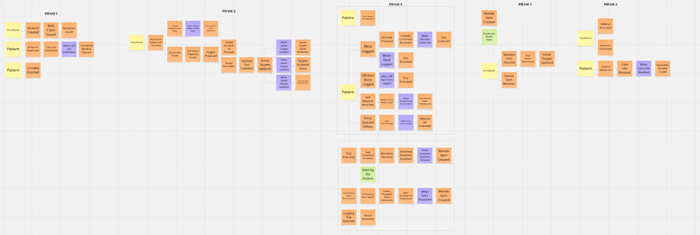

El tablero resultante quedó organizado en cinco fases narrativas, que se describen a continuación.

**Fase 1 — Vinculación, dentro de la consulta.** El profesional crea su cuenta y emite una invitación; el paciente la redime escaneando el código QR durante la consulta presencial y otorga su consentimiento. Los hechos relevantes son `Invitation Issued`, `Invitation Redeemed`, `Care Link Established` y `Consent Granted`. Aquí aparece la primera política del tablero: cuando se establece el vínculo, se abre automáticamente una ventana de evaluación para ese paciente.

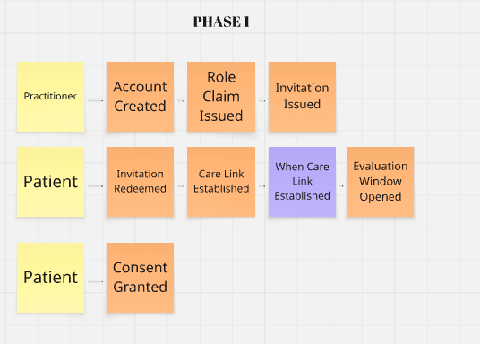

**Fase 2 — El acto clínico, dentro de la consulta.** Ocurre con un solo actor presente, el profesional, y reproduce las tres primeras fases que los nutricionistas entrevistados describieron como su proceso de trabajo: evaluación, diagnóstico e intervención. La cadena de hechos va de `Nutritional Assessment Recorded` y `Clinical Measurement Taken` hasta `Nutritional Diagnosis Issued`, `Targets Proposed`, `Targets Accepted As Proposed` o `Targets Overridden`, y culmina en `Nutrition Plan Published` y `Active Targets Updated`. Este último hecho es el que más consecuencias tiene en el resto del tablero, porque desencadena tres políticas simultáneas en zonas distintas del dominio.

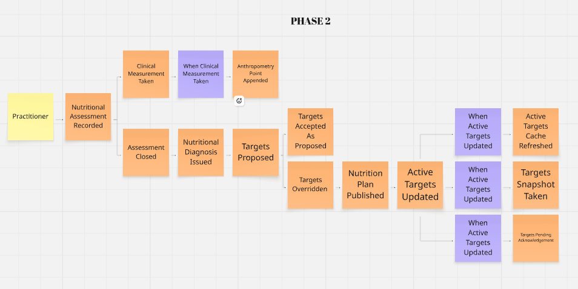

**Fase 3 — Entre consultas.** Es la zona del tablero donde vive el enunciado del problema. Participan los dos actores de manera asíncrona, sin estar en el mismo lugar ni en el mismo momento, y con conectividad intermitente. El paciente produce `Meal Logged`, `Estimate Confirmed By Patient`, `Off Plan Entry Logged`, `Self Weigh In Recorded` y `Entry Queued Offline`; el sistema reacciona con `Day Evaluated`, `Daily Compliance Computed`, `Deviation Detected`, `Sustained Deviation Detected` y `Consistency Index Recomputed`. Durante la sesión se identificó aquí una decisión de diseño que el equipo dejó explícita en el tablero: la alerta de consistencia notifica primero al paciente mediante `Patient Prompted About Consistency` y solo escala al profesional después de tres semanas sostenidas, mientras que `Logging Gap Detected` nunca escala ni cuenta como incumplimiento.

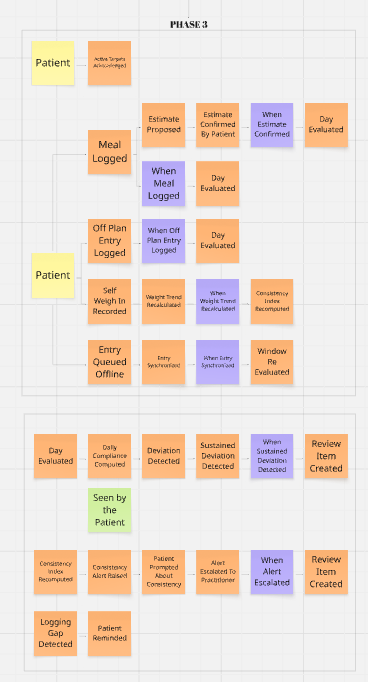

**Fase 4 — La decisión clínica.** El profesional recibe la señal en su bandeja de revisión y decide. Los hechos son `Review Item Created`, `Nutrition Plan Adjusted`, `Plan Version Superseded` y `Review Item Resolved`. La sesión hizo visible que ninguna política conecta la señal con el ajuste del plan: la automatización se detiene en la bandeja y es un humano quien continúa la cadena.

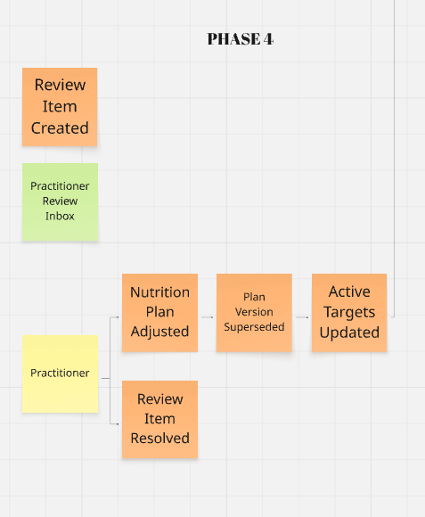

**Fase 5 — Cierre.** Comprende `Referral Recorded`, `Treatment Discharged`, `Consent Withdrawn` y `Care Link Revoked`, con la política que cierra la ventana de evaluación cuando el vínculo se revoca.

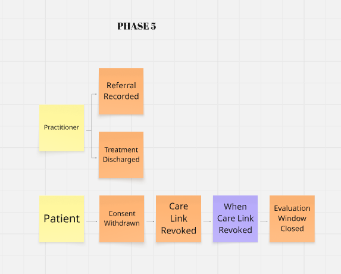

### 2.3.6. Ubiquitous Language

Esta sección presenta el glosario de términos del dominio nutricional que el equipo utiliza de manera uniforme en las entrevistas, en el modelado, en la documentación y en el código. Los términos se expresan en inglés, acompañados de su equivalente en español, y su definición corresponde al significado que tienen en el dominio del negocio y no a su implementación técnica. El glosario se construyó a partir del análisis lingüístico de las entrevistas y del Big Picture EventStorming, y es normativo: un término que aparezca en el modelo y no figure en esta tabla no existe en el dominio.

| Término (inglés) | Equivalente en español | Definición |
|---|---|---|
| `Patient` | Paciente | Persona en tratamiento nutricional activo vinculada a un profesional mediante consentimiento vigente |
| `Practitioner` | Nutricionista | Profesional de la nutrición responsable del acto clínico. Nunca se le denomina doctor ni usuario |
| `Care Link` | Vínculo de cuidado | Relación consentida entre un paciente y un profesional que habilita el acceso a la información del tratamiento |
| `Invitation` | Invitación | Token de un solo uso, entregado como código QR durante la consulta, que permite establecer el vínculo |
| `Consent` | Consentimiento | Autorización otorgada por el paciente, siempre revocable, sin la cual el vínculo no habilita ningún acceso |
| `Discharge` | Alta del tratamiento | Cierre del vínculo por decisión clínica del profesional, con razón obligatoria |
| `Nutritional Assessment` | Evaluación nutricional | Primera fase del acto clínico: recolección de hábitos, antecedentes, actividad y mediciones |
| `Clinical Measurement` | Medición clínica | Medición antropométrica tomada por el profesional bajo protocolo; tiene autoridad clínica |
| `Nutritional Diagnosis` | Diagnóstico nutricional | Segunda fase del acto clínico: juicio profesional fundamentado sobre el estado nutricional del paciente |
| `Nutrition Plan` | Plan de alimentación | Tercera fase del acto clínico: artefacto clínico versionado que contiene metas, pautas y restricciones |
| `Calculation Basis` | Base de cálculo | Parámetros que el profesional elige antes del cálculo: ecuación, peso de referencia, factor de actividad y estrategia de déficit |
| `Target Proposal` | Propuesta de metas | Resultado del cálculo determinista, previo a la prescripción |
| `Prescribed Targets` | Metas prescritas | Metas que el profesional firma, ya sea aceptando la propuesta o sobrescribiéndola con una razón |
| `Active Targets` | Metas vigentes | Conjunto reducido de metas, pautas y restricciones que el paciente recibe. No es el plan clínico |
| `Diary Entry` | Entrada de diario | Registro de un evento de consumo realizado por el paciente |
| `Provenance` | Procedencia | Origen de una entrada de diario: fotografía, registro manual o declaración fuera del plan |
| `Proposed Estimate` | Estimación propuesta | Estimación de porción y nutrientes calculada a partir de la fotografía, siempre con su nivel de confianza y sujeta a confirmación del paciente |
| `Off Plan Entry` | Comida fuera del plan | Declaración del paciente de haber comido fuera de lo prescrito, sin detalle exigido y sin penalización |
| `Self Weigh In` | Autopesaje | Pesaje realizado por el paciente en casa, con protocolo declarado. No tiene autoridad clínica por sí solo |
| `Weight Trend` | Tendencia de peso | Suavizado estadístico de los autopesajes, único formato en que el peso del paciente se presenta como dato |
| `Evaluation Window` | Ventana de evaluación | Periodo mínimo de siete días sobre el cual se evalúa el tratamiento |
| `Daily Compliance` | Cumplimiento diario | Resultado de comparar lo registrado en un día contra las metas vigentes de ese día |
| `Treatment Adherence` | Adherencia al tratamiento | Lectura del seguimiento del plan a escala de la ventana de evaluación o del tratamiento, construida a partir de los cumplimientos diarios. La interpreta el profesional y nunca se deduce de un solo día |
| `Deviation` | Desviación | Diferencia sostenida entre lo prescrito y lo realmente registrado |
| `Logging Gap` | Vacío de registro | Días sin ninguna entrada de diario. No constituye desviación ni incumplimiento |
| `Consistency Index` | Índice de consistencia | Contraste entre la tendencia de peso y la ingesta registrada, utilizado como señal de calidad del dato |
| `Review Item` | Ítem de revisión | Señal de seguimiento recibida por el profesional que espera una decisión humana |
| `Referral` | Derivación | Envío del paciente a otro especialista, con especialidad y razón registradas |
| `Scheduled Follow Up` | Seguimiento programado | Próxima consulta acordada con el paciente |
| `Reference Food` | Alimento de referencia | Ítem del catálogo nutricional traducido al dominio desde una fuente externa |

Del análisis lingüístico surgieron además cinco expresiones que el equipo decidió prohibir porque introducen ambigüedad o contradicen decisiones de producto ya tomadas.

| Expresión prohibida | Razón | Término que la reemplaza |
|---|---|---|
| `Weight` | Designa dos realidades con autoridad clínica distinta | `Clinical Measurement` o `Self Weigh In` |
| `Food` | Confunde el ítem del catálogo con el evento de consumo | `Reference Food` o `Diary Entry` |
| `Plan` del lado del paciente | El paciente nunca recibe el plan clínico completo | `Active Targets` |
| `Compliance` sin granularidad | El día y el tratamiento son escalas distintas | `Daily Compliance` o `Treatment Adherence` |
| `Cheat`, `Fail`, `Violation` | Vocabulario de castigo, contrario a las decisiones éticas del producto | `Off Plan Entry` |

## 2.4. Requirements Specification

### 2.4.1. User Stories

En esta sección se presentan las User Stories, Technical Stories y Spike Stories identificadas para Healthify a partir de las necesidades de los segmentos objetivo y de los requisitos funcionales y técnicos de la solución. Las User Stories describen las capacidades que permiten al Paciente y al Nutricionista realizar el seguimiento del tratamiento nutricional, así como las funcionalidades transversales de acceso a la plataforma y aquellas dirigidas al Visitante mediante el Landing Page.

Adicionalmente, se consideran Technical Stories para representar capacidades técnicas necesarias para soportar las funcionalidades del producto que no corresponden a una interacción directa con los usuarios finales. Finalmente, se incluyen Spike Stories destinadas a reducir la incertidumbre asociada con componentes cuya viabilidad, integración o reglas requieren investigación previa a su implementación.

Los criterios de aceptación se expresan mediante escenarios Given–When–Then y describen comportamientos verificables del sistema sin establecer detalles específicos de presentación de la interfaz.

| Epic ID | Title | Description |
|---|---|---|
| **EP01** | Gestión de la Relación de Cuidado | Agrupa las capacidades necesarias para establecer, mantener y finalizar el vínculo entre un Paciente y un Nutricionista, incluyendo invitaciones, consentimiento y control del acceso a la información. |
| **EP02** | Gestión de Ingesta Alimentaria | Agrupa las funcionalidades relacionadas con el registro de alimentos consumidos mediante fotografía, estimación de porciones, registro manual y declaración de consumos fuera del plan. |
| **EP03** | Seguimiento de Respuesta Corporal | Comprende el registro de autopesajes y el seguimiento de la evolución corporal del Paciente durante el tratamiento nutricional. |
| **EP04** | Monitoreo y Seguimiento del Plan Nutricional | Agrupa las capacidades destinadas a evaluar cómo el paciente sigue el plan nutricional, calcular el cumplimiento diario, identificar señales de consistencia y apoyar la revisión profesional. |
| **EP05** | Expediente y Continuidad del Cuidado | Comprende la consulta consolidada de la información del tratamiento y el registro de acciones que permiten mantener la continuidad de la atención. |
| **EP06** | Evaluación y Diagnóstico Nutricional | Agrupa el registro de evaluaciones, mediciones clínicas y diagnósticos nutricionales realizados por el Nutricionista. |
| **EP07** | Prescripción y Gestión del Plan Nutricional | Comprende el cálculo de metas, la publicación del plan nutricional y el control de sus ajustes y versiones durante el tratamiento. |
| **EP08** | Identidad y Acceso | Agrupa las capacidades relacionadas con creación de cuentas, autenticación, autorización y administración de sesiones. |
| **EP09** | Offline y Sincronización | Comprende la continuidad del registro cuando no existe conectividad y la posterior sincronización segura de los datos. |
| **EP10** | Landing Page | Agrupa las funcionalidades públicas destinadas a presentar Healthify, informar sobre sus capacidades y facilitar el acceso y contacto con la solución. |
| **EP_TS** | RESTful API — Technical Stories | Agrupa las Technical Stories necesarias para implementar los servicios RESTful que soportan las funcionalidades de Healthify y permiten la comunicación entre las aplicaciones cliente y el backend. |
| **EP_SS** | Spike Stories | Agrupa las investigaciones, análisis y pruebas de viabilidad técnica necesarias para reducir incertidumbre antes de implementar funcionalidades o integraciones de Healthify. |

### EP01 — Gestión de la Relación de Cuidado

<br>***US01 — Vinculación mediante invitación QR***
<table>
  <tr>
    <th colspan="2">Story ID</th>
    <th colspan="2">User</th>
    <th colspan="2">Priority</th>
    <th colspan="2">Epic</th>
  </tr>
  <tr>
    <td colspan="2">US01</td>
    <td colspan="2">Paciente</td>
    <td colspan="2">Alta</td>
    <td colspan="2">EP01</td>
  </tr>
  <tr>
    <th colspan="2">Title</th>
    <td colspan="6">Vinculación mediante invitación QR</td>
  </tr>
  <tr>
    <th colspan="8">Description</th>
  </tr>
  <tr>
    <td colspan="8">Como paciente, deseo utilizar la invitación generada por mi nutricionista para vincularme con él en Healthify, para que mi tratamiento pueda ser gestionado y monitoreado de manera autorizada.</td>
  </tr>
  <tr>
    <th colspan="8">Acceptance Criteria</th>
  </tr>
  <tr>
    <td colspan="8"><strong>Escenario 1: Vinculación exitosa</strong><br>Dado que el paciente posee una invitación válida y vigente emitida por un nutricionista<br>Cuando el paciente utiliza la invitación<br>Entonces el sistema establece el vínculo entre ambas cuentas.<br><br><strong>Escenario 2: Invitación vencida</strong><br>Dado que el paciente posee una invitación que ha superado su periodo de vigencia<br>Cuando el paciente intenta utilizarla<br>Entonces el sistema rechaza la vinculación e identifica la invitación como vencida.<br><br><strong>Escenario 3: Invitación previamente utilizada</strong><br>Dado que el paciente dispone de una invitación que ya ha sido utilizada<br>Cuando el paciente intenta utilizar nuevamente la invitación<br>Entonces el sistema rechaza la operación y conserva el vínculo previamente establecido.</td>
  </tr>
</table>

<br>***US02 — Otorgamiento de consentimiento para compartir información***
<table>
  <tr>
    <th colspan="2">Story ID</th>
    <th colspan="2">User</th>
    <th colspan="2">Priority</th>
    <th colspan="2">Epic</th>
  </tr>
  <tr>
    <td colspan="2">US02</td>
    <td colspan="2">Paciente</td>
    <td colspan="2">Alta</td>
    <td colspan="2">EP01</td>
  </tr>
  <tr>
    <th colspan="2">Title</th>
    <td colspan="6">Otorgamiento de consentimiento para compartir información</td>
  </tr>
  <tr>
    <th colspan="8">Description</th>
  </tr>
  <tr>
    <td colspan="8">Como paciente, deseo otorgar mi consentimiento para compartir con mi nutricionista la información necesaria de mi tratamiento, para mantener el control sobre el acceso profesional a mis datos.</td>
  </tr>
  <tr>
    <th colspan="8">Acceptance Criteria</th>
  </tr>
  <tr>
    <td colspan="8"><strong>Escenario 1: Consentimiento otorgado</strong><br>Dado que el paciente tiene un vínculo de cuidado pendiente de autorización<br>Cuando el paciente otorga su consentimiento<br>Entonces el sistema registra el consentimiento vigente asociado al vínculo.<br><br><strong>Escenario 2: Acceso con consentimiento vigente</strong><br>Dado que el paciente mantiene un vínculo de cuidado activo y ha otorgado su consentimiento<br>Cuando el nutricionista solicita acceder a la información autorizada del paciente<br>Entonces el sistema permite el acceso según los permisos correspondientes.<br><br><strong>Escenario 3: Ausencia de consentimiento</strong><br>Dado que el paciente mantiene un vínculo de cuidado sin consentimiento vigente<br>Cuando el nutricionista solicita acceder a información protegida del paciente<br>Entonces el sistema rechaza el acceso.</td>
  </tr>
</table>

<br>***US03 — Revocación del consentimiento***
<table>
  <tr>
    <th colspan="2">Story ID</th>
    <th colspan="2">User</th>
    <th colspan="2">Priority</th>
    <th colspan="2">Epic</th>
  </tr>
  <tr>
    <td colspan="2">US03</td>
    <td colspan="2">Paciente</td>
    <td colspan="2">Media</td>
    <td colspan="2">EP01</td>
  </tr>
  <tr>
    <th colspan="2">Title</th>
    <td colspan="6">Revocación del consentimiento</td>
  </tr>
  <tr>
    <th colspan="8">Description</th>
  </tr>
  <tr>
    <td colspan="8">Como paciente, deseo revocar el consentimiento otorgado para el acceso a mi información, para conservar el control sobre los datos compartidos durante mi tratamiento.</td>
  </tr>
  <tr>
    <th colspan="8">Acceptance Criteria</th>
  </tr>
  <tr>
    <td colspan="8"><strong>Escenario 1: Revocación exitosa</strong><br>Dado que el paciente mantiene un consentimiento vigente<br>Cuando el paciente revoca el consentimiento<br>Entonces el sistema registra el consentimiento como no vigente.<br><br><strong>Escenario 2: Acceso posterior a la revocación</strong><br>Dado que el paciente ha revocado previamente el consentimiento asociado al vínculo<br>Cuando el nutricionista solicita acceder a nueva información protegida del paciente<br>Entonces el sistema rechaza el acceso autorizado por dicho consentimiento.</td>
  </tr>
</table>

<br>***US04 — Generación de invitación QR para un nuevo paciente***
<table>
  <tr>
    <th colspan="2">Story ID</th>
    <th colspan="2">User</th>
    <th colspan="2">Priority</th>
    <th colspan="2">Epic</th>
  </tr>
  <tr>
    <td colspan="2">US04</td>
    <td colspan="2">Nutricionista</td>
    <td colspan="2">Alta</td>
    <td colspan="2">EP01</td>
  </tr>
  <tr>
    <th colspan="2">Title</th>
    <td colspan="6">Generación de invitación QR para un nuevo paciente</td>
  </tr>
  <tr>
    <th colspan="8">Description</th>
  </tr>
  <tr>
    <td colspan="8">Como nutricionista, deseo generar una invitación para un paciente, para iniciar de forma controlada el proceso de vinculación en Healthify.</td>
  </tr>
  <tr>
    <th colspan="8">Acceptance Criteria</th>
  </tr>
  <tr>
    <td colspan="8"><strong>Escenario 1: Invitación generada</strong><br>Dado que el nutricionista se encuentra autorizado<br>Cuando el nutricionista solicita una nueva invitación<br>Entonces el sistema genera una invitación única asociada al nutricionista y con vigencia limitada.<br><br><strong>Escenario 2: Invitación utilizada</strong><br>Dado que el nutricionista ha generado una invitación que fue canjeada correctamente<br>Cuando el nutricionista consulta el estado de la invitación<br>Entonces el sistema informa que la invitación ya fue utilizada.<br><br><strong>Escenario 3: Reutilización</strong><br>Dado que el nutricionista dispone de una invitación que ya fue utilizada<br>Cuando el nutricionista intenta utilizar nuevamente esa invitación para vincular a otro paciente<br>Entonces el sistema rechaza el nuevo canje de la invitación.</td>
  </tr>
</table>

<br>***US05 — Consulta de pacientes con vínculo activo***
<table>
  <tr>
    <th colspan="2">Story ID</th>
    <th colspan="2">User</th>
    <th colspan="2">Priority</th>
    <th colspan="2">Epic</th>
  </tr>
  <tr>
    <td colspan="2">US05</td>
    <td colspan="2">Nutricionista</td>
    <td colspan="2">Alta</td>
    <td colspan="2">EP01</td>
  </tr>
  <tr>
    <th colspan="2">Title</th>
    <td colspan="6">Consulta de pacientes con vínculo activo</td>
  </tr>
  <tr>
    <th colspan="8">Description</th>
  </tr>
  <tr>
    <td colspan="8">Como nutricionista, deseo consultar los pacientes con los que mantengo un vínculo de cuidado activo, para acceder al seguimiento de los tratamientos que tengo a cargo.</td>
  </tr>
  <tr>
    <th colspan="8">Acceptance Criteria</th>
  </tr>
  <tr>
    <td colspan="8"><strong>Escenario 1: Existen pacientes vinculados</strong><br>Dado que el nutricionista mantiene vínculos activos<br>Cuando el nutricionista consulta sus pacientes<br>Entonces el sistema devuelve únicamente los pacientes asociados mediante vínculos vigentes.<br><br><strong>Escenario 2: No existen vínculos activos</strong><br>Dado que el nutricionista no mantiene vínculos activos<br>Cuando el nutricionista consulta sus pacientes<br>Entonces el sistema devuelve un resultado vacío.<br><br><strong>Escenario 3: Paciente sin vínculo vigente</strong><br>Dado que el nutricionista tiene un vínculo que ha sido finalizado o revocado<br>Cuando el nutricionista consulta sus pacientes activos<br>Entonces el sistema no considera a dicho paciente parte de la cartera activa.</td>
  </tr>
</table>

<br>***US06 — Alta del paciente al finalizar el tratamiento***
<table>
  <tr>
    <th colspan="2">Story ID</th>
    <th colspan="2">User</th>
    <th colspan="2">Priority</th>
    <th colspan="2">Epic</th>
  </tr>
  <tr>
    <td colspan="2">US06</td>
    <td colspan="2">Nutricionista</td>
    <td colspan="2">Media</td>
    <td colspan="2">EP01</td>
  </tr>
  <tr>
    <th colspan="2">Title</th>
    <td colspan="6">Alta del paciente al finalizar el tratamiento</td>
  </tr>
  <tr>
    <th colspan="8">Description</th>
  </tr>
  <tr>
    <td colspan="8">Como nutricionista, deseo registrar el alta de un paciente cuando su tratamiento concluye, para cerrar formalmente el vínculo de cuidado manteniendo la trazabilidad histórica.</td>
  </tr>
  <tr>
    <th colspan="8">Acceptance Criteria</th>
  </tr>
  <tr>
    <td colspan="8"><strong>Escenario 1: Alta registrada</strong><br>Dado que el nutricionista mantiene un vínculo de cuidado activo<br>Cuando el nutricionista registra el alta del paciente<br>Entonces el sistema finaliza el vínculo por cierre clínico y conserva su historial.<br><br><strong>Escenario 2: Acceso posterior al alta</strong><br>Dado que el nutricionista ha registrado previamente el alta del paciente<br>Cuando el nutricionista consulta el estado del vínculo después de registrar el alta<br>Entonces el sistema no considera activo el vínculo finalizado por alta.</td>
  </tr>
</table>

<br>***US07 — Revocación del vínculo de cuidado***
<table>
  <tr>
    <th colspan="2">Story ID</th>
    <th colspan="2">User</th>
    <th colspan="2">Priority</th>
    <th colspan="2">Epic</th>
  </tr>
  <tr>
    <td colspan="2">US07</td>
    <td colspan="2">Nutricionista</td>
    <td colspan="2">Media</td>
    <td colspan="2">EP01</td>
  </tr>
  <tr>
    <th colspan="2">Title</th>
    <td colspan="6">Revocación del vínculo de cuidado</td>
  </tr>
  <tr>
    <th colspan="8">Description</th>
  </tr>
  <tr>
    <td colspan="8">Como nutricionista, deseo revocar un vínculo de cuidado cuando la relación de seguimiento deba finalizar sin registrar un alta clínica, para impedir nuevos accesos mediante dicho vínculo.</td>
  </tr>
  <tr>
    <th colspan="8">Acceptance Criteria</th>
  </tr>
  <tr>
    <td colspan="8"><strong>Escenario 1: Revocación de vínculo activo</strong><br>Dado que el nutricionista mantiene un vínculo de cuidado activo<br>Cuando el nutricionista solicita revocar el vínculo de cuidado<br>Entonces el sistema registra el vínculo como revocado.<br><br><strong>Escenario 2: Acceso mediante vínculo revocado</strong><br>Dado que el nutricionista tiene un vínculo que se encuentra revocado<br>Cuando el nutricionista solicita acceder a información protegida mediante el vínculo revocado<br>Entonces el sistema rechaza el acceso.</td>
  </tr>
</table>
<br>

### EP02 — Gestión de Ingesta Alimentaria

<br>***US08 — Registro de comida por fotografía***
<table>
  <tr>
    <th colspan="2">Story ID</th>
    <th colspan="2">User</th>
    <th colspan="2">Priority</th>
    <th colspan="2">Epic</th>
  </tr>
  <tr>
    <td colspan="2">US08</td>
    <td colspan="2">Paciente</td>
    <td colspan="2">Alta</td>
    <td colspan="2">EP02</td>
  </tr>
  <tr>
    <th colspan="2">Title</th>
    <td colspan="6">Registro de comida por fotografía</td>
  </tr>
  <tr>
    <th colspan="8">Description</th>
  </tr>
  <tr>
    <td colspan="8">Como paciente, deseo registrar una comida mediante una fotografía, para reducir el esfuerzo requerido para documentar mi alimentación cotidiana.</td>
  </tr>
  <tr>
    <th colspan="8">Acceptance Criteria</th>
  </tr>
  <tr>
    <td colspan="8"><strong>Escenario 1: Fotografía procesable</strong><br>Dado que el paciente proporciona una fotografía válida de una comida<br>Cuando el paciente solicita procesar la fotografía de la comida<br>Entonces el sistema genera una propuesta de alimentos y porciones estimadas para su confirmación.<br><br><strong>Escenario 2: Estimación con procedencia</strong><br>Dado que el paciente tiene una estimación generada a partir de una fotografía<br>Cuando el paciente revisa la propuesta generada a partir de la fotografía<br>Entonces el sistema conserva la procedencia y nivel de confianza asociados a la estimación.<br><br><strong>Escenario 3: Fotografía no procesable</strong><br>Dado que el paciente proporciona una fotografía cuya información no permite obtener una estimación utilizable<br>Cuando el paciente solicita procesar una fotografía que no permite obtener una estimación válida<br>Entonces el sistema informa que no se obtuvo una estimación válida y permite continuar mediante registro manual.</td>
  </tr>
</table>

<br>***US09 — Confirmación o ajuste de estimación de porción***
<table>
  <tr>
    <th colspan="2">Story ID</th>
    <th colspan="2">User</th>
    <th colspan="2">Priority</th>
    <th colspan="2">Epic</th>
  </tr>
  <tr>
    <td colspan="2">US09</td>
    <td colspan="2">Paciente</td>
    <td colspan="2">Alta</td>
    <td colspan="2">EP02</td>
  </tr>
  <tr>
    <th colspan="2">Title</th>
    <td colspan="6">Confirmación o ajuste de estimación de porción</td>
  </tr>
  <tr>
    <th colspan="8">Description</th>
  </tr>
  <tr>
    <td colspan="8">Como paciente, deseo confirmar o ajustar la porción estimada de una comida registrada mediante fotografía, para que el registro represente mejor la cantidad que consumí.</td>
  </tr>
  <tr>
    <th colspan="8">Acceptance Criteria</th>
  </tr>
  <tr>
    <td colspan="8"><strong>Escenario 1: Confirmación sin cambios</strong><br>Dado que el paciente tiene una estimación pendiente de confirmación<br>Cuando el paciente confirma los alimentos y porciones estimados<br>Entonces el sistema registra la ingesta conservando la procedencia de la estimación.<br><br><strong>Escenario 2: Ajuste de la porción</strong><br>Dado que el paciente considera que la porción estimada no representa lo consumido<br>Cuando el paciente proporciona y confirma la cantidad corregida de la porción<br>Entonces el sistema registra la cantidad corregida y conserva la información de la estimación original como procedencia.<br><br><strong>Escenario 3: Estimación no confirmada</strong><br>Dado que el paciente tiene una propuesta de ingesta sin confirmar<br>Cuando el paciente finaliza el proceso sin confirmar la propuesta<br>Entonces el sistema no considera la propuesta como una ingesta confirmada.</td>
  </tr>
</table>

<br>***US10 — Registro manual de comida mediante catálogo***
<table>
  <tr>
    <th colspan="2">Story ID</th>
    <th colspan="2">User</th>
    <th colspan="2">Priority</th>
    <th colspan="2">Epic</th>
  </tr>
  <tr>
    <td colspan="2">US10</td>
    <td colspan="2">Paciente</td>
    <td colspan="2">Alta</td>
    <td colspan="2">EP02</td>
  </tr>
  <tr>
    <th colspan="2">Title</th>
    <td colspan="6">Registro manual de comida mediante catálogo</td>
  </tr>
  <tr>
    <th colspan="8">Description</th>
  </tr>
  <tr>
    <td colspan="8">Como paciente, deseo buscar un alimento en el catálogo y registrar manualmente la cantidad consumida, para documentar una comida cuando el registro por fotografía no sea adecuado o no esté disponible.</td>
  </tr>
  <tr>
    <th colspan="8">Acceptance Criteria</th>
  </tr>
  <tr>
    <td colspan="8"><strong>Escenario 1: Búsqueda con coincidencias</strong><br>Dado que el paciente proporciona un término de búsqueda válido<br>Cuando el paciente realiza la búsqueda en el catálogo<br>Entonces el sistema devuelve los alimentos que coinciden con el criterio de búsqueda.<br><br><strong>Escenario 2: Registro manual</strong><br>Dado que el paciente selecciona un alimento y proporciona una cantidad válida<br>Cuando el paciente confirma el alimento y la cantidad consumida<br>Entonces el sistema almacena la ingesta con procedencia manual.<br><br><strong>Escenario 3: Alimento no encontrado</strong><br>Dado que el paciente realiza una búsqueda cuyo criterio no coincide con alimentos disponibles<br>Cuando el paciente completa una búsqueda sin coincidencias<br>Entonces el sistema informa que no existen coincidencias.<br><br><strong>Escenario 4: Datos disponibles sin conectividad</strong><br>Dado que el paciente no dispone de conexión y existen datos del catálogo almacenados localmente<br>Cuando el paciente realiza una búsqueda<br>Entonces el sistema utiliza la información local disponible.</td>
  </tr>
</table>

<br>***US11 — Registro de consumo fuera del plan***
<table>
  <tr>
    <th colspan="2">Story ID</th>
    <th colspan="2">User</th>
    <th colspan="2">Priority</th>
    <th colspan="2">Epic</th>
  </tr>
  <tr>
    <td colspan="2">US11</td>
    <td colspan="2">Paciente</td>
    <td colspan="2">Alta</td>
    <td colspan="2">EP02</td>
  </tr>
  <tr>
    <th colspan="2">Title</th>
    <td colspan="6">Registro de consumo fuera del plan</td>
  </tr>
  <tr>
    <th colspan="8">Description</th>
  </tr>
  <tr>
    <td colspan="8">Como paciente, deseo registrar que consumí algo fuera de mi plan sin tener que proporcionar información detallada, para mantener un registro más completo de mi alimentación.</td>
  </tr>
  <tr>
    <th colspan="8">Acceptance Criteria</th>
  </tr>
  <tr>
    <td colspan="8"><strong>Escenario 1: Registro del consumo</strong><br>Dado que el paciente desea declarar un consumo fuera del plan<br>Cuando el paciente registra el consumo fuera del plan<br>Entonces el sistema conserva la declaración con su fecha y hora sin exigir el detalle del alimento consumido.<br><br><strong>Escenario 2: Tratamiento no punitivo</strong><br>Dado que el paciente tiene un consumo fuera del plan registrado<br>Cuando el paciente consulta posteriormente el consumo registrado fuera del plan<br>Entonces el sistema conserva el dato sin asignarle una valoración punitiva.</td>
  </tr>
</table>
<br>

### EP03 — Seguimiento de Respuesta Corporal

<br>***US12 — Registro de autopesaje***
<table>
  <tr>
    <th colspan="2">Story ID</th>
    <th colspan="2">User</th>
    <th colspan="2">Priority</th>
    <th colspan="2">Epic</th>
  </tr>
  <tr>
    <td colspan="2">US12</td>
    <td colspan="2">Paciente</td>
    <td colspan="2">Alta</td>
    <td colspan="2">EP03</td>
  </tr>
  <tr>
    <th colspan="2">Title</th>
    <td colspan="6">Registro de autopesaje</td>
  </tr>
  <tr>
    <th colspan="8">Description</th>
  </tr>
  <tr>
    <td colspan="8">Como paciente, deseo registrar mi peso siguiendo el protocolo establecido por mi nutricionista, para aportar información comparable sobre mi evolución corporal.</td>
  </tr>
  <tr>
    <th colspan="8">Acceptance Criteria</th>
  </tr>
  <tr>
    <td colspan="8"><strong>Escenario 1: Autopesaje compatible con el protocolo</strong><br>Dado que el paciente proporciona un valor válido y cumple las condiciones requeridas por el protocolo de pesaje<br>Cuando el paciente registra el autopesaje<br>Entonces el sistema almacena el registro y lo considera elegible para la tendencia de peso.<br><br><strong>Escenario 2: Autopesaje fuera del protocolo</strong><br>Dado que el paciente registra un peso que no cumple las condiciones del protocolo<br>Cuando el paciente registra el peso<br>Entonces el sistema conserva el registro pero lo excluye del cálculo de la tendencia.<br><br><strong>Escenario 3: Valor inválido</strong><br>Dado que el paciente proporciona un valor de peso fuera del rango válido establecido<br>Cuando el paciente intenta registrar el valor de peso<br>Entonces el sistema rechaza el valor.</td>
  </tr>
</table>

<br>***US13 — Visualización de tendencia de peso***
<table>
  <tr>
    <th colspan="2">Story ID</th>
    <th colspan="2">User</th>
    <th colspan="2">Priority</th>
    <th colspan="2">Epic</th>
  </tr>
  <tr>
    <td colspan="2">US13</td>
    <td colspan="2">Paciente</td>
    <td colspan="2">Alta</td>
    <td colspan="2">EP03</td>
  </tr>
  <tr>
    <th colspan="2">Title</th>
    <td colspan="6">Visualización de tendencia de peso</td>
  </tr>
  <tr>
    <th colspan="8">Description</th>
  </tr>
  <tr>
    <td colspan="8">Como paciente, deseo consultar la tendencia de mi peso a lo largo del tratamiento, para comprender mi evolución sin depender de la interpretación de un único registro diario.</td>
  </tr>
  <tr>
    <th colspan="8">Acceptance Criteria</th>
  </tr>
  <tr>
    <td colspan="8"><strong>Escenario 1: Datos suficientes</strong><br>Dado que el paciente tiene autopesajes elegibles dentro del periodo consultado<br>Cuando el paciente consulta la tendencia de su peso<br>Entonces el sistema proporciona una tendencia calculada a partir de los registros válidos.<br><br><strong>Escenario 2: Datos insuficientes</strong><br>Dado que el paciente no tiene suficientes autopesajes elegibles<br>Cuando el paciente consulta la tendencia de su peso<br>Entonces el sistema informa que aún no existe información suficiente para establecer una tendencia.</td>
  </tr>
</table>
<br>

### EP04 — Monitoreo y Seguimiento del Plan Nutricional

<br>***US14 — Consulta del cumplimiento nutricional diario***
<table>
  <tr>
    <th colspan="2">Story ID</th>
    <th colspan="2">User</th>
    <th colspan="2">Priority</th>
    <th colspan="2">Epic</th>
  </tr>
  <tr>
    <td colspan="2">US14</td>
    <td colspan="2">Paciente</td>
    <td colspan="2">Alta</td>
    <td colspan="2">EP04</td>
  </tr>
  <tr>
    <th colspan="2">Title</th>
    <td colspan="6">Consulta del cumplimiento nutricional diario</td>
  </tr>
  <tr>
    <th colspan="8">Description</th>
  </tr>
  <tr>
    <td colspan="8">Como paciente, deseo conocer mi nivel de cumplimiento diario respecto de las metas vigentes de ese día, para comprender cómo estoy siguiendo mi plan nutricional.</td>
  </tr>
  <tr>
    <th colspan="8">Acceptance Criteria</th>
  </tr>
  <tr>
    <td colspan="8"><strong>Escenario 1: Día con información registrada</strong><br>Dado que el paciente cuenta con metas vigentes y registros de alimentación para un día determinado<br>Cuando el paciente consulta el cumplimiento correspondiente a ese día<br>Entonces el sistema calcula el cumplimiento utilizando las metas que estaban vigentes en esa fecha.<br><br><strong>Escenario 2: Cambio posterior del plan</strong><br>Dado que el paciente consulta un día cuyas metas fueron modificadas posteriormente por el nutricionista<br>Cuando el paciente consulta el cumplimiento correspondiente a ese día<br>Entonces el sistema conserva el resultado basado en la versión de metas que correspondía a ese día.<br><br><strong>Escenario 3: Día sin información suficiente</strong><br>Dado que el paciente no cuenta con información suficiente para evaluar el día<br>Cuando el paciente consulta el cumplimiento<br>Entonces el sistema informa que no puede determinarlo sin clasificar la ausencia de registro como incumplimiento.</td>
  </tr>
</table>

<br>***US15 — Visualización de señal de consistencia***
<table>
  <tr>
    <th colspan="2">Story ID</th>
    <th colspan="2">User</th>
    <th colspan="2">Priority</th>
    <th colspan="2">Epic</th>
  </tr>
  <tr>
    <td colspan="2">US15</td>
    <td colspan="2">Paciente</td>
    <td colspan="2">Alta</td>
    <td colspan="2">EP04</td>
  </tr>
  <tr>
    <th colspan="2">Title</th>
    <td colspan="6">Visualización de señal de consistencia</td>
  </tr>
  <tr>
    <th colspan="8">Description</th>
  </tr>
  <tr>
    <td colspan="8">Como paciente, deseo recibir una señal cuando mis registros muestran un patrón que requiere revisión, para poder verificar primero si la información registrada representa correctamente lo ocurrido.</td>
  </tr>
  <tr>
    <th colspan="8">Acceptance Criteria</th>
  </tr>
  <tr>
    <td colspan="8"><strong>Escenario 1: Condición de consistencia detectada</strong><br>Dado que el paciente tiene información registrada que cumple la regla de consistencia vigente<br>Cuando el paciente consulta el seguimiento del periodo evaluado<br>Entonces el sistema genera una señal dirigida inicialmente al paciente.<br><br><strong>Escenario 2: Ausencia de información suficiente</strong><br>Dado que el paciente no tiene registros suficientes para evaluar la consistencia<br>Cuando el paciente consulta un periodo con registros insuficientes<br>Entonces el sistema no clasifica la ausencia de registros como una desviación.<br><br><strong>Escenario 3: Señal sin modificación automática</strong><br>Dado que el paciente tiene una señal de consistencia activa<br>Cuando el paciente consulta una señal de consistencia activa<br>Entonces el sistema no modifica automáticamente el plan nutricional del paciente.<br><br><strong>Escenario 4: Escalamiento profesional</strong><br>Dado que el paciente tiene una señal que cumple el criterio vigente de escalamiento<br>Cuando el paciente consulta una señal que cumple el criterio de escalamiento<br>Entonces el sistema genera una situación de revisión para el nutricionista.</td>
  </tr>
</table>

<br>***US16 — Consulta del monitoreo del paciente***
<table>
  <tr>
    <th colspan="2">Story ID</th>
    <th colspan="2">User</th>
    <th colspan="2">Priority</th>
    <th colspan="2">Epic</th>
  </tr>
  <tr>
    <td colspan="2">US16</td>
    <td colspan="2">Nutricionista</td>
    <td colspan="2">Alta</td>
    <td colspan="2">EP04</td>
  </tr>
  <tr>
    <th colspan="2">Title</th>
    <td colspan="6">Consulta del monitoreo del paciente</td>
  </tr>
  <tr>
    <th colspan="8">Description</th>
  </tr>
  <tr>
    <td colspan="8">Como nutricionista, deseo consultar la información de seguimiento de un paciente entre consultas, para interpretar su evolución y disponer de datos confiables durante la toma de decisiones clínicas.</td>
  </tr>
  <tr>
    <th colspan="8">Acceptance Criteria</th>
  </tr>
  <tr>
    <td colspan="8"><strong>Escenario 1: Información disponible</strong><br>Dado que el nutricionista atiende a un paciente con vínculo activo que ha generado información de seguimiento<br>Cuando el nutricionista consulta el monitoreo del paciente<br>Entonces el sistema proporciona la tendencia de peso, cumplimiento, registros de alimentación y demás datos autorizados disponibles.<br><br><strong>Escenario 2: Procedencia de registros estimados</strong><br>Dado que el nutricionista consulta una ingesta que proviene de una estimación<br>Cuando el nutricionista consulta una ingesta estimada dentro del monitoreo<br>Entonces el sistema conserva su procedencia y nivel de confianza.<br><br><strong>Escenario 3: Ausencia de información</strong><br>Dado que el nutricionista consulta un periodo sin suficientes registros<br>Cuando el nutricionista consulta el seguimiento del periodo<br>Entonces el sistema distingue la ausencia de datos de una desviación del tratamiento.</td>
  </tr>
</table>

<br>***US17 — Revisión y resolución de señales de seguimiento***
<table>
  <tr>
    <th colspan="2">Story ID</th>
    <th colspan="2">User</th>
    <th colspan="2">Priority</th>
    <th colspan="2">Epic</th>
  </tr>
  <tr>
    <td colspan="2">US17</td>
    <td colspan="2">Nutricionista</td>
    <td colspan="2">Alta</td>
    <td colspan="2">EP04</td>
  </tr>
  <tr>
    <th colspan="2">Title</th>
    <td colspan="6">Revisión y resolución de señales de seguimiento</td>
  </tr>
  <tr>
    <th colspan="8">Description</th>
  </tr>
  <tr>
    <td colspan="8">Como nutricionista, deseo revisar las situaciones de seguimiento que requieren mi atención y registrar la decisión clínica correspondiente, para mantener el control profesional sobre los ajustes del tratamiento.</td>
  </tr>
  <tr>
    <th colspan="8">Acceptance Criteria</th>
  </tr>
  <tr>
    <td colspan="8"><strong>Escenario 1: Situación disponible para revisión</strong><br>Dado que el nutricionista tiene una condición de seguimiento que cumple la regla vigente de escalamiento<br>Cuando el nutricionista consulta los elementos pendientes de revisión<br>Entonces el sistema incluye la situación correspondiente.<br><br><strong>Escenario 2: Resolución sin cambio del plan</strong><br>Dado que el nutricionista revisa una situación y determina que no requiere modificación del tratamiento<br>Cuando el nutricionista registra su decisión<br>Entonces el sistema conserva la resolución sin alterar el plan vigente.<br><br><strong>Escenario 3: Resolución con ajuste</strong><br>Dado que el nutricionista determina que corresponde ajustar el tratamiento<br>Cuando el nutricionista inicia el ajuste del plan<br>Entonces el sistema procesa el cambio mediante una nueva versión del plan con su motivo correspondiente.<br><br><strong>Escenario 4: Ausencia de modificación automática</strong><br>Dado que el nutricionista tiene una señal de seguimiento generada por el sistema<br>Cuando el nutricionista consulta una señal de seguimiento escalada para revisión<br>Entonces el sistema mantiene el plan sin cambios hasta que exista una decisión profesional.</td>
  </tr>
</table>
<br>

### EP05 — Expediente y Continuidad del Cuidado

<br>***US18 — Acceso al expediente personal unificado***
<table>
  <tr>
    <th colspan="2">Story ID</th>
    <th colspan="2">User</th>
    <th colspan="2">Priority</th>
    <th colspan="2">Epic</th>
  </tr>
  <tr>
    <td colspan="2">US18</td>
    <td colspan="2">Paciente</td>
    <td colspan="2">Media</td>
    <td colspan="2">EP05</td>
  </tr>
  <tr>
    <th colspan="2">Title</th>
    <td colspan="6">Acceso al expediente personal unificado</td>
  </tr>
  <tr>
    <th colspan="8">Description</th>
  </tr>
  <tr>
    <td colspan="8">Como paciente, deseo consultar en un mismo expediente la información de mi tratamiento que me corresponde conocer, para mantener una referencia continua de las indicaciones y evolución registradas.</td>
  </tr>
  <tr>
    <th colspan="8">Acceptance Criteria</th>
  </tr>
  <tr>
    <td colspan="8"><strong>Escenario 1: Expediente disponible</strong><br>Dado que el paciente mantiene información registrada durante su tratamiento<br>Cuando el paciente solicita consultar su expediente personal<br>Entonces el sistema proporciona la información autorizada correspondiente a su tratamiento.<br><br><strong>Escenario 2: Información consolidada</strong><br>Dado que el paciente tiene metas, mediciones, pautas, restricciones o derivaciones registradas<br>Cuando el paciente consulta su expediente<br>Entonces el sistema consolida la información disponible sin modificar sus registros originales.<br><br><strong>Escenario 3: Protección de información clínica restringida</strong><br>Dado que el paciente consulta un expediente que contiene información reservada al ámbito profesional<br>Cuando el paciente solicita consultar su expediente personal<br>Entonces el sistema excluye la información que no corresponde a sus permisos.</td>
  </tr>
</table>

<br>***US19 — Registro de derivación a otro especialista***
<table>
  <tr>
    <th colspan="2">Story ID</th>
    <th colspan="2">User</th>
    <th colspan="2">Priority</th>
    <th colspan="2">Epic</th>
  </tr>
  <tr>
    <td colspan="2">US19</td>
    <td colspan="2">Nutricionista</td>
    <td colspan="2">Baja</td>
    <td colspan="2">EP05</td>
  </tr>
  <tr>
    <th colspan="2">Title</th>
    <td colspan="6">Registro de derivación a otro especialista</td>
  </tr>
  <tr>
    <th colspan="8">Description</th>
  </tr>
  <tr>
    <td colspan="8">Como nutricionista, deseo registrar la derivación de un paciente a otro especialista cuando el caso lo requiera, para mantener documentada la continuidad de su atención.</td>
  </tr>
  <tr>
    <th colspan="8">Acceptance Criteria</th>
  </tr>
  <tr>
    <td colspan="8"><strong>Escenario 1: Derivación válida</strong><br>Dado que el nutricionista atiende a un paciente con tratamiento activo<br>Cuando el nutricionista registra una derivación con el motivo correspondiente<br>Entonces el sistema conserva la derivación asociada al expediente del paciente.<br><br><strong>Escenario 2: Consulta histórica</strong><br>Dado que el nutricionista ha registrado una derivación<br>Cuando el nutricionista consulta posteriormente el expediente autorizado del paciente<br>Entonces el sistema conserva la derivación como parte del historial.</td>
  </tr>
</table>

<br>***US20 — Acceso al expediente unificado del paciente***
<table>
  <tr>
    <th colspan="2">Story ID</th>
    <th colspan="2">User</th>
    <th colspan="2">Priority</th>
    <th colspan="2">Epic</th>
  </tr>
  <tr>
    <td colspan="2">US20</td>
    <td colspan="2">Nutricionista</td>
    <td colspan="2">Alta</td>
    <td colspan="2">EP05</td>
  </tr>
  <tr>
    <th colspan="2">Title</th>
    <td colspan="6">Acceso al expediente unificado del paciente</td>
  </tr>
  <tr>
    <th colspan="8">Description</th>
  </tr>
  <tr>
    <td colspan="8">Como nutricionista, deseo consultar de manera consolidada la información clínica y de seguimiento del paciente que tengo autorizado a atender, para disponer de una visión continua de su tratamiento.</td>
  </tr>
  <tr>
    <th colspan="8">Acceptance Criteria</th>
  </tr>
  <tr>
    <td colspan="8"><strong>Escenario 1: Acceso autorizado</strong><br>Dado que el nutricionista mantiene un vínculo activo con el paciente y existe consentimiento vigente<br>Cuando el nutricionista solicita consultar el expediente del paciente<br>Entonces el sistema proporciona la información clínica y de seguimiento autorizada.<br><br><strong>Escenario 2: Información histórica</strong><br>Dado que el nutricionista atiende a un paciente con información clínica y de seguimiento registrada<br>Cuando el nutricionista consulta el expediente unificado del paciente<br>Entonces el sistema conserva y proporciona la trazabilidad de la información correspondiente.<br><br><strong>Escenario 3: Acceso no autorizado</strong><br>Dado que el nutricionista no cuenta con un vínculo activo o consentimiento vigente<br>Cuando el nutricionista solicita consultar el expediente del paciente<br>Entonces el sistema rechaza el acceso.</td>
  </tr>
</table>
<br>

### EP06 — Evaluación y Diagnóstico Nutricional

<br>***US21 — Registro y finalización de la evaluación nutricional***
<table>
  <tr>
    <th colspan="2">Story ID</th>
    <th colspan="2">User</th>
    <th colspan="2">Priority</th>
    <th colspan="2">Epic</th>
  </tr>
  <tr>
    <td colspan="2">US21</td>
    <td colspan="2">Nutricionista</td>
    <td colspan="2">Alta</td>
    <td colspan="2">EP06</td>
  </tr>
  <tr>
    <th colspan="2">Title</th>
    <td colspan="6">Registro y finalización de la evaluación nutricional</td>
  </tr>
  <tr>
    <th colspan="8">Description</th>
  </tr>
  <tr>
    <td colspan="8">Como nutricionista, deseo registrar y completar la evaluación nutricional del paciente, incluyendo la información clínica y mediciones necesarias, para disponer de una base documentada antes de establecer el diagnóstico y tratamiento.</td>
  </tr>
  <tr>
    <th colspan="8">Acceptance Criteria</th>
  </tr>
  <tr>
    <td colspan="8"><strong>Escenario 1: Creación de evaluación</strong><br>Dado que el nutricionista mantiene un vínculo de cuidado activo y autorizado con el paciente<br>Cuando el nutricionista inicia una nueva evaluación nutricional<br>Entonces el sistema registra una nueva evaluación asociada al paciente.<br><br><strong>Escenario 2: Incorporación de mediciones</strong><br>Dado que el nutricionista tiene una evaluación abierta<br>Cuando el nutricionista registra una medición clínica válida<br>Entonces el sistema incorpora la medición clínica a la evaluación nutricional.<br><br><strong>Escenario 3: Cierre de evaluación</strong><br>Dado que el nutricionista ha completado la información requerida de una evaluación<br>Cuando el nutricionista finaliza la evaluación nutricional<br>Entonces el sistema registra la evaluación como cerrada.<br><br><strong>Escenario 4: Modificación posterior al cierre</strong><br>Dado que el nutricionista tiene una evaluación cerrada<br>Cuando el nutricionista intenta modificar una evaluación cerrada<br>Entonces el sistema conserva la evaluación cerrada sin alteraciones y requiere un nuevo registro para una corrección posterior.</td>
  </tr>
</table>

<br>***US22 — Emisión del diagnóstico nutricional***
<table>
  <tr>
    <th colspan="2">Story ID</th>
    <th colspan="2">User</th>
    <th colspan="2">Priority</th>
    <th colspan="2">Epic</th>
  </tr>
  <tr>
    <td colspan="2">US22</td>
    <td colspan="2">Nutricionista</td>
    <td colspan="2">Alta</td>
    <td colspan="2">EP06</td>
  </tr>
  <tr>
    <th colspan="2">Title</th>
    <td colspan="6">Emisión del diagnóstico nutricional</td>
  </tr>
  <tr>
    <th colspan="8">Description</th>
  </tr>
  <tr>
    <td colspan="8">Como nutricionista, deseo registrar el diagnóstico nutricional junto con su fundamento clínico, para documentar la interpretación profesional que sustentará el tratamiento del paciente.</td>
  </tr>
  <tr>
    <th colspan="8">Acceptance Criteria</th>
  </tr>
  <tr>
    <td colspan="8"><strong>Escenario 1: Diagnóstico con fundamento</strong><br>Dado que el nutricionista dispone de una evaluación del paciente<br>Cuando el nutricionista registra un diagnóstico con su justificación<br>Entonces el sistema conserva ambos elementos asociados al tratamiento.<br><br><strong>Escenario 2: Diagnóstico sin fundamento requerido</strong><br>Dado que el nutricionista registra un diagnóstico que requiere justificación clínica<br>Cuando el nutricionista intenta registrar el diagnóstico sin proporcionar la justificación clínica requerida<br>Entonces el sistema rechaza el registro.<br><br><strong>Escenario 3: Conservación histórica</strong><br>Dado que el nutricionista tiene un diagnóstico previamente registrado<br>Cuando el nutricionista registra una nueva evaluación o un nuevo diagnóstico<br>Entonces el sistema conserva los antecedentes anteriores.</td>
  </tr>
</table>
<br>

### EP07 — Prescripción y Gestión del Plan Nutricional

<br>***US23 — Visualización de metas nutricionales vigentes***
<table>
  <tr>
    <th colspan="2">Story ID</th>
    <th colspan="2">User</th>
    <th colspan="2">Priority</th>
    <th colspan="2">Epic</th>
  </tr>
  <tr>
    <td colspan="2">US23</td>
    <td colspan="2">Paciente</td>
    <td colspan="2">Alta</td>
    <td colspan="2">EP07</td>
  </tr>
  <tr>
    <th colspan="2">Title</th>
    <td colspan="6">Visualización de metas nutricionales vigentes</td>
  </tr>
  <tr>
    <th colspan="8">Description</th>
  </tr>
  <tr>
    <td colspan="8">Como paciente, deseo consultar las metas nutricionales vigentes establecidas por mi nutricionista, para conocer las referencias que debo seguir durante el tratamiento.</td>
  </tr>
  <tr>
    <th colspan="8">Acceptance Criteria</th>
  </tr>
  <tr>
    <td colspan="8"><strong>Escenario 1: Existen metas vigentes</strong><br>Dado que el paciente posee un plan nutricional activo<br>Cuando el paciente consulta sus metas<br>Entonces el sistema proporciona las metas correspondientes a la versión vigente del plan.<br><br><strong>Escenario 2: No existe plan activo</strong><br>Dado que el paciente no posee un plan nutricional activo<br>Cuando el paciente solicita sus metas<br>Entonces el sistema informa que no existen metas vigentes.<br><br><strong>Escenario 3: Protección de las metas prescritas</strong><br>Dado que el paciente tiene metas prescritas por el nutricionista<br>Cuando el paciente consulta la información<br>Entonces el sistema no permite que el paciente modifique los valores prescritos.</td>
  </tr>
</table>

<br>***US24 — Confirmación de recepción de nuevas metas nutricionales***
<table>
  <tr>
    <th colspan="2">Story ID</th>
    <th colspan="2">User</th>
    <th colspan="2">Priority</th>
    <th colspan="2">Epic</th>
  </tr>
  <tr>
    <td colspan="2">US24</td>
    <td colspan="2">Paciente</td>
    <td colspan="2">Alta</td>
    <td colspan="2">EP07</td>
  </tr>
  <tr>
    <th colspan="2">Title</th>
    <td colspan="6">Confirmación de recepción de nuevas metas nutricionales</td>
  </tr>
  <tr>
    <th colspan="8">Description</th>
  </tr>
  <tr>
    <td colspan="8">Como paciente, deseo confirmar que he recibido las nuevas metas establecidas por mi nutricionista, para dejar constancia de que conozco la actualización de mi tratamiento.</td>
  </tr>
  <tr>
    <th colspan="8">Acceptance Criteria</th>
  </tr>
  <tr>
    <td colspan="8"><strong>Escenario 1: Confirmación de una nueva versión</strong><br>Dado que el paciente tiene una versión vigente de metas pendiente de confirmación<br>Cuando el paciente confirma la recepción de la versión actualizada de sus metas nutricionales<br>Entonces el sistema registra el acuse asociado a dicha versión.<br><br><strong>Escenario 2: El acuse no modifica el tratamiento</strong><br>Dado que el paciente confirma la recepción de las metas<br>Cuando el paciente confirma la recepción de las metas actualizadas<br>Entonces el sistema mantiene las metas y el plan nutricional sin modificaciones.</td>
  </tr>
</table>

<br>***US25 — Obtención de propuesta de metas nutricionales calculadas***
<table>
  <tr>
    <th colspan="2">Story ID</th>
    <th colspan="2">User</th>
    <th colspan="2">Priority</th>
    <th colspan="2">Epic</th>
  </tr>
  <tr>
    <td colspan="2">US25</td>
    <td colspan="2">Nutricionista</td>
    <td colspan="2">Alta</td>
    <td colspan="2">EP07</td>
  </tr>
  <tr>
    <th colspan="2">Title</th>
    <td colspan="6">Obtención de propuesta de metas nutricionales calculadas</td>
  </tr>
  <tr>
    <th colspan="8">Description</th>
  </tr>
  <tr>
    <td colspan="8">Como nutricionista, deseo obtener una propuesta de metas nutricionales a partir de los parámetros clínicos que selecciono, para utilizar el cálculo como apoyo antes de establecer las metas definitivas del paciente.</td>
  </tr>
  <tr>
    <th colspan="8">Acceptance Criteria</th>
  </tr>
  <tr>
    <td colspan="8"><strong>Escenario 1: Cálculo con parámetros completos</strong><br>Dado que el nutricionista proporciona la ecuación, peso de referencia, factor de actividad y demás parámetros requeridos<br>Cuando el nutricionista solicita el cálculo<br>Entonces el sistema genera una propuesta y conserva la base utilizada para obtenerla.<br><br><strong>Escenario 2: Parámetros insuficientes</strong><br>Dado que el nutricionista no ha proporcionado un parámetro obligatorio para el cálculo<br>Cuando el nutricionista solicita la propuesta<br>Entonces el sistema no genera las metas e identifica la información faltante.<br><br><strong>Escenario 3: Modificación profesional del resultado</strong><br>Dado que el nutricionista decide utilizar valores distintos a los calculados<br>Cuando el nutricionista registra valores distintos a los calculados<br>Entonces el sistema requiere y conserva la razón del cambio.</td>
  </tr>
</table>

<br>***US26 — Prescripción y publicación del plan nutricional***
<table>
  <tr>
    <th colspan="2">Story ID</th>
    <th colspan="2">User</th>
    <th colspan="2">Priority</th>
    <th colspan="2">Epic</th>
  </tr>
  <tr>
    <td colspan="2">US26</td>
    <td colspan="2">Nutricionista</td>
    <td colspan="2">Alta</td>
    <td colspan="2">EP07</td>
  </tr>
  <tr>
    <th colspan="2">Title</th>
    <td colspan="6">Prescripción y publicación del plan nutricional</td>
  </tr>
  <tr>
    <th colspan="8">Description</th>
  </tr>
  <tr>
    <td colspan="8">Como nutricionista, deseo prescribir y publicar el plan nutricional del paciente, para establecer formalmente las metas, pautas y restricciones que regirán su tratamiento.</td>
  </tr>
  <tr>
    <th colspan="8">Acceptance Criteria</th>
  </tr>
  <tr>
    <td colspan="8"><strong>Escenario 1: Publicación válida</strong><br>Dado que el nutricionista atiende a un paciente que cuenta con diagnóstico y base de cálculo requeridos<br>Cuando el nutricionista publica el plan nutricional<br>Entonces el sistema registra una versión activa con sus metas, pautas y restricciones.<br><br><strong>Escenario 2: Ausencia de diagnóstico</strong><br>Dado que el nutricionista atiende a un paciente que no cuenta con el diagnóstico requerido<br>Cuando el nutricionista intenta publicar el plan nutricional<br>Entonces el sistema rechaza la publicación.<br><br><strong>Escenario 3: Ausencia de base de cálculo</strong><br>Dado que el nutricionista no ha registrado la base de cálculo necesaria para sustentar las metas<br>Cuando el nutricionista intenta publicar el plan nutricional<br>Entonces el sistema rechaza la publicación.<br><br><strong>Escenario 4: Única versión activa</strong><br>Dado que el nutricionista tiene una versión activa del plan<br>Cuando el nutricionista publica una nueva versión válida del plan<br>Entonces el sistema mantiene una sola versión como vigente y conserva las versiones anteriores en el historial.</td>
  </tr>
</table>

<br>***US27 — Ajuste del plan nutricional entre consultas***
<table>
  <tr>
    <th colspan="2">Story ID</th>
    <th colspan="2">User</th>
    <th colspan="2">Priority</th>
    <th colspan="2">Epic</th>
  </tr>
  <tr>
    <td colspan="2">US27</td>
    <td colspan="2">Nutricionista</td>
    <td colspan="2">Alta</td>
    <td colspan="2">EP07</td>
  </tr>
  <tr>
    <th colspan="2">Title</th>
    <td colspan="6">Ajuste del plan nutricional entre consultas</td>
  </tr>
  <tr>
    <th colspan="8">Description</th>
  </tr>
  <tr>
    <td colspan="8">Como nutricionista, deseo ajustar el plan nutricional durante el periodo entre consultas, para responder a la evolución del paciente sin perder la trazabilidad del tratamiento.</td>
  </tr>
  <tr>
    <th colspan="8">Acceptance Criteria</th>
  </tr>
  <tr>
    <td colspan="8"><strong>Escenario 1: Ajuste con motivo</strong><br>Dado que el nutricionista tiene un plan activo<br>Cuando el nutricionista registra cambios y proporciona la razón correspondiente<br>Entonces el sistema genera una nueva versión del plan.<br><br><strong>Escenario 2: Ajuste sin motivo</strong><br>Dado que el nutricionista tiene un plan activo<br>Cuando el nutricionista intenta modificar el plan nutricional sin proporcionar la razón requerida<br>Entonces el sistema rechaza el cambio.<br><br><strong>Escenario 3: Conservación histórica</strong><br>Dado que el nutricionista ha publicado una nueva versión del plan<br>Cuando el nutricionista consulta el historial después de publicar una nueva versión<br>Entonces el sistema conserva las versiones anteriores sin reescribir los datos históricos calculados con ellas.</td>
  </tr>
</table>
<br>

### EP08 — Identidad y Acceso

<br>***US28 — Creación de cuenta***
<table>
  <tr>
    <th colspan="2">Story ID</th>
    <th colspan="2">User</th>
    <th colspan="2">Priority</th>
    <th colspan="2">Epic</th>
  </tr>
  <tr>
    <td colspan="2">US28</td>
    <td colspan="2">Paciente / Nutricionista</td>
    <td colspan="2">Alta</td>
    <td colspan="2">EP08</td>
  </tr>
  <tr>
    <th colspan="2">Title</th>
    <td colspan="6">Creación de cuenta</td>
  </tr>
  <tr>
    <th colspan="8">Description</th>
  </tr>
  <tr>
    <td colspan="8">Como paciente o nutricionista, deseo crear una cuenta en Healthify con el rol que me corresponde, para acceder a las funcionalidades disponibles para mi perfil.</td>
  </tr>
  <tr>
    <th colspan="8">Acceptance Criteria</th>
  </tr>
  <tr>
    <td colspan="8"><strong>Escenario 1: Registro válido</strong><br>Dado que el paciente o el nutricionista proporciona los datos obligatorios válidos y un correo no registrado<br>Cuando el paciente o el nutricionista solicita crear la cuenta<br>Entonces el sistema crea la cuenta asociada al rol seleccionado.<br><br><strong>Escenario 2: Correo previamente registrado</strong><br>Dado que el paciente o el nutricionista proporciona un correo que ya pertenece a una cuenta existente<br>Cuando el paciente o el nutricionista intenta registrar nuevamente una cuenta con el mismo correo<br>Entonces el sistema rechaza la creación de una cuenta duplicada.<br><br><strong>Escenario 3: Información obligatoria inválida</strong><br>Dado que el paciente o el nutricionista proporciona datos incompletos o inválidos<br>Cuando el paciente o el nutricionista intenta registrar la cuenta con datos incompletos o inválidos<br>Entonces el sistema rechaza la solicitud e identifica la información que debe corregirse.</td>
  </tr>
</table>

<br>***US29 — Inicio de sesión***
<table>
  <tr>
    <th colspan="2">Story ID</th>
    <th colspan="2">User</th>
    <th colspan="2">Priority</th>
    <th colspan="2">Epic</th>
  </tr>
  <tr>
    <td colspan="2">US29</td>
    <td colspan="2">Paciente / Nutricionista</td>
    <td colspan="2">Alta</td>
    <td colspan="2">EP08</td>
  </tr>
  <tr>
    <th colspan="2">Title</th>
    <td colspan="6">Inicio de sesión</td>
  </tr>
  <tr>
    <th colspan="8">Description</th>
  </tr>
  <tr>
    <td colspan="8">Como paciente o nutricionista, deseo iniciar sesión en Healthify, para acceder a las funcionalidades correspondientes a mi rol.</td>
  </tr>
  <tr>
    <th colspan="8">Acceptance Criteria</th>
  </tr>
  <tr>
    <td colspan="8"><strong>Escenario 1: Credenciales válidas</strong><br>Dado que el paciente o el nutricionista posee una cuenta activa con credenciales válidas<br>Cuando el paciente o el nutricionista proporciona las credenciales correctas<br>Entonces el sistema autentica la cuenta y habilita las operaciones correspondientes al rol asociado.<br><br><strong>Escenario 2: Credenciales inválidas</strong><br>Dado que el paciente o el nutricionista proporciona credenciales no válidas<br>Cuando el paciente o el nutricionista solicita la autenticación con credenciales no válidas<br>Entonces el sistema rechaza el inicio de sesión sin crear una sesión autorizada.<br><br><strong>Escenario 3: Operación no permitida por rol</strong><br>Dado que el paciente o el nutricionista tiene una cuenta autenticada<br>Cuando el paciente o el nutricionista intenta realizar una operación no permitida para su rol<br>Entonces el sistema rechaza la operación.</td>
  </tr>
</table>

<br>***US30 — Cierre de sesión***
<table>
  <tr>
    <th colspan="2">Story ID</th>
    <th colspan="2">User</th>
    <th colspan="2">Priority</th>
    <th colspan="2">Epic</th>
  </tr>
  <tr>
    <td colspan="2">US30</td>
    <td colspan="2">Paciente / Nutricionista</td>
    <td colspan="2">Media</td>
    <td colspan="2">EP08</td>
  </tr>
  <tr>
    <th colspan="2">Title</th>
    <td colspan="6">Cierre de sesión</td>
  </tr>
  <tr>
    <th colspan="8">Description</th>
  </tr>
  <tr>
    <td colspan="8">Como paciente o nutricionista, deseo cerrar mi sesión en Healthify, para finalizar de manera segura mi acceso a la plataforma.</td>
  </tr>
  <tr>
    <th colspan="8">Acceptance Criteria</th>
  </tr>
  <tr>
    <td colspan="8"><strong>Escenario 1: Cierre de sesión exitoso</strong><br>Dado que el paciente o el nutricionista mantiene una sesión autenticada<br>Cuando el paciente o el nutricionista solicita cerrar sesión<br>Entonces el sistema finaliza el acceso asociado a la sesión.<br><br><strong>Escenario 2: Acceso posterior</strong><br>Dado que el paciente o el nutricionista ha finalizado previamente su sesión<br>Cuando el paciente o el nutricionista intenta acceder a una operación que requiere autenticación<br>Entonces el sistema exige una nueva autenticación.</td>
  </tr>
</table>
<br>

### EP09 — Offline y Sincronización

<br>***US31 — Registro y sincronización sin conexión***
<table>
  <tr>
    <th colspan="2">Story ID</th>
    <th colspan="2">User</th>
    <th colspan="2">Priority</th>
    <th colspan="2">Epic</th>
  </tr>
  <tr>
    <td colspan="2">US31</td>
    <td colspan="2">Paciente</td>
    <td colspan="2">Alta</td>
    <td colspan="2">EP09</td>
  </tr>
  <tr>
    <th colspan="2">Title</th>
    <td colspan="6">Registro y sincronización sin conexión</td>
  </tr>
  <tr>
    <th colspan="8">Description</th>
  </tr>
  <tr>
    <td colspan="8">Como paciente, deseo registrar mi alimentación y autopesaje aunque no tenga conexión a Internet y sincronizar la información cuando la conexión se restablezca, para mantener la continuidad de mi seguimiento.</td>
  </tr>
  <tr>
    <th colspan="8">Acceptance Criteria</th>
  </tr>
  <tr>
    <td colspan="8"><strong>Escenario 1: Registro sin conexión</strong><br>Dado que el paciente utiliza Healthify sin conexión a Internet<br>Cuando el paciente registra una ingesta o autopesaje válido<br>Entonces el sistema conserva el registro localmente como pendiente de sincronización.<br><br><strong>Escenario 2: Recuperación de conectividad</strong><br>Dado que el paciente tiene registros pendientes de sincronización<br>Cuando el paciente vuelve a disponer de conexión a Internet<br>Entonces el sistema inicia la sincronización de los registros pendientes.<br><br><strong>Escenario 3: Sincronización exitosa</strong><br>Dado que el paciente tiene un registro pendiente aceptado por el servicio remoto<br>Cuando el paciente consulta el estado del registro después de la sincronización<br>Entonces el sistema lo considera sincronizado.<br><br><strong>Escenario 4: Reintento sin duplicación</strong><br>Dado que el paciente tiene una sincronización pendiente debido a una interrupción previa<br>Cuando el paciente reintenta la sincronización del mismo registro<br>Entonces el sistema evita crear una segunda copia del mismo registro.</td>
  </tr>
</table>
<br>

### EP10 — Landing Page

<br>***US32 — Visualización de la propuesta de valor de Healthify***
<table>
  <tr>
    <th colspan="2">Story ID</th>
    <th colspan="2">User</th>
    <th colspan="2">Priority</th>
    <th colspan="2">Epic</th>
  </tr>
  <tr>
    <td colspan="2">US32</td>
    <td colspan="2">Visitante</td>
    <td colspan="2">Alta</td>
    <td colspan="2">EP10</td>
  </tr>
  <tr>
    <th colspan="2">Title</th>
    <td colspan="6">Visualización de la propuesta de valor de Healthify</td>
  </tr>
  <tr>
    <th colspan="8">Description</th>
  </tr>
  <tr>
    <td colspan="8">Como visitante, deseo conocer la propuesta de valor de Healthify, para comprender qué problema aborda la solución y cómo contribuye al seguimiento del tratamiento nutricional.</td>
  </tr>
  <tr>
    <th colspan="8">Acceptance Criteria</th>
  </tr>
  <tr>
    <td colspan="8"><strong>Escenario 1: Información principal disponible</strong><br>Dado que el visitante accede al Landing Page<br>Cuando el visitante consulta la información principal de Healthify<br>Entonces el sistema proporciona contenido que describe el problema abordado y la propuesta de valor de Healthify.<br><br><strong>Escenario 2: Segmentos objetivo identificados</strong><br>Dado que el visitante consulta la propuesta de Healthify<br>Cuando el visitante revisa la información del producto<br>Entonces el sistema proporciona contenido que identifica el valor ofrecido tanto a pacientes como a nutricionistas.</td>
  </tr>
</table>

<br>***US33 — Consulta de las principales funcionalidades de Healthify***
<table>
  <tr>
    <th colspan="2">Story ID</th>
    <th colspan="2">User</th>
    <th colspan="2">Priority</th>
    <th colspan="2">Epic</th>
  </tr>
  <tr>
    <td colspan="2">US33</td>
    <td colspan="2">Visitante</td>
    <td colspan="2">Alta</td>
    <td colspan="2">EP10</td>
  </tr>
  <tr>
    <th colspan="2">Title</th>
    <td colspan="6">Consulta de las principales funcionalidades de Healthify</td>
  </tr>
  <tr>
    <th colspan="8">Description</th>
  </tr>
  <tr>
    <td colspan="8">Como visitante, deseo conocer las principales funcionalidades de Healthify, para evaluar si la solución responde a mis necesidades de seguimiento nutricional.</td>
  </tr>
  <tr>
    <th colspan="8">Acceptance Criteria</th>
  </tr>
  <tr>
    <td colspan="8"><strong>Escenario 1: Funcionalidades disponibles</strong><br>Dado que el visitante consulta la información del producto<br>Cuando el visitante solicita conocer sus principales capacidades<br>Entonces el sistema proporciona una descripción de las funcionalidades más relevantes de Healthify.<br><br><strong>Escenario 2: Funcionalidades de ambos segmentos</strong><br>Dado que el visitante consulta información de Healthify dirigida a pacientes y nutricionistas<br>Cuando el visitante consulta las capacidades de la solución<br>Entonces el sistema proporciona información que permite distinguir el valor ofrecido a cada segmento.</td>
  </tr>
</table>

<br>***US34 — Conocimiento de la startup, misión y visión***
<table>
  <tr>
    <th colspan="2">Story ID</th>
    <th colspan="2">User</th>
    <th colspan="2">Priority</th>
    <th colspan="2">Epic</th>
  </tr>
  <tr>
    <td colspan="2">US34</td>
    <td colspan="2">Visitante</td>
    <td colspan="2">Media</td>
    <td colspan="2">EP10</td>
  </tr>
  <tr>
    <th colspan="2">Title</th>
    <td colspan="6">Conocimiento de la startup, misión y visión</td>
  </tr>
  <tr>
    <th colspan="8">Description</th>
  </tr>
  <tr>
    <td colspan="8">Como visitante, deseo conocer la startup responsable de Healthify, junto con su misión y visión, para comprender el propósito que orienta el desarrollo de la solución.</td>
  </tr>
  <tr>
    <th colspan="8">Acceptance Criteria</th>
  </tr>
  <tr>
    <td colspan="8"><strong>Escenario 1: Información de la startup</strong><br>Dado que el visitante solicita información sobre la organización responsable de Healthify<br>Cuando el visitante consulta el contenido correspondiente<br>Entonces el sistema proporciona una descripción de la startup responsable de Healthify.<br><br><strong>Escenario 2: Misión y visión</strong><br>Dado que el visitante consulta la información institucional<br>Cuando el visitante accede al contenido de propósito de la startup<br>Entonces el sistema proporciona la misión y visión vigentes.</td>
  </tr>
</table>

<br>***US35 — Cambio de idioma del Landing Page***
<table>
  <tr>
    <th colspan="2">Story ID</th>
    <th colspan="2">User</th>
    <th colspan="2">Priority</th>
    <th colspan="2">Epic</th>
  </tr>
  <tr>
    <td colspan="2">US35</td>
    <td colspan="2">Visitante</td>
    <td colspan="2">Media</td>
    <td colspan="2">EP10</td>
  </tr>
  <tr>
    <th colspan="2">Title</th>
    <td colspan="6">Cambio de idioma del Landing Page</td>
  </tr>
  <tr>
    <th colspan="8">Description</th>
  </tr>
  <tr>
    <td colspan="8">Como visitante, deseo consultar el Landing Page en español o inglés, para comprender la información de Healthify en el idioma que prefiera.</td>
  </tr>
  <tr>
    <th colspan="8">Acceptance Criteria</th>
  </tr>
  <tr>
    <td colspan="8"><strong>Escenario 1: Contenido en español</strong><br>Dado que el visitante selecciona español como idioma<br>Cuando el visitante solicita contenido del Landing Page<br>Entonces el sistema proporciona el contenido disponible en español.<br><br><strong>Escenario 2: Contenido en inglés</strong><br>Dado que el visitante selecciona inglés como idioma<br>Cuando el visitante solicita contenido del Landing Page<br>Entonces el sistema proporciona el contenido disponible en inglés.<br><br><strong>Escenario 3: Persistencia durante la navegación</strong><br>Dado que el visitante ha seleccionado un idioma<br>Cuando el visitante consulta distintas secciones durante la misma sesión de navegación<br>Entonces el sistema conserva el idioma seleccionado.</td>
  </tr>
</table>

<br>***US36 — Acceso a la descarga de Healthify desde el Landing Page***
<table>
  <tr>
    <th colspan="2">Story ID</th>
    <th colspan="2">User</th>
    <th colspan="2">Priority</th>
    <th colspan="2">Epic</th>
  </tr>
  <tr>
    <td colspan="2">US36</td>
    <td colspan="2">Visitante</td>
    <td colspan="2">Alta</td>
    <td colspan="2">EP10</td>
  </tr>
  <tr>
    <th colspan="2">Title</th>
    <td colspan="6">Acceso a la descarga de Healthify desde el Landing Page</td>
  </tr>
  <tr>
    <th colspan="8">Description</th>
  </tr>
  <tr>
    <td colspan="8">Como visitante, deseo acceder desde el Landing Page al medio de distribución de Healthify, para obtener la aplicación móvil cuando decida utilizar la solución.</td>
  </tr>
  <tr>
    <th colspan="8">Acceptance Criteria</th>
  </tr>
  <tr>
    <td colspan="8"><strong>Escenario 1: Acceso al medio de distribución</strong><br>Dado que el visitante consulta el Landing Page<br>Cuando el visitante selecciona la opción para obtener Healthify<br>Entonces el sistema lo dirige al medio de distribución disponible de la aplicación móvil.<br><br><strong>Escenario 2: Aplicación no disponible para distribución</strong><br>Dado que el visitante desea obtener la aplicación móvil Healthify<br>Cuando el visitante selecciona la opción correspondiente y no existe una versión disponible para distribución<br>Entonces el sistema informa que la aplicación aún no se encuentra disponible para su descarga.</td>
  </tr>
</table>

<br>***US37 — Envío de consulta mediante formulario de contacto***
<table>
  <tr>
    <th colspan="2">Story ID</th>
    <th colspan="2">User</th>
    <th colspan="2">Priority</th>
    <th colspan="2">Epic</th>
  </tr>
  <tr>
    <td colspan="2">US37</td>
    <td colspan="2">Visitante</td>
    <td colspan="2">Media</td>
    <td colspan="2">EP10</td>
  </tr>
  <tr>
    <th colspan="2">Title</th>
    <td colspan="6">Envío de consulta mediante formulario de contacto</td>
  </tr>
  <tr>
    <th colspan="8">Description</th>
  </tr>
  <tr>
    <td colspan="8">Como visitante, deseo enviar una consulta al equipo responsable de Healthify, para solicitar información adicional sobre la solución.</td>
  </tr>
  <tr>
    <th colspan="8">Acceptance Criteria</th>
  </tr>
  <tr>
    <td colspan="8"><strong>Escenario 1: Consulta válida</strong><br>Dado que el visitante proporciona los datos requeridos y un mensaje válido<br>Cuando el visitante envía el formulario de contacto con la consulta<br>Entonces el sistema registra o remite la solicitud y confirma su recepción.<br><br><strong>Escenario 2: Información obligatoria incompleta</strong><br>Dado que el visitante no ha completado al menos un dato obligatorio del formulario de contacto<br>Cuando el visitante intenta enviar el formulario de contacto<br>Entonces el sistema rechaza el envío e identifica la información faltante.<br><br><strong>Escenario 3: Correo inválido</strong><br>Dado que el visitante ha proporcionado un correo que no cumple un formato válido<br>Cuando el visitante intenta enviar el formulario de contacto<br>Entonces el sistema rechaza el envío hasta que se proporcione un correo válido.</td>
  </tr>
</table>

<br>***US38 — Consulta de términos y políticas de Healthify***
<table>
  <tr>
    <th colspan="2">Story ID</th>
    <th colspan="2">User</th>
    <th colspan="2">Priority</th>
    <th colspan="2">Epic</th>
  </tr>
  <tr>
    <td colspan="2">US38</td>
    <td colspan="2">Visitante</td>
    <td colspan="2">Alta</td>
    <td colspan="2">EP10</td>
  </tr>
  <tr>
    <th colspan="2">Title</th>
    <td colspan="6">Consulta de términos y políticas de Healthify</td>
  </tr>
  <tr>
    <th colspan="8">Description</th>
  </tr>
  <tr>
    <td colspan="8">Como visitante, deseo consultar los términos y políticas aplicables a Healthify, para conocer las condiciones relacionadas con el uso de la solución y el tratamiento de la información antes de registrarme.</td>
  </tr>
  <tr>
    <th colspan="8">Acceptance Criteria</th>
  </tr>
  <tr>
    <td colspan="8"><strong>Escenario 1: Documentos vigentes disponibles</strong><br>Dado que el visitante solicita consultar los términos o políticas<br>Cuando el visitante accede a la información legal<br>Entonces el sistema proporciona la versión vigente de los documentos disponibles.<br><br><strong>Escenario 2: Correspondencia con el idioma activo</strong><br>Dado que el visitante ha seleccionado un idioma para el que existe una versión del documento<br>Cuando el visitante solicita consultar el documento<br>Entonces el sistema proporciona el documento correspondiente a dicho idioma.</td>
  </tr>
</table>
<br>

### EP_TS — RESTful API — Technical Stories

<br>***TS01 — Servicios de registro, autenticación y autorización***
<table>
  <tr>
    <th colspan="2">Story ID</th>
    <th colspan="2">User</th>
    <th colspan="2">Priority</th>
    <th colspan="2">Epic</th>
  </tr>
  <tr>
    <td colspan="2">TS01</td>
    <td colspan="2">Developer</td>
    <td colspan="2">Alta</td>
    <td colspan="2">EP_TS</td>
  </tr>
  <tr>
    <th colspan="2">Title</th>
    <td colspan="6">Servicios de registro, autenticación y autorización</td>
  </tr>
  <tr>
    <th colspan="8">Description</th>
  </tr>
  <tr>
    <td colspan="8">Como Developer, deseo disponer de servicios RESTful para registrar cuentas, autenticar credenciales y autorizar operaciones según el rol, para que las aplicaciones cliente accedan de forma controlada a los recursos de Healthify.</td>
  </tr>
  <tr>
    <th colspan="8">Acceptance Criteria</th>
  </tr>
  <tr>
    <td colspan="8"><strong>Escenario 1: Registro exitoso</strong><br>Dado que el Developer dispone de datos de registro válidos y un correo no registrado<br>Cuando el Developer envía una solicitud de registro con datos válidos y un correo disponible<br>Entonces el sistema responde 201 Created con la identificación de la cuenta creada y su rol.<br><br><strong>Escenario 2: Cuenta duplicada</strong><br>Dado que el Developer dispone de un correo previamente registrado<br>Cuando el Developer envía una solicitud de registro con un correo previamente registrado<br>Entonces el sistema responde 409 Conflict sin crear una segunda cuenta.<br><br><strong>Escenario 3: Autenticación válida</strong><br>Dado que el Developer dispone de credenciales válidas de una cuenta existente<br>Cuando el Developer envía una solicitud de autenticación con credenciales válidas<br>Entonces el sistema responde 200 OK con una credencial de acceso que identifica el rol autorizado.<br><br><strong>Escenario 4: Operación no autorizada</strong><br>Dado que el Developer dispone de una credencial válida asociada a un rol sin permiso para la operación solicitada<br>Cuando el Developer envía una solicitud para una operación no permitida por el rol autenticado<br>Entonces el sistema responde 403 Forbidden.</td>
  </tr>
</table>

<br>***TS02 — Servicios de gestión de vínculos de cuidado***
<table>
  <tr>
    <th colspan="2">Story ID</th>
    <th colspan="2">User</th>
    <th colspan="2">Priority</th>
    <th colspan="2">Epic</th>
  </tr>
  <tr>
    <td colspan="2">TS02</td>
    <td colspan="2">Developer</td>
    <td colspan="2">Alta</td>
    <td colspan="2">EP_TS</td>
  </tr>
  <tr>
    <th colspan="2">Title</th>
    <td colspan="6">Servicios de gestión de vínculos de cuidado</td>
  </tr>
  <tr>
    <th colspan="8">Description</th>
  </tr>
  <tr>
    <td colspan="8">Como Developer, deseo disponer de servicios RESTful para gestionar invitaciones, vínculos y consentimiento, para soportar de manera segura la relación de cuidado entre pacientes y nutricionistas.</td>
  </tr>
  <tr>
    <th colspan="8">Acceptance Criteria</th>
  </tr>
  <tr>
    <td colspan="8"><strong>Escenario 1: Creación de invitación</strong><br>Dado que el Developer dispone de una solicitud autenticada de un Nutricionista autorizado para generar una invitación<br>Cuando el Developer envía una solicitud válida para generar una invitación<br>Entonces el sistema responde 201 Created con una invitación única y vigente.<br><br><strong>Escenario 2: Canje válido</strong><br>Dado que el Developer dispone de una invitación válida, vigente y no utilizada<br>Cuando el Developer envía una solicitud para canjear una invitación válida y no utilizada<br>Entonces el sistema responde con éxito y establece el vínculo correspondiente.<br><br><strong>Escenario 3: Invitación inválida o reutilizada</strong><br>Dado que el Developer dispone de una invitación vencida, ya utilizada o inválida<br>Cuando el Developer envía una solicitud para canjear una invitación vencida, inválida o ya utilizada<br>Entonces el sistema rechaza la operación sin crear un nuevo vínculo.<br><br><strong>Escenario 4: Acceso sin consentimiento vigente</strong><br>Dado que el Developer recibe una solicitud de acceso sin un vínculo activo y consentimiento vigente<br>Cuando el Developer envía una solicitud de acceso a información protegida sin consentimiento vigente<br>Entonces el sistema responde 403 Forbidden.</td>
  </tr>
</table>

<br>***TS03 — Servicios de evaluación y diagnóstico nutricional***
<table>
  <tr>
    <th colspan="2">Story ID</th>
    <th colspan="2">User</th>
    <th colspan="2">Priority</th>
    <th colspan="2">Epic</th>
  </tr>
  <tr>
    <td colspan="2">TS03</td>
    <td colspan="2">Developer</td>
    <td colspan="2">Alta</td>
    <td colspan="2">EP_TS</td>
  </tr>
  <tr>
    <th colspan="2">Title</th>
    <td colspan="6">Servicios de evaluación y diagnóstico nutricional</td>
  </tr>
  <tr>
    <th colspan="8">Description</th>
  </tr>
  <tr>
    <td colspan="8">Como Developer, deseo disponer de servicios RESTful para registrar evaluaciones, mediciones y diagnósticos nutricionales, para que el backend mantenga la información clínica y sus reglas de integridad.</td>
  </tr>
  <tr>
    <th colspan="8">Acceptance Criteria</th>
  </tr>
  <tr>
    <td colspan="8"><strong>Escenario 1: Creación de evaluación</strong><br>Dado que el Developer dispone de una solicitud autenticada con datos válidos para crear una evaluación nutricional<br>Cuando el Developer envía una solicitud válida para crear una evaluación nutricional<br>Entonces el sistema responde 201 Created con la evaluación registrada.<br><br><strong>Escenario 2: Cierre de evaluación</strong><br>Dado que el Developer dispone de una evaluación abierta que contiene la información requerida<br>Cuando el Developer envía una solicitud para cerrar una evaluación que contiene la información requerida<br>Entonces el sistema confirma el cambio de estado y conserva la evaluación como inmutable.<br><br><strong>Escenario 3: Modificación de evaluación cerrada</strong><br>Dado que el Developer dispone de una evaluación nutricional que ya se encuentra cerrada<br>Cuando el Developer envía una solicitud para modificar una evaluación cerrada<br>Entonces el sistema rechaza la operación.<br><br><strong>Escenario 4: Registro de diagnóstico</strong><br>Dado que el Developer dispone de un diagnóstico válido acompañado de su fundamento clínico<br>Cuando el Developer envía una solicitud para registrar un diagnóstico con su fundamento requerido<br>Entonces el sistema responde 201 Created y lo asocia al paciente correspondiente.</td>
  </tr>
</table>

<br>***TS04 — Servicios de prescripción y gestión del plan nutricional***
<table>
  <tr>
    <th colspan="2">Story ID</th>
    <th colspan="2">User</th>
    <th colspan="2">Priority</th>
    <th colspan="2">Epic</th>
  </tr>
  <tr>
    <td colspan="2">TS04</td>
    <td colspan="2">Developer</td>
    <td colspan="2">Alta</td>
    <td colspan="2">EP_TS</td>
  </tr>
  <tr>
    <th colspan="2">Title</th>
    <td colspan="6">Servicios de prescripción y gestión del plan nutricional</td>
  </tr>
  <tr>
    <th colspan="8">Description</th>
  </tr>
  <tr>
    <td colspan="8">Como Developer, deseo disponer de servicios RESTful para calcular propuestas de metas, publicar planes y gestionar sus versiones, para soportar la prescripción nutricional realizada por el profesional.</td>
  </tr>
  <tr>
    <th colspan="8">Acceptance Criteria</th>
  </tr>
  <tr>
    <td colspan="8"><strong>Escenario 1: Solicitud de cálculo válida</strong><br>Dado que el Developer dispone de todos los parámetros requeridos para calcular las metas nutricionales<br>Cuando el Developer envía una solicitud de cálculo con todos los parámetros requeridos<br>Entonces el sistema responde 200 OK con los valores calculados y su base de cálculo.<br><br><strong>Escenario 2: Publicación válida del plan</strong><br>Dado que el Developer dispone de un diagnóstico y una base de cálculo válidos para el paciente<br>Cuando el Developer envía una solicitud para publicar un plan con diagnóstico y base de cálculo válidos<br>Entonces el sistema registra una nueva versión activa del plan.<br><br><strong>Escenario 3: Publicación sin requisitos clínicos</strong><br>Dado que el Developer recibe una solicitud de publicación sin diagnóstico o sin la base de cálculo requerida<br>Cuando el Developer envía una solicitud para publicar un plan sin diagnóstico o base de cálculo requeridos<br>Entonces el sistema rechaza la solicitud.<br><br><strong>Escenario 4: Ajuste del plan</strong><br>Dado que el Developer tiene un plan activo<br>Cuando el Developer envía una solicitud de ajuste del plan con el motivo requerido<br>Entonces el sistema crea una nueva versión y conserva las anteriores.</td>
  </tr>
</table>

<br>***TS05 — Servicios de registro de ingesta alimentaria***
<table>
  <tr>
    <th colspan="2">Story ID</th>
    <th colspan="2">User</th>
    <th colspan="2">Priority</th>
    <th colspan="2">Epic</th>
  </tr>
  <tr>
    <td colspan="2">TS05</td>
    <td colspan="2">Developer</td>
    <td colspan="2">Alta</td>
    <td colspan="2">EP_TS</td>
  </tr>
  <tr>
    <th colspan="2">Title</th>
    <td colspan="6">Servicios de registro de ingesta alimentaria</td>
  </tr>
  <tr>
    <th colspan="8">Description</th>
  </tr>
  <tr>
    <td colspan="8">Como Developer, deseo disponer de servicios RESTful para registrar y consultar las ingestas alimentarias del paciente, para soportar los registros manuales, estimados y fuera del plan sin perder su procedencia.</td>
  </tr>
  <tr>
    <th colspan="8">Acceptance Criteria</th>
  </tr>
  <tr>
    <td colspan="8"><strong>Escenario 1: Registro válido de ingesta</strong><br>Dado que el Developer dispone de datos válidos para registrar una ingesta alimentaria<br>Cuando el Developer envía una solicitud válida para registrar una ingesta<br>Entonces el sistema responde 201 Created y conserva fecha, hora y procedencia del registro.<br><br><strong>Escenario 2: Confirmación de estimación</strong><br>Dado que el Developer dispone de una estimación de ingesta pendiente de confirmación<br>Cuando el Developer envía una solicitud con los valores confirmados o corregidos de una estimación<br>Entonces el sistema registra la ingesta confirmada conservando la procedencia de la estimación.<br><br><strong>Escenario 3: Consumo fuera del plan</strong><br>Dado que el Developer dispone de una solicitud válida para registrar un consumo fuera del plan<br>Cuando el Developer envía una solicitud válida para registrar un consumo fuera del plan<br>Entonces el sistema registra el evento sin exigir un detalle nutricional adicional.<br><br><strong>Escenario 4: Eliminación del historial</strong><br>Dado que el Developer dispone de una entrada histórica de ingesta confirmada<br>Cuando el Developer envía una solicitud para eliminar una entrada histórica perdiendo su trazabilidad<br>Entonces el sistema rechaza la operación de acuerdo con las reglas de integridad del diario.</td>
  </tr>
</table>

<br>***TS06 — Servicios de autopesaje y seguimiento corporal***
<table>
  <tr>
    <th colspan="2">Story ID</th>
    <th colspan="2">User</th>
    <th colspan="2">Priority</th>
    <th colspan="2">Epic</th>
  </tr>
  <tr>
    <td colspan="2">TS06</td>
    <td colspan="2">Developer</td>
    <td colspan="2">Alta</td>
    <td colspan="2">EP_TS</td>
  </tr>
  <tr>
    <th colspan="2">Title</th>
    <td colspan="6">Servicios de autopesaje y seguimiento corporal</td>
  </tr>
  <tr>
    <th colspan="8">Description</th>
  </tr>
  <tr>
    <td colspan="8">Como Developer, deseo disponer de servicios RESTful para registrar autopesajes y consultar tendencias de peso, para proporcionar información corporal comparable durante el tratamiento.</td>
  </tr>
  <tr>
    <th colspan="8">Acceptance Criteria</th>
  </tr>
  <tr>
    <td colspan="8"><strong>Escenario 1: Autopesaje válido</strong><br>Dado que el Developer dispone de un autopesaje con valor válido y condiciones de protocolo cumplidas<br>Cuando el Developer envía una solicitud de autopesaje con valor válido y condiciones de protocolo cumplidas<br>Entonces el sistema responde 201 Created y lo clasifica como elegible para la tendencia.<br><br><strong>Escenario 2: Registro fuera del protocolo</strong><br>Dado que el Developer dispone de un autopesaje con valor válido que no cumple las condiciones del protocolo<br>Cuando el Developer envía una solicitud de autopesaje válido que no cumple el protocolo<br>Entonces el sistema conserva el registro y lo marca como no elegible para el cálculo de tendencia.<br><br><strong>Escenario 3: Consulta de tendencia</strong><br>Dado que el Developer dispone de suficientes registros elegibles para calcular la tendencia de peso<br>Cuando el Developer envía una solicitud para consultar la tendencia de peso del periodo<br>Entonces el sistema responde 200 OK con los datos derivados de los registros elegibles.</td>
  </tr>
</table>

<br>***TS07 — Servicios de monitoreo y expediente del paciente***
<table>
  <tr>
    <th colspan="2">Story ID</th>
    <th colspan="2">User</th>
    <th colspan="2">Priority</th>
    <th colspan="2">Epic</th>
  </tr>
  <tr>
    <td colspan="2">TS07</td>
    <td colspan="2">Developer</td>
    <td colspan="2">Alta</td>
    <td colspan="2">EP_TS</td>
  </tr>
  <tr>
    <th colspan="2">Title</th>
    <td colspan="6">Servicios de monitoreo y expediente del paciente</td>
  </tr>
  <tr>
    <th colspan="8">Description</th>
  </tr>
  <tr>
    <td colspan="8">Como Developer, deseo proporcionar servicios RESTful para consultar de manera autorizada la información consolidada del tratamiento y seguimiento del paciente, para que las aplicaciones cliente obtengan los datos correspondientes a cada rol.</td>
  </tr>
  <tr>
    <th colspan="8">Acceptance Criteria</th>
  </tr>
  <tr>
    <td colspan="8"><strong>Escenario 1: Consulta autorizada del nutricionista</strong><br>Dado que el Developer recibe una solicitud autenticada de un Nutricionista con vínculo activo y consentimiento vigente<br>Cuando el Developer envía una solicitud autorizada para consultar la información del paciente como Nutricionista<br>Entonces el sistema responde 200 OK con la información clínica y de seguimiento correspondiente.<br><br><strong>Escenario 2: Consulta autorizada del paciente</strong><br>Dado que el Developer recibe una solicitud autenticada del Paciente para consultar su propio expediente<br>Cuando el Developer envía una solicitud autenticada para consultar el expediente como Paciente<br>Entonces el sistema responde 200 OK con la información permitida para el rol Paciente.<br><br><strong>Escenario 3: Consulta sin autorización</strong><br>Dado que el Developer recibe una solicitud para consultar un expediente sin autorización vigente<br>Cuando el Developer envía una solicitud de expediente sin autorización vigente<br>Entonces el sistema responde 403 Forbidden.<br><br><strong>Escenario 4: Resolución de una situación de revisión</strong><br>Dado que el Developer dispone de una situación de seguimiento pendiente de revisión profesional<br>Cuando el Developer envía una solicitud para registrar la resolución de una situación de revisión<br>Entonces el sistema conserva la decisión sin modificar automáticamente el plan nutricional.</td>
  </tr>
</table>

<br>***TS08 — Sincronización de registros offline***
<table>
  <tr>
    <th colspan="2">Story ID</th>
    <th colspan="2">User</th>
    <th colspan="2">Priority</th>
    <th colspan="2">Epic</th>
  </tr>
  <tr>
    <td colspan="2">TS08</td>
    <td colspan="2">Developer</td>
    <td colspan="2">Alta</td>
    <td colspan="2">EP_TS</td>
  </tr>
  <tr>
    <th colspan="2">Title</th>
    <td colspan="6">Sincronización de registros offline</td>
  </tr>
  <tr>
    <th colspan="8">Description</th>
  </tr>
  <tr>
    <td colspan="8">Como Developer, deseo disponer de un mecanismo de sincronización para los registros creados sin conexión, para que la aplicación móvil pueda transferir información pendiente al backend sin producir duplicados ni pérdida de datos.</td>
  </tr>
  <tr>
    <th colspan="8">Acceptance Criteria</th>
  </tr>
  <tr>
    <td colspan="8"><strong>Escenario 1: Sincronización de registros pendientes</strong><br>Dado que el Developer dispone de registros locales válidos pendientes de sincronización<br>Cuando el Developer envía una solicitud con registros locales pendientes válidos<br>Entonces el sistema responde con el estado de sincronización correspondiente a cada registro.<br><br><strong>Escenario 2: Reenvío del mismo registro</strong><br>Dado que el Developer recibe nuevamente una operación de sincronización que ya fue procesada<br>Cuando el Developer reenvía una operación que ya fue procesada previamente<br>Entonces el sistema evita crear un registro duplicado y devuelve un resultado consistente.<br><br><strong>Escenario 3: Fallo parcial</strong><br>Dado que el Developer recibe una solicitud de sincronización que contiene registros válidos y registros que no pueden ser procesados<br>Cuando el Developer envía una solicitud de sincronización que contiene registros válidos y registros con error<br>Entonces el sistema identifica los registros sincronizados y aquellos que permanecen pendientes.<br><br><strong>Escenario 4: Conflicto de información</strong><br>Dado que el Developer recibe una solicitud de sincronización con un conflicto entre la versión local y la información disponible en el servidor<br>Cuando el Developer envía una solicitud de sincronización que presenta un conflicto con la información del servidor<br>Entonces el sistema aplica la política de resolución de conflictos vigente y devuelve el resultado al cliente.</td>
  </tr>
</table>
<br>

### EP_SS — Spike Stories

<br>***SS01 — Investigación de Google ML Kit para el reconocimiento de alimentos***
<table>
  <tr>
    <th colspan="2">Story ID</th>
    <th colspan="2">User</th>
    <th colspan="2">Priority</th>
    <th colspan="2">Epic</th>
  </tr>
  <tr>
    <td colspan="2">SS01</td>
    <td colspan="2">Equipo de desarrollo</td>
    <td colspan="2">Alta</td>
    <td colspan="2">EP_SS</td>
  </tr>
  <tr>
    <th colspan="2">Title</th>
    <td colspan="6">Investigación de Google ML Kit para el reconocimiento de alimentos</td>
  </tr>
  <tr>
    <th colspan="8">Description</th>
  </tr>
  <tr>
    <td colspan="8">Como equipo de desarrollo, deseamos investigar y prototipar el uso de Google ML Kit para apoyar el reconocimiento de alimentos a partir de fotografías, para determinar su viabilidad, limitaciones y el esfuerzo requerido antes de implementar el registro fotográfico de comidas en Healthify.</td>
  </tr>
  <tr>
    <th colspan="8">Acceptance Criteria</th>
  </tr>
  <tr>
    <td colspan="8"><strong>Escenario 1: Revisión técnica</strong><br>Dado que el equipo de desarrollo necesita conocer las capacidades de Google ML Kit relevantes para el procesamiento de imágenes<br>Cuando el equipo de desarrollo revisa la documentación y las restricciones técnicas aplicables de Google ML Kit<br>Entonces el equipo de desarrollo documenta las capacidades, dependencias y limitaciones identificadas.<br><br><strong>Escenario 2: Prueba de concepto</strong><br>Dado que el equipo de desarrollo ha identificado las capacidades de Google ML Kit potencialmente aplicables<br>Cuando el equipo de desarrollo implementa una prueba de concepto con fotografías representativas<br>Entonces el equipo de desarrollo registra los resultados obtenidos y los casos en los que el reconocimiento no resulta suficiente.<br><br><strong>Escenario 3: Estrategia de contingencia</strong><br>Dado que el equipo de desarrollo ha identificado que el reconocimiento puede producir resultados incompletos o inciertos<br>Cuando el equipo de desarrollo analiza los resultados obtenidos en la prueba de concepto<br>Entonces el equipo de desarrollo documenta una alternativa funcional que permita al paciente confirmar, corregir o registrar manualmente la información.<br><br><strong>Escenario 4: Conclusión del Spike</strong><br>Dado que el equipo de desarrollo ha finalizado la investigación y la prueba de concepto<br>Cuando el equipo de desarrollo consolida los hallazgos de la investigación y del prototipo<br>Entonces el equipo de desarrollo documenta una recomendación sobre viabilidad, riesgos y esfuerzo estimado para la implementación.</td>
  </tr>
</table>

<br>***SS02 — Investigación de Open Food Facts para el catálogo de alimentos***
<table>
  <tr>
    <th colspan="2">Story ID</th>
    <th colspan="2">User</th>
    <th colspan="2">Priority</th>
    <th colspan="2">Epic</th>
  </tr>
  <tr>
    <td colspan="2">SS02</td>
    <td colspan="2">Equipo de desarrollo</td>
    <td colspan="2">Alta</td>
    <td colspan="2">EP_SS</td>
  </tr>
  <tr>
    <th colspan="2">Title</th>
    <td colspan="6">Investigación de Open Food Facts para el catálogo de alimentos</td>
  </tr>
  <tr>
    <th colspan="8">Description</th>
  </tr>
  <tr>
    <td colspan="8">Como equipo de desarrollo, deseamos investigar la integración de Open Food Facts como fuente externa del catálogo nutricional, para determinar su cobertura, calidad de información y adecuación para los alimentos relevantes para los usuarios de Healthify.</td>
  </tr>
  <tr>
    <th colspan="8">Acceptance Criteria</th>
  </tr>
  <tr>
    <td colspan="8"><strong>Escenario 1: Revisión de la API</strong><br>Dado que el equipo de desarrollo necesita evaluar Open Food Facts como fuente externa de alimentos<br>Cuando el equipo de desarrollo revisa la documentación disponible de Open Food Facts<br>Entonces el equipo de desarrollo documenta los recursos, campos, restricciones y condiciones de uso relevantes para Healthify.<br><br><strong>Escenario 2: Evaluación de cobertura</strong><br>Dado que el equipo de desarrollo necesita evaluar la cobertura de alimentos relevantes para el contexto peruano<br>Cuando el equipo de desarrollo consulta una muestra representativa de alimentos relevantes para el contexto peruano<br>Entonces el equipo de desarrollo documenta la disponibilidad, completitud y principales vacíos encontrados.<br><br><strong>Escenario 3: Prueba de integración</strong><br>Dado que el equipo de desarrollo ha identificado los recursos necesarios de Open Food Facts<br>Cuando el equipo de desarrollo implementa una prueba de concepto de consulta y transformación de datos<br>Entonces el equipo de desarrollo demuestra que la información puede convertirse al modelo utilizado por Healthify sin depender directamente de los términos internos del proveedor.<br><br><strong>Escenario 4: Conclusión del Spike</strong><br>Dado que el equipo de desarrollo ha evaluado la cobertura y la integración de Open Food Facts<br>Cuando el equipo de desarrollo consolida los resultados de cobertura e integración<br>Entonces el equipo de desarrollo documenta si Open Food Facts resulta suficiente, requiere una fuente complementaria o necesita una estrategia local adicional.</td>
  </tr>
</table>

<br>***SS03 — Investigación y definición de la lógica de la señal de consistencia***
<table>
  <tr>
    <th colspan="2">Story ID</th>
    <th colspan="2">User</th>
    <th colspan="2">Priority</th>
    <th colspan="2">Epic</th>
  </tr>
  <tr>
    <td colspan="2">SS03</td>
    <td colspan="2">Equipo de desarrollo</td>
    <td colspan="2">Alta</td>
    <td colspan="2">EP_SS</td>
  </tr>
  <tr>
    <th colspan="2">Title</th>
    <td colspan="6">Investigación y definición de la lógica de la señal de consistencia</td>
  </tr>
  <tr>
    <th colspan="8">Description</th>
  </tr>
  <tr>
    <td colspan="8">Como equipo de desarrollo, deseamos investigar y validar una lógica para determinar la señal de consistencia del seguimiento, para establecer reglas comprensibles y comprobables sin interpretar automáticamente la ausencia de información como incumplimiento ni sustituir el criterio del nutricionista.</td>
  </tr>
  <tr>
    <th colspan="8">Acceptance Criteria</th>
  </tr>
  <tr>
    <td colspan="8"><strong>Escenario 1: Identificación de variables relevantes</strong><br>Dado que el equipo de desarrollo necesita definir qué información registrada a lo largo del tiempo puede intervenir en la señal de consistencia<br>Cuando el equipo de desarrollo analiza los datos disponibles y las reglas del dominio relacionadas con la consistencia<br>Entonces el equipo de desarrollo documenta qué variables pueden formar parte de la evaluación y cuáles deben excluirse.<br><br><strong>Escenario 2: Tratamiento de información faltante</strong><br>Dado que el equipo de desarrollo ha identificado que pueden existir días con registros incompletos o ausentes<br>Cuando el equipo de desarrollo define reglas candidatas para tratar registros incompletos o ausentes<br>Entonces el equipo de desarrollo documenta cómo se tratarán esos periodos sin clasificarlos automáticamente como desviación.<br><br><strong>Escenario 3: Validación con casos representativos</strong><br>Dado que el equipo de desarrollo dispone de una propuesta de lógica para la señal de consistencia<br>Cuando el equipo de desarrollo aplica la lógica propuesta a casos de prueba representativos<br>Entonces el equipo de desarrollo documenta los resultados, falsos positivos potenciales y situaciones ambiguas identificadas.<br><br><strong>Escenario 4: Conclusión del Spike</strong><br>Dado que el equipo de desarrollo ha evaluado las alternativas propuestas para la señal de consistencia<br>Cuando el equipo de desarrollo consolida las alternativas evaluadas y los resultados de la investigación<br>Entonces el equipo de desarrollo documenta la regla recomendada, sus parámetros pendientes de validación y las condiciones bajo las cuales una señal puede escalarse para revisión profesional, sin modificar automáticamente el tratamiento.</td>
  </tr>
</table>

<div style="page-break-after: always"></div>

### 2.4.2. Impact Mapping

### Impact Mapping - Paciente


El Impact Mapping del paciente se orienta a promover un registro continuo de información durante el tratamiento nutricional. Para alcanzar este objetivo, se consideran como impactos principales el registro frecuente de la alimentación, el seguimiento de la evolución corporal, la consulta del seguimiento del plan nutricional y la continuidad de los registros sin conexión. Estos comportamientos se apoyan en los Deliverables y User Stories definidos previamente.
<br>

### Impact Mapping - Nutricionista


El Impact Mapping del nutricionista se orienta al uso recurrente de la información registrada para el seguimiento de los pacientes entre consultas. Los impactos considerados comprenden la consulta de la evolución del paciente, la revisión de situaciones que requieren atención profesional, la gestión del plan nutricional y la consulta de una visión continua del tratamiento.

<div style="page-break-after: always"></div>

### 2.4.3. Product Backlog

| **# Order** | **User Story ID** | **Title** | **Story Points** <br>**(1/2/3/5/8)** | **Sprint** |
| :--- | :--- | :--- | :--- | :--- |
| 1 | US08 | Registro de comida por fotografía | 8 | Sprint 1 |
| 2 | SS01 | Investigación de Google ML Kit para el reconocimiento de alimentos | 3 | Sprint 1 |
| 3 | TS05 | Servicios de registro de ingesta alimentaria | 5 | Sprint 1 |
| 4 | US10 | Registro manual de comida mediante catálogo | 5 | Sprint 1 |
| 5 | SS02 | Investigación de Open Food Facts para el catálogo de alimentos | 3 | Sprint 1 |
| 6 | US09 | Confirmación o ajuste de estimación de porción | 3 | Sprint 1 |
| 7 | US11 | Registro de consumo fuera del plan | 2 | Sprint 1 |
| 8 | US23 | Visualización de metas nutricionales vigentes | 3 | Sprint 1 |
| 9 | US26 | Prescripción y publicación del plan nutricional | 8 | Sprint 2 |
| 10 | US25 | Obtención de propuesta de metas nutricionales calculadas | 5 | Sprint 2 |
| 11 | TS04 | Servicios de prescripción y gestión del plan nutricional | 8 | Sprint 1 |
| 12 | US14 | Consulta del cumplimiento nutricional diario | 5 | Sprint 2 |
| 13 | US16 | Consulta del monitoreo del paciente | 5 | Sprint 2 |
| 14 | TS07 | Servicios de monitoreo y expediente del paciente | 8 | Sprint 2 |
| 15 | US21 | Registro y finalización de la evaluación nutricional | 5 | Sprint 2 |
| 16 | US22 | Emisión del diagnóstico nutricional | 5 | Sprint 2 |
| 17 | TS03 | Servicios de evaluación y diagnóstico nutricional | 5 | Sprint 1 |
| 18 | US01 | Vinculación mediante invitación QR | 5 | Sprint 1 |
| 19 | US04 | Generación de invitación QR para un nuevo paciente | 5 | Sprint 1 |
| 20 | US02 | Otorgamiento de consentimiento para compartir información | 3 | Sprint 1 |
| 21 | TS02 | Servicios de gestión de vínculos de cuidado | 5 | Sprint 1 |
| 22 | US12 | Registro de autopesaje | 3 | Sprint 2 |
| 23 | US13 | Visualización de tendencia de peso | 5 | Sprint 2 |
| 24 | TS06 | Servicios de autopesaje y seguimiento corporal | 5 | Sprint 1 |
| 25 | US20 | Acceso al expediente unificado del paciente | 5 | Sprint 2 |
| 26 | US05 | Consulta de pacientes con vínculo activo | 3 | Sprint 2 |
| 27 | US17 | Revisión y resolución de señales de seguimiento | 5 | Sprint 3 |
| 28 | SS03 | Investigación y definición de la lógica de la señal de consistencia | 3 | Sprint 3 |
| 29 | US15 | Visualización de señal de consistencia | 8 | Sprint 3 |
| 30 | US27 | Ajuste del plan nutricional entre consultas | 5 | Sprint 3 |
| 31 | US31 | Registro y sincronización sin conexión | 8 | Sprint 2 |
| 32 | TS08 | Sincronización de registros offline | 8 | Sprint 2 |
| 33 | US18 | Acceso al expediente personal unificado | 5 | Sprint 3 |
| 34 | US24 | Confirmación de recepción de nuevas metas nutricionales | 2 | Sprint 2 |
| 35 | US19 | Registro de derivación a otro especialista | 2 | Sprint 3 |
| 36 | US06 | Alta del paciente al finalizar el tratamiento | 2 | Sprint 3 |
| 37 | US07 | Revocación del vínculo de cuidado | 2 | Sprint 3 |
| 38 | US03 | Revocación del consentimiento | 2 | Sprint 3 |
| 39 | US28 | Creación de cuenta | 3 | Sprint 1 |
| 40 | US29 | Inicio de sesión | 3 | Sprint 1 |
| 41 | US30 | Cierre de sesión | 1 | Sprint 1 |
| 42 | TS01 | Servicios de registro, autenticación y autorización | 5 | Sprint 1 |
| 43 | US32 | Visualización de la propuesta de valor de Healthify | 2 | Sprint 1 |
| 44 | US33 | Consulta de las principales funcionalidades de Healthify | 2 | Sprint 1 |
| 45 | US36 | Acceso a la descarga de Healthify desde el Landing Page | 2 | Sprint 1 |
| 46 | US38 | Consulta de términos y políticas de Healthify | 2 | Sprint 1 |
| 47 | US35 | Cambio de idioma del Landing Page | 3 | Sprint 1 |
| 48 | US37 | Envío de consulta mediante formulario de contacto | 3 | Sprint 1 |
| 49 | US34 | Conocimiento de la startup, misión y visión | 1 | Sprint 1 |

A continuación, se presenta el Product Backlog elaborado en Trello:


*Product Backlog URL:* [Healthify Product Backlog](https://trello.com/b/u2pRzwEi/healthify-product-backlog)

<div style="page-break-after: always"></div>

## 2.5. Strategic-Level Domain-Driven Design

Esta sección documenta el proceso de diseño estratégico con el que el equipo descompuso Healthify en subconjuntos con límites naturales. El punto de partida fue el Big Picture EventStorming presentado en la sección 2.3.5, que se profundizó hasta el nivel de diseño para identificar comandos, agregados y reglas de negocio; sobre ese modelo se realizó el descubrimiento de contextos candidatos, se representaron los flujos de mensajes entre ellos mediante Domain Storytelling, se detalló cada contexto en su Bounded Context Canvas y finalmente se elaboró el Context Map con los patrones de relación que gobiernan cada integración. El criterio de frontera que el equipo aplicó de manera transversal es que un bounded context no es un módulo ni una pantalla ni una fase de un proceso, sino una frontera dentro de la cual cada término significa exactamente una cosa.

### 2.5.1. EventStorming

Esta sección documenta la segunda sesión de EventStorming, realizada por el equipo en Miro con una duración aproximada de dos horas, orientada a alcanzar el mayor nivel de detalle posible sobre el dominio ya explorado. Mientras que la sesión de Big Picture se limitó a actores, eventos, políticas y algunos read models, esta sesión incorporó los elementos que permiten pasar del relato del negocio a un modelo accionable.

El trabajo consistió en recorrer la línea de tiempo del tablero anterior y, para cada evento de dominio, reconstruir hacia atrás la cadena completa que lo produce. Para cada hecho el equipo se preguntó qué intención humana o automática lo desencadenó, lo que dio origen a los comandos en notas azules; qué pieza del modelo es responsable de aceptarlo o rechazarlo, lo que dio origen a los agregados en notas amarillo intenso; qué regla protege ese agregado, lo que dio origen a las reglas de negocio en notas rojas; y qué vista necesita alguien para tomar la siguiente decisión, lo que dio origen a los read models en notas verdes. Adicionalmente se marcaron en notas rosa claro los servicios externos, que en el tablero fueron cuatro: el proveedor de autenticación, ML Kit para la estimación de porción en el dispositivo, y Open Food Facts y USDA Food Data Central como fuentes del catálogo. En la implementación, el proveedor de autenticación no se integró como un servicio de terceros, sino que quedó resuelto dentro de `IAM` mediante hashing con BCrypt y emisión propia de tokens JWT, por lo que la solución depende únicamente de tres servicios externos.

**Convención de composición.** El equipo acordó una regla de encadenamiento que se respeta en todo el tablero y que facilita después la traducción a código:

```
Actor ──► Command ──► Aggregate ──► Business Rules ──► Domain Event ──► Read Model
Policy ──► Command ──► Aggregate ──► Business Rules ──► Domain Event ──► Read Model
```

Las reglas de negocio cuelgan siempre del agregado, porque es el agregado quien las hace cumplir; los servicios externos cuelgan del comando o del agregado y nunca inician un flujo por sí solos; y el cruce de una frontera de contexto ocurre siempre desde un evento de dominio hacia una política del contexto de destino, nunca desde un comando.

Enlace del Event-Storming: [https://miro.com/welcomeonboard/MU44Nlk4L2dlOVFveWtDZ05SOTU5cThreUNlUUM1SytYY1lJZ29UeU9uWStqbEY4RVBQWWxxNXoxWjhqTXYvMkhIeFVQR1FFNUN2NEtSVWZRVVlDdzd6U0hDZUFBcjhESm5VZ3pkSHh2cEdHRWRJVTVWR3ZEclhJN3hucXdsZzF0R2lncW1vRmFBVnlLcVJzTmdFdlNRPT0hdjE=?share_link_id=478718202765](https://miro.com/welcomeonboard/MU44Nlk4L2dlOVFveWtDZ05SOTU5cThreUNlUUM1SytYY1lJZ29UeU9uWStqbEY4RVBQWWxxNXoxWjhqTXYvMkhIeFVQR1FFNUN2NEtSVWZRVVlDdzd6U0hDZUFBcjhESm5VZ3pkSHh2cEdHRWRJVTVWR3ZEclhJN3hucXdsZzF0R2lncW1vRmFBVnlLcVJzTmdFdlNRPT0hdjE=?share_link_id=478718202765)

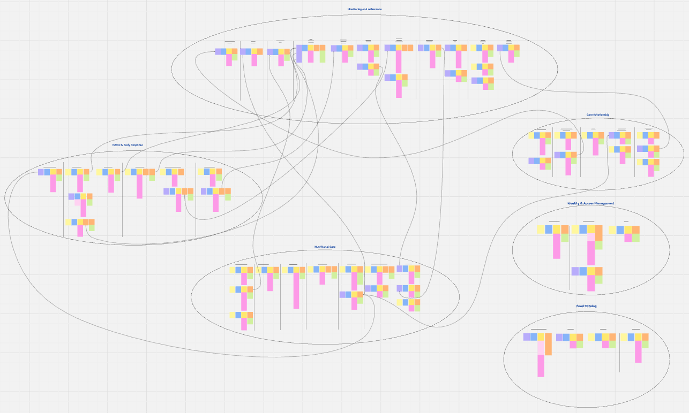

El modelo resultante quedó organizado en treinta y seis subflujos distribuidos en seis contextos, con cincuenta y cinco comandos, dieciocho agregados, ciento veinticinco reglas de negocio, sesenta y cuatro eventos de dominio y treinta políticas.

| Bounded context | Agregados | Comandos | Reglas | Eventos | Políticas |
|---|---|---:|---:|---:|---:|
| `Identity & Access Management (IAM)` | 2 | 4 | 9 | 5 | 1 |
| `Care Relationship` | 2 | 10 | 19 | 10 | 4 |
| `Nutritional Care` | 4 | 11 | 28 | 13 | 4 |
| `Intake & Body Response` | 4 | 10 | 28 | 12 | 3 |
| `Monitoring & Adherence` | 5 | 16 | 33 | 18 | 16 |
| `Food Catalog` | 1 | 4 | 8 | 6 | 2 |
| **Total** | **18** | **55** | **125** | **64** | **30** |

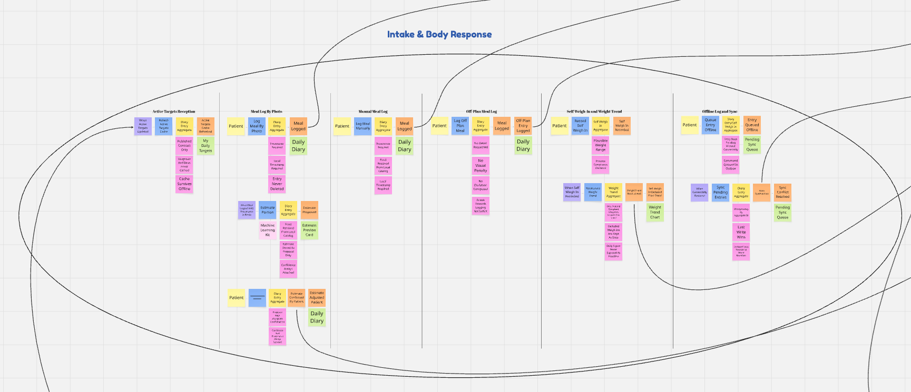


#### 2.5.1.1. Candidate Context Discovery

Esta sección documenta la sesión en la que el equipo identificó los bounded contexts candidatos a partir del dominio modelado. La sesión tuvo una duración aproximada de dos horas y se aplicó la técnica look-for-pivotal-events, complementada al final con start-with-value para clasificar los contextos resultantes.

El equipo recorrió la línea de tiempo buscando los eventos que cambian el estado del proceso de manera irreversible y que hacen que lo que ocurre después obedezca a reglas distintas de lo que ocurría antes. Se identificaron cuatro eventos pivote: `Care Link Established`, porque antes de él no existe relación alguna y después de él existe una relación consentida con obligaciones de acceso; `Nutrition Plan Published`, porque antes de él el profesional delibera y después existe un contrato que el paciente debe poder consultar; `Active Targets Updated`, porque es el hecho que cruza la frontera del consultorio hacia el periodo entre consultas; y `Sustained Deviation Detected`, porque devuelve el control al profesional después de un periodo enteramente asíncrono.

El corte más importante quedó entre las fases 2 y 3 del tablero. El equipo verificó que a cada lado de esa línea cambian simultáneamente el número de actores, el requisito de consistencia y el modo de conectividad, lo que confirma que se trata de una frontera real y no de un cambio de pantalla. Sobre esa base se dibujaron las agrupaciones candidatas y cada una se sometió a cinco pruebas.

| # | Prueba | Pregunta que responde |
|---|---|---|
| 1 | Lingüística | ¿Alguna palabra significa dos cosas distintas a cada lado de la línea? |
| 2 | Invariante | ¿Qué regla protege este contexto que ningún otro puede proteger? |
| 3 | Consistencia | ¿Exige consistencia fuerte inmediata o tolera consistencia eventual? |
| 4 | Volatilidad | ¿A qué ritmo cambian el modelo y los datos? |
| 5 | Competitiva | ¿Es aquí donde el producto se diferencia o donde solo debe estar a la altura? |

La prueba lingüística fue la más productiva, porque cada ambigüedad encontrada justifica por sí sola una frontera: el término peso designa la medición clínica del profesional y también el autopesaje del paciente, que solo significa algo como tendencia; el término alimento designa el ítem del catálogo externo y también el evento de consumo de una persona concreta; y el término plan designa el artefacto clínico versionado y también el conjunto de metas del día. La primera ambigüedad separa `Nutritional Care` de `Intake & Body Response`, la segunda justifica el Anticorruption Layer sobre `Food Catalog` y la tercera justifica publicar un contrato reducido en lugar de exponer el plan completo.

El resultado de la sesión fueron seis bounded contexts, clasificados por su aporte a la diferenciación del producto.

| Clasificación | Bounded context | Responsabilidad | Consistencia |
|---|---|---|---|
| **Core** | `Intake & Body Response` | Capturar fielmente qué comió el paciente y cómo responde su cuerpo | Eventual, offline-first |
| **Core** | `Monitoring & Adherence` | Comparar lo prescrito contra lo real e interpretar la diferencia | Eventual, ventana mínima de siete días |
| Supporting | `Nutritional Care` | El acto clínico completo: evaluación, diagnóstico y prescripción | Fuerte, transaccional |
| Supporting | `Care Relationship` | Quién puede ver a quién y con qué consentimiento | Fuerte, transaccional |
| Generic | `Food Catalog` | Traducir el catálogo externo al dominio y cachearlo localmente | Eventual, cacheable |
| Generic | `Identity & Access Management (IAM)` | Autenticación y emisión del claim de rol | Fuerte, transaccional (autenticación propia) |

La clasificación de `Nutritional Care` como Supporting merece justificación explícita, porque es el contexto donde ocurre el acto profesional completo. El criterio de DDD no es la importancia sino la diferenciación: el expediente clínico, el diagnóstico y la prescripción versionada son exactamente el terreno que Nutrimind y Nutrium ya cubren, de modo que allí el objetivo es estar a la altura. Las tres piezas que constituyen la diferencia competitiva de Healthify son el registro por fotografía, el autopesaje expuesto como tendencia y el índice de consistencia; dos viven en `Intake & Body Response` y una en `Monitoring & Adherence`.

La sesión también descartó explícitamente siete contextos candidatos, decisión que quedó registrada junto con la condición que los haría reaparecer.

| Candidato descartado | Razón del descarte |
|---|---|
| `Patient Record` | Es un read model compuesto que une tres contextos y se compone en el módulo `ReadModels` de la API; confundir una vista con un contexto es uno de los errores más frecuentes en DDD |
| `Assessment` como contexto propio | Acoplamiento máximo con diagnóstico e intervención y ninguna ambigüedad lingüística en la frontera |
| `Portion Estimation / AI` | Es una capacidad técnica, no un lenguaje distinto; vive dentro de `Intake & Body Response` |
| `Target Calculation` | Es aritmética determinista con parámetros elegidos por un humano; son reglas del agregado `Nutrition Plan` |
| `Notifications` | Infraestructura genérica frente a la cual el sistema es conformista |
| `Scheduling` | Demasiado delgado; se absorbe como el agregado `Scheduled Follow Up` |
| `Gamification` | No existe por decisión ética del producto; convertirlo en contexto institucionalizaría algo que el equipo prohibió |

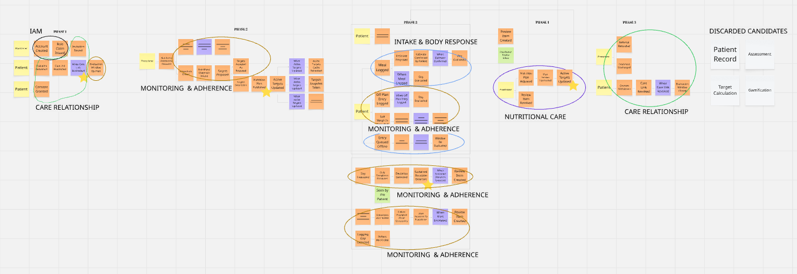

#### 2.5.1.2. Domain Message Flows Modeling

Esta sección documenta cómo colaboran los bounded contexts para resolver los casos de negocio relevantes. Para ello el equipo aplicó Domain Storytelling, elaborando un diagrama por escenario en el que cada actor y cada contexto aparece como un participante, y cada mensaje se numera en el orden en que ocurre. El propósito de estos diagramas es verificar que las fronteras definidas en la sección anterior resisten los flujos reales del negocio y que ningún escenario obliga a un contexto a conocer el modelo interno de otro.

Se modelaron cuatro escenarios, elegidos por ser los que más fronteras atraviesan.

**Escenario 1 — Vinculación del paciente durante la consulta.** El profesional emite la invitación, el paciente la redime escaneando el código QR y otorga su consentimiento; `Care Relationship` publica `Care Link Established` y `Monitoring & Adherence` reacciona abriendo la ventana de evaluación. El escenario demuestra que el vínculo es condición previa de todo lo demás.

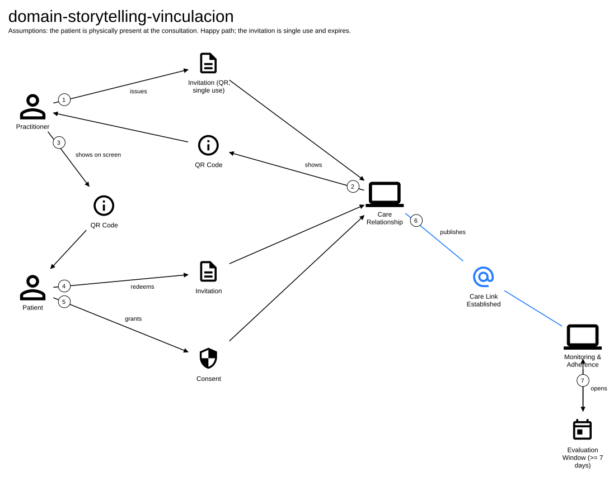

**Escenario 2 — Prescripción y publicación de metas.** El profesional registra la evaluación, emite el diagnóstico, elige la base de cálculo, prescribe las metas y publica el plan; `Nutritional Care` publica `Active Targets Updated`, que es consumido simultáneamente por `Intake & Body Response` para refrescar su caché de metas, por `Monitoring & Adherence` para tomar el snapshot del día y por `Care Relationship` para marcar las metas como pendientes de acuse de recibo. El escenario evidencia que lo que cruza la frontera es el contrato reducido y no el plan clínico: el diagnóstico y la base de cálculo nunca salen de `Nutritional Care`.

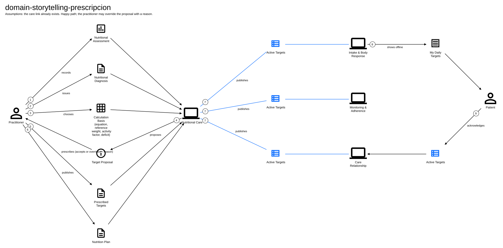

**Escenario 3 — Registro de comida entre consultas, con y sin conexión.** El paciente fotografía su comida, ML Kit propone la estimación en el dispositivo, el paciente la confirma o la ajusta y `Intake & Body Response` publica `Meal Logged` y `Estimate Confirmed By Patient`; `Monitoring & Adherence` evalúa el día contra el snapshot correspondiente. La variante sin conexión muestra la entrada encolada y el reprocesamiento de la ventana tras `Entry Synchronized`. El escenario demuestra que el profesional no participa en ningún paso de la cadena.

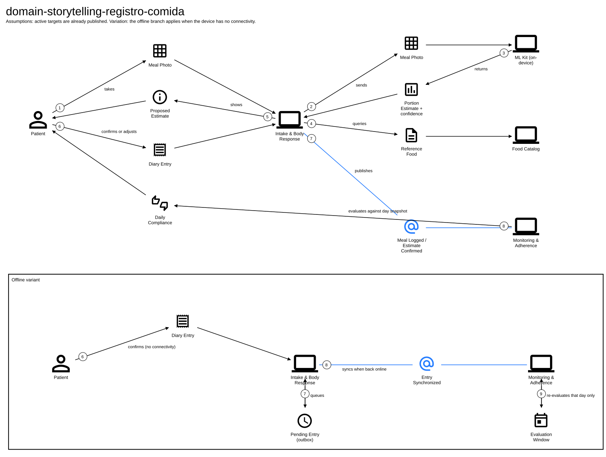

**Escenario 4 — Detección de desviación y decisión del profesional.** `Monitoring & Adherence` detecta la desviación sostenida y publica la señal; `Nutritional Care` la recibe mediante una política, crea un ítem de revisión y lo deposita en la bandeja del profesional, quien decide si ajusta el plan o cierra el ítem sin ajustarlo. El escenario es el que más se discutió en la sesión, porque hace visible la decisión de diseño más importante del modelo: la cadena automática entra por una política y muere en una bandeja de entrada, de manera que ningún algoritmo modifica un plan clínico.

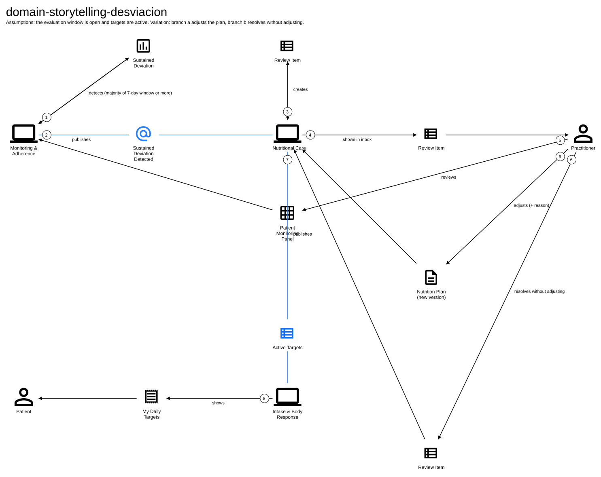

#### 2.5.1.3. Bounded Context Canvases

Esta sección presenta el Bounded Context Canvas de cada uno de los seis contextos identificados. La elaboración siguió el proceso iterativo propuesto por la técnica: se definió primero el Context Overview con el propósito y la clasificación estratégica del contexto, se destilaron después las reglas de negocio y el lenguaje ubicuo propio del contexto, se analizaron sus capabilities distinguiendo los comandos que recibe, las consultas que atiende y los eventos que publica, se capturaron sus dependencias entrantes y salientes con el patrón de relación correspondiente, y finalmente se sometió cada canvas a una crítica de diseño en la que el equipo buscó señales de frontera mal trazada, como un número desproporcionado de dependencias o un lenguaje que se repite en dos contextos.

Los canvases se elaboraron en el orden de importancia estratégica de cada contexto, comenzando por los dos contextos Core.

**`Intake & Body Response` (Core).** Su propósito es capturar fielmente lo que el paciente come y cómo responde su cuerpo, sin emitir ningún juicio sobre ello. Es de escritura exclusiva del paciente: no existe ningún comando del profesional en este contexto, y el profesional accede a la información únicamente a través de un read model. Sus reglas más características son que una entrada nunca se elimina, que la procedencia y la marca de tiempo local son obligatorias, que la estimación de la fotografía se almacena solo como propuesta junto con su nivel de confianza, y que el valor diario del autopesaje nunca se expone como titular sino como tendencia.


**`Monitoring & Adherence` (Core).** Su propósito es comparar lo prescrito contra lo realmente registrado e interpretar la diferencia. Es el contexto que concentra dieciséis de las treinta políticas del modelo, lo que confirma su naturaleza reactiva: casi nadie lo invoca directamente, sino que actúa a partir de lo que ocurre en los demás contextos. Sus reglas más características son que ningún día se evalúa contra metas distintas de las vigentes ese día, que una ventana menor a siete días nunca produce desviación, y que el vacío de registro se excluye del cálculo de desviación y nunca escala al profesional.


**`Nutritional Care` (Supporting).** Su propósito es sostener el acto clínico completo: evaluación, diagnóstico, prescripción y ajuste del plan entre consultas. Sus reglas más características son que una evaluación cerrada es inmutable y su corrección genera una evaluación nueva, que no existe plan sin diagnóstico vigente, que todo ajuste exige una razón y que la versión anterior se supersede pero nunca se elimina. Es también el contexto que define el Published Language `Active Targets`.


**`Care Relationship` (Supporting).** Su propósito es determinar quién puede ver a quién y con qué consentimiento. Publica una única pregunta al resto del sistema, `Is Care Link Active`, y es donde se hace cumplir técnicamente el principio de asimetría entre los dos roles. Sus reglas más características son que la invitación es de un solo uso y con vencimiento, que el paciente no puede autovincularse, que el vínculo nace inactivo hasta que exista consentimiento y que el consentimiento es siempre revocable sin justificación.


**`Food Catalog` (Generic).** Su propósito es traducir el catálogo nutricional externo al dominio y mantenerlo disponible localmente. Sus reglas más características son que ningún identificador externo entra al dominio, que la traducción de taxonomía es obligatoria y que la búsqueda cae en la caché local cuando no hay conexión.


**`Identity & Access Management (IAM)` (Generic).** Su propósito es autenticar y emitir el claim de rol. Es el único contexto que no publica ningún evento hacia los demás, porque el claim viaja dentro del token de sesión, que es infraestructura y no dominio. Sus reglas más características son que el rol se declara en el registro, que es inmutable durante la sesión y que cambiar de rol exige volver a autenticarse.


### 2.5.2. Context Mapping

Esta sección documenta la elaboración del Context Map, que representa las relaciones estructurales entre los seis bounded contexts. El equipo revisó la información recolectada en los canvases y, antes de fijar el mapa, evaluó explícitamente cuatro alternativas mediante las preguntas propias de la técnica: si convenía redistribuir capabilities entre contextos, si alguno debía dividirse, si alguna capability debía duplicarse y si hacía falta crear servicios compartidos.

De esa discusión surgieron cuatro decisiones. La primera fue no trasladar el cálculo del índice de consistencia a `Intake & Body Response` pese a que allí están sus dos insumos, porque si el contexto que registra también juzga, el registro deja de ser un lugar seguro para declarar y se incentiva exactamente la omisión selectiva que el producto busca eliminar. La segunda fue mantener la tendencia de peso dentro de `Intake & Body Response`, porque es un suavizado de los datos del propio paciente que no necesita el plan y debe estar disponible sin conexión, a diferencia de la desviación y del índice, que sí requieren el plan y umbrales de interpretación. La tercera fue no crear un contexto compartido de expediente, ya que `Patient Record` es un read model compuesto que se arma en el módulo `ReadModels` de la API a partir de las fachadas ACL de los contextos involucrados. La cuarta fue reducir el shared kernel al mínimo deliberado: únicamente los identificadores `PatientId`, `PractitionerId`, `CareLinkId` y `PlanId`, y las unidades de medida, bajo el criterio de que un shared kernel grande es un bounded context que no se llegó a dibujar.

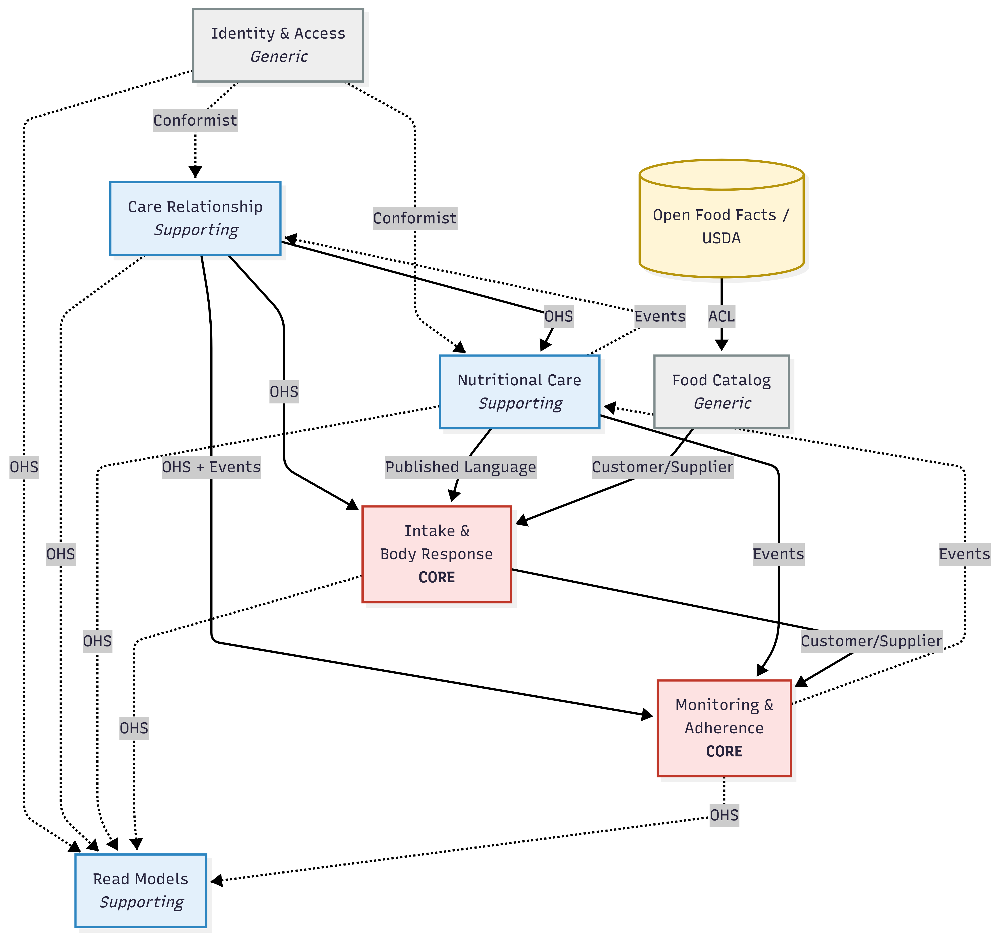

El mapa se lee de upstream a downstream en el sentido de las flechas, y cada contexto conserva el color de su clasificación estratégica: rojo para los dos contextos Core, azul para los Supporting, gris para los Generic y amarillo para el sistema externo. Las líneas continuas representan dependencias de las que el contexto downstream necesita para operar, ya sea un contrato consultado o datos que alimentan su modelo; las líneas punteadas representan acoplamientos deliberadamente débiles, en los que el downstream solo se conforma con un modelo ajeno o reacciona a una notificación sin depender de ella para funcionar.

Los patrones de relación seleccionados para cada integración son los siguientes.

| Relación | Patrón | Justificación |
|---|---|---|
| `IAM` → `Care Relationship` | Conformist | El claim de rol viaja en el token de sesión: es infraestructura y no dominio. `Care Relationship` lo adopta tal cual para hacer cumplir la asimetría entre profesional y paciente |
| `IAM` → `Nutritional Care` | Conformist | Los comandos clínicos exigen el rol de profesional, que se toma sin traducción del token JWT emitido por `IAM`. Todos los contextos leen el mismo claim de rol del token para autorizar sus endpoints; lo que distingue a los contextos del paciente es que, además del rol, dependen del vínculo que resuelve `Care Relationship` para decidir quién puede ver sus datos |
| `Care Relationship` → `Nutritional Care` | Open Host Service | Publica una sola pregunta, `Is Care Link Active`, que `Nutritional Care` consulta antes de evaluar, diagnosticar o prescribir sobre un paciente |
| `Care Relationship` → `Intake & Body Response` | Open Host Service | La misma pregunta determina si lo que registra el paciente puede ser leído por un profesional a través del read model |
| `Care Relationship` → `Monitoring & Adherence` | Open Host Service + eventos | Además de consultar el vínculo, `Monitoring` reacciona a `Care Link Established` abriendo la ventana de evaluación, y deja de evaluar cuando el consentimiento se revoca |
| `Nutritional Care` → `Intake & Body Response` | Published Language | El plan clínico no se expone entero; se publica `Active Targets`, un contrato reducido y versionado que `Intake & Body Response` cachea para operar sin conexión. El diagnóstico y la base de cálculo nunca cruzan la frontera |
| `Nutritional Care` → `Monitoring & Adherence` | Integración por eventos | `Monitoring` consume `Active Targets Updated` y las mediciones clínicas para tomar el snapshot de metas vigentes del día, de modo que ningún día se evalúe contra metas distintas de las que regían entonces |
| `Nutritional Care` ⇢ `Care Relationship` | Integración por eventos | `Care Relationship` reacciona a `Active Targets Updated` marcando las metas como pendientes de acuse de recibo por el paciente; es una notificación y no una dependencia de datos |
| `Intake & Body Response` → `Monitoring & Adherence` | Customer/Supplier | `Monitoring` consume ingesta y tendencia de peso como cliente con voz: si necesita un dato nuevo, lo negocia con el proveedor. El contexto que registra no juzga, y el que juzga no registra |
| `Monitoring & Adherence` ⇢ `Nutritional Care` | Integración por eventos, nunca por comandos | Modelarlo como comando crearía un ciclo de dependencia y permitiría que un algoritmo modificara un plan clínico. `Monitoring` publica la señal de desviación, `Nutritional Care` la convierte en un ítem de revisión y el profesional decide |
| Open Food Facts / USDA → `Food Catalog` | Anticorruption Layer | La taxonomía externa es inestable, incompleta para el mercado peruano y responde a un lenguaje conceptual distinto; ningún identificador externo entra al dominio |
| `Food Catalog` → `Intake & Body Response` | Customer/Supplier | El registro necesita el alimento en el momento del uso y no cuando el catálogo se actualice, por lo que `Intake & Body Response` define qué búsquedas y qué datos nutricionales debe garantizar el catálogo, incluida su disponibilidad en caché local |

Dos rasgos del mapa merecen destacarse. El primero es que `Care Relationship` es el único contexto que aparece como upstream de los tres contextos que manejan información del paciente, lo que refleja que el vínculo consentido es condición previa de todo lo demás. El segundo es que el único ciclo aparente, entre `Nutritional Care` y `Monitoring & Adherence`, no es un ciclo de dependencia: en un sentido viajan las metas vigentes y en el otro solo una señal punteada que termina en la bandeja del profesional, de manera que ninguno de los dos contextos puede modificar el estado del otro.

El mapa resultante contiene trece integraciones por evento originadas en once eventos distintos, sobre un total de sesenta y cuatro eventos del modelo. Que cerca del ochenta y tres por ciento de los eventos permanezca dentro de un solo contexto es la señal que el equipo tomó como confirmación de que las fronteras están bien trazadas; si durante la implementación apareciera la necesidad de un duodécimo evento de integración, sería indicio de que alguna frontera está filtrando responsabilidades.

### 2.5.3. Software Architecture

La arquitectura de software de Healthify se representa mediante el modelo C4, aplicando tres de sus niveles de abstracción — Contexto, Contenedores y Componentes — sobre la solución completa: la aplicación móvil Flutter, el backend ASP\.NET Core 10, el Landing Page estático y la base de datos MySQL 8.4. El diseño sigue los seis Bounded Contexts identificados en el proceso estratégico de Domain-Driven Design (2.5.1 y 2.5.2), materializados aquí como módulos concretos tanto en el cliente como en el servidor. Estos tres niveles se detallan en las secciones 2.5.3.1 a 2.5.3.3; adicionalmente, se presenta en la sección 2.5.3.4 el Deployment Diagram, diagrama suplementario del modelo C4 que describe la distribución física de la solución sobre la infraestructura.

#### 2.5.3.1. Software Architecture Context Level Diagrams

El Diagrama de Contexto (Nivel 1 del modelo C4) representa a Healthify como un sistema centralizado y detalla su interacción con los dos actores principales y los sistemas externos con los que se integra. Este diagrama permite visualizar el alcance global de la solución y los límites del sistema frente a servicios de terceros.

**Elementos:**

- **Healthify:** Sistema central que provee el seguimiento nutricional entre consultas, la comunicación entre paciente y nutricionista, y el monitoreo de adherencia al plan.
- **Patient:** Persona que registra sus comidas y peso entre consultas, y sigue el plan prescrito por su nutricionista.
- **Practitioner:** Persona que realiza el acto clínico (evaluación, diagnóstico, prescripción) y revisa las señales de adherencia de sus pacientes.
- **External Systems:**
	- `ML Kit:` Motor de visión artificial on-device que estima la porción del plato a partir de la foto de la comida, sin salida de red.
	- `Nutritional Data Providers:` Fuentes externas de catálogo nutricional (Open Food Facts, USDA) consultadas a través del Anticorruption Layer de Food Catalog.


#### 2.5.3.2. Software Architecture Container Level Diagrams

El Diagrama de Contenedores (Nivel 2 del modelo C4) desglosa el sistema Healthify en sus principales unidades lógicas de ejecución. En este nivel se especifican las responsabilidades de cada contenedor, las tecnologías elegidas para su implementación y los protocolos de comunicación que permiten la interacción entre ellos y con los sistemas externos.

**Elementos:**

- **Landing Page:** Sitio web estático que presenta la propuesta de valor de Healthify y dirige a los usuarios hacia la descarga de la aplicación.
   - **Tecnología:** `HTML5 + CSS3 + JavaScript`.
- **Mobile Application:** Frontend donde Patient y Practitioner interactúan con la plataforma. Aplicación Flutter única con dos navigation shells seleccionados según el claim de rol, que agrupa internamente los seis Bounded Contexts del cliente. Programa además los recordatorios locales de pesaje y de vacíos de registro mediante la API de notificaciones del sistema operativo, sin depender de un servicio externo.
   - **Tecnología:** `Flutter`.
- **API Application:** Backend que maneja la lógica de negocio de los seis Bounded Contexts, expuesta vía una API RESTful.
   - **Tecnología:** `ASP.NET Core 10 (C#)`.
- **Database:** Almacena usuarios, vínculos de cuidado, evaluaciones, diagnósticos, planes, entradas del diario y ventanas de monitoreo.
   - **Tecnología:** `MySQL 8.4`.
- **External Systems:** APIs de terceros que se integran con el backend y con el cliente para extender las capacidades del sistema.
   - **Tecnología:** `JSON/HTTPS (REST)` para el backend; llamada on-device sin red para ML Kit.


#### 2.5.3.3. Software Architecture Components Diagrams

El Diagrama de Componentes (Nivel 3 del modelo C4) describe la estructura interna de los contenedores principales de Healthify. En esta sección se detallan las capas DDD de cada contenedor, sus responsabilidades específicas y las tecnologías utilizadas.

**A. Mobile Application Components (Frontend)**

La aplicación Flutter se organiza en 6 Bounded Contexts, cada uno con 4 capas siguiendo el patrón de arquitectura del Domain-Driven Design. Además, se tiene un Frontend Shared con 3 capas siguiendo también el patrón de arquitectura del Domain-Driven Design.

El diagrama a continuación muestra todos los componentes de la arquitectura en un único bloque.


Cada Bounded Context contiene una capa de Presentation con las pantallas y widgets de Flutter, una capa de Application con los servicios Dart que orquestan la lógica del cliente, una capa de Domain con los modelos del lado cliente, y una capa de Infrastructure con el cliente HTTP Dio que se comunica con el API Application. Todos los BCs del frontend utilizan el Frontend Shared, que provee las utilidades BaseApi, el cliente de Outbox y almacenamiento local, los objetos de valor compartidos como units.record y active-targets-cache.record, y los widgets de presentación transversales como el app shell y el selector de navigation shell.

Para apreciar la separación por capas Domain-Driven Design de cada Bounded Context y del Frontend Shared, se presenta a continuación un diagrama de detalle individual por cada uno.

**Frontend Shared:**

Módulo transversal utilizado por todos los Bounded Contexts del frontend que agrupa las utilidades HTTP base, el almacenamiento local, la cola de sincronización Outbox y los widgets de presentación reutilizables. Se organiza en 3 capas DDD: Presentation, Domain e Infrastructure. No contiene lógica de negocio propia.


La capa Presentation del Frontend Shared agrupa las vistas y componentes Flutter reutilizables a lo largo de toda la aplicación. El detalle de sus vistas y componentes se presenta a continuación:

 - **Views:**

   

 - **Components:**

   

**Bounded Contexts:**

 - **IAM:** Gestiona las pantallas de inicio de sesión y registro.

   

   La capa Presentation contiene únicamente vistas Flutter para este Bounded Context. El detalle de sus vistas se presenta a continuación:

   - **Views:**

     

 - **Care Relationship:** Gestiona el escaneo del código QR de invitación, el consentimiento del paciente y el reconocimiento de metas activas.

   

   La capa Presentation contiene vistas y componentes Flutter para este Bounded Context. El detalle de sus vistas y componentes se presenta a continuación:

   - **Views:**

     

   - **Components:**

     

 - **Nutritional Care:** Gestiona las pantallas de evaluación, diagnóstico y prescripción del plan, usadas por el Practitioner durante la consulta.

   

   La capa Presentation contiene vistas y componentes Flutter para este Bounded Context. El detalle de sus vistas y componentes se presenta a continuación:

   - **Views:**

     

   - **Components:**

     

 - **Intake & Body Response:** Gestiona el registro de comidas por foto, la estimación de porción, el autopesaje y el diario offline. Escritura exclusiva del Patient.

   

   La capa Presentation contiene vistas y componentes Flutter para este Bounded Context. El detalle de sus vistas y componentes se presenta a continuación:

   - **Views:**

     

   - **Components:**

     

 - **Monitoring & Adherence:** Gestiona el indicador de cumplimiento diario y el panel de monitoreo del paciente.

   

   La capa Presentation contiene vistas y componentes Flutter para este Bounded Context. El detalle de sus vistas y componentes se presenta a continuación:

   - **Views:**

     

   - **Components:**

     

 - **Food Catalog:** Gestiona la búsqueda de alimentos contra el catálogo de referencia cacheado localmente.

   

   La capa Presentation contiene vistas y componentes Flutter para este Bounded Context. El detalle de sus vistas y componentes se presenta a continuación:

   - **Views:**

     

   - **Components:**

     

**B. API Application Components (Backend)**

El backend se organiza en 6 Bounded Contexts y un Shared Kernel, cada uno siguiendo el patrón de arquitectura del Domain-Driven Design. Todos los Bounded Contexts comparten una única base de datos MySQL 8.4, accedida a través de los repositorios de Entity Framework Core 10 en la capa de Infrastructure de cada uno.

El diagrama a continuación muestra todos los componentes de la arquitectura en un único bloque.


Cada Bounded Context contiene una capa de Interfaces con los Controllers de ASP.NET Core que reciben las peticiones HTTP y, cuando corresponde, las fachadas ACL que exponen contratos a otros Bounded Contexts; una capa de Application con los servicios y comandos que orquestan los casos de uso; una capa de Domain con los agregados y entidades del dominio; y una capa de Infrastructure con los repositorios de Entity Framework Core. Todos los BCs del backend utilizan el Shared Kernel a través de su capa Application.

Para apreciar la separación por capas Domain-Driven Design de cada Bounded Context y del Shared Kernel, se presenta a continuación un diagrama de detalle individual por cada uno.

El detalle individual se acota a la capa de Interfaces porque es la única que expone la comunicación entre Bounded Contexts: las fachadas ACL representan los contratos que un contexto ofrece a los demás y los Controllers REST definen los puntos de entrada hacia el exterior. Las capas de Application, Domain e Infrastructure encapsulan lógica interna a cada contexto y no forman parte de su frontera de integración, por lo que su descomposición no aporta a la lectura de las relaciones inter-BC en este nivel; dicho detalle interno corresponde a niveles más profundos del modelo C4.

**Shared Kernel:**

Componente transversal utilizado por todos los Bounded Contexts del backend. Es mínimo y deliberado: solo agrupa identificadores (PatientId, PractitionerId, CareLinkId, PlanId) y unidades de medida. No contiene lógica de negocio propia ni acceso a base de datos.


**Read Models compuestos (`ReadModels`):**

Módulo de la API que arma las vistas que necesitan datos de más de un Bounded Context. No es un contenedor aparte ni un Bounded Context: no tiene dominio, comandos ni tablas propias, y solo lee a través de las fachadas ACL de los contextos. Se organiza en dos capas:

- **Interfaces:** `PatientRecordController` expone `GET /api/v1/patients/{patientId}/record` (read model Patient Record, para el paciente y su nutricionista vinculado) y `PatientMonitoringPanelController` expone `GET /api/v1/patients/{patientId}/monitoring-panel` (read model Patient Monitoring Panel, solo para el rol `Practitioner`). Ambos verifican el vínculo activo con `ICareRelationshipContextFacade` antes de responder.
- **Application:** `PatientRecordComposer` combina las fachadas de IAM, Care Relationship, Nutritional Care, Intake & Body Response y Monitoring & Adherence; `PatientMonitoringPanelComposer` combina las de Nutritional Care, Intake & Body Response y Monitoring & Adherence.

**Bounded Contexts:**

 - **IAM:** Maneja la autenticación y la emisión del role claim mediante hashing con BCrypt y tokens JWT propios, sin proveedor de identidad externo.

   

   La capa Interfaces contiene un contrato ACL (`IIamContextFacade`, con el que los demás Bounded Contexts resuelven identidades y roles puntuales) y endpoints REST para este Bounded Context. El detalle de los endpoints REST se presenta a continuación:

   - **REST:**

     

 - **Care Relationship:** Única fuente de verdad sobre quién puede ver a quién. Aplica el principio de asimetría entre paciente y profesional.

   

   La capa Interfaces contiene un contrato ACL y endpoints REST para este Bounded Context. El detalle se presenta a continuación:

   - **ACL:**

     

   - **REST:**

     

 - **Nutritional Care:** Ejecuta el acto clínico completo: evaluación, diagnóstico y prescripción, con versionado y trazabilidad.

   

   La capa Interfaces contiene un contrato ACL y endpoints REST para este Bounded Context. El detalle se presenta a continuación:

   - **ACL:**

     

   - **REST:**

     

 - **Intake & Body Response:** Persiste el consumo declarado del paciente y su respuesta corporal. Escritura exclusiva del paciente.

   

   La capa Interfaces contiene un contrato ACL y endpoints REST para este Bounded Context. El detalle se presenta a continuación:

   - **ACL:**

     

   - **REST:**

     

 - **Monitoring & Adherence:** Compara lo prescrito contra lo real e interpreta la diferencia. Nunca escribe directamente sobre Nutritional Care.

   

   La capa Interfaces contiene un contrato ACL y endpoints REST para este Bounded Context. El detalle se presenta a continuación:

   - **ACL:**

     

   - **REST:**

     

 - **Food Catalog:** Traduce el catálogo externo hacia el dominio y lo cachea. Aplica Anticorruption Layer frente a Open Food Facts y USDA.

   

   La capa Interfaces contiene un contrato ACL y endpoints REST para este Bounded Context. El detalle se presenta a continuación:

   - **ACL:**

     

   - **REST:**

     

#### 2.5.3.4. Software Architecture Deployment Diagram

El Deployment Diagram (diagrama suplementario del modelo C4, elaborado en notación UML) muestra la distribución física de Healthify sobre la infraestructura de hardware y los entornos de ejecución. Este diagrama visualiza los dispositivos, servidores y contenedores que alojan cada artefacto de software, así como los protocolos de comunicación entre ellos.

**Elementos:**

- **Patient's / Practitioner's Mobile Device:** Dispositivo físico (`<<device>>`) del usuario final, donde se instala y ejecuta el artefacto `Mobile Application (Flutter)` distribuido vía Firebase App Distribution.
- **GitHub Pages:** Entorno de ejecución (`<<execution environment>>`) que aloja el artefacto estático `Landing Page (HTML5 + CSS3 + JS)`.
- **Oracle Cloud Infrastructure:** Nodo de nube (`<<cloud>>`) que agrupa toda la infraestructura del backend.
   - **Compute Instance:** Máquina virtual que hospeda el `Docker Engine`.
   - **Docker Engine:** Entorno de ejecución de contenedores, dentro del cual corren dos contenedores aislados entre sí:
      - **API Container:** Contenedor que aloja el artefacto `API Application (ASP.NET Core 10)`.
      - **Database Container:** Contenedor que aloja la base de datos `MySQL 8.4`.

**Relaciones:**

- `Mobile Device → Oracle Cloud Infrastructure` (`JSON/HTTPS`): la aplicación móvil consume la API RESTful del backend.
- `Mobile Device → GitHub Pages` (`HTTPS`): el dispositivo accede al Landing Page como contenido estático.
- `API Application → Database` (`SQL/TCP`): la API se conecta a MySQL 8.4 a través de la red interna de Docker, pese a correr en contenedores independientes.


## 2.6. Tactical-Level Domain-Driven Design

### 2.6.1. Bounded Context: Intake & Body Response

#### 2.6.1.1. Domain Layer

El bounded context Intake & Body Response, implementado en `Healthify.Platform.IntakeBodyResponse`, funciona como el diario del paciente y guarda tanto las comidas que este declara haber consumido como los autopesajes que realiza en casa. Su Domain Layer está formado por cuatro aggregate roots, un conjunto de value objects que validan sus propios valores y cuatro abstracciones de repositorio. Todo lo que hace este contexto es registrar información, nunca evaluarla, de manera que ninguno de sus atributos o métodos habla de cumplimiento, desviación, racha o penalización. Esa comparación entre lo prescrito y lo comido le corresponde a Monitoring & Adherence.

**Aggregates (Aggregate Roots)**

`ActiveTargetsCache` es la copia local que el paciente guarda del contrato publicado por el profesional, es decir aquello que debe apuntar durante el día. El paciente actúa como raíz del agregado, con un caché por persona que se reemplaza en el sitio, y esa decisión es la que permite que la app siga funcionando sin conectividad.

| Atributo | Tipo | Scope | Descripción |
|---|---|---|---|
| `PatientId` | `int` | `public get / private set` | Identidad del agregado, que funciona además como clave primaria. |
| `PlanVersion` | `int` | `public get / private set` | Versión del contrato cacheado. |
| `ValidFrom` | `DateTimeOffset` | `public get / private set` | Vigencia declarada por el contrato. |
| `EnergyKcal`, `ProteinG`, `CarbG`, `FatG` | `decimal` | `public get / private set` | Los objetivos diarios. |
| `RefreshedAt` | `DateTimeOffset` | `public get / private set` | Momento del último refresco. |
| `Guidelines`, `Restrictions` | `IReadOnlyList<string>` | `public` (computada) | Texto libre que este contexto no interpreta. |

| Método | Scope | Descripción |
|---|---|---|
| `ActiveTargetsCache(RefreshActiveTargetsCacheCommand)` | `public` | Constructor, que delega en `Apply`. |
| `Refresh(RefreshActiveTargetsCacheCommand)` | `public` | Reemplaza el caché cuando llega una versión más nueva del contrato. |
| `Apply(RefreshActiveTargetsCacheCommand)` | `private` | Valida que versión y energía sean positivas, redondea y normaliza las listas. |

Las reglas *Published Contract Only* y *Diagnosis And Basis Never Cached* se cumplen por la propia estructura de la clase, ya que no existen campos para el diagnóstico, el razonamiento clínico, la ecuación ni el déficit, y por lo tanto esa información no puede llegar a almacenarse en el caché.

`DiaryEntry` es el registro de un consumo declarado por el paciente y constituye el agregado central del contexto.

| Atributo | Tipo | Scope | Descripción |
|---|---|---|---|
| `Id` | `DiaryEntryId` | `public get / private set` | Identidad tipada. |
| `PatientId` | `int` | `public get / private set` | Referencia cross-context. |
| `LocalTimestamp` | `DateTime` | `public get / private set` | Fecha y hora local del dispositivo del paciente en el momento del registro. |
| `LocalUtcOffsetMinutes` | `int` | `public get / private set` | Offset declarado por el dispositivo. |
| `DeclaredLocalTimestamp` | `DateTimeOffset` | `public` (computada) | El momento reconstruido, que el servidor nunca reescribe. |
| `Provenance` | `Provenance` | `public get / private set` | Puede ser `Photo`, `Manual` u `OffPlan`. |
| `PhotoRef` | `string?` | `public get / private set` | Referencia que el cliente posee, ya que el servidor nunca guarda bytes de imagen. |
| `ProposedReferenceFoodId`, `ProposedPortionGrams`, `ProposedConfidence`, `ProposedEstimatedAt` | nullable | `public get / private set` | Proyección persistida del VO `ProposedEstimate`. |
| `ConfirmedReferenceFoodId`, `ConfirmedPortionGrams`, `ConfirmedAt` | nullable | `public get / private set` | Proyección persistida del VO `ConfirmedEstimate`. |
| `SyncState` | `SyncState` | `public get / private set` | Puede ser `Pending`, `Synced` o `Conflicted`. |
| `ClientEntryId` | `Guid?` | `public get / private set` | Identificador generado por el dispositivo offline, que vuelve idempotente la sincronización. |
| `LocalDate` | `DateOnly` | `public` (computada) | El día de calendario que el paciente estaba viviendo, no el del servidor. |

| Método | Scope | Reglas que aplica |
|---|---|---|
| `DiaryEntry(int, LocalTimestamp, Provenance, SyncState, string?, Guid?)` | `public` | Aplica *Local Timestamp Required* y *Provenance Required*. |
| `ProposeEstimate(ProposedEstimate)` | `public` | Aplica *Estimate Stored As Proposal Only*, de modo que una propuesta nunca puede llegar después de que el paciente ya se pronunció. |
| `ConfirmProposedEstimate()` | `public` | Aplica *Proposal Kept Alongside Confirmation*, dejando intactas las columnas de la propuesta. |
| `AdjustProposedEstimate(int, decimal)` | `public` | Escribe la corrección al lado de la propuesta y nunca encima, para que el tamaño de esa corrección quede visible. |
| `ConfirmDirectly(ConfirmedEstimate)` | `public` | Atiende el registro manual, donde lo tecleado es una confirmación desde el inicio. |
| `MarkSynchronized()` / `MarkConflicted()` | `public` | Resuelven las transiciones de sincronización. |
| `ResolveWithLatest(int, decimal, DateTimeOffset) : bool` | `public` | Aplica *Last Write Wins*, pero solo sobre el estimado, ya que el momento declarado no es alcanzable desde aquí. |
| `StoreConfirmation(int, decimal)` | `private` | Construye el VO y lo aplana en columnas. |

El agregado no ofrece ningún método para eliminar entradas, y así se aplica la regla *Diary Entry Cannot Be Deleted*, puesto que el historial debe conservarse completo para que el seguimiento resulte interpretable.

`SelfWeighIn` es una lectura de peso que el paciente se tomó a sí mismo. No es una medición clínica y el contexto nunca pretende lo contrario, ya que se toma sin supervisión y en una báscula desconocida, razón por la cual el protocolo se declara junto a ella.

| Atributo | Tipo | Scope | Descripción |
|---|---|---|---|
| `Id` | `SelfWeighInId` | `public get / private set` | Identidad tipada. |
| `PatientId` | `int` | `public get / private set` | Referencia cross-context. |
| `ValueKg` | `decimal` | `public get / private set` | La lectura declarada. |
| `LocalTimestamp` / `LocalUtcOffsetMinutes` | `DateTime` / `int` | `public get / private set` | Reciben el mismo tratamiento que en `DiaryEntry`. |
| `ProtocolFastedState`, `ProtocolSameTimeOfDay`, `ProtocolSameScale` | `bool` | `public get / private set` | Proyección del VO `ProtocolCompliance`. |
| `FollowsProtocol` | `bool` | `public` (computada) | Sostiene *Only Protocol Compliant Weigh Ins Smooth The Trend*. |

Conviene añadir la regla *Excluded Weigh Ins Are Kept As Data*, según la cual una lectura fuera de protocolo se guarda completa aunque no se use para calcular la tendencia.

`WeightTrend` es la serie de peso suavizada del paciente y constituye la unidad que este contexto publica sobre peso corporal, con el paciente como raíz.

| Atributo | Tipo | Scope | Descripción |
|---|---|---|---|
| `DefaultWindowSize` | `const int = 7` | `public` | Siete días absorben un ritmo semanal sin llegar a ocultar un cambio real. |
| `PatientId` | `int` | `public get / private set` | Funciona como clave primaria. |
| `WindowSize` | `int` | `public get / private set` | Largo de la media móvil. |
| `LastRecalculatedAt` | `DateTimeOffset` | `public get / private set` | Auditoría del cálculo. |
| `Points` | `IReadOnlyList<WeightTrendPoint>` | `public` (computada) | La serie suavizada, ordenada de lo más antiguo a lo más reciente. |

| Método | Scope | Descripción |
|---|---|---|
| `WeightTrend(int patientId, int windowSize = DefaultWindowSize)` | `public` | Exige que la ventana sea positiva. |
| `Recalculate(IReadOnlyList<SelfWeighIn>) : IReadOnlyList<int>` | `public` | Es el método principal del agregado. Separa las lecturas fuera de protocolo y devuelve sus identificadores, agrupa por día quedándose con la última lectura de cada uno, calcula la media móvil de cola y reconstruye la serie completa. Se reconstruye en lugar de anexarse porque una lectura tardía cambia los puntos que la rodean. |

El filtrado vive dentro del agregado, que recibe todas las lecturas y devuelve las que excluyó, de modo que el servicio de aplicación nunca decide qué cuenta.

**Value Objects**

| Clase | Propósito | Reglas y miembros |
|---|---|---|
| `ProposedEstimate` | Lo que el estimador on-device cree que se comió, que es una propuesta y nunca un hecho. | `ReferenceFoodId > 0`, `PortionGrams > 0`, `Confidence` y `EstimatedAt`. |
| `ConfirmedEstimate` | Lo que el paciente dijo que comió. | No lleva nivel de confianza, ya que el valor lo declara el paciente y no un estimador. |
| `ProtocolCompliance` | Las tres condiciones que hacen comparable un autopesaje con el anterior. | `FastedState`, `SameTimeOfDay` y `SameScale`, donde `FollowsProtocol` exige las tres a la vez. |
| `WeightTrendPoint` | Un punto de la serie suavizada. | `Date : DateOnly` y `SmoothedValueKg > 0`. |
| `LocalTimestamp` | El único timestamp de la plataforma que el servidor no posee. | Tolera hasta 24 h de desfase futuro, dado que los relojes de los dispositivos derivan. |
| `Confidence` | Cuán seguro estaba el estimador, en una escala de 0 a 1. | Sostiene *Confidence Always Attached*, según la cual toda estimación debe indicar su nivel de confianza para no confundirse con una medición. |
| `WeightKg` | Un peso corporal dentro del rango que un cuerpo humano puede ocupar. | `Minimum = 20` y `Maximum = 400`, un rango que sirve sobre todo para detectar errores de digitación. |
| `Provenance` | Cómo llegó a existir una entrada. | `Photo`, `Manual` y `OffPlan`. La procedencia forma parte de la lectura y no es un metadato. |
| `SyncState` | Dónde se encuentra una entrada entre el dispositivo y el servidor. | `Pending`, `Synced` y `Conflicted`. |
| `DiaryEntryId`, `SelfWeighInId` | Las identidades tipadas del contexto. | `Value : int > 0`, `internal static FromRaw(int)` y operadores de conversión. |

**Commands**

Los diez commands son `RefreshActiveTargetsCacheCommand`, `LogMealByPhotoCommand`, `EstimatePortionCommand`, `ConfirmEstimateCommand`, `AdjustEstimateCommand`, `LogMealManuallyCommand`, `LogOffPlanMealCommand`, `RecordSelfWeighInCommand`, `RecalculateWeightTrendCommand` y `SyncPendingEntriesCommand`, este último acompañado de un lote de registros `PendingDiaryEntry`. `LogOffPlanMealCommand` no incluye alimento, porción, motivo ni nota, ya que exigir esos datos desincentivaría que el paciente declarara las comidas fuera del plan.

**Queries**

Las seis queries son `GetActiveTargetsByPatientIdQuery`, `GetDiaryEntriesByPatientIdQuery`, `GetDiaryEntryByIdQuery`, `GetWeightTrendByPatientIdQuery`, `GetPendingSyncQueueByPatientIdQuery` y `GetSelfWeighInsByPatientIdQuery`.

**Domain Events**

Los doce domain events heredan de `DomainEventBase`. Cinco de ellos cruzan la frontera hacia Monitoring & Adherence, y son `MealLogged`, `EstimateConfirmedByPatient`, `OffPlanEntryLogged`, `WeightTrendRecalculated` y `EntrySynchronized`. Los internos son `ActiveTargetsCacheRefreshed`, `EstimateProposed`, `EstimateAdjustedByPatient`, `SelfWeighInRecorded`, `SelfWeighInExcludedFromTrend`, `EntryQueuedOffline` y `SyncConflictResolved`. `EstimateProposed` se mantiene interno a propósito, dado que una propuesta no es ingesta y dejarla cruzar permitiría que la conjetura de un modelo se evaluara como si la hubiera dicho el paciente.

**Errors**

El `enum IntakeError` reúne 20 valores, entre los que figuran `ReferenceFoodNotResolved`, `RetroactiveLoggingWindowExceeded`, `DuplicatedClientEntryId`, `LocalTimestampCannotBeRewritten` y `DiaryEntryCannotBeDeleted`. La enumeración no incluye errores que califiquen la cantidad consumida, ya que esa evaluación le corresponde a Monitoring & Adherence.

**Repositories (abstracciones)**

Son cuatro: `IActiveTargetsCacheRepository`, `IDiaryEntryRepository`, `ISelfWeighInRepository` e `IWeightTrendRepository`, todas derivadas de `IBaseRepository<T>`. Entre sus operaciones destacan `FindByClientEntryIdAsync(Guid)`, que vuelve idempotente la sincronización, y `ListUnreconciledByPatientIdAsync(int)`, que alimenta la cola de pendientes.

**Domain Services**

Este contexto no declara servicios de dominio propios y se limita a consumir los ACL de Food Catalog y Care Relationship desde la capa de aplicación. El servidor no ejecuta ningún modelo de visión, puesto que la estimación de porciones corre en el dispositivo y llega ya calculada.

**Relaciones entre clases:** `DiaryEntry` compone `DiaryEntryId`, `Provenance` y `SyncState`, y agrega de forma reconstruida `ProposedEstimate` y `ConfirmedEstimate`, con 0..1 de cada uno, derivados de columnas planas. `SelfWeighIn` compone `SelfWeighInId` y reconstruye `ProtocolCompliance`. `WeightTrend` agrega 0..* `WeightTrendPoint` y depende de `SelfWeighIn` únicamente como parámetro de `Recalculate`, nunca por navegación. Los cuatro agregados son raíces independientes que se referencian entre sí mediante un `PatientId` plano, respetando así la regla de no navegar entre raíces de agregado.

#### 2.6.1.2. Interface Layer

La Interface Layer de Intake & Body Response expone el diario al cliente móvil del paciente y publica el contrato de solo lectura que los demás bounded contexts consultan. Los tres controllers están anotados con `[Authorize(Roles = "Patient")]`, ya que este diario lo escribe el paciente y nadie más.

**Controllers**

`DiaryEntriesController` se publica bajo `[Route("api/v1/diary-entries")] [Tags("Intake and Body Response")]`. Recibe las escrituras del diario y traduce `Result<T, IntakeError>` a respuestas HTTP.

| Verbo / Ruta | Acción | Respuestas |
|---|---|---|
| `POST /photo-logs` | `LogMealByPhoto(LogMealByPhotoResource)` | 201 · 400 · 401 · 403 · 422 |
| `POST /manual-logs` | `LogMealManually(LogMealManuallyResource)` | 201 · 400 · 401 · 403 · 422 |
| `POST /off-plan-logs` | `LogOffPlanMeal(LogOffPlanMealResource)` | 201 · 400 · 401 · 403 · 422 |
| `POST /{diaryEntryId:int}/estimate-confirmation` | `ConfirmEstimate(int)` | 200 · 401 · 403 · 404 · 409 · 422 |
| `POST /{diaryEntryId:int}/estimate-adjustment` | `AdjustEstimate(int, AdjustEstimateResource)` | 200 · 401 · 403 · 404 · 409 · 422 |
| `POST /synchronization` | `SyncPendingEntries(SyncPendingEntriesResource)` | 200 `SyncOutcomeResource` · 401 · 403 |

Cuenta además con el método privado `PatientWriteOnly()`. No existe ningún verbo `DELETE` en este controller, y `Estimate Portion` tampoco tiene endpoint, ya que solo se alcanza desde la política interna del subflujo 4.2.

`SelfWeighInsController`, bajo `[Route("api/v1/self-weigh-ins")]`, expone un único `POST /` resuelto por `RecordSelfWeighIn(RecordSelfWeighInResource)`, con respuestas 201 · 400 · 401 · 403. La operación `Recalculate Weight Trend` tampoco tiene endpoint, puesto que la dispara la política que escucha `SelfWeighInRecorded`.

`PatientIntakeController`, bajo `[Route("api/v1/patients")]`, sirve los cuatro read models del paciente y declara los métodos privados `IsSelf(int)` y `NotThisPatient()`.

| Verbo / Ruta | Acción | Read Model |
|---|---|---|
| `GET /{patientId:int}/active-targets` | `GetActiveTargets(int)` | My Daily Targets |
| `GET /{patientId:int}/diary-entries?date=` | `GetDiaryEntries(int, DateOnly?)` | Daily Diary |
| `GET /{patientId:int}/weight-trend` | `GetWeightTrend(int)` | Weight Trend Chart |
| `GET /{patientId:int}/pending-sync-queue` | `GetPendingSyncQueue(int)` | Pending Sync Queue |

La ruta lleva el `patientId` porque esa es la forma del read model, aunque la identidad que se confía sigue siendo siempre la del token.

**Resources**

Las clases de entrada viven en `IntakeResources.cs` y son `LogMealByPhotoResource`, `LogMealManuallyResource`, `LogOffPlanMealResource`, `AdjustEstimateResource`, `RecordSelfWeighInResource`, `PendingDiaryEntryResource` y `SyncPendingEntriesResource`. Las de salida viven en `IntakeReadResources.cs` y son `ActiveTargetsResource`, `DiaryEntryResource`, `SelfWeighInResource`, `WeightTrendPointResource`, `WeightTrendResource`, `SyncedEntryOutcomeResource` y `SyncOutcomeResource`. `WeightTrendResource` no tiene campo para la última lectura, ni para el peso de hoy, ni para el cambio desde la semana pasada, con lo que aplica la regla *Daily Figure Never Exposed As Headline*, mientras que `DiaryEntryResource` lleva siempre `Provenance` y `Confidence` en cumplimiento de *Confidence And Provenance Always Exposed*.

**Transform / Assemblers**

`IntakeAssemblers.cs` reúne siete command assemblers, que son `LogMealByPhotoCommandAssembler`, `LogMealManuallyCommandAssembler`, `LogOffPlanMealCommandAssembler`, `ConfirmEstimateCommandAssembler`, `AdjustEstimateCommandAssembler`, `RecordSelfWeighInCommandAssembler` y `SyncPendingEntriesCommandAssembler`, junto con cinco resource assemblers: `ActiveTargetsResourceAssembler`, `DiaryEntryResourceAssembler`, `SelfWeighInResourceAssembler`, `WeightTrendResourceAssembler` y `SyncOutcomeResourceAssembler`. Todo assembler toma el `patientId` de la sesión autenticada y nunca del payload.

Por su parte, `IntakeActionResultAssembler.cs` concentra la traducción de errores a HTTP mediante `ToDiaryEntryResult`, `ToSelfWeighInResult`, `ToSyncResult`, `ToNotFoundResult` y el privado `FailureResult`.

| Errores | Status |
|---|---|
| `ActiveTargetsCacheNotFound`, `DiaryEntryNotFound`, `SelfWeighInNotFound`, `WeightTrendNotFound` | **404** |
| `PatientWriteOnly`, `ActiveCareLinkRequired` | **403** |
| `EstimateAlreadyConfirmed`, `DuplicatedClientEntryId`, `LocalTimestampCannotBeRewritten`, `DiaryEntryCannotBeDeleted` | **409** |
| `ProvenanceRequired`, `LocalTimestampRequired`, `ConfidenceRequired`, `ImplausibleWeightValue`, `ProtocolComplianceRequired`, `PublishedContractOnly` | **400** |
| `RetroactiveLoggingWindowExceeded`, `ReferenceFoodNotResolved`, `EstimateNotProposed` | **422** |
| `UnexpectedError` (por defecto) | **500** |

**ACL Contract**

`IIntakeContextFacade` declara los DTO `DailyIntakeSummaryItem`, `WeightTrendPointItem` y `DiaryEntryItem`, junto con tres operaciones, que son `GetDailyIntakeSummary(int, DateOnly)`, `GetWeightTrendPoints(int, int)` y `GetDiaryEntries(int, DateOnly)`. Es un contrato de solo lectura, así que ningún otro contexto puede escribir en el diario a través de él. `DailyIntakeSummaryItem` no incluye cumplimiento ni evaluación alguna, y su campo `HasAnyEntry` existe para que un consumidor pueda distinguir un día no registrado de un día registrado que sumó poco.

**Localización**

Los mensajes localizados se declaran en `IntakeBodyResponse/Resources/IntakeMessages.cs`, clase marcador de los archivos `.resx` en inglés y español.

#### 2.6.1.3. Application Layer

La Application Layer orquesta los seis subflujos del contexto, numerados del 4.1 al 4.6, mediante command services, query services y tres event handlers que implementan las políticas. Las interfaces públicas viven en `Application/CommandServices` y `Application/QueryServices`, mientras que las implementaciones están en `Application/Internal/...`.

**Command Services**

`ActiveTargetsCacheCommandService`, que implementa `IActiveTargetsCacheCommandService`, depende de `IActiveTargetsCacheRepository`, `IUnitOfWork`, `ICareRelationshipContextFacade`, `ILogger<...>` e `IMediator`. Su único método, `Handle(RefreshActiveTargetsCacheCommand)`, implementa el subflujo 4.1: valida *Published Contract Only*, exige un `CareLink` activo y, si el vínculo desapareció, deja el caché existente exactamente como está en lugar de borrarlo. Publica `ActiveTargetsCacheRefreshed`. Este servicio nunca habla con Nutritional Care y solo ve aquello que el evento publicado decidió llevar consigo.

`DiaryEntryCommandService`, que implementa `IDiaryEntryCommandService`, depende de `IDiaryEntryRepository`, `IUnitOfWork`, `IFoodCatalogContextFacade`, `IConfiguration`, `ILogger<...>` e `IMediator`, y declara la constante `DefaultRetroactiveLoggingWindowHours = 48`.

| Método | Subflujo | Comportamiento |
|---|---|---|
| `Handle(LogMealByPhotoCommand)` | 4.2 | Valida confianza, alimento y porción, construye el `LocalTimestamp`, crea la entrada con `Provenance.Photo` y publica `MealLogged` llevando la propuesta a bordo. |
| `Handle(EstimatePortionCommand)` | 4.2 | Solo se alcanza desde la política. Resuelve el alimento a través del ACL de Food Catalog, conforme a *Food Resolved From Local Catalog*, y llama a `ProposeEstimate`. Publica `EstimateProposed`. |
| `Handle(ConfirmEstimateCommand)` | 4.2 | Dispone sus guardas en orden: la entrada existe, pertenece al paciente, tiene propuesta y aún no está confirmada. Publica `EstimateConfirmedByPatient`. |
| `Handle(AdjustEstimateCommand)` | 4.2 | Aplica las mismas guardas y añade la resolución del alimento. Publica ambos eventos, `EstimateAdjustedByPatient` y `EstimateConfirmedByPatient`. |
| `Handle(LogMealManuallyCommand)` | 4.3 | Es la alternativa al registro por foto cuando este no está disponible. Crea la entrada con `Provenance.Manual` y `ConfirmDirectly(...)`. |
| `Handle(LogOffPlanMealCommand)` | 4.4 | No solicita alimento, porción ni motivo, para no desincentivar la declaración. Publica `MealLogged` y `OffPlanEntryLogged`. |
| `Handle(SyncPendingEntriesCommand)` | 4.6 | Reconcilia el lote que encoló el dispositivo offline. |

Sus métodos privados son tres. `ReconcileAsync(int, PendingDiaryEntry, CT)` es el núcleo de la sincronización, y verifica el propietario, exige que el `DeclaredLocalTimestamp` coincida exactamente y resuelve los conflictos con `ResolveWithLatest`. `MarkSynchronizedAsync(DiaryEntry, CT)` cierra cada elemento reconciliado. `BuildLocalTimestamp(DateTimeOffset, out IntakeError)` aplica la ventana de registro retroactivo que se lee de `Intake:RetroactiveLoggingWindowHours`. Cada elemento del lote constituye su propio paso *committed*, así que la sincronización resulta idempotente elemento por elemento y una entrada rechazada no impide sincronizar las demás.

`SelfWeighInCommandService` depende de `ISelfWeighInRepository`, `IUnitOfWork`, `ILogger<...>` e `IMediator`. Su método `Handle(RecordSelfWeighInCommand)`, correspondiente al subflujo 4.5, valida el rango plausible de peso, construye `ProtocolCompliance` y publica `SelfWeighInRecorded`. Nada en esta clase rechaza una lectura por resultar inconveniente.

`WeightTrendCommandService` depende de `IWeightTrendRepository`, `ISelfWeighInRepository`, `IUnitOfWork`, `ILogger<...>` e `IMediator`. Su método `Handle(RecalculateWeightTrendCommand)` carga todas las lecturas, delega en `trend.Recalculate(...)`, hace commit y publica `WeightTrendRecalculated` junto con un `SelfWeighInExcludedFromTrend` por cada lectura excluida.

**Query Services**

`ActiveTargetsCacheQueryService`, `DiaryEntryQueryService`, `SelfWeighInQueryService` y `WeightTrendQueryService` resuelven las seis queries del dominio sin producir efectos secundarios.

**Event Handlers (políticas)**

Los tres handlers crean un scope de DI aislado, ya que las notificaciones se manejan en paralelo y compartir el `DbContext` del request produciría un error de concurrencia.

| Handler | Escucha | Política | Emite |
|---|---|---|---|
| `OnActiveTargetsUpdatedIntakeHandler` | `ActiveTargetsUpdated`, de Nutritional Care | *When Active Targets Updated*, del subflujo 4.1. Es el único punto por el que algo de Nutritional Care entra a este contexto, y entra como evento publicado antes que como consulta. | `RefreshActiveTargetsCacheCommand` |
| `OnMealLoggedPhotoEstimationHandler` | `MealLogged`, propio | *When Meal Logged And Provenance Is Photo*, del subflujo 4.2. La guarda de procedencia es el disparador mismo de la política. No hace ninguna llamada de red ni alcanza servicio de IA alguno. | `EstimatePortionCommand` |
| `OnSelfWeighInRecordedHandler` | `SelfWeighInRecorded`, propio | *When Self Weigh In Recorded*, del subflujo 4.5. Corre para toda lectura, incluidas las que quedan fuera de protocolo, ya que es el agregado quien decide qué suaviza la tendencia. | `RecalculateWeightTrendCommand` |

**DTO de aplicación**

`SyncedEntryOutcome(Guid, int?, string, string?)` declara las constantes `Created`, `AlreadyPresent`, `ConflictResolved` y `Rejected`, mientras que `SyncOutcome(int, int, int, int, int, IReadOnlyList<SyncedEntryOutcome>)` resume el lote de sincronización.

**ACL Facade**

`IntakeContextFacade` implementa `IIntakeContextFacade` apoyándose en los query services y en `IFoodCatalogContextFacade`, con la constante `NutrientBasisGrams = 100m`. Los totales diarios se calculan aquí y no se almacenan, ya que un total almacenado sería una segunda fuente de verdad, y solo se cuentan los estimados confirmados, porque una propuesta que el paciente no confirmó no representa su consumo. Si el alimento de una entrada no puede resolverse, se conserva su identificador y únicamente se omite el nombre.

#### 2.6.1.4. Infrastructure Layer

La Infrastructure Layer de este bounded context se limita a la persistencia, de modo que no consume ningún servicio externo, no ejecuta modelos de visión y no aloja hosted services. Las cuatro configuraciones de EF Core viven en `IntakeEntityTypeConfigurations.cs` y los cuatro repositorios en `IntakeRepositories.cs`.

**Configuraciones de EF Core**

| Clase | Tabla | Decisiones de mapeo |
|---|---|---|
| `ActiveTargetsCacheEntityTypeConfiguration` | `active_targets_caches` | Usa `HasKey(c => c.PatientId)` con `ValueGeneratedNever()`, ya que el paciente es la raíz, y declara los objetivos como `decimal(10,2)`. Las listas `guidelines` y `restrictions` se persisten como columnas `json` a través de *backing fields*, con un `ValueComparer<List<string>>` estático que resulta necesario para que EF Core detecte los cambios en ellas. |
| `DiaryEntryEntityTypeConfiguration` | `diary_entries` | La PK usa el converter `DiaryEntryId.FromRaw`. La columna `local_timestamp` se mapea como tipo plano y bajo ese nombre exacto, tanto porque el interceptor UTC compartido excluye las propiedades así llamadas como porque el diario se lee por rango de fechas. Conviven cuatro columnas de propuesta, con `proposed_confidence` como `decimal(6,4)`, y tres de confirmación, lo que implementa *Proposal Kept Alongside Confirmation*. La columna `client_entry_id` lleva el índice único `ix_diary_entries_client_entry_id` y es nullable, dado que MySQL admite cualquier cantidad de `NULL` en un índice único, que es exactamente el comportamiento deseado. |
| `SelfWeighInEntityTypeConfiguration` | `self_weigh_ins` | La PK usa el converter `SelfWeighInId.FromRaw`, `value_kg` se declara como `decimal(10,2)`, las tres banderas de protocolo son requeridas y existe el índice `ix_self_weigh_ins_patient_id`. |
| `WeightTrendEntityTypeConfiguration` | `weight_trends` | Usa `HasKey(t => t.PatientId)` con `ValueGeneratedNever()`, y la serie `points` se persiste como `json` desde el backing field `_points`, con el comparador estático `PointListComparer`. |

Las cuatro configuraciones declaran `Ignore(...)` sobre cada propiedad calculada, entre ellas `DeclaredLocalTimestamp`, `LocalDate`, `ProposedEstimate`, `ConfirmedEstimate`, `FollowsProtocol` y `Points`, todas las cuales existen en el dominio pero no corresponden a columnas.

**Repositorios (implementaciones)**

| Clase | Detalles de implementación |
|---|---|
| `ActiveTargetsCacheRepository` | Implementa `FindByPatientIdAsync`. Como el paciente es la clave, buscar por identificador y buscar por paciente vienen a ser la misma operación. |
| `DiaryEntryRepository` | Declara los campos `private static readonly SyncState PendingState` y `ConflictedState`, que se comparan a través del converter porque EF no puede traducir el acceso a un miembro de un tipo convertido. `ListByPatientIdAsync` filtra sobre el reloj de pared local y ordena de forma descendente, `FindByClientEntryIdAsync` rechaza `Guid.Empty` y `ListUnreconciledByPatientIdAsync` filtra los estados `Pending` o `Conflicted`. Nada en esta clase sobrescribe ni llama al `Remove` heredado. |
| `SelfWeighInRepository` | `ListByPatientIdAsync` devuelve todas las lecturas ordenadas de forma ascendente, ya que el agregado decide qué cuenta y por eso hay que entregárselo todo. |
| `WeightTrendRepository` | `FindByPatientIdAsync` trabaja sobre la clave primaria del paciente. |

Los cuatro heredan de `BaseRepository<T>` y reimplementan de forma explícita `IBaseRepository<T>.FindByIdAsync`, para que las llamadas hechas a través de la interfaz alcancen la versión especializada por identidad tipada. La persistencia corre sobre MySQL 8.4 con convención `snake_case`, auditoría automática mediante `AuditableEntityInterceptor` y normalización a UTC mediante `UtcDateTimeInterceptor`, del que `local_timestamp` queda deliberadamente exceptuado.

**Servicios externos**

Este contexto no consume ninguno. La estimación de porciones se ejecuta en el dispositivo del paciente con ML Kit, y el servidor se limita a persistir la propuesta que recibe.

#### 2.6.1.5. Bounded Context Software Architecture Component Level Diagrams

**Intake & Body Response**

Component:


#### 2.6.1.6. Bounded Context Software Architecture Code Level Diagrams

##### 2.6.1.6.1. Bounded Context Domain Layer Class Diagrams

**Intake & Body Response**

Domain:


Infrastructure:


Application:


Interfaces:


##### 2.6.1.6.2. Bounded Context Database Design Diagram

**Intake & Body Response**

Database:


### 2.6.2. Bounded Context: Monitoring & Adherence

#### 2.6.2.1. Domain Layer

El bounded context Monitoring & Adherence, implementado en `Healthify.Platform.MonitoringAdherence`, es el único que compara lo prescrito con lo registrado e interpreta la diferencia. Su Domain Layer aloja cinco aggregate roots y concentra la lógica de interpretación dentro de ellos, sin recurrir a domain services. Tres invariantes gobiernan toda la capa. El primero establece que ninguna desviación se evalúa sobre una ventana de menos de siete días. El segundo, que el paciente recibe una notificación antes de que una alerta escale al profesional. El tercero, que una señal escalada nunca modifica un plan.

**Aggregates (Aggregate Roots)**

`EvaluationWindow` representa el periodo sobre el que se compara lo prescrito contra lo registrado. Existe una ventana por relación de cuidado, que abre cuando se establece el vínculo y cierra cuando este se revoca, y dentro de ella conviven tres series que de forma deliberada nunca se mezclan entre sí.

| Atributo | Tipo | Scope | Descripción |
|---|---|---|---|
| `MinimumDays` | `const int = 7` | `public` | Sostiene el primer invariante. El largo configurado puede ser mayor, pero nunca menor. |
| `Id` | `WindowId` | `public get / private set` | Identidad tipada. |
| `PatientId` / `CareLinkId` | `int` | `public get / private set` | Referencias cross-context. |
| `WindowDays` | `int` | `public get / private set` | Largo configurado con el que la ventana abrió, guardado en la fila para que un cambio de configuración no reinterprete una ventana en curso. |
| `FromDate` / `ToDate` | `DateTime` | `public get / private set` | Extremos de la ventana, almacenados a medianoche. |
| `State` | `WindowState` | `public get / private set` | Puede ser `Open` o `Closed`. |
| `LastLoggingGapFlaggedOn`, `LastPatientRemindedAt` | nullable | `public get / private set` | Permiten que la política del hueco de registro lo diga una sola vez y no cada doce horas. |
| `TargetsSnapshots` | `IReadOnlyList<TargetsSnapshot>` | `public` (computada) | Todo snapshot recibido, del más antiguo al más nuevo. Nada se elimina. |
| `DailyComplianceSeries` | `IReadOnlyList<DailyCompliance>` | `public` (computada) | El resultado día a día. |
| `AnthropometrySeries` | `IReadOnlyList<AnthropometryPoint>` | `public` (computada) | Contiene solo mediciones clínicas, ya que los autopesajes del paciente no forman parte de esta serie. |
| `IntakeSummary` | `IntakeSummary` | `public` (computada) | Se calcula y nunca se almacena, de modo que no puede discrepar con la serie que resume. |

| Método | Scope | Reglas que aplica |
|---|---|---|
| `EvaluationWindow(OpenEvaluationWindowCommand, int, DateOnly)` | `public` | Aplica *Minimum Seven Day Window*. |
| `TakeSnapshot(TargetsSnapshot) : bool` | `public` | Aplica *Later Adjustment Never Rewrites Evaluated Days*, ya que anexa sin tocar la serie diaria. Devuelve `false` cuando esa versión ya es el snapshot vigente. |
| `SnapshotInForceOn(DateOnly) : TargetsSnapshot?` | `public` | Aplica *Each Day Evaluated Against That Day Snapshot*. |
| `AppendAnthropometryPoint(AnthropometryPoint) : bool` | `public` | Aplica *Clinical Measurement Outranks Self Weigh In* y *Two Series Never Merged*, donde el tipo mismo del parámetro es lo que hace cumplir la regla. |
| `RecordDayEvaluation(DailyCompliance) : bool` | `public` | Aplica *Late Entry Re Evaluates Its Own Day Only*, de modo que una entrada tardía solo reemplaza la evaluación de su propio día. |
| `MarkUnloggedDaysBefore(DateOnly) : IReadOnlyList<DailyCompliance>` | `public` | Aplica *Day Without Entries Marked Unlogged Not Non Compliant*, marcando como no registrados los días sin entradas para que la serie muestre esos huecos. |
| `CountingThrough(DateOnly) : DateOnly`, `SpanDays(DateOnly) : int`, `HasMinimumSpan(DateOnly) : bool` | `public` | Aplican *Closed Window Stops Counting Days* y el primer invariante, dado que la ventana alcanza su duración mínima por los días transcurridos. |
| `HorizonDays(DateOnly) : IReadOnlyList<DailyCompliance>` | `public` | Define el horizonte rodante sobre el que se juzga una desviación. |
| `FlagLoggingGap(DateOnly) : bool` | `public` | Aplica *Gap Is Not A Deviation* y *Gap Never Escalates*, limitándose a registrar la fecha del vacío sin crear desviaciones ni escalar al profesional. |
| `RemindPatient() : bool` | `public` | Aplica *Reminder Is Local And Non Accusatory*. |
| `Close(DateTimeOffset)` | `public` | Aplica *Evaluated Data Is Preserved*, así que nada se borra y nada se recalcula. |

`Deviation` modela la diferencia entre lo prescrito y lo registrado cuando esta supera la tolerancia y se repite a lo largo de varios días de la ventana.

| Atributo | Tipo | Scope | Descripción |
|---|---|---|---|
| `Id` | `DeviationId` | `public get / private set` | Identidad tipada. |
| `WindowRef` | `WindowId` | `public get / private set` | La ventana de la que se leyó. |
| `PatientId` | `int` | `public get / private set` | Se copia de la ventana para poder responder el read model. |
| `MagnitudeRelativeValue`, `MagnitudeEnergyKcal` | `decimal` | `public get / private set` | Proyección de `DeviationMagnitude`. |
| `Direction` | `DeviationDirection` | `public get / private set` | Puede ser `Above` o `Below`. |
| `IsSustained` / `SustainedAt` | `bool` / `DateTimeOffset?` | `public get / private set` | Sostienen *Sustained If Persists Across Majority Of Window*. |
| `LoggedDaysConsidered`, `DeviatingDaysConsidered` | `int` | `public get / private set` | Los dos conteos con los que se decidió la mayoría, guardados para que la evidencia enviada al inbox no tenga que recalcularse desde una ventana que ya se movió. |

| Método | Scope | Descripción |
|---|---|---|
| `Deviation(WindowId, int, DeviationMagnitude, DeviationDirection, int, int)` | `public` | Aplica *Only Logged Days Count*. |
| `DetectFrom(WindowId, int, IReadOnlyList<DailyCompliance>) : Deviation?` | `public static` | Factory que aplica las reglas de detección, descartando los días no registrados, separando las desviaciones por encima de las que van por debajo y devolviendo `null` cuando ambas direcciones quedan empatadas, situación en la que no hay una tendencia clara. |
| `Restate(DeviationMagnitude, int, int) : bool` | `public` | Vuelve a enunciar la misma desviación sobre un horizonte que se movió, y devuelve `false` si nada cambió. |
| `MarkSustained(decimal) : bool` | `public` | Devuelve `true` únicamente en la transición, con lo cual la señal cruza la frontera exactamente una vez. |
| `Evidence() : string` | `public` | Genera el texto de evidencia que se envía a la bandeja del profesional, sin calificar al paciente. |

`ConsistencyIndex` mide cuán bien concuerdan entre sí la serie de peso y la serie de ingesta registrada, y tiene al paciente como raíz.

| Atributo | Tipo | Scope | Descripción |
|---|---|---|---|
| `EnergyKcalPerKg` | `const decimal = 7700m` | `public` | Es una regla de dedo idéntica para todos, y justamente por eso sirve como chequeo de consistencia y no como predicción. |
| `PatientId` | `int` | `public get / private set` | Funciona como clave primaria. |
| `Value` | `decimal` | `public get / private set` | Movimiento de peso inexplicado, expresado en kg por semana. |
| `State` | `ConsistencyState` | `public get / private set` | Puede ser `Normal`, `Watch` o `Alert`. |
| `FirstFlaggedAt`, `ShownToPatientAt`, `EscalatedAt`, `AlertSinceAt` | `DateTimeOffset?` | `public get / private set` | Componen la cronología del episodio, y `ShownToPatientAt` es precondición de la escalación. |

| Método | Scope | Descripción |
|---|---|---|
| `Recompute(weightSeries, intakeSeries, decimal) : bool` | `public` | Calcula el cambio observado frente al que implica la ingesta registrada, sobre el periodo compartido por ambas series, y devuelve `true` solo cuando el índice acaba de entrar en `Alert`. |
| `CanCompute(weightSeries, intakeSeries) : bool` | `public static` | Aplica *Both Series Required*. |
| `PromptPatient() : bool` | `public` | Aplica *Patient First Always* y *Prompt Date Recorded*. |
| `ThreeWeeksInAlertElapsed(int, DateTimeOffset) : bool` | `public` | Evalúa en una sola condición las reglas de escalación. |
| `Escalate() : bool` | `public` | Lanza una excepción si `ShownToPatientAt` está en `null`. Vive dentro del agregado y no en un servicio, de modo que ningún llamador puede saltárselo. |
| `NextState(decimal) : string` / `MoveTo(string) : bool` | `private` | Un umbral no configurado se lee siempre como `Normal`, y al volver a ese estado se limpian las tres fechas para que un episodio posterior se mida desde su propio inicio y se le vuelva a preguntar al paciente. |

`Referral` deja registro de la derivación del paciente a otro especialista. Sus atributos son `Id : ReferralId`, `PatientId`, `Specialty`, `Reason`, `IssuedBy` e `IssuedAt`. No tiene estado ni método alguno que lo cambie, ya que una derivación es el registro de que algo se decidió en una fecha y no un flujo de trabajo que esta plataforma deba gestionar.

`ScheduledFollowUp` representa la próxima visita en el calendario. Sus atributos son `Id : FollowUpId`, `PatientId`, `PractitionerId`, `ScheduledFor`, `State : FollowUpState` y `MissedAt`. Su constructor exige una fecha futura y su único método de transición, `MarkMissed(DateTimeOffset) : bool`, se limita a actualizar el estado y la fecha de la cita, puesto que una cita perdida no cierra el vínculo de cuidado.

**Value Objects**

| Clase | Propósito | Reglas y miembros |
|---|---|---|
| `TargetsSnapshot` | La copia de los objetivos diarios vigentes en un momento dado. | `PlanVersion > 0`, `EnergyKcal > 0`, los macros, `TakenAt` y `EffectiveFrom`. No incluye diagnóstico, razonamiento clínico ni base de cálculo. |
| `DailyCompliance` | Cómo se vio un día al poner la ingesta registrada al lado de los objetivos que regían ese mismo día. | Constantes `Met`, `Exceeded`, `Short` y `Unlogged`, con `ToleranceRatio = 0.10m`. La factory `Evaluate(...)` mira si el diario tiene algo en absoluto y nunca los totales, y `SaysTheSameAs(...)` resuelve la idempotencia. |
| `AnthropometryPoint` | Un punto de la serie de peso clínica. | `Source` admite exactamente un valor legal, `ClinicalMeasurement`, y junto con la factory `FromClinicalMeasurement(...)` hacen cumplir *Two Series Never Merged*. |
| `IntakeSummary` | Lo que la ventana ha visto hasta ahora, ya sumado. | Los días registrados y los no registrados se cuentan por separado y nunca se suman entre sí. |
| `DeviationDirection` | Hacia dónde va una desviación. | `Above` y `Below`, que indican únicamente si lo registrado está por encima o por debajo del objetivo. |
| `DeviationMagnitude` | Qué tan grande es esa desviación, tanto en fracción del objetivo como en kcal. | `RelativeValue ≥ 0` y `AbsoluteEnergyKcal ≥ 0`. |
| `ConsistencyState` | En qué punto se encuentra el índice. | `Normal`, `Watch` y `Alert`, que describen la coherencia de los datos y no el comportamiento del paciente. |
| `WindowState`, `FollowUpState` | Los estados de una ventana y de una visita. | `Open` y `Closed` para la primera; `Scheduled`, `Completed` y `Missed` para la segunda. |
| `Specialty`, `ReferralReason` | El destino y el motivo de una derivación. | Texto libre de 120 y 1000 caracteres respectivamente. No se usa una lista cerrada, para no imponer una clasificación clínica que le corresponde al profesional. |
| `WindowId`, `DeviationId`, `ReferralId`, `FollowUpId` | Las identidades tipadas del contexto. | `Value : int > 0` e `internal static FromRaw(int)`. |

**Commands**

Los dieciséis commands van desde `OpenEvaluationWindowCommand` y `SnapshotActiveTargetsCommand` hasta `CloseEvaluationWindowCommand`. Solo dos de ellos tienen endpoint, que son `RecordReferralCommand` y `ScheduleFollowUpCommand`, ya que el contexto es principalmente reactivo y se activa por eventos y por políticas temporales. Conviene notar que `ReEvaluateWindowCommand` recibe una sola fecha y no un rango.

**Queries**

De las diez queries, siete alimentan read models como Patient Monitoring Panel, Daily Compliance Indicator, Consistency Card y Practitioner Agenda, entre otros, mientras que las tres restantes son la entrada de las políticas temporales: `GetOpenEvaluationWindowsQuery`, `GetEscalatableConsistencyIndicesQuery` y `GetOverdueScheduledFollowUpsQuery`.

**Domain Events**

De los dieciocho domain events, solo dos cruzan la frontera y ambos van hacia Nutritional Care: `SustainedDeviationDetected` y `AlertEscalatedToPractitioner`. Ninguno de ellos lleva objetivos, ajustes ni instrucciones en el payload, precisamente porque la decisión la toma el profesional. `LoggingGapDetected` y `FollowUpMissed` son internos y ningún otro contexto se suscribe a ellos, y así se mantienen las reglas de que un hueco nunca escala y de que una visita perdida no cierra el vínculo.

**Errors**

El `enum MonitoringError` reúne 19 valores, todos los cuales describen condiciones que impiden interpretar los datos, como una ventana insuficiente o unas series faltantes. Ninguno califica la conducta del paciente.

**Repositories (abstracciones)**

Son cinco: `IEvaluationWindowRepository`, `IDeviationRepository`, `IConsistencyIndexRepository`, `IReferralRepository` e `IScheduledFollowUpRepository`. Entre sus operaciones destaca `FindLatestByWindowAndDirectionAsync`, sin la cual una misma tendencia produciría una fila nueva con cada comida. Nada en este contexto llama al `Remove` heredado.

**Relaciones entre clases:** `EvaluationWindow` compone `WindowId` y `WindowState`, y agrega 0..* `TargetsSnapshot`, 0..* `DailyCompliance` y 0..* `AnthropometryPoint`, tres series independientes que se serializan como JSON. `Deviation` referencia la ventana mediante `WindowRef : WindowId`, en una asociación por identificador y sin navegación, y compone `DeviationMagnitude` y `DeviationDirection`. `ConsistencyIndex` compone `ConsistencyState` y depende de `DailyCompliance` y de los puntos de tendencia solo como parámetros de `Recompute`. Por último, `Referral` compone `Specialty` y `ReferralReason`, y `ScheduledFollowUp` compone `FollowUpState`.

#### 2.6.2.2. Interface Layer

La Interface Layer de Monitoring & Adherence es notablemente pequeña en escritura y rica en lectura, y la razón está en que el contexto es reactivo: de sus dieciséis comandos solo dos se exponen como endpoint. Los tres controllers trasladan a la API el principio *Patient First Always*.

**Controllers**

`PatientMonitoringController` se publica bajo `[Route("api/v1/patients")] [Authorize] [Tags("Monitoring and Adherence")]` y depende de los cuatro query services de lectura y de `IStringLocalizer<MonitoringMessages>`.

| Verbo / Ruta | Acción | Rol | Read Model |
|---|---|---|---|
| `GET /{patientId:int}/evaluation-windows` | `GetEvaluationWindows(int)` | Ambos participantes | Patient Monitoring Panel |
| `GET /{patientId:int}/evaluation-windows/current` | `GetCurrentEvaluationWindow(int)` | Ambos participantes | Patient Monitoring Panel |
| `GET /{patientId:int}/daily-compliance?date=` | `GetDailyCompliance(int, DateOnly?)` | `Patient` | Daily Compliance Indicator |
| `GET /{patientId:int}/deviations` | `GetDeviations(int)` | `Practitioner` | Patient Monitoring Panel, sección de desviaciones |
| `GET /{patientId:int}/consistency-index` | `GetConsistencyIndex(int)` | `Patient` | Consistency Card |
| `GET /{patientId:int}/referrals` | `GetReferrals(int)` | Ambos participantes | Patient Record, sección de derivaciones |

Los permisos son deliberadamente asimétricos, de modo que el paciente ve su indicador diario y su tarjeta de consistencia mientras que el profesional es quien ve las desviaciones.

`ReferralsController`, bajo `[Route("api/v1/referrals")] [Authorize(Roles = "Practitioner")]`, expone un único `POST /` resuelto por `RecordReferral(RecordReferralResource)`, con respuestas 201 · 400 · 401 · 403.

`ScheduledFollowUpsController`, bajo `[Route("api/v1/scheduled-follow-ups")] [Authorize(Roles = "Practitioner")]`, expone `POST /`, resuelto por `ScheduleFollowUp(ScheduleFollowUpResource)`, y `GET /api/v1/practitioners/{practitionerId:int}/scheduled-follow-ups`, resuelto por `GetPractitionerAgenda(int)`, que sirve el read model Practitioner Agenda con una ruta absoluta que sobrescribe la de la clase. La operación `Flag Missed Follow Up` no tiene endpoint, ya que la emite la política temporal.

**Resources**

`MonitoringResources.cs` contiene las clases de entrada `RecordReferralResource` y `ScheduleFollowUpResource`, ambas con `[Required]` en sus campos. `MonitoringReadResources.cs` contiene las de salida, que son `DailyComplianceResource`, `TargetsSnapshotResource`, `AnthropometryPointResource`, `IntakeSummaryResource`, `EvaluationWindowResource`, `DeviationResource`, `ConsistencyIndexResource`, `ReferralResource` y `ScheduledFollowUpResource`.

**Transform / Assemblers**

`MonitoringAssemblers.cs` reúne dos command assemblers, que son `RecordReferralCommandAssembler` y `ScheduleFollowUpCommandAssembler`, junto con ocho resource assemblers: `DailyComplianceResourceAssembler`, `TargetsSnapshotResourceAssembler`, `AnthropometryPointResourceAssembler`, `EvaluationWindowResourceAssembler`, `DeviationResourceAssembler`, `ConsistencyIndexResourceAssembler`, `ReferralResourceAssembler` y `ScheduledFollowUpResourceAssembler`. Por su parte, `MonitoringActionResultAssembler.cs` expone `ToReferralResult`, `ToScheduledFollowUpResult`, `ToNotFoundResult` y el privado `FailureResult`, y es el único lugar donde `MonitoringError` se convierte en un código HTTP.

| Errores | Status |
|---|---|
| `EvaluationWindowNotFound`, `DeviationNotFound`, `ScheduledFollowUpNotFound` | **404** |
| `ActiveCareLinkRequired` | **403** |
| `PatientAlreadyHasOpenWindow`, `PatientAlreadyHasActiveScheduledFollowUp`, `WindowClosed`, `ClosedWindowCannotBeReopened`, `DayAlreadyEvaluated` | **409** |
| `SpecialtyAndReasonRequired`, `WindowShorterThanMinimum` | **400** |
| `TargetsSnapshotMissing`, `InsufficientWindowLength`, `NoLoggedDays`, `BothSeriesRequired`, `ConsistencyThresholdNotConfigured`, `PatientPromptRequiredBeforeEscalation`, `ThreeWeeksInAlertRequired` | **422** |
| `UnexpectedError` (por defecto) | **500** |

**ACL Contract**

`IMonitoringContextFacade` declara los DTO `DailyComplianceItem`, `ConsistencyStateItem`, `AnthropometryPointItem` y `ReferralItem`, junto con las operaciones `GetDailyComplianceSeries`, `GetConsistencyState`, `GetAnthropometrySeries`, `GetAnthropometrySeriesPoints` y `GetReferrals`. Es un contrato de solo lectura y no expone desviaciones ni su evidencia, dado que estas cruzan la frontera únicamente como eventos, una sola vez y cuando ya son sostenidas, para llegar a la bandeja del profesional. De este modo se evita que exista un segundo camino por el que una señal pueda desembocar en una decisión clínica. `ConsistencyStateItem` incluye tanto la fecha en que se notificó al paciente como la fecha de escalación, ya que el invariante exige que la notificación ocurra primero.

**Localización**

Los mensajes localizados se declaran en `MonitoringAdherence/Resources/MonitoringMessages.cs`, que contiene los textos del recordatorio y de la notificación al paciente, redactados sin lenguaje acusatorio.

#### 2.6.2.3. Application Layer

La Application Layer de este contexto orquesta once subflujos, numerados del 5.1 al 5.11, y aloja el mayor número de event handlers de toda la plataforma, con trece políticas disparadas por eventos de las cuales nueve reaccionan a eventos de otros bounded contexts. A ellas se suman tres políticas temporales ejecutadas como `BackgroundService`, que atienden el vacío de registro, la escalación de consistencia y la cita no acudida, para un total de dieciséis. Es aquí donde quedan a la vista los capabilities del contexto, esto es evaluar días, detectar y sostener desviaciones, calcular el índice de consistencia, preguntar al paciente, escalar al profesional, detectar huecos de registro y gestionar derivaciones y citas.

**Command Services**

`EvaluationWindowCommandService` depende de `IEvaluationWindowRepository`, `IIntakeContextFacade`, `IUnitOfWork`, `IConfiguration`, `ILogger<...>` e `IMediator`. Es la clase que compara lo prescrito con lo registrado, para lo cual obtiene lo registrado mediante el ACL de Intake & Body Response y lo prescrito desde los snapshots guardados en la ventana, sin modificar ninguno de los dos.

| Método | Subflujo | Comportamiento |
|---|---|---|
| `Handle(OpenEvaluationWindowCommand)` | 5.1 | Aplica *Minimum Seven Day Window* y *One Open Window Per Patient*. Publica `EvaluationWindowOpened`. |
| `Handle(SnapshotActiveTargetsCommand)` | 5.2 | Construye el `TargetsSnapshot` y lo anexa sin modificar la serie diaria. Publica `TargetsSnapshotTaken`. |
| `Handle(AppendAnthropometryPointCommand)` | 5.3 | Añade el punto clínico. Publica `AnthropometryPointAppended`. |
| `Handle(EvaluateDayCommand)` | 5.4 | Delega en `EvaluateSingleDay(..., isReEvaluation: false, ...)`. |
| `Handle(ReEvaluateWindowCommand)` | 5.5 | Delega en `EvaluateSingleDay(..., isReEvaluation: true, ...)`. |
| `Handle(FlagLoggingGapCommand)` | 5.9 | Usa el umbral `Monitoring:LoggingGapThresholdDays`, que por defecto vale 3, y publica `LoggingGapDetected`. Nada de lo que ocurre aquí alcanza el agregado `Deviation` ni el índice de consistencia. |
| `Handle(RemindPatientCommand)` | 5.9 | Publica `PatientReminded`. |
| `Handle(CloseEvaluationWindowCommand)` | 5.11 | Publica `EvaluationWindowClosed`. |

Su método privado clave es `EvaluateSingleDay(int, DateOnly, bool, CT)`, que resuelve la ventana abierta, toma los objetivos que estaban en vigor el día evaluado en lugar de los de ahora, consulta el resumen de ingesta por el ACL, construye el `DailyCompliance` usando `HasAnyEntry` y nunca los totales, rellena los días no registrados solo cuando no se trata de una re-evaluación, y publica los eventos correspondientes.

`DeviationCommandService` depende de `IDeviationRepository`, `IEvaluationWindowRepository`, `IUnitOfWork`, `IConfiguration`, `ILogger<...>` e `IMediator`. Su método `Handle(DetectDeviationCommand)` exige `HasMinimumSpan`, conforme al primer invariante, toma el horizonte rodante, delega en `Deviation.DetectFrom(...)` y, cuando ya existe una desviación en esa ventana y dirección, la vuelve a enunciar en lugar de duplicarla. `Handle(FlagSustainedDeviationCommand)`, por su parte, aplica el ratio configurable `Monitoring:SustainedDeviationRatio`, que por defecto vale 0.5, y publica `SustainedDeviationDetected` únicamente en la transición.

`ConsistencyIndexCommandService` depende de `IConsistencyIndexRepository`, `IEvaluationWindowRepository`, `IIntakeContextFacade`, `ICareRelationshipContextFacade`, `IUnitOfWork`, `IConfiguration`, `ILogger<...>` e `IMediator`, y declara la constante `TrendDays = 90`. Para cumplir el tercer invariante, la clase no tiene ninguna dependencia hacia los planes nutricionales.

| Método | Subflujo | Comportamiento |
|---|---|---|
| `Handle(RecomputeConsistencyIndexCommand)` | 5.7 | Toma la tendencia suavizada de 90 días a través del ACL junto con la serie diaria de la ventana, publica `ConsistencyIndexRecomputed` siempre y `ConsistencyAlertRaised` solo al entrar en `Alert`. |
| `Handle(PromptPatientCommand)` | 5.7 | Aplica *Patient First Always* y *Prompt Date Recorded*. Publica `PatientPromptedAboutConsistency`. |
| `Handle(EscalateToPractitionerCommand)` | 5.8 | Dispone las guardas en orden: umbral configurado, paciente ya informado, tres semanas en alerta y `CareLink` activo. Publica `AlertEscalatedToPractitioner`. |

La guarda del paciente informado se comprueba aquí para poder dar una respuesta con nombre propio, y se aplica una segunda vez dentro del agregado para que ningún otro llamador pueda saltársela.

`ReferralCommandService` y `ScheduledFollowUpCommandService` dependen ambos del ACL de Care Relationship y exigen un vínculo activo. El primero registra derivaciones aplicando *Specialty And Reason Required*, mientras que el segundo programa visitas bajo *One Active Scheduled Visit Per Patient* y marca las perdidas desde la política temporal.

**Query Services**

Son cinco: `EvaluationWindowQueryService`, `DeviationQueryService`, `ConsistencyIndexQueryService`, `ReferralQueryService` y `ScheduledFollowUpQueryService`.

**Event Handlers (políticas)**

Son trece clases y todas trabajan con un scope de DI aislado.

| Handler | Escucha | Origen | Emite |
|---|---|---|---|
| `OnCareLinkEstablishedHandler` | `CareLinkEstablished` | Care Relationship | `OpenEvaluationWindowCommand` |
| `OnActiveTargetsUpdatedMonitoringHandler` | `ActiveTargetsUpdated` | Nutritional Care | `SnapshotActiveTargetsCommand` |
| `OnClinicalMeasurementTakenHandler` | `ClinicalMeasurementTaken` | Nutritional Care | `AppendAnthropometryPointCommand` |
| `OnMealLoggedHandler` | `MealLogged` | Intake & Body Response | `EvaluateDayCommand` |
| `OnEstimateConfirmedByPatientHandler` | `EstimateConfirmedByPatient` | Intake & Body Response | `EvaluateDayCommand` |
| `OnOffPlanEntryLoggedHandler` | `OffPlanEntryLogged` | Intake & Body Response | `EvaluateDayCommand` |
| `OnEntrySynchronizedHandler` | `EntrySynchronized` | Intake & Body Response | `ReEvaluateWindowCommand`, con una sola fecha |
| `OnWeightTrendRecalculatedHandler` | `WeightTrendRecalculated` | Intake & Body Response | `RecomputeConsistencyIndexCommand` |
| `OnCareLinkRevokedHandler` | `CareLinkRevoked` | Care Relationship | `CloseEvaluationWindowCommand` |
| `OnDayEvaluatedHandler` | `DayEvaluated` | Interno | `DetectDeviationCommand` |
| `OnDeviationDetectedHandler` | `DeviationDetected` | Interno | `FlagSustainedDeviationCommand` |
| `OnConsistencyAlertRaisedHandler` | `ConsistencyAlertRaised` | Interno | `PromptPatientCommand`, como único suscriptor, notificando primero al paciente |
| `OnLoggingGapDetectedHandler` | `LoggingGapDetected` | Interno | `RemindPatientCommand`, como único suscriptor |

Los tres handlers de entradas de diario comparten un método auxiliar que emite `EvaluateDayCommand(patientId, date)`, donde `date` es el día de calendario que el paciente estaba viviendo, tomado del timestamp local declarado en el evento y nunca del reloj del servidor.

**ACL Facade**

`MonitoringContextFacade` implementa `IMonitoringContextFacade` apoyándose exclusivamente en los query services propios, y ante un fallo devuelve `null` o una lista vacía en lugar de propagar la excepción.

#### 2.6.2.4. Infrastructure Layer

La Infrastructure Layer de Monitoring & Adherence contiene la persistencia sobre MySQL 8.4 y tres `BackgroundService`, más que cualquier otro bounded context de la plataforma, y la razón es que tres de sus políticas no las dispara ni un usuario ni un evento sino el paso del tiempo. No consume servicios externos de terceros.

**Configuraciones de EF Core**

Las cinco viven en `MonitoringEntityTypeConfigurations.cs`.

| Clase | Tabla | Decisiones de mapeo |
|---|---|---|
| `EvaluationWindowEntityTypeConfiguration` | `evaluation_windows` | La PK usa el converter `WindowId.FromRaw` y se declaran los índices `ix_evaluation_windows_patient_id` e `ix_evaluation_windows_state`, este último usado por la política temporal. Las tres columnas `json`, que son `targets_snapshots`, `daily_compliance_series` y `anthropometry_series`, se mapean desde sus backing fields, cada una con su propio `ValueComparer` estático, sin el cual EF nunca detectaría un cambio. Se aplican nueve `Ignore` sobre las propiedades calculadas. |
| `DeviationEntityTypeConfiguration` | `deviations` | La PK usa el converter `DeviationId.FromRaw` y `window_id` lleva converter e índice. `magnitude_relative_value` se declara como `decimal(10,4)` y `magnitude_energy_kcal` como `decimal(10,2)`, junto con los dos conteos con los que se decidió la mayoría. Se aplica `Ignore(Magnitude)`. |
| `ConsistencyIndexEntityTypeConfiguration` | `consistency_indices` | Usa `HasKey(i => i.PatientId)` con `ValueGeneratedNever()`, `value` como `decimal(12,4)`, `state` con converter e índice `ix_consistency_indices_state`, y las cuatro fechas del episodio. |
| `ReferralEntityTypeConfiguration` | `referrals` | La PK usa el converter `ReferralId.FromRaw`, y `specialty` y `reason` toman las longitudes máximas declaradas en los propios value objects. |
| `ScheduledFollowUpEntityTypeConfiguration` | `scheduled_follow_ups` | La PK usa el converter `FollowUpId.FromRaw`, hay índices sobre `patient_id` y `practitioner_id`, y `state` lleva converter. |

**Repositorios (implementaciones)**

Las cinco clases de `MonitoringRepositories.cs` heredan de `BaseRepository<T>`, sobrescriben `FindByIdAsync` con la identidad tipada y reimplementan de forma explícita `IBaseRepository<T>.FindByIdAsync`. Los estados y las direcciones se comparan contra instancias estáticas de value object, dado que EF Core no puede traducir a SQL el acceso a un miembro de un tipo convertido. Ninguna de ellas usa el `Remove` heredado, lo que vuelve estructural la regla *Evaluated Data Is Preserved*.

**Scheduling**

Los tres hosted services siguen las cinco guardas obligatorias del proyecto, con el cuerpo del ciclo dentro de un `try/catch`, los servicios *scoped* resueltos en un scope propio, la propagación del `stoppingToken`, un ciclo idempotente y las migraciones ya aplicadas antes del arranque. Todos usan `PeriodicTimer` con el método privado `SafeWaitAsync` y declaran `BatchSize = 200`.

| Hosted Service | Política implementada | Intervalo (configuración) | Flujo |
|---|---|---|---|
| `LoggingGapDetectionHostedService` | *When N Days Without Diary Entry*, del subflujo 5.9 | `Scheduling:LoggingGapIntervalHours`, 12 h por defecto | Lista las ventanas abiertas y emite un `FlagLoggingGapCommand` por cada una. |
| `ConsistencyEscalationHostedService` | *When Consistency Alert Sustained Three Weeks*, del subflujo 5.8 | `Scheduling:ConsistencyEscalationIntervalHours`, 24 h por defecto | Calcula el corte a partir de `Monitoring:ConsistencyEscalationWeeks`, que por defecto vale 3, y emite un `EscalateToPractitionerCommand` por cada índice escalable. |
| `MissedFollowUpHostedService` | *When Scheduled Date Passed Without Visit*, del subflujo 5.10 | `Scheduling:MissedFollowUpIntervalHours`, 12 h por defecto | Lista las visitas vencidas y emite un `FlagMissedFollowUpCommand` por cada una. |

**Servicios externos**

Este contexto no consume ninguno. Todo su cálculo es aritmética local sobre datos que ya posee o que lee a través de los ACL de Intake & Body Response y Care Relationship.

#### 2.6.2.5. Bounded Context Software Architecture Component Level Diagrams

**Monitoring & Adherence**

Component:


#### 2.6.2.6. Bounded Context Software Architecture Code Level Diagrams

##### 2.6.2.6.1. Bounded Context Domain Layer Class Diagrams

**Monitoring & Adherence**

Domain:


Infrastructure:


Application:


Interfaces:


##### 2.6.2.6.2. Bounded Context Database Design Diagram

**Monitoring & Adherence**

Database:


### 2.6.3. Bounded Context: Care Relationship

#### 2.6.3.1. Domain Layer

El bounded context Care Relationship, implementado en `Healthify.Platform.CareRelationship`, gobierna la relación consentida entre paciente y profesional y constituye la única fuente de verdad sobre quién puede ver a quién. Es aquí donde el principio de asimetría de la plataforma se hace cumplir técnicamente y no por simple convención. Su Domain Layer declara dos aggregate roots, cinco value objects y diez eventos de dominio, de los cuales solo dos llegan a cruzar la frontera.

**Aggregates (Aggregate Roots)**

`Invitation` es el token de un solo uso que el profesional muestra como código QR durante la consulta. Se trata del único medio por el que un paciente se vincula a un profesional, ya que crear una cuenta no otorga acceso a ninguna información.

| Atributo | Tipo | Scope | Descripción |
|---|---|---|---|
| `Id` | `InvitationId` | `public get / private set` | Identidad tipada. |
| `IssuedBy` | `int` | `public get / private set` | Profesional emisor, guardado como referencia cross-context en un `int` plano y sin navegación de EF. |
| `Token` | `InvitationToken` | `public get / private set` | Secreto opaco generado criptográficamente. |
| `ExpiresAt` | `DateTimeOffset` | `public get / private set` | Fecha en la que deja de ser canjeable. |
| `RedeemedAt` | `DateTimeOffset?` | `public get / private set` | Momento en que se produjo el canje. |
| `ExpiredAt` | `DateTimeOffset?` | `public get / private set` | Momento en que la política de expiración la retiró, que no debe confundirse con `ExpiresAt`. |
| `IsRedeemed` / `IsExpired` | `bool` | `public` (computadas) | Se derivan de las dos fechas anteriores. |

| Método | Scope | Reglas que aplica |
|---|---|---|
| `Invitation(IssueInvitationCommand)` | `public` | Aplica *Expiration Date Required*, exigiendo una fecha futura, y *Single Use Token*, generando el token con `InvitationToken.Generate()`. |
| `IsValidAt(DateTimeOffset) : bool` | `public` | Aplica *Invitation Must Be Valid*, comprobando que no esté canjeada, ni expirada, ni vencida. |
| `Redeem(DateTimeOffset)` | `public` | Aplica *Invitation Must Be Unused* e *Invitation Must Be Valid*. |
| `Expire(DateTimeOffset)` | `public` | Aplica *Redeemed Invitation Cannot Expire*. Si la invitación ya estaba expirada se comporta como un no-op, y eso vuelve idempotente la política temporal. |

`CareLink` modela la relación consentida entre paciente y profesional. El consentimiento se almacena como cuatro columnas y se reconstruye como value object mediante la propiedad calculada `Consent`, ya que un *owned type* nullable resulta frágil en EF Core y el consentimiento está genuinamente ausente durante el tramo que va desde establecer el vínculo hasta que el paciente lo otorga.

| Atributo | Tipo | Scope | Descripción |
|---|---|---|---|
| `Id` | `CareLinkId` | `public get / private set` | Identidad tipada. |
| `PatientId` / `PractitionerId` | `int` | `public get / private set` | Referencias cross-context guardadas como `int` planos. |
| `EstablishedAt` | `DateTimeOffset` | `public get / private set` | Momento de creación del vínculo. |
| `RevokedAt`, `DischargedAt`, `DischargeReason` | nullable | `public get / private set` | Cierre del vínculo, sea por retiro del consentimiento o por alta clínica. |
| `PendingTargetsVersion`, `LastAcknowledgedVersion` | `int?` | `public get / private set` | Versión pendiente de acuse y última versión acusada. |
| `ConsentGranted`, `ConsentScope`, `ConsentGrantedAt`, `ConsentWithdrawnAt` | proyección | `public get / private set` | Proyección persistida del VO `Consent`. |
| `Consent` | `Consent?` | `public` (computada) | Se reconstruye a partir de las cuatro columnas anteriores. |
| `IsActive` | `bool` | `public` (computada) | Indica consentimiento vigente, sin revocar y sin alta. Es el valor que el Open Host Service devuelve a Nutritional Care, Intake & Body Response, Monitoring & Adherence y a la capa de read models compuestos. |
| `IsRevoked` / `IsDischarged` | `bool` | `public` (computadas) | Representan los dos estados de cierre. |

| Método | Scope | Reglas que aplica |
|---|---|---|
| `CareLink(EstablishCareLinkCommand)` | `public` | Aplica *Patient Cannot Self Link* y *Link Starts Inactive Until Consent*. |
| `GrantConsent(GrantConsentCommand)` | `public` | Aplica *Discharged Link Never Reactivated* y *Consent Scope Recorded*, y rechaza el doble consentimiento. |
| `WithdrawConsent()` | `public` | Aplica *Consent Always Revocable* y *No Justification Required*, por lo que de forma deliberada no recibe ningún argumento de motivo. |
| `Revoke()` | `public` | Aplica *Revoked Link Kept With Revocation Date*, de modo que la fila nunca llega a borrarse. |
| `Discharge(ClinicalReason)` | `public` | Aplica *Clinical Reason Required* y *Discharged Link Never Reactivated*. |
| `MarkTargetsPending(int)` | `public` | Aplica *One Pending Version At A Time*, así que una publicación más nueva reemplaza a la pendiente en lugar de encolarse detrás de ella. |
| `AcknowledgeActiveTargets(int)` | `public` | Aplica *Acknowledgement Does Not Change The Plan*, limitándose a mover `LastAcknowledgedVersion` y a limpiar la pendiente. |

Los métodos reflejan la asimetría entre roles, ya que el alta exige una razón clínica de parte del profesional mientras que el retiro del consentimiento no exige justificación alguna de parte del paciente.

**Value Objects**

| Clase | Propósito | Reglas y miembros |
|---|---|---|
| `Consent` | El permiso que el paciente otorga y puede retirar en cualquier momento sin explicar por qué. | `IsGranted`, `Scope` con un máximo de 200 caracteres, `GrantedAt` y `WithdrawnAt?`. El método `Withdraw(DateTimeOffset)` devuelve una instancia nueva y así preserva la inmutabilidad. |
| `ClinicalReason` | La justificación clínica que queda registrada al dar de alta. | `Value : string` con un máximo de 500 caracteres, rechazando el valor vacío. |
| `InvitationToken` | El secreto opaco de un solo uso que porta el QR. | 32 bytes de `RandomNumberGenerator` codificados en Base64 URL-safe, aceptando solo `[A-Za-z0-9-_]`, con la factory `Generate()`. |
| `CareLinkId`, `InvitationId` | Las identidades tipadas del contexto. | `Value : int > 0`, `internal static FromRaw(int)` y operadores de conversión. |

**Commands**

Los diez commands son `IssueInvitationCommand`, `ExpireInvitationCommand`, `RedeemInvitationCommand`, `EstablishCareLinkCommand`, `GrantConsentCommand`, `MarkTargetsPendingAcknowledgementCommand`, `AcknowledgeActiveTargetsCommand`, `WithdrawConsentCommand`, `RevokeCareLinkCommand` y `DischargePatientCommand`. Cuatro de ellos carecen de endpoint, ya que los emiten exclusivamente las políticas.

**Queries**

Las seis queries son `GetInvitationByIdQuery`, `GetInvitationByTokenQuery`, `GetExpirableInvitationsQuery`, `GetCareLinkByIdQuery`, `GetActiveCareLinkByPatientIdQuery`, que respalda el Open Host Service, y `GetCareLinksByPractitionerIdQuery`.

**Domain Events**

Los diez domain events heredan de `DomainEventBase` y solo dos cruzan la frontera, ambos hacia Monitoring & Adherence: `CareLinkEstablished`, que abre la ventana de evaluación, y `CareLinkRevoked`, que la cierra. `ConsentGranted` es interno a propósito, puesto que preguntar si un vínculo está activo no equivale a reaccionar a un hecho pasado, y de ahí que Care Link Status se consulte de forma síncrona por el OHS. Los restantes son internos y comprenden `InvitationIssued`, `InvitationExpired`, `InvitationRedeemed`, `ConsentWithdrawn`, `TreatmentDischarged`, `TargetsPendingAcknowledgement` y `ActiveTargetsAcknowledged`.

**Errors**

El `enum CareRelationshipError` reúne 21 valores, entre los que figuran `PatientCannotSelfLink`, `PatientAlreadyHasActiveLink`, `ConsentScopeRequired`, `DischargedLinkCannotBeReactivated` y `AcknowledgedVersionNewerThanActive`.

**Repositories (abstracciones)**

`IInvitationRepository` añade `FindByTokenAsync` y `ListExpirableAsync`, mientras que `ICareLinkRepository` añade `FindActiveByPatientIdAsync`, `ExistsUnclosedByPatientIdAsync`, `FindUnclosedByPatientIdAsync` y `ListByPractitionerIdAsync`. La distinción semántica entre ambos adjetivos es clave, ya que *active* significa que el vínculo tiene consentimiento vivo y no está cerrado, mientras que *unclosed* significa que ocupa el único cupo del paciente, tenga o no consentimiento todavía.

**Domain Services**

Este bounded context no declara interfaces de domain service propias y se limita a consumir el ACL de IAM, `IIamContextFacade`, desde la capa de aplicación.

**Relaciones entre clases:** `Invitation` compone `InvitationId` e `InvitationToken`. `CareLink` compone `CareLinkId`, agrega de forma reconstruida 0..1 `Consent` y depende de `ClinicalReason` como parámetro de `Discharge`. Entre `Invitation` y `CareLink` existe una asociación por identificador y a través de una política, de 1 a 0..1 y etiquetada *redeemedInto*, sin navegación de EF ni columna `invitation_id` en el vínculo. Ambas raíces realizan `IAuditableEntity` y los diez eventos generalizan `DomainEventBase`, que a su vez realiza `IEvent`.

#### 2.6.3.2. Interface Layer

La Interface Layer de Care Relationship expone cuatro controllers y, sobre todo, publica el Open Host Service de la plataforma. Ese contrato es el que usan los tres bounded contexts que manejan información del paciente, esto es Nutritional Care, Intake & Body Response y Monitoring & Adherence, junto con la capa de read models compuestos, para preguntar si un vínculo está activo antes de servir nada.

**Controllers**

`InvitationsController` se publica bajo `[Route("api/v1/invitations")] [Authorize] [Tags("Invitations")]` y depende de `IInvitationCommandService`, `IInvitationQueryService` e `IStringLocalizer<CareRelationshipMessages>`.

| Verbo / Ruta | Acción | Rol | Read Model | Respuestas |
|---|---|---|---|---|
| `POST /api/v1/invitations` | `IssueInvitation(IssueInvitationResource)` | `Practitioner` | QR Code On Screen | 201 · 400 · 401 · 403 · 500 |
| `GET /api/v1/invitations/{invitationId:int}` | `GetInvitationById(int)` | Solo el emisor | Invitation Status | 200 · 401 · 403 · 404 |
| `POST /api/v1/invitations/redemption` | `RedeemInvitation(RedeemInvitationResource)` | `Patient` | — | 201 `CareLinkResource` · 400 · 401 · 403 · 404 · 409 · 422 |

El token solo viaja en la respuesta que crea la invitación, y toda lectura posterior lo reporta como `null`.

`CareLinksController` se publica bajo `[Route("api/v1/care-links")] [Authorize] [Tags("Care Links")]` y concentra las transiciones del vínculo.

| Verbo / Ruta | Acción | Rol | Respuestas |
|---|---|---|---|
| `GET /{careLinkId:int}` | `GetCareLinkById` | Ambos participantes | 200 · 401 · 403 · 404 |
| `GET /{careLinkId:int}/targets-read-status` | `GetTargetsReadStatus` | Ambos participantes | 200 · 401 · 403 · 404 |
| `POST /{careLinkId:int}/consent` | `GrantConsent` | `Patient` | 200 · 400 · 401 · 403 · 404 · 409 |
| `DELETE /{careLinkId:int}/consent` | `WithdrawConsent` | `Patient` | 204 · 401 · 403 · 404 |
| `POST /{careLinkId:int}/targets-acknowledgement` | `AcknowledgeActiveTargets` | `Patient` | 200 · 401 · 403 · 404 · 422 |
| `POST /{careLinkId:int}/discharge` | `DischargePatient` | `Practitioner` | 200 · 400 · 401 · 403 · 404 · 409 |

La operación `Revoke Care Link` no tiene endpoint, ya que se ejecuta mediante una política interna que dispara `ConsentWithdrawn`.

`PatientCareLinksController`, bajo `[Route("api/v1/patients")] [Authorize]`, expone `GET /{patientId:int}/care-links/active`, resuelto por `GetActiveCareLink(int)`, que sirve el read model Care Link Status. Esa es exactamente la pregunta que los contextos con información del paciente hacen antes de servir nada.

`PractitionerPatientsController`, bajo `[Route("api/v1/practitioners")] [Authorize(Roles = "Practitioner")]`, expone `GET /{practitionerId:int}/patients`, resuelto por `GetPatientsByPractitionerId(int)`, que sirve el read model Practitioner Patient List e incluye los vínculos revocados y dados de alta para conservar el historial completo.

**Resources**

Las clases son `IssueInvitationResource`, `RedeemInvitationResource`, `InvitationResource`, que lleva `Token?` y un `Status` derivado con los valores `Pending`, `Redeemed` o `Expired`, junto con `GrantConsentResource`, `DischargePatientResource`, `AcknowledgeActiveTargetsResource`, `CareLinkResource` y `TargetsReadStatusResource`.

**Transform / Assemblers**

Los command assemblers son `IssueInvitationCommandAssembler`, `RedeemInvitationCommandAssembler`, donde el `patientId` sale del token y nunca del payload, `GrantConsentCommandAssembler`, `WithdrawConsentCommandAssembler`, que no acepta motivo alguno, `AcknowledgeActiveTargetsCommandAssembler` y `DischargePatientCommandAssembler`. Entre los resource assemblers destaca `InvitationResourceAssembler`, que ofrece dos métodos deliberadamente distintos, `ToResource(...)` sin token y `ToResourceWithToken(...)` reservado a la respuesta de creación, mientras que su método privado `Build` deriva el `Status`.

`CareRelationshipActionResultAssembler` es el único lugar donde el error de dominio se convierte en HTTP, y lo hace mediante `ToIssueInvitationResult`, `ToRedeemInvitationResult`, `ToCareLinkResult`, `ToWithdrawConsentResult`, `ToNotFoundResult` y el privado `FailureResult`.

| Errores | Status |
|---|---|
| `InvitationNotFound`, `CareLinkNotFound` | **404** |
| `PractitionerOnly`, `PatientCannotSelfLink`, `NoActiveConsent`, `CareLinkNotActive` | **403** |
| `PatientAlreadyHasActiveLink`, `InvitationAlreadyRedeemed`, `ConsentAlreadyGranted`, `CareLinkAlreadyRevoked`, `DischargedLinkCannotBeReactivated`, `PendingVersionAlreadyExists`, `RedeemedInvitationCannotExpire` | **409** |
| `ExpirationDateRequired`, `ConsentScopeRequired`, `ClinicalReasonRequired`, `InvitationNotValid` | **400** |
| `InvitationExpired`, `NoPendingTargetsVersion`, `AcknowledgedVersionNewerThanActive` | **422** |
| `UnexpectedError` (por defecto) | **500** |

**ACL Contract / Open Host Service**

`ICareRelationshipContextFacade` declara el DTO `CareLinkStatusItem(int, int, int, bool, bool, int?)` y dos operaciones, que son `IsCareLinkActive(int, int)` y `GetActiveCareLinkByPatientId(int)`. Constituye el Open Host Service de la plataforma y funciona por consulta síncrona, de manera que los demás contextos preguntan si el vínculo está activo justo en el momento en que lo necesitan, razón por la cual `ConsentGranted` no dispara políticas en otros contextos.

**Localización**

Los mensajes localizados se declaran en `CareRelationship/Resources/CareRelationshipMessages.cs`, clase marcador de los recursos `.resx`.

#### 2.6.3.3. Application Layer

La Application Layer maneja los cinco subflujos del contexto, numerados del 2.1 al 2.5, y deja a la vista sus capabilities, que son emitir y expirar invitaciones, canjearlas, establecer el vínculo, otorgar y retirar el consentimiento, acusar recibo de los objetivos, revocar y dar de alta.

**Command Services**

`InvitationCommandService`, que implementa `IInvitationCommandService`, depende de `IInvitationRepository`, `ICareLinkRepository`, `IUnitOfWork`, `IIamContextFacade`, `ILogger<...>` e `IMediator`.

| Método | Subflujo | Comportamiento |
|---|---|---|
| `Handle(IssueInvitationCommand)` | 2.1 | Verifica *Practitioner Only* contra el ACL de IAM además del atributo de rol del endpoint y, como la fachada degrada a `false`, un fallo de identidad termina rechazando la invitación. Publica `InvitationIssued`. |
| `Handle(ExpireInvitationCommand)` | 2.1 | Solo lo invoca la política temporal. Una invitación ya expirada devuelve éxito sin emitir un segundo evento, lo que vuelve idempotente la política. Publica `InvitationExpired`. |
| `Handle(RedeemInvitationCommand)` | 2.2 | Dispone las guardas en orden: token válido, invitación existente, sin usar y aún vigente, luego *Patient Cannot Self Link*, comprobado antes de quemar el token, y finalmente *One Active Link Per Patient*. Publica `InvitationRedeemed` y relee el `CareLink` que creó la política para poder responder al llamador. |

Vale la pena detenerse en una decisión arquitectónica: el `CareLink` no se crea aquí. Canjear una invitación publica `InvitationRedeemed`, y la política que reacciona a ese evento emite `EstablishCareLinkCommand`, que es el único camino existente hacia un vínculo. Como la publicación de eventos espera a sus handlers, el vínculo ya existe en el momento en que el método vuelve a leerlo.

`CareLinkCommandService`, que implementa `ICareLinkCommandService`, depende de `ICareLinkRepository`, `IUnitOfWork`, `IIamContextFacade`, `ILogger<...>` e `IMediator`.

| Método | Subflujo | Comportamiento |
|---|---|---|
| `Handle(EstablishCareLinkCommand)` | 2.2 | Solo lo invoca la política *When Invitation Redeemed*. Verifica *One Active Link Per Patient*, construye el vínculo y publica `CareLinkEstablished`, que es un evento de integración. |
| `Handle(GrantConsentCommand)` | 2.3 | Valida el scope antes de cargar nada, y descarta tanto los vínculos dados de alta o revocados como el consentimiento ya otorgado. Publica `ConsentGranted`, que es interno. |
| `Handle(WithdrawConsentCommand)` | 2.5 | No pide justificación alguna. Publica `ConsentWithdrawn`, que consume la política propia del contexto. |
| `Handle(RevokeCareLinkCommand)` | 2.5 | Solo lo invoca la política *When Consent Withdrawn* y es idempotente. Publica `CareLinkRevoked`, que es un evento de integración. |
| `Handle(DischargePatientCommand)` | 2.5 | Valida la razón clínica, comprueba `IsPractitioner` a través del ACL y verifica que se trate del profesional vinculado. Publica `TreatmentDischarged`. |
| `Handle(MarkTargetsPendingAcknowledgementCommand)` | 2.4 | Solo lo invoca la política que reacciona a `ActiveTargetsUpdated`, y resulta idempotente si la versión pendiente ya es igual o mayor. Publica `TargetsPendingAcknowledgement`. |
| `Handle(AcknowledgeActiveTargetsCommand)` | 2.4 | Exige `IsActive`, conforme a *No Access Without Consent*, y una versión pendiente. Publica `ActiveTargetsAcknowledged`, y nada de esto alcanza a Nutritional Care. |

**Query Services**

`InvitationQueryService` se encarga además de resolver el QR escaneado, y ante un token malformado devuelve `null` en lugar de fallar. `CareLinkQueryService`, por su parte, respalda el read model Care Link Status.

**Event Handlers (políticas)**

Los tres handlers crean un scope de DI aislado mediante `IServiceScopeFactory.CreateAsyncScope()`, dado que las notificaciones se manejan en paralelo.

| Handler | Escucha | Política | Emite |
|---|---|---|---|
| `OnInvitationRedeemedHandler` | `InvitationRedeemed`, propio | *When Invitation Redeemed*, del subflujo 2.2. Es el único camino hacia un `CareLink`, lo que vuelve estructural la regla de que el paciente no puede auto-vincularse. | `EstablishCareLinkCommand` |
| `OnConsentWithdrawnHandler` | `ConsentWithdrawn`, propio | *When Consent Withdrawn*, del subflujo 2.5. Retirar el consentimiento revoca el vínculo, y por eso revocar no necesita endpoint. | `RevokeCareLinkCommand` |
| `OnActiveTargetsUpdatedCareRelationshipHandler` | `ActiveTargetsUpdated`, de Nutritional Care | *When Active Targets Updated*, del subflujo 2.4. Acusar recibo es un acto de la relación antes que del acto clínico, y por eso la bandera de pendiente vive en el `CareLink` y no en el plan. | `MarkTargetsPendingAcknowledgementCommand` |

**DTO de aplicación**

`InvitationRedemptionOutcome(Invitation, CareLink?)` permite responder al canje incluyendo el vínculo recién creado.

**ACL Facade**

`CareRelationshipContextFacade` implementa `ICareRelationshipContextFacade` apoyándose en `ICareLinkQueryService` y nunca en un repositorio, con lo cual no se puentea la capa de aplicación. Ante cualquier fallo, `IsCareLinkActive` devuelve `false`, de modo que un error termina traduciéndose en denegación de acceso.

#### 2.6.3.4. Infrastructure Layer

La Infrastructure Layer de Care Relationship comprende la persistencia sobre MySQL 8.4 y un único `BackgroundService`. Este bounded context no consume APIs de terceros.

**Configuraciones de EF Core**

| Clase | Tabla | Decisiones de mapeo |
|---|---|---|
| `InvitationEntityTypeConfiguration` | `invitations` | La PK usa el converter `InvitationId.FromRaw` con `ValueGeneratedOnAdd()`. La columna `issued_by` es requerida y lleva el índice `ix_invitations_issued_by`, sin navegación y sin restricción de clave foránea por tratarse de una referencia cross-context. La columna `token` es un `VARCHAR(64)` con converter y el índice único `ix_invitations_token`, que funciona como segunda línea de defensa de *Single Use Token*. Finalmente `expires_at` es requerida, `redeemed_at` y `expired_at` son opcionales, y se aplica `Ignore` sobre `IsRedeemed` e `IsExpired`. |
| `CareLinkEntityTypeConfiguration` | `care_links` | La PK usa el converter `CareLinkId.FromRaw`, y tanto `patient_id` como `practitioner_id` son requeridos, con sus índices y sin clave foránea. El cierre se resuelve con `revoked_at`, `discharged_at` y `discharge_reason` como `VARCHAR(500)`, mientras que el acuse lo hacen `pending_targets_version` y `last_acknowledged_version`. El VO `Consent` se proyecta en cuatro columnas, que son `consent_granted` requerida, `consent_scope` como `VARCHAR(200)`, `consent_granted_at` y `consent_withdrawn_at`. Se aplica `Ignore` sobre `Consent`, `IsActive`, `IsRevoked` e `IsDischarged`. |

**Repositorios (implementaciones)**

| Clase | Detalles de implementación |
|---|---|
| `InvitationRepository(AppDbContext)` | Sobrescribe `FindByIdAsync` con la identidad tipada y resuelve `FindByTokenAsync` comparando contra una instancia del value object. `ListExpirableAsync` filtra las invitaciones que no fueron canjeadas ni expiradas y cuya fecha ya venció, las ordena por vencimiento y aplica `Take(maxResults)`. Reimplementa de forma explícita `IBaseRepository<Invitation>.FindByIdAsync`. |
| `CareLinkRepository(AppDbContext)` | `FindActiveByPatientIdAsync` combina el helper privado `Unclosed()` con el consentimiento otorgado, mientras que `FindUnclosedByPatientIdAsync` y `ExistsUnclosedByPatientIdAsync` respaldan *One Active Link Per Patient*. `ListByPractitionerIdAsync` devuelve todo el historial, incluidos los vínculos revocados y dados de alta, ya que el roster del profesional es un registro antes que una lista de activos. |

**Scheduling**

`InvitationExpiryHostedService` es un `BackgroundService` que implementa la política temporal *When Expiration Date Reached* del subflujo 2.1. Como no la dispara un usuario ni un evento sino el vencimiento de una fecha, se implementa como hosted service en lugar de como event handler.

Depende de `IServiceScopeFactory`, `IConfiguration` e `ILogger<...>`, declara la constante `BatchSize = 200` y lee su intervalo de `Scheduling:InvitationExpiryIntervalMinutes`, con 60 minutos por defecto y un mínimo de 1, apoyándose en `PeriodicTimer`. Cumple las cinco guardas obligatorias del proyecto, de manera que todo el cuerpo del ciclo va dentro de un `try/catch` para que un ciclo fallido nunca tumbe el host, los servicios *scoped* se resuelven en un scope propio, el `stoppingToken` se propaga a cada llamada, el ciclo es idempotente porque expirar algo ya expirado no produce un segundo evento, y las migraciones de EF quedan aplicadas en el composition root antes de que el host arranque. Su método privado `SafeWaitAsync(PeriodicTimer, CancellationToken)` controla la excepción de cancelación que se produce al detener el servicio.

**Servicios externos**

Este contexto no consume ninguno. El generador criptográfico del token de invitación es la biblioteca estándar de .NET y no un proveedor externo.

#### 2.6.3.5. Bounded Context Software Architecture Component Level Diagrams

**Care Relationship**

Component:


#### 2.6.3.6. Bounded Context Software Architecture Code Level Diagrams

##### 2.6.3.6.1. Bounded Context Domain Layer Class Diagrams

**Care Relationship**

Domain:


Infrastructure:


Application:


Interfaces:


##### 2.6.3.6.2. Bounded Context Database Design Diagram

**Care Relationship**

Database:


### 2.6.4. Bounded Context: Nutritional Care

#### 2.6.4.1. Domain Layer

El bounded context Nutritional Care, implementado en `Healthify.Platform.NutritionalCare`, modela el acto clínico completo en sus tres fases de evaluación, diagnóstico y plan nutricional, y suma a ellas la bandeja de revisión que recibe las señales de Monitoring. Su Domain Layer se rige por dos principios. El primero es la trazabilidad del cálculo, de modo que todo objetivo pueda auditarse y recalcularse a partir de la base de cálculo almacenada. El segundo es la decisión humana, ya que una señal genera un ítem de revisión pero nunca llega a modificar el plan.

**Aggregates (Aggregate Roots)**

`NutritionalAssessment` corresponde a la primera fase clínica y reúne hábitos, historia, actividad física, antropometría y bioquímica, todos ellos registrados dentro de la consulta. Una vez cerrada se vuelve inmutable, y una corrección no la edita sino que crea una evaluación nueva que la referencia.

| Atributo | Tipo | Scope | Descripción |
|---|---|---|---|
| `Id` | `AssessmentId` | `public get / private set` | Identidad tipada. |
| `PatientId` / `PractitionerId` | `int` | `public get / private set` | Referencias cross-context. |
| `Habits`, `MedicalHistory`, `PhysicalActivity` | `string` | `public get / private set` | Campos obligatorios. |
| `Biochemistry` | `string?` | `public get / private set` | Campo opcional. |
| `AgeYears` | `int` | `public get / private set` | Valor entre 1 y 120, requerido por tres de las cuatro ecuaciones. |
| `BiologicalSex` | `BiologicalSex` | `public get / private set` | Estratifica las ecuaciones. |
| `SupersedesAssessmentId` | `int?` | `public get / private set` | Da soporte a *Correction Creates A New Assessment*. |
| `ClosedAt` / `IsClosed` | `DateTimeOffset?` / `bool` | `public` | Marcan el cierre del agregado. |
| `Measurements` | `IReadOnlyCollection<ClinicalMeasurement>` | `public` | Colección de la entidad hija. |
| `LatestMeasurement` | `ClinicalMeasurement?` | `public` (computada) | La antropometría más reciente, que es sobre la que corre el cálculo. |

Sus métodos son el constructor `NutritionalAssessment(RecordAssessmentCommand)`, que hace cumplir *Habits History And Activity Required*, `TakeClinicalMeasurement(TakeClinicalMeasurementCommand) : ClinicalMeasurement`, que aplica *No Measurement On Closed Assessment* y *Measurement Protocol Recorded*, y `Close()`, que activa *Closed Assessment Is Immutable*.

`NutritionalDiagnosis` cubre la segunda fase clínica y contiene la afirmación que fundamenta todo plan junto con el razonamiento que la sustenta. Sus atributos son `Id : DiagnosisId`, `PatientId`, `PractitionerId`, `AssessmentId`, `Statement`, `Rationale : ClinicalRationale`, `IssuedAt`, `SupersededAt?` y la computada `IsActive`, que sostiene *One Active Diagnosis Per Patient*. Declara dos métodos, el constructor, que exige tanto el statement como el razonamiento clínico, y `Supersede()`, que retira el diagnóstico para que otro ocupe su lugar sin perder la fila original.

`NutritionPlan` corresponde a la tercera fase clínica y es además la raíz del versionado. Un plan atraviesa tres estados dentro de una misma consulta, ya que los objetivos primero se proponen mediante cálculo, después los prescribe el profesional y recién entonces se publican. Sus tres value objects compuestos se almacenan como columnas planas y se reconstruyen mediante propiedades calculadas.

| Grupo de atributos | Miembros | Scope |
|---|---|---|
| Identidad y referencias | `Id : PlanId`, `PatientId`, `PractitionerId`, `DiagnosisId`, `Version` | `public get / private set` |
| Proyección de `CalculationBasis` | `BasisEquation`, `BasisReferenceWeightKind`, `BasisReferenceWeightKg`, `BasisActivityFactor`, `BasisDeficitKind`, `BasisDeficitValue`, `BasisComputedBmr`, `BasisComputedTdee` | `public get / private set` |
| Proyección de `TargetProposal` | `ProposalEnergyKcal`, `ProposalProteinG`, `ProposalCarbG`, `ProposalFatG` | `public get / private set` |
| Proyección de `PrescribedTargets` | Los cuatro objetivos nullable, `PrescribedOutcome`, `PrescribedOverrideReason` | `public get / private set` |
| Estado | `ChangeReason?`, `PublishedAt?`, `SupersededAt?`, `IsActive` | `public get / private set` |
| Listas y computadas | `Guidelines`, `Restrictions`, `CalculationBasis`, `TargetProposal`, `PrescribedTargets?`, `IsPrescribed`, `IsPublished`, `IsSuperseded` | `public` |

| Método | Scope | Reglas que aplica |
|---|---|---|
| `NutritionPlan(int, int, int, int, CalculationBasis, TargetProposal)` | `public` | Hace cumplir *No Plan Without Diagnosis*, ya que la referencia al diagnóstico es obligatoria en el constructor, y *Calculation Basis Always Recorded*. El plan se crea siempre con su propuesta de objetivos. |
| `StoreCalculationBasis(...)` / `StoreProposal(...)` | `private` | Aplanan los value objects en sus respectivas columnas. |
| `PrescribeTargets(PrescribedTargets)` | `public` | Aplica *Previous Proposal Required* y *Override Requires Reason*. |
| `Publish(IEnumerable<string>, IEnumerable<string>)` | `public` | Requiere una prescripción previa, normaliza las listas y marca el plan como activo. |
| `Supersede()` | `public` | Aplica *Previous Version Superseded Never Deleted*. |
| `CreateAdjustedVersion(AdjustNutritionPlanCommand, ChangeReason) : NutritionPlan` | `public` | Factory Method que produce la siguiente versión arrastrando la base de cálculo anterior. |

`ReviewItem` representa una señal recibida de Monitoring que queda pendiente de la decisión del profesional. Sus atributos son `Id : ReviewItemId`, `PatientId`, `PractitionerId`, que se resuelve desde el `CareLink` al abrir el ítem porque la bandeja se lee por profesional, `SignalType`, `Evidence`, que aporta evidencia y no un veredicto, `State : ReviewItemState`, `ResolvedWithAdjustment?`, `ResolvedAt?`, `ResolutionNote?` y la computada `IsOpen`. Sus métodos son el constructor y `Resolve(bool, string?)`, que aplica *Resolution States Whether The Plan Was Adjusted*.

**Entity (no raíz)**

`ClinicalMeasurement` es una lectura antropométrica tomada por el profesional junto con el protocolo que siguió, y vive dentro del agregado `NutritionalAssessment`. Sus atributos son `Id : int` como PK simple, `AssessmentId : AssessmentId`, tipada igual que la clave principal porque EF Core exige que ambos extremos compartan el tipo CLR, `WeightKg` entre 20 y 400, `HeightCm` entre 80 y 250, `Protocol : MeasurementProtocol`, `BodyFatPercentage?` entre 1 y 70, `WaistCircumferenceCm?` entre 30 y 250, y `TakenAt`. Su constructor es `internal`, de manera que solo el agregado puede crearla. Conviene insistir en que un `ClinicalMeasurement` y un `SelfWeighIn` son cosas distintas, ya que el primero lo toma un profesional bajo un protocolo registrado y tiene autoridad clínica, y por eso las dos series nunca se fusionan.

**Value Objects**

El contexto declara dieciséis value objects.

| Clase | Propósito | Reglas y miembros |
|---|---|---|
| `Equation` | La ecuación publicada de metabolismo basal que el profesional elige. | `MifflinStJeor`, `HarrisBenedict`, `FaoWhoUnu` y `KatchMcArdle`, además de `RequiresBodyFatPercentage`. |
| `ReferenceWeight` | El peso sobre el que corre el cálculo. | Los kinds `Actual`, `Ideal` y `Adjusted`, con `ValueKg` entre 20 y 400. |
| `DeficitStrategy` | Cuánta energía se resta del gasto total. | `FixedKcal` entre 0 y 1500 o `PercentOfTdee` entre 0 y 40, más el método `DeficitKcalFor(decimal)`. |
| `CalculationBasis` | Todo aquello sobre lo que corrió el cálculo, guardado con el plan para siempre. Es lo que vuelve auditable un objetivo. | Ocho componentes planos, validación del factor de actividad entre 1.0 y 2.5, BMR y TDEE positivos, y la factory `From(...)`. |
| `TargetProposal` | El resultado del cálculo antes de que exista prescripción. | `EnergyKcal > 0` y macros mayores o iguales a cero. |
| `PrescriptionOutcome` | Indica si el profesional firmó la propuesta o la reemplazó. | `AcceptedAsProposed` y `Overridden`. |
| `PrescribedTargets` | Los objetivos que el profesional confirma, lo que permite saber quién prescribió cada uno. | Exige `OverrideReason` cuando el resultado es un reemplazo. |
| `OverrideReason`, `ChangeReason`, `ClinicalRationale`, `MeasurementProtocol` | Las justificaciones obligatorias en cada punto de decisión. | Admiten 500, 500, 2000 y 300 caracteres respectivamente. |
| `BiologicalSex` | El sexo biológico por el que se estratifican las ecuaciones. | `Female` y `Male`. |
| `SignalType` | Qué clase de señal de Monitoring abrió un ítem. | `SustainedDeviation` y `ConsistencyEscalation`, ninguno de los cuales modifica el plan. |
| `ReviewItemState` | Dónde se encuentra un ítem dentro de la bandeja. | `Open` y `Resolved`. |
| `AssessmentId`, `DiagnosisId`, `PlanId`, `ReviewItemId` | Las identidades tipadas del contexto. | `Value : int > 0` e `internal static FromRaw(int)`. |

**Commands**

Son once y van desde `RecordAssessmentCommand` hasta `ResolveReviewItemCommand`. Solo `PublishActiveTargetsCommand` y `OpenReviewItemCommand` carecen de endpoint, ya que los emiten las políticas. En `ProposeTargetsCommand` la ecuación, el peso de referencia, el factor de actividad, el déficit y el objetivo proteico los elige el profesional y llegan como parámetros, de manera que el agregado no selecciona ninguno de ellos.

**Queries**

Las ocho queries son `GetAssessmentByIdQuery`, `GetAssessmentsByPatientIdQuery`, `GetActiveDiagnosisByPatientIdQuery`, `GetPlanByIdQuery`, `GetActivePlanByPatientIdQuery`, `GetPlansByPatientIdQuery` y las dos de la bandeja, que son `GetOpenReviewItemsByPractitionerIdQuery` y `GetReviewItemByIdQuery`.

**Domain Events**

Los trece domain events son `NutritionalAssessmentRecorded`, `ClinicalMeasurementTaken`, `AssessmentClosed`, `NutritionalDiagnosisIssued`, `TargetsProposed`, `TargetsAcceptedAsProposed`, `TargetsOverridden`, `NutritionPlanPublished`, `ActiveTargetsUpdated`, `NutritionPlanAdjusted`, `PlanVersionSuperseded`, `ReviewItemCreated` y `ReviewItemResolved`. Solo dos cruzan la frontera, que son `ClinicalMeasurementTaken` hacia Monitoring y `ActiveTargetsUpdated` hacia Intake, Monitoring y Care Relationship. Este último constituye el Published Language del contexto y lleva paciente, versión, vigencia, objetivos diarios, pautas y restricciones, aunque deja fuera el diagnóstico, el razonamiento clínico y la base de cálculo conforme a la regla *Diagnosis And Basis Never Leave The Context*. Los objetivos diarios viajan en el record `DailyTargets(decimal, decimal, decimal, decimal)`, que no es un evento. Los demás eventos son internos, y entre ellos `NutritionalDiagnosisIssued` no se publica porque el paciente no consulta su diagnóstico en la app, mientras que `ReviewItemCreated` solo alimenta la bandeja del profesional.

**Errors**

El `enum NutritionalCareError` reúne 30 valores, uno por cada regla que el contexto hace cumplir.

**Repositories (abstracciones)**

Son cuatro. `INutritionalAssessmentRepository` se limita a las operaciones base, `INutritionalDiagnosisRepository` añade `FindActiveByPatientIdAsync`, `INutritionPlanRepository` incorpora `FindActiveByPatientIdAsync`, `ListByPatientIdAsync` y `GetLatestVersionAsync`, e `IReviewItemRepository` suma `ExistsOpenForPatientAndSignalTypeAsync`, `ListOpenByPractitionerIdAsync` y `CountOpenByPractitionerIdAsync`.

**Domain Services**

El único es `IBmrCalculator`, con el record de entrada `BmrInputs` y el método `ComputeBmr(Equation, BmrInputs) : decimal`. No se trata de un servicio externo ni de un modelo de aprendizaje automático, sino de un cálculo determinista con ecuaciones publicadas, y se define como interfaz para que las cuatro ecuaciones puedan probarse y cambiarse con independencia del agregado.

**Relaciones entre clases:** `NutritionalAssessment` compone 0..* `ClinicalMeasurement`, que es la única relación de composición entre entidades del contexto y se configura con cascada, y compone además `AssessmentId` y `BiologicalSex`. `NutritionalDiagnosis` referencia la evaluación por identificador y compone `ClinicalRationale`. `NutritionPlan` referencia el diagnóstico por identificador, agrega de forma reconstruida `CalculationBasis`, `TargetProposal` y 0..1 `PrescribedTargets`, y depende de `ChangeReason`; entre versiones existe además una asociación reflexiva *supersedes* de 1 a 0..1 que se resuelve por `Version` y `SupersededAt`. `ReviewItem` compone `SignalType` y `ReviewItemState`, y no guarda relación alguna con `NutritionPlan`, ausencia que constituye la regla misma.

#### 2.6.4.2. Interface Layer

La Interface Layer de Nutritional Care expone cinco controllers y todos llevan la anotación `[Authorize(Roles = "Practitioner")]`, así que no existe ni una sola ruta orientada al paciente. Lo que el paciente recibe es el contrato publicado, y ese contrato viaja como evento hacia Intake & Body Response en lugar de exponerse como endpoint.

**Controllers**

`NutritionalAssessmentsController` se publica bajo `[Route("api/v1/nutritional-assessments")] [Tags("Nutritional Assessments")]` y cubre la primera fase clínica.

| Verbo / Ruta | Acción | Respuestas |
|---|---|---|
| `POST /` | `RecordAssessment(RecordAssessmentResource)` | 201 · 400 · 401 · 403 · 500 |
| `POST /{assessmentId:int}/clinical-measurements` | `TakeClinicalMeasurement(int, TakeClinicalMeasurementResource)` | 201 · 400 · 401 · 403 · 404 · 409 |
| `POST /{assessmentId:int}/closure` | `CloseAssessment(int)` | 200 · 401 · 403 · 404 · 409 |
| `GET /{assessmentId:int}` | `GetAssessmentById(int)` | 200 · 401 · 403 · 404 |

`NutritionalDiagnosesController`, bajo `[Route("api/v1/nutritional-diagnoses")]`, expone un único `POST /` resuelto por `IssueDiagnosis(IssueDiagnosisResource)`, con respuestas 201 · 400 · 401 · 403 · 404 · 409 · 422.

`NutritionPlansController` se publica bajo `[Route("api/v1/nutrition-plans")]` y recorre las cuatro transiciones del plan.

| Verbo / Ruta | Acción | Respuestas |
|---|---|---|
| `POST /target-proposals` | `ProposeTargets(ProposeTargetsResource)` | 201 · 400 · 401 · 403 · 422 |
| `POST /{planId:int}/prescribed-targets` | `PrescribeTargets(int, PrescribeTargetsResource)` | 200 · 400 · 401 · 403 · 404 · 409 |
| `POST /{planId:int}/publication` | `PublishNutritionPlan(int, PublishNutritionPlanResource)` | 200 · 401 · 403 · 404 · 409 · 422 |
| `POST /{planId:int}/adjustments` | `AdjustNutritionPlan(int, AdjustNutritionPlanResource)` | 201 · 400 · 401 · 403 · 404 · 409 |

La operación `Publish Active Targets` no tiene endpoint, ya que la ejecuta una política al publicar o ajustar un plan, y es la única información del plan que llega hasta el paciente.

`PatientClinicalRecordController` se publica bajo `[Route("api/v1/patients")] [Tags("Nutritional Care")]`, depende adicionalmente de `ICareRelationshipContextFacade` y usa el método privado `IsLinkedToAsync(int)`, que consulta el Open Host Service y degrada a `false` para denegar el acceso ante cualquier fallo.

| Verbo / Ruta | Acción | Read Model |
|---|---|---|
| `GET /{patientId:int}/nutritional-assessments` | `GetAssessments(int)` | Assessment Timeline |
| `GET /{patientId:int}/nutritional-diagnoses/active` | `GetActiveDiagnosis(int)` | Active Diagnosis |
| `GET /{patientId:int}/nutrition-plans` | `GetPlans(int)` | Plan Version History |
| `GET /{patientId:int}/nutrition-plans/active` | `GetActivePlan(int)` | Active Plan, con su base de cálculo |

`ReviewItemsController`, bajo `[Route("api/v1/review-items")] [Tags("Review Inbox")]`, expone `GET /` resuelto por `GetOpenReviewItems()`, que sirve el read model Practitioner Review Inbox, y `POST /{reviewItemId:int}/resolution`, resuelto por `ResolveReviewItem(int, ResolveReviewItemResource)`. La operación `Open Review Item` no tiene endpoint, dado que los ítems llegan por las políticas que reaccionan a las señales de Monitoring, y es justamente aquí donde la automatización se detiene.

**Resources**

Las clases de entrada viven en `NutritionalCareResources.cs` y son `RecordAssessmentResource`, `TakeClinicalMeasurementResource`, `IssueDiagnosisResource`, `ProposeTargetsResource`, `PrescribeTargetsResource`, `PublishNutritionPlanResource`, `AdjustNutritionPlanResource` y `ResolveReviewItemResource`. Las de salida viven en `NutritionalCareReadResources.cs` y son `ClinicalMeasurementResource`, `NutritionalAssessmentResource`, `NutritionalDiagnosisResource`, `CalculationBasisResource`, `TargetsResource`, `NutritionPlanResource` y `ReviewItemResource`. `CalculationBasisResource` existe precisamente para que el profesional pueda auditar el número, así que expone la ecuación, el peso de referencia, el factor de actividad, el déficit y los valores calculados de BMR y TDEE.

**Transform / Assemblers**

Hay nueve command assemblers, que son `RecordAssessmentCommandAssembler`, `TakeClinicalMeasurementCommandAssembler`, `CloseAssessmentCommandAssembler`, `IssueDiagnosisCommandAssembler`, `ProposeTargetsCommandAssembler`, `PrescribeTargetsCommandAssembler`, `PublishNutritionPlanCommandAssembler`, `AdjustNutritionPlanCommandAssembler` y `ResolveReviewItemCommandAssembler`, junto con cuatro resource assemblers, que son `NutritionalAssessmentResourceAssembler`, `NutritionalDiagnosisResourceAssembler`, `NutritionPlanResourceAssembler` y `ReviewItemResourceAssembler`.

Por su parte, `NutritionalCareActionResultAssembler` expone cuatro métodos con estado de éxito parametrizable, que son `ToAssessmentResult`, `ToDiagnosisResult`, `ToPlanResult` y `ToReviewItemResult`, además de `ToNotFoundResult` y el privado `FailureResult`.

| Errores | Status |
|---|---|
| `AssessmentNotFound`, `DiagnosisNotFound`, `PlanNotFound`, `ReviewItemNotFound` | **404** |
| `PractitionerOnly`, `ActiveCareLinkRequired` | **403** |
| `AssessmentAlreadyClosed`, `PatientAlreadyHasActiveDiagnosis`, `PatientAlreadyHasActivePlanVersion`, `PlanVersionAlreadySuperseded`, `ReviewItemAlreadyOpenForSignalType`, `PlanNotInExpectedState` | **409** |
| `HabitsHistoryAndActivityRequired`, `MeasurementProtocolRequired`, `ClinicalRationaleRequired`, `OverrideReasonRequired`, `ChangeReasonRequired`, `ResolutionOutcomeRequired`, `UnsupportedEquation`, `InvalidActivityFactor`, `InvalidDeficitStrategy`, `InvalidReferenceWeight`, `IncompleteCalculationBasis` | **400** |
| `ClosedAssessmentRequired`, `ActiveDiagnosisRequired`, `PreviousProposalRequired`, `PlanRequiresDiagnosis`, `CalculationBasisRequired`, `ClinicalMeasurementRequired` | **422** |
| `UnexpectedError` (por defecto) | **500** |

**ACL Contract**

`INutritionalCareContextFacade` declara el DTO `ActiveTargetsItem` y dos operaciones, que son `GetActiveTargetsByPatientId(int)` y `GetOpenReviewItemCount(int)`. Nunca expone un diagnóstico, un razonamiento clínico ni una base de cálculo, con lo cual espeja exactamente el contrato publicado.

**Localización**

Los mensajes localizados se declaran en `NutritionalCare/Resources/NutritionalCareMessages.cs`.

#### 2.6.4.3. Application Layer

La Application Layer de Nutritional Care orquesta los siete subflujos del acto clínico, numerados del 3.1 al 3.7. Sus capabilities consisten en registrar y cerrar evaluaciones, emitir diagnósticos, proponer, prescribir, publicar y ajustar objetivos, y gestionar la bandeja de revisión.

**Command Services**

`NutritionalAssessmentCommandService` depende de `INutritionalAssessmentRepository`, `IUnitOfWork`, `IIamContextFacade`, `ICareRelationshipContextFacade`, `ILogger<...>` e `IMediator`.

| Método | Subflujo | Comportamiento |
|---|---|---|
| `Handle(RecordAssessmentCommand)` | 3.1 | Aplica *Practitioner Only Measures* a través del ACL de IAM y *Active Care Link Required* a través del OHS de Care Relationship, que degrada a `false`. Publica `NutritionalAssessmentRecorded`. |
| `Handle(TakeClinicalMeasurementCommand)` | 3.1 | Valida el protocolo antes de cargar nada, verifica la propiedad y rechaza las evaluaciones cerradas. Publica `ClinicalMeasurementTaken`, que es un evento de integración. |
| `Handle(CloseAssessmentCommand)` | 3.1 | Publica `AssessmentClosed`, y a partir de ese momento el agregado queda inmutable. |

`NutritionalDiagnosisCommandService` depende de los repositorios de diagnóstico y evaluación, `IUnitOfWork`, `ICareRelationshipContextFacade`, `ILogger<...>` e `IMediator`. Su método `Handle(IssueDiagnosisCommand)`, correspondiente al subflujo 3.2, aplica las guardas en un orden preciso: razonamiento no vacío, vínculo activo, evaluación existente y perteneciente al paciente, evaluación cerrada, ya que un diagnóstico lee una foto terminada y no una que todavía se está editando, y finalmente *One Active Diagnosis Per Patient*.

`NutritionPlanCommandService` depende de los tres repositorios clínicos, `IUnitOfWork`, `IBmrCalculator`, `ILogger<...>` e `IMediator`, y declara las constantes privadas `KcalPerGramProtein = 4m`, `KcalPerGramCarbohydrate = 4m` y `KcalPerGramFat = 9m`.

| Método | Subflujo | Comportamiento |
|---|---|---|
| `Handle(ProposeTargetsCommand)` | 3.3 | Valida cada value object reportando su propio error, exige diagnóstico activo y propiedad, toma la última medición y, si la ecuación requiere porcentaje de grasa y este falta, responde `ClinicalMeasurementRequired`. Luego ejecuta la aritmética y calcula la siguiente versión. Publica `TargetsProposed`, que es interno. |
| `Handle(PrescribeTargetsCommand)` | 3.4 | Valida el resultado de la prescripción y aplica *Override Requires Reason*. Publica exactamente uno de `TargetsOverridden` o `TargetsAcceptedAsProposed`, nunca los dos. |
| `Handle(PublishNutritionPlanCommand)` | 3.5 | Requiere un plan prescrito y todavía no publicado, y aplica *No Plan Without Diagnosis* junto con *One Active Version Per Patient*. Publica `NutritionPlanPublished`. |
| `Handle(PublishActiveTargetsCommand)` | 3.5 / 3.6 | Solo lo invoca una política. Es el único lugar donde algo de un plan sale del bounded context, y lo que sale es únicamente el contrato reducido. Publica `ActiveTargetsUpdated`. |
| `Handle(AdjustNutritionPlanCommand)` | 3.6 | Aplica *Change Reason Required*, crea la versión ajustada y marca la anterior como superseded. Publica `NutritionPlanAdjusted` y `PlanVersionSuperseded`. |

La aritmética de la propuesta sigue el mismo orden en que las reglas la enuncian. El BMR sale de la ecuación elegida y el TDEE resulta de multiplicarlo por el factor de actividad. El objetivo energético es ese TDEE menos el déficit, la proteína son los gramos por kilo multiplicados por el peso de referencia, la grasa se obtiene del porcentaje de energía dividido entre nueve, y los hidratos salen por diferencia. Todo resultado se redondea a dos decimales y puede recalcularse con una calculadora de bolsillo.

`ReviewItemCommandService` atiende la bandeja de entrada y depende de `IReviewItemRepository`, `IUnitOfWork`, `ICareRelationshipContextFacade`, `ILogger<...>` e `IMediator`. La clase no accede a `NutritionPlan` ni depende del servicio de comandos del plan, y es esa ausencia la que garantiza la regla *Signal Notifies Never Modifies The Plan*. `Handle(OpenReviewItemCommand)` aplica *One Open Item Per Patient And Signal Type* y resuelve al profesional desde el vínculo activo, mientras que `Handle(ResolveReviewItemCommand)` exige que la resolución declare si el plan fue ajustado.

**Query Services**

Son cuatro: `NutritionalAssessmentQueryService`, `NutritionalDiagnosisQueryService`, `NutritionPlanQueryService` y `ReviewItemQueryService`, este último con el añadido de `CountOpen(int)`, que usa el ACL.

**Event Handlers (políticas)**

Son cuatro y todos trabajan con un scope de DI aislado.

| Handler | Escucha | Política | Emite |
|---|---|---|---|
| `OnNutritionPlanPublishedHandler` | `NutritionPlanPublished`, propio | *When Nutrition Plan Published*, del subflujo 3.5 | `PublishActiveTargetsCommand` |
| `OnNutritionPlanAdjustedHandler` | `NutritionPlanAdjusted`, propio | *When Nutrition Plan Adjusted*, del subflujo 3.6, donde un ajuste republica el contrato exactamente igual que una primera publicación | `PublishActiveTargetsCommand` |
| `OnSustainedDeviationDetectedHandler` | `SustainedDeviationDetected`, de Monitoring | *When Sustained Deviation Detected*, del subflujo 3.7 | `OpenReviewItemCommand` con `SignalType.SustainedDeviation` |
| `OnAlertEscalatedToPractitionerHandler` | `AlertEscalatedToPractitioner`, de Monitoring | *When Alert Escalated To Practitioner*, del subflujo 3.7 | `OpenReviewItemCommand` con `SignalType.ConsistencyEscalation` |

Los dos últimos handlers se limitan a emitir el comando que abre un ítem de revisión y no tienen acceso alguno al servicio de planes. De esta forma, un ajuste del plan siempre requiere la decisión del profesional y nunca se produce de manera automática a partir de una estimación por fotografía.

**ACL Facade**

`NutritionalCareContextFacade` depende de `INutritionPlanQueryService` e `IReviewItemQueryService`. Su método `GetActiveTargetsByPatientId` solo devuelve datos cuando el plan está publicado y tiene objetivos prescritos, y lo único que cruza es el contrato publicado, sin diagnóstico y sin base de cálculo.

#### 2.6.4.4. Infrastructure Layer

La Infrastructure Layer de Nutritional Care contiene la implementación del único domain service del contexto junto con la persistencia de sus cinco tablas. No consume APIs de terceros ni aloja hosted services.

**Calculadores**

`BmrCalculator` implementa `IBmrCalculator` seleccionando la ecuación con un `switch` y redondeando el resultado a dos decimales. Cada constante proviene de la literatura publicada y todo resultado puede reproducirse a mano, lo que sostiene el principio de trazabilidad del cálculo.

| Método privado | Ecuación | Nota |
|---|---|---|
| `MifflinStJeor(BmrInputs)` | Mifflin-St Jeor (1990) | Es lineal en peso, talla y edad, con una constante por sexo. |
| `HarrisBenedict(BmrInputs)` | Harris-Benedict revisada por Roza y Shizgal (1984) | Usa coeficientes distintos según el sexo. |
| `FaoWhoUnu(BmrInputs)` | FAO/WHO/UNU (1985) | Trabaja con bandas por sexo y edad, y depende únicamente del peso. |
| `KatchMcArdle(BmrInputs)` | Katch-McArdle | Se basa en la masa magra, y es la única que ignora edad y sexo y la única que exige una lectura de composición corporal. |

**Configuraciones de EF Core**

| Clase | Tabla | Decisiones de mapeo |
|---|---|---|
| `NutritionalAssessmentEntityTypeConfiguration` | `nutritional_assessments` | La PK usa el converter `AssessmentId.FromRaw`, los campos narrativos reciben longitudes amplias y `biological_sex` lleva converter. Configura la relación de composición con `HasMany(a => a.Measurements).WithOne().HasForeignKey(m => m.AssessmentId).IsRequired().OnDelete(DeleteBehavior.Cascade)` y añade el acceso por campo a la navegación. |
| `ClinicalMeasurementEntityTypeConfiguration` | `clinical_measurements` | La PK `id` es un `int` simple, `assessment_id` lleva converter y es requerido e indexado, las cuatro medidas se declaran como `decimal(10,2)` y `protocol` lleva converter. |
| `NutritionalDiagnosisEntityTypeConfiguration` | `nutritional_diagnoses` | La PK usa el converter `DiagnosisId.FromRaw`, `statement` admite 1000 caracteres y `rationale` admite 2000 con converter, y existe un índice sobre `patient_id`. |
| `NutritionPlanEntityTypeConfiguration` | `nutrition_plans` | La PK usa el converter `PlanId.FromRaw` y conviven ocho columnas de base de cálculo, cuatro de propuesta requeridas y seis de prescripción nullables. `change_reason` usa un `ValueConverter` explícito, mientras que `guidelines` y `restrictions` se mapean como columnas `json` desde sus backing fields con `JsonSerializer` y un `ValueComparer<List<string>>` estático, indispensable para que EF Core detecte los cambios en esas listas. Se aplican ocho `Ignore` sobre las propiedades calculadas. |
| `ReviewItemEntityTypeConfiguration` | `review_items` | La PK usa el converter `ReviewItemId.FromRaw`, hay índices sobre `patient_id` y `practitioner_id`, y `signal_type` con 40 caracteres, `evidence` con 2000 y `state` con 20 llevan sus respectivos converters. |

Los tres value objects compuestos del plan se aplanan en columnas en lugar de usarse como *owned types* por una razón concreta, y es que un owned type necesitaría mapear su propia clave sobre una clave primaria tipada, algo que EF Core no logra reconciliar.

**Repositorios (implementaciones)**

Las cuatro clases de `NutritionalCareRepositories.cs` heredan de `BaseRepository<T>` y reimplementan de forma explícita `IBaseRepository<T>.FindByIdAsync`.

| Clase | Detalles de implementación |
|---|---|
| `NutritionalAssessmentRepository` | Declara el helper privado `WithRelations()`, que aplica `.Include(a => a.Measurements)`, ya que el cálculo necesita la antropometría. |
| `NutritionalDiagnosisRepository` | `FindActiveByPatientIdAsync` filtra los diagnósticos no superseded y ordena por fecha de emisión descendente. |
| `NutritionPlanRepository` | `FindActiveByPatientIdAsync` filtra los planes activos y no superseded, `ListByPatientIdAsync` sí incluye las versiones superseded porque el historial de versiones es un read model, y `GetLatestVersionAsync` proyecta las versiones y devuelve el máximo. |
| `ReviewItemRepository` | Declara un campo estático con la instancia del estado `Open` y el helper privado `OpenFor(int)`. La comparación se hace contra la instancia del value object, dado que EF no puede traducir un miembro de un tipo convertido. |

**Servicios externos**

Este contexto no consume ninguno. El `BmrCalculator` es aritmética local antes que una API de terceros, y ninguna decisión clínica tomada aquí sale de la aplicación.

#### 2.6.4.5. Bounded Context Software Architecture Component Level Diagrams

**Nutritional Care**

Component:


#### 2.6.4.6. Bounded Context Software Architecture Code Level Diagrams

##### 2.6.4.6.1. Bounded Context Domain Layer Class Diagrams

**Nutritional Care**

Domain:


Infrastructure:


Application:


Interfaces:


##### 2.6.4.6.2. Bounded Context Database Design Diagram

**Nutritional Care**

Database:


### 2.6.5. Bounded Context: IAM

#### 2.6.5.1. Domain Layer

El bounded context IAM, implementado en `Healthify.Platform.Iam`, se encarga de la identidad de los usuarios y gestiona las cuentas, la autenticación, el *role claim* inmutable por sesión y la selección del *navigation shell* que monta el cliente. Su Domain Layer declara dos aggregate roots, seis value objects y dos interfaces de domain service. Conviene subrayar que crear una cuenta no otorga por sí sola acceso a la información clínica, de manera que un paciente sin `CareLink` no ve objetivos, no tiene diario y tampoco puede registrar comidas.

**Aggregates (Aggregate Roots)**

`User` modela una cuenta dentro de la plataforma y se limita a representar la identidad del usuario, ya que la relación con un profesional le corresponde a Care Relationship. Está implementada como `partial class` repartida entre `User.cs`, donde vive el dominio, y `UserAudit.cs`, donde se implementa `IAuditableEntity`, con lo que el modelo de dominio queda separado de los campos de auditoría.

| Atributo | Tipo | Scope | Descripción |
|---|---|---|---|
| `MaxFailedSignInAttempts` | `const int = 5` | `private` | Umbral que impone la regla *Lockout After Five Failed Attempts*. |
| `Id` | `UserId` | `public get / private set` | Identidad tipada del agregado. |
| `Email` | `Email` | `public get / private set` | Dirección de correo normalizada a minúsculas. |
| `PasswordHash` | `string` | `public get / private set` | Hash BCrypt. La contraseña en claro nunca llega a persistirse. |
| `Role` | `Role` | `public get / private set` | Rol declarado durante el registro, que nunca se muta. |
| `FailedSignInAttempts` | `int` | `public get / private set` | Intentos fallidos consecutivos. |
| `LockedOutAt` | `DateTimeOffset?` | `public get / private set` | Momento en que se produjo el bloqueo. |
| `IsLockedOut` | `bool` | `public` (computada) | Se deriva de `LockedOutAt` y no corresponde a ninguna columna. |

| Método | Scope | Descripción |
|---|---|---|
| `User(RegisterAccountCommand, string passwordHash)` | `public` | Valida la regla *Role Declared At Registration* junto con la presencia del hash, y construye los VO `Email` y `Role`. |
| `RegisterFailedSignInAttempt()` | `public` | Incrementa el contador y bloquea la cuenta al alcanzar el umbral. |
| `RegisterSuccessfulSignIn()` | `public` | Resetea el contador y desbloquea la cuenta. |
| `StartSession() : UserSession` | `public` | Factory Method que abre una sesión copiando el role claim, y que es el único camino posible para crear un `UserSession`. |

`UserSession` modela una sesión autenticada. Transporta el role claim que el resto de la plataforma lee desde el token y el navigation shell que el cliente monta a raíz de ese rol. Es un aggregate root independiente dentro del mismo bounded context y referencia a `User` mediante un `int` plano, sin navegación de EF, con lo que se respeta la regla de no navegar entre agregados.

| Atributo | Tipo | Scope | Descripción |
|---|---|---|---|
| `Id` | `SessionId` | `public get / private set` | Identidad tipada. |
| `UserId` | `int` | `public get / private set` | Referencia por identificador y no por navegación. |
| `RoleClaim` | `Role` | `public get / private set` | Rol congelado al inicio de la sesión. No existe mutador. |
| `NavigationShell` | `NavigationShell?` | `public get / private set` | Shell seleccionado, que permanece en `null` hasta que la política lo asigna. |
| `StartedAt` / `TerminatedAt` | `DateTimeOffset` / `DateTimeOffset?` | `public get / private set` | Ciclo de vida de la sesión. |
| `IsActive` | `bool` | `public` (computada) | Indica que la sesión todavía no ha terminado. |
| `ActiveRoleClaim` | `Role?` | `public` (computada) | El rol que la sesión aún otorga, que queda en `null` cuando ya terminó. |

| Método | Scope | Descripción |
|---|---|---|
| `UserSession(int, Role)` | `internal` | Es `internal` de forma deliberada, ya que solo `User.StartSession()` debería poder crearla. |
| `SelectNavigationShell(NavigationShell)` | `public` | Aplica *Role Claim Discarded On Sign Out*, *One Shell Per Session* y *Role Change Requires Re Authentication*. |
| `Terminate()` | `public` | Cierra la sesión y lanza una excepción si esta ya estaba terminada. |

**Value Objects**

| Clase | Propósito | Reglas y miembros |
|---|---|---|
| `Email` | La dirección de correo de la cuenta. | Valida que no venga vacía, admite hasta 255 caracteres, aplica una expresión regular generada y normaliza a minúsculas para que la unicidad sea *case insensitive*. |
| `Password` | La contraseña en claro que ya superó la política de fortaleza. Vive solo el tiempo necesario para ser hasheada y jamás se persiste ni se escribe en los logs. | Longitud entre 8 y 128 caracteres, con mayúscula, minúscula, dígito y carácter especial. Implementa la regla *Strong Password Required*. |
| `Role` | El rol que la persona ocupa en la plataforma. | Constantes `Patient` y `Practitioner`, conjunto permitido case-insensitive y propiedades `IsPatient` e `IsPractitioner`. Se asume que una cuenta equivale a un rol y que ese rol es inmutable. |
| `NavigationShell` | El shell que la app cliente monta para una sesión. | Constantes `PatientShell` y `PractitionerShell`, factory `ForRole(Role)` y método `MatchesRole(Role)`. |
| `UserId`, `SessionId` | Las identidades tipadas del contexto. | `Value : int > 0`, `internal static FromRaw(int)` reservada a los value converters de EF, y operadores de conversión. |

**Commands**

Los cuatro commands son `RegisterAccountCommand`, `SignInCommand`, `SelectNavigationShellCommand` y `SignOutCommand`. El tercero no tiene endpoint REST y lo emite únicamente la política.

**Queries**

También son cuatro. `GetUserByIdQuery` alimenta el read model Welcome Screen y `GetUserByEmailQuery` resuelve la cuenta antes de verificar las credenciales, mientras que `GetUserSessionByIdQuery` sirve el App Shell y `GetUserSessionsByUserIdQuery` el Session Context.

**Domain Events**

Los cinco domain events son `AccountCreated`, `SessionStarted`, `RoleClaimIssued`, `NavigationShellSelected` y `SessionTerminated`. Ninguno cruza la frontera del bounded context y ningún otro contexto puede declarar un handler para ellos, ya que la infraestructura de cuentas y sesiones carece de significado de dominio fuera de IAM. El role claim viaja hacia los demás contextos dentro del token JWT, que es infraestructura y no un evento de dominio.

**Errors**

El `enum IamError` reúne 14 valores, uno por cada regla que el contexto hace cumplir: `EmailAlreadyTaken`, `InvalidEmail`, `WeakPassword`, `RoleNotDeclared`, `InvalidRole`, `UserNotFound`, `InvalidCredentials`, `AccountLocked`, `SessionNotFound`, `SessionAlreadyTerminated`, `ShellAlreadySelectedForSession`, `RoleChangeRequiresReAuthentication`, `RoleImmutablePerSession` y `UnexpectedError`.

**Repositories (abstracciones)**

`IUserRepository` declara `FindByEmailAsync(Email)` y `ExistsByEmailAsync(Email)`, esta última como respaldo de la regla *Unique Email Required*, e `IUserSessionRepository` añade `ListByUserIdAsync(int)`. Ambas derivan de `IBaseRepository<TEntity>`, que declara `AddAsync`, `FindByIdAsync`, `Update`, `Remove` y `ListAsync` sin exponer nunca un `IQueryable`.

**Domain Services (interfaces)**

`IHashingService` ofrece `Hash(Password) : string` y `Verify(string, string) : bool`, mientras que `ITokenService` ofrece `GenerateToken(User, UserSession) : string`, que emite el token firmado con el subject, el email, el role claim inmutable y el identificador de sesión. El *auth provider* que dibuja el event storming está implementado dentro de la propia plataforma, así que no interviene ningún proveedor de identidad de terceros.

**Relaciones entre clases:** `User` compone `UserId`, `Email` y `Role`, y depende de `UserSession` como creador a través de `StartSession()`, en una relación 1 → 0..* que no usa navegación de EF. `UserSession` compone `SessionId` y `Role`, este último en su papel de role claim congelado, junto con 0..1 `NavigationShell`, que a su vez depende de `Role` mediante `ForRole` y `MatchesRole`. `IHashingService` depende de `Password` e `ITokenService` depende tanto de `User` como de `UserSession`. Ambos agregados realizan `IAuditableEntity` y los cinco eventos generalizan `DomainEventBase`.

#### 2.6.5.2. Interface Layer

La Interface Layer de IAM expone tres controllers y el contrato ACL por el que los demás bounded contexts resuelven identidades puntuales. Todas las respuestas de error se construyen con `ProblemDetailsFactory.Create(...)`, siguiendo el RFC 7807, y con textos localizados a través de `IStringLocalizer<IamMessages>`.

**Controllers**

`AuthenticationController` se publica bajo `[ApiController] [Route("api/v1/authentication")] [Authorize] [Tags("Authentication")]`, con `[Produces]` y `[Consumes]` en `application/json`, y depende de `IUserCommandService`, `IUserSessionCommandService` e `IStringLocalizer<IamMessages>`.

| Verbo / Ruta | Acción | Autorización | Respuestas |
|---|---|---|---|
| `POST /api/v1/authentication/sign-up` | `SignUp(SignUpResource)` | `[AllowAnonymous]` | 201 `UserResource` · 400 · 409 · 500 |
| `POST /api/v1/authentication/sign-in` | `SignIn(SignInResource)` | `[AllowAnonymous]` | 200 `SignInResponseResource` · 401 · 500 |
| `POST /api/v1/authentication/sign-out` | `SignOutSession()` | Bearer | 204 · 401 · 404 · 409 |

La operación de cierre de sesión no recibe body y toma tanto el identificador de sesión como el de usuario del propio token, de modo que nadie puede cerrar la sesión de otra persona enviando un identificador ajeno.

`UsersController` se publica bajo `[Route("api/v1/users")] [Authorize] [Tags("Users")]` y sirve los dos read models de cuenta.

| Verbo / Ruta | Acción | Read Model | Respuestas |
|---|---|---|---|
| `GET /api/v1/users/{userId:int}` | `GetUserById(int)` | Welcome Screen | 200 · 401 · 403 · 404 |
| `GET /api/v1/users/{userId:int}/sessions` | `GetSessionsByUserId(int)` | Session Context | 200 · 401 · 403 |

Ambos comparan el identificador de la ruta contra el del token autenticado y devuelven `Forbid()` cuando no coinciden.

`SessionsController`, bajo `[Route("api/v1/sessions")] [Authorize] [Tags("Sessions")]`, expone un único `GET /{sessionId:int}/navigation-shell`, resuelto por `GetNavigationShell(int)`, que sirve el read model App Shell con respuestas 200 · 401 · 403 · 404.

**Resources**

| Resource | Campos | Uso |
|---|---|---|
| `SignUpResource` | `Email`, `Password`, `Role` | Request de registro. |
| `SignInResource` | `Email`, `Password` | Request de autenticación. |
| `SignInResponseResource` | `UserId`, `Email`, `Role`, `SessionId`, `Token`, `StartedAt` | Response del sign-in, correspondiente al Session Context. |
| `UserResource` | `UserId`, `Email`, `Role`, `CreatedAt` | Welcome Screen. Ni el hash ni el contador de bloqueo salen alguna vez del contexto. |
| `UserSessionResource` | `SessionId`, `UserId`, `RoleClaim`, `NavigationShell?`, `StartedAt`, `TerminatedAt?`, `IsActive` | Session Context. |
| `NavigationShellResource` | `SessionId`, `RoleClaim?`, `NavigationShell?`, `IsActive` | App Shell. |

**Transform / Assemblers**

| Assembler | Dirección | Método |
|---|---|---|
| `RegisterAccountCommandAssembler` | Resource → Command | `ToCommand(SignUpResource)` |
| `SignInCommandAssembler` | Resource → Command | `ToCommand(SignInResource)` |
| `SignOutCommandAssembler` | Claims → Command | `ToCommand(int sessionId, int userId)` |
| `UserResourceAssembler`, `UserSessionResourceAssembler` | Aggregate → Resource | `ToResource(...)` |
| `SignInResponseResourceAssembler` | DTO → Resource | `ToResource(SignInOutcome)` |
| `NavigationShellResourceAssembler` | Aggregate → Resource | Se apoya en `ActiveRoleClaim` para que una sesión terminada no reporte rol alguno. |
| `IamActionResultAssembler` | `Result<T, IamError>` → `IActionResult` | `ToRegisterAccountResult`, `ToSignInResult`, `ToSignOutResult`, `ToNotFoundResult` y el privado `FailureResult` |

El mapeo de errores a HTTP ocurre en un único lugar, y así se evita que una misma regla termine reportando dos códigos distintos.

| Errores | Status |
|---|---|
| `UserNotFound`, `SessionNotFound` | **404** |
| `InvalidCredentials`, `AccountLocked` | **401** |
| `EmailAlreadyTaken`, `SessionAlreadyTerminated`, `ShellAlreadySelectedForSession` | **409** |
| `InvalidEmail`, `WeakPassword`, `RoleNotDeclared`, `InvalidRole` | **400** |
| `RoleChangeRequiresReAuthentication`, `RoleImmutablePerSession` | **422** |
| `UnexpectedError` (por defecto) | **500** |

**ACL Contract**

`IIamContextFacade` declara el DTO `UserIdentityItem(int UserId, string Email, string Role)` y tres operaciones, que son `GetUserById(int)`, `IsPractitioner(int)` e `IsPatient(int)`. Todo parámetro y todo retorno es un primitivo o un DTO formado solo por primitivos declarado aquí mismo, nunca un command, un aggregate o una entity.

**Localización**

Los mensajes localizados se declaran en `Iam/Resources/IamMessages.cs`, clase marcador de los archivos `.resx` en inglés y español.

#### 2.6.5.3. Application Layer

La Application Layer de IAM maneja los tres subflujos del contexto, que son el registro en 1.1, la autenticación junto con la selección de shell en 1.2 y el cierre de sesión en 1.3. Sigue la estructura estándar del proyecto, con las interfaces públicas en `Application/CommandServices` y `Application/QueryServices`, las implementaciones en `Application/Internal/...`, los handlers de eventos en `Application/Internal/EventHandlers` y la fachada ACL en `Application/Acl`.

**Command Services**

`UserCommandService`, que implementa `IUserCommandService`, depende de `IUserRepository`, `IUnitOfWork`, `IHashingService`, `ILogger<UserCommandService>` e `IMediator`.

Su método `Handle(RegisterAccountCommand, CancellationToken) : Task<Result<User, IamError>>` implementa el subflujo 1.1 con las guardas dispuestas en un orden deliberado. Primero valida el value object `Email` y reporta `InvalidEmail` si falla, luego comprueba que el rol venga declarado con `RoleNotDeclared` y que sea válido con `InvalidRole`, y a continuación construye el `Password` aplicando la política de fortaleza, que puede devolver `WeakPassword`. Después verifica la unicidad del correo con `EmailAlreadyTaken`, construye el agregado con el hash producido por el servicio de hashing, persiste, hace commit y publica `AccountCreated` siempre después del commit. En los logs deja registrado el correo, pero nunca la contraseña.

`UserSessionCommandService`, que implementa `IUserSessionCommandService`, depende de `IUserRepository`, `IUserSessionRepository`, `IUnitOfWork`, `IHashingService`, `ITokenService`, `ILogger<...>` e `IMediator`.

| Método | Subflujo | Comportamiento |
|---|---|---|
| `Handle(SignInCommand)` | 1.2 | Un correo malformado se reporta como `InvalidCredentials` y no como correo inválido, para no revelar qué direcciones existen. Comprueba el bloqueo de la cuenta y, ante credenciales incorrectas, registra el intento fallido y hace commit. Ante credenciales válidas resetea el contador, abre la sesión con `user.StartSession()`, persiste, genera el token y publica `SessionStarted` y `RoleClaimIssued` una vez hecho el commit. Devuelve `SignInOutcome`. |
| `Handle(SelectNavigationShellCommand)` | 1.2 | Solo lo invoca la política y nunca un endpoint. Distingue entre `SessionAlreadyTerminated`, `ShellAlreadySelectedForSession` y `RoleChangeRequiresReAuthentication`. Publica `NavigationShellSelected`. |
| `Handle(SignOutCommand)` | 1.3 | Una sesión ajena se reporta como inexistente antes que como prohibida. Termina la sesión, hace commit y publica `SessionTerminated`. |

**Query Services**

`UserQueryService(IUserRepository)` resuelve `GetUserByIdQuery` y `GetUserByEmailQuery`, donde un correo malformado devuelve `null`, ya que las queries reportan ausencia y no fallo. `UserSessionQueryService(IUserSessionRepository)`, por su parte, resuelve `GetUserSessionByIdQuery` y `GetUserSessionsByUserIdQuery`.

**Event Handlers (políticas)**

`OnRoleClaimIssuedHandler` implementa la política *When Role Claim Issued* del subflujo 1.2. Escucha `RoleClaimIssued` a través de `IEventHandler<T>`, un alias tipado sobre el `INotificationHandler<T>` de Cortex.Mediator, y depende de `IServiceScopeFactory` y `ILogger<...>`. Crea un scope de DI aislado con su propio `DbContext`, ya que las notificaciones se manejan en paralelo y compartir el contexto del request produciría un error de concurrencia, luego deriva el shell con `NavigationShell.ForRole(...)` y emite `SelectNavigationShellCommand`. Si algo falla se limita a registrar una advertencia, puesto que el usuario ya está autenticado y el shell puede resolverse más adelante.

Es la única política del bounded context y no cruza la frontera, dado que productor y suscriptor son ambos IAM.

**DTO de aplicación**

`SignInOutcome(User User, UserSession Session, string Token)` respalda el read model *Session Context*. No es un tipo de dominio ni un recurso HTTP, y existe únicamente para que el controller pueda componer la respuesta del sign-in sin que la capa de aplicación tenga que conocer la forma del payload.

**ACL Facade**

`IamContextFacade` implementa `IIamContextFacade` delegando en `IUserQueryService` y nunca en un repositorio, con lo cual no se puentea la capa de aplicación. Sus tres métodos capturan los errores con `try/catch` y devuelven `null` o `false` sin propagar excepciones, de modo que un fallo de identidad se traduce en una denegación de acceso dentro del contexto que pregunta.

#### 2.6.5.4. Infrastructure Layer

La Infrastructure Layer de IAM implementa la persistencia de cuentas y sesiones junto con las dos interfaces de domain service declaradas en el dominio. Este bounded context no registra ningún `IHostedService` ni consume proveedores de identidad de terceros.

**Configuraciones de EF Core**

| Clase | Tabla | Decisiones de mapeo |
|---|---|---|
| `UserEntityTypeConfiguration` | `users` | La PK `id` usa la conversión `UserId.FromRaw` con `ValueGeneratedOnAdd()`. La columna `email` lleva converter, 255 caracteres, es requerida y tiene el índice único `ix_users_email`, que funciona como segunda línea de defensa de *Unique Email Required*. Le siguen `password_hash` con 255 caracteres, `role` con 20 y converter, `failed_sign_in_attempts` y `locked_out_at`. Se aplica `Ignore(u => u.IsLockedOut)` por tratarse de una propiedad calculada. |
| `UserSessionEntityTypeConfiguration` | `user_sessions` | La PK usa el converter `SessionId.FromRaw` y `user_id` se guarda como `int` plano sin navegación de EF, con el índice `ix_user_sessions_user_id`. La columna `role_claim` ocupa 20 caracteres con converter y `navigation_shell` ocupa 30 y es opcional, resuelta con un `ValueConverter<NavigationShell?, string?>` explícito en lugar de un `OwnsOne` nullable más frágil. Finalmente `started_at` es requerida, `terminated_at` opcional, y se aplica `Ignore` sobre `IsActive` y `ActiveRoleClaim`. |

**Repositorios (implementaciones)**

| Clase | Base | Detalles de implementación |
|---|---|---|
| `UserRepository(AppDbContext)` | `BaseRepository<User>`, `IUserRepository` | Sobrescribe `FindByIdAsync` validando el identificador y comparando por `UserId`, e implementa `FindByEmailAsync` y `ExistsByEmailAsync` con `AnyAsync`. Reimplementa de forma explícita `IBaseRepository<User>.FindByIdAsync` para que las llamadas por interfaz alcancen la versión especializada. |
| `UserSessionRepository(AppDbContext)` | `BaseRepository<UserSession>`, `IUserSessionRepository` | Sobrescribe `FindByIdAsync` y ofrece `ListByUserIdAsync`, que filtra por usuario y ordena por inicio de sesión descendente. Aplica la misma reimplementación explícita. |

**Hashing**

`BCryptHashingService` implementa `IHashingService` apoyándose en la biblioteca BCrypt.Net. `Hash(Password)` delega en el algoritmo de la biblioteca sobre el valor en claro, que existe solo el tiempo necesario para ser hasheado. `Verify(plain, hash)` devuelve `false` ante entradas vacías y envuelve la verificación en un `try/catch`, así un hash almacenado malformado se lee como una verificación fallida y nunca como una excepción que filtre el estado de la cuenta.

**Tokens**

`JwtTokenService` implementa `ITokenService` y depende de `IConfiguration`, desde donde lee la sección `TokenSettings` con `Secret`, `Issuer` que por defecto vale `healthify-platform`, `Audience` que por defecto vale `healthify-clients` y `ExpiresInMinutes` con 1440 por defecto. Firma con HMAC-SHA256 sobre una `SymmetricSecurityKey` y emite los claims `sub`, `NameIdentifier`, `email`, tanto bajo el nombre registrado como bajo la clave simple, `Role` con el valor del role claim de la sesión, `sessionId` y `jti`. Sus parámetros reflejan exactamente lo que el *bearer handler* del composition root valida.

**Configuración del pipeline**

Además de sus propios registros de repositorios, servicios de dominio, command y query services y fachada ACL, IAM configura la autenticación JWT Bearer de toda la aplicación. Esto incluye la validación de issuer, audience, firma y lifetime con una tolerancia de reloj de dos minutos, junto con una personalización de `OnChallenge` que devuelve un `ProblemDetails` localizado en lugar del 401 vacío por defecto. El role claim que emite este servicio es lo que los demás bounded contexts leen para autorizar por rol.

**Servicios externos**

Este contexto no consume ninguno. El *auth provider* que aparece en el event storming está implementado dentro del mismo contenedor, así que no interviene ningún proveedor de identidad externo.

#### 2.6.5.5. Bounded Context Software Architecture Component Level Diagrams

**IAM**

Component:


#### 2.6.5.6. Bounded Context Software Architecture Code Level Diagrams

##### 2.6.5.6.1. Bounded Context Domain Layer Class Diagrams

**IAM**

Domain:


Infrastructure:


Application:


Interfaces:


##### 2.6.5.6.2. Bounded Context Database Design Diagram

**IAM**

Database:


### 2.6.6. Bounded Context: Food Catalog

#### 2.6.6.1. Domain Layer

El bounded context Food Catalog, implementado en `Healthify.Platform.FoodCatalog`, mantiene el catálogo local de alimentos de referencia con su nombre y sus nutrientes por cada 100 gramos. Se trata de un subdominio genérico y su modelo es simple, ya que la mayor parte de la lógica vive en la capa anticorrupción encargada de traducir las fuentes externas. Su Domain Layer declara un único aggregate root junto con cuatro value objects, y hay tres decisiones de diseño que lo definen. La primera es que la importación traduce y anuncia, pero nunca escribe. La segunda es que ningún identificador externo llega a entrar al dominio. La tercera es que toda búsqueda empieza por lo local.

**Aggregate Root**

`ReferenceFood` representa una entrada del catálogo local, es decir un nombre acompañado de sus nutrientes por 100 gramos. El value object compuesto `NutrientsPer100g` se almacena como columnas planas y se reconstruye mediante una propiedad calculada, siguiendo el mismo patrón que usa el resto del proyecto.

| Atributo | Tipo | Scope | Descripción |
|---|---|---|---|
| `Id` | `ReferenceFoodId` | `public get / private set` | Identidad tipada del agregado. |
| `LocalNameText` | `string` | `public get / private set` | Proyección persistida del VO `LocalName`. Se guarda como `string` plano, ya que la búsqueda hace *match* sobre él y EF Core no logra traducir a SQL el acceso a un miembro de un tipo convertido. |
| `EnergyKcalPer100g`, `ProteinGPer100g`, `CarbGPer100g`, `FatGPer100g` | `decimal` | `public get / private set` | Proyección de `NutrientsPer100g`. |
| `SourceHash` | `SourceHash` | `public get / private set` | Huella del registro upstream. Se almacena y se compara, pero nunca se expone en un resource. |
| `IsLocalOverride` | `bool` | `public get / private set` | Marca las entradas que un profesional creó localmente. Ningún método permite limpiarla. |
| `LocalName` | `LocalName` | `public` (computada) | Se reconstruye a partir de `LocalNameText`. |
| `NutrientsPer100g` | `NutrientsPer100g` | `public` (computada) | Se reconstruye a partir de las cuatro columnas de nutrientes. |

| Método | Scope | Descripción |
|---|---|---|
| `ReferenceFood(LocalName, NutrientsPer100g, SourceHash)` | `public` | Constructor que usa la importación, y que deja `IsLocalOverride` en falso. |
| `ReferenceFood(CreateLocalOverrideCommand)` | `public` | Constructor del override local. Genera el hash con `SourceHash.ForLocalOverride(...)` y marca la entrada como override. |
| `RefreshFromUpstream(LocalName, NutrientsPer100g)` | `public` | Lanza una excepción si la entrada es un override local. Si alguien creó un override fue justamente porque el catálogo externo estaba equivocado o callado sobre ese alimento, de modo que una importación nunca debería tocarlo. |
| `StoreNutrients(NutrientsPer100g)` | `private` | Aplana el value object en sus cuatro columnas. |

**Value Objects**

| Clase | Propósito | Reglas y miembros |
|---|---|---|
| `LocalName` | El nombre con el que un alimento se conoce dentro de esta plataforma. Siempre es el resultado de la traducción y nunca la etiqueta original del proveedor. | `MaxLength = 200`, rechaza el valor vacío y recorta los espacios sobrantes. Con esto se implementa la regla *Taxonomy Translation Mandatory*. |
| `NutrientsPer100g` | El contenido nutricional, expresado siempre por 100 gramos y nunca por porción, ya que la porción la declara quien registra la comida. | Energía máxima de 950 kcal por 100 g, macros entre 0 y 100 g y redondeo a dos decimales. |
| `SourceHash` | La huella digital del registro upstream desde el que se tradujo un alimento. | `Length = 64`, correspondiente a un SHA-256 en hexadecimal minúscula, con las factories estáticas `Of(params string[])` y `ForLocalOverride(string)`. |
| `ReferenceFoodId` | La identidad tipada del agregado. | `Value : int > 0`, `internal static FromRaw(int)` y operadores de conversión. |

Se emplea un digest en lugar del identificador del proveedor para que ningún concepto externo termine formando parte del dominio. El digest alcanza para reconocer un registro que ya fue importado, pero no sirve para volver a consultar al proveedor.

**Commands**

El contexto declara cuatro commands: `ImportCatalogSnapshotCommand`, `CacheFoodLocallyCommand`, `SearchFoodCommand` y `CreateLocalOverrideCommand`. El segundo no tiene endpoint asociado y transporta el payload ya traducido como primitivos, de manera que por construcción no puede arrastrar ningún identificador externo.

**Queries**

Las tres queries son `GetReferenceFoodByIdQuery`, `SearchReferenceFoodsQuery`, que alimenta el read model Food Results List, y `GetLocalFoodCatalogQuery`, que alimenta el read model Local Food Catalog con el que se llena la copia offline del dispositivo.

**Domain Events**

Los seis domain events son `ExternalCatalogSnapshotImported`, `ReferenceFoodTranslated`, `TranslationFailed`, `ReferenceFoodCached`, `FoodSearchPerformed` y `LocalFoodOverrideCreated`. Ninguno cruza la frontera del bounded context, ya que Intake & Body Response lee el catálogo de forma síncrona a través del ACL y necesita el alimento en el mismo instante en que el paciente registra su comida. `TranslationFailed` no representa una excepción sino un resultado previsto, y el registro se descarta para evitar que un alimento incompleto termine usándose luego en el cálculo de la ingesta.

**Errors**

El `enum FoodCatalogError` agrupa nueve valores, que son `ExternalCatalogUnavailable`, `TaxonomyTranslationFailed`, `ExternalIdNotAllowed`, `SourceHashRequired`, `ReferenceFoodNotFound`, `PractitionerOnly`, `LocalNameAndNutrientsRequired`, `DuplicatedLocalOverride` y `UnexpectedError`.

**Repositories (abstracción)**

`IReferenceFoodRepository : IBaseRepository<ReferenceFood>` declara cinco operaciones. `FindBySourceHashAsync(SourceHash)` se apoya en la huella upstream, que es lo que vuelve idempotentes tanto la importación como el sembrado, mientras que `SearchByLocalNameAsync(string, int)` hace *match* sobre el nombre local y jamás sobre una etiqueta de proveedor. Las tres restantes son `ListLocalCatalogAsync(int)`, `ExistsLocalOverrideWithNameAsync(string)` y `CountAsync()`.

**Domain Services**

El único domain service es `IExternalFoodCatalogProvider`, que expone la propiedad `ProviderName` y el método `FetchSnapshotAsync(string term, int max, CancellationToken)`, acompañado de los records `ExternalFoodRecord(LocalName, NutrientsPer100g, SourceHash)` y `ExternalCatalogSnapshot(string, IReadOnlyList<ExternalFoodRecord>, IReadOnlyList<string>)`. Esta interfaz es la parte de la capa anticorrupción que el dominio alcanza a ver, de modo que recibe snapshots y fallos de traducción sin enterarse nunca de los detalles de la comunicación HTTP. Como `ExternalFoodRecord` no tiene un campo para identificadores externos, los adaptadores tampoco pueden introducirlos. Un registro se traduce completo o se reporta como fallo y se descarta, sin que exista un estado intermedio, ya que un alimento sin nutrientes produciría registros de ingesta incorrectos.

**Relaciones entre clases:** `ReferenceFood` compone `ReferenceFoodId` y `SourceHash`, y agrega de forma reconstruida `LocalName` y `NutrientsPer100g`, derivados respectivamente de `LocalNameText` y de las cuatro columnas de nutrientes. `ExternalFoodRecord` compone esos mismos tres value objects y `ExternalCatalogSnapshot` agrega 0..* `ExternalFoodRecord`. `IExternalFoodCatalogProvider` depende de `ExternalCatalogSnapshot` mediante la relación *fetches*, e `IReferenceFoodRepository` depende de `SourceHash` mediante *findsBy*. Dentro del contexto no hay relaciones entre agregados, dado que solo existe uno.

#### 2.6.6.2. Interface Layer

La Interface Layer de Food Catalog expone dos controllers y aplica entre ellos una asimetría deliberada de autorización, porque buscar en el catálogo es abierto y escribir en él no lo es.

**Controllers**

`ReferenceFoodsController` se publica bajo `[Route("api/v1/reference-foods")] [Tags("Food Catalog")]` y no lleva `[Authorize]` a nivel de clase, dado que la lectura del catálogo es pública. Recibe tanto las consultas como las dos escrituras del contexto.

| Verbo / Ruta | Acción | Autorización | Respuestas |
|---|---|---|---|
| `GET /api/v1/reference-foods?query=&max=25` | `SearchReferenceFoods(string?, int)` | `[AllowAnonymous]` | 200 `IEnumerable<ReferenceFoodResource>` · 500 |
| `GET /api/v1/reference-foods/{referenceFoodId:int}` | `GetReferenceFoodById(int)` | `[AllowAnonymous]` | 200 · 404 |
| `POST /api/v1/reference-foods/local-overrides` | `CreateLocalOverride(CreateLocalOverrideResource)` | `[Authorize(Roles = "Practitioner")]` | 201 · 400 · 401 · 403 · 409 |
| `POST /api/v1/reference-foods/catalog-imports` | `ImportCatalogSnapshot(ImportCatalogSnapshotResource)` | `[Authorize(Roles = "Practitioner")]` | **202** · 401 · 403 · 422 · 503 |

Los alimentos y sus nutrientes por 100 g son datos de referencia públicos que no contienen información de pacientes, así que consultarlos no exige una sesión iniciada. La operación `Cache Food Locally` no aparece como endpoint, ya que las entradas llegan exclusivamente por la política de caching.

`LocalFoodCatalogController` se publica bajo `[Route("api/v1/patients")] [Authorize(Roles = "Patient")] [Tags("Food Catalog")]` y declara la constante privada `MaxEntries = 500`. Expone un único `GET /{patientId:int}/local-food-catalog`, resuelto por `GetLocalFoodCatalog(int)`, que sirve el read model Local Food Catalog con respuestas 200 · 401 · 403. El dispositivo del paciente mantiene su propia copia de esta lista para poder registrar una comida sin conectividad, y es este endpoint el que la llena. La ruta incluye el `patientId` por la forma del read model, aunque la identidad que realmente se confía es siempre la del token.

**Resources**

| Resource | Tipo | Campos |
|---|---|---|
| `CreateLocalOverrideResource` | request | `LocalName`, `EnergyKcalPer100g`, `ProteinGPer100g`, `CarbGPer100g`, `FatGPer100g` |
| `ImportCatalogSnapshotResource` | request | `Term`, `Max` |
| `ReferenceFoodResource` | response | `ReferenceFoodId`, `LocalName`, los cuatro nutrientes e `IsLocalOverride` |
| `CatalogImportSummaryResource` | response | `Term`, `ProvidersConsulted`, `TranslatedCount`, `FailedCount` |

`ReferenceFoodResource` deja fuera `SourceHash` para que nadie termine usándolo como identificador externo fuera del contexto.

**Transform / Assemblers**

`FoodCatalogAssemblers.cs` reúne `CreateLocalOverrideCommandAssembler`, `ImportCatalogSnapshotCommandAssembler`, `ReferenceFoodResourceAssembler` y `CatalogImportSummaryResourceAssembler`. Por su parte, `FoodCatalogActionResultAssembler.cs` expone `ToReferenceFoodResult`, cuyo estado es parametrizable, junto con `ToReferenceFoodListResult`, `ToCatalogImportResult`, que responde 202 Accepted por defecto, `ToNotFoundResult` y el privado `FailureResult`.

| Error | Status |
|---|---|
| `ReferenceFoodNotFound` | **404** |
| `PractitionerOnly` | **403** |
| `DuplicatedLocalOverride` | **409** |
| `LocalNameAndNutrientsRequired`, `SourceHashRequired`, `ExternalIdNotAllowed` | **400** |
| `TaxonomyTranslationFailed` | **422** |
| `ExternalCatalogUnavailable` | **503** |
| `UnexpectedError` (por defecto) | **500** |

Los dos últimos estados merecen una explicación. Cuando falla la traducción taxonómica la petición está perfectamente bien formada y lo que ocurre es que el registro upstream no pudo expresarse en este vocabulario, de manera que se trata de un resultado de traducción y no de un error del cliente, y de ahí el 422. El 503 aparece cuando el catálogo externo no responde, situación en la que nada está mal ni en la petición ni en este servicio y el llamador puede reintentar más tarde. La importación, a su vez, devuelve 202 Accepted dado que una importación se acepta y no se completa, pues el trabajo real ocurre después, dentro de la política de caching.

**ACL Contract**

`IFoodCatalogContextFacade` declara el DTO `ReferenceFoodItem(int, string, decimal, decimal, decimal, decimal, bool)` y dos operaciones, `GetReferenceFoodById(int)` y `SearchReferenceFoods(string, int)`, ninguna de las cuales expone `SourceHash`. Se trata de un contrato de consulta antes que de publicación, pues Intake & Body Response necesita resolver un alimento justo mientras el paciente registra su comida, y esa inmediatez explica que ningún evento de este contexto cruce la frontera.

**Localización**

Los mensajes localizados se declaran en `FoodCatalog/Resources/FoodCatalogMessages.cs`.

#### 2.6.6.3. Application Layer

La Application Layer de Food Catalog orquesta los cuatro subflujos del contexto, numerados del 6.1 al 6.4, que consisten en importar un snapshot, cachear un alimento, buscar y crear un override local. Su decisión principal es que la importación no escribe en el catálogo y que solo la política de caching lo hace, con lo cual toda fila almacenada pasó necesariamente por la traducción.

**Command Service**

`ReferenceFoodCommandService`, que implementa `IReferenceFoodCommandService`, depende de `IReferenceFoodRepository`, `IUnitOfWork`, `IEnumerable<IExternalFoodCatalogProvider>` con todas las implementaciones registradas, `ILogger<...>` e `IMediator`, y declara la constante privada `MaxRecordsPerProvider = 100`.

| Método | Subflujo | Comportamiento |
|---|---|---|
| `Handle(ImportCatalogSnapshotCommand)` | 6.1 | Rechaza el término vacío y, si no hay proveedores registrados, responde `ExternalCatalogUnavailable`. Por cada proveedor pide el snapshot y publica un `TranslationFailed` por cada fallo y un `ReferenceFoodTranslated` por cada traducción, para cerrar con `ExternalCatalogSnapshotImported`. Si todos los proveedores respondieron solo con fallos devuelve `ExternalCatalogUnavailable`, ya que el catálogo resulta inalcanzable antes que vacío y el llamador merece distinguir una cosa de la otra. No escribe nada en la base de datos. |
| `Handle(CacheFoodLocallyCommand)` | 6.2 | Es el único punto de escritura del catálogo. Rechaza candidatos que parezcan identificadores externos, valida el nombre local y los nutrientes, exige la huella de origen y aplica idempotencia buscando por `SourceHash`, de modo que si la entrada existe y es un override no la toca, si existe y no lo es la refresca desde upstream, y si no existe la crea y publica `ReferenceFoodCached`. |
| `Handle(SearchFoodCommand)` | 6.3 | Busca primero en el catálogo local y solo completa desde los proveedores externos cuando el término tiene al menos tres caracteres y hay menos resultados de los pedidos, tras lo cual relee el catálogo local. Publica `FoodSearchPerformed`. |
| `Handle(CreateLocalOverrideCommand)` | 6.4 | Exige un profesional, valida ambos value objects y rechaza un override duplicado por nombre. Publica `LocalFoodOverrideCreated`. |

Sus métodos privados son tres. `TopUpFromExternalProvidersAsync(string, int, CT) : Task<bool>` envuelve cada proveedor en su propio `try/catch`, ya que un proveedor no disponible es un caso previsto por la regla de fallback y no debería presentarse como un error. `ToTranslatedEvent(ExternalFoodRecord)` arma el evento correspondiente a cada registro traducido. `LooksLikeAnExternalIdentifier(string?) : bool` devuelve `true` cuando el candidato no contiene ninguna letra, pues un nombre formado solo por dígitos suele ser un código de barras o una clave de proveedor mal traducida.

**Query Service**

`ReferenceFoodQueryService(IReferenceFoodRepository)` resuelve las tres queries del dominio, esto es la búsqueda por identificador, la búsqueda por nombre y la que devuelve el catálogo local completo.

**Event Handler (política)**

`OnReferenceFoodTranslatedHandler` implementa la política *When Reference Food Translated* del subflujo 6.2. Escucha `ReferenceFoodTranslated` a través de `IEventHandler<T>`, crea un scope de DI aislado y emite un `CacheFoodLocallyCommand` con el payload del evento. Es el único escritor del catálogo que reacciona a una importación, y mantener la escritura aquí en lugar de dentro del comando de importación es lo que garantiza que toda fila almacenada haya pasado por la traducción, sencillamente porque no existe otra vía de entrada.

**DTO de aplicación**

`CatalogImportSummary(string Term, int ProvidersConsulted, int TranslatedCount, int FailedCount)` resume el resultado de una importación y respalda la respuesta 202 Accepted del endpoint.

**ACL Facade**

`FoodCatalogContextFacade` implementa `IFoodCatalogContextFacade` apoyándose en `IReferenceFoodQueryService` y en el método privado estático `ToItem(ReferenceFood) : ReferenceFoodItem`, y ante un fallo devuelve `null` o una lista vacía según corresponda. Es el contrato que Intake & Body Response consulta de forma síncrona para resolver el alimento que el paciente está registrando.

#### 2.6.6.4. Infrastructure Layer

La Infrastructure Layer de Food Catalog es la más rica de la plataforma en integración externa, ya que aquí viven los dos adaptadores de la capa anticorrupción, la persistencia de la única tabla del contexto, un seeder y un hosted service.

**Capa anticorrupción**

`OpenFoodFactsProvider` implementa `IExternalFoodCatalogProvider` sobre un `HttpClient` tipado y recibe además `IConfiguration` e `ILogger<...>`. Consulta el endpoint de búsqueda del proveedor filtrando por país, valor que se lee de `OpenFoodFacts:Country` y que por defecto es `peru`. Su método privado `Translate(JsonDocument)` recorre los productos devueltos y toma la clave y la etiqueta upstream, de manera que la clave se lee en ese punto, se pliega dentro del digest y nunca se vuelve a nombrar; luego extrae los cuatro nutrientes por 100 g y, si falta cualquiera de ellos, añade una razón de fallo y sigue adelante. Cuenta con los helpers privados estáticos `ReadString`, `ReadDecimal` y `Unavailable(string)`, y nunca lanza una excepción salvo ante una cancelación explícita, de modo que un proveedor inalcanzable se traduce en un snapshot vacío acompañado de su razón.

`UsdaFoodDataProvider` cumple el mismo contrato sobre la API de USDA FoodData Central. Declara como constantes privadas los números de nutriente estándar de energía, proteína, carbohidrato y grasa, y requiere `Usda:ApiKey`; si esa clave no está presente el proveedor se reporta como no configurado en lugar de fallar. Como USDA entrega los nutrientes en una lista indexada por número y no en campos con nombre, la traducción aquí consiste en una búsqueda antes que en un renombrado, y se resuelve en el método privado estático `ReadNutrients(JsonElement)`.

Estos dos adaptadores son los únicos lugares de toda la plataforma donde se usa el vocabulario de los proveedores externos.

**Persistencia con EF Core**

`ReferenceFoodEntityTypeConfiguration` mapea la tabla `reference_foods`. La clave primaria usa el converter `ReferenceFoodId.FromRaw` con `ValueGeneratedOnAdd()`. La columna `local_name` es requerida, toma su longitud máxima del propio value object y lleva el índice `ix_reference_foods_local_name`, mientras que las cuatro columnas de nutrientes se declaran como `decimal(10,2)` requeridas. La columna `source_hash` lleva converter, 64 caracteres y el índice único `ix_reference_foods_source_hash`, que es la identidad gracias a la cual una importación repetida se convierte en un no-op en vez de una fila duplicada. Finalmente `is_local_override` es requerida y se aplica `Ignore` sobre `LocalName` y `NutrientsPer100g`.

`ReferenceFoodRepository(AppDbContext)` sobrescribe `FindByIdAsync` e implementa `FindBySourceHashAsync` comparando contra una instancia del value object, dado que EF Core no puede traducir el acceso a un miembro de un tipo convertido. Tanto `SearchByLocalNameAsync` como `ListLocalCatalogAsync` ordenan poniendo primero los overrides locales y después el resto en orden alfabético, ya que si un profesional creó un override fue justamente porque el catálogo genérico no alcanzaba para esta población; ambos métodos acotan además el tamaño del resultado con `Math.Clamp`. La clase reimplementa de forma explícita `IBaseRepository<ReferenceFood>.FindByIdAsync`.

**Seeder**

`ReferenceFoodSeeder` depende de `IReferenceFoodRepository`, `IReferenceFoodCommandService`, `IConfiguration` e `ILogger<...>`, y declara la constante de procedencia del sembrado. Escribe a través del comando de caching y no del repositorio, con lo cual las filas sembradas pasan por las mismas validaciones que las importadas, y es idempotente porque cada entrada lleva un digest estable derivado de su procedencia y su nombre. Se activa solo si `Seeder:Enabled` está en verdadero, valor que por defecto es falso, y si el catálogo no alcanza un umbral mínimo de entradas. Su arreglo estático `StartingCatalog` contiene 60 alimentos peruanos expresados por 100 g, entre cereales y tubérculos andinos, legumbres, carnes, pescados y mariscos, lácteos y huevo, frutas, verduras y grasas. Son datos de referencia pensados para el desarrollo y no una fuente clínica.

**Scheduling**

`CatalogImportHostedService` es un `BackgroundService` que implementa la política temporal *When Scheduled Import Due* del subflujo 6.1. Depende de `IServiceScopeFactory`, `IConfiguration` e `ILogger<...>`, e importa 50 registros por proveedor usando como término el país configurado. El intervalo se lee de `Scheduling:CatalogImportIntervalHours`, con 24 horas por defecto y un mínimo de 1, y se implementa con `PeriodicTimer`. Cumple las cinco guardas obligatorias del proyecto y trata la indisponibilidad de un proveedor externo como un caso previsto. Su método privado `SafeWaitAsync` controla la excepción de cancelación que se produce al detener el servicio.

**Servicios externos**

Los dos servicios consumidos son Open Food Facts, en `https://world.openfoodfacts.org`, y USDA FoodData Central, en `https://api.nal.usda.gov/fdc/v1`. A ambos se accede con `HttpClient` tipado, timeout de 10 segundos y un `User-Agent` propio, y ambas implementaciones se registran contra el mismo contrato, de modo que agregar un tercer proveedor solo exigiría registrarlo. Cada cliente HTTP recibe un nombre explícito para que cada proveedor conserve su propia dirección base.

#### 2.6.6.5. Bounded Context Software Architecture Component Level Diagrams

**Food Catalog**

Component:


#### 2.6.6.6. Bounded Context Software Architecture Code Level Diagrams

##### 2.6.6.6.1. Bounded Context Domain Layer Class Diagrams

**Food Catalog**

Domain:


Infrastructure:


Application:


Interfaces:


##### 2.6.6.6.2. Bounded Context Database Design Diagram

**Food Catalog**

Database:


