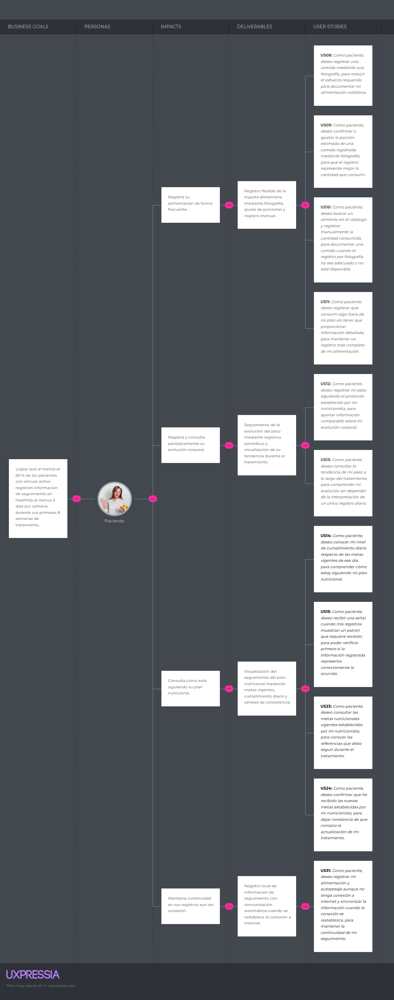
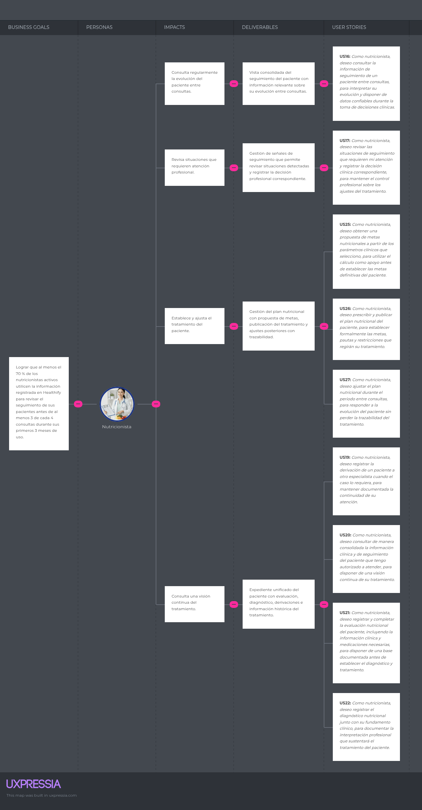
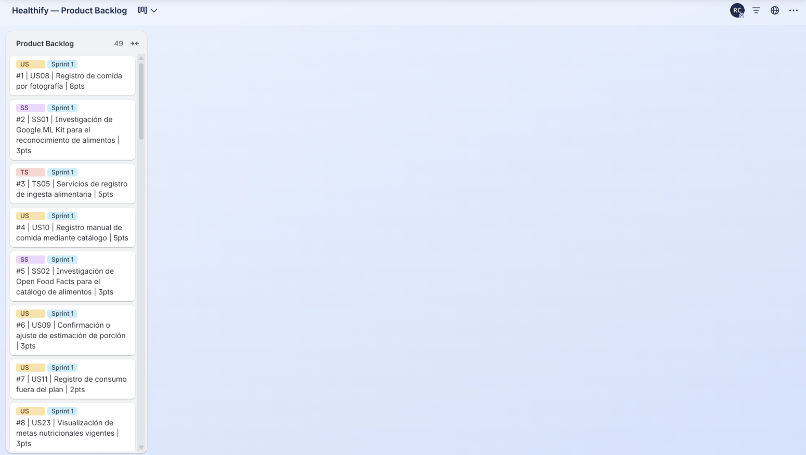

# CAPÍTULO II: REQUIREMENTS DEVELOPMENT AND SOFTWARE SOLUTION DESIGN

## 2.1. Competidores

### 2.1.1. Análisis competitivo

### 2.1.2. Estrategias y tácticas frente a competidores

## 2.2. Entrevistas

### 2.2.1. Diseño de entrevistas

### 2.2.2. Registro de entrevistas

### 2.2.3. Análisis de entrevistas

## 2.3. Needfinding

### 2.3.1. User Personas

### 2.3.2. User Task Matrix

### 2.3.3. User Journey Mapping

### 2.3.4. Empathy Mapping

### 2.3.5. Big Picture EventStorming

### 2.3.6. Ubiquitous Language

## 2.4. Requirements Specification

### 2.4.1. User Stories

En esta sección se presentan las User Stories, Technical Stories y Spike Stories identificadas para Healthify a partir de las necesidades de los segmentos objetivo y de los requisitos funcionales y técnicos de la solución. Las User Stories describen las capacidades que permiten al Paciente y al Nutricionista realizar el seguimiento del tratamiento nutricional, así como las funcionalidades transversales de acceso a la plataforma y aquellas dirigidas al Visitante mediante el Landing Page.

Adicionalmente, se consideran Technical Stories para representar capacidades técnicas necesarias para soportar las funcionalidades del producto que no corresponden a una interacción directa con los usuarios finales. Finalmente, se incluyen Spike Stories destinadas a reducir la incertidumbre asociada con componentes cuya viabilidad, integración o reglas requieren investigación previa a su implementación.

Los criterios de aceptación se expresan mediante escenarios Given–When–Then y describen comportamientos verificables del sistema sin establecer detalles específicos de presentación de la interfaz.

| Epic ID | Title | Description |
|---|---|---|
| **EP01** | Gestión de la Relación de Cuidado | Agrupa las capacidades necesarias para establecer, mantener y finalizar el vínculo entre un Paciente y un Nutricionista, incluyendo invitaciones, consentimiento y control del acceso a la información. |
| **EP02** | Gestión de Ingesta Alimentaria | Agrupa las funcionalidades relacionadas con el registro de alimentos consumidos mediante fotografía, estimación de porciones, registro manual y declaración de consumos fuera del plan. |
| **EP03** | Seguimiento de Respuesta Corporal | Comprende el registro de autopesajes y el seguimiento de la evolución corporal del Paciente durante el tratamiento nutricional. |
| **EP04** | Monitoreo y Seguimiento del Plan Nutricional | Agrupa las capacidades destinadas a evaluar cómo el paciente sigue el plan nutricional, calcular el cumplimiento diario, identificar señales de consistencia y apoyar la revisión profesional. |
| **EP05** | Expediente y Continuidad del Cuidado | Comprende la consulta consolidada de la información del tratamiento y el registro de acciones que permiten mantener la continuidad de la atención. |
| **EP06** | Evaluación y Diagnóstico Nutricional | Agrupa el registro de evaluaciones, mediciones clínicas y diagnósticos nutricionales realizados por el Nutricionista. |
| **EP07** | Prescripción y Gestión del Plan Nutricional | Comprende el cálculo de metas, la publicación del plan nutricional y el control de sus ajustes y versiones durante el tratamiento. |
| **EP08** | Identidad y Acceso | Agrupa las capacidades relacionadas con creación de cuentas, autenticación, autorización y administración de sesiones. |
| **EP09** | Offline y Sincronización | Comprende la continuidad del registro cuando no existe conectividad y la posterior sincronización segura de los datos. |
| **EP10** | Landing Page | Agrupa las funcionalidades públicas destinadas a presentar Healthify, informar sobre sus capacidades y facilitar el acceso y contacto con la solución. |
| **EP_TS** | RESTful API — Technical Stories | Agrupa las Technical Stories necesarias para implementar los servicios RESTful que soportan las funcionalidades de Healthify y permiten la comunicación entre las aplicaciones cliente y el backend. |
| **EP_SS** | Spike Stories | Agrupa las investigaciones, análisis y pruebas de viabilidad técnica necesarias para reducir incertidumbre antes de implementar funcionalidades o integraciones de Healthify. |

### EP01 — Gestión de la Relación de Cuidado

 ***US01 — Vinculación mediante invitación QR***
<table>
  <tr>
    <th colspan="2">Story ID</th>
    <th colspan="2">User</th>
    <th colspan="2">Priority</th>
    <th colspan="2">Epic</th>
  </tr>
  <tr>
    <td colspan="2">US01</td>
    <td colspan="2">Paciente</td>
    <td colspan="2">Alta</td>
    <td colspan="2">EP01</td>
  </tr>
  <tr>
    <th colspan="2">Title</th>
    <td colspan="6">Vinculación mediante invitación QR</td>
  </tr>
  <tr>
    <th colspan="8">Description</th>
  </tr>
  <tr>
    <td colspan="8">Como paciente, deseo utilizar la invitación generada por mi nutricionista para vincularme con él en Healthify, para que mi tratamiento pueda ser gestionado y monitoreado de manera autorizada.</td>
  </tr>
  <tr>
    <th colspan="8">Acceptance Criteria</th>
  </tr>
  <tr>
    <td colspan="8"><strong>Escenario 1: Vinculación exitosa</strong> Dado que el paciente posee una invitación válida y vigente emitida por un nutricionista Cuando el paciente utiliza la invitación Entonces el sistema establece el vínculo entre ambas cuentas.  <strong>Escenario 2: Invitación vencida</strong> Dado que el paciente posee una invitación que ha superado su periodo de vigencia Cuando el paciente intenta utilizarla Entonces el sistema rechaza la vinculación e identifica la invitación como vencida.  <strong>Escenario 3: Invitación previamente utilizada</strong> Dado que el paciente dispone de una invitación que ya ha sido utilizada Cuando el paciente intenta utilizar nuevamente la invitación Entonces el sistema rechaza la operación y conserva el vínculo previamente establecido.</td>
  </tr>
</table>

 ***US02 — Otorgamiento de consentimiento para compartir información***
<table>
  <tr>
    <th colspan="2">Story ID</th>
    <th colspan="2">User</th>
    <th colspan="2">Priority</th>
    <th colspan="2">Epic</th>
  </tr>
  <tr>
    <td colspan="2">US02</td>
    <td colspan="2">Paciente</td>
    <td colspan="2">Alta</td>
    <td colspan="2">EP01</td>
  </tr>
  <tr>
    <th colspan="2">Title</th>
    <td colspan="6">Otorgamiento de consentimiento para compartir información</td>
  </tr>
  <tr>
    <th colspan="8">Description</th>
  </tr>
  <tr>
    <td colspan="8">Como paciente, deseo otorgar mi consentimiento para compartir con mi nutricionista la información necesaria de mi tratamiento, para mantener el control sobre el acceso profesional a mis datos.</td>
  </tr>
  <tr>
    <th colspan="8">Acceptance Criteria</th>
  </tr>
  <tr>
    <td colspan="8"><strong>Escenario 1: Consentimiento otorgado</strong> Dado que el paciente tiene un vínculo de cuidado pendiente de autorización Cuando el paciente otorga su consentimiento Entonces el sistema registra el consentimiento vigente asociado al vínculo.  <strong>Escenario 2: Acceso con consentimiento vigente</strong> Dado que el paciente mantiene un vínculo de cuidado activo y ha otorgado su consentimiento Cuando el nutricionista solicita acceder a la información autorizada del paciente Entonces el sistema permite el acceso según los permisos correspondientes.  <strong>Escenario 3: Ausencia de consentimiento</strong> Dado que el paciente mantiene un vínculo de cuidado sin consentimiento vigente Cuando el nutricionista solicita acceder a información protegida del paciente Entonces el sistema rechaza el acceso.</td>
  </tr>
</table>

 ***US03 — Revocación del consentimiento***
<table>
  <tr>
    <th colspan="2">Story ID</th>
    <th colspan="2">User</th>
    <th colspan="2">Priority</th>
    <th colspan="2">Epic</th>
  </tr>
  <tr>
    <td colspan="2">US03</td>
    <td colspan="2">Paciente</td>
    <td colspan="2">Media</td>
    <td colspan="2">EP01</td>
  </tr>
  <tr>
    <th colspan="2">Title</th>
    <td colspan="6">Revocación del consentimiento</td>
  </tr>
  <tr>
    <th colspan="8">Description</th>
  </tr>
  <tr>
    <td colspan="8">Como paciente, deseo revocar el consentimiento otorgado para el acceso a mi información, para conservar el control sobre los datos compartidos durante mi tratamiento.</td>
  </tr>
  <tr>
    <th colspan="8">Acceptance Criteria</th>
  </tr>
  <tr>
    <td colspan="8"><strong>Escenario 1: Revocación exitosa</strong> Dado que el paciente mantiene un consentimiento vigente Cuando el paciente revoca el consentimiento Entonces el sistema registra el consentimiento como no vigente.  <strong>Escenario 2: Acceso posterior a la revocación</strong> Dado que el paciente ha revocado previamente el consentimiento asociado al vínculo Cuando el nutricionista solicita acceder a nueva información protegida del paciente Entonces el sistema rechaza el acceso autorizado por dicho consentimiento.</td>
  </tr>
</table>

 ***US04 — Generación de invitación QR para un nuevo paciente***
<table>
  <tr>
    <th colspan="2">Story ID</th>
    <th colspan="2">User</th>
    <th colspan="2">Priority</th>
    <th colspan="2">Epic</th>
  </tr>
  <tr>
    <td colspan="2">US04</td>
    <td colspan="2">Nutricionista</td>
    <td colspan="2">Alta</td>
    <td colspan="2">EP01</td>
  </tr>
  <tr>
    <th colspan="2">Title</th>
    <td colspan="6">Generación de invitación QR para un nuevo paciente</td>
  </tr>
  <tr>
    <th colspan="8">Description</th>
  </tr>
  <tr>
    <td colspan="8">Como nutricionista, deseo generar una invitación para un paciente, para iniciar de forma controlada el proceso de vinculación en Healthify.</td>
  </tr>
  <tr>
    <th colspan="8">Acceptance Criteria</th>
  </tr>
  <tr>
    <td colspan="8"><strong>Escenario 1: Invitación generada</strong> Dado que el nutricionista se encuentra autorizado Cuando el nutricionista solicita una nueva invitación Entonces el sistema genera una invitación única asociada al nutricionista y con vigencia limitada.  <strong>Escenario 2: Invitación utilizada</strong> Dado que el nutricionista ha generado una invitación que fue canjeada correctamente Cuando el nutricionista consulta el estado de la invitación Entonces el sistema informa que la invitación ya fue utilizada.  <strong>Escenario 3: Reutilización</strong> Dado que el nutricionista dispone de una invitación que ya fue utilizada Cuando el nutricionista intenta utilizar nuevamente esa invitación para vincular a otro paciente Entonces el sistema rechaza el nuevo canje de la invitación.</td>
  </tr>
</table>

 ***US05 — Consulta de pacientes con vínculo activo***
<table>
  <tr>
    <th colspan="2">Story ID</th>
    <th colspan="2">User</th>
    <th colspan="2">Priority</th>
    <th colspan="2">Epic</th>
  </tr>
  <tr>
    <td colspan="2">US05</td>
    <td colspan="2">Nutricionista</td>
    <td colspan="2">Alta</td>
    <td colspan="2">EP01</td>
  </tr>
  <tr>
    <th colspan="2">Title</th>
    <td colspan="6">Consulta de pacientes con vínculo activo</td>
  </tr>
  <tr>
    <th colspan="8">Description</th>
  </tr>
  <tr>
    <td colspan="8">Como nutricionista, deseo consultar los pacientes con los que mantengo un vínculo de cuidado activo, para acceder al seguimiento de los tratamientos que tengo a cargo.</td>
  </tr>
  <tr>
    <th colspan="8">Acceptance Criteria</th>
  </tr>
  <tr>
    <td colspan="8"><strong>Escenario 1: Existen pacientes vinculados</strong> Dado que el nutricionista mantiene vínculos activos Cuando el nutricionista consulta sus pacientes Entonces el sistema devuelve únicamente los pacientes asociados mediante vínculos vigentes.  <strong>Escenario 2: No existen vínculos activos</strong> Dado que el nutricionista no mantiene vínculos activos Cuando el nutricionista consulta sus pacientes Entonces el sistema devuelve un resultado vacío.  <strong>Escenario 3: Paciente sin vínculo vigente</strong> Dado que el nutricionista tiene un vínculo que ha sido finalizado o revocado Cuando el nutricionista consulta sus pacientes activos Entonces el sistema no considera a dicho paciente parte de la cartera activa.</td>
  </tr>
</table>

 ***US06 — Alta del paciente al finalizar el tratamiento***
<table>
  <tr>
    <th colspan="2">Story ID</th>
    <th colspan="2">User</th>
    <th colspan="2">Priority</th>
    <th colspan="2">Epic</th>
  </tr>
  <tr>
    <td colspan="2">US06</td>
    <td colspan="2">Nutricionista</td>
    <td colspan="2">Media</td>
    <td colspan="2">EP01</td>
  </tr>
  <tr>
    <th colspan="2">Title</th>
    <td colspan="6">Alta del paciente al finalizar el tratamiento</td>
  </tr>
  <tr>
    <th colspan="8">Description</th>
  </tr>
  <tr>
    <td colspan="8">Como nutricionista, deseo registrar el alta de un paciente cuando su tratamiento concluye, para cerrar formalmente el vínculo de cuidado manteniendo la trazabilidad histórica.</td>
  </tr>
  <tr>
    <th colspan="8">Acceptance Criteria</th>
  </tr>
  <tr>
    <td colspan="8"><strong>Escenario 1: Alta registrada</strong> Dado que el nutricionista mantiene un vínculo de cuidado activo Cuando el nutricionista registra el alta del paciente Entonces el sistema finaliza el vínculo por cierre clínico y conserva su historial.  <strong>Escenario 2: Acceso posterior al alta</strong> Dado que el nutricionista ha registrado previamente el alta del paciente Cuando el nutricionista consulta el estado del vínculo después de registrar el alta Entonces el sistema no considera activo el vínculo finalizado por alta.</td>
  </tr>
</table>

 ***US07 — Revocación del vínculo de cuidado***
<table>
  <tr>
    <th colspan="2">Story ID</th>
    <th colspan="2">User</th>
    <th colspan="2">Priority</th>
    <th colspan="2">Epic</th>
  </tr>
  <tr>
    <td colspan="2">US07</td>
    <td colspan="2">Nutricionista</td>
    <td colspan="2">Media</td>
    <td colspan="2">EP01</td>
  </tr>
  <tr>
    <th colspan="2">Title</th>
    <td colspan="6">Revocación del vínculo de cuidado</td>
  </tr>
  <tr>
    <th colspan="8">Description</th>
  </tr>
  <tr>
    <td colspan="8">Como nutricionista, deseo revocar un vínculo de cuidado cuando la relación de seguimiento deba finalizar sin registrar un alta clínica, para impedir nuevos accesos mediante dicho vínculo.</td>
  </tr>
  <tr>
    <th colspan="8">Acceptance Criteria</th>
  </tr>
  <tr>
    <td colspan="8"><strong>Escenario 1: Revocación de vínculo activo</strong> Dado que el nutricionista mantiene un vínculo de cuidado activo Cuando el nutricionista solicita revocar el vínculo de cuidado Entonces el sistema registra el vínculo como revocado.  <strong>Escenario 2: Acceso mediante vínculo revocado</strong> Dado que el nutricionista tiene un vínculo que se encuentra revocado Cuando el nutricionista solicita acceder a información protegida mediante el vínculo revocado Entonces el sistema rechaza el acceso.</td>
  </tr>
</table>
 

### EP02 — Gestión de Ingesta Alimentaria

 ***US08 — Registro de comida por fotografía***
<table>
  <tr>
    <th colspan="2">Story ID</th>
    <th colspan="2">User</th>
    <th colspan="2">Priority</th>
    <th colspan="2">Epic</th>
  </tr>
  <tr>
    <td colspan="2">US08</td>
    <td colspan="2">Paciente</td>
    <td colspan="2">Alta</td>
    <td colspan="2">EP02</td>
  </tr>
  <tr>
    <th colspan="2">Title</th>
    <td colspan="6">Registro de comida por fotografía</td>
  </tr>
  <tr>
    <th colspan="8">Description</th>
  </tr>
  <tr>
    <td colspan="8">Como paciente, deseo registrar una comida mediante una fotografía, para reducir el esfuerzo requerido para documentar mi alimentación cotidiana.</td>
  </tr>
  <tr>
    <th colspan="8">Acceptance Criteria</th>
  </tr>
  <tr>
    <td colspan="8"><strong>Escenario 1: Fotografía procesable</strong> Dado que el paciente proporciona una fotografía válida de una comida Cuando el paciente solicita procesar la fotografía de la comida Entonces el sistema genera una propuesta de alimentos y porciones estimadas para su confirmación.  <strong>Escenario 2: Estimación con procedencia</strong> Dado que el paciente tiene una estimación generada a partir de una fotografía Cuando el paciente revisa la propuesta generada a partir de la fotografía Entonces el sistema conserva la procedencia y nivel de confianza asociados a la estimación.  <strong>Escenario 3: Fotografía no procesable</strong> Dado que el paciente proporciona una fotografía cuya información no permite obtener una estimación utilizable Cuando el paciente solicita procesar una fotografía que no permite obtener una estimación válida Entonces el sistema informa que no se obtuvo una estimación válida y permite continuar mediante registro manual.</td>
  </tr>
</table>

 ***US09 — Confirmación o ajuste de estimación de porción***
<table>
  <tr>
    <th colspan="2">Story ID</th>
    <th colspan="2">User</th>
    <th colspan="2">Priority</th>
    <th colspan="2">Epic</th>
  </tr>
  <tr>
    <td colspan="2">US09</td>
    <td colspan="2">Paciente</td>
    <td colspan="2">Alta</td>
    <td colspan="2">EP02</td>
  </tr>
  <tr>
    <th colspan="2">Title</th>
    <td colspan="6">Confirmación o ajuste de estimación de porción</td>
  </tr>
  <tr>
    <th colspan="8">Description</th>
  </tr>
  <tr>
    <td colspan="8">Como paciente, deseo confirmar o ajustar la porción estimada de una comida registrada mediante fotografía, para que el registro represente mejor la cantidad que consumí.</td>
  </tr>
  <tr>
    <th colspan="8">Acceptance Criteria</th>
  </tr>
  <tr>
    <td colspan="8"><strong>Escenario 1: Confirmación sin cambios</strong> Dado que el paciente tiene una estimación pendiente de confirmación Cuando el paciente confirma los alimentos y porciones estimados Entonces el sistema registra la ingesta conservando la procedencia de la estimación.  <strong>Escenario 2: Ajuste de la porción</strong> Dado que el paciente considera que la porción estimada no representa lo consumido Cuando el paciente proporciona y confirma la cantidad corregida de la porción Entonces el sistema registra la cantidad corregida y conserva la información de la estimación original como procedencia.  <strong>Escenario 3: Estimación no confirmada</strong> Dado que el paciente tiene una propuesta de ingesta sin confirmar Cuando el paciente finaliza el proceso sin confirmar la propuesta Entonces el sistema no considera la propuesta como una ingesta confirmada.</td>
  </tr>
</table>

 ***US10 — Registro manual de comida mediante catálogo***
<table>
  <tr>
    <th colspan="2">Story ID</th>
    <th colspan="2">User</th>
    <th colspan="2">Priority</th>
    <th colspan="2">Epic</th>
  </tr>
  <tr>
    <td colspan="2">US10</td>
    <td colspan="2">Paciente</td>
    <td colspan="2">Alta</td>
    <td colspan="2">EP02</td>
  </tr>
  <tr>
    <th colspan="2">Title</th>
    <td colspan="6">Registro manual de comida mediante catálogo</td>
  </tr>
  <tr>
    <th colspan="8">Description</th>
  </tr>
  <tr>
    <td colspan="8">Como paciente, deseo buscar un alimento en el catálogo y registrar manualmente la cantidad consumida, para documentar una comida cuando el registro por fotografía no sea adecuado o no esté disponible.</td>
  </tr>
  <tr>
    <th colspan="8">Acceptance Criteria</th>
  </tr>
  <tr>
    <td colspan="8"><strong>Escenario 1: Búsqueda con coincidencias</strong> Dado que el paciente proporciona un término de búsqueda válido Cuando el paciente realiza la búsqueda en el catálogo Entonces el sistema devuelve los alimentos que coinciden con el criterio de búsqueda.  <strong>Escenario 2: Registro manual</strong> Dado que el paciente selecciona un alimento y proporciona una cantidad válida Cuando el paciente confirma el alimento y la cantidad consumida Entonces el sistema almacena la ingesta con procedencia manual.  <strong>Escenario 3: Alimento no encontrado</strong> Dado que el paciente realiza una búsqueda cuyo criterio no coincide con alimentos disponibles Cuando el paciente completa una búsqueda sin coincidencias Entonces el sistema informa que no existen coincidencias.  <strong>Escenario 4: Datos disponibles sin conectividad</strong> Dado que el paciente no dispone de conexión y existen datos del catálogo almacenados localmente Cuando el paciente realiza una búsqueda Entonces el sistema utiliza la información local disponible.</td>
  </tr>
</table>

 ***US11 — Registro de consumo fuera del plan***
<table>
  <tr>
    <th colspan="2">Story ID</th>
    <th colspan="2">User</th>
    <th colspan="2">Priority</th>
    <th colspan="2">Epic</th>
  </tr>
  <tr>
    <td colspan="2">US11</td>
    <td colspan="2">Paciente</td>
    <td colspan="2">Alta</td>
    <td colspan="2">EP02</td>
  </tr>
  <tr>
    <th colspan="2">Title</th>
    <td colspan="6">Registro de consumo fuera del plan</td>
  </tr>
  <tr>
    <th colspan="8">Description</th>
  </tr>
  <tr>
    <td colspan="8">Como paciente, deseo registrar que consumí algo fuera de mi plan sin tener que proporcionar información detallada, para mantener un registro más completo de mi alimentación.</td>
  </tr>
  <tr>
    <th colspan="8">Acceptance Criteria</th>
  </tr>
  <tr>
    <td colspan="8"><strong>Escenario 1: Registro del consumo</strong> Dado que el paciente desea declarar un consumo fuera del plan Cuando el paciente registra el consumo fuera del plan Entonces el sistema conserva la declaración con su fecha y hora sin exigir el detalle del alimento consumido.  <strong>Escenario 2: Tratamiento no punitivo</strong> Dado que el paciente tiene un consumo fuera del plan registrado Cuando el paciente consulta posteriormente el consumo registrado fuera del plan Entonces el sistema conserva el dato sin asignarle una valoración punitiva.</td>
  </tr>
</table>
 

### EP03 — Seguimiento de Respuesta Corporal

 ***US12 — Registro de autopesaje***
<table>
  <tr>
    <th colspan="2">Story ID</th>
    <th colspan="2">User</th>
    <th colspan="2">Priority</th>
    <th colspan="2">Epic</th>
  </tr>
  <tr>
    <td colspan="2">US12</td>
    <td colspan="2">Paciente</td>
    <td colspan="2">Alta</td>
    <td colspan="2">EP03</td>
  </tr>
  <tr>
    <th colspan="2">Title</th>
    <td colspan="6">Registro de autopesaje</td>
  </tr>
  <tr>
    <th colspan="8">Description</th>
  </tr>
  <tr>
    <td colspan="8">Como paciente, deseo registrar mi peso siguiendo el protocolo establecido por mi nutricionista, para aportar información comparable sobre mi evolución corporal.</td>
  </tr>
  <tr>
    <th colspan="8">Acceptance Criteria</th>
  </tr>
  <tr>
    <td colspan="8"><strong>Escenario 1: Autopesaje compatible con el protocolo</strong> Dado que el paciente proporciona un valor válido y cumple las condiciones requeridas por el protocolo de pesaje Cuando el paciente registra el autopesaje Entonces el sistema almacena el registro y lo considera elegible para la tendencia de peso.  <strong>Escenario 2: Autopesaje fuera del protocolo</strong> Dado que el paciente registra un peso que no cumple las condiciones del protocolo Cuando el paciente registra el peso Entonces el sistema conserva el registro pero lo excluye del cálculo de la tendencia.  <strong>Escenario 3: Valor inválido</strong> Dado que el paciente proporciona un valor de peso fuera del rango válido establecido Cuando el paciente intenta registrar el valor de peso Entonces el sistema rechaza el valor.</td>
  </tr>
</table>

 ***US13 — Visualización de tendencia de peso***
<table>
  <tr>
    <th colspan="2">Story ID</th>
    <th colspan="2">User</th>
    <th colspan="2">Priority</th>
    <th colspan="2">Epic</th>
  </tr>
  <tr>
    <td colspan="2">US13</td>
    <td colspan="2">Paciente</td>
    <td colspan="2">Alta</td>
    <td colspan="2">EP03</td>
  </tr>
  <tr>
    <th colspan="2">Title</th>
    <td colspan="6">Visualización de tendencia de peso</td>
  </tr>
  <tr>
    <th colspan="8">Description</th>
  </tr>
  <tr>
    <td colspan="8">Como paciente, deseo consultar la tendencia de mi peso a lo largo del tratamiento, para comprender mi evolución sin depender de la interpretación de un único registro diario.</td>
  </tr>
  <tr>
    <th colspan="8">Acceptance Criteria</th>
  </tr>
  <tr>
    <td colspan="8"><strong>Escenario 1: Datos suficientes</strong> Dado que el paciente tiene autopesajes elegibles dentro del periodo consultado Cuando el paciente consulta la tendencia de su peso Entonces el sistema proporciona una tendencia calculada a partir de los registros válidos.  <strong>Escenario 2: Datos insuficientes</strong> Dado que el paciente no tiene suficientes autopesajes elegibles Cuando el paciente consulta la tendencia de su peso Entonces el sistema informa que aún no existe información suficiente para establecer una tendencia.</td>
  </tr>
</table>
 

### EP04 — Monitoreo y Seguimiento del Plan Nutricional

 ***US14 — Consulta del cumplimiento nutricional diario***
<table>
  <tr>
    <th colspan="2">Story ID</th>
    <th colspan="2">User</th>
    <th colspan="2">Priority</th>
    <th colspan="2">Epic</th>
  </tr>
  <tr>
    <td colspan="2">US14</td>
    <td colspan="2">Paciente</td>
    <td colspan="2">Alta</td>
    <td colspan="2">EP04</td>
  </tr>
  <tr>
    <th colspan="2">Title</th>
    <td colspan="6">Consulta del cumplimiento nutricional diario</td>
  </tr>
  <tr>
    <th colspan="8">Description</th>
  </tr>
  <tr>
    <td colspan="8">Como paciente, deseo conocer mi nivel de cumplimiento diario respecto de las metas vigentes de ese día, para comprender cómo estoy siguiendo mi plan nutricional.</td>
  </tr>
  <tr>
    <th colspan="8">Acceptance Criteria</th>
  </tr>
  <tr>
    <td colspan="8"><strong>Escenario 1: Día con información registrada</strong> Dado que el paciente cuenta con metas vigentes y registros de alimentación para un día determinado Cuando el paciente consulta el cumplimiento correspondiente a ese día Entonces el sistema calcula el cumplimiento utilizando las metas que estaban vigentes en esa fecha.  <strong>Escenario 2: Cambio posterior del plan</strong> Dado que el paciente consulta un día cuyas metas fueron modificadas posteriormente por el nutricionista Cuando el paciente consulta el cumplimiento correspondiente a ese día Entonces el sistema conserva el resultado basado en la versión de metas que correspondía a ese día.  <strong>Escenario 3: Día sin información suficiente</strong> Dado que el paciente no cuenta con información suficiente para evaluar el día Cuando el paciente consulta el cumplimiento Entonces el sistema informa que no puede determinarlo sin clasificar la ausencia de registro como incumplimiento.</td>
  </tr>
</table>

 ***US15 — Visualización de señal de consistencia***
<table>
  <tr>
    <th colspan="2">Story ID</th>
    <th colspan="2">User</th>
    <th colspan="2">Priority</th>
    <th colspan="2">Epic</th>
  </tr>
  <tr>
    <td colspan="2">US15</td>
    <td colspan="2">Paciente</td>
    <td colspan="2">Alta</td>
    <td colspan="2">EP04</td>
  </tr>
  <tr>
    <th colspan="2">Title</th>
    <td colspan="6">Visualización de señal de consistencia</td>
  </tr>
  <tr>
    <th colspan="8">Description</th>
  </tr>
  <tr>
    <td colspan="8">Como paciente, deseo recibir una señal cuando mis registros muestran un patrón que requiere revisión, para poder verificar primero si la información registrada representa correctamente lo ocurrido.</td>
  </tr>
  <tr>
    <th colspan="8">Acceptance Criteria</th>
  </tr>
  <tr>
    <td colspan="8"><strong>Escenario 1: Condición de consistencia detectada</strong> Dado que el paciente tiene información registrada que cumple la regla de consistencia vigente Cuando el paciente consulta el seguimiento del periodo evaluado Entonces el sistema genera una señal dirigida inicialmente al paciente.  <strong>Escenario 2: Ausencia de información suficiente</strong> Dado que el paciente no tiene registros suficientes para evaluar la consistencia Cuando el paciente consulta un periodo con registros insuficientes Entonces el sistema no clasifica la ausencia de registros como una desviación.  <strong>Escenario 3: Señal sin modificación automática</strong> Dado que el paciente tiene una señal de consistencia activa Cuando el paciente consulta una señal de consistencia activa Entonces el sistema no modifica automáticamente el plan nutricional del paciente.  <strong>Escenario 4: Escalamiento profesional</strong> Dado que el paciente tiene una señal que cumple el criterio vigente de escalamiento Cuando el paciente consulta una señal que cumple el criterio de escalamiento Entonces el sistema genera una situación de revisión para el nutricionista.</td>
  </tr>
</table>

 ***US16 — Consulta del monitoreo del paciente***
<table>
  <tr>
    <th colspan="2">Story ID</th>
    <th colspan="2">User</th>
    <th colspan="2">Priority</th>
    <th colspan="2">Epic</th>
  </tr>
  <tr>
    <td colspan="2">US16</td>
    <td colspan="2">Nutricionista</td>
    <td colspan="2">Alta</td>
    <td colspan="2">EP04</td>
  </tr>
  <tr>
    <th colspan="2">Title</th>
    <td colspan="6">Consulta del monitoreo del paciente</td>
  </tr>
  <tr>
    <th colspan="8">Description</th>
  </tr>
  <tr>
    <td colspan="8">Como nutricionista, deseo consultar la información de seguimiento de un paciente entre consultas, para interpretar su evolución y disponer de datos confiables durante la toma de decisiones clínicas.</td>
  </tr>
  <tr>
    <th colspan="8">Acceptance Criteria</th>
  </tr>
  <tr>
    <td colspan="8"><strong>Escenario 1: Información disponible</strong> Dado que el nutricionista atiende a un paciente con vínculo activo que ha generado información de seguimiento Cuando el nutricionista consulta el monitoreo del paciente Entonces el sistema proporciona la tendencia de peso, cumplimiento, registros de alimentación y demás datos autorizados disponibles.  <strong>Escenario 2: Procedencia de registros estimados</strong> Dado que el nutricionista consulta una ingesta que proviene de una estimación Cuando el nutricionista consulta una ingesta estimada dentro del monitoreo Entonces el sistema conserva su procedencia y nivel de confianza.  <strong>Escenario 3: Ausencia de información</strong> Dado que el nutricionista consulta un periodo sin suficientes registros Cuando el nutricionista consulta el seguimiento del periodo Entonces el sistema distingue la ausencia de datos de una desviación del tratamiento.</td>
  </tr>
</table>

 ***US17 — Revisión y resolución de señales de seguimiento***
<table>
  <tr>
    <th colspan="2">Story ID</th>
    <th colspan="2">User</th>
    <th colspan="2">Priority</th>
    <th colspan="2">Epic</th>
  </tr>
  <tr>
    <td colspan="2">US17</td>
    <td colspan="2">Nutricionista</td>
    <td colspan="2">Alta</td>
    <td colspan="2">EP04</td>
  </tr>
  <tr>
    <th colspan="2">Title</th>
    <td colspan="6">Revisión y resolución de señales de seguimiento</td>
  </tr>
  <tr>
    <th colspan="8">Description</th>
  </tr>
  <tr>
    <td colspan="8">Como nutricionista, deseo revisar las situaciones de seguimiento que requieren mi atención y registrar la decisión clínica correspondiente, para mantener el control profesional sobre los ajustes del tratamiento.</td>
  </tr>
  <tr>
    <th colspan="8">Acceptance Criteria</th>
  </tr>
  <tr>
    <td colspan="8"><strong>Escenario 1: Situación disponible para revisión</strong> Dado que el nutricionista tiene una condición de seguimiento que cumple la regla vigente de escalamiento Cuando el nutricionista consulta los elementos pendientes de revisión Entonces el sistema incluye la situación correspondiente.  <strong>Escenario 2: Resolución sin cambio del plan</strong> Dado que el nutricionista revisa una situación y determina que no requiere modificación del tratamiento Cuando el nutricionista registra su decisión Entonces el sistema conserva la resolución sin alterar el plan vigente.  <strong>Escenario 3: Resolución con ajuste</strong> Dado que el nutricionista determina que corresponde ajustar el tratamiento Cuando el nutricionista inicia el ajuste del plan Entonces el sistema procesa el cambio mediante una nueva versión del plan con su motivo correspondiente.  <strong>Escenario 4: Ausencia de modificación automática</strong> Dado que el nutricionista tiene una señal de seguimiento generada por el sistema Cuando el nutricionista consulta una señal de seguimiento escalada para revisión Entonces el sistema mantiene el plan sin cambios hasta que exista una decisión profesional.</td>
  </tr>
</table>
 

### EP05 — Expediente y Continuidad del Cuidado

 ***US18 — Acceso al expediente personal unificado***
<table>
  <tr>
    <th colspan="2">Story ID</th>
    <th colspan="2">User</th>
    <th colspan="2">Priority</th>
    <th colspan="2">Epic</th>
  </tr>
  <tr>
    <td colspan="2">US18</td>
    <td colspan="2">Paciente</td>
    <td colspan="2">Media</td>
    <td colspan="2">EP05</td>
  </tr>
  <tr>
    <th colspan="2">Title</th>
    <td colspan="6">Acceso al expediente personal unificado</td>
  </tr>
  <tr>
    <th colspan="8">Description</th>
  </tr>
  <tr>
    <td colspan="8">Como paciente, deseo consultar en un mismo expediente la información de mi tratamiento que me corresponde conocer, para mantener una referencia continua de las indicaciones y evolución registradas.</td>
  </tr>
  <tr>
    <th colspan="8">Acceptance Criteria</th>
  </tr>
  <tr>
    <td colspan="8"><strong>Escenario 1: Expediente disponible</strong> Dado que el paciente mantiene información registrada durante su tratamiento Cuando el paciente solicita consultar su expediente personal Entonces el sistema proporciona la información autorizada correspondiente a su tratamiento.  <strong>Escenario 2: Información consolidada</strong> Dado que el paciente tiene metas, mediciones, pautas, restricciones o derivaciones registradas Cuando el paciente consulta su expediente Entonces el sistema consolida la información disponible sin modificar sus registros originales.  <strong>Escenario 3: Protección de información clínica restringida</strong> Dado que el paciente consulta un expediente que contiene información reservada al ámbito profesional Cuando el paciente solicita consultar su expediente personal Entonces el sistema excluye la información que no corresponde a sus permisos.</td>
  </tr>
</table>

 ***US19 — Registro de derivación a otro especialista***
<table>
  <tr>
    <th colspan="2">Story ID</th>
    <th colspan="2">User</th>
    <th colspan="2">Priority</th>
    <th colspan="2">Epic</th>
  </tr>
  <tr>
    <td colspan="2">US19</td>
    <td colspan="2">Nutricionista</td>
    <td colspan="2">Baja</td>
    <td colspan="2">EP05</td>
  </tr>
  <tr>
    <th colspan="2">Title</th>
    <td colspan="6">Registro de derivación a otro especialista</td>
  </tr>
  <tr>
    <th colspan="8">Description</th>
  </tr>
  <tr>
    <td colspan="8">Como nutricionista, deseo registrar la derivación de un paciente a otro especialista cuando el caso lo requiera, para mantener documentada la continuidad de su atención.</td>
  </tr>
  <tr>
    <th colspan="8">Acceptance Criteria</th>
  </tr>
  <tr>
    <td colspan="8"><strong>Escenario 1: Derivación válida</strong> Dado que el nutricionista atiende a un paciente con tratamiento activo Cuando el nutricionista registra una derivación con el motivo correspondiente Entonces el sistema conserva la derivación asociada al expediente del paciente.  <strong>Escenario 2: Consulta histórica</strong> Dado que el nutricionista ha registrado una derivación Cuando el nutricionista consulta posteriormente el expediente autorizado del paciente Entonces el sistema conserva la derivación como parte del historial.</td>
  </tr>
</table>

 ***US20 — Acceso al expediente unificado del paciente***
<table>
  <tr>
    <th colspan="2">Story ID</th>
    <th colspan="2">User</th>
    <th colspan="2">Priority</th>
    <th colspan="2">Epic</th>
  </tr>
  <tr>
    <td colspan="2">US20</td>
    <td colspan="2">Nutricionista</td>
    <td colspan="2">Alta</td>
    <td colspan="2">EP05</td>
  </tr>
  <tr>
    <th colspan="2">Title</th>
    <td colspan="6">Acceso al expediente unificado del paciente</td>
  </tr>
  <tr>
    <th colspan="8">Description</th>
  </tr>
  <tr>
    <td colspan="8">Como nutricionista, deseo consultar de manera consolidada la información clínica y de seguimiento del paciente que tengo autorizado a atender, para disponer de una visión continua de su tratamiento.</td>
  </tr>
  <tr>
    <th colspan="8">Acceptance Criteria</th>
  </tr>
  <tr>
    <td colspan="8"><strong>Escenario 1: Acceso autorizado</strong> Dado que el nutricionista mantiene un vínculo activo con el paciente y existe consentimiento vigente Cuando el nutricionista solicita consultar el expediente del paciente Entonces el sistema proporciona la información clínica y de seguimiento autorizada.  <strong>Escenario 2: Información histórica</strong> Dado que el nutricionista atiende a un paciente con información clínica y de seguimiento registrada Cuando el nutricionista consulta el expediente unificado del paciente Entonces el sistema conserva y proporciona la trazabilidad de la información correspondiente.  <strong>Escenario 3: Acceso no autorizado</strong> Dado que el nutricionista no cuenta con un vínculo activo o consentimiento vigente Cuando el nutricionista solicita consultar el expediente del paciente Entonces el sistema rechaza el acceso.</td>
  </tr>
</table>
 

### EP06 — Evaluación y Diagnóstico Nutricional

 ***US21 — Registro y finalización de la evaluación nutricional***
<table>
  <tr>
    <th colspan="2">Story ID</th>
    <th colspan="2">User</th>
    <th colspan="2">Priority</th>
    <th colspan="2">Epic</th>
  </tr>
  <tr>
    <td colspan="2">US21</td>
    <td colspan="2">Nutricionista</td>
    <td colspan="2">Alta</td>
    <td colspan="2">EP06</td>
  </tr>
  <tr>
    <th colspan="2">Title</th>
    <td colspan="6">Registro y finalización de la evaluación nutricional</td>
  </tr>
  <tr>
    <th colspan="8">Description</th>
  </tr>
  <tr>
    <td colspan="8">Como nutricionista, deseo registrar y completar la evaluación nutricional del paciente, incluyendo la información clínica y mediciones necesarias, para disponer de una base documentada antes de establecer el diagnóstico y tratamiento.</td>
  </tr>
  <tr>
    <th colspan="8">Acceptance Criteria</th>
  </tr>
  <tr>
    <td colspan="8"><strong>Escenario 1: Creación de evaluación</strong> Dado que el nutricionista mantiene un vínculo de cuidado activo y autorizado con el paciente Cuando el nutricionista inicia una nueva evaluación nutricional Entonces el sistema registra una nueva evaluación asociada al paciente.  <strong>Escenario 2: Incorporación de mediciones</strong> Dado que el nutricionista tiene una evaluación abierta Cuando el nutricionista registra una medición clínica válida Entonces el sistema incorpora la medición clínica a la evaluación nutricional.  <strong>Escenario 3: Cierre de evaluación</strong> Dado que el nutricionista ha completado la información requerida de una evaluación Cuando el nutricionista finaliza la evaluación nutricional Entonces el sistema registra la evaluación como cerrada.  <strong>Escenario 4: Modificación posterior al cierre</strong> Dado que el nutricionista tiene una evaluación cerrada Cuando el nutricionista intenta modificar una evaluación cerrada Entonces el sistema conserva la evaluación cerrada sin alteraciones y requiere un nuevo registro para una corrección posterior.</td>
  </tr>
</table>

 ***US22 — Emisión del diagnóstico nutricional***
<table>
  <tr>
    <th colspan="2">Story ID</th>
    <th colspan="2">User</th>
    <th colspan="2">Priority</th>
    <th colspan="2">Epic</th>
  </tr>
  <tr>
    <td colspan="2">US22</td>
    <td colspan="2">Nutricionista</td>
    <td colspan="2">Alta</td>
    <td colspan="2">EP06</td>
  </tr>
  <tr>
    <th colspan="2">Title</th>
    <td colspan="6">Emisión del diagnóstico nutricional</td>
  </tr>
  <tr>
    <th colspan="8">Description</th>
  </tr>
  <tr>
    <td colspan="8">Como nutricionista, deseo registrar el diagnóstico nutricional junto con su fundamento clínico, para documentar la interpretación profesional que sustentará el tratamiento del paciente.</td>
  </tr>
  <tr>
    <th colspan="8">Acceptance Criteria</th>
  </tr>
  <tr>
    <td colspan="8"><strong>Escenario 1: Diagnóstico con fundamento</strong> Dado que el nutricionista dispone de una evaluación del paciente Cuando el nutricionista registra un diagnóstico con su justificación Entonces el sistema conserva ambos elementos asociados al tratamiento.  <strong>Escenario 2: Diagnóstico sin fundamento requerido</strong> Dado que el nutricionista registra un diagnóstico que requiere justificación clínica Cuando el nutricionista intenta registrar el diagnóstico sin proporcionar la justificación clínica requerida Entonces el sistema rechaza el registro.  <strong>Escenario 3: Conservación histórica</strong> Dado que el nutricionista tiene un diagnóstico previamente registrado Cuando el nutricionista registra una nueva evaluación o un nuevo diagnóstico Entonces el sistema conserva los antecedentes anteriores.</td>
  </tr>
</table>
 

### EP07 — Prescripción y Gestión del Plan Nutricional

 ***US23 — Visualización de metas nutricionales vigentes***
<table>
  <tr>
    <th colspan="2">Story ID</th>
    <th colspan="2">User</th>
    <th colspan="2">Priority</th>
    <th colspan="2">Epic</th>
  </tr>
  <tr>
    <td colspan="2">US23</td>
    <td colspan="2">Paciente</td>
    <td colspan="2">Alta</td>
    <td colspan="2">EP07</td>
  </tr>
  <tr>
    <th colspan="2">Title</th>
    <td colspan="6">Visualización de metas nutricionales vigentes</td>
  </tr>
  <tr>
    <th colspan="8">Description</th>
  </tr>
  <tr>
    <td colspan="8">Como paciente, deseo consultar las metas nutricionales vigentes establecidas por mi nutricionista, para conocer las referencias que debo seguir durante el tratamiento.</td>
  </tr>
  <tr>
    <th colspan="8">Acceptance Criteria</th>
  </tr>
  <tr>
    <td colspan="8"><strong>Escenario 1: Existen metas vigentes</strong> Dado que el paciente posee un plan nutricional activo Cuando el paciente consulta sus metas Entonces el sistema proporciona las metas correspondientes a la versión vigente del plan.  <strong>Escenario 2: No existe plan activo</strong> Dado que el paciente no posee un plan nutricional activo Cuando el paciente solicita sus metas Entonces el sistema informa que no existen metas vigentes.  <strong>Escenario 3: Protección de las metas prescritas</strong> Dado que el paciente tiene metas prescritas por el nutricionista Cuando el paciente consulta la información Entonces el sistema no permite que el paciente modifique los valores prescritos.</td>
  </tr>
</table>

 ***US24 — Confirmación de recepción de nuevas metas nutricionales***
<table>
  <tr>
    <th colspan="2">Story ID</th>
    <th colspan="2">User</th>
    <th colspan="2">Priority</th>
    <th colspan="2">Epic</th>
  </tr>
  <tr>
    <td colspan="2">US24</td>
    <td colspan="2">Paciente</td>
    <td colspan="2">Alta</td>
    <td colspan="2">EP07</td>
  </tr>
  <tr>
    <th colspan="2">Title</th>
    <td colspan="6">Confirmación de recepción de nuevas metas nutricionales</td>
  </tr>
  <tr>
    <th colspan="8">Description</th>
  </tr>
  <tr>
    <td colspan="8">Como paciente, deseo confirmar que he recibido las nuevas metas establecidas por mi nutricionista, para dejar constancia de que conozco la actualización de mi tratamiento.</td>
  </tr>
  <tr>
    <th colspan="8">Acceptance Criteria</th>
  </tr>
  <tr>
    <td colspan="8"><strong>Escenario 1: Confirmación de una nueva versión</strong> Dado que el paciente tiene una versión vigente de metas pendiente de confirmación Cuando el paciente confirma la recepción de la versión actualizada de sus metas nutricionales Entonces el sistema registra el acuse asociado a dicha versión.  <strong>Escenario 2: El acuse no modifica el tratamiento</strong> Dado que el paciente confirma la recepción de las metas Cuando el paciente confirma la recepción de las metas actualizadas Entonces el sistema mantiene las metas y el plan nutricional sin modificaciones.</td>
  </tr>
</table>

 ***US25 — Obtención de propuesta de metas nutricionales calculadas***
<table>
  <tr>
    <th colspan="2">Story ID</th>
    <th colspan="2">User</th>
    <th colspan="2">Priority</th>
    <th colspan="2">Epic</th>
  </tr>
  <tr>
    <td colspan="2">US25</td>
    <td colspan="2">Nutricionista</td>
    <td colspan="2">Alta</td>
    <td colspan="2">EP07</td>
  </tr>
  <tr>
    <th colspan="2">Title</th>
    <td colspan="6">Obtención de propuesta de metas nutricionales calculadas</td>
  </tr>
  <tr>
    <th colspan="8">Description</th>
  </tr>
  <tr>
    <td colspan="8">Como nutricionista, deseo obtener una propuesta de metas nutricionales a partir de los parámetros clínicos que selecciono, para utilizar el cálculo como apoyo antes de establecer las metas definitivas del paciente.</td>
  </tr>
  <tr>
    <th colspan="8">Acceptance Criteria</th>
  </tr>
  <tr>
    <td colspan="8"><strong>Escenario 1: Cálculo con parámetros completos</strong> Dado que el nutricionista proporciona la ecuación, peso de referencia, factor de actividad y demás parámetros requeridos Cuando el nutricionista solicita el cálculo Entonces el sistema genera una propuesta y conserva la base utilizada para obtenerla.  <strong>Escenario 2: Parámetros insuficientes</strong> Dado que el nutricionista no ha proporcionado un parámetro obligatorio para el cálculo Cuando el nutricionista solicita la propuesta Entonces el sistema no genera las metas e identifica la información faltante.  <strong>Escenario 3: Modificación profesional del resultado</strong> Dado que el nutricionista decide utilizar valores distintos a los calculados Cuando el nutricionista registra valores distintos a los calculados Entonces el sistema requiere y conserva la razón del cambio.</td>
  </tr>
</table>

 ***US26 — Prescripción y publicación del plan nutricional***
<table>
  <tr>
    <th colspan="2">Story ID</th>
    <th colspan="2">User</th>
    <th colspan="2">Priority</th>
    <th colspan="2">Epic</th>
  </tr>
  <tr>
    <td colspan="2">US26</td>
    <td colspan="2">Nutricionista</td>
    <td colspan="2">Alta</td>
    <td colspan="2">EP07</td>
  </tr>
  <tr>
    <th colspan="2">Title</th>
    <td colspan="6">Prescripción y publicación del plan nutricional</td>
  </tr>
  <tr>
    <th colspan="8">Description</th>
  </tr>
  <tr>
    <td colspan="8">Como nutricionista, deseo prescribir y publicar el plan nutricional del paciente, para establecer formalmente las metas, pautas y restricciones que regirán su tratamiento.</td>
  </tr>
  <tr>
    <th colspan="8">Acceptance Criteria</th>
  </tr>
  <tr>
    <td colspan="8"><strong>Escenario 1: Publicación válida</strong> Dado que el nutricionista atiende a un paciente que cuenta con diagnóstico y base de cálculo requeridos Cuando el nutricionista publica el plan nutricional Entonces el sistema registra una versión activa con sus metas, pautas y restricciones.  <strong>Escenario 2: Ausencia de diagnóstico</strong> Dado que el nutricionista atiende a un paciente que no cuenta con el diagnóstico requerido Cuando el nutricionista intenta publicar el plan nutricional Entonces el sistema rechaza la publicación.  <strong>Escenario 3: Ausencia de base de cálculo</strong> Dado que el nutricionista no ha registrado la base de cálculo necesaria para sustentar las metas Cuando el nutricionista intenta publicar el plan nutricional Entonces el sistema rechaza la publicación.  <strong>Escenario 4: Única versión activa</strong> Dado que el nutricionista tiene una versión activa del plan Cuando el nutricionista publica una nueva versión válida del plan Entonces el sistema mantiene una sola versión como vigente y conserva las versiones anteriores en el historial.</td>
  </tr>
</table>

 ***US27 — Ajuste del plan nutricional entre consultas***
<table>
  <tr>
    <th colspan="2">Story ID</th>
    <th colspan="2">User</th>
    <th colspan="2">Priority</th>
    <th colspan="2">Epic</th>
  </tr>
  <tr>
    <td colspan="2">US27</td>
    <td colspan="2">Nutricionista</td>
    <td colspan="2">Alta</td>
    <td colspan="2">EP07</td>
  </tr>
  <tr>
    <th colspan="2">Title</th>
    <td colspan="6">Ajuste del plan nutricional entre consultas</td>
  </tr>
  <tr>
    <th colspan="8">Description</th>
  </tr>
  <tr>
    <td colspan="8">Como nutricionista, deseo ajustar el plan nutricional durante el periodo entre consultas, para responder a la evolución del paciente sin perder la trazabilidad del tratamiento.</td>
  </tr>
  <tr>
    <th colspan="8">Acceptance Criteria</th>
  </tr>
  <tr>
    <td colspan="8"><strong>Escenario 1: Ajuste con motivo</strong> Dado que el nutricionista tiene un plan activo Cuando el nutricionista registra cambios y proporciona la razón correspondiente Entonces el sistema genera una nueva versión del plan.  <strong>Escenario 2: Ajuste sin motivo</strong> Dado que el nutricionista tiene un plan activo Cuando el nutricionista intenta modificar el plan nutricional sin proporcionar la razón requerida Entonces el sistema rechaza el cambio.  <strong>Escenario 3: Conservación histórica</strong> Dado que el nutricionista ha publicado una nueva versión del plan Cuando el nutricionista consulta el historial después de publicar una nueva versión Entonces el sistema conserva las versiones anteriores sin reescribir los datos históricos calculados con ellas.</td>
  </tr>
</table>
 

### EP08 — Identidad y Acceso

 ***US28 — Creación de cuenta***
<table>
  <tr>
    <th colspan="2">Story ID</th>
    <th colspan="2">User</th>
    <th colspan="2">Priority</th>
    <th colspan="2">Epic</th>
  </tr>
  <tr>
    <td colspan="2">US28</td>
    <td colspan="2">Paciente / Nutricionista</td>
    <td colspan="2">Alta</td>
    <td colspan="2">EP08</td>
  </tr>
  <tr>
    <th colspan="2">Title</th>
    <td colspan="6">Creación de cuenta</td>
  </tr>
  <tr>
    <th colspan="8">Description</th>
  </tr>
  <tr>
    <td colspan="8">Como paciente o nutricionista, deseo crear una cuenta en Healthify con el rol que me corresponde, para acceder a las funcionalidades disponibles para mi perfil.</td>
  </tr>
  <tr>
    <th colspan="8">Acceptance Criteria</th>
  </tr>
  <tr>
    <td colspan="8"><strong>Escenario 1: Registro válido</strong> Dado que el paciente o el nutricionista proporciona los datos obligatorios válidos y un correo no registrado Cuando el paciente o el nutricionista solicita crear la cuenta Entonces el sistema crea la cuenta asociada al rol seleccionado.  <strong>Escenario 2: Correo previamente registrado</strong> Dado que el paciente o el nutricionista proporciona un correo que ya pertenece a una cuenta existente Cuando el paciente o el nutricionista intenta registrar nuevamente una cuenta con el mismo correo Entonces el sistema rechaza la creación de una cuenta duplicada.  <strong>Escenario 3: Información obligatoria inválida</strong> Dado que el paciente o el nutricionista proporciona datos incompletos o inválidos Cuando el paciente o el nutricionista intenta registrar la cuenta con datos incompletos o inválidos Entonces el sistema rechaza la solicitud e identifica la información que debe corregirse.</td>
  </tr>
</table>

 ***US29 — Inicio de sesión***
<table>
  <tr>
    <th colspan="2">Story ID</th>
    <th colspan="2">User</th>
    <th colspan="2">Priority</th>
    <th colspan="2">Epic</th>
  </tr>
  <tr>
    <td colspan="2">US29</td>
    <td colspan="2">Paciente / Nutricionista</td>
    <td colspan="2">Alta</td>
    <td colspan="2">EP08</td>
  </tr>
  <tr>
    <th colspan="2">Title</th>
    <td colspan="6">Inicio de sesión</td>
  </tr>
  <tr>
    <th colspan="8">Description</th>
  </tr>
  <tr>
    <td colspan="8">Como paciente o nutricionista, deseo iniciar sesión en Healthify, para acceder a las funcionalidades correspondientes a mi rol.</td>
  </tr>
  <tr>
    <th colspan="8">Acceptance Criteria</th>
  </tr>
  <tr>
    <td colspan="8"><strong>Escenario 1: Credenciales válidas</strong> Dado que el paciente o el nutricionista posee una cuenta activa con credenciales válidas Cuando el paciente o el nutricionista proporciona las credenciales correctas Entonces el sistema autentica la cuenta y habilita las operaciones correspondientes al rol asociado.  <strong>Escenario 2: Credenciales inválidas</strong> Dado que el paciente o el nutricionista proporciona credenciales no válidas Cuando el paciente o el nutricionista solicita la autenticación con credenciales no válidas Entonces el sistema rechaza el inicio de sesión sin crear una sesión autorizada.  <strong>Escenario 3: Operación no permitida por rol</strong> Dado que el paciente o el nutricionista tiene una cuenta autenticada Cuando el paciente o el nutricionista intenta realizar una operación no permitida para su rol Entonces el sistema rechaza la operación.</td>
  </tr>
</table>

 ***US30 — Cierre de sesión***
<table>
  <tr>
    <th colspan="2">Story ID</th>
    <th colspan="2">User</th>
    <th colspan="2">Priority</th>
    <th colspan="2">Epic</th>
  </tr>
  <tr>
    <td colspan="2">US30</td>
    <td colspan="2">Paciente / Nutricionista</td>
    <td colspan="2">Media</td>
    <td colspan="2">EP08</td>
  </tr>
  <tr>
    <th colspan="2">Title</th>
    <td colspan="6">Cierre de sesión</td>
  </tr>
  <tr>
    <th colspan="8">Description</th>
  </tr>
  <tr>
    <td colspan="8">Como paciente o nutricionista, deseo cerrar mi sesión en Healthify, para finalizar de manera segura mi acceso a la plataforma.</td>
  </tr>
  <tr>
    <th colspan="8">Acceptance Criteria</th>
  </tr>
  <tr>
    <td colspan="8"><strong>Escenario 1: Cierre de sesión exitoso</strong> Dado que el paciente o el nutricionista mantiene una sesión autenticada Cuando el paciente o el nutricionista solicita cerrar sesión Entonces el sistema finaliza el acceso asociado a la sesión.  <strong>Escenario 2: Acceso posterior</strong> Dado que el paciente o el nutricionista ha finalizado previamente su sesión Cuando el paciente o el nutricionista intenta acceder a una operación que requiere autenticación Entonces el sistema exige una nueva autenticación.</td>
  </tr>
</table>
 

### EP09 — Offline y Sincronización

 ***US31 — Registro y sincronización sin conexión***
<table>
  <tr>
    <th colspan="2">Story ID</th>
    <th colspan="2">User</th>
    <th colspan="2">Priority</th>
    <th colspan="2">Epic</th>
  </tr>
  <tr>
    <td colspan="2">US31</td>
    <td colspan="2">Paciente</td>
    <td colspan="2">Alta</td>
    <td colspan="2">EP09</td>
  </tr>
  <tr>
    <th colspan="2">Title</th>
    <td colspan="6">Registro y sincronización sin conexión</td>
  </tr>
  <tr>
    <th colspan="8">Description</th>
  </tr>
  <tr>
    <td colspan="8">Como paciente, deseo registrar mi alimentación y autopesaje aunque no tenga conexión a Internet y sincronizar la información cuando la conexión se restablezca, para mantener la continuidad de mi seguimiento.</td>
  </tr>
  <tr>
    <th colspan="8">Acceptance Criteria</th>
  </tr>
  <tr>
    <td colspan="8"><strong>Escenario 1: Registro sin conexión</strong> Dado que el paciente utiliza Healthify sin conexión a Internet Cuando el paciente registra una ingesta o autopesaje válido Entonces el sistema conserva el registro localmente como pendiente de sincronización.  <strong>Escenario 2: Recuperación de conectividad</strong> Dado que el paciente tiene registros pendientes de sincronización Cuando el paciente vuelve a disponer de conexión a Internet Entonces el sistema inicia la sincronización de los registros pendientes.  <strong>Escenario 3: Sincronización exitosa</strong> Dado que el paciente tiene un registro pendiente aceptado por el servicio remoto Cuando el paciente consulta el estado del registro después de la sincronización Entonces el sistema lo considera sincronizado.  <strong>Escenario 4: Reintento sin duplicación</strong> Dado que el paciente tiene una sincronización pendiente debido a una interrupción previa Cuando el paciente reintenta la sincronización del mismo registro Entonces el sistema evita crear una segunda copia del mismo registro.</td>
  </tr>
</table>
 

### EP10 — Landing Page

 ***US32 — Visualización de la propuesta de valor de Healthify***
<table>
  <tr>
    <th colspan="2">Story ID</th>
    <th colspan="2">User</th>
    <th colspan="2">Priority</th>
    <th colspan="2">Epic</th>
  </tr>
  <tr>
    <td colspan="2">US32</td>
    <td colspan="2">Visitante</td>
    <td colspan="2">Alta</td>
    <td colspan="2">EP10</td>
  </tr>
  <tr>
    <th colspan="2">Title</th>
    <td colspan="6">Visualización de la propuesta de valor de Healthify</td>
  </tr>
  <tr>
    <th colspan="8">Description</th>
  </tr>
  <tr>
    <td colspan="8">Como visitante, deseo conocer la propuesta de valor de Healthify, para comprender qué problema aborda la solución y cómo contribuye al seguimiento del tratamiento nutricional.</td>
  </tr>
  <tr>
    <th colspan="8">Acceptance Criteria</th>
  </tr>
  <tr>
    <td colspan="8"><strong>Escenario 1: Información principal disponible</strong> Dado que el visitante accede al Landing Page Cuando el visitante consulta la información principal de Healthify Entonces el sistema proporciona contenido que describe el problema abordado y la propuesta de valor de Healthify.  <strong>Escenario 2: Segmentos objetivo identificados</strong> Dado que el visitante consulta la propuesta de Healthify Cuando el visitante revisa la información del producto Entonces el sistema proporciona contenido que identifica el valor ofrecido tanto a pacientes como a nutricionistas.</td>
  </tr>
</table>

 ***US33 — Consulta de las principales funcionalidades de Healthify***
<table>
  <tr>
    <th colspan="2">Story ID</th>
    <th colspan="2">User</th>
    <th colspan="2">Priority</th>
    <th colspan="2">Epic</th>
  </tr>
  <tr>
    <td colspan="2">US33</td>
    <td colspan="2">Visitante</td>
    <td colspan="2">Alta</td>
    <td colspan="2">EP10</td>
  </tr>
  <tr>
    <th colspan="2">Title</th>
    <td colspan="6">Consulta de las principales funcionalidades de Healthify</td>
  </tr>
  <tr>
    <th colspan="8">Description</th>
  </tr>
  <tr>
    <td colspan="8">Como visitante, deseo conocer las principales funcionalidades de Healthify, para evaluar si la solución responde a mis necesidades de seguimiento nutricional.</td>
  </tr>
  <tr>
    <th colspan="8">Acceptance Criteria</th>
  </tr>
  <tr>
    <td colspan="8"><strong>Escenario 1: Funcionalidades disponibles</strong> Dado que el visitante consulta la información del producto Cuando el visitante solicita conocer sus principales capacidades Entonces el sistema proporciona una descripción de las funcionalidades más relevantes de Healthify.  <strong>Escenario 2: Funcionalidades de ambos segmentos</strong> Dado que el visitante consulta información de Healthify dirigida a pacientes y nutricionistas Cuando el visitante consulta las capacidades de la solución Entonces el sistema proporciona información que permite distinguir el valor ofrecido a cada segmento.</td>
  </tr>
</table>

 ***US34 — Conocimiento de la startup, misión y visión***
<table>
  <tr>
    <th colspan="2">Story ID</th>
    <th colspan="2">User</th>
    <th colspan="2">Priority</th>
    <th colspan="2">Epic</th>
  </tr>
  <tr>
    <td colspan="2">US34</td>
    <td colspan="2">Visitante</td>
    <td colspan="2">Media</td>
    <td colspan="2">EP10</td>
  </tr>
  <tr>
    <th colspan="2">Title</th>
    <td colspan="6">Conocimiento de la startup, misión y visión</td>
  </tr>
  <tr>
    <th colspan="8">Description</th>
  </tr>
  <tr>
    <td colspan="8">Como visitante, deseo conocer la startup responsable de Healthify, junto con su misión y visión, para comprender el propósito que orienta el desarrollo de la solución.</td>
  </tr>
  <tr>
    <th colspan="8">Acceptance Criteria</th>
  </tr>
  <tr>
    <td colspan="8"><strong>Escenario 1: Información de la startup</strong> Dado que el visitante solicita información sobre la organización responsable de Healthify Cuando el visitante consulta el contenido correspondiente Entonces el sistema proporciona una descripción de la startup responsable de Healthify.  <strong>Escenario 2: Misión y visión</strong> Dado que el visitante consulta la información institucional Cuando el visitante accede al contenido de propósito de la startup Entonces el sistema proporciona la misión y visión vigentes.</td>
  </tr>
</table>

 ***US35 — Cambio de idioma del Landing Page***
<table>
  <tr>
    <th colspan="2">Story ID</th>
    <th colspan="2">User</th>
    <th colspan="2">Priority</th>
    <th colspan="2">Epic</th>
  </tr>
  <tr>
    <td colspan="2">US35</td>
    <td colspan="2">Visitante</td>
    <td colspan="2">Media</td>
    <td colspan="2">EP10</td>
  </tr>
  <tr>
    <th colspan="2">Title</th>
    <td colspan="6">Cambio de idioma del Landing Page</td>
  </tr>
  <tr>
    <th colspan="8">Description</th>
  </tr>
  <tr>
    <td colspan="8">Como visitante, deseo consultar el Landing Page en español o inglés, para comprender la información de Healthify en el idioma que prefiera.</td>
  </tr>
  <tr>
    <th colspan="8">Acceptance Criteria</th>
  </tr>
  <tr>
    <td colspan="8"><strong>Escenario 1: Contenido en español</strong> Dado que el visitante selecciona español como idioma Cuando el visitante solicita contenido del Landing Page Entonces el sistema proporciona el contenido disponible en español.  <strong>Escenario 2: Contenido en inglés</strong> Dado que el visitante selecciona inglés como idioma Cuando el visitante solicita contenido del Landing Page Entonces el sistema proporciona el contenido disponible en inglés.  <strong>Escenario 3: Persistencia durante la navegación</strong> Dado que el visitante ha seleccionado un idioma Cuando el visitante consulta distintas secciones durante la misma sesión de navegación Entonces el sistema conserva el idioma seleccionado.</td>
  </tr>
</table>

 ***US36 — Acceso a la descarga de Healthify desde el Landing Page***
<table>
  <tr>
    <th colspan="2">Story ID</th>
    <th colspan="2">User</th>
    <th colspan="2">Priority</th>
    <th colspan="2">Epic</th>
  </tr>
  <tr>
    <td colspan="2">US36</td>
    <td colspan="2">Visitante</td>
    <td colspan="2">Alta</td>
    <td colspan="2">EP10</td>
  </tr>
  <tr>
    <th colspan="2">Title</th>
    <td colspan="6">Acceso a la descarga de Healthify desde el Landing Page</td>
  </tr>
  <tr>
    <th colspan="8">Description</th>
  </tr>
  <tr>
    <td colspan="8">Como visitante, deseo acceder desde el Landing Page al medio de distribución de Healthify, para obtener la aplicación móvil cuando decida utilizar la solución.</td>
  </tr>
  <tr>
    <th colspan="8">Acceptance Criteria</th>
  </tr>
  <tr>
    <td colspan="8"><strong>Escenario 1: Acceso al medio de distribución</strong> Dado que el visitante consulta el Landing Page Cuando el visitante selecciona la opción para obtener Healthify Entonces el sistema lo dirige al medio de distribución disponible de la aplicación móvil.  <strong>Escenario 2: Aplicación no disponible para distribución</strong> Dado que el visitante desea obtener la aplicación móvil Healthify Cuando el visitante selecciona la opción correspondiente y no existe una versión disponible para distribución Entonces el sistema informa que la aplicación aún no se encuentra disponible para su descarga.</td>
  </tr>
</table>

 ***US37 — Envío de consulta mediante formulario de contacto***
<table>
  <tr>
    <th colspan="2">Story ID</th>
    <th colspan="2">User</th>
    <th colspan="2">Priority</th>
    <th colspan="2">Epic</th>
  </tr>
  <tr>
    <td colspan="2">US37</td>
    <td colspan="2">Visitante</td>
    <td colspan="2">Media</td>
    <td colspan="2">EP10</td>
  </tr>
  <tr>
    <th colspan="2">Title</th>
    <td colspan="6">Envío de consulta mediante formulario de contacto</td>
  </tr>
  <tr>
    <th colspan="8">Description</th>
  </tr>
  <tr>
    <td colspan="8">Como visitante, deseo enviar una consulta al equipo responsable de Healthify, para solicitar información adicional sobre la solución.</td>
  </tr>
  <tr>
    <th colspan="8">Acceptance Criteria</th>
  </tr>
  <tr>
    <td colspan="8"><strong>Escenario 1: Consulta válida</strong> Dado que el visitante proporciona los datos requeridos y un mensaje válido Cuando el visitante envía el formulario de contacto con la consulta Entonces el sistema registra o remite la solicitud y confirma su recepción.  <strong>Escenario 2: Información obligatoria incompleta</strong> Dado que el visitante no ha completado al menos un dato obligatorio del formulario de contacto Cuando el visitante intenta enviar el formulario de contacto Entonces el sistema rechaza el envío e identifica la información faltante.  <strong>Escenario 3: Correo inválido</strong> Dado que el visitante ha proporcionado un correo que no cumple un formato válido Cuando el visitante intenta enviar el formulario de contacto Entonces el sistema rechaza el envío hasta que se proporcione un correo válido.</td>
  </tr>
</table>

 ***US38 — Consulta de términos y políticas de Healthify***
<table>
  <tr>
    <th colspan="2">Story ID</th>
    <th colspan="2">User</th>
    <th colspan="2">Priority</th>
    <th colspan="2">Epic</th>
  </tr>
  <tr>
    <td colspan="2">US38</td>
    <td colspan="2">Visitante</td>
    <td colspan="2">Alta</td>
    <td colspan="2">EP10</td>
  </tr>
  <tr>
    <th colspan="2">Title</th>
    <td colspan="6">Consulta de términos y políticas de Healthify</td>
  </tr>
  <tr>
    <th colspan="8">Description</th>
  </tr>
  <tr>
    <td colspan="8">Como visitante, deseo consultar los términos y políticas aplicables a Healthify, para conocer las condiciones relacionadas con el uso de la solución y el tratamiento de la información antes de registrarme.</td>
  </tr>
  <tr>
    <th colspan="8">Acceptance Criteria</th>
  </tr>
  <tr>
    <td colspan="8"><strong>Escenario 1: Documentos vigentes disponibles</strong> Dado que el visitante solicita consultar los términos o políticas Cuando el visitante accede a la información legal Entonces el sistema proporciona la versión vigente de los documentos disponibles.  <strong>Escenario 2: Correspondencia con el idioma activo</strong> Dado que el visitante ha seleccionado un idioma para el que existe una versión del documento Cuando el visitante solicita consultar el documento Entonces el sistema proporciona el documento correspondiente a dicho idioma.</td>
  </tr>
</table>
 

### EP_TS — RESTful API — Technical Stories

 ***TS01 — Servicios de registro, autenticación y autorización***
<table>
  <tr>
    <th colspan="2">Story ID</th>
    <th colspan="2">User</th>
    <th colspan="2">Priority</th>
    <th colspan="2">Epic</th>
  </tr>
  <tr>
    <td colspan="2">TS01</td>
    <td colspan="2">Developer</td>
    <td colspan="2">Alta</td>
    <td colspan="2">EP_TS</td>
  </tr>
  <tr>
    <th colspan="2">Title</th>
    <td colspan="6">Servicios de registro, autenticación y autorización</td>
  </tr>
  <tr>
    <th colspan="8">Description</th>
  </tr>
  <tr>
    <td colspan="8">Como Developer, deseo disponer de servicios RESTful para registrar cuentas, autenticar credenciales y autorizar operaciones según el rol, para que las aplicaciones cliente accedan de forma controlada a los recursos de Healthify.</td>
  </tr>
  <tr>
    <th colspan="8">Acceptance Criteria</th>
  </tr>
  <tr>
    <td colspan="8"><strong>Escenario 1: Registro exitoso</strong> Dado que el Developer dispone de datos de registro válidos y un correo no registrado Cuando el Developer envía una solicitud de registro con datos válidos y un correo disponible Entonces el sistema responde 201 Created con la identificación de la cuenta creada y su rol.  <strong>Escenario 2: Cuenta duplicada</strong> Dado que el Developer dispone de un correo previamente registrado Cuando el Developer envía una solicitud de registro con un correo previamente registrado Entonces el sistema responde 409 Conflict sin crear una segunda cuenta.  <strong>Escenario 3: Autenticación válida</strong> Dado que el Developer dispone de credenciales válidas de una cuenta existente Cuando el Developer envía una solicitud de autenticación con credenciales válidas Entonces el sistema responde 200 OK con una credencial de acceso que identifica el rol autorizado.  <strong>Escenario 4: Operación no autorizada</strong> Dado que el Developer dispone de una credencial válida asociada a un rol sin permiso para la operación solicitada Cuando el Developer envía una solicitud para una operación no permitida por el rol autenticado Entonces el sistema responde 403 Forbidden.</td>
  </tr>
</table>

 ***TS02 — Servicios de gestión de vínculos de cuidado***
<table>
  <tr>
    <th colspan="2">Story ID</th>
    <th colspan="2">User</th>
    <th colspan="2">Priority</th>
    <th colspan="2">Epic</th>
  </tr>
  <tr>
    <td colspan="2">TS02</td>
    <td colspan="2">Developer</td>
    <td colspan="2">Alta</td>
    <td colspan="2">EP_TS</td>
  </tr>
  <tr>
    <th colspan="2">Title</th>
    <td colspan="6">Servicios de gestión de vínculos de cuidado</td>
  </tr>
  <tr>
    <th colspan="8">Description</th>
  </tr>
  <tr>
    <td colspan="8">Como Developer, deseo disponer de servicios RESTful para gestionar invitaciones, vínculos y consentimiento, para soportar de manera segura la relación de cuidado entre pacientes y nutricionistas.</td>
  </tr>
  <tr>
    <th colspan="8">Acceptance Criteria</th>
  </tr>
  <tr>
    <td colspan="8"><strong>Escenario 1: Creación de invitación</strong> Dado que el Developer dispone de una solicitud autenticada de un Nutricionista autorizado para generar una invitación Cuando el Developer envía una solicitud válida para generar una invitación Entonces el sistema responde 201 Created con una invitación única y vigente.  <strong>Escenario 2: Canje válido</strong> Dado que el Developer dispone de una invitación válida, vigente y no utilizada Cuando el Developer envía una solicitud para canjear una invitación válida y no utilizada Entonces el sistema responde con éxito y establece el vínculo correspondiente.  <strong>Escenario 3: Invitación inválida o reutilizada</strong> Dado que el Developer dispone de una invitación vencida, ya utilizada o inválida Cuando el Developer envía una solicitud para canjear una invitación vencida, inválida o ya utilizada Entonces el sistema rechaza la operación sin crear un nuevo vínculo.  <strong>Escenario 4: Acceso sin consentimiento vigente</strong> Dado que el Developer recibe una solicitud de acceso sin un vínculo activo y consentimiento vigente Cuando el Developer envía una solicitud de acceso a información protegida sin consentimiento vigente Entonces el sistema responde 403 Forbidden.</td>
  </tr>
</table>

 ***TS03 — Servicios de evaluación y diagnóstico nutricional***
<table>
  <tr>
    <th colspan="2">Story ID</th>
    <th colspan="2">User</th>
    <th colspan="2">Priority</th>
    <th colspan="2">Epic</th>
  </tr>
  <tr>
    <td colspan="2">TS03</td>
    <td colspan="2">Developer</td>
    <td colspan="2">Alta</td>
    <td colspan="2">EP_TS</td>
  </tr>
  <tr>
    <th colspan="2">Title</th>
    <td colspan="6">Servicios de evaluación y diagnóstico nutricional</td>
  </tr>
  <tr>
    <th colspan="8">Description</th>
  </tr>
  <tr>
    <td colspan="8">Como Developer, deseo disponer de servicios RESTful para registrar evaluaciones, mediciones y diagnósticos nutricionales, para que el backend mantenga la información clínica y sus reglas de integridad.</td>
  </tr>
  <tr>
    <th colspan="8">Acceptance Criteria</th>
  </tr>
  <tr>
    <td colspan="8"><strong>Escenario 1: Creación de evaluación</strong> Dado que el Developer dispone de una solicitud autenticada con datos válidos para crear una evaluación nutricional Cuando el Developer envía una solicitud válida para crear una evaluación nutricional Entonces el sistema responde 201 Created con la evaluación registrada.  <strong>Escenario 2: Cierre de evaluación</strong> Dado que el Developer dispone de una evaluación abierta que contiene la información requerida Cuando el Developer envía una solicitud para cerrar una evaluación que contiene la información requerida Entonces el sistema confirma el cambio de estado y conserva la evaluación como inmutable.  <strong>Escenario 3: Modificación de evaluación cerrada</strong> Dado que el Developer dispone de una evaluación nutricional que ya se encuentra cerrada Cuando el Developer envía una solicitud para modificar una evaluación cerrada Entonces el sistema rechaza la operación.  <strong>Escenario 4: Registro de diagnóstico</strong> Dado que el Developer dispone de un diagnóstico válido acompañado de su fundamento clínico Cuando el Developer envía una solicitud para registrar un diagnóstico con su fundamento requerido Entonces el sistema responde 201 Created y lo asocia al paciente correspondiente.</td>
  </tr>
</table>

 ***TS04 — Servicios de prescripción y gestión del plan nutricional***
<table>
  <tr>
    <th colspan="2">Story ID</th>
    <th colspan="2">User</th>
    <th colspan="2">Priority</th>
    <th colspan="2">Epic</th>
  </tr>
  <tr>
    <td colspan="2">TS04</td>
    <td colspan="2">Developer</td>
    <td colspan="2">Alta</td>
    <td colspan="2">EP_TS</td>
  </tr>
  <tr>
    <th colspan="2">Title</th>
    <td colspan="6">Servicios de prescripción y gestión del plan nutricional</td>
  </tr>
  <tr>
    <th colspan="8">Description</th>
  </tr>
  <tr>
    <td colspan="8">Como Developer, deseo disponer de servicios RESTful para calcular propuestas de metas, publicar planes y gestionar sus versiones, para soportar la prescripción nutricional realizada por el profesional.</td>
  </tr>
  <tr>
    <th colspan="8">Acceptance Criteria</th>
  </tr>
  <tr>
    <td colspan="8"><strong>Escenario 1: Solicitud de cálculo válida</strong> Dado que el Developer dispone de todos los parámetros requeridos para calcular las metas nutricionales Cuando el Developer envía una solicitud de cálculo con todos los parámetros requeridos Entonces el sistema responde 200 OK con los valores calculados y su base de cálculo.  <strong>Escenario 2: Publicación válida del plan</strong> Dado que el Developer dispone de un diagnóstico y una base de cálculo válidos para el paciente Cuando el Developer envía una solicitud para publicar un plan con diagnóstico y base de cálculo válidos Entonces el sistema registra una nueva versión activa del plan.  <strong>Escenario 3: Publicación sin requisitos clínicos</strong> Dado que el Developer recibe una solicitud de publicación sin diagnóstico o sin la base de cálculo requerida Cuando el Developer envía una solicitud para publicar un plan sin diagnóstico o base de cálculo requeridos Entonces el sistema rechaza la solicitud.  <strong>Escenario 4: Ajuste del plan</strong> Dado que el Developer tiene un plan activo Cuando el Developer envía una solicitud de ajuste del plan con el motivo requerido Entonces el sistema crea una nueva versión y conserva las anteriores.</td>
  </tr>
</table>

 ***TS05 — Servicios de registro de ingesta alimentaria***
<table>
  <tr>
    <th colspan="2">Story ID</th>
    <th colspan="2">User</th>
    <th colspan="2">Priority</th>
    <th colspan="2">Epic</th>
  </tr>
  <tr>
    <td colspan="2">TS05</td>
    <td colspan="2">Developer</td>
    <td colspan="2">Alta</td>
    <td colspan="2">EP_TS</td>
  </tr>
  <tr>
    <th colspan="2">Title</th>
    <td colspan="6">Servicios de registro de ingesta alimentaria</td>
  </tr>
  <tr>
    <th colspan="8">Description</th>
  </tr>
  <tr>
    <td colspan="8">Como Developer, deseo disponer de servicios RESTful para registrar y consultar las ingestas alimentarias del paciente, para soportar los registros manuales, estimados y fuera del plan sin perder su procedencia.</td>
  </tr>
  <tr>
    <th colspan="8">Acceptance Criteria</th>
  </tr>
  <tr>
    <td colspan="8"><strong>Escenario 1: Registro válido de ingesta</strong> Dado que el Developer dispone de datos válidos para registrar una ingesta alimentaria Cuando el Developer envía una solicitud válida para registrar una ingesta Entonces el sistema responde 201 Created y conserva fecha, hora y procedencia del registro.  <strong>Escenario 2: Confirmación de estimación</strong> Dado que el Developer dispone de una estimación de ingesta pendiente de confirmación Cuando el Developer envía una solicitud con los valores confirmados o corregidos de una estimación Entonces el sistema registra la ingesta confirmada conservando la procedencia de la estimación.  <strong>Escenario 3: Consumo fuera del plan</strong> Dado que el Developer dispone de una solicitud válida para registrar un consumo fuera del plan Cuando el Developer envía una solicitud válida para registrar un consumo fuera del plan Entonces el sistema registra el evento sin exigir un detalle nutricional adicional.  <strong>Escenario 4: Eliminación del historial</strong> Dado que el Developer dispone de una entrada histórica de ingesta confirmada Cuando el Developer envía una solicitud para eliminar una entrada histórica perdiendo su trazabilidad Entonces el sistema rechaza la operación de acuerdo con las reglas de integridad del diario.</td>
  </tr>
</table>

 ***TS06 — Servicios de autopesaje y seguimiento corporal***
<table>
  <tr>
    <th colspan="2">Story ID</th>
    <th colspan="2">User</th>
    <th colspan="2">Priority</th>
    <th colspan="2">Epic</th>
  </tr>
  <tr>
    <td colspan="2">TS06</td>
    <td colspan="2">Developer</td>
    <td colspan="2">Alta</td>
    <td colspan="2">EP_TS</td>
  </tr>
  <tr>
    <th colspan="2">Title</th>
    <td colspan="6">Servicios de autopesaje y seguimiento corporal</td>
  </tr>
  <tr>
    <th colspan="8">Description</th>
  </tr>
  <tr>
    <td colspan="8">Como Developer, deseo disponer de servicios RESTful para registrar autopesajes y consultar tendencias de peso, para proporcionar información corporal comparable durante el tratamiento.</td>
  </tr>
  <tr>
    <th colspan="8">Acceptance Criteria</th>
  </tr>
  <tr>
    <td colspan="8"><strong>Escenario 1: Autopesaje válido</strong> Dado que el Developer dispone de un autopesaje con valor válido y condiciones de protocolo cumplidas Cuando el Developer envía una solicitud de autopesaje con valor válido y condiciones de protocolo cumplidas Entonces el sistema responde 201 Created y lo clasifica como elegible para la tendencia.  <strong>Escenario 2: Registro fuera del protocolo</strong> Dado que el Developer dispone de un autopesaje con valor válido que no cumple las condiciones del protocolo Cuando el Developer envía una solicitud de autopesaje válido que no cumple el protocolo Entonces el sistema conserva el registro y lo marca como no elegible para el cálculo de tendencia.  <strong>Escenario 3: Consulta de tendencia</strong> Dado que el Developer dispone de suficientes registros elegibles para calcular la tendencia de peso Cuando el Developer envía una solicitud para consultar la tendencia de peso del periodo Entonces el sistema responde 200 OK con los datos derivados de los registros elegibles.</td>
  </tr>
</table>

 ***TS07 — Servicios de monitoreo y expediente del paciente***
<table>
  <tr>
    <th colspan="2">Story ID</th>
    <th colspan="2">User</th>
    <th colspan="2">Priority</th>
    <th colspan="2">Epic</th>
  </tr>
  <tr>
    <td colspan="2">TS07</td>
    <td colspan="2">Developer</td>
    <td colspan="2">Alta</td>
    <td colspan="2">EP_TS</td>
  </tr>
  <tr>
    <th colspan="2">Title</th>
    <td colspan="6">Servicios de monitoreo y expediente del paciente</td>
  </tr>
  <tr>
    <th colspan="8">Description</th>
  </tr>
  <tr>
    <td colspan="8">Como Developer, deseo proporcionar servicios RESTful para consultar de manera autorizada la información consolidada del tratamiento y seguimiento del paciente, para que las aplicaciones cliente obtengan los datos correspondientes a cada rol.</td>
  </tr>
  <tr>
    <th colspan="8">Acceptance Criteria</th>
  </tr>
  <tr>
    <td colspan="8"><strong>Escenario 1: Consulta autorizada del nutricionista</strong> Dado que el Developer recibe una solicitud autenticada de un Nutricionista con vínculo activo y consentimiento vigente Cuando el Developer envía una solicitud autorizada para consultar la información del paciente como Nutricionista Entonces el sistema responde 200 OK con la información clínica y de seguimiento correspondiente.  <strong>Escenario 2: Consulta autorizada del paciente</strong> Dado que el Developer recibe una solicitud autenticada del Paciente para consultar su propio expediente Cuando el Developer envía una solicitud autenticada para consultar el expediente como Paciente Entonces el sistema responde 200 OK con la información permitida para el rol Paciente.  <strong>Escenario 3: Consulta sin autorización</strong> Dado que el Developer recibe una solicitud para consultar un expediente sin autorización vigente Cuando el Developer envía una solicitud de expediente sin autorización vigente Entonces el sistema responde 403 Forbidden.  <strong>Escenario 4: Resolución de una situación de revisión</strong> Dado que el Developer dispone de una situación de seguimiento pendiente de revisión profesional Cuando el Developer envía una solicitud para registrar la resolución de una situación de revisión Entonces el sistema conserva la decisión sin modificar automáticamente el plan nutricional.</td>
  </tr>
</table>

 ***TS08 — Sincronización de registros offline***
<table>
  <tr>
    <th colspan="2">Story ID</th>
    <th colspan="2">User</th>
    <th colspan="2">Priority</th>
    <th colspan="2">Epic</th>
  </tr>
  <tr>
    <td colspan="2">TS08</td>
    <td colspan="2">Developer</td>
    <td colspan="2">Alta</td>
    <td colspan="2">EP_TS</td>
  </tr>
  <tr>
    <th colspan="2">Title</th>
    <td colspan="6">Sincronización de registros offline</td>
  </tr>
  <tr>
    <th colspan="8">Description</th>
  </tr>
  <tr>
    <td colspan="8">Como Developer, deseo disponer de un mecanismo de sincronización para los registros creados sin conexión, para que la aplicación móvil pueda transferir información pendiente al backend sin producir duplicados ni pérdida de datos.</td>
  </tr>
  <tr>
    <th colspan="8">Acceptance Criteria</th>
  </tr>
  <tr>
    <td colspan="8"><strong>Escenario 1: Sincronización de registros pendientes</strong> Dado que el Developer dispone de registros locales válidos pendientes de sincronización Cuando el Developer envía una solicitud con registros locales pendientes válidos Entonces el sistema responde con el estado de sincronización correspondiente a cada registro.  <strong>Escenario 2: Reenvío del mismo registro</strong> Dado que el Developer recibe nuevamente una operación de sincronización que ya fue procesada Cuando el Developer reenvía una operación que ya fue procesada previamente Entonces el sistema evita crear un registro duplicado y devuelve un resultado consistente.  <strong>Escenario 3: Fallo parcial</strong> Dado que el Developer recibe una solicitud de sincronización que contiene registros válidos y registros que no pueden ser procesados Cuando el Developer envía una solicitud de sincronización que contiene registros válidos y registros con error Entonces el sistema identifica los registros sincronizados y aquellos que permanecen pendientes.  <strong>Escenario 4: Conflicto de información</strong> Dado que el Developer recibe una solicitud de sincronización con un conflicto entre la versión local y la información disponible en el servidor Cuando el Developer envía una solicitud de sincronización que presenta un conflicto con la información del servidor Entonces el sistema aplica la política de resolución de conflictos vigente y devuelve el resultado al cliente.</td>
  </tr>
</table>
 

### EP_SS — Spike Stories

 ***SS01 — Investigación de Google ML Kit para el reconocimiento de alimentos***
<table>
  <tr>
    <th colspan="2">Story ID</th>
    <th colspan="2">User</th>
    <th colspan="2">Priority</th>
    <th colspan="2">Epic</th>
  </tr>
  <tr>
    <td colspan="2">SS01</td>
    <td colspan="2">Equipo de desarrollo</td>
    <td colspan="2">Alta</td>
    <td colspan="2">EP_SS</td>
  </tr>
  <tr>
    <th colspan="2">Title</th>
    <td colspan="6">Investigación de Google ML Kit para el reconocimiento de alimentos</td>
  </tr>
  <tr>
    <th colspan="8">Description</th>
  </tr>
  <tr>
    <td colspan="8">Como equipo de desarrollo, deseamos investigar y prototipar el uso de Google ML Kit para apoyar el reconocimiento de alimentos a partir de fotografías, para determinar su viabilidad, limitaciones y el esfuerzo requerido antes de implementar el registro fotográfico de comidas en Healthify.</td>
  </tr>
  <tr>
    <th colspan="8">Acceptance Criteria</th>
  </tr>
  <tr>
    <td colspan="8"><strong>Escenario 1: Revisión técnica</strong> Dado que el equipo de desarrollo necesita conocer las capacidades de Google ML Kit relevantes para el procesamiento de imágenes Cuando el equipo de desarrollo revisa la documentación y las restricciones técnicas aplicables de Google ML Kit Entonces el equipo de desarrollo documenta las capacidades, dependencias y limitaciones identificadas.  <strong>Escenario 2: Prueba de concepto</strong> Dado que el equipo de desarrollo ha identificado las capacidades de Google ML Kit potencialmente aplicables Cuando el equipo de desarrollo implementa una prueba de concepto con fotografías representativas Entonces el equipo de desarrollo registra los resultados obtenidos y los casos en los que el reconocimiento no resulta suficiente.  <strong>Escenario 3: Estrategia de contingencia</strong> Dado que el equipo de desarrollo ha identificado que el reconocimiento puede producir resultados incompletos o inciertos Cuando el equipo de desarrollo analiza los resultados obtenidos en la prueba de concepto Entonces el equipo de desarrollo documenta una alternativa funcional que permita al paciente confirmar, corregir o registrar manualmente la información.  <strong>Escenario 4: Conclusión del Spike</strong> Dado que el equipo de desarrollo ha finalizado la investigación y la prueba de concepto Cuando el equipo de desarrollo consolida los hallazgos de la investigación y del prototipo Entonces el equipo de desarrollo documenta una recomendación sobre viabilidad, riesgos y esfuerzo estimado para la implementación.</td>
  </tr>
</table>

 ***SS02 — Investigación de Open Food Facts para el catálogo de alimentos***
<table>
  <tr>
    <th colspan="2">Story ID</th>
    <th colspan="2">User</th>
    <th colspan="2">Priority</th>
    <th colspan="2">Epic</th>
  </tr>
  <tr>
    <td colspan="2">SS02</td>
    <td colspan="2">Equipo de desarrollo</td>
    <td colspan="2">Alta</td>
    <td colspan="2">EP_SS</td>
  </tr>
  <tr>
    <th colspan="2">Title</th>
    <td colspan="6">Investigación de Open Food Facts para el catálogo de alimentos</td>
  </tr>
  <tr>
    <th colspan="8">Description</th>
  </tr>
  <tr>
    <td colspan="8">Como equipo de desarrollo, deseamos investigar la integración de Open Food Facts como fuente externa del catálogo nutricional, para determinar su cobertura, calidad de información y adecuación para los alimentos relevantes para los usuarios de Healthify.</td>
  </tr>
  <tr>
    <th colspan="8">Acceptance Criteria</th>
  </tr>
  <tr>
    <td colspan="8"><strong>Escenario 1: Revisión de la API</strong> Dado que el equipo de desarrollo necesita evaluar Open Food Facts como fuente externa de alimentos Cuando el equipo de desarrollo revisa la documentación disponible de Open Food Facts Entonces el equipo de desarrollo documenta los recursos, campos, restricciones y condiciones de uso relevantes para Healthify.  <strong>Escenario 2: Evaluación de cobertura</strong> Dado que el equipo de desarrollo necesita evaluar la cobertura de alimentos relevantes para el contexto peruano Cuando el equipo de desarrollo consulta una muestra representativa de alimentos relevantes para el contexto peruano Entonces el equipo de desarrollo documenta la disponibilidad, completitud y principales vacíos encontrados.  <strong>Escenario 3: Prueba de integración</strong> Dado que el equipo de desarrollo ha identificado los recursos necesarios de Open Food Facts Cuando el equipo de desarrollo implementa una prueba de concepto de consulta y transformación de datos Entonces el equipo de desarrollo demuestra que la información puede convertirse al modelo utilizado por Healthify sin depender directamente de los términos internos del proveedor.  <strong>Escenario 4: Conclusión del Spike</strong> Dado que el equipo de desarrollo ha evaluado la cobertura y la integración de Open Food Facts Cuando el equipo de desarrollo consolida los resultados de cobertura e integración Entonces el equipo de desarrollo documenta si Open Food Facts resulta suficiente, requiere una fuente complementaria o necesita una estrategia local adicional.</td>
  </tr>
</table>

 ***SS03 — Investigación y definición de la lógica de la señal de consistencia***
<table>
  <tr>
    <th colspan="2">Story ID</th>
    <th colspan="2">User</th>
    <th colspan="2">Priority</th>
    <th colspan="2">Epic</th>
  </tr>
  <tr>
    <td colspan="2">SS03</td>
    <td colspan="2">Equipo de desarrollo</td>
    <td colspan="2">Alta</td>
    <td colspan="2">EP_SS</td>
  </tr>
  <tr>
    <th colspan="2">Title</th>
    <td colspan="6">Investigación y definición de la lógica de la señal de consistencia</td>
  </tr>
  <tr>
    <th colspan="8">Description</th>
  </tr>
  <tr>
    <td colspan="8">Como equipo de desarrollo, deseamos investigar y validar una lógica para determinar la señal de consistencia del seguimiento, para establecer reglas comprensibles y comprobables sin interpretar automáticamente la ausencia de información como incumplimiento ni sustituir el criterio del nutricionista.</td>
  </tr>
  <tr>
    <th colspan="8">Acceptance Criteria</th>
  </tr>
  <tr>
    <td colspan="8"><strong>Escenario 1: Identificación de variables relevantes</strong> Dado que el equipo de desarrollo necesita definir qué información registrada a lo largo del tiempo puede intervenir en la señal de consistencia Cuando el equipo de desarrollo analiza los datos disponibles y las reglas del dominio relacionadas con la consistencia Entonces el equipo de desarrollo documenta qué variables pueden formar parte de la evaluación y cuáles deben excluirse.  <strong>Escenario 2: Tratamiento de información faltante</strong> Dado que el equipo de desarrollo ha identificado que pueden existir días con registros incompletos o ausentes Cuando el equipo de desarrollo define reglas candidatas para tratar registros incompletos o ausentes Entonces el equipo de desarrollo documenta cómo se tratarán esos periodos sin clasificarlos automáticamente como desviación.  <strong>Escenario 3: Validación con casos representativos</strong> Dado que el equipo de desarrollo dispone de una propuesta de lógica para la señal de consistencia Cuando el equipo de desarrollo aplica la lógica propuesta a casos de prueba representativos Entonces el equipo de desarrollo documenta los resultados, falsos positivos potenciales y situaciones ambiguas identificadas.  <strong>Escenario 4: Conclusión del Spike</strong> Dado que el equipo de desarrollo ha evaluado las alternativas propuestas para la señal de consistencia Cuando el equipo de desarrollo consolida las alternativas evaluadas y los resultados de la investigación Entonces el equipo de desarrollo documenta la regla recomendada, sus parámetros pendientes de validación y las condiciones bajo las cuales una señal puede escalarse para revisión profesional, sin modificar automáticamente el tratamiento.</td>
  </tr>
</table>

### 2.4.2. Impact Mapping

### Impact Mapping - Paciente

El Impact Mapping del paciente se orienta a promover un registro continuo de información durante el tratamiento nutricional. Para alcanzar este objetivo, se consideran como impactos principales el registro frecuente de la alimentación, el seguimiento de la evolución corporal, la consulta del seguimiento del plan nutricional y la continuidad de los registros sin conexión. Estos comportamientos se apoyan en los Deliverables y User Stories definidos previamente.
 

### Impact Mapping - Nutricionista

El Impact Mapping del nutricionista se orienta al uso recurrente de la información registrada para el seguimiento de los pacientes entre consultas. Los impactos considerados comprenden la consulta de la evolución del paciente, la revisión de situaciones que requieren atención profesional, la gestión del plan nutricional y la consulta de una visión continua del tratamiento.

### 2.4.3. Product Backlog

| **# Order** | **Uer Story ID** | **Title** | **Story Points**  **(1/2/3/5/8)** | **Sprint** |
| :--- | :--- | :--- | :--- | :--- |
| 1 | US08 | Registro de comida por fotografía | 8 | Sprint 1 |
| 2 | SS01 | Investigación de Google ML Kit para el reconocimiento de alimentos | 3 | Sprint 1 |
| 3 | TS05 | Servicios de registro de ingesta alimentaria | 5 | Sprint 1 |
| 4 | US10 | Registro manual de comida mediante catálogo | 5 | Sprint 1 |
| 5 | SS02 | Investigación de Open Food Facts para el catálogo de alimentos | 3 | Sprint 1 |
| 6 | US09 | Confirmación o ajuste de estimación de porción | 3 | Sprint 1 |
| 7 | US11 | Registro de consumo fuera del plan | 2 | Sprint 1 |
| 8 | US23 | Visualización de metas nutricionales vigentes | 3 | Sprint 1 |
| 9 | US26 | Prescripción y publicación del plan nutricional | 8 | Sprint 2 |
| 10 | US25 | Obtención de propuesta de metas nutricionales calculadas | 5 | Sprint 2 |
| 11 | TS04 | Servicios de prescripción y gestión del plan nutricional | 8 | Sprint 1 |
| 12 | US14 | Consulta del cumplimiento nutricional diario | 5 | Sprint 2 |
| 13 | US16 | Consulta del monitoreo del paciente | 5 | Sprint 2 |
| 14 | TS07 | Servicios de monitoreo y expediente del paciente | 8 | Sprint 2 |
| 15 | US21 | Registro y finalización de la evaluación nutricional | 5 | Sprint 2 |
| 16 | US22 | Emisión del diagnóstico nutricional | 5 | Sprint 2 |
| 17 | TS03 | Servicios de evaluación y diagnóstico nutricional | 5 | Sprint 1 |
| 18 | US01 | Vinculación mediante invitación QR | 5 | Sprint 1 |
| 19 | US04 | Generación de invitación QR para un nuevo paciente | 5 | Sprint 1 |
| 20 | US02 | Otorgamiento de consentimiento para compartir información | 3 | Sprint 1 |
| 21 | TS02 | Servicios de gestión de vínculos de cuidado | 5 | Sprint 1 |
| 22 | US12 | Registro de autopesaje | 3 | Sprint 2 |
| 23 | US13 | Visualización de tendencia de peso | 5 | Sprint 2 |
| 24 | TS06 | Servicios de autopesaje y seguimiento corporal | 5 | Sprint 1 |
| 25 | US20 | Acceso al expediente unificado del paciente | 5 | Sprint 2 |
| 26 | US05 | Consulta de pacientes con vínculo activo | 3 | Sprint 2 |
| 27 | US17 | Revisión y resolución de señales de seguimiento | 5 | Sprint 3 |
| 28 | SS03 | Investigación y definición de la lógica de la señal de consistencia | 3 | Sprint 3 |
| 29 | US15 | Visualización de señal de consistencia | 8 | Sprint 3 |
| 30 | US27 | Ajuste del plan nutricional entre consultas | 5 | Sprint 3 |
| 31 | US31 | Registro y sincronización sin conexión | 8 | Sprint 2 |
| 32 | TS08 | Sincronización de registros offline | 8 | Sprint 2 |
| 33 | US18 | Acceso al expediente personal unificado | 5 | Sprint 3 |
| 34 | US24 | Acuse de recibo de metas nutricionales actualizadas | 2 | Sprint 2 |
| 35 | US19 | Registro de derivación a otro especialista | 2 | Sprint 3 |
| 36 | US06 | Alta del paciente al finalizar el tratamiento | 2 | Sprint 3 |
| 37 | US07 | Revocación del vínculo de cuidado | 2 | Sprint 3 |
| 38 | US03 | Revocación del consentimiento | 2 | Sprint 3 |
| 39 | US28 | Creación de cuenta | 3 | Sprint 1 |
| 40 | US29 | Inicio de sesión | 3 | Sprint 1 |
| 41 | US30 | Cierre de sesión | 1 | Sprint 1 |
| 42 | TS01 | Servicios de registro, autenticación y autorización | 5 | Sprint 1 |
| 43 | US32 | Visualización de la propuesta de valor de Healthify | 2 | Sprint 1 |
| 44 | US33 | Consulta de las principales funcionalidades de Healthify | 2 | Sprint 1 |
| 45 | US36 | Acceso a la descarga de Healthify | 2 | Sprint 1 |
| 46 | US38 | Consulta de términos y políticas de Healthify | 2 | Sprint 1 |
| 47 | US35 | Cambio de idioma del Landing Page | 3 | Sprint 1 |
| 48 | US37 | Envío de consulta mediante formulario de contacto | 3 | Sprint 1 |
| 49 | US34 | Conocimiento de la startup, misión y visión | 1 | Sprint 1 |

A continuación, se presenta el Product Backlog elaborado en Trello:

*Product Backlog URL:* [Healthify Product Backlog](https://trello.com/b/u2pRzwEi/healthify-product-backlog)

## 2.5. Strategic-Level Domain-Driven Design

### 2.5.1. EventStorming

#### 2.5.1.1. Candidate Context Discovery

#### 2.5.1.2. Domain Message Flows Modeling

#### 2.5.1.3. Bounded Context Canvases

### 2.5.2. Context Mapping

### 2.5.3. Software Architecture

#### 2.5.3.1. Software Architecture Context Level Diagrams

#### 2.5.3.2. Software Architecture Container Level Diagrams

#### 2.5.3.3. Software Architecture Deployment Diagrams

## 2.6. Tactical-Level Domain-Driven Design

### 2.6.1. Bounded Context: 

#### 2.6.1.1. Domain Layer

#### 2.6.1.2. Interface Layer

#### 2.6.1.3. Application Layer

#### 2.6.1.4. Infrastructure Layer

#### 2.6.1.5. Bounded Context Software Architecture Component Level Diagrams

#### 2.6.1.6. Bounded Context Software Architecture Code Level Diagrams

#### 2.6.1.6.1. Bounded Context Domain Layer Class Diagrams

#### 2.6.1.6.2. Bounded Context Database Design Diagram