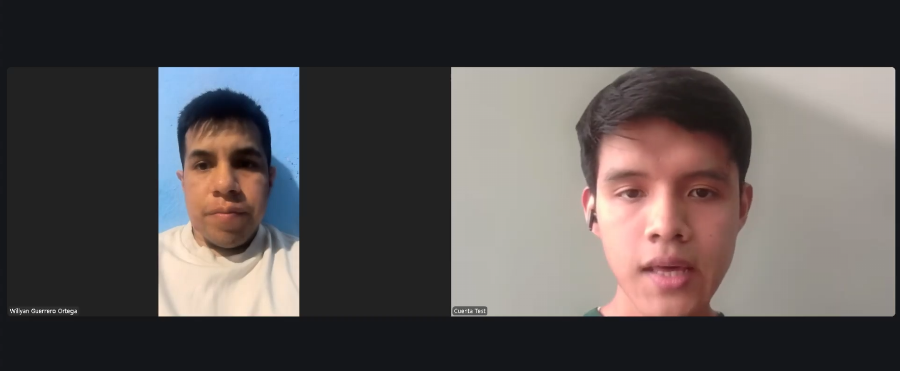
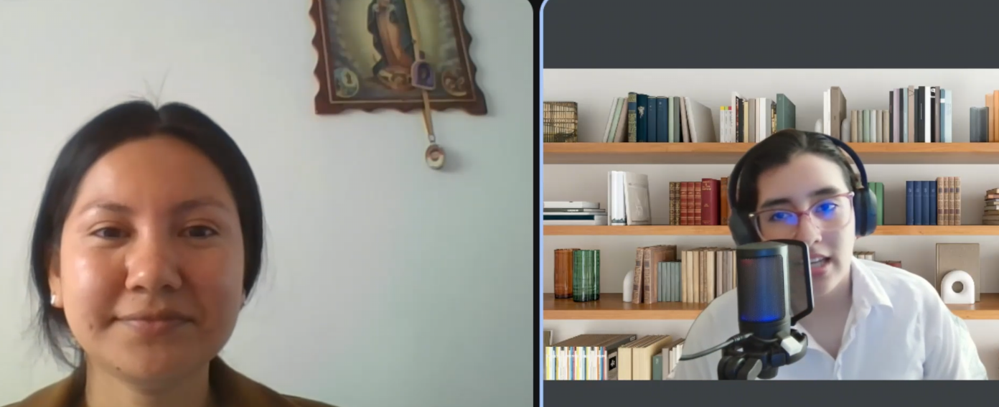
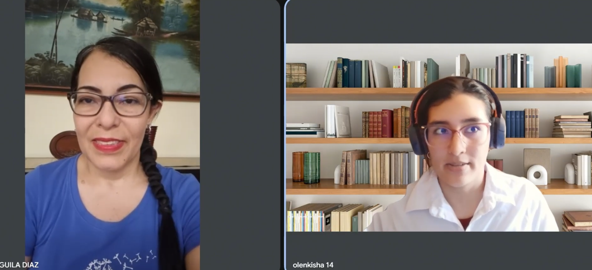

# CAPÍTULO II: REQUIREMENTS DEVELOPMENT AND SOFTWARE SOLUTION DESIGN

## 2.1. Competidores

### 2.1.1. Análisis competitivo

### 2.1.2. Estrategias y tácticas frente a competidores

## 2.2. Entrevistas

### 2.2.1. Diseño de entrevistas

Las entrevistas se diseñaron como guías semiestructuradas y diferenciadas para cada segmento objetivo. Se organizaron en bloques temáticos que van del perfil del entrevistado a su proceso actual y a la reacción frente a las hipótesis de la solución. El entrevistador podía cambiar el orden o reformular preguntas según el curso de la conversación, pero siempre con preguntas abiertas y pidiendo casos concretos en lugar de opiniones generales. Así se buscó reducir el sesgo de respuesta y obtener evidencia de comportamientos reales.

#### Segmento 1 — Nutricionista (28 – 55 años)

**Bloque 1: Perfil profesional**

1. Cuéntame tu edad, dónde atiendes y cuántos años llevas ejerciendo. ¿Trabajas de forma independiente, en una clínica o en un centro de salud?
2. ¿Cuántos pacientes activos manejas hoy? ¿Cobras por consulta suelta o por paquete de seguimiento?

**Bloque 2: Proceso de atención**

3. Llévame por lo que pasa desde que llega un paciente nuevo que quiere bajar de peso hasta que le entregas su plan.
4. Todo lo que me contaste (datos de evaluación, análisis, antecedentes, ajustes posteriores), ¿dónde queda guardado?

**Bloque 3: El periodo entre consultas**

5. Cuando el paciente vuelve a las dos semanas, ¿cómo sabes qué comió en ese tiempo? ¿Cuánto de la consulta se te va en reconstruirlo?
6. ¿Te ha pasado sospechar que un paciente no te está contando todo lo que come? Cuéntame de la última vez. ¿Cómo te diste cuenta?
7. ¿Qué haces cuando alguien no progresa y no encuentras la razón?

**Bloque 4: Herramientas actuales**

8. ¿Qué usas hoy para todo esto (software, Excel, papel, WhatsApp)? ¿Qué es lo que más te cuesta de trabajar así?

**Bloque 5: Validación de hipótesis**

9. Si tu paciente registrara sus comidas con una foto y el sistema propusiera una estimación, ¿la revisarías antes de que entre al expediente o preferirías no tener ese dato?
10. Si el sistema te avisara que lo que un paciente registra no cuadra con cómo evoluciona su peso, ¿te serviría o eso ya lo intuyes por tu cuenta?

**Bloque 6: Cierre**

11. Si pudieras cambiar una sola cosa de cómo haces el seguimiento hoy, ¿cuál sería?

#### Segmento 2 — Paciente en tratamiento nutricional activo (18 – 59 años)

**Bloque 1: Perfil y antecedentes**

1. Cuéntame tu edad, en qué distrito vives, a qué te dedicas y con quién vives. ¿Quién cocina en tu casa?
2. ¿Cómo llegaste a ir donde un nutricionista y desde cuándo? ¿Lo habías intentado antes por tu cuenta? ¿Qué pasó esa vez?

**Bloque 2: Ubicación de la información**

3. ¿Dónde tienes tu plan nutricional ahora mismo?
4. Cuando te toman medidas o te mandan análisis, ¿dónde termina eso? ¿Lo tienes tú o solo tu nutricionista?

**Bloque 3: Comportamiento actual**

5. Descríbeme cómo fue tu día de ayer en comidas, desde que te levantaste.
6. ¿Cómo sabes si cumpliste tu plan un día cualquiera? ¿Anotas algo en algún lado?
7. Cuéntame de la última vez que comiste algo que no estaba en el plan. ¿Qué pasó ese día? ¿Se lo contaste a tu nutricionista?

**Bloque 4: Relación entre consultas**

8. Entre una consulta y la otra, ¿tienen contacto? ¿Por dónde y quién escribe primero?
9. ¿Cada cuánto te pesas y quién decidió esa frecuencia?

**Bloque 5: Tecnología**

10. ¿Qué apps has probado para registrar comidas? ¿Cuánto tiempo las usaste y por qué las dejaste?

**Bloque 6: Validación de hipótesis**

11. Si registrar una comida fuera solo tomarle una foto y confirmar lo que el sistema propone, ¿lo harías a diario? ¿Qué te haría dejar de hacerlo?
12. Si hubiera un botón para decir "hoy comí fuera del plan" sin tener que explicar qué comiste, y tu nutricionista lo viera, ¿lo usarías?

**Bloque 7: Cierre**

13. Si pudieras cambiar una sola cosa de cómo llevas esto hoy, ¿cuál sería?

### 2.2.2. Registro de entrevistas

| Segmento: Nutricionista | Entrevista #1 |
| --- | --- |
| Nombres y Apellidos | Willyan Guerrero Ortega |
| Edad | 30 años |
| Distrito | Barranca, Lima |
| Ocupación | Nutricionista (Centro de Salud La Rama y atención en clínicas) |
| Entrevistador | Angel Villarreal |
| Timing | 0:00 – 0:00 |
| Duración | 0:00 minutos |
| URL | [Video entrevista]() |
| Screenshot |  |
| Resumen | Willyan tiene 30 años y cuatro de ejercicio profesional. Trabaja en el Centro de Salud La Rama y antes trabajó en EsSalud en Huaraz. En clínicas atiende entre cinco y seis pacientes activos. Con un paciente nuevo sigue las fases de la consulta nutricional: evaluación (hábitos alimentarios, antecedentes médicos, actividad física, peso, talla, perímetro abdominal, pliegues y análisis bioquímicos como perfil lipídico y glucosa), diagnóstico, intervención con un plan de alimentación personalizado y, por último, monitoreo y seguimiento. Entre consultas hace el monitoreo de forma virtual, con una frecuencia que ajusta a cada paciente, y en algunos casos lo sigue día por día. Cuando el paciente regresa, para saber qué consumió debe hacerle **nuevamente una entrevista sobre sus hábitos**. En ese periodo los pacientes también le consultan sustituciones por antojos, y él les responde con equivalencias en gramos y calorías (por ejemplo, cambiar camote por papa, yuca u olluco). Si un paciente no progresa, hace ajustes, vuelve a preguntar y, según la evaluación, lo deriva a un endocrinólogo, porque los factores hormonales pueden influir. No considera repetitivo su trabajo, ya que cada plan es individualizado. Usa Nutrimind, un software con app en su celular, para diseñar el régimen alimentario y registrar datos y medidas del paciente. Sin embargo, lo que el paciente come entre consultas lo sigue obteniendo mediante entrevista y contacto virtual. |

| Segmento: Nutricionista | Entrevista #2 |
| --- | --- |
| Nombres y Apellidos | Tatiana Mozombite |
| Edad | 28 años |
| Distrito | Iquitos, Loreto |
| Ocupación | Nutricionista (Hospital Regional de Loreto y consulta particular) |
| Entrevistador | Olenka Del Aguila |
| Timing | 0:00 – 0:00 |
| Duración | 0:00 minutos |
| URL | [Video entrevista]() |
| Screenshot |  |
| Resumen | Tatiana tiene 28 años y tres de ejercicio. Trabaja en el Hospital Regional de Loreto y atiende de forma particular los fines de semana. En su consulta particular tiene entre 8 y 10 pacientes activos y trabaja con paquetes mensuales de dos o tres controles para dar un seguimiento más cercano. Su evaluación inicial incluye entrevista de hábitos y enfermedades de base, peso, talla, perímetro abdominal y análisis clínicos. Con eso diseña un plan basado en alimentos accesibles de la zona, como pescado, plátano y frutas locales. Su información está repartida en tres lugares: la historia clínica física y el sistema del hospital (limitado a datos generales), un Excel por paciente en su laptop y WhatsApp, donde quedan los ajustes que envía. Reconoció que por esto **"a veces pierde el hilo" de lo último que le indicó a un paciente**. Reconstruir lo que el paciente comió entre consultas le consume **aproximadamente un tercio de la cita**, preguntando día por día. Contó que el proceso mejora cuando el paciente lleva un cuaderno o envía fotos, pero que la mayoría no lo hace. Relató el caso de una paciente que durante tres semanas no bajó de peso pese a afirmar que cumplía el plan; al preguntarle por los fines de semana, descubrió que no consideraba "comida" las salidas familiares de los sábados. Ante un estancamiento, primero revisa la adherencia real y luego deriva al médico para descartar problemas hormonales, sobre todo de tiroides. Sobre el registro por foto, indicó que la estimación debe ser confiable, pues corregir cada plato (por ejemplo, un tacacho o un juane) le quitaría tiempo que no tiene. Valoró mucho la alerta por inconsistencias entre registro y peso, sobre todo en pacientes que ve cada uno o tres meses, porque le evitaría esperar a la siguiente cita para detectar un problema. Lo que más le gustaría cambiar es tener toda la información del paciente en un solo lugar. |

| Segmento: Paciente en tratamiento nutricional activo | Entrevista #1 |
| --- | --- |
| Nombres y Apellidos | Evelyn Diaz |
| Edad | 52 años |
| Distrito | Iquitos, Loreto |
| Ocupación | Docente universitaria |
| Entrevistador | Olenka Del Aguila |
| Timing | 0:00 – 0:00 |
| Duración | 0:00 minutos |
| URL | [Video entrevista]() |
| Screenshot |  |
| Resumen | Evelyn tiene 52 años, vive con su madre, quien suele cocinar, y en ocasiones piden comida por delivery. Llegó al nutricionista por recomendación tras un examen de salud ocupacional que mostró triglicéridos y glucosa elevados. Recibe su plan por WhatsApp como un cronograma semanal de tres comidas diarias, que mantiene impreso y en el celular. Su nutricionista le pide **enviar todos los días, de lunes a domingo, la foto de su desayuno, almuerzo y cena** para evaluar lo que consume. Ese chat de WhatsApp es el único registro de su alimentación y el lugar donde ella misma revisa su nivel de cumplimiento. Recibe sus análisis y medidas y se los lleva al nutricionista en la cita para que los interprete. Cuando come fuera del plan por compromisos laborales o familiares (por ejemplo, makis en una reunión con colegas), igual envía la foto y explica la situación por escrito. Se pesa cada dos semanas por decisión propia. Ha usado apps de delivery con información nutricional, pero ninguna dedicada al registro de comidas. Afirmó que usaría a diario el registro por foto, "porque igual a diario tengo que enviar el reporte", siempre que la app sea eficiente. También usaría el botón de "comí fuera del plan", ya que por el trabajo le cuesta tomarse tiempo para escribirle detalles al nutricionista. Lo que más le gustaría cambiar es poder enviar sus fotos con un mensaje ya predefinido. |

| Segmento: Paciente en tratamiento nutricional activo | Entrevista #2 |
| --- | --- |
| Nombres y Apellidos | Larisa Ramírez |
| Edad | 19 años |
| Distrito | San Miguel, Lima |
| Ocupación | Estudiante de Administración y Marketing (UPC) |
| Entrevistador | Olenka Del Aguila |
| Timing | 0:00 – 0:00 |
| Duración | 0:00 minutos |
| URL | [Video entrevista]() |
| Screenshot |  |
| Resumen | Larisa tiene 19 años y vive con su prima y una persona que las ayuda en casa, quien prepara las comidas. Acudió al nutricionista para mejorar su alimentación y sentirse mejor con su cuerpo, después de intentar reducir comidas por su cuenta sin lograr constancia. Tiene su plan en WhatsApp, junto con capturas de pantalla de indicaciones puntuales. Sus medidas y resultados están repartidos entre la nutricionista, fotos en su celular y un bloc de notas, y reconoce que no tiene nada ordenado en un solo lugar. **No registra lo que come**: solo intenta recordarlo y compararlo mentalmente con el plan. La noche anterior a la entrevista comió pizza y no se lo comunicó a su nutricionista porque tiene permitido "darse un gusto" algún fin de semana y lo consideró algo puntual. El contacto con su nutricionista es por WhatsApp, esporádico y solo cuando ella tiene dudas. Se pesa una vez por semana, frecuencia indicada por su nutricionista. Probó Fitia, pero la abandonó por la flojera de buscar cada alimento e ingresar cantidades después de cada comida. Aseguró que usaría a diario el registro por foto por ser mucho más fácil, y que solo lo dejaría si el sistema se equivocara mucho o le pidiera demasiados datos manuales. Usaría el botón de "comí fuera del plan" porque es rápido y no sentiría que tiene que justificarse, y su nutricionista podría tenerlo en cuenta en la siguiente consulta. Lo que más le gustaría cambiar es tener todo en un solo lugar, con una forma fácil de registrar su alimentación y que su nutricionista pueda ver su progreso. |

### 2.2.3. Análisis de entrevistas

#### Segmento 1: Nutricionistas

**Características objetivas**

Se entrevistó a dos nutricionistas de 30 y 28 años, con cuatro y tres años de ejercicio. Ambos combinan el sector público (Centro de Salud La Rama y Hospital Regional de Loreto) con la atención privada, donde llevan el seguimiento más cercano: Willyan atiende entre cinco y seis pacientes en clínicas, y Tatiana entre 8 y 10 en su consulta particular, con paquetes mensuales de dos o tres controles.

Los dos siguen la misma secuencia de atención: evaluación (hábitos, antecedentes, antropometría y análisis bioquímicos), diagnóstico, plan de alimentación personalizado y seguimiento en citas posteriores. Las herramientas difieren. Willyan usa Nutrimind, un software móvil para diseñar planes y registrar medidas. Tatiana reparte la información entre la historia clínica y el sistema del hospital, un Excel por paciente y WhatsApp. **En ambos casos, lo que el paciente consume entre consultas no queda en ninguna herramienta**: se obtiene volviendo a entrevistar al paciente en cada cita y, en el intervalo, mediante contacto virtual informal.

**Características subjetivas**

El hallazgo central es el costo del periodo entre consultas. Tatiana dedica cerca de un tercio de cada cita a reconstruir día por día lo que comió el paciente, y Willyan describe la misma práctica al señalar que, cuando el paciente vuelve, debe "realizar nuevamente una entrevista" sobre sus hábitos. Esa reconstrucción depende de la memoria y la interpretación del paciente: Tatiana relató el caso de una paciente que pasó tres semanas sin bajar de peso porque no consideraba "comida" las salidas familiares de los sábados, un problema que solo descubrió al preguntar específicamente por los fines de semana.

Ante un paciente estancado, ambos siguen el mismo razonamiento: primero cuestionan la adherencia real al plan (ajustes y nuevas preguntas) y solo después derivan al médico o endocrinólogo para descartar causas hormonales. Esto indica que **la falta de información confiable sobre lo que comió el paciente retrasa la identificación de la causa real del estancamiento**.

Ambos valoran su criterio profesional y la personalización de los planes, y Willyan subraya que "cada paciente es distinto". Al mismo tiempo, Tatiana describe la carga operativa de trabajar con información dispersa: pierde el hilo de los ajustes que envía por WhatsApp y le cuesta armar el panorama completo del paciente antes de una cita. Frente a las hipótesis, se mostró favorable con dos condiciones claras: las estimaciones por foto deben ser confiables para no tener que corregir plato por plato, y las alertas por inconsistencia entre registro y peso le serían especialmente útiles con los pacientes que ve cada uno o tres meses. Lo que más le gustaría cambiar es tener toda la información en un solo lugar.

**Conclusión**

Los nutricionistas ya cuentan con recursos para evaluar, diagnosticar y diseñar planes (incluso software especializado, en el caso de Willyan), pero ninguno tiene visibilidad estructurada sobre lo que el paciente come entre consultas. Esa brecha consume tiempo de la consulta, permite omisiones que solo se descubren semanas después y retrasa la detección de la causa real de un estancamiento. El segmento se muestra receptivo a una herramienta que capture esa información de forma continua y la ordene junto al resto del expediente, siempre que respete su criterio clínico y no le traslade trabajo de corrección.

#### Segmento 2: Paciente en tratamiento nutricional activo

**Características objetivas**

Se entrevistó a dos pacientes con perfiles distintos: Evelyn, docente universitaria de 52 años residente en Iquitos, y Larisa, estudiante universitaria de 19 años residente en San Miguel (Lima). Llegaron al tratamiento por motivos diferentes: Evelyn por recomendación médica tras un examen ocupacional con triglicéridos y glucosa elevados, y Larisa por iniciativa propia, después de intentar mejorar su alimentación sin constancia.

Ambas reciben su plan nutricional por WhatsApp y tienen sus medidas y análisis repartidos entre el celular, documentos propios y lo que guarda el nutricionista. Sus formas de registrar lo que comen son opuestas. Evelyn envía por indicación de su nutricionista tres fotos diarias por WhatsApp, lo que deja un historial acumulado dentro del chat. Larisa no lleva ningún registro y confía en su memoria. Ninguna usa una aplicación de registro: Evelyn solo ha usado apps de delivery con información nutricional, y Larisa abandonó Fitia.

**Características subjetivas**

Los dos casos muestran las dos caras del mismo problema. Evelyn registra todo, pero a costa de un esfuerzo diario que depende de WhatsApp, y reconoce que por su trabajo le cuesta tomarse tiempo para escribirle detalles al nutricionista. Larisa no registra nada porque el único intento estructurado que probó le resultó tedioso: abandonó Fitia por la flojera de buscar cada alimento e ingresar cantidades. **En ninguno de los dos casos el nutricionista recibe información organizada**: en uno, una sucesión de fotos en un chat; en el otro, solo lo que la paciente recuerde en la consulta.

Las comidas fuera del plan confirman esta brecha. Evelyn las reporta con foto y explicación escrita. Larisa no reportó la pizza de la noche anterior porque tiene permitido darse un gusto el fin de semana, y lo consideró innecesario. Aunque esa flexibilidad es válida, el nutricionista no tiene forma de saber con qué frecuencia ocurre.

Frente a las hipótesis, ambas afirmaron que usarían a diario el registro por foto con confirmación del sistema, con condiciones parecidas: que sea eficiente, que no se equivoque demasiado y que no pida ingresar datos manualmente. Ambas usarían también el botón de "comí fuera del plan": Evelyn porque le ahorraría el tiempo de escribir detalles, y Larisa porque no sentiría que tiene que justificarse. En los cambios que más desean, Evelyn prioriza agilizar el envío de sus comidas con un mensaje predefinido, y Larisa reunir en un solo lugar su plan, sus medidas y su alimentación, y que su nutricionista pueda ver su progreso.

**Conclusión**

Las pacientes ya están dispuestas a compartir su alimentación con su nutricionista, pero los medios disponibles las obligan a elegir entre un registro manual que se abandona (Fitia) y un envío diario por chat que consume tiempo y no genera información ordenada (WhatsApp). Ambas buscan un registro rápido, basado en fotos y con mínima escritura, que les permita comunicar también las desviaciones sin sentirse juzgadas. Esto confirma que la adopción depende menos de la motivación del paciente que de reducir al mínimo el esfuerzo de cada registro.

## 2.3. Needfinding

### 2.3.1. User Personas

### 2.3.2. User Task Matrix

### 2.3.3. User Journey Mapping

### 2.3.4. Empathy Mapping

### 2.3.5. Big Picture EventStorming

### 2.3.6. Ubiquitous Language

## 2.4. Requirements Specification

### 2.4.1. User Stories

| **Epic / Story ID** | **Title** | **Description** | **Acceptance Criteria** | **Related with (Epic ID)** |
| :--- | :--- | :--- | :--- | :--- |
| **EP01** | | | | |
| US01 | | | | |

### 2.4.2. Impact Mapping

### 2.4.3. Product Backlog

| **#Order** | **Uer Story ID** | **Title** | **Description** | **Story Points**  **(1/2/3/5/8)** |
| :--- | :--- | :--- | :--- | :--- |
| 1 | | | | |

## 2.5. Strategic-Level Domain-Driven Design

### 2.5.1. EventStorming

#### 2.5.1.1. Candidate Context Discovery

#### 2.5.1.2. Domain Message Flows Modeling

#### 2.5.1.3. Bounded Context Canvases

### 2.5.2. Context Mapping

### 2.5.3. Software Architecture

#### 2.5.3.1. Software Architecture Context Level Diagrams

#### 2.5.3.2. Software Architecture Container Level Diagrams

#### 2.5.3.3. Software Architecture Deployment Diagrams

## 2.6. Tactical-Level Domain-Driven Design

### 2.6.1. Bounded Context: 

#### 2.6.1.1. Domain Layer

#### 2.6.1.2. Interface Layer

#### 2.6.1.3. Application Layer

#### 2.6.1.4. Infrastructure Layer

#### 2.6.1.5. Bounded Context Software Architecture Component Level Diagrams

#### 2.6.1.6. Bounded Context Software Architecture Code Level Diagrams

#### 2.6.1.6.1. Bounded Context Domain Layer Class Diagrams

#### 2.6.1.6.2. Bounded Context Database Design Diagram