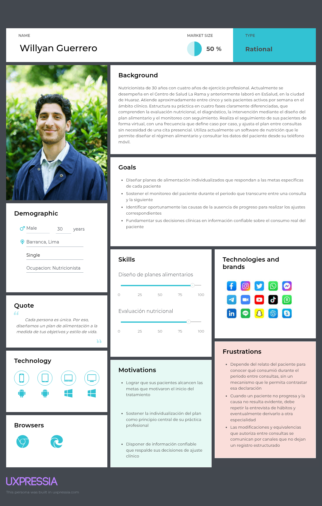
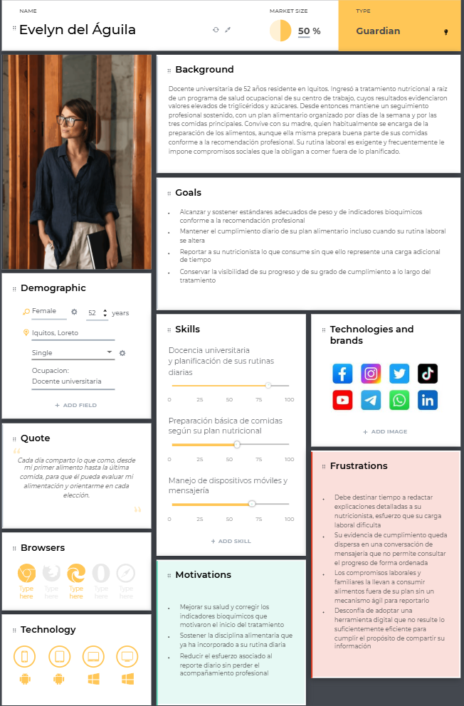
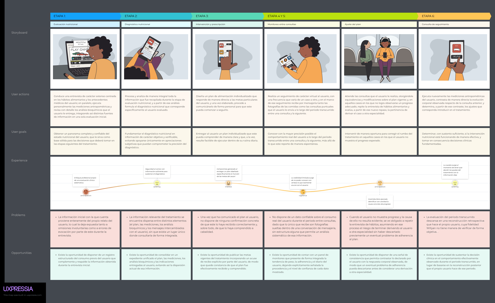
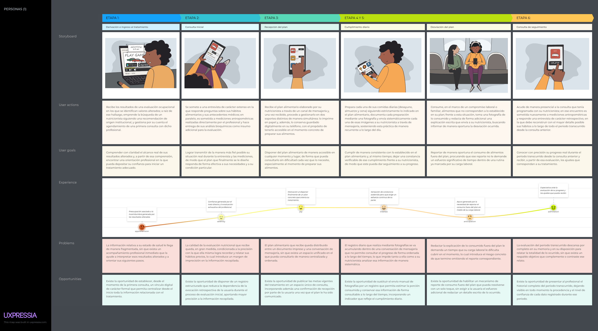
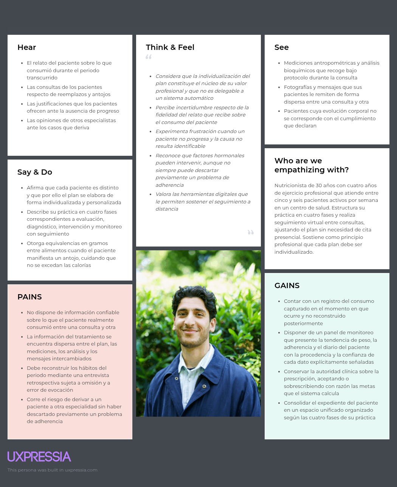
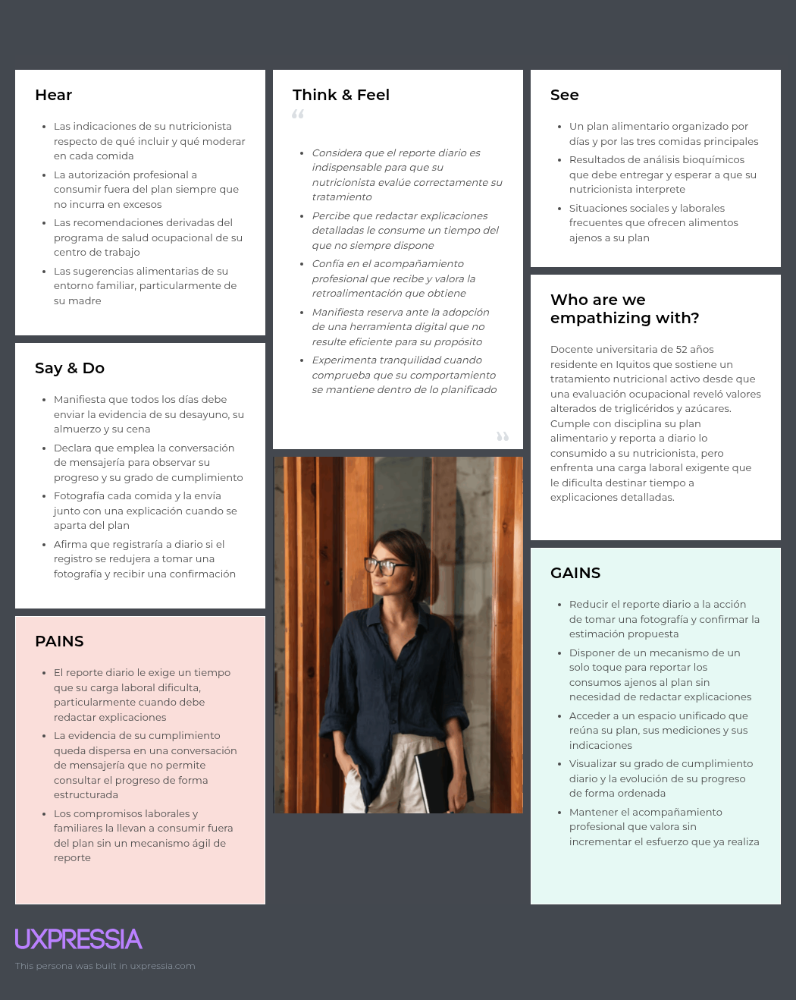

# CAPÍTULO II: REQUIREMENTS DEVELOPMENT AND SOFTWARE SOLUTION DESIGN

## 2.1. Competidores

### 2.1.1. Análisis competitivo

### 2.1.2. Estrategias y tácticas frente a competidores

## 2.2. Entrevistas

### 2.2.1. Diseño de entrevistas

### 2.2.2. Registro de entrevistas

### 2.2.3. Análisis de entrevistas

## 2.3. Needfinding

Con el propósito de comprender de manera integral las necesidades, comportamientos y motivaciones de los usuarios de Healthify, se llevó a cabo un proceso de investigación cualitativa mediante entrevistas dirigidas a representantes de cada uno de los segmentos objetivo. Estas interacciones permitieron explorar la manera en que la información del tratamiento nutricional circula actualmente entre el profesional y su paciente, las dificultades asociadas al registro del consumo durante el periodo entre consultas y las limitaciones de los canales que ambas partes emplean hoy para sostener ese seguimiento. El proceso permitió reconocer tanto necesidades explícitas como implícitas, estableciendo una base sustentada en evidencia para el diseño de una solución centrada en el usuario.

### 2.3.1. User Personas

Esta sección presenta las fichas de User Persona elaboradas en UXPressia, una por cada segmento objetivo identificado. Los arquetipos se construyen a partir de las características observadas en el análisis de entrevistas y se articulan con los hallazgos del análisis competitivo. En particular, ambos arquetipos reflejan la limitación estructural detectada en las plataformas existentes, consistente en que el periodo entre consultas depende de lo que el paciente recuerda y decide reportar. El primer arquetipo representa al nutricionista de clínica o centro de salud que conduce el tratamiento, mientras que el segundo representa a la persona en tratamiento nutricional activo. 

#### Segmento 1: Nutricionista

#### Segmento 2: Paciente en tratamiento nutricional activo

### 2.3.2. User Task Matrix

Esta sección presenta el User Task Matrix correspondiente a los dos segmentos objetivo de Healthify, representados respectivamente por Willyan Guerrero, en su condición de nutricionista de centro de salud, y por Evelyn del Águila, en su condición de paciente en tratamiento nutricional activo. La matriz concentra las tareas que ambos arquetipos realizan actualmente para cumplir sus objetivos, con independencia de la existencia de la solución propuesta. Para cada tarea se consigna la frecuencia con que se ejecuta y la importancia que reviste para el usuario correspondiente.

#### Segmento 1: Nutricionista

<table>
<tr>
<th rowspan="2">Task</th>
<th colspan="2">Willyan Guerrero</th>
<th colspan="2">Entrevistado 2</th>
<th colspan="2">Entrevistado 3</th>
</tr>
<tr>
<th>Frequency</th><th>Importance</th><th>Frequency</th><th>Importance</th><th>Frequency</th><th>Importance</th>
</tr>
<tr>
<td>Evaluar nutricionalmente al paciente mediante entrevista y mediciones</td>
<td>Siempre</td><td>Alta</td><td>Pendiente</td><td>Pendiente</td><td>Pendiente</td><td>Pendiente</td>
</tr>
<tr>
<td>Establecer el diagnóstico nutricional</td>
<td>Siempre</td><td>Alta</td><td>Pendiente</td><td>Pendiente</td><td>Pendiente</td><td>Pendiente</td>
</tr>
<tr>
<td>Diseñar el plan de alimentación individualizado</td>
<td>Siempre</td><td>Alta</td><td>Pendiente</td><td>Pendiente</td><td>Pendiente</td><td>Pendiente</td>
</tr>
<tr>
<td>Realizar el monitoreo del paciente entre consultas</td>
<td>Siempre</td><td>Alta</td><td>Pendiente</td><td>Pendiente</td><td>Pendiente</td><td>Pendiente</td>
</tr>
<tr>
<td>Reconstruir los hábitos de consumo del periodo transcurrido</td>
<td>Siempre</td><td>Alta</td><td>Pendiente</td><td>Pendiente</td><td>Pendiente</td><td>Pendiente</td>
</tr>
<tr>
<td>Ajustar el plan alimentario sin cita presencial</td>
<td>Normalmente</td><td>Alta</td><td>Pendiente</td><td>Pendiente</td><td>Pendiente</td><td>Pendiente</td>
</tr>
<tr>
<td>Solicitar u otorgar equivalencias o reemplazos de alimentos</td>
<td>Normalmente</td><td>Alta</td><td>Pendiente</td><td>Pendiente</td><td>Pendiente</td><td>Pendiente</td>
</tr>
<tr>
<td>Verificar el grado de cumplimiento del plan alimentario</td>
<td>Normalmente</td><td>Alta</td><td>Pendiente</td><td>Pendiente</td><td>Pendiente</td><td>Pendiente</td>
</tr>
<tr>
<td>Programar la siguiente consulta de seguimiento</td>
<td>Siempre</td><td>Alta</td><td>Pendiente</td><td>Pendiente</td><td>Pendiente</td><td>Pendiente</td>
</tr>
<tr>
<td>Derivar al paciente a otra especialidad ante ausencia de progreso</td>
<td>A veces</td><td>Media</td><td>Pendiente</td><td>Pendiente</td><td>Pendiente</td><td>Pendiente</td>
</tr>
<tr>
<td>Compartir o revisar los resultados de análisis bioquímicos</td>
<td>A veces</td><td>Alta</td><td>Pendiente</td><td>Pendiente</td><td>Pendiente</td><td>Pendiente</td>
</tr>
<tr>
<td>Controlar el peso corporal del paciente de forma periódica</td>
<td>A veces</td><td>Media</td><td>Pendiente</td><td>Pendiente</td><td>Pendiente</td><td>Pendiente</td>
</tr>
</table>

#### Segmento 2: Paciente en tratamiento nutricional activo

<table>
<tr>
<th rowspan="2">Task</th>
<th colspan="2">Evelyn del Águila</th>
<th colspan="2">Entrevistado 2</th>
<th colspan="2">Entrevistado 3</th>
</tr>
<tr>
<th>Frequency</th><th>Importance</th><th>Frequency</th><th>Importance</th><th>Frequency</th><th>Importance</th>
</tr>
<tr>
<td>Registrar y comunicar lo consumido en cada comida</td>
<td>Siempre</td><td>Alta</td><td>Pendiente</td><td>Pendiente</td><td>Pendiente</td><td>Pendiente</td>
</tr>
<tr>
<td>Consultar el plan alimentario prescrito antes de preparar los alimentos</td>
<td>Siempre</td><td>Alta</td><td>Pendiente</td><td>Pendiente</td><td>Pendiente</td><td>Pendiente</td>
</tr>
<tr>
<td>Verificar el grado de cumplimiento del plan alimentario</td>
<td>Siempre</td><td>Alta</td><td>Pendiente</td><td>Pendiente</td><td>Pendiente</td><td>Pendiente</td>
</tr>
<tr>
<td>Reportar el consumo de alimentos ajenos al plan</td>
<td>A veces</td><td>Alta</td><td>Pendiente</td><td>Pendiente</td><td>Pendiente</td><td>Pendiente</td>
</tr>
<tr>
<td>Controlar el peso corporal de forma periódica</td>
<td>Normalmente</td><td>Media</td><td>Pendiente</td><td>Pendiente</td><td>Pendiente</td><td>Pendiente</td>
</tr>
<tr>
<td>Solicitar equivalencias o reemplazos de alimentos</td>
<td>A veces</td><td>Media</td><td>Pendiente</td><td>Pendiente</td><td>Pendiente</td><td>Pendiente</td>
</tr>
<tr>
<td>Compartir los resultados de análisis bioquímicos</td>
<td>A veces</td><td>Alta</td><td>Pendiente</td><td>Pendiente</td><td>Pendiente</td><td>Pendiente</td>
</tr>
<tr>
<td>Reconstruir los hábitos de consumo del periodo transcurrido en la consulta de seguimiento</td>
<td>A veces</td><td>Media</td><td>Pendiente</td><td>Pendiente</td><td>Pendiente</td><td>Pendiente</td>
</tr>
<tr>
<td>Programar la siguiente consulta de seguimiento</td>
<td>A veces</td><td>Media</td><td>Pendiente</td><td>Pendiente</td><td>Pendiente</td><td>Pendiente</td>
</tr>
</table>

### Análisis de User Task Matrix

El análisis de la matriz permite identificar patrones diferenciados en el comportamiento de ambos segmentos y extraer conclusiones directamente aplicables al diseño de la solución.

En el segmento profesional, las tareas críticas se concentran en las cuatro fases del proceso de atención nutricional, con particular intensidad en el monitoreo entre consultas y en la reconstrucción de los hábitos de consumo del periodo transcurrido. Esta última tarea reviste especial interés analítico, ya que el profesional la ejecuta siempre y le atribuye importancia alta, pero la realiza mediante una entrevista retrospectiva que depende por completo de lo que el paciente recuerda y decide contar. La matriz expone así, en términos de tareas observables, la limitación estructural que el análisis competitivo identificó en las plataformas existentes.

En el segmento de pacientes, las tareas de mayor frecuencia e importancia se concentran en el registro y la comunicación de lo consumido, en la consulta del plan prescrito y en la verificación del cumplimiento. La entrevista evidencia que estas tres tareas se ejecutan de forma diaria y que la paciente les asigna una relevancia alta, dado que constituyen la evidencia sobre la cual su nutricionista evalúa la intervención. Resulta especialmente significativo que el reporte de consumos ajenos al plan, aun cuando presenta una frecuencia menor, mantenga una importancia alta, lo que revela que la paciente no busca ocultar dichos episodios sino disponer de un medio ágil para comunicarlos.

Al comparar ambos segmentos, se identifican similitudes relevantes. En ambos casos existe una alta importancia asignada a la verificación del cumplimiento del plan y al intercambio de información derivada de análisis bioquímicos, aunque cada arquetipo la aborde con una granularidad distinta, ya que el profesional la valora sobre la escala del tratamiento mientras que la paciente la evalúa día a día. Asimismo, el otorgamiento y la solicitud de equivalencias constituye una tarea genuinamente compartida que hoy se resuelve mediante intercambios de mensajería sin registro estructurado. Sin embargo, ambos segmentos difieren en su enfoque predominante, ya que el profesional concentra su comportamiento en tareas de interpretación y decisión clínica, mientras que la paciente concentra el suyo en tareas de captura y comunicación del dato. Esta separación no constituye una limitación del análisis sino un principio de diseño explícito del proyecto, según el cual el paciente registra la realidad y el nutricionista la interpreta.

A partir de ello se derivan insights clave para el diseño de Healthify. En primer lugar, la reconstrucción retrospectiva de hábitos que hoy realiza el profesional debe ser sustituida por información capturada en el momento del consumo, dado que constituye la tarea de mayor importancia con menor confiabilidad actual. En segundo lugar, la tarea de registrar debe resultar menos costosa que la de omitir, dado que su frecuencia diaria la convierte en el principal punto de fricción del segmento de pacientes. En tercer lugar, las tareas compartidas entre ambos segmentos, como el otorgamiento de equivalencias y el intercambio de resultados bioquímicos, requieren un espacio común de registro que hoy no existe, dado que ambos arquetipos las resuelven mediante canales de comunicación que no fueron concebidos para conservar información clínica.

En conjunto, estos hallazgos orientan el desarrollo de Healthify hacia una solución que capture el consumo en tiempo real desde el segmento de pacientes y que traduzca esa captura en información interpretable para el segmento profesional, sustituyendo así la dependencia actual del relato y la memoria por evidencia verificable a lo largo de todo el periodo de tratamiento.

### 2.3.3. User Journey Mapping

Esta sección presenta los User Journey Maps elaborados en UXPressia, uno por cada User Persona identificado. Los diagramas corresponden a la versión As Is, es decir, ilustran el recorrido que cada segmento experimenta actualmente en la situación previa a la existencia de Healthify. El recorrido representado abarca el ciclo completo del tratamiento nutricional, desde el momento en que se establece el vínculo entre el profesional y su paciente hasta la consulta de seguimiento en la que se evalúa el progreso alcanzado. La intención de estos mapas es exponer los puntos de fricción que se producen específicamente durante el periodo que transcurre entre una consulta y la siguiente, que constituye el foco del problema abordado por el proyecto.

#### Segmento 1: Nutricionista

#### Segmento 2: Paciente en tratamiento nutricional activo

### 2.3.4. Empathy Mapping

Esta sección presenta los Empathy Maps elaborados en UXPressia para cada uno de los User Personas identificados. El proceso de elaboración se inició con la preparación de la sesión colaborativa, en la cual el equipo situó al User Persona correspondiente en el centro del artefacto y distribuyó en cada cuadrante las observaciones derivadas del análisis de entrevistas. El trabajo se orientó a responder las preguntas guía relativas a con quién se está empatizando, qué necesita hacer el usuario, qué está diciendo, qué está viendo, qué está haciendo, qué está escuchando y cómo se siente y qué piensa. Finalmente se identificaron los dolores y las ganancias a partir de las preguntas referidas a qué le preocupa, qué puede contribuir a resolver sus problemas y qué puede convencerlo de que la propuesta constituye la alternativa correcta.

#### Segmento 1: Nutricionista

#### Segmento 2: Paciente en tratamiento nutricional activo

### 2.3.5. Big Picture EventStorming

### 2.3.6. Ubiquitous Language

## 2.4. Requirements Specification

### 2.4.1. User Stories

| **Epic / Story ID** | **Title** | **Description** | **Acceptance Criteria** | **Related with (Epic ID)** |
| :--- | :--- | :--- | :--- | :--- |
| **EP01** | | | | |
| US01 | | | | |

### 2.4.2. Impact Mapping

### 2.4.3. Product Backlog

| **#Order** | **Uer Story ID** | **Title** | **Description** | **Story Points**  **(1/2/3/5/8)** |
| :--- | :--- | :--- | :--- | :--- |
| 1 | | | | |

## 2.5. Strategic-Level Domain-Driven Design

### 2.5.1. EventStorming

#### 2.5.1.1. Candidate Context Discovery

#### 2.5.1.2. Domain Message Flows Modeling

#### 2.5.1.3. Bounded Context Canvases

### 2.5.2. Context Mapping

### 2.5.3. Software Architecture

#### 2.5.3.1. Software Architecture Context Level Diagrams

#### 2.5.3.2. Software Architecture Container Level Diagrams

#### 2.5.3.3. Software Architecture Deployment Diagrams

## 2.6. Tactical-Level Domain-Driven Design

### 2.6.1. Bounded Context: 

#### 2.6.1.1. Domain Layer

#### 2.6.1.2. Interface Layer

#### 2.6.1.3. Application Layer

#### 2.6.1.4. Infrastructure Layer

#### 2.6.1.5. Bounded Context Software Architecture Component Level Diagrams

#### 2.6.1.6. Bounded Context Software Architecture Code Level Diagrams

#### 2.6.1.6.1. Bounded Context Domain Layer Class Diagrams

#### 2.6.1.6.2. Bounded Context Database Design Diagram
