# CAPÍTULO III: SOLUTION UI/UX DESIGN

## 3.1. Product design

### 3.1.1. Style Guidelines

#### 3.1.1.1. General Style Guidelines

Healthify comunica con un tono **sereno, claro y sin juicio**. Su propuesta es que el seguimiento entre consultas sea fácil de sostener para el paciente y confiable para el nutricionista, y el lenguaje debe reflejarlo. Las decisiones de tono se resumen en las cuatro dimensiones que pide la guía del curso:

<strong>Tabla 173</strong> <em>Decisiones de tono de voz de Healthify</em>

| Dimensión | Decisión | Sustento |
|---|---|---|
| Divertido / Serio | **Serio con calidez**. Se evita el humor y los emojis en la información clínica (metas, peso, diagnósticos). | Healthify maneja datos de salud; una broma sobre el peso puede herir y restar credibilidad ante el profesional. |
| Formal / Casual | **Casual con el paciente, formal con el nutricionista**. La app y el landing tutean al paciente («Registra en segundos, sin culpa») y tratan de «usted» al nutricionista («La señal notifica, usted decide»). | Cada rol tiene un vínculo distinto con el producto: el paciente lo usa a diario y necesita cercanía; el nutricionista lo usa como herramienta clínica. |
| Respetuoso / Irreverente | **Respetuoso**. Sin reproches ni culpa: los avisos dicen «Algo no cuadra» o «Te extrañamos por acá», no «incumpliste». | La adherencia cae cuando el paciente se siente juzgado; la tendencia importa más que la cifra de un día. |
| Entusiasta / Sereno | **Sereno**, con entusiasmo moderado solo en los logros (plan publicado, comida registrada). | Una interfaz clínica transmite confianza cuando es estable y predecible. |

El principal principio que sustenta el diseño es que **la IA sugiere y el profesional decide**. Por eso toda sugerencia automática se marca con una insignia de IA (`AiBadge`) y nunca se presenta como una orden. La guía se apoya además en los principios de **jerarquía visual** (una sola acción primaria por pantalla), **consistencia** (un mismo componente para un mismo propósito), **accesibilidad** (contraste de texto ≥ 4.5:1 y de elementos no textuales ≥ 3:1) y **feedback inmediato** (estados de carga, sin conexión y error en cada pantalla).

Como base se adoptó **Material Design 3** y se adaptó a la marca: se conservan sus roles de color, escala tipográfica y componentes, pero se reemplazan los valores por los de Healthify. El resultado es el sistema de diseño «Healthify M3», publicado en la página *Mockup* del archivo de Figma del proyecto y reutilizado tal cual por el landing page y por la aplicación móvil.

**Branding**

El nombre **Healthify** combina *health* (salud) con el sufijo *-ify* («hacer»), y comunica la idea de volver práctico el cuidado de la salud. El logotipo une un corazón con una hoja: el corazón evoca el cuidado clínico y la hoja la alimentación. Junto al logotipo, la palabra *healthify* se escribe en minúsculas con la terminación «ify» resaltada en color lima, recurso que el landing page y la aplicación reutilizan. El sistema define tres versiones: **sobre negro** (blanca, usada en el encabezado del landing page), **sobre blanco (mono)** y **a color (marca)**.

<strong>Figura 113</strong> <em>Versiones del logo de Healthify: sobre negro, sobre blanco mono y a color</em>

  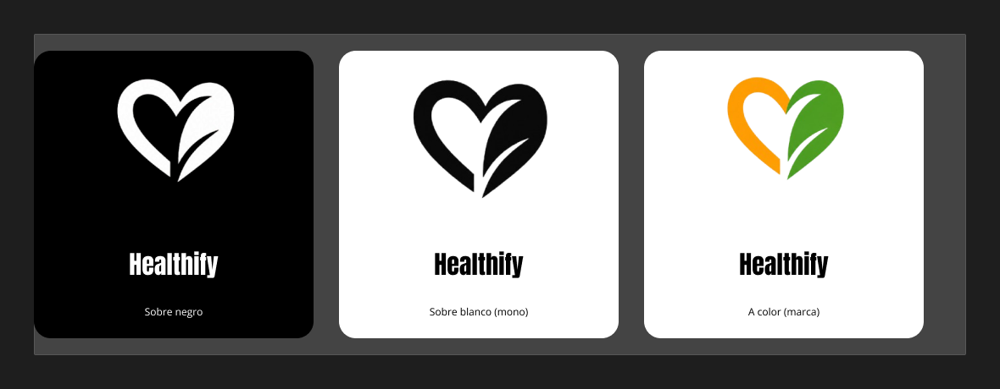

La marca se apoya en dos contrastes: un fondo oscuro casi negro, que da seriedad al landing page, y el acento lima y naranja, que aporta energía y orienta la mirada hacia las acciones.

**Typography**

Se utilizan dos familias de Google Fonts: **Anton** para títulos y cifras destacadas, y **Open Sans** para todo lo demás.

- **Anton** es una sans-serif condensada de gran impacto. Se aplica a los niveles *Display*, *Headline* y *Title Large*, y a las métricas (por ejemplo «1 260 / 1 850 kcal»). Su peso permite que el dato principal se lea de un vistazo, incluso en pantallas pequeñas.
- **Open Sans** es una sans-serif humanista, muy legible en textos largos y tamaños pequeños. Se emplea en el cuerpo, las etiquetas, los botones y los campos de formulario, con pesos 400 (regular), 600 (semibold) y 700 (bold).

La escala tipográfica usa tamaños enteros en sp (mínimo 12 sp para cuerpo y 11 sp para etiquetas), de modo que el texto respete el tamaño de fuente del sistema del usuario:

<strong>Tabla 174</strong> <em>Escala tipográfica del sistema de diseño</em>

| Estilo | Fuente | Tamaño / interlineado | Uso |
|---|---|---|---|
| Display / Small | Anton | 36 / 44 sp | Títulos de bienvenida |
| Headline / Medium | Anton | 28 / 36 sp | Título de pantalla |
| Headline / Small | Anton | 24 / 32 sp | Título de sección |
| Title / Large | Anton | 22 / 28 sp | Título de tarjeta |
| Title / Medium · Small | Open Sans SemiBold | 16 / 24 y 14 / 20 sp | Subtítulos y filas de lista |
| Body / Large · Medium · Small | Open Sans Regular | 16 / 24, 14 / 20 y 12 / 16 sp | Texto corrido y apoyo |
| Label / Large · Medium · Small | Open Sans SemiBold | 14 / 20, 12 / 16 y 11 / 16 sp | Etiquetas, chips y barra inferior |
| Button / Large | Open Sans Bold | 16 / 24 sp | Botones |
| Overline / Section | Open Sans Bold | 12 / 16 sp, espaciado 0.5 | Encabezados de grupo («GESTIÓN») |
| Metric / Large · Medium | Anton | 32 / 40 y 22 / 28 sp | Cifras (kcal, peso, días cumplidos) |

**Colors**

La paleta se organiza por roles de Material 3 y está pensada para transmitir salud y naturaleza, con un acento cálido que guía las acciones.

- **Verde (`primary` `#3B6E23`)**: color de marca. Se usa en la navegación activa, enlaces, encabezados de grupo e íconos de énfasis. Sus variantes son `primaryContainer` (`#E5F5D1`, fondo del ítem activo y de los chips «Vigente»), `onPrimaryContainer` (`#24461A`) y `brand/decor` (`#4C8F2F`), este último solo decorativo.
- **Naranja (`secondary` `#F5A623`)**: color de acción. Se reserva a **una acción principal por pantalla** («Registrar comida», «Invitar paciente», «Iniciar consulta»). Su contenedor (`#FFF1D6`) y su texto (`#7A4A00`) se usan en avisos.
- **Lima (`tertiary` `#A3D437`)**: acento para énfasis visuales en el landing page y en gráficos. Nunca se usa como color de texto sobre fondos claros por su bajo contraste.
- **Neutros**: crema `#F6F4EE` como fondo (`surface`), blanco `#FFFFFF` para tarjetas, `#1C1C1A` para el texto principal, `#5C5C57` para el texto secundario y `#D6D7C7` para bordes y separadores. El landing page añade el fondo oscuro `#101109`.
- **Error (`#B3261E`)** con su contenedor `#FCE8E4`: se reserva para errores de validación y fallas.

<strong>Figura 114</strong> <em>Paleta de colores por roles del sistema de diseño Healthify M3</em>

  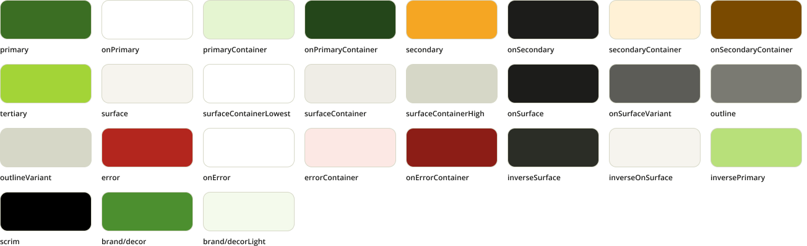

**Spacing**

El espaciado sigue una escala de **múltiplos de 4 y 8 dp**: 0, 4, 8, 12, 16, 24, 32, 40, 48 y 64. Los radios de borde son 8 dp (campos y elementos pequeños), 12 dp (tarjetas), 16 dp (módulos destacados) y 24 dp (contenedores grandes); los diálogos y hojas inferiores usan 28 dp, y los botones y chips en forma de píldora usan un radio completo. En la aplicación móvil, el margen lateral de pantalla es de 16 dp (frame de referencia de 360 × 800), los botones y campos miden 56 dp de alto y el área táctil mínima es de 48 dp. En el landing page, el contenedor tiene un ancho máximo de 1200 px con 24 px de margen lateral, y la barra de navegación mide 76 px de alto.

<strong>Figura 115</strong> <em>Fundamentos del sistema de diseño Healthify M3: color, tipografía y espaciado</em>

  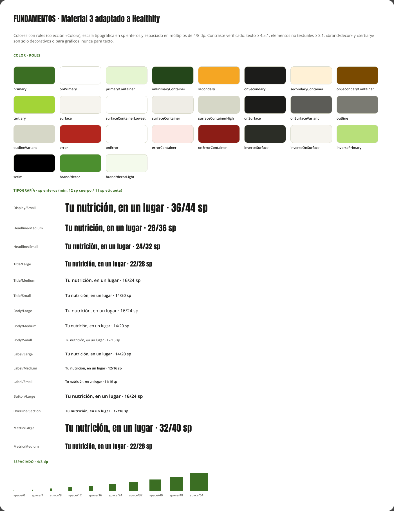

### 3.1.2. Information Architecture

La arquitectura de información de Healthify atiende dos experiencias distintas: el **landing page**, un sitio estático dirigido a nutricionistas que evalúan la herramienta y a pacientes invitados, y la **aplicación móvil**, usada a diario por dos roles, **paciente** y **nutricionista**, cada uno con su propio conjunto de pantallas.

#### 3.1.2.1. Organization Systems

**Landing Page**

Se aplica una **organización jerárquica** (visual hierarchy). La página principal ordena sus secciones de mayor a menor peso en la decisión del visitante:

1. Héroe (carrusel con propuesta de valor, video del producto y del equipo)
2. Problema que resuelve Healthify
3. Para el paciente
4. Para el nutricionista
5. Cómo funciona
6. Preguntas frecuentes
7. Pie de página (navegación, legal, redes y contacto)

La secuencia sigue un recorrido de persuasión: se plantea el problema, se muestra la solución para cada rol y se resuelven las dudas antes de invitar a la acción. Dentro de «Cómo funciona» se usa una **organización secuencial** (paso a paso) en cuatro pasos: *Medición de hoy*, *Diagnóstico con apoyo de IA*, *Metas calculadas* e *Indicaciones y publicación*. Las páginas secundarias (Nosotros, Contacto y Términos y condiciones) se organizan **por tópicos**: historia, misión y visión, valores y equipo en Nosotros; datos de contacto y formulario en Contacto; y una cláusula por tema en Términos.

La categorización del contenido combina dos esquemas: **según audiencia** (secciones «Paciente» y «Nutricionista», con el mismo patrón de presentación para comparar) y **por tópicos** en las preguntas frecuentes, filtradas por *Todas*, *Pacientes*, *Nutricionistas*, *Privacidad* e *IA*.

**Aplicación móvil**

Los módulos de la aplicación se agrupan **según audiencia** (paciente o nutricionista) y, dentro de cada rol, **por tópicos** mediante la barra de navegación inferior. En cada pantalla se combinan tres sistemas:

<strong>Tabla 175</strong> <em>Sistemas de organización de la información</em>

| Sistema | Dónde se aplica |
|---|---|
| **Jerárquico** | *Inicio* del paciente: primero la meta del día (calorías y macros) y el botón naranja «Registrar comida», y debajo «Cómo voy hoy», «Próxima consulta» y avisos. En la ficha del paciente (nutricionista): identidad y estado del plan, próxima consulta, indicadores desde la última consulta y, al final, las acciones de gestión. |
| **Secuencial** | Registro de cuenta (elegir rol, completar datos); vinculación (escanear invitación, consentimiento y alcance); registro por foto (cámara, previsualización, estimación propuesta, confirmar o ajustar); y la **consulta guiada** del nutricionista en cuatro pasos (medición, diagnóstico con IA, metas, indicaciones y publicación). |
| **Matricial** | Las tarjetas de indicadores en pares, como «Peso (autopesaje)» y «Cumplimiento» en la ficha del paciente, y la cuadrícula de proteína, carbohidratos y grasa en Inicio, que permiten comparar métricas de un vistazo. |

Para ordenar listas se usan dos criterios de categorización: **cronológico** (el diario por día, las próximas consultas en la agenda, la bandeja por fecha de recepción y las versiones del plan de la más reciente a la más antigua) y **por estado** (ítems de revisión abiertos o resueltos, vínculo vigente o dado de alta, consulta próxima o completada). La cartera de pacientes se presenta por vínculo, con la fecha desde la que el paciente está vinculado.

#### 3.1.2.2. Labelling Systems

Las etiquetas de Healthify son **breves (una o dos palabras), en español neutro y con el vocabulario del usuario**: se evitan términos técnicos como *care link* o *review item*, y se dice «Vinculación» y «Señal». Cada etiqueta de navegación se acompaña de un ícono del sistema para reconocerla sin leer. El landing page admite además la versión en inglés (ES / EN).

**Landing Page**

<strong>Tabla 176</strong> <em>Sistema de etiquetado: Landing Page</em>

| Etiqueta | Contenido que representa |
|---|---|
| Paciente | Funcionalidades para el paciente: registro por foto, tendencia, plan y consultas |
| Nutricionista | Funcionalidades para el profesional: señales, consulta guiada y publicación del plan |
| Cómo funciona | Los cuatro pasos de la consulta guiada y el seguimiento entre citas |
| Nosotros | Historia, misión, visión, valores y equipo |
| Contacto | Correo, teléfono y formulario para escribir al equipo |
| Iniciar sesión | Acceso a la aplicación |
| Soy nutricionista | Acción principal: solicitar la prueba de la herramienta |
| ES / EN | Selector de idioma |

**Aplicación del paciente**

<strong>Tabla 177</strong> <em>Sistema de etiquetado: Aplicación del paciente</em>

| Etiqueta | Contenido que representa |
|---|---|
| Inicio | Meta del día, registro rápido, «Cómo voy hoy», próxima consulta y avisos |
| Diario | Comidas registradas por día, ideas para hoy y pendientes de enviar |
| Progreso | Tendencia de peso, autopesaje y «Tu semana» (resumen con IA) |
| Expediente | Mis números, mi plan y mis consultas |
| Ajustes | Cuenta, idioma, funciones con IA, recordatorios, consentimiento y cierre de sesión |

**Aplicación del nutricionista**

<strong>Tabla 178</strong> <em>Sistema de etiquetado: Aplicación del nutricionista</em>

| Etiqueta | Contenido que representa |
|---|---|
| Pacientes | Cartera de pacientes vinculados e invitación de nuevos pacientes |
| Bandeja | Señales por revisar (por ejemplo «desviación sostenida» o «señal de consistencia») |
| Agenda | Próximas consultas, agendar, reprogramar y cancelar |
| Ajustes | Cuenta, idioma y cierre de sesión |
| Resumen · Seguimiento · Expediente · Plan | Pestañas de la ficha de cada paciente |

Los títulos dentro de cada pantalla mantienen la misma concisión («Mis pacientes», «Bandeja», «Registrar a mano», «Buscar alimento») y los botones comienzan con un verbo («Invitar paciente», «Iniciar consulta», «Registrar comida»). Las imágenes e íconos llevan texto alternativo para lectores de pantalla.

#### 3.1.2.3. SEO Tags and Meta Tags

A continuación se detallan los valores asignados a las páginas del landing page, tomados del código del sitio. Todas las páginas incluyen `charset="UTF-8"`, `viewport`, `robots: index, follow`, `theme-color` y etiquetas Open Graph y Twitter Card para compartir el enlace, además del atributo `lang="es-419"` con `es_419` como idioma principal y `en_US` como alternativo.

**Landing Page · Inicio (`index.html`)**

<strong>Tabla 179</strong> <em>Etiquetas SEO y meta tags: Landing Page · Inicio (index.html)</em>

| Tag | Valor |
|---|---|
| Title | Healthify: lo que pasa entre consultas, ahora sí se ve |
| Description | Healthify es la herramienta clínica que conecta al nutricionista con su paciente entre consultas: registro por foto, tendencias en lugar de cifras sueltas y decisiones siempre en manos del profesional. |
| Keywords | Healthify, nutricionista, paciente, seguimiento nutricional, registro de comidas, registro por foto, autopesaje, expediente clínico, nutrición |
| Author | Healthify Team |

**Landing Page · Nosotros (`about-us.html`)**

<strong>Tabla 180</strong> <em>Etiquetas SEO y meta tags: Landing Page · Nosotros (about-us.html)</em>

| Tag | Valor |
|---|---|
| Title | Nosotros \| Healthify |
| Description | Conoce Healthify: nuestra historia, misión, visión, los principios que nos guían y el equipo detrás de la herramienta de seguimiento nutricional entre consultas. |
| Keywords | Healthify, nutricionista, paciente, seguimiento nutricional, registro de comidas, registro por foto, autopesaje, expediente clínico, nutrición |
| Author | Healthify Team |

**Landing Page · Contacto (`contact.html`)**

<strong>Tabla 181</strong> <em>Etiquetas SEO y meta tags: Landing Page · Contacto (contact.html)</em>

| Tag | Valor |
|---|---|
| Title | Contacto \| Healthify |
| Description | ¿Eres nutricionista y quieres probar Healthify con tus pacientes? Escríbenos y te respondemos en menos de 48 horas hábiles. |
| Keywords | Healthify, nutricionista, paciente, seguimiento nutricional, registro de comidas, registro por foto, autopesaje, expediente clínico, nutrición |
| Author | Healthify Team |

**Landing Page · Términos y condiciones (`terms.html`)**

<strong>Tabla 182</strong> <em>Etiquetas SEO y meta tags: Landing Page · Términos y condiciones (terms.html)</em>

| Tag | Valor |
|---|---|
| Title | Términos y condiciones \| Healthify |
| Description | Términos y condiciones de uso de Healthify: consentimiento, datos compartidos, privacidad y derechos del paciente y del nutricionista. |
| Keywords | Healthify, nutricionista, paciente, seguimiento nutricional, registro de comidas, registro por foto, autopesaje, expediente clínico, nutrición |
| Author | Healthify Team |

**Aplicación móvil (Android) · ASO (App Store Optimization)**

Healthify es una aplicación nativa de Android (`pe.edu.upc.healthify`) que, al momento de este informe, aún no se publica en Google Play. Los siguientes elementos ASO quedan definidos para la ficha de publicación:

<strong>Tabla 183</strong> <em>Etiquetas de la aplicación móvil</em>

| Elemento | Valor |
|---|---|
| App Title | Healthify: seguimiento nutricional |
| App Subtitle (descripción breve) | Tu nutrición y tu nutricionista, en un solo lugar. |
| App Keywords | seguimiento nutricional, nutricionista, registro de comidas, registro por foto, autopesaje, metas nutricionales, plan alimenticio, consulta nutricional, calorías |
| App Description | Healthify conecta a pacientes y nutricionistas entre consultas. Si eres paciente, registra tus comidas con una foto o a mano, anota tu peso y mira tu tendencia sin juicios ni culpa. Si eres nutricionista, recibe señales cuando algo no cuadra, conduce la consulta guiada con apoyo de IA y publica el plan para tu paciente. La IA sugiere; tú decides. |

#### 3.1.2.4. Searching Systems

En Healthify el volumen de información por usuario es acotado, por lo que los sistemas de búsqueda se concentran donde el usuario más lo necesita, que es la búsqueda de alimentos al registrar una comida. En el resto de módulos se prefiere **filtrar por periodo, estado o fecha** en lugar de ofrecer un buscador de texto libre.

**Búsqueda de alimentos (paciente y nutricionista)**

En «Registrar a mano» el paciente cuenta con un campo «Buscar alimento» con el ejemplo «Ej. arroz, pollo, quinua…» y la ayuda «Busca primero en el catálogo guardado en tu teléfono». La búsqueda funciona así:

- **Texto libre por nombre**: los resultados se actualizan a medida que se escribe y se limitan a 25 como máximo.
- **Catálogo local primero**: se consulta el catálogo guardado en el teléfono, lo que permite buscar sin conexión, y luego el catálogo de referencia del servidor.
- **Sin resultados**: se ofrece buscar de nuevo o registrar el alimento manualmente.
- **Foto del plato**: es un camino alternativo a la búsqueda. La estimación propuesta puede corregirse con «¿No es este plato?», que abre la búsqueda.

Cada resultado se muestra como una tarjeta con el **nombre del alimento** y su **aporte energético por 100 g** («Arroz blanco cocido · 130 kcal / 100 g»). Al elegir un alimento, el paciente indica la porción en gramos y el momento de la comida, hasta 48 horas hacia atrás. El nutricionista accede al mismo catálogo desde sus Ajustes y puede **agregar alimentos locales** cuando no encuentra uno.

<strong>Figura 116</strong> <em>Pantallas de búsqueda de alimentos: campo de búsqueda vacío y con teclado abierto</em>

  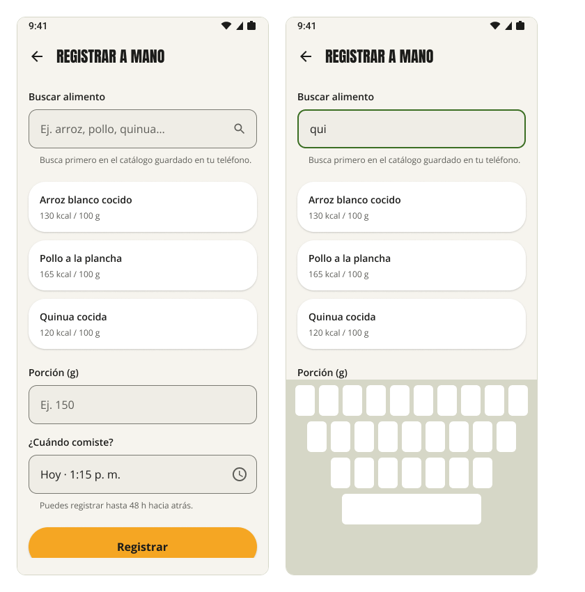

**Filtros por periodo, fecha y estado**

<strong>Tabla 184</strong> <em>Filtros de búsqueda por periodo, fecha y estado</em>

| Módulo | Filtro | Cómo luce el resultado |
|---|---|---|
| Diario (paciente) | Selección de **fecha** | Lista de comidas del día, con los pendientes de envío identificados |
| Progreso (paciente) | **Periodo** de la tendencia de peso (4 semanas) | Gráfico de tendencia y tarjeta «Tu semana» |
| Expediente (paciente y nutricionista) | **Periodo** de los últimos 30 días | Secciones con números, plan y consultas |
| Seguimiento (nutricionista) | **Semana** de 7 días | Panel de cumplimiento por día y resumen con IA |
| Bandeja (nutricionista) | **Estado**: abiertas o resueltas | Tarjetas con paciente, tipo de señal y fecha de recepción |
| Agenda (nutricionista) | **Estado** y fecha de las consultas | Lista cronológica de próximas consultas |

**Landing Page**

Al ser un sitio de pocas páginas, no incluye un buscador de texto. La única herramienta de filtrado son los **chips de las preguntas frecuentes** (*Todas*, *Pacientes*, *Nutricionistas*, *Privacidad*, *IA*), que muestran solo las respuestas del tema elegido. La página de Términos y condiciones incluye un **índice de cláusulas** para saltar a cada apartado.

#### 3.1.2.5. Navigation Systems

**Landing Page**

La navegación se articula con una **barra superior fija** (sticky navbar) que permanece visible durante el recorrido, con el logotipo (que lleva al inicio), los enlaces *Paciente*, *Nutricionista*, *Cómo funciona*, *Nosotros* y *Contacto*, el selector de idioma, el acceso «Iniciar sesión» y la llamada a la acción naranja «Soy nutricionista». Los primeros tres enlaces son **anclas** a secciones de la página principal, y los demás abren páginas. En pantallas pequeñas la barra se reemplaza por un **menú desplegable** (hamburguesa). Se añaden otras técnicas de recorrido:

- **Recorrido por secciones**: en escritorio, cada gesto de scroll o las teclas de flecha avanzan de una sección a la siguiente (scroll *snap*); en tablet y móvil el scroll es libre.
- **Carrusel del héroe** con flechas, puntos, deslizamiento y avance automático que se detiene al interactuar.
- **Pie de página** con enlaces de navegación, legales (Términos y Aviso de privacidad), redes sociales y datos de contacto, accesible desde cualquier página.
- **Enlace «Saltar al contenido principal»** para usuarios de teclado y lectores de pantalla.
- **Llamadas a la acción** consistentes: «Soy nutricionista» lleva al formulario de contacto con el rol preseleccionado.

<strong>Figura 117</strong> <em>Barra de navegación del landing page de Healthify</em>

  

**Aplicación móvil**

Tras iniciar sesión, la aplicación resuelve el rol de la persona y carga el *shell* de navegación que le corresponde. Ambos roles usan una **barra de navegación inferior persistente** (bottom navigation) con el ítem activo resaltado en verde claro y en negrita. Permite llegar a cualquier módulo principal con un toque y se mantiene visible al moverse entre ellos.

- **Paciente: 5 pestañas** (*Inicio*, *Diario*, *Progreso*, *Expediente* y *Ajustes*). Las acciones frecuentes están a un toque desde Inicio: «Registrar comida» abre la cámara, y las tarjetas «Cómo voy hoy», «Próxima consulta» y «Algo no cuadra» llevan a su detalle.
- **Nutricionista: 4 pestañas** (*Pacientes*, *Bandeja*, *Agenda* y *Ajustes*). Desde *Pacientes* se entra a la ficha de cada paciente, que tiene su propia **navegación por pestañas superiores** (*Resumen*, *Seguimiento*, *Expediente* y *Plan*), y desde allí se inicia la consulta guiada.

<strong>Figura 118</strong> <em>Barras de navegación inferior del paciente y del nutricionista</em>

  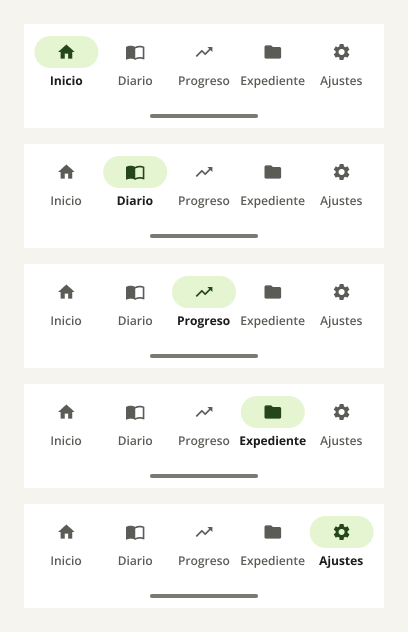 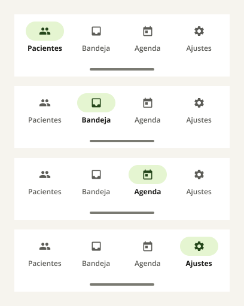

Las demás técnicas de navegación son:

- **Navegación jerárquica con retroceso**: las pantallas de detalle y los flujos (vinculación, registro de comida, consulta guiada) se abren sobre la barra inferior con una barra superior que incluye la flecha de retroceso y un título.
- **Flujos paso a paso**, con un botón principal al pie, para el registro de cuenta, la vinculación y la consulta guiada. Al salir de la consulta, el sistema pregunta «¿Salir de la consulta?» y conserva un borrador que se puede reanudar.
- **Hojas inferiores y diálogos** para decisiones puntuales (idioma, «Tus metas cambiaron», cierre de sesión, confirmaciones), de modo que el usuario no pierde su contexto.
- **Retroalimentación**: avisos temporales (*snackbar*) tras acciones como «Comida registrada» o «Plan publicado», y un banner persistente de **sin conexión** que indica qué se guardará hasta recuperar la red.
- **Acceso por código QR**: el nutricionista genera una invitación con un QR y el paciente la escanea con la cámara para vincularse.
- **Pantallas de arranque**: *Splash*, *Bienvenida*, *Registro* e *Inicio de sesión* anteceden al *shell*, y una pantalla de **sesión expirada** permite volver a entrar sin perder el contexto.

<strong>Figura 119</strong> <em>Pantallas del nutricionista: Mis pacientes, Bandeja y ficha del paciente</em>

  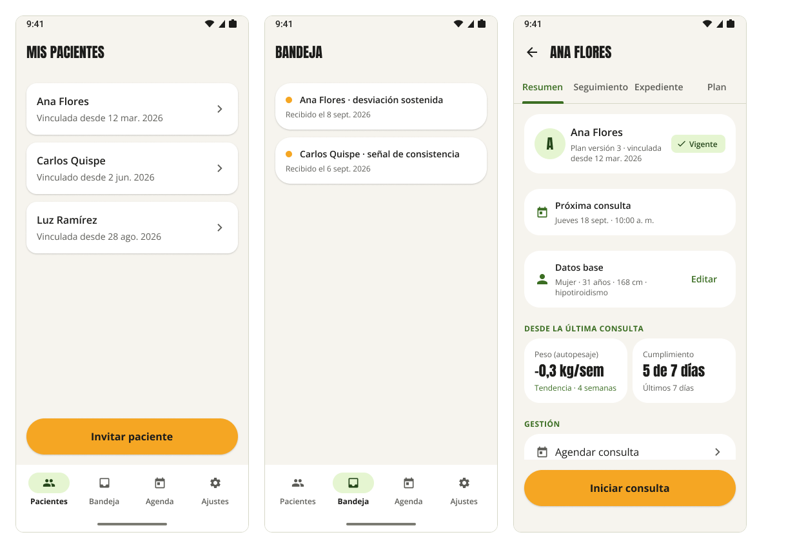
  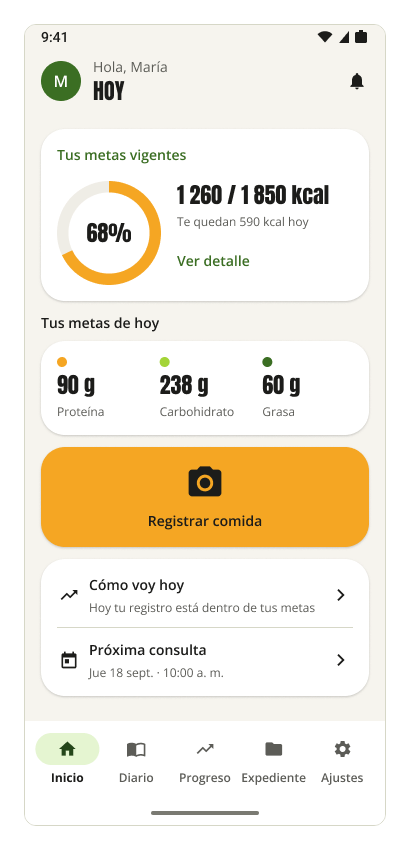

### 3.1.3. Landing Page UI Design

#### 3.1.3.1. Landing Page Wireframe

Los wireframes del landing page se elaboraron en Figma, en escala de grises y con textos reales, para validar la estructura, el orden del contenido y la jerarquía antes de aplicar color y tipografía de marca. El sitio tiene cuatro páginas (Inicio, Nosotros, Contacto y Términos y condiciones) y se diseñó para escritorio (1440 px) y móvil (390 px).

**Desktop Web Browser**

La página de Inicio se organiza en el orden definido en la sección 3.1.2.1: encabezado con navegación, héroe, problema, sección «Para el paciente», sección «Para el nutricionista», «Cómo funciona», preguntas frecuentes y pie de página.

<strong>Figura 120</strong> <em>Wireframe de Inicio en escritorio</em>

  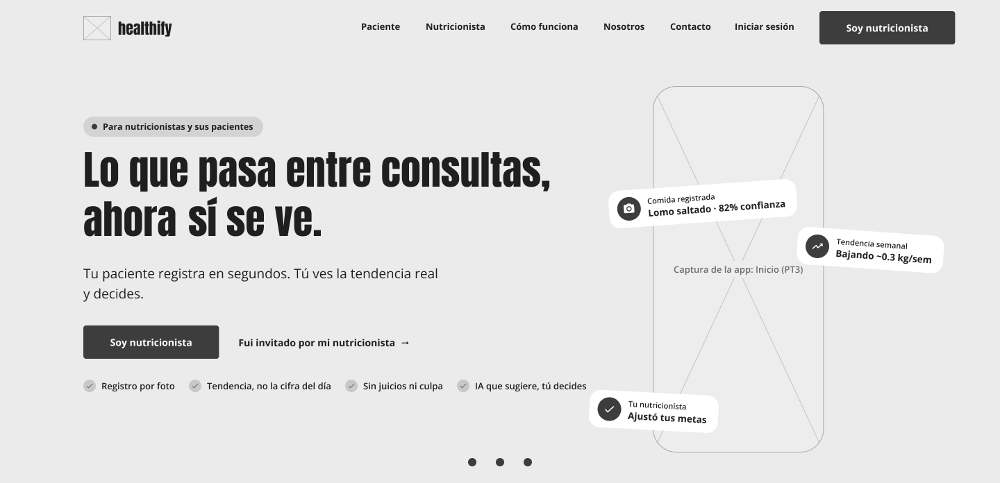

  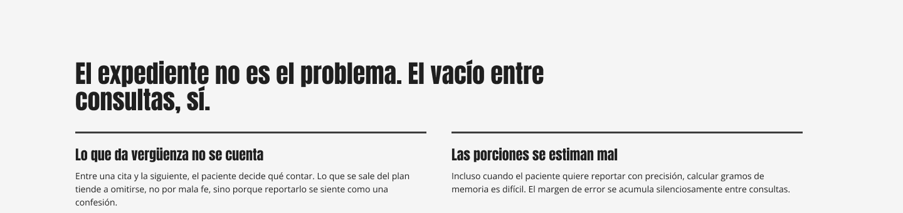

  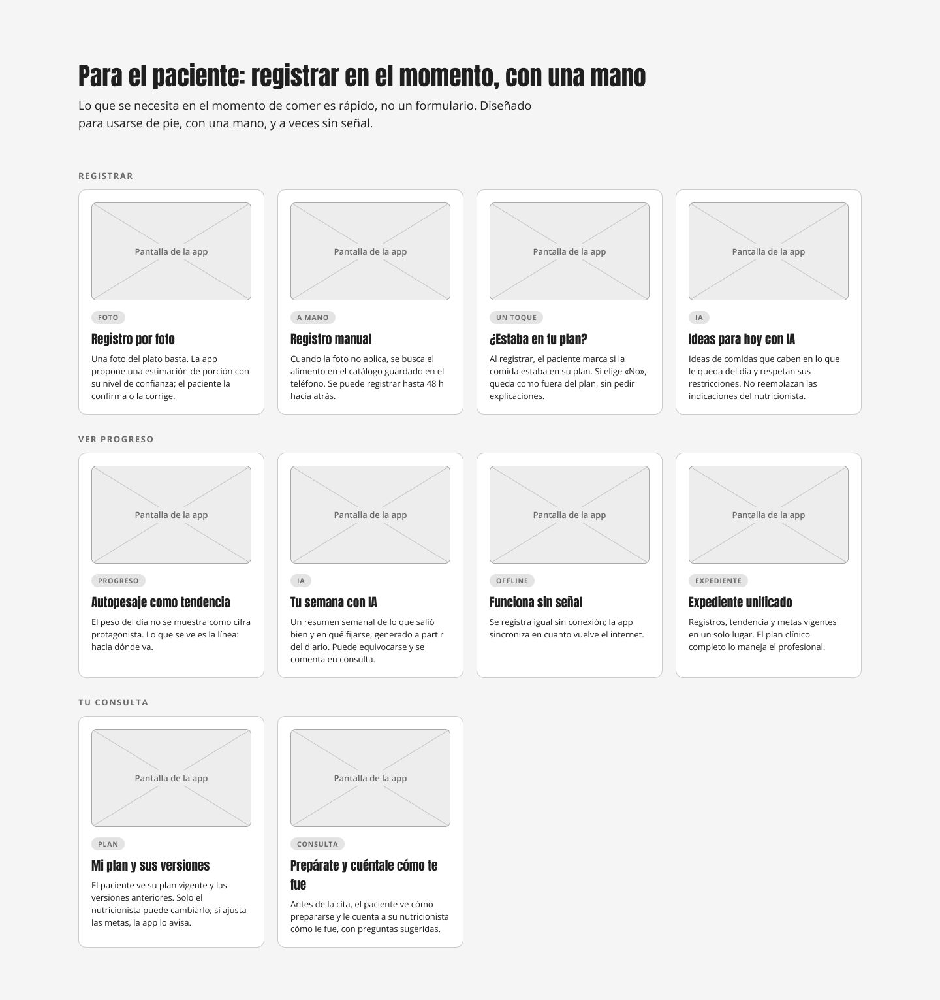

  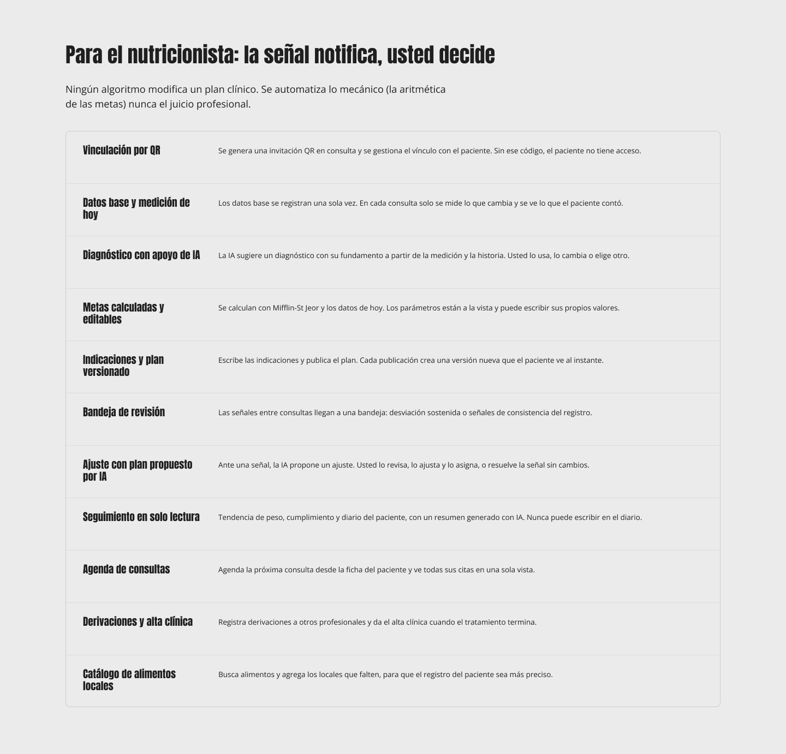

  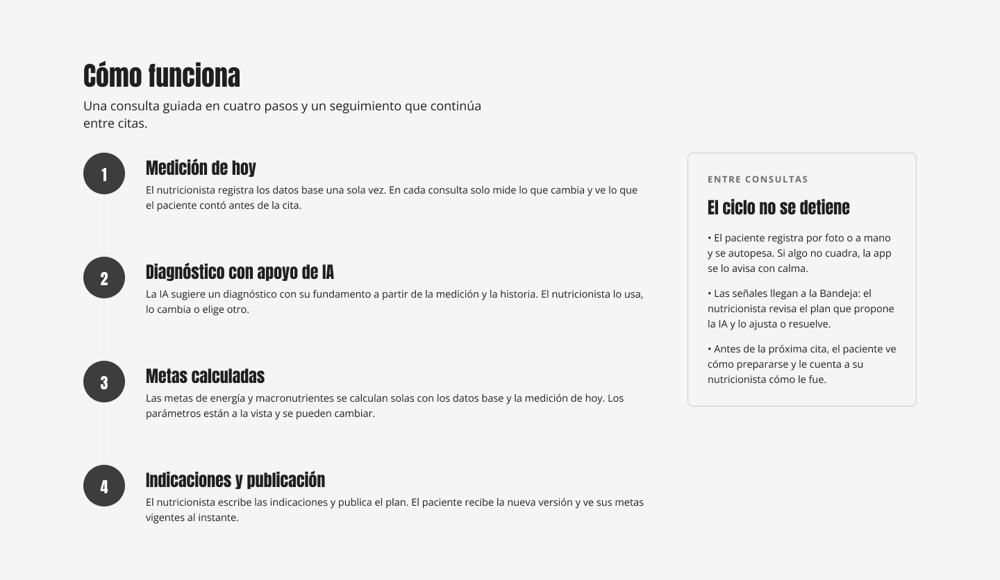

  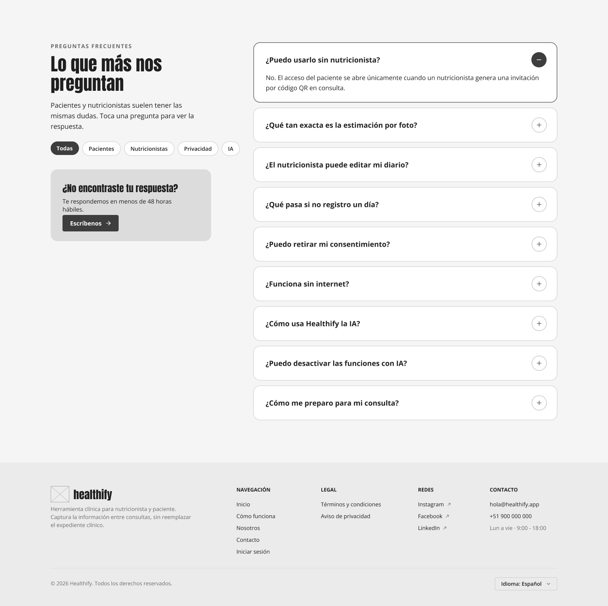

<strong>Tabla 185</strong> <em>Justificación de las decisiones de diseño del wireframe del landing page</em>

| Elemento | Justificación |
|---|---|
| **Shape** | Las tarjetas de funcionalidades, los chips de filtro y las preguntas frecuentes usan esquinas redondeadas del mismo radio. Los marcadores de imagen (rectángulo con diagonales) indican dónde irán las capturas de la app y no compiten con el contenido. |
| **Space** | El contenido ocupa un contenedor central de 1200 px. Las secciones se separan con bloques de alto uniforme y alternan fondo claro y oscuro, de modo que cada tema se lee como una unidad. Las tarjetas del paciente se organizan en una cuadrícula de 4 columnas, agrupadas bajo los rótulos «Registrar», «Ver progreso» y «Tu consulta». |
| **Direction** | La lectura es vertical y descendente. Dentro de cada sección el texto se ubica a la izquierda y la evidencia visual a la derecha, y el ojo recorre el título, el texto y la acción en ese orden. El título de «Cómo funciona» se acompaña de pasos numerados en columna, que marcan la secuencia. |
| **Size** | Los títulos en Anton son varias veces más grandes que el texto corrido y el héroe tiene el título de mayor tamaño de la página. Los botones principales («Soy nutricionista») tienen un alto mayor que los enlaces secundarios, de modo que la acción principal se identifica de inmediato. |

<strong>Tabla 186</strong> <em>Heurísticas de Nielsen aplicadas al wireframe del landing page</em>

| Heurística de Nielsen | Aplicación |
|---|---|
| **H1. Visibilidad del estado del sistema** | El carrusel del héroe muestra puntos de posición, y los chips de las preguntas frecuentes indican el filtro activo. |
| **H3. Control y libertad del usuario** | El carrusel tiene flechas y puntos para avanzar o retroceder, las preguntas se abren y se cierran, y el logotipo lleva al inicio desde cualquier página. |
| **H4. Consistencia y estándares** | Logotipo a la izquierda y navegación a la derecha, como en la mayoría de los sitios web; el mismo encabezado y pie de página en las cuatro páginas. |
| **H6. Reconocer antes que recordar** | La navegación está siempre visible, y los rótulos de las tarjetas («Registro por foto», «Autopesaje como tendencia») describen la función sin necesidad de recordar nada. |
| **H8. Diseño estético y minimalista** | Cada tarjeta tiene una etiqueta, un título y una descripción de dos o tres líneas. Se muestra una sola llamada a la acción primaria por bloque. |

<strong>Tabla 187</strong> <em>Principios de arquitectura de información aplicados al wireframe</em>

| Principio de arquitectura de información | Aplicación |
|---|---|
| **Organización jerárquica** | De lo que decide la visita (propuesta de valor) a lo que la respalda (preguntas y datos de contacto). |
| **Etiquetado** | Los textos de la navegación son los de la sección 3.1.2.2: Paciente, Nutricionista, Cómo funciona, Nosotros, Contacto. |
| **Navegación** | Barra superior fija, enlaces ancla a las secciones de Inicio y pie de página con los mismos destinos más los enlaces legales. |
| **Búsqueda y filtrado** | Sin buscador de texto. Las preguntas frecuentes se filtran por tema con chips (Todas, Pacientes, Nutricionistas, Privacidad, IA). |

**Diseño inclusivo:** el wireframe separa el contenido en bloques con encabezados claros para que los lectores de pantalla puedan navegar por títulos. Los botones y chips tienen un tamaño de toque cómodo, la información no depende solo del color (los chips y estados llevan texto), y el sitio tiene selector de idioma español / inglés. Las preguntas frecuentes incluyen la tarjeta «¿No encontraste tu respuesta?» con el compromiso de responder en menos de 48 horas hábiles, para las personas que no encuentran su duda.

Las demás páginas siguen la misma estructura de encabezado y pie. **Nosotros** presenta la historia, la misión y visión, los valores y el equipo; **Contacto** muestra los datos de contacto y un formulario; **Términos y condiciones** presenta cada cláusula con un índice lateral.

<strong>Figura 121</strong> <em>Wireframe de Nosotros en escritorio</em>

  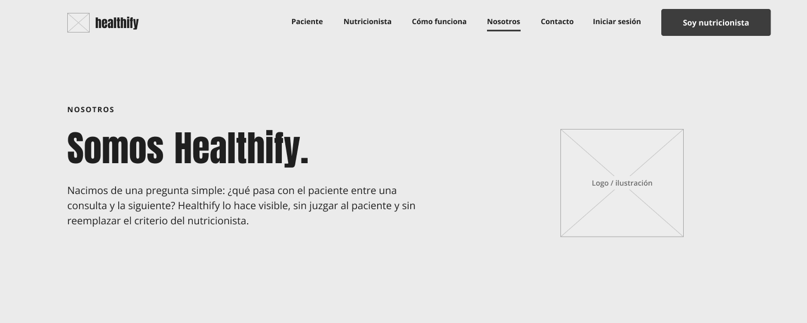

  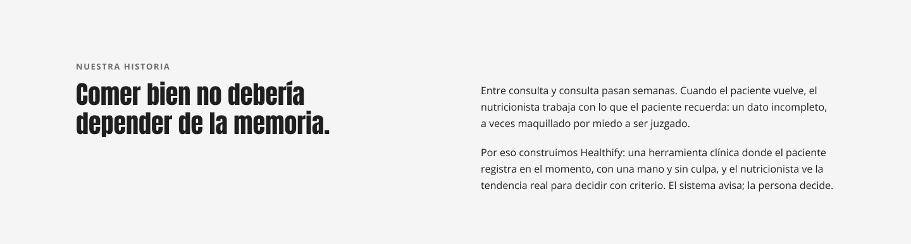

  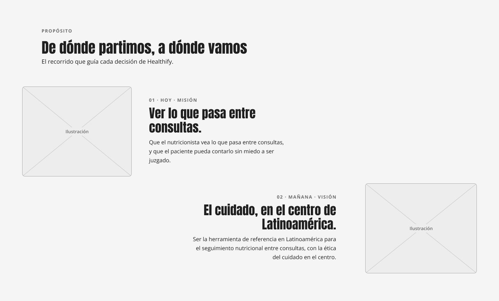

  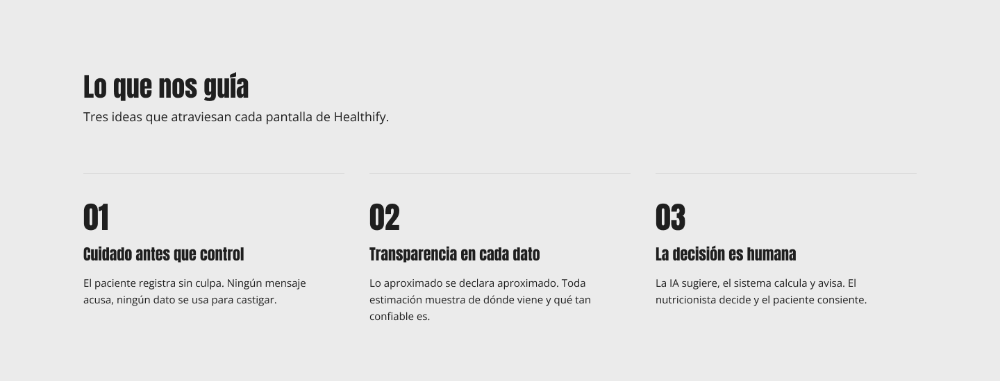

  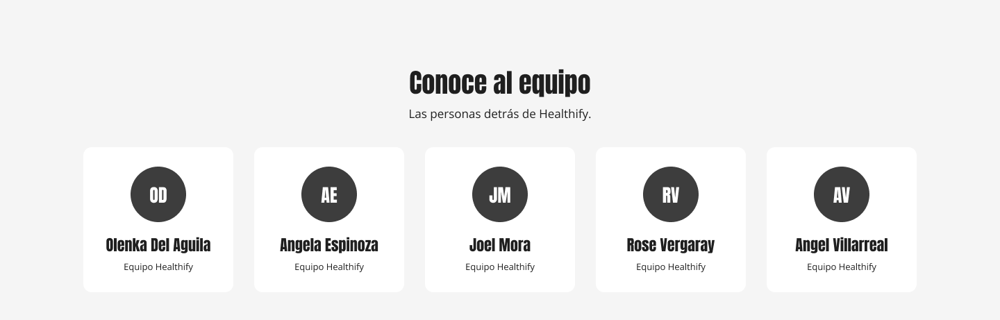

  

<strong>Figura 122</strong> <em>Wireframe de Contacto en escritorio</em>

  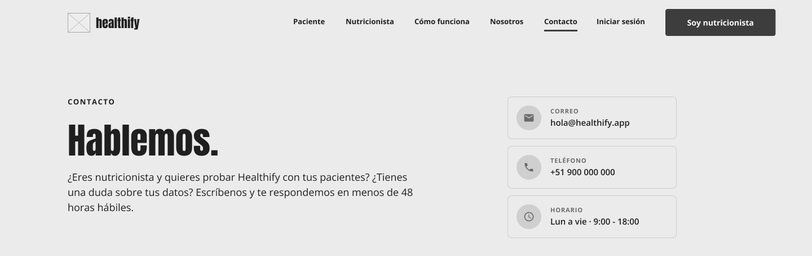

  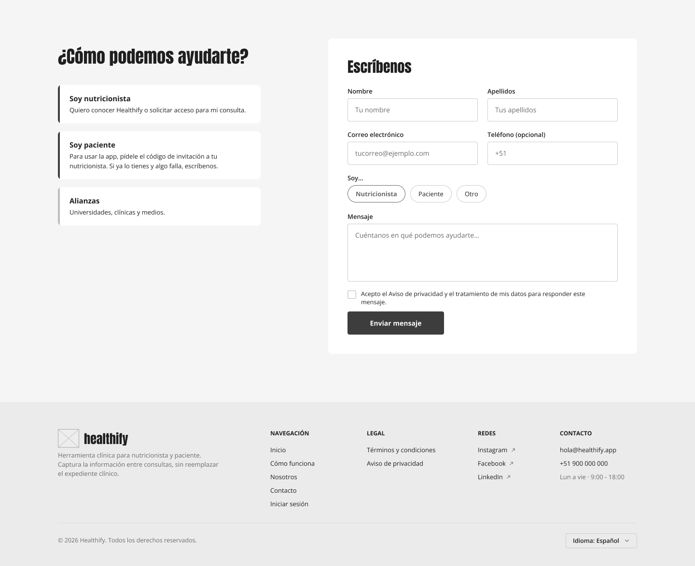

<strong>Figura 123</strong> <em>Wireframe de Términos y condiciones en escritorio</em>

  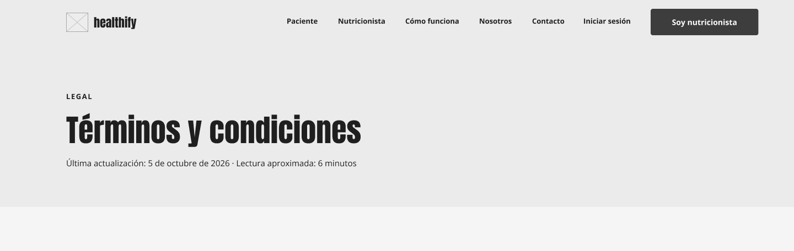

  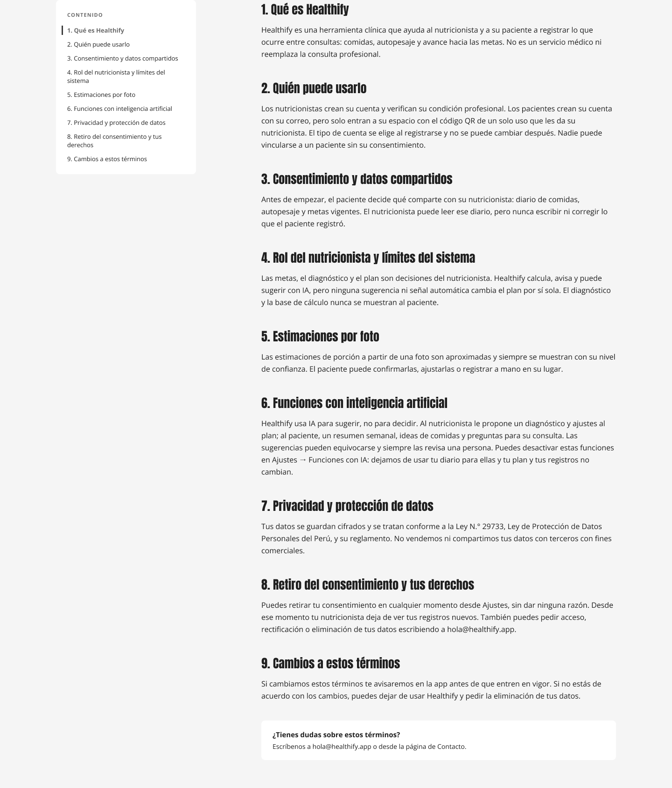

  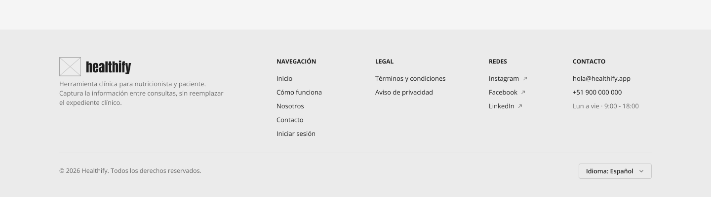

**Mobile Web Browser**

En móvil el contenido se apila en una sola columna. La navegación se oculta tras un botón de menú y se abre como una pantalla completa con los cinco enlaces en Anton, las tres acciones («Soy nutricionista», «Fui invitado por mi nutricionista» e «Iniciar sesión») y los datos de contacto. Las listas largas de funcionalidades de «Para el paciente» y «Para el nutricionista» pasan de tarjetas en cuadrícula a un acordeón, de modo que la página no se alargue más de lo necesario.

<strong>Figura 124</strong> <em>Wireframe de Inicio en móvil</em>

  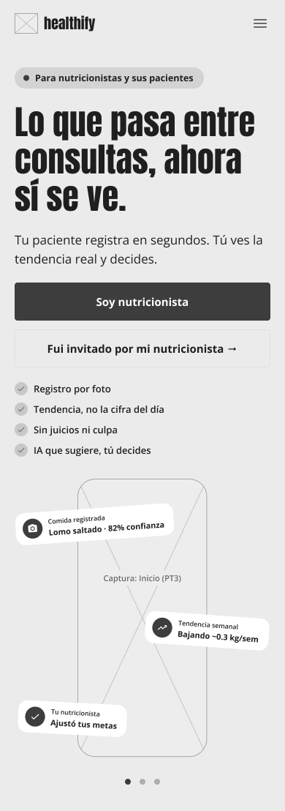
  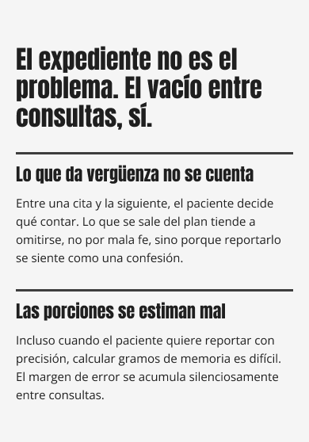
  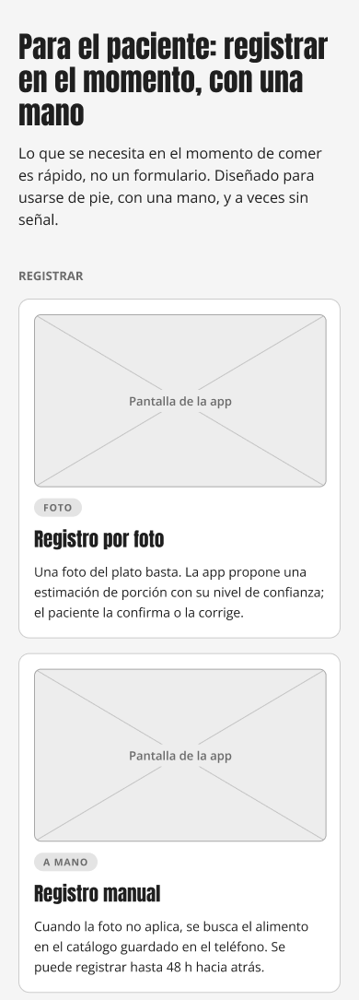
  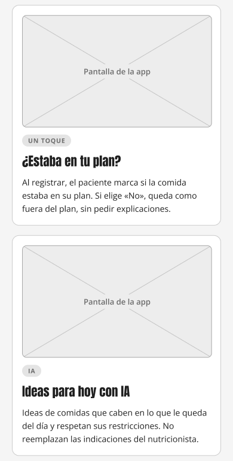

  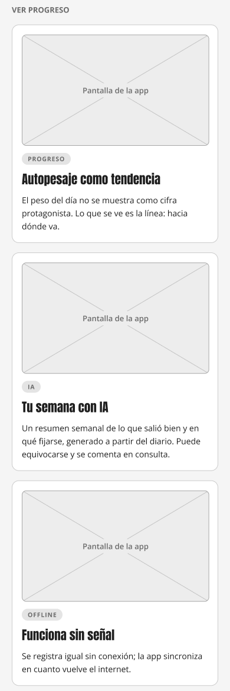
  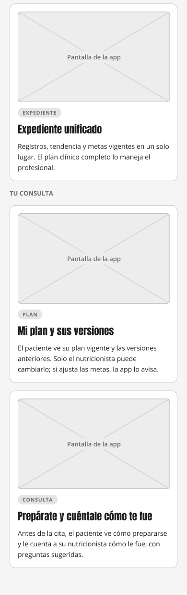
  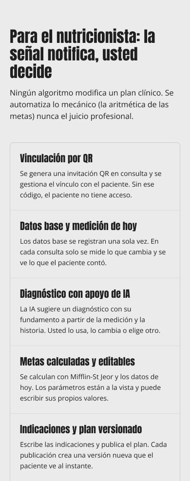
  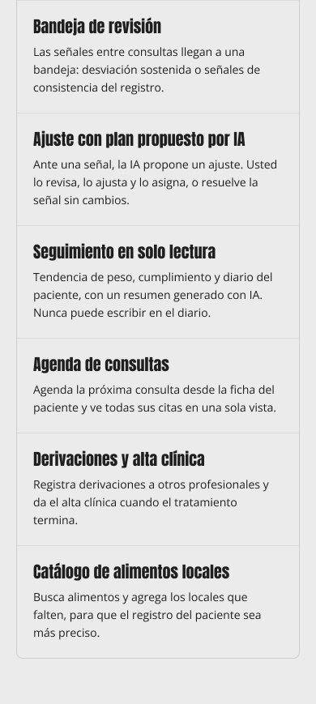

  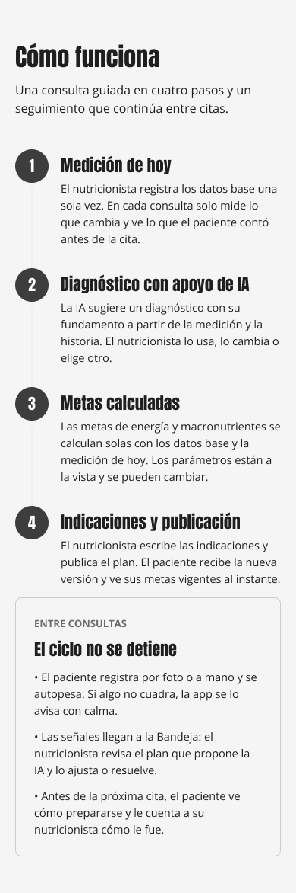
  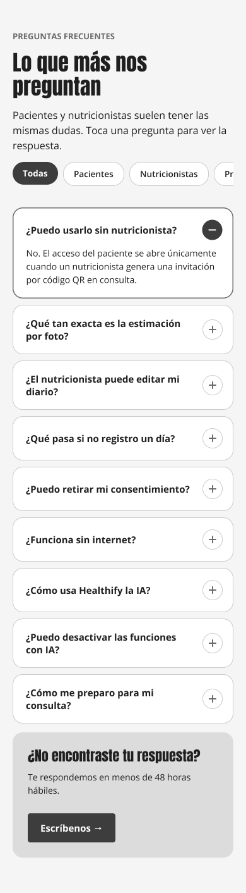
  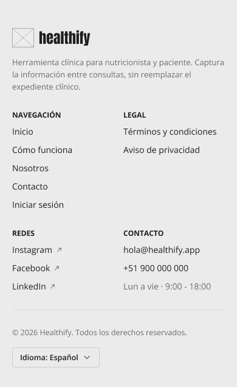
  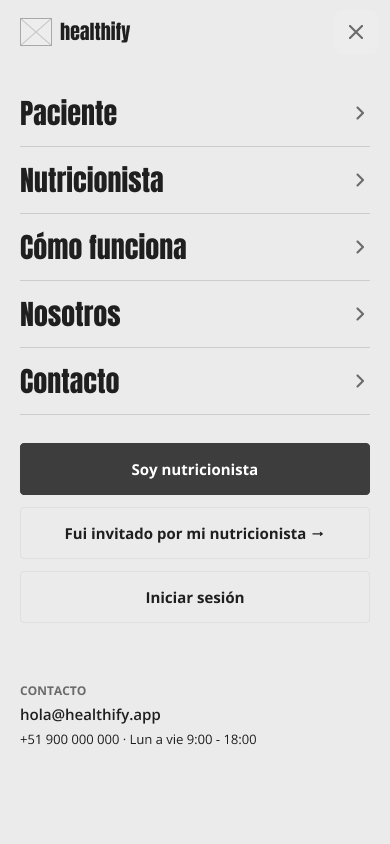

<strong>Tabla 188</strong> <em>Justificación de las decisiones de diseño del wireframe del landing page móvil</em>

| Elemento | Justificación |
|---|---|
| **Shape** | Los mismos radios y formas que en escritorio, para que la versión móvil se reconozca como la misma página. |
| **Space** | Un solo margen lateral de 16 px y bloques apilados con separación uniforme. Los botones ocupan todo el ancho para facilitar el toque con el pulgar. |
| **Direction** | Lectura vertical sin desplazamiento horizontal. Cada acordeón se abre en su lugar y no cambia el orden de la página. |
| **Size** | Los enlaces del menú tienen un tamaño grande y una altura de fila de unos 66 px, y los botones principales mantienen un alto mínimo de 48 px. |

**Diseño inclusivo en móvil:** los blancos de toque tienen al menos 48 px, el menú abierto tiene un botón de cierre visible y cada ítem del acordeón indica con un ícono si está abierto o cerrado. Los textos mantienen un tamaño mínimo de 12 px y el orden de lectura es igual al orden visual.

#### 3.1.3.2. Landing Page Mock-up

### 3.1.4. Mobile Applications UX/UI Design

#### 3.1.4.1. Mobile Applications Wireframes

#### 3.1.4.2. Mobile Applications Wireflow Diagrams

#### 3.1.4.3. Mobile Applications Mock-ups

#### 3.1.4.4. Mobile Applications User Flow Diagrams

#### 3.1.4.5. Mobile Applications Prototyping

