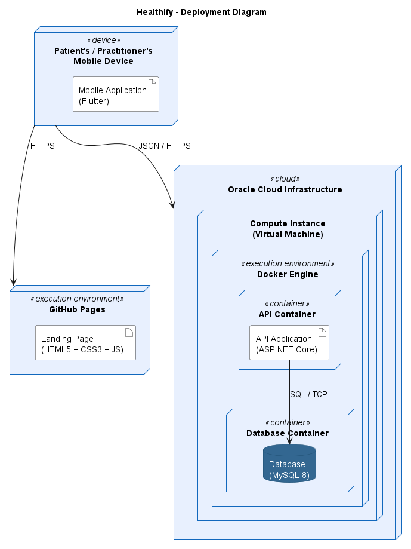

# CAPÍTULO IV: PRODUCT IMPLEMENTATION & VALIDATION

## 4.1. Software Configuration Management

### 4.1.1. Software Development Environment Configuration

La solución de Healthify tiene tres productos digitales: el **landing page** (sitio estático), los **RESTful Web Services** (backend en ASP.NET Core) y la **aplicación móvil nativa de Android** (Kotlin con Jetpack Compose). Las herramientas que el equipo usa para trabajar sobre ellos se agrupan por tipo de actividad.

**Project Management**

<p class="caption"><strong>Tabla 217</strong><br><em>Herramientas de gestión de proyectos</em></p>

| Producto | Tipo | Propósito en el proyecto | Referencia |
|---|---|---|---|
| GitHub (Issues, Pull Requests y Projects) | SaaS | Seguimiento de tareas por rama, revisión de cambios mediante pull requests y tablero del product backlog. | [github.com](https://github.com) |
| WhatsApp | SaaS / móvil | Coordinación diaria del equipo y avisos de reuniones. | [whatsapp.com](https://www.whatsapp.com) |

**Requirements Management**

<p class="caption"><strong>Tabla 218</strong><br><em>Herramientas de gestión de requisitos</em></p>

| Producto | Tipo | Propósito en el proyecto | Referencia |
|---|---|---|---|
| Miro | SaaS | Sesiones de EventStorming (Big Picture y Design Level) y Domain Message Flows. | [miro.com](https://miro.com) |
| PlantUML (con C4-PlantUML) | Línea de comandos / extensión de IDE | Diagramas C4, Bounded Context Canvas, diagramas de clases y de base de datos, versionados como archivos `.puml` en el repositorio del informe. | [plantuml.com](https://plantuml.com) |
| UXPressia | SaaS | User Personas y User Journey Mapping. | [uxpressia.com](https://uxpressia.com) |

**Product UX/UI Design**

<p class="caption"><strong>Tabla 219</strong><br><em>Herramientas de diseño UX/UI del producto</em></p>

| Producto | Tipo | Propósito en el proyecto | Referencia |
|---|---|---|---|
| Figma | SaaS | Sistema de diseño «Healthify M3», wireframes, mock-ups y prototipos del landing page y de la aplicación móvil. El archivo «Healthify» contiene las páginas *Landing Page*, *Wireframes Mobile* y *Mockup*. | [figma.com](https://www.figma.com) |
| draw.io (diagrams.net) | SaaS / escritorio | Wireflows y User Flows de la aplicación móvil. | [app.diagrams.net](https://app.diagrams.net) |

**Software Development**

<p class="caption"><strong>Tabla 220</strong><br><em>Herramientas de desarrollo de software</em></p>

| Producto | Tipo | Propósito en el proyecto | Referencia |
|---|---|---|---|
| Android Studio | Escritorio (IDE) | Desarrollo de la aplicación móvil en Kotlin y Jetpack Compose, emulador y vista previa de pantallas (`@Preview`). | [developer.android.com/studio](https://developer.android.com/studio) |
| JetBrains Rider | Escritorio (IDE) | Desarrollo del backend en C# (.NET 10), migraciones de Entity Framework Core y ejecución de pruebas. | [jetbrains.com/rider](https://www.jetbrains.com/rider/) |
| WebStorm | Escritorio (IDE) | Desarrollo del landing page (HTML, CSS y JavaScript). | [jetbrains.com/webstorm](https://www.jetbrains.com/webstorm/) |
| Visual Studio Code | Escritorio (editor) | Edición del informe en Markdown y de los diagramas PlantUML. | [code.visualstudio.com](https://code.visualstudio.com) |
| .NET SDK 10 | Escritorio | Compilación, ejecución y pruebas del backend. | [dotnet.microsoft.com/download](https://dotnet.microsoft.com/download) |
| JDK 21 y Gradle 9.6 | Escritorio | Compilación de la aplicación Android; el JDK se resuelve por `gradle-daemon-jvm.properties`. | [gradle.org](https://gradle.org) |
| MySQL 8 | Escritorio / contenedor | Base de datos del backend. | [dev.mysql.com/downloads](https://dev.mysql.com/downloads/) |
| Docker Desktop | Escritorio | Ejecución local del backend y de MySQL con `docker compose`. | [docker.com](https://www.docker.com/products/docker-desktop/) |
| Node.js (`npx serve`) | Escritorio | Servidor local para revisar el landing page. | [nodejs.org](https://nodejs.org) |


**Software Testing**

<p class="caption"><strong>Tabla 221</strong><br><em>Herramientas de pruebas de software</em></p>

| Producto | Tipo | Propósito en el proyecto | Referencia |
|---|---|---|---|
| xUnit y NSubstitute | Librerías de .NET | Pruebas unitarias y de integración del backend (`dotnet test`). Las pruebas de integración con MySQL se activan con la variable `HEALTHIFY_IT_MYSQL`. | [xunit.net](https://xunit.net) |
| JUnit 4, MockK, Turbine y `kotlinx-coroutines-test` | Librerías de Kotlin | Pruebas de JVM de los use cases, ViewModels y mappers de la aplicación (`./gradlew :app:testDebugUnitTest`). | [junit.org](https://junit.org/junit4/) |
| Swagger UI (Swashbuckle) | Incluido en el backend | Exploración y prueba manual de los endpoints REST en `/swagger`. | [swagger.io](https://swagger.io) |
| Android Lint | Incluido en Android Gradle Plugin | Análisis estático de la aplicación (`./gradlew :app:lintDebug`). | [developer.android.com/studio/write/lint](https://developer.android.com/studio/write/lint) |

**Software Deployment**

<p class="caption"><strong>Tabla 222</strong><br><em>Herramientas de despliegue de software</em></p>

| Producto | Tipo | Propósito en el proyecto | Referencia |
|---|---|---|---|
| GitHub Pages | SaaS | Publicación del landing page desde la rama `main`, con el dominio propio `landing.healthify.lat`. | [pages.github.com](https://pages.github.com) |
| GitHub Actions | SaaS | Flujo `Release` del backend: compila la solución y crea la versión en GitHub al hacer push a `main`. | [github.com/features/actions](https://github.com/features/actions) |
| Docker y Docker Compose | Motor de contenedores | Empaquetado del backend (`Dockerfile`) y orquestación del API con MySQL (`docker-compose.yml`). | [docs.docker.com](https://docs.docker.com) |
| Oracle Cloud Infrastructure | SaaS / IaaS | Máquina virtual que aloja los contenedores del backend, publicado en `platform.healthify.lat`. | [oracle.com/cloud](https://www.oracle.com/cloud/) |

**Software Documentation**

<p class="caption"><strong>Tabla 223</strong><br><em>Herramientas de documentación de software</em></p>

| Producto | Tipo | Propósito en el proyecto | Referencia |
|---|---|---|---|
| GitHub | SaaS | Repositorio del informe (`healthify-report`) y de los README de cada producto. | [github.com](https://github.com) |
| Markdown | Formato | Redacción del informe y de la documentación de cada repositorio. | [markdownguide.org](https://www.markdownguide.org) |
| Swagger / OpenAPI | Incluido en el backend | Documentación interactiva de los servicios REST. | [swagger.io](https://swagger.io) |

### 4.1.2. Source Code Management

El equipo usa **GitHub** como plataforma de control de versiones, dentro de la organización del curso. Cada producto tiene su propio repositorio.

<p class="caption"><strong>Tabla 224</strong><br><em>Repositorios del proyecto en GitHub</em></p>

| Producto | Repositorio | URL |
|---|---|---|
| Landing Page | `healthify-website` | https://github.com/upc-pre-202620-1acc0238-13981-nutrisync/healthify-website |
| Web Services (backend) | `healthify-platform` | https://github.com/upc-pre-202620-1acc0238-13981-nutrisync/healthify-platform |
| Mobile Application (Android) | `healthify-mobile` | https://github.com/upc-pre-202620-1acc0238-13981-nutrisync/healthify-android-app |
| Informe del proyecto | `healthify-report` | https://github.com/upc-pre-202620-1acc0238-13981-nutrisync/healthify-report |

El repositorio del backend contiene el proyecto `Healthify.Platform` y el proyecto de pruebas `Healthify.Platform.Tests` (unitarias y de integración) en la misma solución. El landing page no tiene dependencias: se compone de cuatro archivos HTML, una hoja de estilos y dos scripts.

**GitFlow**

El equipo aplica GitFlow, según el modelo de Vincent Driessen en «A successful Git branching model». Todos los cambios pasan por un pull request y ninguna rama de trabajo se integra directamente en `main`.

<p class="caption"><strong>Tabla 225</strong><br><em>Ramas de GitFlow y su convención de nombres</em></p>

| Rama | Origen | Destino | Convención de nombre | Uso |
|---|---|---|---|---|
| `main` | — | — | `main` | Código publicado. Cada integración en `main` corresponde a una versión con su tag. |
| `develop` | `main` | — | `develop` | Integración continua de lo que se desarrolla. Es la rama base de los features. |
| Feature | `develop` | `develop` | `feature/<contexto-o-funcionalidad>` en minúsculas y con guiones | Una rama por funcionalidad o bloque de trabajo. |
| Fix | `develop` | `develop` | `fix/<descripcion-corta>` | Corrección de un defecto detectado antes de publicar. |
| Release | `develop` | `main` y `develop` | `release/vX.Y.Z` | Preparación de una versión: ajuste del número de versión y revisión final. |
| Hotfix | `main` | `main` y `develop` | `hotfix/<descripcion-corta>` | Corrección urgente de un error de la versión publicada. |

Ejemplos reales de los repositorios: `feature/platform-foundation`, `feature/identity-and-care-links`, `feature/nutritional-care`, `feature/food-catalog-and-intake`, `feature/monitoring-and-read-models` y `feature/usda-base-url-fix` en el backend; `feature/foundation`, `feature/home-hero-problem`, `feature/home-showcases`, `feature/home-how-faq-terms` y `feature/about-contact` en el landing page; y `feature/chapter2-bounded-context` en el informe.

Flujo de trabajo de una funcionalidad:

1. Se crea `feature/<nombre>` desde `develop`.
2. Se hacen commits pequeños con Conventional Commits.
3. Se abre un pull request hacia `develop`, que otro integrante revisa. Al integrarse, la rama se elimina.
4. Para publicar, se integra `develop` en `main` mediante un pull request y se asigna el tag de la versión.

**Semantic Versioning**

Las versiones usan Semantic Versioning 2.0.0 con el formato `vMAJOR.MINOR.PATCH`:

- **MAJOR**: cambios incompatibles, por ejemplo un cambio en el contrato de la API.
- **MINOR**: funcionalidad nueva compatible con lo anterior.
- **PATCH**: corrección de errores.

<p class="caption"><strong>Tabla 226</strong><br><em>Versionado semántico por producto</em></p>

| Producto | Tags publicados | Dónde se define la versión |
|---|---|---|
| Backend | `v0.1.0`, `v0.5.0` y `v1.0.0` | Elemento `<Version>` de `Healthify.Platform.csproj`. El flujo de GitHub Actions lee ese valor y crea el tag `v<versión>` con las notas de la versión. |
| Landing Page | `v1.0.0` y `v1.0.1` | Tag en `main`. |
| Aplicación móvil | `1.0` | `versionName` y `versionCode` de `app/build.gradle.kts`. |
| Informe | `1.0.0` (AV1) | Registro de versiones del `README.md`. |

**Conventional Commits**

Los mensajes de commit siguen Conventional Commits 1.0.0, en inglés, en modo imperativo y en minúsculas:

```
<type>(<scope>): <description>

[optional body]
```

<p class="caption"><strong>Tabla 227</strong><br><em>Tipos de commit según Conventional Commits</em></p>

| Tipo | Uso | Ejemplo real |
|---|---|---|
| `feat` | Funcionalidad nueva | `feat(care-relationship): add invitation, care link and AI preference endpoints` |
| `fix` | Corrección de un defecto | `fix(food-catalog): resolve USDA search path relative to the base address` |
| `docs` | Documentación | `docs(readme): add running instructions` |
| `test` | Pruebas | `test(composition): add cross-context test support, AI pipeline and DI composition tests` |
| `refactor` | Cambio interno sin cambio de comportamiento | `refactor(diagrams): remove inline comments from C4 and class diagrams` |
| `chore` | Mantenimiento y configuración | `chore(csproj): set project version to 1.0.0` |
| `build` | Sistema de compilación y dependencias | `build(docker): add Dockerfile and compose stack` |
| `ci` | Integración y entrega continuas | `ci(release): add release workflow` |
| `style` | Formato sin cambio de lógica | Sin uso hasta ahora |

El alcance (`scope`) indica el módulo afectado: un bounded context (`iam`, `care-relationship`, `nutritional-care`, `food-catalog`, `intake`, `monitoring`), una página (`index`, `css`, `i18n`) o un archivo de configuración (`csproj`, `readme`).

### 4.1.3. Source Code Style Guide & Conventions

Para todos los lenguajes, los nombres de paquetes, clases, funciones, variables, archivos y ramas están en **inglés**. Los textos que ve el usuario están en español y en inglés mediante archivos de recursos, no dentro del código. Los criterios de aceptación en Gherkin son la excepción y se redactan en español. Se adoptan las guías estándar de cada lenguaje, y la configuración del equipo se resume en el archivo `README.md` de cada repositorio.

**HTML**

Guías: *HTML Style Guide and Coding Conventions* (W3Schools) y *Google HTML/CSS Style Guide*.

- Etiquetas y atributos en minúsculas, indentación de 2 espacios y `<!DOCTYPE html>` en cada página.
- Estructura semántica: `header`, `nav`, `main`, `section`, `footer`, con un solo `h1` por página y los encabezados en orden.
- Atributos de accesibilidad: `lang`, `alt` en imágenes, `aria-label` y `aria-labelledby` en regiones y controles, y un enlace «Saltar al contenido principal».
- Cada texto traducible lleva un atributo `data-i18n="clave"` y no texto fijo en el código del script.

**CSS**

Guía: *Google HTML/CSS Style Guide*.

- Nomenclatura **BEM** en minúsculas con guiones: bloque `navbar`, elemento `navbar__links`, modificador `btn--primary`.
- Los colores, tipografías, radios y tamaños se definen una sola vez como variables en `:root` (`--color-orange`, `--font-heading`, `--radius`) con los valores del sistema de diseño de Figma, y no se repiten en las reglas.
- Enfoque adaptable con puntos de corte en 1100, 900 y 768 px.

**JavaScript**

Guía: *Google JavaScript Style Guide*.

- `'use strict'`, `const` y `let` (sin `var`), funciones y variables en `camelCase` y constantes en `UPPER_SNAKE_CASE`.
- Un archivo por responsabilidad: `i18n.js` (traducciones y motor de idioma) y `main.js` (menú móvil, preguntas frecuentes, carruseles, formulario).
- Funciones de inicialización con nombre `initXxx()` (`initPageScroll()`, `initShowcases()`).

**C# (backend)**

Guías: *C# Coding Conventions* de Microsoft y la guía de arquitectura del backend del equipo.

- `PascalCase` para clases, métodos y propiedades; `camelCase` para variables y parámetros; `_camelCase` para campos privados; interfaces con prefijo `I`.
- Un espacio de nombres por carpeta, con la forma `Healthify.Platform.<Contexto>.<Capa>` (por ejemplo `Healthify.Platform.Iam.Domain.Model.Aggregates`).
- Organización por bounded context, cada uno con las carpetas `Domain`, `Application`, `Infrastructure`, `Interfaces` y `Resources`. Entre contextos solo se importan las fachadas `Interfaces.Acl` y los eventos `Domain.Model.Events`.
- CQRS con servicios de comandos y de consultas (`CommandServices` y `QueryServices`), y eventos de dominio publicados después de confirmar la transacción.
- Nulabilidad activada (`<Nullable>enable</Nullable>`), documentación XML de los endpoints para Swagger y mensajes de error con código estable (`extensions.code`) y localizados en español e inglés con archivos `.resx`.

**Kotlin y Jetpack Compose (aplicación móvil)**

Guías: *Kotlin Coding Conventions* y *Android Kotlin Style Guide*.

<p class="caption"><strong>Tabla 228</strong><br><em>Convenciones de código de la aplicación móvil</em></p>

| Elemento | Convención | Ejemplo |
|---|---|---|
| Use case | `VerbNounUseCase` | `RedeemInvitationUseCase` |
| Repositorio | `NounRepository` y `NounRepositoryImpl` | `CareLinkRepository` |
| DTO y entidad Room | `NounDto` y `NounEntity` | `DiaryEntryDto` |
| Estado y ViewModel | `ScreenUiState` y `ScreenViewModel` | `DiaryUiState` |
| Rutas de navegación | `NounRoute`, serializables | `DiaryRoute` |
| Composables | Con estado `XxxScreen` y sin estado `XxxContent` | `DiaryScreen` |

- Arquitectura de cuatro capas por bounded context (`domain`, `application`, `presentation` e `infrastructure`) con dependencias hacia el dominio. `domain` y `application` son Kotlin puro, sin dependencias de Android.
- Las reglas de negocio y las validaciones viven en entidades y objetos de valor (`init { require(...) }`), no en ViewModels ni en Composables.
- Un solo `StateFlow<XxxUiState>` por pantalla, eventos únicos mediante `Channel` y `collectAsStateWithLifecycle()`. Cada Composable público recibe `modifier: Modifier = Modifier` como primer parámetro opcional.
- Nada fijo en el código de las pantallas: los colores, tipografías, dimensiones y formas vienen del tema (`MaterialTheme`, `HealthifyTheme`) y los textos de `strings.xml`.
- Los DTO de Retrofit y las entidades de Room no salen de `infrastructure`: los mappers (`toDomain()`, `toEntity()`, `toDto()`) los convierten.
- Cada `XxxContent` tiene un `@Preview` por estado relevante (normal, carga, vacío, sin conexión y error) con `widthDp = 360` y `heightDp = 800`.
- Las versiones de las dependencias se declaran solo en `gradle/libs.versions.toml`.

**Pruebas y especificaciones**

- Pruebas del backend en xUnit, con nombres que describen el comportamiento (`PersonNameTests`, `RefreshRetryGraceTests`) y un archivo de pruebas por clase probada, en una carpeta que replica la del proyecto.
- Pruebas de la aplicación en JUnit 4 con MockK y Turbine, con los dobles de prueba en la misma ruta que la clase probada.
- Los criterios de aceptación de las historias de usuario se escriben en **Gherkin** (*Dado que*, *Cuando*, *Entonces*), siguiendo *Gherkin Conventions for Readable Specifications*: un escenario por comportamiento, en tercera persona y sin detalles de interfaz. Son la única parte redactada en español, porque forman parte de las historias del capítulo 2.

### 4.1.4. Software Deployment Configuration

Cada producto digital tiene su propio proceso de publicación a partir de su repositorio.

**Landing Page**

El landing page es un sitio estático (HTML, CSS y JavaScript) que se publica con **GitHub Pages** desde la rama `main` del repositorio `healthify-website`, con el dominio propio `landing.healthify.lat` definido en un archivo `CNAME`.

1. El cambio se integra en `develop` mediante un pull request.
2. Se integra `develop` en `main` con otro pull request y se crea el tag de la versión (`v1.0.0`, `v1.0.1`).
3. GitHub Pages publica el contenido de `main` en el dominio configurado.
4. Para revisarlo en local: `npx serve -l 4173 .`

**Web Services (backend)**

El backend se empaqueta en una imagen de Docker de dos etapas (`Dockerfile`): la primera usa `dotnet/sdk:10.0` para restaurar y publicar en modo *Release*, y la segunda copia el resultado a `dotnet/aspnet:10.0` y expone el puerto 8080. El archivo `docker-compose.yml` levanta dos contenedores: `healthify-api` y `healthify-mysql` (MySQL 8.4 con volumen persistente y comprobación de salud). El API espera a que la base de datos esté disponible y aplica las migraciones al iniciar.

1. En la máquina virtual de Oracle Cloud se clona el repositorio en la rama `main`.
2. Se definen las variables de entorno, sin guardarlas en el repositorio:

   <p class="caption"><strong>Tabla 229</strong><br><em>Variables de entorno de despliegue</em></p>

   | Variable | Significado |
   |---|---|
   | `JWT_SECRET` | Clave de firma de los tokens, de al menos 32 caracteres (obligatoria; sin ella el API no inicia). |
   | `DATABASE_PASSWORD`, `DATABASE_SCHEMA`, `DATABASE_USER`, `DATABASE_HOST` | Credenciales y esquema de MySQL. |
   | `USDA_API_KEY` | Clave de USDA FoodData Central; vacía desactiva ese proveedor. |
   | `Ai__Enabled`, `Ai__Gemini__ApiKey` | Activan las funciones con IA, desactivadas por defecto. |

3. Se ejecuta `docker compose up --build -d`.
4. El API queda disponible en `https://platform.healthify.lat` y su documentación en `/swagger`.

Además, el flujo de GitHub Actions `Release` (`.github/workflows/release.yml`) se ejecuta con cada push a `main`: restaura y compila la solución en *Release*, lee `<Version>` de `Healthify.Platform.csproj` y crea el release `v<versión>` con las notas generadas automáticamente.

**Mobile Application (Android)**

La aplicación se compila con Gradle. La dirección del backend (`BASE_URL`) se fija en cada tipo de compilación a `https://platform.healthify.lat/api/v1/`.

<p class="caption"><strong>Tabla 230</strong><br><em>Pasos de compilación de la aplicación móvil</em></p>

| Paso | Comando |
|---|---|
| Pruebas de JVM | `./gradlew :app:testDebugUnitTest` |
| Análisis estático | `./gradlew :app:lintDebug` |
| APK de depuración | `./gradlew :app:assembleDebug` |
| APK de publicación | `./gradlew :app:assembleRelease` |

El APK resultante (`app/build/outputs/apk/`) se instala en los dispositivos Android con versión 7.0 (API 24) o superior. Los datos de sesión se guardan cifrados en el dispositivo y la aplicación funciona sin conexión para registrar comidas y autopesajes, que se sincronizan al recuperar la red.

**Deployment Diagram (C4 Model)**

El diagrama de despliegue muestra los nodos donde se ejecuta cada artefacto: el dispositivo móvil del usuario, GitHub Pages para el landing page, y la máquina virtual de Oracle Cloud con Docker Engine, que aloja los contenedores del API (ASP.NET Core 10) y de la base de datos (MySQL 8.4). El dispositivo móvil consume el API por JSON sobre HTTPS, y el API se conecta a la base de datos por la red interna de Docker.

<p class="caption"><strong>Figura 143</strong><br><em>Diagrama de despliegue de Healthify</em></p>



## 4.2. Landing Page & Mobile Application Implementation

### 4.2.1. Sprint 1

#### 4.2.1.1. Sprint Planning 1

#### 4.2.1.2. Aspect Leaders and Collaborators

#### 4.2.1.3. Sprint Backlog 1

#### 4.2.1.4. Development Evidence for Sprint Review

#### 4.2.1.5. Testing Suite Evidence for Sprint Review

#### 4.2.1.6. Execution Evidence for Sprint Review

#### 4.2.1.7. Services Documentation Evidence for Sprint Review

#### 4.2.1.8. Software Deployment Evidence for Sprint Review

#### 4.2.1.9. Team Collaboration Insights during Sprint

<div style="page-break-after: always"></div>

## 4.3. Validation Interviews

### 4.3.1. Diseño de Entrevistas

### 4.3.2. Registro de Entrevistas

### 4.3.3. Evaluaciones según heurísticas

<div style="page-break-after: always"></div>
