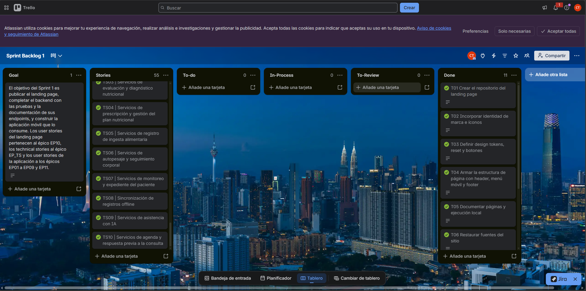

# CAPÍTULO IV: PRODUCT IMPLEMENTATION & VALIDATION

## 4.1. Software Configuration Management

### 4.1.1. Software Development Environment Configuration

La solución de Healthify tiene tres productos digitales: el **landing page** (sitio estático), los **RESTful Web Services** (backend en ASP.NET Core) y la **aplicación móvil nativa de Android** (Kotlin con Jetpack Compose). Las herramientas que el equipo usa para trabajar sobre ellos se agrupan por tipo de actividad.

**Project Management**

<p class="caption"><strong>Tabla 217</strong><br><em>Herramientas de gestión de proyectos</em></p>

| Producto | Tipo | Propósito en el proyecto | Referencia |
|---|---|---|---|
| GitHub (Issues, Pull Requests y Projects) | SaaS | Seguimiento de tareas por rama, revisión de cambios mediante pull requests y tablero del product backlog. | [github.com](https://github.com) |
| WhatsApp | SaaS / móvil | Coordinación diaria del equipo y avisos de reuniones. | [whatsapp.com](https://www.whatsapp.com) |

**Requirements Management**

<p class="caption"><strong>Tabla 218</strong><br><em>Herramientas de gestión de requisitos</em></p>

| Producto | Tipo | Propósito en el proyecto | Referencia |
|---|---|---|---|
| Miro | SaaS | Sesiones de EventStorming (Big Picture y Design Level) y Domain Message Flows. | [miro.com](https://miro.com) |
| PlantUML (con C4-PlantUML) | Línea de comandos / extensión de IDE | Diagramas C4, Bounded Context Canvas, diagramas de clases y de base de datos, versionados como archivos `.puml` en el repositorio del informe. | [plantuml.com](https://plantuml.com) |
| UXPressia | SaaS | User Personas y User Journey Mapping. | [uxpressia.com](https://uxpressia.com) |

**Product UX/UI Design**

<p class="caption"><strong>Tabla 219</strong><br><em>Herramientas de diseño UX/UI del producto</em></p>

| Producto | Tipo | Propósito en el proyecto | Referencia |
|---|---|---|---|
| Figma | SaaS | Sistema de diseño «Healthify M3», wireframes, mock-ups y prototipos del landing page y de la aplicación móvil. El archivo «Healthify» contiene las páginas *Landing Page*, *Wireframes Mobile* y *Mockup*. | [figma.com](https://www.figma.com) |
| draw.io (diagrams.net) | SaaS / escritorio | Wireflows y User Flows de la aplicación móvil. | [app.diagrams.net](https://app.diagrams.net) |

**Software Development**

<p class="caption"><strong>Tabla 220</strong><br><em>Herramientas de desarrollo de software</em></p>

| Producto | Tipo | Propósito en el proyecto | Referencia |
|---|---|---|---|
| Android Studio | Escritorio (IDE) | Desarrollo de la aplicación móvil en Kotlin y Jetpack Compose, emulador y vista previa de pantallas (`@Preview`). | [developer.android.com/studio](https://developer.android.com/studio) |
| JetBrains Rider | Escritorio (IDE) | Desarrollo del backend en C# (.NET 10), migraciones de Entity Framework Core y ejecución de pruebas. | [jetbrains.com/rider](https://www.jetbrains.com/rider/) |
| WebStorm | Escritorio (IDE) | Desarrollo del landing page (HTML, CSS y JavaScript). | [jetbrains.com/webstorm](https://www.jetbrains.com/webstorm/) |
| Visual Studio Code | Escritorio (editor) | Edición del informe en Markdown y de los diagramas PlantUML. | [code.visualstudio.com](https://code.visualstudio.com) |
| .NET SDK 10 | Escritorio | Compilación, ejecución y pruebas del backend. | [dotnet.microsoft.com/download](https://dotnet.microsoft.com/download) |
| JDK 21 y Gradle 9.6 | Escritorio | Compilación de la aplicación Android; el JDK se resuelve por `gradle-daemon-jvm.properties`. | [gradle.org](https://gradle.org) |
| MySQL 8 | Escritorio / contenedor | Base de datos del backend. | [dev.mysql.com/downloads](https://dev.mysql.com/downloads/) |
| Docker Desktop | Escritorio | Ejecución local del backend y de MySQL con `docker compose`. | [docker.com](https://www.docker.com/products/docker-desktop/) |
| Node.js (`npx serve`) | Escritorio | Servidor local para revisar el landing page. | [nodejs.org](https://nodejs.org) |


**Software Testing**

<p class="caption"><strong>Tabla 221</strong><br><em>Herramientas de pruebas de software</em></p>

| Producto | Tipo | Propósito en el proyecto | Referencia |
|---|---|---|---|
| xUnit y NSubstitute | Librerías de .NET | Pruebas unitarias y de integración del backend (`dotnet test`). Las pruebas de integración con MySQL se activan con la variable `HEALTHIFY_IT_MYSQL`. | [xunit.net](https://xunit.net) |
| JUnit 4, MockK, Turbine y `kotlinx-coroutines-test` | Librerías de Kotlin | Pruebas de JVM de los use cases, ViewModels y mappers de la aplicación (`./gradlew :app:testDebugUnitTest`). | [junit.org](https://junit.org/junit4/) |
| Swagger UI (Swashbuckle) | Incluido en el backend | Exploración y prueba manual de los endpoints REST en `/swagger`. | [swagger.io](https://swagger.io) |
| Android Lint | Incluido en Android Gradle Plugin | Análisis estático de la aplicación (`./gradlew :app:lintDebug`). | [developer.android.com/studio/write/lint](https://developer.android.com/studio/write/lint) |

**Software Deployment**

<p class="caption"><strong>Tabla 222</strong><br><em>Herramientas de despliegue de software</em></p>

| Producto | Tipo | Propósito en el proyecto | Referencia |
|---|---|---|---|
| GitHub Pages | SaaS | Publicación del landing page desde la rama `main`, con el dominio propio `landing.healthify.lat`. | [pages.github.com](https://pages.github.com) |
| GitHub Actions | SaaS | Flujo `Release` del backend: compila la solución y crea la versión en GitHub al hacer push a `main`. | [github.com/features/actions](https://github.com/features/actions) |
| Docker y Docker Compose | Motor de contenedores | Empaquetado del backend (`Dockerfile`) y orquestación del API con MySQL (`docker-compose.yml`). | [docs.docker.com](https://docs.docker.com) |
| Oracle Cloud Infrastructure | SaaS / IaaS | Máquina virtual que aloja los contenedores del backend, publicado en `platform.healthify.lat`. | [oracle.com/cloud](https://www.oracle.com/cloud/) |

**Software Documentation**

<p class="caption"><strong>Tabla 223</strong><br><em>Herramientas de documentación de software</em></p>

| Producto | Tipo | Propósito en el proyecto | Referencia |
|---|---|---|---|
| GitHub | SaaS | Repositorio del informe (`healthify-report`) y de los README de cada producto. | [github.com](https://github.com) |
| Markdown | Formato | Redacción del informe y de la documentación de cada repositorio. | [markdownguide.org](https://www.markdownguide.org) |
| Swagger / OpenAPI | Incluido en el backend | Documentación interactiva de los servicios REST. | [swagger.io](https://swagger.io) |

### 4.1.2. Source Code Management

El equipo usa **GitHub** como plataforma de control de versiones, dentro de la organización del curso. Cada producto tiene su propio repositorio.

<p class="caption"><strong>Tabla 224</strong><br><em>Repositorios del proyecto en GitHub</em></p>

| Producto | Repositorio | URL |
|---|---|---|
| Landing Page | `healthify-website` | https://github.com/upc-pre-202620-1acc0238-13981-nutrisync/healthify-website |
| Web Services (backend) | `healthify-platform` | https://github.com/upc-pre-202620-1acc0238-13981-nutrisync/healthify-platform |
| Mobile Application (Android) | `healthify-mobile` | https://github.com/upc-pre-202620-1acc0238-13981-nutrisync/healthify-android-app |
| Informe del proyecto | `healthify-report` | https://github.com/upc-pre-202620-1acc0238-13981-nutrisync/healthify-report |

El repositorio del backend contiene el proyecto `Healthify.Platform` y el proyecto de pruebas `Healthify.Platform.Tests` (unitarias y de integración) en la misma solución. El landing page no tiene dependencias: se compone de cuatro archivos HTML, una hoja de estilos y dos scripts.

**GitFlow**

El equipo aplica GitFlow, según el modelo de Vincent Driessen en «A successful Git branching model». Todos los cambios pasan por un pull request y ninguna rama de trabajo se integra directamente en `main`.

<p class="caption"><strong>Tabla 225</strong><br><em>Ramas de GitFlow y su convención de nombres</em></p>

| Rama | Origen | Destino | Convención de nombre | Uso |
|---|---|---|---|---|
| `main` | — | — | `main` | Código publicado. Cada integración en `main` corresponde a una versión con su tag. |
| `develop` | `main` | — | `develop` | Integración continua de lo que se desarrolla. Es la rama base de los features. |
| Feature | `develop` | `develop` | `feature/<contexto-o-funcionalidad>` en minúsculas y con guiones | Una rama por funcionalidad o bloque de trabajo. |
| Fix | `develop` | `develop` | `fix/<descripcion-corta>` | Corrección de un defecto detectado antes de publicar. |
| Release | `develop` | `main` y `develop` | `release/vX.Y.Z` | Preparación de una versión: ajuste del número de versión y revisión final. |
| Hotfix | `main` | `main` y `develop` | `hotfix/<descripcion-corta>` | Corrección urgente de un error de la versión publicada. |

Ejemplos reales de los repositorios: `feature/platform-foundation`, `feature/identity-and-care-links`, `feature/nutritional-care`, `feature/food-catalog-and-intake`, `feature/monitoring-and-read-models` y `feature/usda-base-url-fix` en el backend; `feature/foundation`, `feature/home-hero-problem`, `feature/home-showcases`, `feature/home-how-faq-terms` y `feature/about-contact` en el landing page; y `feature/chapter2-bounded-context` en el informe.

Flujo de trabajo de una funcionalidad:

1. Se crea `feature/<nombre>` desde `develop`.
2. Se hacen commits pequeños con Conventional Commits.
3. Se abre un pull request hacia `develop`, que otro integrante revisa. Al integrarse, la rama se elimina.
4. Para publicar, se integra `develop` en `main` mediante un pull request y se asigna el tag de la versión.

**Semantic Versioning**

Las versiones usan Semantic Versioning 2.0.0 con el formato `vMAJOR.MINOR.PATCH`:

- **MAJOR**: cambios incompatibles, por ejemplo un cambio en el contrato de la API.
- **MINOR**: funcionalidad nueva compatible con lo anterior.
- **PATCH**: corrección de errores.

<p class="caption"><strong>Tabla 226</strong><br><em>Versionado semántico por producto</em></p>

| Producto | Tags publicados | Dónde se define la versión |
|---|---|---|
| Backend | `v0.1.0`, `v0.5.0` y `v1.0.0` | Elemento `<Version>` de `Healthify.Platform.csproj`. El flujo de GitHub Actions lee ese valor y crea el tag `v<versión>` con las notas de la versión. |
| Landing Page | `v1.0.0` y `v1.0.1` | Tag en `main`. |
| Aplicación móvil | `1.0` | `versionName` y `versionCode` de `app/build.gradle.kts`. |
| Informe | `1.0.0` (AV1) | Registro de versiones del `README.md`. |

**Conventional Commits**

Los mensajes de commit siguen Conventional Commits 1.0.0, en inglés, en modo imperativo y en minúsculas:

```
<type>(<scope>): <description>

[optional body]
```

<p class="caption"><strong>Tabla 227</strong><br><em>Tipos de commit según Conventional Commits</em></p>

| Tipo | Uso | Ejemplo real |
|---|---|---|
| `feat` | Funcionalidad nueva | `feat(care-relationship): add invitation, care link and AI preference endpoints` |
| `fix` | Corrección de un defecto | `fix(food-catalog): resolve USDA search path relative to the base address` |
| `docs` | Documentación | `docs(readme): add running instructions` |
| `test` | Pruebas | `test(composition): add cross-context test support, AI pipeline and DI composition tests` |
| `refactor` | Cambio interno sin cambio de comportamiento | `refactor(diagrams): remove inline comments from C4 and class diagrams` |
| `chore` | Mantenimiento y configuración | `chore(csproj): set project version to 1.0.0` |
| `build` | Sistema de compilación y dependencias | `build(docker): add Dockerfile and compose stack` |
| `ci` | Integración y entrega continuas | `ci(release): add release workflow` |
| `style` | Formato sin cambio de lógica | Sin uso hasta ahora |

El alcance (`scope`) indica el módulo afectado: un bounded context (`iam`, `care-relationship`, `nutritional-care`, `food-catalog`, `intake`, `monitoring`), una página (`index`, `css`, `i18n`) o un archivo de configuración (`csproj`, `readme`).

### 4.1.3. Source Code Style Guide & Conventions

Para todos los lenguajes, los nombres de paquetes, clases, funciones, variables, archivos y ramas están en **inglés**. Los textos que ve el usuario están en español y en inglés mediante archivos de recursos, no dentro del código. Los criterios de aceptación en Gherkin son la excepción y se redactan en español. Se adoptan las guías estándar de cada lenguaje, y la configuración del equipo se resume en el archivo `README.md` de cada repositorio.

**HTML**

Guías: *HTML Style Guide and Coding Conventions* (W3Schools) y *Google HTML/CSS Style Guide*.

- Etiquetas y atributos en minúsculas, indentación de 2 espacios y `<!DOCTYPE html>` en cada página.
- Estructura semántica: `header`, `nav`, `main`, `section`, `footer`, con un solo `h1` por página y los encabezados en orden.
- Atributos de accesibilidad: `lang`, `alt` en imágenes, `aria-label` y `aria-labelledby` en regiones y controles, y un enlace «Saltar al contenido principal».
- Cada texto traducible lleva un atributo `data-i18n="clave"` y no texto fijo en el código del script.

**CSS**

Guía: *Google HTML/CSS Style Guide*.

- Nomenclatura **BEM** en minúsculas con guiones: bloque `navbar`, elemento `navbar__links`, modificador `btn--primary`.
- Los colores, tipografías, radios y tamaños se definen una sola vez como variables en `:root` (`--color-orange`, `--font-heading`, `--radius`) con los valores del sistema de diseño de Figma, y no se repiten en las reglas.
- Enfoque adaptable con puntos de corte en 1100, 900 y 768 px.

**JavaScript**

Guía: *Google JavaScript Style Guide*.

- `'use strict'`, `const` y `let` (sin `var`), funciones y variables en `camelCase` y constantes en `UPPER_SNAKE_CASE`.
- Un archivo por responsabilidad: `i18n.js` (traducciones y motor de idioma) y `main.js` (menú móvil, preguntas frecuentes, carruseles, formulario).
- Funciones de inicialización con nombre `initXxx()` (`initPageScroll()`, `initShowcases()`).

**C# (backend)**

Guías: *C# Coding Conventions* de Microsoft y la guía de arquitectura del backend del equipo.

- `PascalCase` para clases, métodos y propiedades; `camelCase` para variables y parámetros; `_camelCase` para campos privados; interfaces con prefijo `I`.
- Un espacio de nombres por carpeta, con la forma `Healthify.Platform.<Contexto>.<Capa>` (por ejemplo `Healthify.Platform.Iam.Domain.Model.Aggregates`).
- Organización por bounded context, cada uno con las carpetas `Domain`, `Application`, `Infrastructure`, `Interfaces` y `Resources`. Entre contextos solo se importan las fachadas `Interfaces.Acl` y los eventos `Domain.Model.Events`.
- CQRS con servicios de comandos y de consultas (`CommandServices` y `QueryServices`), y eventos de dominio publicados después de confirmar la transacción.
- Nulabilidad activada (`<Nullable>enable</Nullable>`), documentación XML de los endpoints para Swagger y mensajes de error con código estable (`extensions.code`) y localizados en español e inglés con archivos `.resx`.

**Kotlin y Jetpack Compose (aplicación móvil)**

Guías: *Kotlin Coding Conventions* y *Android Kotlin Style Guide*.

<p class="caption"><strong>Tabla 228</strong><br><em>Convenciones de código de la aplicación móvil</em></p>

| Elemento | Convención | Ejemplo |
|---|---|---|
| Use case | `VerbNounUseCase` | `RedeemInvitationUseCase` |
| Repositorio | `NounRepository` y `NounRepositoryImpl` | `CareLinkRepository` |
| DTO y entidad Room | `NounDto` y `NounEntity` | `DiaryEntryDto` |
| Estado y ViewModel | `ScreenUiState` y `ScreenViewModel` | `DiaryUiState` |
| Rutas de navegación | `NounRoute`, serializables | `DiaryRoute` |
| Composables | Con estado `XxxScreen` y sin estado `XxxContent` | `DiaryScreen` |

- Arquitectura de cuatro capas por bounded context (`domain`, `application`, `presentation` e `infrastructure`) con dependencias hacia el dominio. `domain` y `application` son Kotlin puro, sin dependencias de Android.
- Las reglas de negocio y las validaciones viven en entidades y objetos de valor (`init { require(...) }`), no en ViewModels ni en Composables.
- Un solo `StateFlow<XxxUiState>` por pantalla, eventos únicos mediante `Channel` y `collectAsStateWithLifecycle()`. Cada Composable público recibe `modifier: Modifier = Modifier` como primer parámetro opcional.
- Nada fijo en el código de las pantallas: los colores, tipografías, dimensiones y formas vienen del tema (`MaterialTheme`, `HealthifyTheme`) y los textos de `strings.xml`.
- Los DTO de Retrofit y las entidades de Room no salen de `infrastructure`: los mappers (`toDomain()`, `toEntity()`, `toDto()`) los convierten.
- Cada `XxxContent` tiene un `@Preview` por estado relevante (normal, carga, vacío, sin conexión y error) con `widthDp = 360` y `heightDp = 800`.
- Las versiones de las dependencias se declaran solo en `gradle/libs.versions.toml`.

**Pruebas y especificaciones**

- Pruebas del backend en xUnit, con nombres que describen el comportamiento (`PersonNameTests`, `RefreshRetryGraceTests`) y un archivo de pruebas por clase probada, en una carpeta que replica la del proyecto.
- Pruebas de la aplicación en JUnit 4 con MockK y Turbine, con los dobles de prueba en la misma ruta que la clase probada.
- Los criterios de aceptación de las historias de usuario se escriben en **Gherkin** (*Dado que*, *Cuando*, *Entonces*), siguiendo *Gherkin Conventions for Readable Specifications*: un escenario por comportamiento, en tercera persona y sin detalles de interfaz. Son la única parte redactada en español, porque forman parte de las historias del capítulo 2.

### 4.1.4. Software Deployment Configuration

Cada producto digital tiene su propio proceso de publicación a partir de su repositorio.

**Landing Page**

El landing page es un sitio estático (HTML, CSS y JavaScript) que se publica con **GitHub Pages** desde la rama `main` del repositorio `healthify-website`, con el dominio propio `landing.healthify.lat` definido en un archivo `CNAME`.

1. El cambio se integra en `develop` mediante un pull request.
2. Se integra `develop` en `main` con otro pull request y se crea el tag de la versión (`v1.0.0`, `v1.0.1`).
3. GitHub Pages publica el contenido de `main` en el dominio configurado.
4. Para revisarlo en local: `npx serve -l 4173 .`

**Web Services (backend)**

El backend se empaqueta en una imagen de Docker de dos etapas (`Dockerfile`): la primera usa `dotnet/sdk:10.0` para restaurar y publicar en modo *Release*, y la segunda copia el resultado a `dotnet/aspnet:10.0` y expone el puerto 8080. El archivo `docker-compose.yml` levanta dos contenedores: `healthify-api` y `healthify-mysql` (MySQL 8.4 con volumen persistente y comprobación de salud). El API espera a que la base de datos esté disponible y aplica las migraciones al iniciar.

1. En la máquina virtual de Oracle Cloud se clona el repositorio en la rama `main`.
2. Se definen las variables de entorno, sin guardarlas en el repositorio:

   <p class="caption"><strong>Tabla 229</strong><br><em>Variables de entorno de despliegue</em></p>

   | Variable | Significado |
   |---|---|
   | `JWT_SECRET` | Clave de firma de los tokens, de al menos 32 caracteres (obligatoria; sin ella el API no inicia). |
   | `DATABASE_PASSWORD`, `DATABASE_SCHEMA`, `DATABASE_USER`, `DATABASE_HOST` | Credenciales y esquema de MySQL. |
   | `USDA_API_KEY` | Clave de USDA FoodData Central; vacía desactiva ese proveedor. |
   | `Ai__Enabled`, `Ai__Gemini__ApiKey` | Activan las funciones con IA, desactivadas por defecto. |

3. Se ejecuta `docker compose up --build -d`.
4. El API queda disponible en `https://platform.healthify.lat` y su documentación en `/swagger`.

Además, el flujo de GitHub Actions `Release` (`.github/workflows/release.yml`) se ejecuta con cada push a `main`: restaura y compila la solución en *Release*, lee `<Version>` de `Healthify.Platform.csproj` y crea el release `v<versión>` con las notas generadas automáticamente.

**Mobile Application (Android)**

La aplicación se compila con Gradle. La dirección del backend (`BASE_URL`) se fija en cada tipo de compilación a `https://platform.healthify.lat/api/v1/`.

<p class="caption"><strong>Tabla 230</strong><br><em>Pasos de compilación de la aplicación móvil</em></p>

| Paso | Comando |
|---|---|
| Pruebas de JVM | `./gradlew :app:testDebugUnitTest` |
| Análisis estático | `./gradlew :app:lintDebug` |
| APK de depuración | `./gradlew :app:assembleDebug` |
| APK de publicación | `./gradlew :app:assembleRelease` |

El APK resultante (`app/build/outputs/apk/`) se instala en los dispositivos Android con versión 7.0 (API 24) o superior. Los datos de sesión se guardan cifrados en el dispositivo y la aplicación funciona sin conexión para registrar comidas y autopesajes, que se sincronizan al recuperar la red.

**Deployment Diagram (C4 Model)**

El diagrama de despliegue muestra los nodos donde se ejecuta cada artefacto: el dispositivo móvil del usuario, GitHub Pages para el landing page, y la máquina virtual de Oracle Cloud con Docker Engine, que aloja los contenedores del API (ASP.NET Core 10) y de la base de datos (MySQL 8.4). El dispositivo móvil consume el API por JSON sobre HTTPS, y el API se conecta a la base de datos por la red interna de Docker.

<p class="caption"><strong>Figura 143</strong><br><em>Diagrama de despliegue de Healthify</em></p>


## 4.2. Landing Page & Mobile Application Implementation

### 4.2.1. Sprint 1

#### 4.2.1.1. Sprint Planning 1

El Sprint 1 es el primer sprint de implementación. Se desarrolló entre el 27/09/2026 y el 09/10/2026 y cubre los tres productos digitales: el **landing page**, los **RESTful Web Services** (backend) y la **aplicación móvil Android**. Las historias incluidas son las ocho historias de usuario del épico EP10 (Landing Page), las diez historias técnicas del épico EP_TS (RESTful API) y las 37 historias de usuario de la aplicación (US01 a US31 y US39 a US44), definidas en la sección 2.4.1.

<p class="caption"><strong>Tabla 231</strong><br><em>Datos de la reunión de Sprint Planning 1</em></p>

<table>
  <tr>
    <th colspan="2">Sprint #</th>
    <th colspan="2">Sprint 1</th>
  </tr>
  <tr>
    <th colspan="4">Sprint Planning Background</th>
  </tr>
  <tr>
    <td colspan="2">Date</td>
    <td colspan="2">2026-09-27</td>
  </tr>
  <tr>
    <td colspan="2">Time</td>
    <td colspan="2">10:00 AM (GMT-5)</td>
  </tr>
  <tr>
    <td colspan="2">Location</td>
    <td colspan="2">Reunión virtual</td>
  </tr>
  <tr>
    <td colspan="2">Prepared By</td>
    <td colspan="2">Villarreal Bazan, Angel Martin</td>
  </tr>
  <tr>
    <td colspan="2">Attendees (to planning meeting)</td>
    <td colspan="2">Del Aguila Del Aguila, Olenka Priscilla / Espinoza Cruz, Angela Milagros / Mora Rivera, Joel Fernando / Vergaray Calderon, Rose Almendra / Villarreal Bazan, Angel Martin</td>
  </tr>
  <tr>
    <th colspan="4">Sprint Goal &amp; User Stories</th>
  </tr>
  <tr>
    <td colspan="2">Sprint 1 Goal</td>
    <td colspan="2">Nuestro enfoque está en publicar el landing page de Healthify en español e inglés, entregar el backend completo de la plataforma con sus seis bounded contexts y sus endpoints documentados en Swagger, y construir la aplicación móvil Android que los consume. Creemos que esto da a los nutricionistas y pacientes que visitan el sitio una explicación clara de la propuesta de valor, y da a los pacientes una app para registrar su ingesta y su peso entre consultas, incluso sin conexión, y a los nutricionistas una app para conducir la consulta guiada, publicar el plan y revisar el seguimiento. Esto se confirmará cuando un visitante recorra todas las secciones de https://landing.healthify.lat en ambos idiomas y envíe el formulario de contacto; cuando un cliente HTTP ejecute los flujos de consulta guiada, registro de ingesta y seguimiento contra https://platform.healthify.lat/swagger; y cuando un paciente inicie sesión en la app instalada en un dispositivo Android, se vincule con su nutricionista, registre comidas y autopesajes y vea sus metas y su progreso, con las suites de pruebas del backend y de la app en verde.</td>
  </tr>
  <tr>
    <td colspan="2">Sprint 1 Velocity</td>
    <td colspan="2">236 Story Points</td>
  </tr>
  <tr>
    <td colspan="2">Sum of Story Points</td>
    <td colspan="2">236 Story Points (17 del landing page, 62 del backend y 157 de la aplicación móvil)</td>
  </tr>
</table>

Historias incluidas en el Sprint 1:

<p class="caption"><strong>Tabla 232</strong><br><em>Historias de usuario incluidas en el Sprint 1</em></p>

| Épico | Story ID | Título | Story Points |
|---|---|---|:---:|
| EP10 | US32 | Visualización de la propuesta de valor de Healthify | 2 |
| EP10 | US33 | Consulta de las principales funcionalidades de Healthify | 2 |
| EP10 | US34 | Conocimiento de la startup, misión y visión | 1 |
| EP10 | US35 | Cambio de idioma del Landing Page | 3 |
| EP10 | US36 | Acceso al inicio de uso de Healthify desde el Landing Page | 2 |
| EP10 | US37 | Envío de consulta mediante formulario de contacto | 3 |
| EP10 | US38 | Consulta de términos y políticas de Healthify | 2 |
| EP10 | US45 | Consulta de preguntas frecuentes | 2 |
| EP_TS | TS01 | Servicios de registro, autenticación y autorización | 5 |
| EP_TS | TS02 | Servicios de gestión de vínculos de cuidado | 5 |
| EP_TS | TS03 | Servicios de evaluación y diagnóstico nutricional | 5 |
| EP_TS | TS04 | Servicios de prescripción y gestión del plan nutricional | 8 |
| EP_TS | TS05 | Servicios de registro de ingesta alimentaria | 5 |
| EP_TS | TS06 | Servicios de autopesaje y seguimiento corporal | 5 |
| EP_TS | TS07 | Servicios de monitoreo y expediente del paciente | 8 |
| EP_TS | TS08 | Sincronización de registros offline | 8 |
| EP_TS | TS09 | Servicios de asistencia con IA | 8 |
| EP_TS | TS10 | Servicios de agenda y respuesta previa a la consulta | 5 |
| EP01 | US01 | Vinculación mediante invitación QR | 5 |
| EP01 | US02 | Otorgamiento de consentimiento para compartir información | 3 |
| EP01 | US03 | Revocación del consentimiento | 2 |
| EP01 | US04 | Generación de invitación QR para un nuevo paciente | 5 |
| EP01 | US05 | Consulta de pacientes con vínculo activo | 3 |
| EP01 | US06 | Alta del paciente al finalizar el tratamiento | 2 |
| EP01 | US07 | Cambio de nutricionista | 2 |
| EP02 | US08 | Registro de comida por fotografía | 8 |
| EP02 | US09 | Confirmación o ajuste de estimación de porción | 3 |
| EP02 | US10 | Registro manual de comida mediante catálogo | 5 |
| EP02 | US11 | Indicación de adherencia al plan en un registro | 2 |
| EP03 | US12 | Registro de autopesaje | 3 |
| EP03 | US13 | Visualización de tendencia de peso | 5 |
| EP04 | US14 | Consulta del cumplimiento nutricional diario | 5 |
| EP04 | US15 | Visualización de señal de consistencia | 8 |
| EP04 | US16 | Consulta del monitoreo del paciente | 5 |
| EP04 | US17 | Revisión y resolución de señales de seguimiento | 5 |
| EP05 | US18 | Acceso al expediente personal unificado | 5 |
| EP05 | US19 | Registro de derivación a otro especialista | 2 |
| EP05 | US20 | Acceso al expediente unificado del paciente | 5 |
| EP06 | US21 | Registro y finalización de la evaluación nutricional | 5 |
| EP06 | US22 | Emisión del diagnóstico nutricional | 5 |
| EP07 | US23 | Visualización de metas nutricionales vigentes | 3 |
| EP07 | US24 | Confirmación de recepción de nuevas metas nutricionales | 2 |
| EP07 | US25 | Obtención de propuesta de metas nutricionales calculadas | 5 |
| EP07 | US26 | Prescripción y publicación del plan nutricional | 8 |
| EP07 | US27 | Ajuste del plan nutricional entre consultas | 5 |
| EP08 | US28 | Creación de cuenta | 3 |
| EP08 | US29 | Inicio de sesión | 3 |
| EP08 | US30 | Cierre de sesión | 1 |
| EP09 | US31 | Registro y sincronización sin conexión | 8 |
| EP04 | US39 | Agenda de consultas | 5 |
| EP04 | US40 | Preparación y respuesta previa a la consulta | 3 |
| EP11 | US41 | Control de las funciones con IA | 5 |
| EP11 | US42 | Resumen semanal, ideas de comidas y preguntas sugeridas con IA | 8 |
| EP08 | US43 | Preferencias de la cuenta: idioma y recordatorios | 3 |
| EP02 | US44 | Alimentos locales del catálogo | 2 |
| | | **Total** | **236** |

#### 4.2.1.2. Aspect Leaders and Collaborators

Los aspectos del Sprint 1 corresponden a las partes en que el equipo dividió cada producto. En el landing page, cada aspecto es un grupo de secciones; en el backend y en la aplicación móvil, cada aspecto es un bounded context o un bloque transversal. Cada integrante lidera al menos un aspecto de cada producto. La columna de un aspecto marca con **L** al líder, que responde por su diseño, sus commits y su pull request, y con **C** a quienes colaboran por depender de él o por aportar a su contenido.

**Landing Page**

- **Foundation & i18n:** design tokens, estructura de página con navegación, menú móvil y footer, motor de traducción español/inglés y botones de acceso según el rol.
- **Hero & Problem:** carrusel del hero y sección del problema que Healthify resuelve.
- **Showcases:** secciones «Para el paciente» y «Para el nutricionista», con la lista de funciones y sus pantallas.
- **How it works, FAQ & Terms:** sección «Cómo funciona», preguntas frecuentes con filtros y página de términos y condiciones.
- **About & Contact:** página «Nosotros» con misión, visión, valores y equipo, y página de contacto con su formulario.

<p class="caption"><strong>Tabla 233</strong><br><em>Líderes y colaboradores del aspecto About &amp; Contact</em></p>

| Team Member (Last Name, First Name) | GitHub Username | Foundation & i18n | Hero & Problem | Showcases | How it works, FAQ & Terms | About & Contact |
|---|---|:---:|:---:|:---:|:---:|:---:|
| Del Aguila Del Aguila, Olenka Priscilla | olenkisha14 | C | L | C | C | C |
| Espinoza Cruz, Angela Milagros | Emy127 | C | C | C | C | L |
| Mora Rivera, Joel Fernando | xJoelFMRx | C | C | L | C | C |
| Vergaray Calderon, Rose Almendra | rosealmendra | C | C | C | L | C |
| Villarreal Bazan, Angel Martin | Nevatrix | L | C | C | C | C |

**Backend (RESTful Web Services)**

- **Platform Foundation & AI:** solución, núcleo compartido (eventos, resultados, repositorio base, EF Core), manejo de errores con Problem Details, límite de solicitudes, composición de dependencias y el módulo técnico de IA con su pipeline de guardas y su cliente de Gemini (TS09).
- **IAM & Care Relationship:** cuentas, sesiones y roles (TS01); invitaciones, vínculos de cuidado y consentimiento, incluido el consentimiento para IA (TS02).
- **Nutritional Care:** datos base, consulta guiada, evaluación, diagnóstico (TS03), metas, publicación y versiones del plan, y bandeja de revisión (TS04).
- **Food Catalog & Intake:** catálogo de alimentos con Open Food Facts y USDA, diario, registro por foto, autopesaje y tendencia de peso (TS05, TS06) y sincronización de lo registrado sin conexión (TS08).
- **Monitoring & Read Models:** ventanas de evaluación, desviaciones, índice de consistencia, seguimientos, derivaciones y resúmenes (TS07, TS10), y las vistas compuestas que arman el expediente, el panel y el listado de pacientes.
- **Deployment & Release:** Dockerfile, `docker-compose`, flujo de GitHub Actions, versionado, README y publicación en el dominio propio.

<p class="caption"><strong>Tabla 234</strong><br><em>Líderes y colaboradores del aspecto Deployment &amp; Release</em></p>

| Team Member (Last Name, First Name) | GitHub Username | Platform Foundation & AI | IAM & Care Relationship | Nutritional Care | Food Catalog & Intake | Monitoring & Read Models | Deployment & Release |
|---|---|:---:|:---:|:---:|:---:|:---:|:---:|
| Del Aguila Del Aguila, Olenka Priscilla | olenkisha14 | C | L | C | | C | |
| Espinoza Cruz, Angela Milagros | Emy127 | C | C | C | C | L | |
| Mora Rivera, Joel Fernando | xJoelFMRx | C | C | C | L | C | C |
| Vergaray Calderon, Rose Almendra | rosealmendra | C | C | L | C | C | |
| Villarreal Bazan, Angel Martin | Nevatrix | L | C | C | C | C | L |

Las marcas **C** del backend siguen las dependencias entre bounded contexts. Nutritional Care, Food Catalog & Intake y Monitoring & Read Models consultan el vínculo de cuidado por la fachada ACL de Care Relationship; Food Catalog & Intake recibe las metas vigentes que publica Nutritional Care; Monitoring & Read Models lee lo que registra Food Catalog & Intake y abre elementos en la bandeja de Nutritional Care. Nevatrix integra todas las ramas a `develop` y `main`.

**Mobile Application (Android)**

- **Foundation & Design System:** proyecto Gradle, recursos (fuentes, íconos, textos en español e inglés, configuración de seguridad), núcleo compartido (kernel, red, inyección de dependencias y cola de sincronización sin conexión) y el sistema de diseño Healthify M3 con su catálogo de depuración.
- **IAM & Care Relationship:** splash, bienvenida, registro e inicio de sesión (US28, US29); sesión cifrada con renovación de token; canje de invitación por QR, consentimiento, cambio de nutricionista y preferencias de IA (US01, US02, US03, US07, US41, US24); invitación, listado y alta de pacientes para el nutricionista (US04, US05, US06).
- **Monitoring & Food Catalog:** catálogo de alimentos con caché local y alimentos locales (US10, US44); progreso del día, señal de consistencia, resumen semanal, consultas, respuesta previa, agenda, derivaciones y monitoreo del paciente (US14 a US16, US18, US19, US39, US40, US42).
- **Intake & Diary:** diario, registro por foto y a mano, confirmación y ajuste de estimaciones, adherencia al plan, autopesaje, tendencia de peso, ideas de comida con IA, recordatorios y cola de sincronización (US08 a US13, US31, US42, US43).
- **Nutritional Care & App Shell:** datos base, consulta guiada (evaluación, diagnóstico, metas y publicación), ajuste del plan, bandeja de revisión, expediente y mi plan (US17, US18, US20 a US27), y la navegación de paciente y nutricionista con la base de datos Room (US30, US43).

<p class="caption"><strong>Tabla 235</strong><br><em>Líderes y colaboradores del aspecto Nutritional Care &amp; App Shell</em></p>

| Team Member (Last Name, First Name) | GitHub Username | Foundation & Design System | IAM & Care Relationship | Monitoring & Food Catalog | Intake & Diary | Nutritional Care & App Shell |
|---|---|:---:|:---:|:---:|:---:|:---:|
| Del Aguila Del Aguila, Olenka Priscilla | olenkisha14 | C | L | C | C | C |
| Espinoza Cruz, Angela Milagros | Emy127 | C | C | C | C | L |
| Mora Rivera, Joel Fernando | xJoelFMRx | C | C | L | C | C |
| Vergaray Calderon, Rose Almendra | rosealmendra | C | C | C | L | C |
| Villarreal Bazan, Angel Martin | Nevatrix | L | C | C | C | C |

Las marcas **C** de la app siguen sus dependencias. Todas las pantallas usan el sistema de diseño y el núcleo de red y sincronización de Foundation; Intake & Diary busca alimentos en el catálogo de Monitoring & Food Catalog; el módulo de monitoreo lee lo que registra Intake & Diary; y la navegación de Nutritional Care & App Shell integra las pantallas de los demás módulos. Nevatrix integra todas las ramas a `develop` y `main`.

#### 4.2.1.3. Sprint Backlog 1

El objetivo del Sprint 1 es publicar el landing page, completar el backend con las pruebas y la documentación de sus endpoints, y construir la aplicación móvil que lo consume. Los user stories del landing page pertenecen al épico EP10, los technical stories al épico EP_TS y los user stories de la aplicación a los épicos EP01 a EP09 y EP11. Las tareas sin historia asociada corresponden a trabajo que sostiene a varias historias: estructura de los repositorios, núcleo compartido, sistema de diseño, contenedores y publicación. El board del sprint y la tabla de work-items se presentan a continuación.

<p class="caption"><strong>Figura 144</strong><br><em>Tablero de Trello del Sprint 1</em></p>



URL del Board (Trello): [Enlace del Trello](https://trello.com/b/6kovxMb4/sprint-backlog-1)

<p class="caption"><strong>Tabla 236</strong><br><em>Sprint Backlog 1: tareas por historia de usuario</em></p>

| US ID | US Title | Task ID | Task Title | Description | Est. (h) | Assigned To | Status |
|---|---|---|---|---|:---:|---|---|
| — | — | T01 | Crear el repositorio del landing page | Crear `healthify-website` con las ramas `main` y `develop`, licencia MIT y carpetas `css`, `js` y `assets`. | 2 | Villarreal Bazan, Angel Martin | Done |
| — | — | T02 | Incorporar identidad de marca e íconos | Agregar logo, favicon y el set de íconos SVG exportados de Figma. | 3 | Villarreal Bazan, Angel Martin | Done |
| — | — | T03 | Definir design tokens, reset y botones | Declarar en `:root` los colores, tipografías, radios y tamaños del sistema de diseño de Figma, el reset y los estilos de botón. | 3 | Villarreal Bazan, Angel Martin | Done |
| — | — | T04 | Armar la estructura de página con header, menú móvil y footer | Crear `index.html` con el encabezado, la navegación principal, el menú móvil y el pie de página, con atributos ARIA y enlace «Saltar al contenido». | 5 | Villarreal Bazan, Angel Martin | Done |
| — | — | T05 | Documentar páginas y ejecución local | Redactar el README con las páginas, la estructura de carpetas y el comando `npx serve`. | 1 | Villarreal Bazan, Angel Martin | Done |
| — | — | T06 | Restaurar fuentes del sitio | Recuperar la estructura de `index.html`, `main.js`, el objeto de traducciones y el orden de reglas de la hoja de estilos (rama `fix/restore-sources`). | 5 | Villarreal Bazan, Angel Martin | Done |
| US32 | Visualización de la propuesta de valor de Healthify | T07 | Construir el carrusel del hero | Maquetar el hero con cuatro diapositivas (nutricionistas, pacientes, video del producto y video del equipo), con flechas, indicadores, gesto de deslizar y avance automático que se pausa con el foco. | 8 | Del Aguila Del Aguila, Olenka Priscilla | Done |
| US32 | Visualización de la propuesta de valor de Healthify | T08 | Construir la sección del problema | Presentar el problema entre consultas con dos causas: lo que da vergüenza no se cuenta y las porciones se estiman mal. | 4 | Del Aguila Del Aguila, Olenka Priscilla | Done |
| US32 | Visualización de la propuesta de valor de Healthify | T09 | Agregar la pantalla de la app al hero | Incorporar la imagen del teléfono con las tarjetas de ejemplo del hero. | 1 | Del Aguila Del Aguila, Olenka Priscilla | Done |
| US33 | Consulta de las principales funcionalidades de Healthify | T10 | Construir la sección «Para el paciente» | Listar diez funciones del paciente agrupadas en Registrar, Ver progreso y Tu consulta, con la pantalla de cada una. | 8 | Mora Rivera, Joel Fernando | Done |
| US33 | Consulta de las principales funcionalidades de Healthify | T11 | Construir la sección «Para el nutricionista» | Listar once funciones del nutricionista agrupadas por momento (durante la consulta, entre consultas) con pantallas simuladas en CSS. | 8 | Mora Rivera, Joel Fernando | Done |
| US33 | Consulta de las principales funcionalidades de Healthify | T12 | Implementar el comportamiento de los showcases | Fijar la imagen mientras avanza la lista en escritorio y convertir la lista en acordeón en tableta y móvil. | 4 | Mora Rivera, Joel Fernando | Done |
| US33 | Consulta de las principales funcionalidades de Healthify | T13 | Preparar las capturas de las funciones | Exportar y optimizar las capturas de pantalla usadas en los showcases. | 2 | Mora Rivera, Joel Fernando | Done |
| US34 | Conocimiento de la startup, misión y visión | T14 | Construir el hero, la historia y el propósito de «Nosotros» | Crear `about-us.html` con el hero, la historia de la startup y las tarjetas de misión y visión con sus ilustraciones. | 5 | Espinoza Cruz, Angela Milagros | Done |
| US34 | Conocimiento de la startup, misión y visión | T15 | Construir las secciones de valores y equipo | Agregar los valores de Healthify y la lista del equipo con iniciales y rol. | 3 | Espinoza Cruz, Angela Milagros | Done |
| US35 | Cambio de idioma del Landing Page | T16 | Implementar el motor de traducción | Crear `i18n.js` con los diccionarios `es` y `en`, la función de aplicación de textos con `data-i18n` y la persistencia del idioma en `localStorage`. | 5 | Villarreal Bazan, Angel Martin | Done |
| US35 | Cambio de idioma del Landing Page | T17 | Implementar el selector de idioma | Agregar el selector ES / EN en la barra de navegación, en el menú móvil y en el footer. | 3 | Villarreal Bazan, Angel Martin | Done |
| US35 | Cambio de idioma del Landing Page | T18 | Traducir el hero y el problema | Redactar las claves en español e inglés del hero y de la sección del problema. | 2 | Del Aguila Del Aguila, Olenka Priscilla | Done |
| US35 | Cambio de idioma del Landing Page | T19 | Traducir los showcases | Redactar las claves en español e inglés de las secciones del paciente y del nutricionista. | 3 | Mora Rivera, Joel Fernando | Done |
| US35 | Cambio de idioma del Landing Page | T20 | Traducir «Nosotros» y contacto | Redactar las claves en español e inglés de las páginas «Nosotros» y de contacto. | 3 | Espinoza Cruz, Angela Milagros | Done |
| US36 | Acceso al inicio de uso de Healthify desde el Landing Page | T21 | Construir la sección «Cómo funciona» | Explicar la consulta guiada en cuatro pasos y el ciclo entre consultas del paciente y del nutricionista. | 4 | Vergaray Calderon, Rose Almendra | Done |
| US36 | Acceso al inicio de uso de Healthify desde el Landing Page | T22 | Agregar los accesos según el rol | Incluir «Soy nutricionista», «Fui invitado por mi nutricionista» e «Iniciar sesión» en la navegación, el hero y el footer; «Soy nutricionista» abre el formulario de contacto con el rol preseleccionado. | 2 | Villarreal Bazan, Angel Martin | Done |
| US36 | Acceso al inicio de uso de Healthify desde el Landing Page | T23 | Agregar la ilustración de cierre del recorrido | Incorporar la ilustración que cierra la sección «Cómo funciona». | 1 | Vergaray Calderon, Rose Almendra | Done |
| US37 | Envío de consulta mediante formulario de contacto | T24 | Construir la página de contacto | Crear `contact.html` con el hero, los datos de contacto y las tarjetas de rol (nutricionista, paciente, alianzas). | 4 | Espinoza Cruz, Angela Milagros | Done |
| US37 | Envío de consulta mediante formulario de contacto | T25 | Implementar el formulario con validación | Validar en el cliente nombre, apellidos, correo, teléfono opcional, mensaje de al menos 20 caracteres y aceptación del aviso de privacidad, con mensajes de error por campo y confirmación al enviar. | 5 | Espinoza Cruz, Angela Milagros | Done |
| US38 | Consulta de términos y políticas de Healthify | T26 | Construir la estructura de la página de términos | Crear `terms.html` con el hero y la estructura de la página. | 2 | Vergaray Calderon, Rose Almendra | Done |
| US38 | Consulta de términos y políticas de Healthify | T27 | Redactar el índice y las cláusulas | Redactar nueve cláusulas, entre ellas consentimiento, uso de IA y privacidad, con su tabla de contenido. | 4 | Vergaray Calderon, Rose Almendra | Done |
| US38 | Consulta de términos y políticas de Healthify | T28 | Implementar el diseño con índice fijo | Maquetar una cláusula por pantalla con el índice fijo en escritorio y lista normal en móvil. | 4 | Vergaray Calderon, Rose Almendra | Done |
| US45 | Consulta de preguntas frecuentes | T29 | Construir el acordeón de preguntas frecuentes de inicio | Implementar el acordeón accesible con filtros por tema (pacientes, nutricionistas, privacidad, IA). | 5 | Vergaray Calderon, Rose Almendra | Done |
| US45 | Consulta de preguntas frecuentes | T30 | Agregar las preguntas frecuentes a «Nosotros» | Incluir la sección de preguntas frecuentes en `about-us.html`. | 3 | Espinoza Cruz, Angela Milagros | Done |
| — | — | T31 | Crear el repositorio y la solución del backend | Crear `healthify-platform` con la solución .NET 10, los proyectos `Healthify.Platform` y `Healthify.Platform.Tests` en la versión 0.1.0, y normalizar finales de línea. | 3 | Villarreal Bazan, Angel Martin | Done |
| — | — | T32 | Construir el núcleo compartido | Implementar eventos de dominio, contratos de repositorio, patrón de resultado y mensajes localizados en español e inglés. | 7 | Villarreal Bazan, Angel Martin | Done |
| — | — | T33 | Configurar persistencia compartida | Crear el contexto de EF Core, los interceptores de auditoría, el repositorio base y las migraciones compartidas. | 5 | Villarreal Bazan, Angel Martin | Done |
| — | — | T34 | Implementar errores y límite de solicitudes | Responder los errores como Problem Details con código estable, definir la convención de rutas `/api/v1` y limitar las solicitudes por usuario o IP. | 5 | Villarreal Bazan, Angel Martin | Done |
| — | — | T35 | Componer la aplicación | Crear el arranque, el registro de dependencias, los clientes HTTP tipados, los servicios en segundo plano y el pipeline de solicitudes. | 8 | Villarreal Bazan, Angel Martin | Done |
| — | — | T36 | Configurar OpenAPI y Swagger | Generar el documento OpenAPI con Swashbuckle, el esquema de seguridad Bearer y las anotaciones de cada operación. | 3 | Villarreal Bazan, Angel Martin | Done |
| — | — | T37 | Escribir las pruebas del núcleo compartido | Pruebas de soporte, de límite de solicitudes y de códigos de error de Problem Details. | 3 | Villarreal Bazan, Angel Martin | Done |
| — | — | T38 | Empaquetar el backend en contenedores | Escribir el `Dockerfile` de dos etapas y el `docker-compose.yml` con la API y MySQL 8.4. | 3 | Villarreal Bazan, Angel Martin | Done |
| — | — | T39 | Automatizar el release | Crear el flujo `Release` de GitHub Actions que compila la solución y publica la versión leída del `.csproj`. | 2 | Villarreal Bazan, Angel Martin | Done |
| TS09 | Servicios de asistencia con IA | T40 | Implementar los contratos y el pipeline de generación de IA | Definir el puerto del modelo, las guardas de consentimiento y preferencia, la pseudonimización de entradas, la validación de salidas y la cuota por función. | 8 | Villarreal Bazan, Angel Martin | Done |
| TS09 | Servicios de asistencia con IA | T41 | Implementar el cliente de Gemini y la auditoría | Crear el cliente de Gemini con reintento y tiempo de espera, el catálogo de prompts con esquema y la persistencia de la auditoría de generaciones. | 8 | Villarreal Bazan, Angel Martin | Done |
| TS01 | Servicios de registro, autenticación y autorización | T42 | Modelar el dominio de usuario y sesión | Crear los agregados de usuario y sesión, los objetos de valor y los eventos de dominio de IAM. | 4 | Del Aguila Del Aguila, Olenka Priscilla | Done |
| TS01 | Servicios de registro, autenticación y autorización | T43 | Implementar los servicios de aplicación de IAM | Crear los comandos y consultas, el hash de contraseñas, los tokens de acceso y renovación, el bloqueo temporal y la fachada ACL. | 10 | Del Aguila Del Aguila, Olenka Priscilla | Done |
| TS01 | Servicios de registro, autenticación y autorización | T44 | Exponer los endpoints de autenticación, sesiones y usuarios | Crear los controladores con su documentación OpenAPI, los recursos y los mensajes localizados. | 5 | Del Aguila Del Aguila, Olenka Priscilla | Done |
| TS01 | Servicios de registro, autenticación y autorización | T45 | Escribir las pruebas de IAM | Pruebas de nombres, idioma, bloqueo, rotación de tokens, códigos de error y persistencia. | 4 | Del Aguila Del Aguila, Olenka Priscilla | Done |
| TS02 | Servicios de gestión de vínculos de cuidado | T46 | Modelar el dominio de invitación, vínculo y consentimiento | Crear los agregados, comandos, consultas y eventos de Care Relationship. | 8 | Del Aguila Del Aguila, Olenka Priscilla | Done |
| TS02 | Servicios de gestión de vínculos de cuidado | T47 | Implementar los servicios de aplicación y la persistencia | Crear los servicios, los manejadores de eventos, la fachada ACL, la persistencia y el trabajo que vence las invitaciones. | 9 | Del Aguila Del Aguila, Olenka Priscilla | Done |
| TS02 | Servicios de gestión de vínculos de cuidado | T48 | Exponer los endpoints de invitaciones, vínculos y preferencias de IA | Crear los controladores de invitaciones, vínculos de cuidado, consentimiento y preferencias de IA. | 5 | Del Aguila Del Aguila, Olenka Priscilla | Done |
| TS02 | Servicios de gestión de vínculos de cuidado | T49 | Escribir las pruebas de Care Relationship | Pruebas de consentimiento de IA, cambio de nutricionista, autovínculo y acuse de metas. | 4 | Del Aguila Del Aguila, Olenka Priscilla | Done |
| TS03 | Servicios de evaluación y diagnóstico nutricional | T50 | Modelar el dominio clínico | Crear los agregados, entidades, objetos de valor, errores, comandos, consultas y eventos de Nutritional Care. | 12 | Vergaray Calderon, Rose Almendra | Done |
| TS03 | Servicios de evaluación y diagnóstico nutricional | T51 | Implementar la consulta guiada | Crear los servicios de comando y consulta, los manejadores, las salidas de IA para diagnóstico y pautas, y la fachada ACL. | 12 | Vergaray Calderon, Rose Almendra | Done |
| TS03 | Servicios de evaluación y diagnóstico nutricional | T52 | Exponer los endpoints clínicos | Crear los recursos REST, las transformaciones y los controladores de datos base, consulta guiada, evaluación y diagnóstico. | 9 | Vergaray Calderon, Rose Almendra | Done |
| TS03 | Servicios de evaluación y diagnóstico nutricional | T53 | Escribir las pruebas de dominio y aplicación | Pruebas del ciclo de la consulta, mediciones, diagnóstico y datos base. | 6 | Vergaray Calderon, Rose Almendra | Done |
| TS04 | Servicios de prescripción y gestión del plan nutricional | T54 | Implementar el cálculo de metas y la publicación del plan | Crear los calculadores de metas, el reloj, la programación de rechequeos, las migraciones y los servicios de publicación y versiones. | 14 | Vergaray Calderon, Rose Almendra | Done |
| TS04 | Servicios de prescripción y gestión del plan nutricional | T55 | Implementar la bandeja de revisión y la propuesta de ajuste | Crear la bandeja de revisión, la propuesta de ajuste del plan con IA y su aceptación por el nutricionista. | 8 | Vergaray Calderon, Rose Almendra | Done |
| TS04 | Servicios de prescripción y gestión del plan nutricional | T56 | Escribir las pruebas de integración con MySQL | Pruebas de segunda consulta, aceptación de propuestas y persistencia de textos generados. | 4 | Vergaray Calderon, Rose Almendra | Done |
| TS05 | Servicios de registro de ingesta alimentaria | T57 | Implementar el catálogo de alimentos | Crear el modelo de alimentos de referencia, los proveedores de Open Food Facts y USDA, la persistencia y los endpoints del catálogo. | 17 | Mora Rivera, Joel Fernando | Done |
| TS05 | Servicios de registro de ingesta alimentaria | T58 | Modelar el dominio de ingesta | Crear el diario, el registro por foto, el grupo de comida y el autopesaje, con sus comandos, consultas y eventos. | 11 | Mora Rivera, Joel Fernando | Done |
| TS05 | Servicios de registro de ingesta alimentaria | T59 | Implementar los servicios de ingesta | Crear los servicios de comando y consulta, los manejadores, la fachada ACL, la persistencia, el análisis de fotos, las ideas de comida con IA y los trabajos programados. | 21 | Mora Rivera, Joel Fernando | Done |
| TS05 | Servicios de registro de ingesta alimentaria | T60 | Exponer los endpoints de diario y análisis de foto | Crear los controladores de registros por foto y a mano, confirmación y ajuste de estimaciones, ideas de comida y análisis de foto. | 6 | Mora Rivera, Joel Fernando | Done |
| TS06 | Servicios de autopesaje y seguimiento corporal | T61 | Exponer los endpoints de autopesaje y tendencia | Crear los endpoints de autopesaje y de tendencia de peso con el protocolo en ayunas. | 5 | Mora Rivera, Joel Fernando | Done |
| TS08 | Sincronización de registros offline | T62 | Implementar la sincronización de registros en cola | Crear los endpoints de sincronización de diario y autopesajes, con identificador del cliente para evitar duplicados. | 6 | Mora Rivera, Joel Fernando | Done |
| TS05 | Servicios de registro de ingesta alimentaria | T63 | Escribir las pruebas de Food Catalog e Intake | Pruebas de catálogo, confirmación de estimaciones, adherencia al plan, ventana retroactiva, tendencia y sincronización. | 6 | Mora Rivera, Joel Fernando | Done |
| TS07 | Servicios de monitoreo y expediente del paciente | T64 | Modelar el dominio de monitoreo | Crear las ventanas de evaluación, desviaciones, índice de consistencia, seguimientos y derivaciones, con sus objetos de valor, errores, comandos, consultas y eventos. | 14 | Espinoza Cruz, Angela Milagros | Done |
| TS07 | Servicios de monitoreo y expediente del paciente | T65 | Implementar los servicios de monitoreo | Crear los servicios de comando y consulta, las salidas de IA, los manejadores, la fachada ACL, la persistencia, el reloj, el caché y los trabajos programados. | 27 | Espinoza Cruz, Angela Milagros | Done |
| TS10 | Servicios de agenda y respuesta previa a la consulta | T66 | Exponer los endpoints de agenda, seguimiento y derivaciones | Crear los controladores de seguimientos programados, respuesta previa, derivaciones, índice de consistencia y resúmenes con IA. | 8 | Espinoza Cruz, Angela Milagros | Done |
| TS07 | Servicios de monitoreo y expediente del paciente | T67 | Construir los read models | Crear los compositores del expediente, el panel de monitoreo, el resumen, el listado de pacientes y las consultas, y sus endpoints. | 11 | Espinoza Cruz, Angela Milagros | Done |
| TS07 | Servicios de monitoreo y expediente del paciente | T68 | Escribir las pruebas de monitoreo y read models | Pruebas de cumplimiento diario, ventanas, seguimientos, respuesta previa, resúmenes y compositores. | 8 | Espinoza Cruz, Angela Milagros | Done |
| — | — | T69 | Escribir las pruebas de composición | Pruebas del soporte entre contextos, del pipeline de IA y de la composición de dependencias, y actualizar el snapshot del modelo de EF Core. | 5 | Espinoza Cruz, Angela Milagros | Done |
| — | — | T70 | Corregir la URL base de USDA | Resolver la ruta de búsqueda de USDA con relación a la dirección base y terminar la URL por defecto con una barra. | 3 | Mora Rivera, Joel Fernando | Done |
| — | — | T71 | Documentar el backend y fijar la versión 1.0.0 | Redactar el README (arquitectura, bounded contexts, ejecución, configuración y pruebas) y fijar la versión en el `.csproj`. | 4 | Mora Rivera, Joel Fernando | Done |
| — | — | T72 | Integrar ramas y publicar releases | Integrar las ramas de trabajo en `develop` y publicar las versiones `v0.1.0`, `v0.5.0` y `v1.0.0` en `main`, y las versiones `v1.0.0` y `v1.0.1` del landing page. | 6 | Villarreal Bazan, Angel Martin | Done |
| — | — | T73 | Desplegar el landing page y el backend | Publicar el landing page en GitHub Pages con el dominio `landing.healthify.lat` y el backend en la máquina virtual con `platform.healthify.lat`. | 8 | Villarreal Bazan, Angel Martin | Done |
| — | — | T74 | Configurar el proyecto Gradle de la app | Crear el proyecto Android con Gradle, el catálogo de versiones (`libs.versions.toml`) y el wrapper. | 3 | Villarreal Bazan, Angel Martin | Done |
| — | — | T75 | Agregar los recursos de la app | Incorporar las fuentes Anton y Open Sans, los íconos del lanzador, los textos en español e inglés y las configuraciones de seguridad de red y respaldo. | 4 | Villarreal Bazan, Angel Martin | Done |
| US31 | Registro y sincronización sin conexión | T76 | Construir el núcleo compartido de la app | Crear el kernel compartido, la capa de red con Retrofit, la inyección de dependencias con Hilt y la cola de sincronización de operaciones pendientes. | 10 | Villarreal Bazan, Angel Martin | Done |
| — | — | T77 | Implementar el sistema de diseño Healthify M3 | Crear el tema Material 3, los íconos, los componentes reutilizables y el catálogo de depuración de componentes. | 10 | Villarreal Bazan, Angel Martin | Done |
| US28 | Creación de cuenta | T78 | Modelar el dominio de IAM de la app | Crear la entidad de usuario, los objetos de valor y los casos de uso de registro, inicio y cierre de sesión, y de cambio de idioma. | 6 | Del Aguila Del Aguila, Olenka Priscilla | Done |
| US29 | Inicio de sesión | T79 | Implementar la API de autenticación y la sesión | Crear la API de autenticación, el almacenamiento cifrado de la sesión, la renovación automática del token y los mappers. | 8 | Del Aguila Del Aguila, Olenka Priscilla | Done |
| US28 | Creación de cuenta | T80 | Construir splash, bienvenida y registro | Crear las pantallas de splash, bienvenida y creación de cuenta, con validación de los datos. | 6 | Del Aguila Del Aguila, Olenka Priscilla | Done |
| US29 | Inicio de sesión | T81 | Construir inicio de sesión y sesión expirada | Crear la pantalla de inicio de sesión, la pantalla de carga del shell según el rol y el aviso de sesión expirada. | 4 | Del Aguila Del Aguila, Olenka Priscilla | Done |
| US01 | Vinculación mediante invitación QR | T82 | Implementar el canje de invitación por QR | Escanear el código QR del nutricionista, validarlo sin llamar al servidor si no es una invitación y canjearlo. | 6 | Del Aguila Del Aguila, Olenka Priscilla | Done |
| US02 | Otorgamiento de consentimiento para compartir información | T83 | Implementar el consentimiento | Crear el flujo para otorgar el consentimiento y la pantalla de consentimiento pendiente. | 4 | Del Aguila Del Aguila, Olenka Priscilla | Done |
| US03 | Revocación del consentimiento | T84 | Implementar la revocación del consentimiento | Crear el flujo y las pantallas para retirar el consentimiento. | 3 | Del Aguila Del Aguila, Olenka Priscilla | Done |
| US07 | Cambio de nutricionista | T85 | Implementar el cambio de nutricionista | Permitir vincularse con otro nutricionista desde ajustes, reemplazando el vínculo activo tras confirmar. | 3 | Del Aguila Del Aguila, Olenka Priscilla | Done |
| US24 | Confirmación de recepción de nuevas metas nutricionales | T86 | Implementar el acuse de metas nuevas | Mostrar el aviso de metas actualizadas y registrar la confirmación de lectura. | 3 | Del Aguila Del Aguila, Olenka Priscilla | Done |
| US41 | Control de las funciones con IA | T87 | Implementar el control de las funciones de IA | Crear la pantalla para activar o desactivar el resumen semanal, las ideas de comida, las preguntas sugeridas y el reconocimiento por foto. | 4 | Del Aguila Del Aguila, Olenka Priscilla | Done |
| US04 | Generación de invitación QR para un nuevo paciente | T88 | Implementar la invitación QR del nutricionista | Generar y mostrar la invitación con su código QR y su vencimiento. | 5 | Del Aguila Del Aguila, Olenka Priscilla | Done |
| US05 | Consulta de pacientes con vínculo activo | T89 | Implementar el listado de pacientes | Listar los pacientes con vínculo activo y su estado de cuidado. | 3 | Del Aguila Del Aguila, Olenka Priscilla | Done |
| US06 | Alta del paciente al finalizar el tratamiento | T90 | Implementar el alta del paciente | Crear el flujo para dar el alta al paciente al finalizar el tratamiento. | 3 | Del Aguila Del Aguila, Olenka Priscilla | Done |
| — | — | T91 | Escribir las pruebas de IAM y Care Relationship | Pruebas de casos de uso, repositorios, mappers, ViewModels, cambio de nutricionista y acuse de metas. | 8 | Del Aguila Del Aguila, Olenka Priscilla | Done |
| US10 | Registro manual de comida mediante catálogo | T92 | Implementar el catálogo de alimentos con caché local | Crear la búsqueda de alimentos que consulta primero el catálogo del teléfono y después el servidor. | 8 | Mora Rivera, Joel Fernando | Done |
| US44 | Alimentos locales del catálogo | T93 | Implementar los alimentos locales | Crear la pantalla para que el nutricionista agregue alimentos locales y la sincronización del catálogo local. | 3 | Mora Rivera, Joel Fernando | Done |
| US14 | Consulta del cumplimiento nutricional diario | T94 | Implementar «Cómo voy hoy» | Calcular y mostrar el resultado del día, con estado vacío y sin conexión. | 6 | Mora Rivera, Joel Fernando | Done |
| US15 | Visualización de señal de consistencia | T95 | Implementar la señal de consistencia | Obtener el índice de consistencia, mostrar la tarjeta en el inicio y registrar el acuse del aviso. | 6 | Mora Rivera, Joel Fernando | Done |
| US16 | Consulta del monitoreo del paciente | T96 | Implementar el monitoreo del paciente para el nutricionista | Crear los casos de uso y los repositorios del panel de monitoreo del paciente. | 6 | Mora Rivera, Joel Fernando | Done |
| US39 | Agenda de consultas | T97 | Implementar la agenda de consultas | Crear la agenda del nutricionista y la pantalla para programar una consulta. | 8 | Mora Rivera, Joel Fernando | Done |
| US40 | Preparación y respuesta previa a la consulta | T98 | Implementar la preparación y respuesta previa a la consulta | Mostrar la preparación indicada y permitir al paciente enviar su respuesta previa. | 6 | Mora Rivera, Joel Fernando | Done |
| US18 | Acceso al expediente personal unificado | T99 | Implementar «Mis consultas» | Listar la próxima consulta y las consultas anteriores del paciente. | 4 | Mora Rivera, Joel Fernando | Done |
| US19 | Registro de derivación a otro especialista | T100 | Implementar el registro de derivación | Crear la pantalla para registrar una derivación a otro especialista. | 3 | Mora Rivera, Joel Fernando | Done |
| US42 | Resumen semanal, ideas de comidas y preguntas sugeridas con IA | T101 | Implementar el resumen semanal | Mostrar el último resumen semanal generado con IA cuando el paciente lo activó. | 5 | Mora Rivera, Joel Fernando | Done |
| — | — | T102 | Escribir las pruebas de Monitoring y Food Catalog | Pruebas de progreso del día, agenda, consultas, resumen semanal y catálogo local. | 8 | Mora Rivera, Joel Fernando | Done |
| US08 | Registro de comida por fotografía | T103 | Implementar el registro por foto | Crear la cámara con la guía de encuadre, el análisis de la foto y la eliminación de metadatos del JPEG. | 10 | Vergaray Calderon, Rose Almendra | Done |
| US09 | Confirmación o ajuste de estimación de porción | T104 | Implementar la confirmación o ajuste de la estimación | Crear la pantalla para confirmar o ajustar la porción propuesta. | 5 | Vergaray Calderon, Rose Almendra | Done |
| US10 | Registro manual de comida mediante catálogo | T105 | Implementar el registro manual | Crear la pantalla de registro a mano con búsqueda de alimento, porción y hora, con ventana de 48 horas. | 6 | Vergaray Calderon, Rose Almendra | Done |
| US11 | Indicación de adherencia al plan en un registro | T106 | Implementar la adherencia al plan en cada registro | Pedir y guardar si la comida estaba en el plan (`InPlan`, `OffPlan` o `NotAnswered`). | 3 | Vergaray Calderon, Rose Almendra | Done |
| US12 | Registro de autopesaje | T107 | Implementar el autopesaje | Crear la pantalla de autopesaje con la pregunta de ayunas. | 5 | Vergaray Calderon, Rose Almendra | Done |
| US13 | Visualización de tendencia de peso | T108 | Implementar la tendencia de peso | Mostrar la tendencia semanal, el aviso de lecturas fuera del protocolo y el estado sin datos suficientes. | 6 | Vergaray Calderon, Rose Almendra | Done |
| US31 | Registro y sincronización sin conexión | T109 | Implementar la cola sin conexión del diario y del autopesaje | Encolar registros hechos sin conexión con su identificador y su hora local, y enviarlos al recuperar la red. | 8 | Vergaray Calderon, Rose Almendra | Done |
| US42 | Resumen semanal, ideas de comidas y preguntas sugeridas con IA | T110 | Implementar las ideas de comida con IA | Crear la pantalla de ideas de comida según lo que queda del día. | 5 | Vergaray Calderon, Rose Almendra | Done |
| US43 | Preferencias de la cuenta: idioma y recordatorios | T111 | Implementar los recordatorios | Crear la pantalla para activar los recordatorios de pesaje y de registro de comidas y programarlos. | 4 | Vergaray Calderon, Rose Almendra | Done |
| — | — | T112 | Escribir las pruebas de Intake | Pruebas de dominio, casos de uso, cola sin conexión, mappers, ViewModels y eliminación de metadatos de la foto. | 10 | Vergaray Calderon, Rose Almendra | Done |
| US18 | Acceso al expediente personal unificado | T113 | Implementar el expediente personal del paciente | Crear la pestaña «Mi expediente» con meta de energía, cumplimiento, peso clínico, plan y derivaciones. | 6 | Espinoza Cruz, Angela Milagros | Done |
| US23 | Visualización de metas nutricionales vigentes | T114 | Implementar las metas vigentes y «Mi plan» | Mostrar las metas vigentes en el inicio y el plan con sus versiones. | 5 | Espinoza Cruz, Angela Milagros | Done |
| US20 | Acceso al expediente unificado del paciente | T115 | Implementar el expediente del paciente para el nutricionista | Crear la ficha del paciente con su expediente unificado. | 6 | Espinoza Cruz, Angela Milagros | Done |
| US21 | Registro y finalización de la evaluación nutricional | T116 | Implementar los datos base y la medición de la consulta | Crear las pantallas de datos base y del paso de medición de la consulta guiada. | 6 | Espinoza Cruz, Angela Milagros | Done |
| US22 | Emisión del diagnóstico nutricional | T117 | Implementar el diagnóstico | Crear el paso de diagnóstico con la sugerencia y la emisión. | 5 | Espinoza Cruz, Angela Milagros | Done |
| US25 | Obtención de propuesta de metas nutricionales calculadas | T118 | Implementar la propuesta de metas | Crear el paso de metas con la propuesta calculada y la edición con motivo. | 5 | Espinoza Cruz, Angela Milagros | Done |
| US26 | Prescripción y publicación del plan nutricional | T119 | Implementar la publicación del plan | Crear el paso de publicación con indicaciones y mensaje para el paciente. | 6 | Espinoza Cruz, Angela Milagros | Done |
| US27 | Ajuste del plan nutricional entre consultas | T120 | Implementar el ajuste del plan entre consultas | Crear la pantalla para ajustar el plan a partir de una propuesta. | 6 | Espinoza Cruz, Angela Milagros | Done |
| US17 | Revisión y resolución de señales de seguimiento | T121 | Implementar la bandeja de revisión | Crear la bandeja y el detalle de cada elemento, con la propuesta de IA y su aceptación. | 8 | Espinoza Cruz, Angela Milagros | Done |
| — | — | T122 | Implementar los repositorios clínico y de plan | Crear los repositorios y mappers de expediente, plan y bandeja. | 6 | Espinoza Cruz, Angela Milagros | Done |
| — | — | T123 | Conectar la navegación, la base de datos Room y los puntos de entrada | Crear los shells de paciente y de nutricionista, la navegación, la base de datos Room y los puntos de entrada. | 10 | Espinoza Cruz, Angela Milagros | Done |
| US30 | Cierre de sesión | T124 | Implementar el cierre de sesión | Crear la confirmación de cierre de sesión. | 1 | Espinoza Cruz, Angela Milagros | Done |
| US43 | Preferencias de la cuenta: idioma y recordatorios | T125 | Implementar los ajustes | Crear los ajustes de paciente y de nutricionista, con idioma y recordatorios. | 4 | Espinoza Cruz, Angela Milagros | Done |
| — | — | T126 | Escribir las pruebas de Nutritional Care y del shell | Pruebas de la consulta guiada, la bandeja de revisión, el expediente, los textos del plan, el inicio y los ajustes. | 10 | Espinoza Cruz, Angela Milagros | Done |
| — | — | T127 | Integrar ramas de la app y publicar la versión 1.0.0 | Integrar las cinco ramas de la app en `develop` y publicar `v1.0.0` en `main`. | 2 | Villarreal Bazan, Angel Martin | Done |

#### 4.2.1.4. Development Evidence for Sprint Review

#### 4.2.1.5. Testing Suite Evidence for Sprint Review

#### 4.2.1.6. Execution Evidence for Sprint Review

#### 4.2.1.7. Services Documentation Evidence for Sprint Review

#### 4.2.1.8. Software Deployment Evidence for Sprint Review

#### 4.2.1.9. Team Collaboration Insights during Sprint

<div style="page-break-after: always"></div>

## 4.3. Validation Interviews

### 4.3.1. Diseño de Entrevistas

### 4.3.2. Registro de Entrevistas

### 4.3.3. Evaluaciones según heurísticas

<div style="page-break-after: always"></div>
